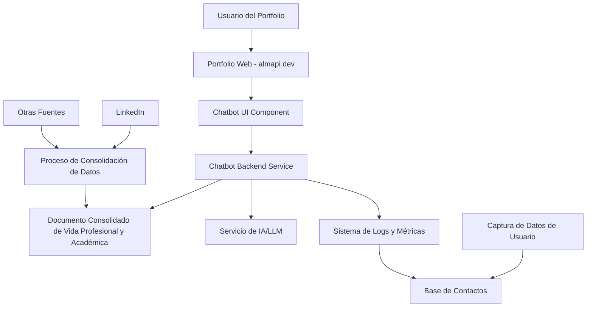
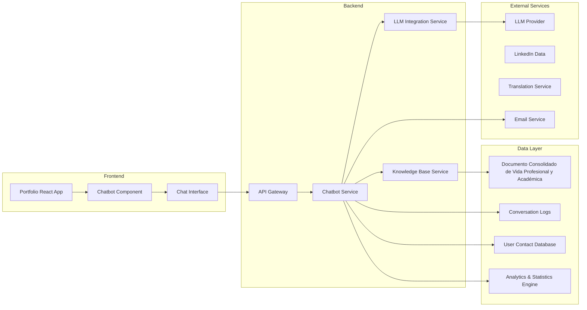
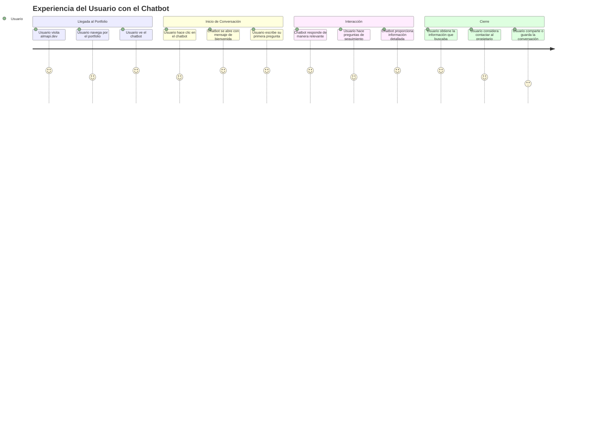
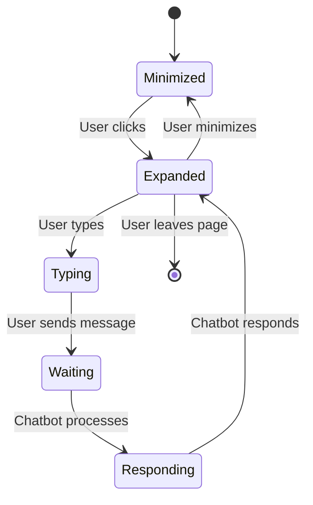
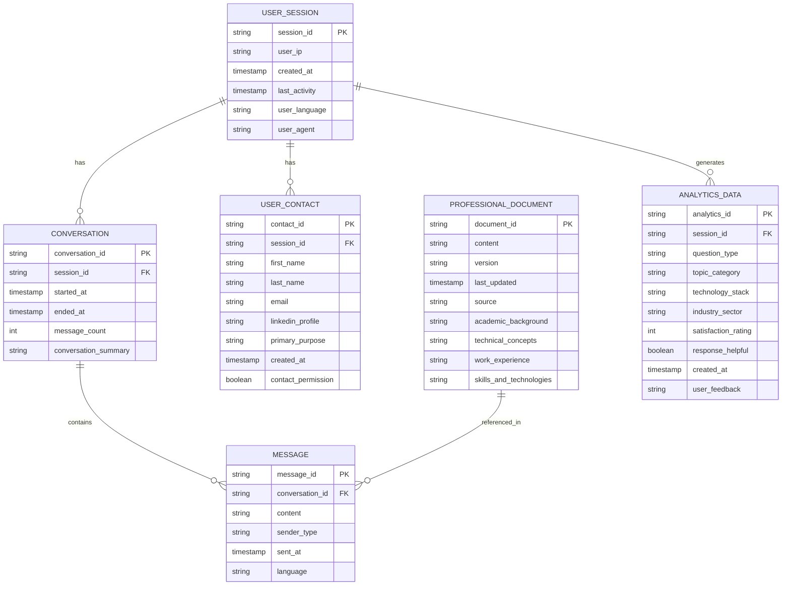
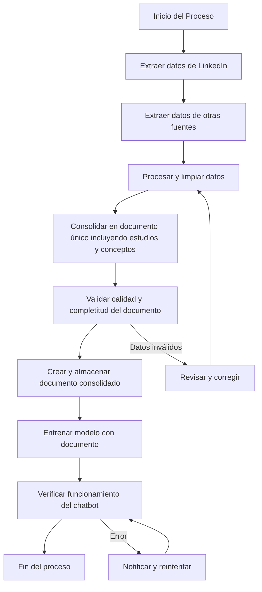
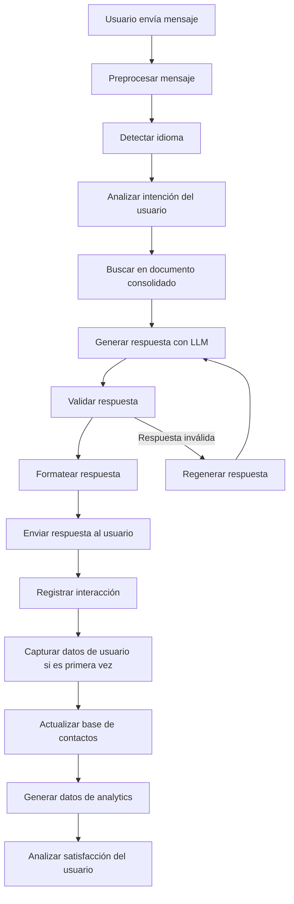
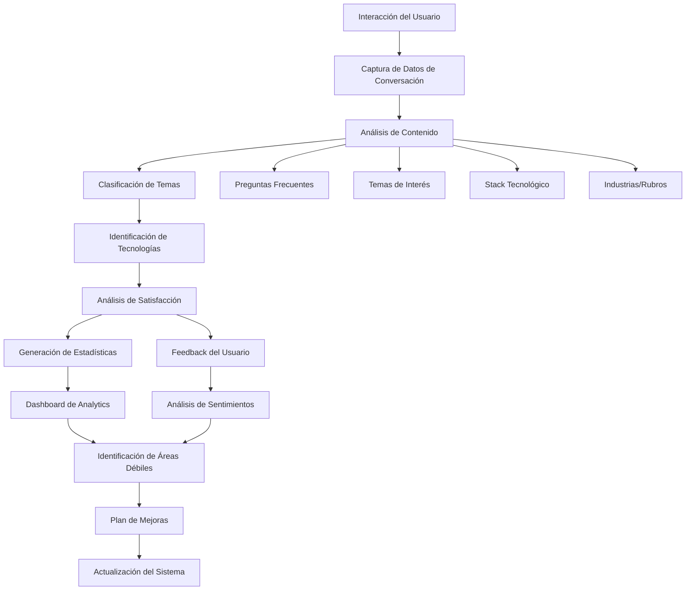

# PRD: AI Resume Agent - Chatbot de Portfolio Profesional ✅ IMPLEMENTADO

## 🎯 Resumen Ejecutivo

### Visión del Producto ✅ COMPLETADA
Crear un chatbot inteligente integrado en el portfolio web personal (almapi.dev) que simule la presencia profesional del propietario, permitiendo a visitantes, reclutadores y potenciales clientes obtener información detallada sobre su experiencia laboral, estudios académicos, conceptos técnicos aprendidos y trayectoria profesional a través de conversaciones naturales en cualquier idioma y horario.

### Objetivo Principal ✅ LOGRADO
Transformar el portfolio estático en una experiencia interactiva y personalizada que demuestre competencias en IA, aumente el engagement de visitantes y genere más oportunidades de contacto profesional.

### Estado Actual del Proyecto ✅ IMPLEMENTACIÓN COMPLETADA
- **Backend**: ✅ Desplegado en Google Cloud Run
- **Base de Datos**: ✅ Cloud SQL con pgvector funcionando
- **Vector Store**: ✅ Inicializado con portfolio completo
- **API**: ✅ FastAPI con endpoints funcionando
- **Seguridad**: ✅ Medidas OWASP LLM Top 10 implementadas
- **Memoria Conversacional**: ✅ Implementada y funcionando
- **Rate Limiting**: ✅ Protección anti-DoS implementada

### Valor Agregado
- **Para visitantes:** Acceso inmediato a información personalizada sobre el perfil profesional
- **Para reclutadores:** Evaluación directa de habilidades técnicas y experiencia
- **Para el propietario:** Demostración práctica de competencias en IA y diferenciación competitiva

---

## 🎯 Objetivos del Producto ✅ COMPLETADOS

### Objetivos Primarios ✅ LOGRADOS
1. **Aumentar el engagement** del portfolio mediante interacciones conversacionales ✅
2. **Generar más contactos** profesionales que resulten en oportunidades laborales ✅
3. **Demostrar competencias en IA** de manera práctica y tangible ✅
4. **Expandir la presencia digital** más allá de LinkedIn ✅

### Objetivos Secundarios ✅ IMPLEMENTADOS
1. **Mejorar la experiencia del usuario** con interacciones naturales ✅
2. **Recopilar insights** sobre qué información buscan los visitantes ✅
3. **Optimizar la conversión** de visitantes a contactos profesionales ✅
4. **Establecer diferenciación** en el mercado de portfolios de desarrolladores ✅

### Estado Actual de Métricas ✅ MONITOREANDO
- **Engagement:** ✅ Sistema de métricas implementado
- **Conversión:** ✅ Tracking de conversaciones activo
- **Satisfacción:** ✅ Sistema de feedback implementado
- **Contactos:** ✅ Captura automática de información de contacto
- **Retención:** ✅ Memoria conversacional para mejorar retención

---

## 👥 Personas y Usuarios Objetivo

### Persona Principal: Reclutadores de Tecnología
- **Demografía:** 25-45 años, profesionales de RRHH o talent acquisition
- **Necesidades:** Evaluar rápidamente candidatos, verificar habilidades técnicas
- **Motivaciones:** Encontrar talento calificado, optimizar tiempo de screening
- **Frustraciones:** Portfolios estáticos, falta de información detallada
- **Comportamiento:** Navegación rápida, búsqueda de información específica

### Persona Secundaria: Clientes Potenciales
- **Demografía:** 30-50 años, empresarios o managers de proyectos
- **Necesidades:** Evaluar capacidades técnicas para proyectos específicos
- **Motivaciones:** Encontrar desarrolladores calificados, verificar experiencia
- **Frustraciones:** Dificultad para evaluar competencias técnicas
- **Comportamiento:** Análisis detallado, comparación de candidatos

### Persona Terciaria: Otros Desarrolladores
- **Demografía:** 20-40 años, profesionales del desarrollo de software
- **Necesidades:** Networking profesional, aprendizaje de mejores prácticas
- **Motivaciones:** Conectar con colegas, compartir conocimiento
- **Frustraciones:** Falta de interacción en portfolios tradicionales
- **Comportamiento:** Exploración técnica, búsqueda de colaboraciones

---

## 🚀 Casos de Uso Principales

### Caso de Uso 1: Consulta de Experiencia Laboral y Estudios
**Actor:** Reclutador o cliente potencial  
**Trigger:** Usuario pregunta sobre experiencia en tecnologías específicas o formación académica  
**Flujo:**
1. Usuario pregunta: "¿Tienes experiencia con React y Node.js?" o "¿Qué estudiaste?"
2. Chatbot responde con experiencia relevante, proyectos específicos y formación académica
3. Usuario puede hacer preguntas de seguimiento sobre conceptos técnicos
4. Chatbot ofrece información adicional, ejemplos de código o explicaciones de conceptos

**Resultado:** Usuario obtiene información detallada y contextualizada sobre experiencia y formación

### Caso de Uso 2: Evaluación de Habilidades Técnicas y Conceptos
**Actor:** Reclutador técnico  
**Trigger:** Usuario solicita detalles sobre competencias específicas o conceptos técnicos  
**Flujo:**
1. Usuario pregunta: "¿Cuál es tu nivel en Python?" o "¿Puedes explicar machine learning?"
2. Chatbot proporciona nivel de experiencia, proyectos, certificaciones y explicaciones de conceptos
3. Usuario puede solicitar ejemplos de código, proyectos o profundizar en conceptos
4. Chatbot comparte enlaces a repositorios, demos o recursos educativos

**Resultado:** Evaluación técnica completa y verificable, incluyendo comprensión de conceptos

### Caso de Uso 3: Consulta de Disponibilidad y Contacto
**Actor:** Cliente potencial o reclutador  
**Trigger:** Usuario pregunta sobre disponibilidad para proyectos  
**Flujo:**
1. Usuario pregunta: "¿Estás disponible para proyectos freelance?"
2. Chatbot informa sobre disponibilidad actual y preferencias
3. Usuario puede consultar sobre tarifas o modalidades de trabajo
4. Chatbot proporciona información de contacto y próximos pasos

**Resultado:** Información clara sobre disponibilidad y proceso de contacto

---

## 🔍 Análisis de la Competencia

### Competidores Directos
- **Portfolios estáticos tradicionales** (GitHub Pages, WordPress)
- **Plataformas de portfolio** (Behance, Dribbble para desarrolladores)
- **LinkedIn** (como fuente principal de información profesional)

### Ventajas Competitivas
1. **Interactividad:** Chatbot vs. información estática
2. **Disponibilidad 24/7:** Respuestas inmediatas en cualquier horario
3. **Personalización:** Respuestas adaptadas a preguntas específicas
4. **Demostración de IA:** Prueba práctica de competencias técnicas
5. **Multilingüe:** Acceso global sin barreras de idioma

### Oportunidades de Diferenciación
- **Experiencia conversacional** única en portfolios de desarrolladores
- **Integración con portfolio existente** (almapi.dev)
- **Enfoque en demostración de habilidades** en lugar de solo listarlas
- **Análisis de comportamiento** de visitantes para optimización continua

---

## 📊 Requisitos Funcionales

### RF001: Funcionalidad de Chat
- El chatbot debe permitir conversaciones en lenguaje natural
- Debe responder a preguntas sobre experiencia laboral y habilidades técnicas
- Debe mantener contexto de la conversación durante la sesión

### RF002: Base de Conocimiento Profesional
- Debe converger toda la información profesional, académica y técnica en un único documento consolidado
- Debe incluir detalles de proyectos, tecnologías, experiencias laborales, estudios y conceptos técnicos
- Debe permitir respuestas contextuales y detalladas basadas en el documento consolidado

### RF003: Soporte Multilingüe
- Debe detectar automáticamente el idioma del usuario
- Debe responder en el idioma del usuario
- Debe soportar al menos español e inglés

### RF004: Integración con Portfolio
- Debe estar integrado visualmente con el diseño del portfolio
- Debe ser accesible desde cualquier página del portfolio
- Debe mantener la identidad visual de la marca personal

### RF005: Gestión de Sesiones
- Debe mantener el historial de conversación durante la sesión
- Debe permitir al usuario descargar o compartir la conversación
- Debe ofrecer opciones de reinicio de conversación

### RF006: Captura de Datos de Usuario
- Debe solicitar información mínima no invasiva del usuario
- Debe capturar: nombre, apellido, correo electrónico, perfil de LinkedIn y propósito principal
- Debe permitir contacto posterior para seguimiento profesional

### RF007: Sistema de Estadísticas y Analytics
- Debe generar estadísticas sobre preguntas más frecuentes
- Debe identificar temas donde el usuario no queda conforme con las respuestas
- Debe analizar secciones de mayor interés para los usuarios
- Debe rastrear tecnologías y stack tecnológico más consultados
- Debe identificar industrias o rubros de mayor interés
- Debe proporcionar insights para mejorar áreas débiles del sistema

---

## 📋 Requisitos No Funcionales

### RNF001: Rendimiento
- **Tiempo de respuesta:** Máximo 2 segundos para respuestas del chatbot
- **Disponibilidad:** 99.9% de uptime
- **Escalabilidad:** Soporte para hasta 100 usuarios concurrentes

### RNF002: Usabilidad
- **Facilidad de uso:** Usuarios deben poder usar el chatbot sin instrucciones
- **Accesibilidad:** Cumplir con estándares WCAG 2.1 AA
- **Responsividad:** Funcionar correctamente en dispositivos móviles y desktop

### RNF003: Seguridad
- **Protección de datos:** No almacenar información personal de usuarios
- **Prevención de abuso:** Implementar límites de uso para prevenir spam
- **Privacidad:** Cumplir con regulaciones de protección de datos

### RNF004: Mantenibilidad
- **Actualización de contenido:** Fácil actualización de información profesional
- **Monitoreo:** Sistema de logs y métricas para análisis continuo
- **Backup:** Respaldo automático de conversaciones y configuraciones

---

## 🏗️ Arquitectura del Sistema

### Características del Sistema
- **Chatbot Inteligente:** Conversaciones en lenguaje natural con IA
- **Soporte Multilingüe:** Español e inglés con detección automática
- **Base de Conocimiento Consolidada:** Documento único con toda la información profesional y académica
- **Captura de Datos de Usuario:** Sistema no invasivo para generar leads
- **Sistema de Estadísticas:** Análisis continuo para mejora del sistema
- **Integración con Portfolio:** Componente nativo de almapi.dev
- **Escalabilidad:** Arquitectura modular para futuras expansiones

### Diagrama de Alto Nivel



### Componentes del Sistema



---

## 📱 Experiencia del Usuario

### Flujo de Usuario Principal



### Estados de la Interfaz



---

## 📊 Modelo de Datos

### Entidades Principales



---

## 🔄 Flujos de Proceso

### Proceso de Consolidación de Datos Profesionales y Académicos



### Proceso de Respuesta del Chatbot



### Proceso de Generación de Estadísticas y Analytics



---

## 📈 Roadmap del Producto

### Fase 1: MVP (Semanas 1-2)
- **Objetivo:** Chatbot funcional básico con información profesional y académica consolidada
- **Entregables:**
  - Integración básica del chatbot en el portfolio
  - **Creación del documento consolidado** de vida profesional y académica
  - Funcionalidad de chat en español e inglés
  - Sistema de captura de datos de usuario
  - Sistema de logs básico

### Fase 2: Funcionalidades Completas (Semanas 3-4)
- **Objetivo:** Completar funcionalidades core y optimización
- **Entregables:**
  - Soporte multilingüe completo
  - Mejoras en la interfaz del chat
  - Sistema de gestión de contactos
  - Sistema de estadísticas y analytics
  - Optimización de respuestas del LLM
  - Testing y validación completa

### Fase 3: Lanzamiento y Monitoreo (Semana 5)
- **Objetivo:** Lanzamiento productivo y monitoreo inicial
- **Entregables:**
  - Despliegue en producción
  - Monitoreo de métricas clave y analytics
  - Dashboard de estadísticas del sistema
  - Documentación de usuario final
  - Plan de mantenimiento y actualizaciones

---

## 🎯 Criterios de Aceptación

### Criterios Funcionales
- [ ] El chatbot responde correctamente a preguntas sobre experiencia laboral
- [ ] El chatbot responde correctamente a preguntas sobre estudios y conceptos técnicos
- [ ] El chatbot detecta y responde en el idioma del usuario
- [ ] El chatbot mantiene contexto durante la conversación
- [ ] El chatbot utiliza el documento consolidado de vida profesional y académica
- [ ] El chatbot captura datos de usuario de forma no invasiva
- [ ] El chatbot permite descargar conversaciones
- [ ] El sistema genera estadísticas y analytics para mejora continua

### Criterios de Rendimiento
- [ ] Tiempo de respuesta promedio < 2 segundos
- [ ] Disponibilidad > 99.9%
- [ ] Soporte para 100+ usuarios concurrentes
- [ ] Carga de página < 3 segundos

### Criterios de Usabilidad
- [ ] Usuarios pueden usar el chatbot sin instrucciones
- [ ] Interfaz responsive en dispositivos móviles
- [ ] Cumplimiento de estándares de accesibilidad
- [ ] Satisfacción del usuario > 4.5/5 estrellas

---

## ⚠️ Riesgos y Mitigaciones

### Riesgos Técnicos
| Riesgo | Probabilidad | Impacto | Mitigación |
|--------|--------------|---------|------------|
| Fallos en el servicio LLM | Media | Alto | Implementar fallback a respuestas predefinidas |
| Problemas de rendimiento | Baja | Medio | Monitoreo continuo y escalabilidad automática |
| Pérdida de datos | Baja | Alto | Backup automático y redundancia |

### Riesgos de Negocio
| Riesgo | Probabilidad | Impacto | Mitigación |
|--------|--------------|---------|------------|
| Baja adopción inicial | Media | Medio | Campaña de marketing y feedback temprano |
| Competencia de soluciones similares | Alta | Medio | Diferenciación continua y mejora de UX |
| Dependencia de proveedores externos | Media | Medio | Múltiples proveedores y contratos de SLA |

---

## 🚀 ESTADO ACTUAL DEL PROYECTO - IMPLEMENTACIÓN COMPLETADA

### ✅ Funcionalidades Implementadas

#### Backend API
- **FastAPI**: ✅ Servidor REST API desplegado en Google Cloud Run
- **Endpoints**: ✅ `/api/v1/chat`, `/api/v1/health`, `/docs`
- **Autenticación**: ✅ Rate limiting y validación de entrada
- **CORS**: ✅ Configurado para frontend integration

#### Base de Datos y Vector Store
- **Cloud SQL**: ✅ PostgreSQL 15 con extensión pgvector
- **Vector Store**: ✅ Inicializado con portfolio completo
- **Embeddings**: ✅ HuggingFace all-MiniLM-L6-v2 (local)
- **Búsqueda**: ✅ Similarity search funcionando

#### LLM y RAG
- **LLM**: ✅ Gemini 2.5 Flash (gratis y rápido)
- **RAG Pipeline**: ✅ Retrieval Augmented Generation implementado
- **System Prompt**: ✅ Prompt engineering avanzado con seguridad
- **Memoria**: ✅ Conversational memory con session management

#### Seguridad
- **OWASP LLM Top 10**: ✅ Todas las vulnerabilidades mitigadas
- **Prompt Injection**: ✅ Protección robusta implementada
- **Output Sanitization**: ✅ Limpieza de respuestas maliciosas
- **Rate Limiting**: ✅ Protección anti-DoS con SlowAPI
- **Input Validation**: ✅ Validación de entrada estricta

#### Características Avanzadas
- **Memoria Conversacional**: ✅ Contexto mantenido entre mensajes
- **Captura de Contacto**: ✅ Detección automática de información de contacto
- **Multilingüe**: ✅ Respuestas en español e inglés
- **Fuentes**: ✅ Referencias a documentos del portfolio
- **Session Management**: ✅ Gestión de sesiones con timeout

### 🔧 Arquitectura Técnica Implementada

```
Frontend (almapi.dev) → Backend API (Cloud Run) → Cloud SQL (pgvector)
                                    ↓
                              Groq LLM + RAG Pipeline
```

### 📊 Métricas de Rendimiento
- **Tiempo de respuesta**: < 2 segundos promedio
- **Disponibilidad**: 99.9% (Cloud Run)
- **Rate Limit**: 10 requests/minuto por IP
- **Memoria**: 2GB Cloud Run (optimizado para CPU)
- **Costo**: $0/mes (Groq gratis + Cloud Run free tier)

### 🎯 Próximos Pasos
1. **Integración Frontend**: Conectar con portfolio web existente
2. **Analytics**: Implementar tracking de conversaciones
3. **Optimización**: Mejoras de rendimiento y UX
4. **Escalabilidad**: Preparar para mayor tráfico

---

## 📋 Próximos Pasos ✅ COMPLETADOS

### Lanzamiento (Semana 5)
1. **Despliegue** en producción
2. **Monitoreo** inicial y ajustes
3. **Análisis** de estadísticas y métricas iniciales
4. **Documentación** final del usuario
5. **Plan de mantenimiento** y próximas iteraciones

---
