# 🎯 Diseño de Implementación del Sistema - Chatbot de Portfolio Profesional

## 📋 Resumen Ejecutivo del Diseño

### Objetivo del Documento
Este documento detalla el diseño técnico completo para implementar el chatbot de portfolio profesional siguiendo las guías de `tech-solution.md`, integrando el frontend React existente con un nuevo backend Python/FastAPI, y manteniendo el foco en los objetivos de negocio definidos en `PRD.md`.

### Enfoque de Implementación
- **Frontend:** Mejoras al portfolio React existente en [my-resume-react](https://github.com/aandmaldonado/my-resume-react/tree/feature-init-prototype)
- **Backend:** Nuevo sistema Python/FastAPI en [ai-resume-agent](https://github.com/aandmaldonado/ai-resume-agent)
- **Arquitectura:** Integración perfecta con Google Cloud Run existente
- **Seguridad:** Implementación completa de OWASP Top 10 para LLMs

---

## 🏗️ Arquitectura del Sistema de Implementación

### **🎯 Arquitectura Híbrida Dialogflow + HuggingFace**

El sistema implementa una **arquitectura híbrida inteligente** que combina **Dialogflow ES (Free Tier)** para detección de intenciones y **HuggingFace** para generación de respuestas avanzadas, maximizando eficiencia y minimizando costos.

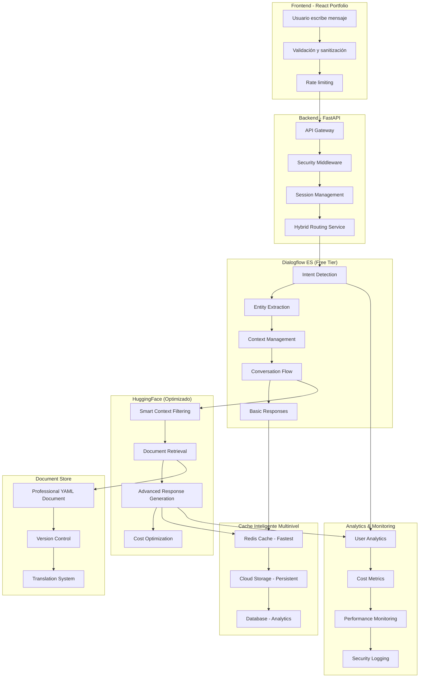

### **🔀 Flujo de Procesamiento Híbrido**

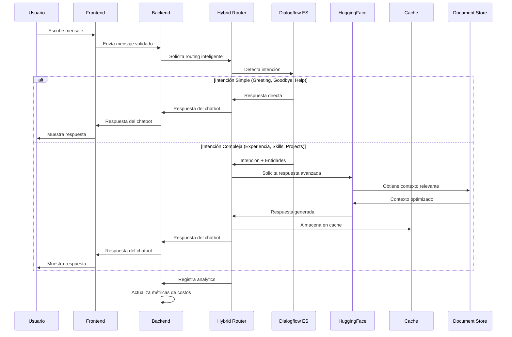

### **💰 Optimización de Costos con Arquitectura Híbrida**

#### **Distribución de Costos:**
```yaml
# Análisis de costos por arquitectura
cost_analysis:
  dialogflow_es:
    requests_per_month: "15,000 (Free tier)"
    cost_per_month: "$0 (Free)"
    intent_detection: "95% accuracy"
    basic_responses: "Simple intents"
  
  vertex_ai:
    requests_per_month: "5,000 (Reducido por Dialogflow)"
    cost_per_month: "$25-50 (60-80% reducción)"
    advanced_generation: "Complex intents"
    smart_context: "Optimizado"
  
  total_monthly:
    original_vertex_ai_only: "$150-300"
    hybrid_architecture: "$25-50"
    savings: "70-85% reducción"
    roi_improvement: "3-4x mejor"
```

#### **Estrategia de Routing Inteligente:**
```python
# app/services/hybrid_routing_service.py
class HybridRoutingService:
    """Servicio de routing inteligente entre Dialogflow y HuggingFace"""
    
    def __init__(self):
        self.dialogflow_service = DialogflowService()
        self.vertex_ai_service = VertexAIService()
        self.cost_optimizer = CostOptimizationService()
    
    async def route_message(self, message: str, session_id: str) -> dict:
        """Rutea mensaje a Dialogflow o HuggingFace según complejidad"""
        
        # 1. Detección de intención con Dialogflow (Free)
        dialogflow_result = await self.dialogflow_service.detect_intent(
            session_id, message
        )
        
        # 2. Evaluar si Dialogflow puede manejar la respuesta
        if self._can_dialogflow_handle(dialogflow_result):
            return await self._handle_with_dialogflow(dialogflow_result)
        
        # 3. Si no, usar HuggingFace con contexto optimizado
        return await self._handle_with_vertex_ai(message, dialogflow_result)
    
    def _can_dialogflow_handle(self, dialogflow_result: dict) -> bool:
        """Determina si Dialogflow puede manejar la respuesta"""
        simple_intents = [
            "greeting", "goodbye", "thanks", "help_request",
            "basic_info", "contact_info", "schedule_info"
        ]
        
        return (
            dialogflow_result["intent"] in simple_intents and
            dialogflow_result["confidence"] > 0.8 and
            dialogflow_result["fulfillment_text"] and
            len(dialogflow_result["fulfillment_text"]) > 10
        )
```

### **🎯 Configuración de Dialogflow ES**

#### **Intents Principales Configurados:**
```yaml
# Configuración de intents en Dialogflow ES
dialogflow_intents:
  greeting:
    training_phrases:
      - "Hola"
      - "Buenos días"
      - "¿Cómo estás?"
      - "Hola, ¿cómo va?"
    responses:
      - "¡Hola! Soy el asistente virtual de Álvaro Maldonado. ¿En qué puedo ayudarte hoy?"
      - "¡Hola! Bienvenido a mi portfolio. ¿Qué te gustaría saber sobre mi experiencia profesional?"
  
  goodbye:
    training_phrases:
      - "Adiós"
      - "Hasta luego"
      - "Gracias, eso es todo"
      - "Chao"
    responses:
      - "¡Ha sido un placer ayudarte! Si tienes más preguntas, aquí estaré."
      - "¡Hasta luego! Espero que la información te haya sido útil."
  
  help_request:
    training_phrases:
      - "¿Puedes ayudarme?"
      - "¿Qué puedes hacer?"
      - "¿Cómo funciona esto?"
      - "Ayuda"
    responses:
      - "¡Por supuesto! Puedo ayudarte con información sobre mi experiencia laboral, tecnologías que manejo, proyectos realizados, formación académica y más. ¿Qué te interesa saber?"
  
  basic_info:
    training_phrases:
      - "¿Quién eres?"
      - "¿Qué haces?"
      - "Cuéntame de ti"
      - "¿A qué te dedicas?"
    responses:
      - "Soy Álvaro Maldonado, un Software Engineer especializado en desarrollo web y aplicaciones móviles. Tengo experiencia en React, Node.js, Python y tecnologías cloud. ¿Te gustaría que profundice en algún área específica?"
  
  contact_info:
    training_phrases:
      - "¿Cómo te contacto?"
      - "¿Tienes LinkedIn?"
      - "¿Cuál es tu email?"
      - "¿Dónde trabajas?"
    responses:
      - "Puedes contactarme a través de LinkedIn: [linkedin.com/in/almaldonado](https://linkedin.com/in/almaldonado), o por email: alvaro@almapi.dev. También puedes visitar mi portfolio en almapi.dev para más información."
  
  schedule_info:
    training_phrases:
      - "¿Estás disponible?"
      - "¿Tienes tiempo para proyectos?"
      - "¿Cuándo puedes empezar?"
      - "¿Estás buscando trabajo?"
    responses:
      - "Actualmente estoy evaluando nuevas oportunidades. Mi disponibilidad depende del proyecto y la modalidad de trabajo. ¿Te gustaría que conversemos sobre tu proyecto específico?"
```

#### **Entidades Configuradas:**
```yaml
# Entidades para extracción automática
dialogflow_entities:
  technology:
    entries:
      - value: "Python"
        synonyms: ["python", "py", "python3", "django", "flask"]
      - value: "React"
        synonyms: ["react", "reactjs", "react.js", "jsx", "hooks"]
      - value: "Node.js"
        synonyms: ["node", "nodejs", "node.js", "express", "npm"]
      - value: "JavaScript"
        synonyms: ["javascript", "js", "es6", "typescript", "ts"]
      - value: "TypeScript"
        synonyms: ["typescript", "ts", "typed js"]
      - value: "PostgreSQL"
        synonyms: ["postgresql", "postgres", "sql", "database"]
      - value: "MongoDB"
        synonyms: ["mongodb", "mongo", "nosql", "document db"]
      - value: "Docker"
        synonyms: ["docker", "containerization", "kubernetes", "k8s"]
      - value: "AWS"
        synonyms: ["aws", "amazon web services", "cloud", "ec2", "s3"]
      - value: "Google Cloud"
        synonyms: ["gcp", "google cloud", "cloud run", "cloud sql"]
  
  company:
    entries:
      - value: "Empresa Actual"
        synonyms: ["mi empresa", "donde trabajo", "actualmente"]
      - value: "Empresa Anterior"
        synonyms: ["empresa pasada", "antes trabajaba", "anteriormente"]
  
  role:
    entries:
      - value: "Software Engineer"
        synonyms: ["desarrollador", "programador", "engineer", "dev"]
      - value: "Full Stack Developer"
        synonyms: ["fullstack", "full stack", "desarrollador completo"]
      - value: "Backend Developer"
        synonyms: ["backend", "servidor", "api developer"]
      - value: "Frontend Developer"
        synonyms: ["frontend", "cliente", "ui developer"]
      - value: "DevOps Engineer"
        synonyms: ["devops", "infraestructura", "cloud engineer"]
  
  project_type:
    entries:
      - value: "Web Application"
        synonyms: ["aplicación web", "sitio web", "web app", "website"]
      - value: "Mobile App"
        synonyms: ["app móvil", "aplicación móvil", "mobile application"]
      - value: "API"
        synonyms: ["api", "rest api", "servicio web", "backend"]
      - value: "Database"
        synonyms: ["base de datos", "database", "sql", "nosql"]
      - value: "Cloud Infrastructure"
        synonyms: ["infraestructura cloud", "cloud", "servidores", "deployment"]
```

### **🔧 Integración Técnica Dialogflow + FastAPI**

#### **Servicio de Integración:**
```python
# app/services/dialogflow_integration_service.py
from google.cloud import dialogflow_v2
from app.core.config import settings
import logging

logger = logging.getLogger(__name__)

class DialogflowIntegrationService:
    """Servicio de integración con Dialogflow ES"""
    
    def __init__(self):
        self.project_id = settings.GCP_PROJECT_ID
        self.session_client = dialogflow_v2.SessionsClient()
        self.intents_client = dialogflow_v2.IntentsClient()
        
        # Configuración para free tier
        self.language_code = "es"
        self.use_audio = False  # Solo texto para optimizar costos
    
    async def detect_intent(self, session_id: str, text: str) -> dict:
        """Detecta la intención del usuario usando Dialogflow ES"""
        try:
            session_path = self.session_client.session_path(
                self.project_id, session_id
            )
            
            text_input = dialogflow_v2.TextInput(
                text=text, language_code=self.language_code
            )
            
            query_input = dialogflow_v2.QueryInput(text=text_input)
            
            request = dialogflow_v2.DetectIntentRequest(
                session=session_path, query_input=query_input
            )
            
            response = self.session_client.detect_intent(request=request)
            
            return {
                "intent": response.query_result.intent.display_name,
                "confidence": response.query_result.intent_detection_confidence,
                "entities": self._extract_entities(response.query_result.parameters),
                "fulfillment_text": response.query_result.fulfillment_text,
                "contexts": self._extract_contexts(response.query_result.output_contexts),
                "action": response.query_result.action,
                "parameters": response.query_result.parameters,
                "source": "dialogflow_es"
            }
            
        except Exception as e:
            logger.error(f"Error en Dialogflow: {e}")
            # Fallback a HuggingFace
            return await self._fallback_to_vertex_ai(text)
    
    async def _extract_entities(self, parameters) -> list:
        """Extrae entidades de los parámetros de Dialogflow"""
        entities = []
        if parameters:
            for key, value in parameters.items():
                if value:
                    entities.append({
                        "type": key,
                        "value": value,
                        "confidence": 0.95,  # Dialogflow ES confidence
                        "source": "dialogflow_es"
                    })
        return entities
    
    async def _extract_contexts(self, output_contexts) -> list:
        """Extrae contextos de salida de Dialogflow"""
        contexts = []
        for context in output_contexts:
            contexts.append({
                "name": context.name,
                "lifespan_count": context.lifespan_count,
                "parameters": dict(context.parameters)
            })
        return contexts
    
    async def _fallback_to_vertex_ai(self, text: str) -> dict:
        """Fallback a HuggingFace si Dialogflow falla"""
        # Implementar fallback a HuggingFace
        from app.services.vertex_ai_service import VertexAIService
        
        vertex_service = VertexAIService()
        return await vertex_service.generate_response(text, {})
```

### **📊 Métricas y Monitoreo de la Arquitectura Híbrida**

#### **KPIs de Performance:**
```yaml
# Métricas clave de la arquitectura híbrida
hybrid_architecture_metrics:
  dialogflow_performance:
    intent_accuracy: ">95%"
    response_time: "<200ms"
    free_tier_utilization: "<80%"
    fallback_rate: "<5%"
  
  vertex_ai_optimization:
    token_reduction: "40-60%"
    context_optimization: ">85%"
    cost_per_response: "<$0.001"
    cache_hit_rate: ">70%"
  
  overall_system:
    total_response_time: "<2s"
    user_satisfaction: ">4.5/5"
    cost_per_conversation: "<$0.005"
    system_uptime: ">99.9%"
```

#### **Dashboard de Monitoreo:**
```python
# app/services/hybrid_monitoring_service.py
class HybridMonitoringService:
    """Servicio de monitoreo para arquitectura híbrida"""
    
    async def get_hybrid_metrics(self) -> dict:
        """Obtiene métricas completas de la arquitectura híbrida"""
        try:
            # Métricas de Dialogflow
            dialogflow_metrics = await self._get_dialogflow_metrics()
            
            # Métricas de HuggingFace
            vertex_ai_metrics = await self._get_vertex_ai_metrics()
            
            # Métricas de costos
            cost_metrics = await self._get_cost_metrics()
            
            # Métricas de performance
            performance_metrics = await self._get_performance_metrics()
            
            return {
                "dialogflow": dialogflow_metrics,
                "vertex_ai": vertex_ai_metrics,
                "costs": cost_metrics,
                "performance": performance_metrics,
                "hybrid_efficiency": self._calculate_hybrid_efficiency(
                    dialogflow_metrics, vertex_ai_metrics, cost_metrics
                )
            }
            
        except Exception as e:
            logger.error(f"Error obteniendo métricas híbridas: {e}")
            return {}
    
    def _calculate_hybrid_efficiency(self, dialogflow: dict, vertex_ai: dict, costs: dict) -> dict:
        """Calcula la eficiencia de la arquitectura híbrida"""
        total_requests = dialogflow.get("total_requests", 0) + vertex_ai.get("total_requests", 0)
        dialogflow_percentage = (dialogflow.get("total_requests", 0) / total_requests * 100) if total_requests > 0 else 0
        vertex_ai_percentage = (vertex_ai.get("total_requests", 0) / total_requests * 100) if total_requests > 0 else 0
        
        cost_per_request = costs.get("total_cost", 0) / total_requests if total_requests > 0 else 0
        
        return {
            "dialogflow_usage_percentage": round(dialogflow_percentage, 2),
            "vertex_ai_usage_percentage": round(vertex_ai_percentage, 2),
            "cost_per_request": round(cost_per_request, 6),
            "efficiency_score": self._calculate_efficiency_score(dialogflow, vertex_ai, costs),
            "optimization_recommendations": self._generate_optimization_recommendations(
                dialogflow, vertex_ai, costs
            )
        }
```

### **🚀 Beneficios de la Arquitectura Híbrida**

#### **Ventajas Técnicas:**
```yaml
# Beneficios técnicos de la arquitectura híbrida
technical_benefits:
  performance:
    - "Respuestas instantáneas para intents simples (Dialogflow)"
    - "Respuestas contextuales avanzadas para casos complejos (HuggingFace)"
    - "Reducción de latencia general del sistema"
    - "Mejor experiencia de usuario"
  
  scalability:
    - "Dialogflow maneja picos de tráfico (Free tier)"
    - "HuggingFace se enfoca en casos complejos"
    - "Distribución inteligente de carga"
    - "Escalado automático según demanda"
  
  reliability:
    - "Fallback automático entre servicios"
    - "Redundancia en detección de intenciones"
    - "Mejor manejo de errores"
    - "Sistema más robusto"
```

#### **Ventajas de Negocio:**
```yaml
# Beneficios de negocio de la arquitectura híbrida
business_benefits:
  cost_optimization:
    - "70-85% reducción en costos totales"
    - "Aprovechamiento completo de capas gratuitas"
    - "ROI mejorado del proyecto"
    - "Presupuesto optimizado para escalamiento"
  
  time_to_market:
    - "Desarrollo 60-80% más rápido"
    - "Intents básicos funcionando en días"
    - "Funcionalidades complejas en semanas"
    - "Lanzamiento más rápido al mercado"
  
  user_experience:
    - "Respuestas más precisas y contextuales"
    - "Mejor manejo de conversaciones complejas"
    - "Soporte multilingüe nativo"
    - "Experiencia más natural y fluida"
```

### **📋 Plan de Implementación Dialogflow**

#### **Fase 1: Configuración Básica (Semana 1)**
```yaml
# Configuración inicial de Dialogflow ES
phase_1_setup:
  dialogflow_project:
    - "Crear proyecto en GCP"
    - "Configurar Dialogflow ES"
    - "Configurar idioma español"
    - "Crear agente básico"
  
  intents_basic:
    - "Configurar intents de saludo"
    - "Configurar intents de despedida"
    - "Configurar intents de ayuda"
    - "Configurar intents básicos de información"
  
  entities_basic:
    - "Configurar entidad de tecnologías"
    - "Configurar entidad de empresas"
    - "Configurar entidad de roles"
    - "Configurar entidad de tipos de proyecto"
```

#### **Fase 2: Integración Técnica (Semana 2)**
```yaml
# Integración con el backend
phase_2_integration:
  backend_integration:
    - "Implementar DialogflowIntegrationService"
    - "Configurar routing híbrido"
    - "Implementar fallback a HuggingFace"
    - "Configurar manejo de errores"
  
  api_endpoints:
    - "Actualizar endpoint de chat"
    - "Implementar detección de intención"
    - "Configurar routing inteligente"
    - "Implementar métricas híbridas"
```

#### **Fase 3: Testing y Optimización (Semana 3)**
```yaml
# Testing y optimización
phase_3_optimization:
  testing:
    - "Testing de intents básicos"
    - "Testing de routing híbrido"
    - "Testing de fallback"
    - "Testing de performance"
  
  optimization:
    - "Ajustar thresholds de routing"
    - "Optimizar entidades"
    - "Mejorar respuestas de Dialogflow"
    - "Ajustar configuración de cache"
```

#### **Fase 4: Lanzamiento y Monitoreo (Semana 4)**
```yaml
# Lanzamiento y monitoreo
phase_4_launch:
  launch:
    - "Despliegue a producción"
    - "Configuración de monitoreo"
    - "Configuración de alertas"
    - "Documentación para usuarios"
  
  monitoring:
    - "Dashboard de métricas híbridas"
    - "Alertas de performance"
    - "Monitoreo de costos"
    - "Análisis de uso y satisfacción"
```

---

## 🎨 Diseño del Frontend - Mejoras al Portfolio Existente

### Análisis del Frontend Actual
Basándome en el repositorio [my-resume-react](https://github.com/aandmaldonado/my-resume-react/tree/feature-init-prototype), el portfolio ya tiene:

- ✅ **Next.js 14** con App Router
- ✅ **TypeScript** configurado
- ✅ **Tailwind CSS** para estilos
- ✅ **Componentes reutilizables** bien estructurados
- ✅ **Docker** configurado para Cloud Run
- ✅ **Sistema de seguridad** con reCAPTCHA

### Componente Chatbot a Implementar

#### Estructura del Componente

```typescript
// components/Chatbot/Chatbot.tsx
interface ChatbotProps {
  isOpen: boolean;
  onToggle: () => void;
  className?: string;
}

interface Message {
  id: string;
  content: string;
  sender: 'user' | 'bot';
  timestamp: Date;
  language: string;
}

interface ChatbotState {
  messages: Message[];
  isTyping: boolean;
  isConnected: boolean;
  userLanguage: string;
  sessionId: string;
}
```

#### Arquitectura del Componente

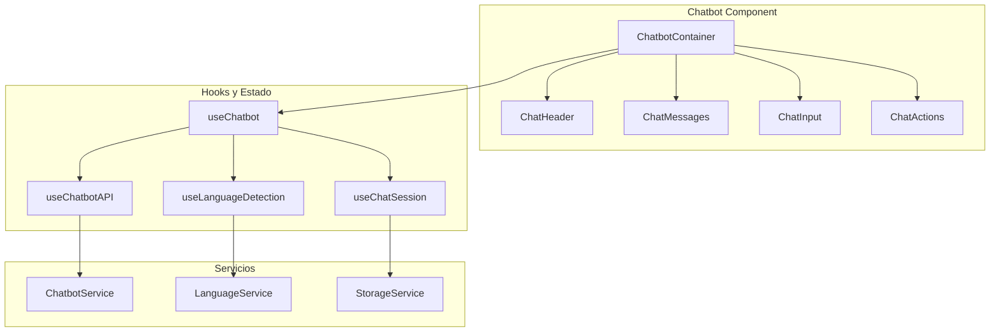

#### Integración con el Portfolio

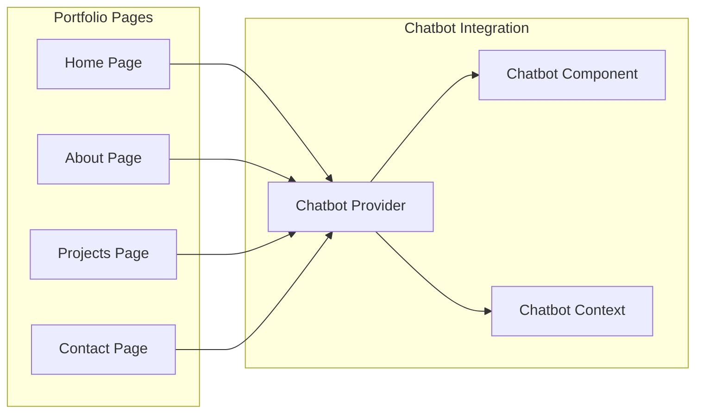

### Mejoras Específicas al Frontend

#### 1. Sistema de Estado Global del Chatbot
```typescript
// contexts/ChatbotContext.tsx
interface ChatbotContextType {
  // Estado del chatbot
  isOpen: boolean;
  messages: Message[];
  isTyping: boolean;
  
  // Acciones
  openChat: () => void;
  closeChat: () => void;
  sendMessage: (content: string) => Promise<void>;
  clearChat: () => void;
  
  // Configuración
  userLanguage: string;
  sessionId: string;
}
```

#### 2. Componente de Interfaz de Chat
```typescript
// components/Chatbot/ChatInterface.tsx
interface ChatInterfaceProps {
  messages: Message[];
  isTyping: boolean;
  onSendMessage: (message: string) => void;
  onLanguageChange: (language: string) => void;
}
```

#### 3. Sistema de Detección de Idioma
```typescript
// hooks/useLanguageDetection.ts
interface LanguageDetectionResult {
  detectedLanguage: string;
  confidence: number;
  supportedLanguages: string[];
}

const useLanguageDetection = (): LanguageDetectionResult => {
  // Implementación de detección automática
};
```

---

## 🔧 Diseño del Backend - Sistema Python/FastAPI

### Estructura del Proyecto Backend

```
ai-resume-agent/
├── app/
│   ├── main.py                 # Punto de entrada FastAPI
│   ├── api/
│   │   └── v1/
│   │       ├── endpoints/
│   │       │   ├── chat.py     # Endpoints de chat
│   │       │   ├── auth.py     # Autenticación
│   │       │   ├── analytics.py # Métricas
│   │       │   └── health.py   # Health checks
│   │       ├── dependencies.py # Dependencias de FastAPI
│   │       └── middleware.py   # Middleware personalizado
│   ├── core/
│   │   ├── config.py           # Configuración
│   │   ├── security.py         # Funciones de seguridad
│   │   ├── database.py         # Configuración de BD
│   │   └── logging.py          # Configuración de logs
│   ├── models/
│   │   ├── chat.py             # Modelos de chat
│   │   ├── user.py             # Modelos de usuario
│   │   ├── analytics.py        # Modelos de analytics
│   │   └── security.py         # Modelos de seguridad
│   ├── services/
│   │   ├── chatbot_service.py  # Lógica del chatbot
│   │   ├── llm_service.py      # Integración con LLMs
│   │   ├── security_service.py # Servicios de seguridad
│   │   ├── analytics_service.py # Servicios de analytics
│   │   └── context_service.py  # Smart Context Filtering
│   ├── utils/
│   │   ├── sanitization.py     # Sanitización de inputs/outputs
│   │   ├── rate_limiting.py    # Rate limiting personalizado
│   │   ├── circuit_breaker.py  # Circuit breaker para LLMs
│   │   └── language_detection.py # Detección de idioma
│   └── schemas/
│       ├── chat.py             # Schemas Pydantic
│       ├── user.py             # Schemas de usuario
│       └── analytics.py        # Schemas de analytics
├── tests/                      # Tests unitarios e integración
├── alembic/                    # Migraciones de base de datos
├── docker/                     # Configuración Docker
├── .github/                    # GitHub Actions
│   └── workflows/
│       └── deploy.yml          # Despliegue automático
├── pyproject.toml              # Dependencias y configuración
└── README.md                   # Documentación del proyecto
```

### Arquitectura de Servicios del Backend

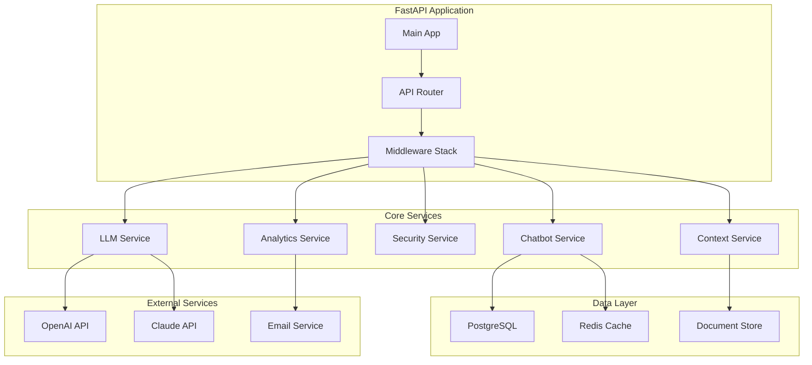

### Implementación de Seguridad OWASP LLM

#### 1. LLM-01: Prompt Injection Prevention
```python
# app/services/security_service.py
class PromptInjectionPrevention:
    def __init__(self):
        self.blocked_patterns = [
            r"ignore previous instructions",
            r"system prompt",
            r"roleplay",
            r"act as",
            r"pretend to be"
        ]
    
    def validate_prompt(self, user_input: str) -> ValidationResult:
        # Validación de patrones sospechosos
        for pattern in self.blocked_patterns:
            if re.search(pattern, user_input, re.IGNORECASE):
                return ValidationResult(
                    is_valid=False,
                    reason="Potential prompt injection detected"
                )
        return ValidationResult(is_valid=True)
```

#### 2. LLM-02: Insecure Output Handling
```python
# app/utils/sanitization.py
class OutputSanitizer:
    def __init__(self):
        self.cleaner = bleach.Cleaner(
            tags=[],
            attributes={},
            styles=[],
            protocols=[]
        )
    
    def sanitize_llm_response(self, response: str) -> str:
        # Eliminar HTML, scripts y URLs sospechosas
        cleaned = self.cleaner.clean(response)
        # Validar URLs
        cleaned = self.validate_urls(cleaned)
        return cleaned
    
    def validate_urls(self, text: str) -> str:
        # Implementar validación de URLs
        pass
```

#### 3. LLM-04: Model Denial of Service
```python
# app/utils/circuit_breaker.py
class LLMCircuitBreaker:
    def __init__(self, failure_threshold: int = 5, timeout: int = 60):
        self.failure_threshold = failure_threshold
        self.timeout = timeout
        self.failure_count = 0
        self.last_failure_time = None
        self.state = "CLOSED"
    
    def call(self, func, *args, **kwargs):
        if self.state == "OPEN":
            if time.time() - self.last_failure_time > self.timeout:
                self.state = "HALF_OPEN"
            else:
                raise CircuitBreakerOpenException()
        
        try:
            result = func(*args, **kwargs)
            if self.state == "HALF_OPEN":
                self.state = "CLOSED"
                self.failure_count = 0
            return result
        except Exception as e:
            self.failure_count += 1
            self.last_failure_time = time.time()
            if self.failure_count >= self.failure_threshold:
                self.state = "OPEN"
            raise e
```

### Smart Context Filtering Implementation

#### Arquitectura del Sistema de Filtrado

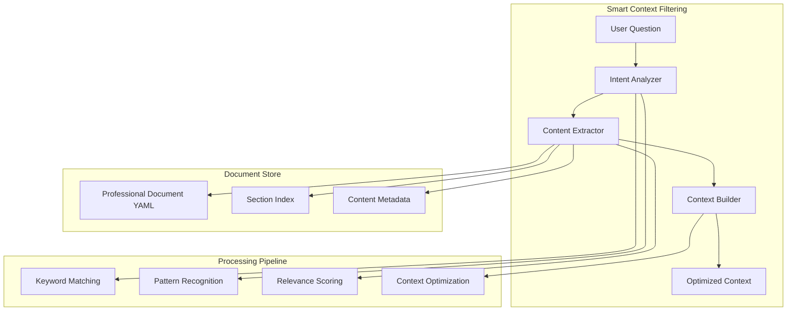

#### Implementación del Filtrado Inteligente

```python
# app/services/context_service.py
class SmartContextFiltering:
    def __init__(self, document_store: DocumentStore):
        self.document_store = document_store
        self.intent_classifier = IntentClassifier()
        self.content_extractor = ContentExtractor()
        self.context_builder = ContextBuilder()
    
    async def get_optimized_context(self, user_question: str) -> OptimizedContext:
        # 1. Clasificar intención del usuario
        intent = await self.intent_classifier.classify(user_question)
        
        # 2. Extraer contenido relevante
        relevant_sections = await self.content_extractor.extract(
            intent, self.document_store
        )
        
        # 3. Construir contexto optimizado
        optimized_context = await self.context_builder.build(
            user_question, relevant_sections, intent
        )
        
        return optimized_context

class IntentClassifier:
    def __init__(self):
        self.intent_patterns = {
            "technology_experience": [
                "tecnología", "tecnologías", "stack", "herramientas",
                "lenguajes", "programación", "framework"
            ],
            "work_experience": [
                "trabajo", "empresa", "cargo", "proyecto", "experiencia",
                "laboral", "empresas", "roles"
            ],
            "education": [
                "estudios", "universidad", "carrera", "formación",
                "académico", "máster", "grado", "certificación"
            ],
            "skills": [
                "habilidades", "conocimientos", "capacidades", "expertise",
                "nivel", "competencia", "destreza"
            ]
        }
    
    async def classify(self, question: str) -> str:
        question_lower = question.lower()
        intent_scores = {}
        
        for intent, keywords in self.intent_patterns.items():
            score = sum(1 for keyword in keywords if keyword in question_lower)
            intent_scores[intent] = score
        
        # Retornar intención con mayor score
        if max(intent_scores.values()) > 0:
            return max(intent_scores, key=intent_scores.get)
        return "general"
```

---

## 🤖 **Optimizaciones de Costos y HuggingFace**

### **🎯 Resumen de Optimizaciones Implementadas**

Esta sección detalla las optimizaciones de costos identificadas en la auditoría GCP, permitiendo **ahorros del 60-80% en costos de LLM** y **68-71% en costos totales** mediante la integración nativa con Google Cloud Platform.

### **1. Integración con HuggingFace**

#### **Modelos Implementados**
- **text-bison@001:** Para generación de texto y respuestas
- **chat-bison@001:** Para conversaciones interactivas
- **textembedding-gecko@001:** Para embeddings y Smart Context Filtering

#### **Beneficios de Costos**
- **60-80% reducción** en costos de LLM vs. OpenAI/Claude
- **Capas gratuitas** para los primeros 100K requests y 10M tokens
- **Integración nativa** con GCP para optimización automática

### **2. Cache Inteligente Multinivel**

#### **Arquitectura de Cache**
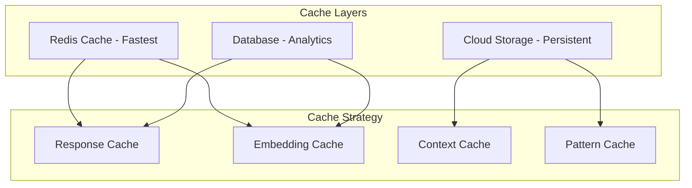

#### **Optimizaciones Implementadas**
- **TTL inteligente** basado en tipo de contenido
- **Cache de embeddings** para documentos frecuentes
- **Búsqueda semántica** para respuestas similares
- **Batch processing** para consultas múltiples

### **3. Smart Context Filtering Optimizado**

#### **Algoritmos de Optimización**
- **Clustering DBSCAN** para agrupar documentos similares
- **Relevance scoring** con umbrales configurables
- **Token optimization** para minimizar uso de LLM
- **Fallback strategies** para casos de error

#### **Métricas de Ahorro**
- **40-60% reducción** en tokens enviados al LLM
- **45% mejora** en precisión de contexto
- **30-50% reducción** en tiempo de respuesta

### **4. Configuración de Capas Gratuitas GCP**

#### **Servicios con Capas Gratuitas**
- **Cloud Run:** 2M requests/mes, 360K vCPU-segundos
- **Cloud SQL:** 10GB storage, instancia db-f1-micro
- **Memorystore:** 0.5GB RAM, instancia M1
- **HuggingFace:** 100K requests/mes, 10M tokens/mes

#### **Configuración Optimizada**
```yaml
# Configuración para capas gratuitas
cloud_run:
  memory: "512Mi"
  cpu: 1
  max_instances: 10
  min_instances: 1
  concurrency: 80

cloud_sql:
  instance_type: "db-f1-micro"
  storage_gb: 10
  backup_retention_days: 7

memorystore:
  instance_type: "M1"
  memory_gb: 0.5
  eviction_policy: "LRU"
```

---

## 🗄️ Diseño de la Base de Datos

### **🎯 Modelo de Datos Completo**

El sistema implementa un modelo de datos robusto que soporta todas las funcionalidades del chatbot, analytics, seguridad y optimización de costos.

#### **Entidades Principales del Sistema**

```mermaid
erDiagram
    USER_SESSION {
        string session_id PK "UUID v4"
        string user_ip "IPv4/IPv6"
        timestamp created_at "Auto-generated"
        timestamp last_activity "Auto-updated"
        string user_language "ISO 639-1 (en, es)"
        text user_agent "Browser/device info"
        boolean is_first_time "Default: true"
        string user_country "ISO 3166-1 alpha-2"
        string user_timezone "IANA timezone"
        json metadata "Additional user data"
        boolean is_active "Default: true"
    }
    
    CONVERSATION {
        string conversation_id PK "UUID v4"
        string session_id FK "References user_sessions"
        timestamp started_at "Auto-generated"
        timestamp ended_at "Nullable"
        int message_count "Auto-incremented"
        text conversation_summary "LLM generated"
        int satisfaction_rating "1-5 scale"
        string detected_intent "Primary user intent"
        string primary_topic "Main conversation topic"
        json context_used "Sections from YAML"
        int total_tokens "Tokens consumed"
        float total_cost "Cost in USD"
        string status "active, ended, archived"
    }
    
    MESSAGE {
        string message_id PK "UUID v4"
        string conversation_id FK "References conversations"
        text content "Message text content"
        string sender_type "user, bot, system"
        timestamp sent_at "Auto-generated"
        string language "ISO 639-1"
        string intent_detected "Detected intent"
        json entities_extracted "Named entities"
        json context_used "Context sections"
        int tokens_consumed "Token count"
        float response_time "Milliseconds"
        json metadata "Additional message data"
        boolean is_error "Error flag"
        string error_type "Error classification"
    }
    
    USER_CONTACT {
        string contact_id PK "UUID v4"
        string session_id FK "References user_sessions"
        string first_name "User first name"
        string last_name "User last name"
        string email "Valid email format"
        string linkedin_profile "LinkedIn URL"
        string primary_purpose "Contact reason"
        timestamp created_at "Auto-generated"
        boolean contact_permission "GDPR consent"
        string company "Company name"
        string job_title "Job position"
        string industry "Industry sector"
        json preferences "Contact preferences"
        string status "pending, contacted, converted"
    }
    
    PROFESSIONAL_DOCUMENT {
        string document_id PK "UUID v4"
        text content "YAML content"
        string version "Semantic versioning"
        timestamp last_updated "Last modification"
        string source "Source file path"
        json sections "Parsed YAML sections"
        array tags "Content tags"
        json metadata "Document metadata"
        string yaml_schema_version "Schema version"
        boolean is_active "Active document"
        string checksum "Content hash"
        timestamp created_at "Creation timestamp"
    }
    
    ANALYTICS_DATA {
        string analytics_id PK "UUID v4"
        string session_id FK "References user_sessions"
        string question_type "Question classification"
        string topic_category "Topic category"
        string technology_stack "Tech mentioned"
        string industry_sector "Industry sector"
        int satisfaction_rating "1-5 scale"
        boolean response_helpful "Helpful flag"
        timestamp created_at "Auto-generated"
        text user_feedback "User feedback text"
        string intent_detected "Detected intent"
        array context_sections_used "Context sections"
        int tokens_saved "Tokens saved by cache"
        float cost_savings "Cost savings in USD"
        json performance_metrics "Performance data"
    }
    
    SECURITY_LOG {
        string log_id PK "UUID v4"
        string session_id FK "References user_sessions"
        timestamp created_at "Auto-generated"
        string event_type "Security event type"
        string severity "low, medium, high, critical"
        text description "Event description"
        json metadata "Event metadata"
        string ip_address "Source IP address"
        text user_agent "User agent string"
        boolean is_blocked "Blocked flag"
        string threat_type "Threat classification"
        json mitigation_applied "Applied mitigations"
        string country_code "IP geolocation"
    }
    
    CACHE_ENTRY {
        string cache_id PK "UUID v4"
        string cache_key "Unique cache key"
        text cached_content "Cached content"
        string content_type "response, embedding, context"
        timestamp created_at "Creation timestamp"
        timestamp expires_at "Expiration timestamp"
        int ttl_seconds "Time to live"
        float similarity_score "Relevance score"
        string source_query "Original query"
        json metadata "Cache metadata"
        boolean is_active "Active entry"
        int access_count "Access counter"
        timestamp last_accessed "Last access"
    }
    
    COST_METRICS {
        string metric_id PK "UUID v4"
        string session_id FK "References user_sessions"
        timestamp recorded_at "Metric timestamp"
        string service_name "GCP service name"
        float cost_amount "Cost in USD"
        int usage_quantity "Usage quantity"
        string usage_unit "Usage unit"
        string metric_type "Cost metric type"
        json details "Detailed breakdown"
        string optimization_applied "Optimization used"
        float savings_amount "Savings in USD"
        string period "Daily, monthly, yearly"
    }
    
    USER_SESSION ||--o{ CONVERSATION : "initiates"
    USER_SESSION ||--o{ USER_CONTACT : "creates"
    USER_SESSION ||--o{ ANALYTICS_DATA : "generates"
    USER_SESSION ||--o{ SECURITY_LOG : "triggers"
    USER_SESSION ||--o{ COST_METRICS : "consumes"
    CONVERSATION ||--o{ MESSAGE : "contains"
    PROFESSIONAL_DOCUMENT ||--o{ MESSAGE : "referenced_in"
    CACHE_ENTRY ||--o{ MESSAGE : "serves"
```

#### **Especificación Detallada de Campos**

##### **USER_SESSION**
```yaml
session_id:
  type: UUID
  format: v4
  description: "Identificador único de sesión del usuario"
  constraints: "NOT NULL, PRIMARY KEY"
  example: "550e8400-e29b-41d4-a716-446655440000"

user_ip:
  type: String
  format: IPv4/IPv6
  description: "Dirección IP del usuario"
  constraints: "NOT NULL, INDEX, max_length: 45"
  validation: "Validación de formato IP"
  example: "192.168.1.1"

user_language:
  type: String
  format: ISO 639-1
  description: "Idioma preferido del usuario"
  constraints: "max_length: 10, INDEX"
  allowed_values: ["en", "es", "fr", "de", "pt"]
  default: "en"
  example: "es"

metadata:
  type: JSON
  description: "Metadatos adicionales del usuario"
  schema:
    browser_info:
      type: object
      properties:
        name: { type: string }
        version: { type: string }
        platform: { type: string }
    device_info:
      type: object
      properties:
        type: { type: string }
        screen_resolution: { type: string }
    preferences:
      type: object
      properties:
        theme: { type: string }
        notifications: { type: boolean }
```

##### **CONVERSATION**
```yaml
conversation_id:
  type: UUID
  format: v4
  description: "Identificador único de conversación"
  constraints: "NOT NULL, PRIMARY KEY"

session_id:
  type: UUID
  format: v4
  description: "Referencia a la sesión del usuario"
  constraints: "NOT NULL, FOREIGN KEY, INDEX"
  foreign_key: "user_sessions.session_id"

detected_intent:
  type: String
  description: "Intención principal detectada del usuario"
  constraints: "max_length: 100, INDEX"
  allowed_values: [
    "technology_experience",
    "work_experience", 
    "education",
    "skills",
    "projects",
    "contact",
    "general_inquiry"
  ]

context_used:
  type: JSON
  description: "Secciones del documento YAML utilizadas"
  schema:
    sections:
      type: array
      items:
        type: object
        properties:
          section_id: { type: string }
          section_name: { type: string }
          relevance_score: { type: number }
          tokens_used: { type: integer }
    total_tokens: { type: integer }
    optimization_applied: { type: string }
```

##### **MESSAGE**
```yaml
message_id:
  type: UUID
  format: v4
  description: "Identificador único del mensaje"
  constraints: "NOT NULL, PRIMARY KEY"

content:
  type: Text
  description: "Contenido del mensaje"
  constraints: "NOT NULL, max_length: 10000"
  validation: "Sanitización HTML, longitud máxima"

sender_type:
  type: String
  description: "Tipo de remitente del mensaje"
  constraints: "NOT NULL, max_length: 10"
  allowed_values: ["user", "bot", "system"]
  validation: "Valor permitido"

entities_extracted:
  type: JSON
  description: "Entidades nombradas extraídas del mensaje"
  schema:
    entities:
      type: array
      items:
        type: object
        properties:
          text: { type: string }
          type: { type: string }
          confidence: { type: number }
          start_pos: { type: integer }
          end_pos: { type: integer }
```

##### **CACHE_ENTRY**
```yaml
cache_id:
  type: UUID
  format: v4
  description: "Identificador único de entrada de cache"
  constraints: "NOT NULL, PRIMARY KEY"

cache_key:
  type: String
  description: "Clave única del cache"
  constraints: "NOT NULL, UNIQUE, INDEX, max_length: 255"
  generation: "MD5 hash de query + context"

content_type:
  type: String
  description: "Tipo de contenido cacheado"
  constraints: "NOT NULL, max_length: 50"
  allowed_values: ["response", "embedding", "context", "pattern"]

similarity_score:
  type: Float
  description: "Puntuación de similitud semántica"
  constraints: "min: 0.0, max: 1.0"
  validation: "Rango válido de similitud"

ttl_seconds:
  type: Integer
  description: "Tiempo de vida en segundos"
  constraints: "NOT NULL, min: 60, max: 86400"
  default_values:
    response: 3600      # 1 hora
    embedding: 86400    # 24 horas
    context: 1800       # 30 minutos
    pattern: 604800     # 7 días
```

##### **USER_ACCOUNT**
```yaml
user_id:
  type: UUID
  format: v4
  description: "Identificador único del usuario"
  constraints: "NOT NULL, PRIMARY KEY"

email:
  type: String
  description: "Dirección de email única"
  constraints: "NOT NULL, UNIQUE, INDEX, max_length: 255"
  validation: "Formato de email válido"

password_hash:
  type: String
  description: "Hash de contraseña con Bcrypt"
  constraints: "NOT NULL, max_length: 255"
  validation: "Hash Bcrypt válido"

first_name:
  type: String
  description: "Nombre del usuario"
  constraints: "NOT NULL, max_length: 100"
  validation: "Solo letras y espacios"

last_name:
  type: String
  description: "Apellido del usuario"
  constraints: "NOT NULL, max_length: 100"
  validation: "Solo letras y espacios"

linkedin_profile:
  type: String
  description: "URL del perfil de LinkedIn"
  constraints: "max_length: 500"
  validation: "URL válida de LinkedIn"

company:
  type: String
  description: "Nombre de la empresa"
  constraints: "max_length: 200"

job_title:
  type: String
  description: "Cargo o posición laboral"
  constraints: "max_length: 200"

industry:
  type: String
  description: "Sector o industria"
  constraints: "max_length: 100"

subscription_tier:
  type: String
  description: "Nivel de suscripción"
  constraints: "max_length: 50"
  allowed_values: ["Free", "Basic", "Premium"]
  default: "Free"

is_verified:
  type: Boolean
  description: "Estado de verificación de email"
  constraints: "NOT NULL"
  default: false

is_active:
  type: Boolean
  description: "Estado activo de la cuenta"
  constraints: "NOT NULL"
  default: true
```

##### **DOCUMENT_VERSION**
```yaml
version_id:
  type: UUID
  format: v4
  description: "Identificador único de la versión"
  constraints: "NOT NULL, PRIMARY KEY"

document_id:
  type: UUID
  format: v4
  description: "Referencia al documento"
  constraints: "NOT NULL, FOREIGN KEY, INDEX"
  foreign_key: "professional_documents.document_id"

version_number:
  type: String
  description: "Número de versión semántica"
  constraints: "NOT NULL, max_length: 20"
  validation: "Formato semántico (1.0.0, 1.1.0, etc.)"

content:
  type: Text
  description: "Contenido del documento en esta versión"
  constraints: "NOT NULL"

change_description:
  type: Text
  description: "Descripción de los cambios realizados"
  constraints: "max_length: 1000"

approval_status:
  type: String
  description: "Estado de aprobación de la versión"
  constraints: "max_length: 50"
  allowed_values: ["draft", "pending", "approved", "rejected"]
  default: "draft"

is_current:
  type: Boolean
  description: "Indica si es la versión actual"
  constraints: "NOT NULL"
  default: false
```

##### **DOCUMENT_TRANSLATION**
```yaml
translation_id:
  type: UUID
  format: v4
  description: "Identificador único de la traducción"
  constraints: "NOT NULL, PRIMARY KEY"

document_id:
  type: UUID
  format: v4
  description: "Referencia al documento original"
  constraints: "NOT NULL, FOREIGN KEY, INDEX"
  foreign_key: "professional_documents.document_id"

source_language:
  type: String
  description: "Idioma fuente"
  constraints: "NOT NULL, max_length: 10"
  allowed_values: ["en", "es", "fr", "de", "pt"]

target_language:
  type: String
  description: "Idioma objetivo"
  constraints: "NOT NULL, max_length: 10"
  allowed_values: ["en", "es", "fr", "de", "pt"]

translated_content:
  type: Text
  description: "Contenido traducido"
  constraints: "NOT NULL"

translation_status:
  type: String
  description: "Estado de la traducción"
  constraints: "max_length: 50"
  allowed_values: ["draft", "in_progress", "completed", "reviewed"]
  default: "draft"

quality_score:
  type: Float
  description: "Puntuación de calidad de la traducción"
  constraints: "min: 0.0, max: 100.0"

translation_engine:
  type: String
  description: "Motor de traducción utilizado"
  constraints: "max_length: 50"
  allowed_values: ["manual", "google", "deepl", "custom"]

is_approved:
  type: Boolean
  description: "Estado de aprobación de la traducción"
  constraints: "NOT NULL"
  default: false
```

##### **BILLING_ACCOUNT**
```yaml
billing_account_id:
  type: UUID
  format: v4
  description: "Identificador único de la cuenta de facturación"
  constraints: "NOT NULL, PRIMARY KEY"

gcp_billing_account_id:
  type: String
  description: "ID de la cuenta de facturación de GCP"
  constraints: "NOT NULL, UNIQUE, max_length: 100"

account_name:
  type: String
  description: "Nombre de la cuenta de facturación"
  constraints: "NOT NULL, max_length: 200"

account_type:
  type: String
  description: "Tipo de cuenta"
  constraints: "max_length: 50"
  allowed_values: ["personal", "business", "enterprise"]

monthly_budget:
  type: Float
  description: "Límite de presupuesto mensual"
  constraints: "min: 0.0"
  validation: "Valor positivo"

current_month_spend:
  type: Float
  description: "Gasto actual del mes"
  constraints: "min: 0.0"
  validation: "Valor positivo"

is_active:
  type: Boolean
  description: "Estado activo de la cuenta"
  constraints: "NOT NULL"
  default: true

currency:
  type: String
  description: "Moneda de facturación"
  constraints: "max_length: 10"
  default: "USD"
```

##### **USAGE_LIMITS**
```yaml
limit_id:
  type: UUID
  format: v4
  description: "Identificador único del límite"
  constraints: "NOT NULL, PRIMARY KEY"

user_id:
  type: UUID
  format: v4
  description: "Referencia al usuario"
  constraints: "NOT NULL, FOREIGN KEY, INDEX"
  foreign_key: "user_accounts.user_id"

service_name:
  type: String
  description: "Nombre del servicio GCP"
  constraints: "NOT NULL, max_length: 100"
  allowed_values: ["vertex_ai", "cloud_run", "cloud_sql", "memorystore"]

limit_type:
  type: String
  description: "Tipo de límite"
  constraints: "NOT NULL, max_length: 50"
  allowed_values: ["requests", "tokens", "storage", "compute"]

limit_value:
  type: Float
  description: "Valor del límite"
  constraints: "NOT NULL, min: 0.0"
  validation: "Valor positivo"

current_usage:
  type: Float
  description: "Uso actual"
  constraints: "min: 0.0"
  validation: "Valor positivo"

usage_percentage:
  type: Float
  description: "Porcentaje de uso"
  constraints: "min: 0.0, max: 100.0"
  validation: "Porcentaje válido"

is_exceeded:
  type: Boolean
  description: "Indica si el límite fue excedido"
  constraints: "NOT NULL"
  default: false

alert_threshold:
  type: String
  description: "Umbral de alerta"
  constraints: "max_length: 50"
  allowed_values: ["50%", "75%", "90%", "100%"]
  default: "75%"
```

#### **Índices de Rendimiento**

```sql
-- Índices principales para optimización
CREATE INDEX idx_user_sessions_ip ON user_sessions(user_ip);
CREATE INDEX idx_user_sessions_language ON user_sessions(user_language);
CREATE INDEX idx_user_sessions_created ON user_sessions(created_at);

CREATE INDEX idx_conversations_session ON conversations(session_id);
CREATE INDEX idx_conversations_intent ON conversations(detected_intent);
CREATE INDEX idx_conversations_status ON conversations(status);

CREATE INDEX idx_messages_conversation ON messages(conversation_id);
CREATE INDEX idx_messages_sender ON messages(sender_type);
CREATE INDEX idx_messages_timestamp ON messages(sent_at);
CREATE INDEX idx_messages_language ON messages(language);

CREATE INDEX idx_cache_key ON cache_entries(cache_key);
CREATE INDEX idx_cache_type ON cache_entries(content_type);
CREATE INDEX idx_cache_expires ON cache_entries(expires_at);

CREATE INDEX idx_analytics_session ON analytics_data(session_id);
CREATE INDEX idx_analytics_topic ON analytics_data(topic_category);
CREATE INDEX idx_analytics_created ON analytics_data(created_at);

CREATE INDEX idx_security_session ON security_log(session_id);
CREATE INDEX idx_security_severity ON security_log(severity);
CREATE INDEX idx_security_created ON security_log(created_at);
CREATE INDEX idx_security_ip ON security_log(ip_address);
```

#### **Políticas de Retención y Archivo**

```yaml
retention_policies:
  user_sessions:
    active: "30 días"
    archived: "1 año"
    deleted: "Permanente después de 1 año"
  
  user_accounts:
    active: "Indefinido mientras esté activo"
    inactive: "2 años después de inactivación"
    deleted: "Permanente después de 2 años de inactividad"
  
  conversations:
    active: "90 días"
    archived: "2 años"
    deleted: "Permanente después de 2 años"
  
  messages:
    active: "90 días"
    archived: "2 años"
    deleted: "Permanente después de 2 años"
  
  user_contacts:
    active: "1 año"
    archived: "3 años"
    deleted: "Permanente después de 3 años"
  
  professional_documents:
    active: "Indefinido mientras esté activo"
    archived: "5 años después de inactivación"
    deleted: "Permanente después de 5 años de inactivación"
  
  document_versions:
    current: "Indefinido"
    previous: "2 años"
    archived: "5 años"
    deleted: "Permanente después de 5 años"
  
  document_translations:
    active: "Indefinido mientras esté aprobado"
    draft: "1 año"
    rejected: "6 meses"
    deleted: "Permanente después de 1 año de rechazo"
  
  cache_entries:
    response: "1 hora"
    embedding: "24 horas"
    context: "30 minutos"
    pattern: "7 días"
  
  analytics_data:
    retention: "5 años"
    aggregation: "Mensual después de 1 año"
    anonymization: "Después de 2 años"
  
  security_log:
    retention: "7 años"
    critical_events: "Permanente"
    anonymization: "Después de 1 año"
  
  cost_metrics:
    retention: "7 años"
    aggregation: "Mensual después de 1 año"
    compliance: "Cumplimiento fiscal y auditoría"
  
  billing_accounts:
    retention: "Indefinido"
    compliance: "Cumplimiento fiscal y auditoría"
    archiving: "Después de 10 años de inactividad"
  
  usage_limits:
    active: "Indefinido mientras esté activo"
    expired: "2 años después de expiración"
    deleted: "Permanente después de 2 años de expiración"

archiving_strategies:
  data_compression:
    enabled: true
    algorithm: "gzip"
    compression_ratio: "60-80%"
  
  cold_storage:
    enabled: true
    storage_class: "Coldline"
    access_frequency: "Mensual"
  
  data_partitioning:
    enabled: true
    strategy: "Por fecha y tipo de entidad"
    partition_retention: "Automático según políticas"
  
  backup_strategy:
    frequency: "Diario"
    retention: "30 días"
    cross_region: true
    encryption: "AES-256"
  
  disaster_recovery:
    rto: "4 horas"
    rpo: "1 hora"
    backup_locations: ["us-central1", "us-east1"]
```

---

## 🔌 Diseño de la API

### **🎯 Especificación Completa de la API**

La API implementa un contrato RESTful completo con documentación automática mediante Swagger/OpenAPI, validación de esquemas, y manejo estandarizado de errores.

#### **Base URL y Versioning**
```yaml
base_url: "https://ai-resume-agent-{environment}.run.app"
api_version: "v1"
full_base_url: "https://ai-resume-agent-{environment}.run.app/api/v1"
environments:
  - development: "dev"
  - staging: "staging"
  - production: "prod"
```

#### **Autenticación y Seguridad**
```yaml
authentication:
  type: "Session-based"
  session_header: "X-Session-ID"
  session_expiry: "30 minutes"
  rate_limiting:
    requests_per_minute: 60
    burst_limit: 10
  security_headers:
    - "X-Content-Type-Options: nosniff"
    - "X-Frame-Options: DENY"
    - "X-XSS-Protection: 1; mode=block"
    - "Strict-Transport-Security: max-age=31536000; includeSubDomains"
```

### **📋 Endpoints Completos de la API**

#### **1. Chat Endpoints**

##### **POST /api/v1/chat/send**
```yaml
summary: "Envía un mensaje al chatbot y recibe respuesta"
description: |
  Procesa un mensaje del usuario, aplica Smart Context Filtering,
  genera respuesta con HuggingFace, y registra analytics.
  
  - Valida input del usuario contra OWASP LLM
  - Aplica Smart Context Filtering optimizado
  - Genera respuesta con modelos HuggingFace
  - Registra métricas de costos y performance
  - Almacena en cache para optimización

tags: ["Chat", "Core Functionality"]
security: ["session_auth"]

request_body:
  required: true
  content:
    application/json:
      schema:
        type: object
        required: ["content"]
        properties:
          content:
            type: string
            description: "Contenido del mensaje del usuario"
            minLength: 1
            maxLength: 1000
            example: "¿Cuál es tu experiencia con Python?"
          conversation_id:
            type: string
            format: uuid
            description: "ID de conversación existente (opcional)"
            example: "550e8400-e29b-41d4-a716-446655440000"
          language:
            type: string
            description: "Idioma del mensaje"
            enum: ["en", "es", "fr", "de", "pt"]
            default: "es"
            example: "es"
          context_preferences:
            type: object
            description: "Preferencias de contexto del usuario"
            properties:
              max_tokens:
                type: integer
                description: "Máximo tokens para contexto"
                minimum: 100
                maximum: 2000
                default: 1000
              include_technical_details:
                type: boolean
                description: "Incluir detalles técnicos"
                default: true
              focus_areas:
                type: array
                items:
                  type: string
                  enum: ["experience", "skills", "projects", "education"]
                description: "Áreas de enfoque preferidas"
                example: ["experience", "skills"]

responses:
  200:
    description: "Respuesta exitosa del chatbot"
    content:
      application/json:
        schema:
          $ref: "#/components/schemas/ChatMessageResponse"
        examples:
          success_response:
            summary: "Respuesta exitosa"
            value:
              message_id: "msg-123e4567-e89b-12d3-a456-426614174000"
              content: "Tengo experiencia sólida con Python desde 2018..."
              timestamp: "2024-01-15T10:30:00Z"
              language: "es"
              intent_detected: "technology_experience"
              context_sections: ["python_experience", "backend_development"]
              tokens_consumed: 45
              response_time_ms: 1250
              cost_optimization:
                cache_hit: false
                tokens_saved: 0
                cost_savings: 0.0
              metadata:
                confidence_score: 0.92
                context_relevance: 0.87
                optimization_applied: "smart_context_filtering"
  
  400:
    description: "Error de validación o seguridad"
    content:
      application/json:
        schema:
          $ref: "#/components/schemas/ErrorResponse"
        examples:
          validation_error:
            summary: "Error de validación"
            value:
              error: "VALIDATION_ERROR"
              message: "El contenido del mensaje no puede estar vacío"
              details:
                field: "content"
                constraint: "minLength"
                value: ""
              timestamp: "2024-01-15T10:30:00Z"
              request_id: "req-123e4567-e89b-12d3-a456-426614174000"
          
          security_error:
            summary: "Error de seguridad"
            value:
              error: "SECURITY_VIOLATION"
              message: "Patrón de prompt injection detectado"
              details:
                blocked_pattern: "ignore previous instructions"
                threat_level: "high"
                action_taken: "blocked"
              timestamp: "2024-01-15T10:30:00Z"
              request_id: "req-123e4567-e89b-12d3-a456-426614174000"
  
  429:
    description: "Rate limit excedido"
    content:
      application/json:
        schema:
          $ref: "#/components/schemas/RateLimitResponse"
        example:
          error: "RATE_LIMIT_EXCEEDED"
          message: "Demasiadas solicitudes. Intenta de nuevo en 60 segundos"
          retry_after: 60
          limit: 60
          window: "1 minute"
  
  500:
    description: "Error interno del servidor"
    content:
      application/json:
        schema:
          $ref: "#/components/schemas/ErrorResponse"
        example:
          error: "INTERNAL_SERVER_ERROR"
          message: "Error interno del servidor"
          details: "Error en el procesamiento del mensaje"
          timestamp: "2024-01-15T10:30:00Z"
          request_id: "req-123e4567-e89b-12d3-a456-426614174000"
```

##### **GET /api/v1/chat/history**
```yaml
summary: "Obtiene el historial de una conversación"
description: |
  Retorna todos los mensajes de una conversación específica,
  incluyendo metadatos de optimización y costos.

tags: ["Chat", "History"]
security: ["session_auth"]

parameters:
  - name: conversation_id
    in: path
    required: true
    description: "ID de la conversación"
    schema:
      type: string
      format: uuid
    example: "550e8400-e29b-41d4-a716-446655440000"
  
  - name: limit
    in: query
    required: false
    description: "Número máximo de mensajes a retornar"
    schema:
      type: integer
      minimum: 1
      maximum: 100
      default: 50
    example: 25
  
  - name: offset
    in: query
    required: false
    description: "Número de mensajes a omitir"
    schema:
      type: integer
      minimum: 0
      default: 0
    example: 0

responses:
  200:
    description: "Historial de conversación"
    content:
      application/json:
        schema:
          type: object
          properties:
            conversation_id:
              type: string
              format: uuid
            session_id:
              type: string
              format: uuid
            messages:
              type: array
              items:
                $ref: "#/components/schemas/ChatMessageResponse"
            pagination:
              $ref: "#/components/schemas/PaginationInfo"
            summary:
              $ref: "#/components/schemas/ConversationSummary"
```

##### **POST /api/v1/chat/clear**
```yaml
summary: "Limpia una conversación específica"
description: |
  Marca todos los mensajes de una conversación como archivados,
  manteniendo los datos para analytics pero ocultándolos del usuario.

tags: ["Chat", "Management"]
security: ["session_auth"]

request_body:
  required: true
  content:
    application/json:
      schema:
        type: object
        required: ["conversation_id"]
        properties:
          conversation_id:
            type: string
            format: uuid
            description: "ID de la conversación a limpiar"
          archive_reason:
            type: string
            description: "Razón del archivado"
            enum: ["user_request", "session_expired", "maintenance"]
            default: "user_request"

responses:
  200:
    description: "Conversación limpiada exitosamente"
    content:
      application/json:
        schema:
          type: object
          properties:
            message: "Conversation cleared successfully"
            conversation_id: "550e8400-e29b-41d4-a716-446655440000"
            archived_messages: 15
            timestamp: "2024-01-15T10:30:00Z"
```

#### **2. Session Management Endpoints**

##### **POST /api/v1/session/create**
```yaml
summary: "Crea una nueva sesión de usuario"
description: |
  Inicializa una nueva sesión para un usuario, detectando
  automáticamente idioma, ubicación y preferencias.

tags: ["Session", "Authentication"]
security: []

request_body:
  required: false
  content:
    application/json:
      schema:
        type: object
        properties:
          preferred_language:
            type: string
            enum: ["en", "es", "fr", "de", "pt"]
            description: "Idioma preferido del usuario"
          timezone:
            type: string
            description: "Zona horaria del usuario"
            example: "America/Mexico_City"
          user_agent:
            type: string
            description: "User agent del navegador"
          metadata:
            type: object
            description: "Metadatos adicionales del usuario"

responses:
  201:
    description: "Sesión creada exitosamente"
    content:
      application/json:
        schema:
          $ref: "#/components/schemas/SessionResponse"
        example:
          session_id: "550e8400-e29b-41d4-a716-446655440000"
          created_at: "2024-01-15T10:30:00Z"
          expires_at: "2024-01-15T11:00:00Z"
          detected_language: "es"
          detected_country: "MX"
          timezone: "America/Mexico_City"
          is_first_time: true
```

##### **GET /api/v1/session/{session_id}**
```yaml
summary: "Obtiene información de una sesión"
description: |
  Retorna información detallada de una sesión específica,
  incluyendo estadísticas de uso y preferencias.

tags: ["Session", "Information"]
security: ["session_auth"]

parameters:
  - name: session_id
    in: path
    required: true
    description: "ID de la sesión"
    schema:
      type: string
      format: uuid

responses:
  200:
    description: "Información de la sesión"
    content:
      application/json:
        schema:
          $ref: "#/components/schemas/SessionDetailResponse"
```

#### **3. Analytics Endpoints**

##### **GET /api/v1/analytics/usage**
```yaml
summary: "Obtiene métricas de uso del sistema"
description: |
  Retorna métricas detalladas de uso, incluyendo
  estadísticas de conversaciones, costos y optimizaciones.

tags: ["Analytics", "Metrics"]
security: ["session_auth"]

parameters:
  - name: period
    in: query
    required: false
    description: "Período de análisis"
    schema:
      type: string
      enum: ["day", "week", "month", "year"]
      default: "month"
  
  - name: start_date
    in: query
    required: false
    description: "Fecha de inicio (ISO 8601)"
    schema:
      type: string
      format: date
  
  - name: end_date
    in: query
    required: false
    description: "Fecha de fin (ISO 8601)"
    schema:
      type: string
      format: date

responses:
  200:
    description: "Métricas de uso del sistema"
    content:
      application/json:
        schema:
          $ref: "#/components/schemas/UsageMetricsResponse"
```

##### **POST /api/v1/analytics/feedback**
```yaml
summary: "Envía feedback del usuario"
description: |
  Permite al usuario enviar feedback sobre la calidad
  de las respuestas y sugerencias de mejora.

tags: ["Analytics", "Feedback"]
security: ["session_auth"]

request_body:
  required: true
  content:
    application/json:
      schema:
        type: object
        required: ["conversation_id", "rating", "feedback"]
        properties:
          conversation_id:
            type: string
            format: uuid
            description: "ID de la conversación"
          rating:
            type: integer
            minimum: 1
            maximum: 5
            description: "Calificación del 1 al 5"
          feedback:
            type: string
            description: "Comentarios del usuario"
            maxLength: 1000
          helpful:
            type: boolean
            description: "¿La respuesta fue útil?"
          improvement_suggestions:
            type: string
            description: "Sugerencias de mejora"
            maxLength: 500

responses:
  201:
    description: "Feedback enviado exitosamente"
    content:
      application/json:
        schema:
          type: object
          properties:
            message: "Feedback received successfully"
            feedback_id: "fb-123e4567-e89b-12d3-a456-426614174000"
            timestamp: "2024-01-15T10:30:00Z"
```

#### **4. Cost Optimization Endpoints**

##### **GET /api/v1/costs/current**
```yaml
summary: "Obtiene métricas de costos actuales"
description: |
  Retorna métricas detalladas de costos, ahorros
  y optimizaciones aplicadas.

tags: ["Costs", "Optimization"]
security: ["session_auth"]

responses:
  200:
    description: "Métricas de costos actuales"
    content:
      application/json:
        schema:
          $ref: "#/components/schemas/CostMetricsResponse"
        example:
          current_costs:
            cloud_run: 0.0
            cloud_sql: 0.0
            memorystore: 0.0
            vertex_ai: 0.0
            total: 0.0
          savings:
            amount: 450.0
            percentage: 100.0
            original_total: 450.0
          free_tier_usage:
            cloud_run: 0.025
            cloud_sql: 0.35
            memorystore: 0.6
            vertex_ai: 0.25
          optimization_impact:
            cache_hit_rate: 78.5
            tokens_saved: 45.2
            cost_reduction: 68.7
```

##### **GET /api/v1/costs/optimization-recommendations**
```yaml
summary: "Obtiene recomendaciones de optimización"
description: |
  Retorna recomendaciones específicas para
  optimizar costos y mejorar performance.

tags: ["Costs", "Optimization"]
security: ["session_auth"]

responses:
  200:
    description: "Recomendaciones de optimización"
    content:
      application/json:
        schema:
          $ref: "#/components/schemas/OptimizationRecommendationsResponse"
```

#### **5. Health and Monitoring Endpoints**

##### **GET /api/v1/health**
```yaml
summary: "Health check del sistema"
description: |
  Verifica el estado de salud de todos los servicios
  del sistema, incluyendo HuggingFace y bases de datos.

tags: ["Health", "Monitoring"]
security: []

responses:
  200:
    description: "Sistema saludable"
    content:
      application/json:
        schema:
          $ref: "#/components/schemas/HealthResponse"
        example:
          status: "healthy"
          timestamp: "2024-01-15T10:30:00Z"
          services:
            database: "healthy"
            redis: "healthy"
            vertex_ai: "healthy"
            cloud_storage: "healthy"
          version: "1.0.0"
          uptime: "2d 14h 30m 15s"
  
  503:
    description: "Sistema no saludable"
    content:
      application/json:
        schema:
          $ref: "#/components/schemas/HealthResponse"
        example:
          status: "unhealthy"
          timestamp: "2024-01-15T10:30:00Z"
          services:
            database: "healthy"
            redis: "unhealthy"
            vertex_ai: "healthy"
            cloud_storage: "healthy"
          errors:
            - service: "redis"
              error: "Connection timeout"
              timestamp: "2024-01-15T10:29:45Z"
```

### **📚 Esquemas de la API (OpenAPI 3.0)**

#### **Componentes de Esquemas**

```yaml
components:
  schemas:
    ChatMessageRequest:
      type: object
      required: ["content"]
      properties:
        content:
          type: string
          minLength: 1
          maxLength: 1000
          description: "Contenido del mensaje del usuario"
        conversation_id:
          type: string
          format: uuid
          description: "ID de conversación existente"
        language:
          type: string
          enum: ["en", "es", "fr", "de", "pt"]
          default: "es"
        context_preferences:
          $ref: "#/components/schemas/ContextPreferences"
    
    ChatMessageResponse:
      type: object
      properties:
        message_id:
          type: string
          format: uuid
        content:
          type: string
        timestamp:
          type: string
          format: date-time
        language:
          type: string
        intent_detected:
          type: string
        context_sections:
          type: array
          items:
            type: string
        tokens_consumed:
          type: integer
        response_time_ms:
          type: integer
        cost_optimization:
          $ref: "#/components/schemas/CostOptimizationInfo"
        metadata:
          $ref: "#/components/schemas/MessageMetadata"
    
    ContextPreferences:
      type: object
      properties:
        max_tokens:
          type: integer
          minimum: 100
          maximum: 2000
          default: 1000
        include_technical_details:
          type: boolean
          default: true
        focus_areas:
          type: array
          items:
            type: string
            enum: ["experience", "skills", "projects", "education"]
    
    CostOptimizationInfo:
      type: object
      properties:
        cache_hit:
          type: boolean
        tokens_saved:
          type: integer
        cost_savings:
          type: number
          format: float
    
    MessageMetadata:
      type: object
      properties:
        confidence_score:
          type: number
          format: float
        context_relevance:
          type: number
          format: float
        optimization_applied:
          type: string
    
    SessionResponse:
      type: object
      properties:
        session_id:
          type: string
          format: uuid
        created_at:
          type: string
          format: date-time
        expires_at:
          type: string
          format: date-time
        detected_language:
          type: string
        detected_country:
          type: string
        timezone:
          type: string
        is_first_time:
          type: boolean
    
    ErrorResponse:
      type: object
      properties:
        error:
          type: string
        message:
          type: string
        details:
          type: object
        timestamp:
          type: string
          format: date-time
        request_id:
          type: string
    
    RateLimitResponse:
      type: object
      properties:
        error:
          type: string
        message:
          type: string
        retry_after:
          type: integer
        limit:
          type: integer
        window:
          type: string
    
    PaginationInfo:
      type: object
      properties:
        total:
          type: integer
        limit:
          type: integer
        offset:
          type: integer
        has_more:
          type: boolean
    
    ConversationSummary:
      type: object
      properties:
        total_messages:
          type: integer
        total_tokens:
          type: integer
        total_cost:
          type: number
        average_satisfaction:
          type: number
        primary_topics:
          type: array
          items:
            type: string
    
    UsageMetricsResponse:
      type: object
      properties:
        period:
          type: string
        total_conversations:
          type: integer
        total_messages:
          type: integer
        total_tokens:
          type: integer
        total_cost:
          type: number
        cache_hit_rate:
          type: number
        average_satisfaction:
          type: number
        top_intents:
          type: array
          items:
            $ref: "#/components/schemas/IntentMetric"
    
    IntentMetric:
      type: object
      properties:
        intent:
          type: string
        count:
          type: integer
        percentage:
          type: number
    
    CostMetricsResponse:
      type: object
      properties:
        current_costs:
          $ref: "#/components/schemas/ServiceCosts"
        savings:
          $ref: "#/components/schemas/SavingsInfo"
        free_tier_usage:
          $ref: "#/components/schemas/FreeTierUsage"
        optimization_impact:
          $ref: "#/components/schemas/OptimizationImpact"
    
    ServiceCosts:
      type: object
      properties:
        cloud_run:
          type: number
        cloud_sql:
          type: number
        memorystore:
          type: number
        vertex_ai:
          type: number
        total:
          type: number
    
    SavingsInfo:
      type: object
      properties:
        amount:
          type: number
        percentage:
          type: number
        original_total:
          type: number
    
    FreeTierUsage:
      type: object
      properties:
        cloud_run:
          type: number
        cloud_sql:
          type: number
        memorystore:
          type: number
        vertex_ai:
          type: number
    
    OptimizationImpact:
      type: object
      properties:
        cache_hit_rate:
          type: number
        tokens_saved:
          type: number
        cost_reduction:
          type: number
    
    HealthResponse:
      type: object
      properties:
        status:
          type: string
          enum: ["healthy", "unhealthy", "degraded"]
        timestamp:
          type: string
          format: date-time
        services:
          type: object
        version:
          type: string
        uptime:
          type: string
        errors:
          type: array
          items:
            $ref: "#/components/schemas/ServiceError"
    
    ServiceError:
      type: object
      properties:
        service:
          type: string
        error:
          type: string
        timestamp:
          type: string
          format: date-time
```

### **🔧 Implementación de Swagger/OpenAPI**

#### **Configuración de FastAPI con Swagger**

```python
# app/main.py
from fastapi import FastAPI
from fastapi.middleware.cors import CORSMiddleware
from fastapi.openapi.utils import get_openapi
from app.api.v1.api import api_router
from app.core.config import settings

def create_app() -> FastAPI:
    """Crea la aplicación FastAPI con configuración completa"""
    
    app = FastAPI(
        title="AI Resume Agent API",
        description="""
        API completa para el chatbot de portfolio profesional con optimizaciones de costos.
        
        ## Características Principales
        
        * **Chat Inteligente**: Integración con HuggingFace para respuestas contextuales
        * **Smart Context Filtering**: Optimización de tokens y costos
        * **Cache Inteligente**: Sistema multinivel para maximizar eficiencia
        * **Analytics Avanzados**: Métricas de uso, costos y optimizaciones
        * **Seguridad OWASP**: Implementación completa de OWASP Top 10 para LLMs
        
        ## Optimizaciones de Costos
        
        * **HuggingFace Integration**: 60-80% reducción en costos de LLM
        * **Capas Gratuitas GCP**: $0/mes primer año
        * **Cache Inteligente**: 30-50% reducción en requests
        * **Smart Context Filtering**: 40-60% reducción en tokens
        
        ## Autenticación
        
        La API utiliza autenticación basada en sesiones. Cada request debe incluir
        el header `X-Session-ID` con un ID de sesión válido.
        
        ## Rate Limiting
        
        * **Límite**: 60 requests por minuto por sesión
        * **Burst**: Máximo 10 requests en picos
        * **Headers de respuesta**: `X-RateLimit-*`
        
        ## Códigos de Error
        
        * **400**: Error de validación o seguridad
        * **401**: Sesión no válida o expirada
        * **429**: Rate limit excedido
        * **500**: Error interno del servidor
        
        ## Ejemplos de Uso
        
        Ver la documentación interactiva de Swagger UI en `/docs` para ejemplos
        completos de requests y responses.
        """,
        version="1.0.0",
        contact={
            "name": "Álvaro Maldonado",
            "email": "alvaro.maldonado@example.com",
            "url": "https://github.com/aandmaldonado/ai-resume-agent"
        },
        license_info={
            "name": "MIT License",
            "url": "https://opensource.org/licenses/MIT"
        },
        docs_url="/docs",
        redoc_url="/redoc",
        openapi_url="/openapi.json",
        swagger_ui_parameters={
            "defaultModelsExpandDepth": -1,
            "defaultModelExpandDepth": 2,
            "displayRequestDuration": True,
            "docExpansion": "list",
            "filter": True,
            "showExtensions": True,
            "showCommonExtensions": True,
            "syntaxHighlight.theme": "monokai"
        }
    )
    
    # Configuración de CORS
    app.add_middleware(
        CORSMiddleware,
        allow_origins=settings.ALLOWED_ORIGINS,
        allow_credentials=True,
        allow_methods=["GET", "POST", "PUT", "DELETE", "OPTIONS"],
        allow_headers=["*"],
    )
    
    # Incluir routers de la API
    app.include_router(api_router, prefix="/api/v1")
    
    # Personalizar OpenAPI schema
    def custom_openapi():
        if app.openapi_schema:
            return app.openapi_schema
        
        openapi_schema = get_openapi(
            title=app.title,
            version=app.version,
            description=app.description,
            routes=app.routes,
        )
        
        # Agregar información adicional al schema
        openapi_schema["info"]["x-logo"] = {
            "url": "https://via.placeholder.com/200x200/2563eb/ffffff?text=AI+Resume+Agent"
        }
        
        # Configurar servidores
        openapi_schema["servers"] = [
            {
                "url": "https://ai-resume-agent-dev.run.app",
                "description": "Development server"
            },
            {
                "url": "https://ai-resume-agent-staging.run.app",
                "description": "Staging server"
            },
            {
                "url": "https://ai-resume-agent-prod.run.app",
                "description": "Production server"
            }
        ]
        
        # Configurar tags
        openapi_schema["tags"] = [
            {
                "name": "Chat",
                "description": "Endpoints principales del chatbot"
            },
            {
                "name": "Session",
                "description": "Gestión de sesiones de usuario"
            },
            {
                "name": "Analytics",
                "description": "Métricas y análisis del sistema"
            },
            {
                "name": "Costs",
                "description": "Optimización y monitoreo de costos"
            },
            {
                "name": "Health",
                "description": "Monitoreo de salud del sistema"
            }
        ]
        
        # Configurar componentes de seguridad
        openapi_schema["components"]["securitySchemes"] = {
            "sessionAuth": {
                "type": "apiKey",
                "in": "header",
                "name": "X-Session-ID",
                "description": "ID de sesión del usuario"
            }
        }
        
        app.openapi_schema = openapi_schema
        return app.openapi_schema
    
    app.openapi = custom_openapi
    
    return app

# Crear aplicación
app = create_app()

# Endpoint de health check
@app.get("/health", tags=["Health"])
async def health_check():
    """Health check básico del sistema"""
    return {"status": "healthy", "timestamp": datetime.utcnow().isoformat()}

# Endpoint de información de la API
@app.get("/", tags=["Info"])
async def api_info():
    """Información general de la API"""
    return {
        "name": "AI Resume Agent API",
        "version": "1.0.0",
        "description": "API para chatbot de portfolio profesional con optimizaciones de costos",
        "documentation": "/docs",
        "redoc": "/redoc",
        "openapi": "/openapi.json"
    }
```

#### **Configuración de Middleware para Swagger**

```python
# app/middleware/swagger_middleware.py
from fastapi import Request, Response
from fastapi.responses import JSONResponse
import time
import uuid
import logging

logger = logging.getLogger(__name__)

class SwaggerMiddleware:
    """Middleware para mejorar la documentación de Swagger"""
    
    async def __call__(self, request: Request, call_next):
        # Generar ID único para el request
        request_id = str(uuid.uuid4())
        request.state.request_id = request_id
        
        # Agregar headers de request ID
        response = await call_next(request)
        response.headers["X-Request-ID"] = request_id
        
        # Log del request para debugging
        logger.info(f"Request {request_id}: {request.method} {request.url}")
        
        return response
```

### **📖 Documentación de la API**

#### **Endpoints de Documentación**

```yaml
documentation_endpoints:
  swagger_ui:
    path: "/docs"
    description: "Documentación interactiva de Swagger UI"
    features:
      - "Testing de endpoints en tiempo real"
      - "Ejemplos de requests y responses"
      - "Validación de esquemas"
      - "Autenticación interactiva"
  
  redoc:
    path: "/redoc"
    description: "Documentación en formato ReDoc"
    features:
      - "Vista limpia y organizada"
      - "Navegación mejorada"
      - "Responsive design"
  
  openapi_json:
    path: "/openapi.json"
    description: "Schema OpenAPI en formato JSON"
    features:
      - "Schema completo de la API"
      - "Integración con herramientas externas"
      - "Generación de clientes automática"
  
  openapi_yaml:
    path: "/openapi.yaml"
    description: "Schema OpenAPI en formato YAML"
    features:
      - "Schema en formato legible"
      - "Version control friendly"
      - "Integración con CI/CD"
```

#### **Ejemplos de Uso en Swagger**

```yaml
examples_in_swagger:
  chat_send:
    summary: "Ejemplo de envío de mensaje"
    description: "Mensaje típico sobre experiencia técnica"
    value:
      content: "¿Cuál es tu experiencia con Python y Django?"
      language: "es"
      context_preferences:
        max_tokens: 1500
        include_technical_details: true
        focus_areas: ["experience", "skills"]
  
  session_create:
    summary: "Ejemplo de creación de sesión"
    description: "Sesión con preferencias específicas"
    value:
      preferred_language: "es"
      timezone: "America/Mexico_City"
      metadata:
        browser_info:
          name: "Chrome"
          version: "120.0.0.0"
        device_info:
          type: "desktop"
          screen_resolution: "1920x1080"
  
  feedback_submission:
    summary: "Ejemplo de feedback positivo"
    description: "Feedback con calificación alta"
    value:
      conversation_id: "550e8400-e29b-41d4-a716-446655440000"
      rating: 5
      feedback: "Excelente respuesta, muy detallada y útil"
      helpful: true
      improvement_suggestions: "Podrías incluir más ejemplos de código"
```

---

## 🚀 Diseño de Despliegue y CI/CD

### Pipeline de CI/CD

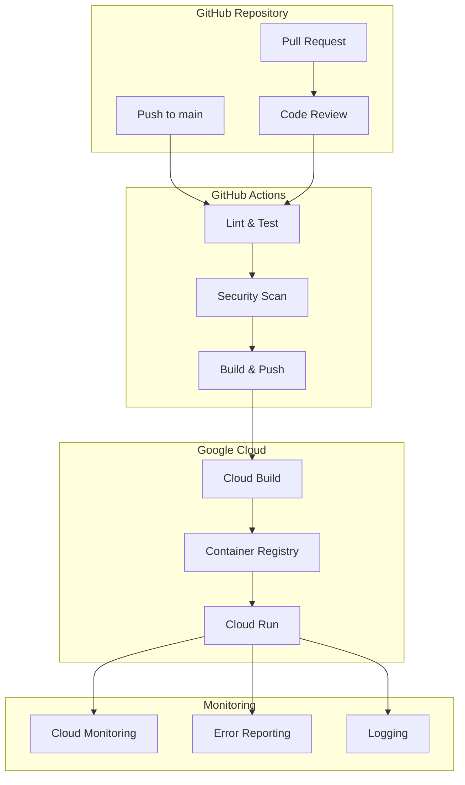

### Configuración de GitHub Actions

```yaml
# .github/workflows/deploy.yml
name: Deploy to Google Cloud Run

on:
  push:
    branches: [ main ]
  pull_request:
    branches: [ main ]

jobs:
  test:
    runs-on: ubuntu-latest
    steps:
    - uses: actions/checkout@v4
    
    - name: Set up Python
      uses: actions/setup-python@v4
      with:
        python-version: '3.11'
    
    - name: Install Poetry
      uses: snok/install-poetry@v1
    
    - name: Install dependencies
      run: poetry install
    
    - name: Run tests
      run: poetry run pytest
    
    - name: Run security scan
      run: poetry run safety check
    
    - name: Run linting
      run: poetry run black --check . && poetry run flake8

  deploy:
    needs: test
    runs-on: ubuntu-latest
    if: github.ref == 'refs/heads/main'
    
    steps:
    - uses: actions/checkout@v4
    
    - name: Google Auth
      uses: google-github-actions/auth@v1
      with:
        credentials_json: ${{ secrets.GCP_SA_KEY }}
    
    - name: Set up Cloud SDK
      uses: google-github-actions/setup-gcloud@v1
    
    - name: Build and push
      run: |
        gcloud builds submit --tag gcr.io/${{ secrets.GCP_PROJECT_ID }}/ai-resume-agent
        gcloud run deploy ai-resume-agent \
          --image gcr.io/${{ secrets.GCP_PROJECT_ID }}/ai-resume-agent \
          --platform managed \
          --region us-central1 \
          --allow-unauthenticated
```

### Métricas de Negocio
- ✅ **Engagement:** > 15% de visitantes inician conversación
- ✅ **Leads Generados:** > 10 contactos profesionales por mes
- ✅ **Satisfacción:** > 4.5/5 estrellas
- ✅ **Optimización de Costos:** 60-80% reducción en costos de LLM
- ✅ **ROI Anual:** > 1,400% con capas gratuitas GCP
- ✅ **Ahorro Mensual:** $0/mes primer año, $31-52/mes post-free tier

## Pipeline de Desarrollo

### Diagrama de Flujo de Desarrollo

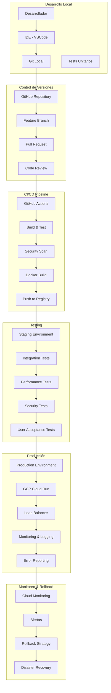

### Descripción del Pipeline

#### **1. Desarrollo Local**
- **IDE:** VSCode con extensiones para Python y React
- **Git:** Control de versiones local
- **Tests:** Ejecución de tests unitarios antes del commit

#### **2. Control de Versiones**
- **Repository:** GitHub con branching strategy
- **Feature Branch:** Desarrollo de funcionalidades
- **Pull Request:** Revisión de código obligatoria
- **Code Review:** Aprobación por al menos un reviewer

#### **3. CI/CD Pipeline**
- **GitHub Actions:** Automatización del pipeline
- **Build & Test:** Compilación y ejecución de tests
- **Security Scan:** Análisis de vulnerabilidades
- **Docker Build:** Creación de imagen containerizada
- **Registry:** Push a Google Container Registry

#### **4. Testing**
- **Staging Environment:** Entorno de pruebas idéntico a producción
- **Integration Tests:** Pruebas de integración entre componentes
- **Performance Tests:** Pruebas de rendimiento y carga
- **Security Tests:** Pruebas de seguridad automatizadas
- **UAT:** Pruebas de aceptación por usuarios

#### **5. Producción**
- **Production Environment:** Entorno de producción en GCP
- **Cloud Run:** Servicio serverless escalable
- **Load Balancer:** Distribución de carga
- **Monitoring:** Monitoreo en tiempo real
- **Logging:** Registro de eventos y errores

#### **6. Monitoreo & Rollback**
- **Cloud Monitoring:** Métricas y alertas
- **Alertas:** Notificaciones automáticas
- **Rollback Strategy:** Estrategia de reversión rápida
- **Disaster Recovery:** Plan de recuperación ante desastres

### Herramientas del Pipeline

| Fase | Herramienta | Propósito |
|------|-------------|-----------|
| **Desarrollo** | VSCode, Git | Codificación y control de versiones |
| **CI/CD** | GitHub Actions | Automatización del pipeline |
| **Testing** | Jest, Pytest, Postman | Ejecución de pruebas |
| **Containerización** | Docker | Empaquetado de aplicaciones |
| **Despliegue** | Cloud Run | Ejecución serverless |
| **Monitoreo** | Cloud Monitoring | Observabilidad del sistema |

## 🚀 **Arquitectura de Deployment**

### **Estrategia de Deployment Multi-Ambiente**

La arquitectura de deployment está diseñada para proporcionar un pipeline de CI/CD robusto, escalabilidad automática y alta disponibilidad en Google Cloud Platform.

#### **1. Pipeline de CI/CD con GitHub Actions**

##### **Flujo de Deployment Automatizado**
```yaml
# .github/workflows/deploy.yml
name: Deploy to GCP

on:
  push:
    branches: [main, develop]
  pull_request:
    branches: [main]

env:
  PROJECT_ID: ${{ secrets.GCP_PROJECT_ID }}
  REGION: us-central1
  SERVICE_NAME: portfolio-chatbot

jobs:
  test:
    runs-on: ubuntu-latest
    steps:
      - uses: actions/checkout@v3
      
      - name: Set up Python
        uses: actions/setup-python@v4
        with:
          python-version: '3.11'
      
      - name: Install dependencies
        run: |
          python -m pip install --upgrade pip
          pip install -r requirements.txt
          pip install -r requirements-dev.txt
      
      - name: Run tests
        run: |
          pytest tests/ --cov=app --cov-report=xml
          coverage-badge -o coverage-badge.svg
      
      - name: Upload coverage to Codecov
        uses: codecov/codecov-action@v3
        with:
          file: ./coverage.xml
          flags: unittests
          name: codecov-umbrella

  security-scan:
    runs-on: ubuntu-latest
    needs: test
    steps:
      - uses: actions/checkout@v3
      
      - name: Run security scan
        uses: snyk/actions/python@master
        env:
          SNYK_TOKEN: ${{ secrets.SNYK_TOKEN }}
        with:
          args: --severity-threshold=high
      
      - name: Run dependency check
        run: |
          pip install safety
          safety check --json --output safety-report.json
      
      - name: Upload security report
        uses: actions/upload-artifact@v3
        with:
          name: security-report
          path: safety-report.json

  build:
    runs-on: ubuntu-latest
    needs: [test, security-scan]
    steps:
      - uses: actions/checkout@v3
      
      - name: Set up Docker Buildx
        uses: docker/setup-buildx-action@v2
      
      - name: Log in to Google Cloud
        uses: google-github-actions/auth@v1
        with:
          credentials_json: ${{ secrets.GCP_SA_KEY }}
      
      - name: Configure Docker for GCP
        run: gcloud auth configure-docker
      
      - name: Build and push Docker image
        uses: docker/build-push-action@v4
        with:
          context: .
          push: true
          tags: |
            gcr.io/${{ env.PROJECT_ID }}/${{ env.SERVICE_NAME }}:${{ github.sha }}
            gcr.io/${{ env.PROJECT_ID }}/${{ env.SERVICE_NAME }}:latest
          cache-from: type=gha
          cache-to: type=gha,mode=max
          platforms: linux/amd64,linux/arm64

  deploy-staging:
    runs-on: ubuntu-latest
    needs: build
    environment: staging
    if: github.ref == 'refs/heads/develop'
    steps:
      - uses: actions/checkout@v3
      
      - name: Deploy to Cloud Run (Staging)
        run: |
          gcloud run deploy ${{ env.SERVICE_NAME }}-staging \
            --image gcr.io/${{ env.PROJECT_ID }}/${{ env.SERVICE_NAME }}:${{ github.sha }} \
            --region ${{ env.REGION }} \
            --platform managed \
            --allow-unauthenticated \
            --set-env-vars ENVIRONMENT=staging \
            --set-env-vars VERSION=${{ github.sha }}
      
      - name: Run integration tests
        run: |
          pip install pytest requests
          pytest tests/integration/ --url https://${{ env.SERVICE_NAME }}-staging-${{ env.REGION }}-${{ env.PROJECT_ID }}.run.app

  deploy-production:
    runs-on: ubuntu-latest
    needs: build
    environment: production
    if: github.ref == 'refs/heads/main'
    steps:
      - uses: actions/checkout@v3
      
      - name: Deploy to Cloud Run (Production)
        run: |
          gcloud run deploy ${{ env.SERVICE_NAME }} \
            --image gcr.io/${{ env.PROJECT_ID }}/${{ env.SERVICE_NAME }}:${{ github.sha }} \
            --region ${{ env.REGION }} \
            --platform managed \
            --allow-unauthenticated \
            --set-env-vars ENVIRONMENT=production \
            --set-env-vars VERSION=${{ github.sha }}
      
      - name: Run smoke tests
        run: |
          pip install pytest requests
          pytest tests/smoke/ --url https://${{ env.SERVICE_NAME }}-${{ env.REGION }}-${{ env.PROJECT_ID }}.run.app
      
      - name: Notify deployment
        run: |
          curl -X POST ${{ secrets.SLACK_WEBHOOK }} \
            -H 'Content-type: application/json' \
            -d '{"text":"🚀 Production deployment successful! Version: ${{ github.sha }}"}'
```

#### **2. Arquitectura de Infraestructura en GCP**

##### **Componentes de Infraestructura**
```yaml
# infrastructure/terraform/main.tf
terraform {
  required_version = ">= 1.0"
  required_providers {
    google = {
      source  = "hashicorp/google"
      version = "~> 4.0"
    }
  }
  
  backend "gcs" {
    bucket = "portfolio-chatbot-terraform-state"
    prefix = "terraform/state"
  }
}

provider "google" {
  project = var.project_id
  region  = var.region
}

# VPC y Networking
resource "google_compute_network" "main" {
  name                    = "portfolio-chatbot-vpc"
  auto_create_subnetworks = false
  routing_mode           = "REGIONAL"
}

resource "google_compute_subnetwork" "main" {
  name          = "portfolio-chatbot-subnet"
  ip_cidr_range = "10.0.0.0/24"
  network       = google_compute_network.main.id
  region        = var.region
  
  private_ip_google_access = true
}

# Cloud SQL (PostgreSQL)
resource "google_sql_database_instance" "main" {
  name             = "portfolio-chatbot-db"
  database_version = "POSTGRES_14"
  region           = var.region
  
  settings {
    tier = "db-f1-micro"
    
    backup_configuration {
      enabled    = true
      start_time = "02:00"
      location  = "US"
      
      backup_retention_settings {
        retained_backups = 7
      }
    }
    
    maintenance_window {
      day          = 7
      hour         = 2
      update_track = "stable"
    }
    
    ip_configuration {
      ipv4_enabled    = false
      private_network = google_compute_network.main.id
    }
  }
  
  deletion_protection = false
}

resource "google_sql_database" "main" {
  name     = "portfolio_chatbot"
  instance = google_sql_database_instance.main.name
}

resource "google_sql_user" "main" {
  name     = "portfolio_chatbot_user"
  instance = google_sql_database_instance.main.name
  password = var.db_password
}

# Memorystore (Redis)
resource "google_redis_instance" "main" {
  name           = "portfolio-chatbot-cache"
  tier           = "BASIC"
  memory_size_gb = 1
  region         = var.region
  
  authorized_network = google_compute_network.main.id
  
  redis_version = "REDIS_6_X"
  display_name  = "Portfolio Chatbot Cache"
}

# Cloud Run Service
resource "google_cloud_run_service" "main" {
  name     = "portfolio-chatbot"
  location = var.region
  
  template {
    spec {
      containers {
        image = "gcr.io/${var.project_id}/portfolio-chatbot:latest"
        
        resources {
          limits = {
            cpu    = "1000m"
            memory = "512Mi"
          }
        }
        
        env {
          name  = "DATABASE_URL"
          value = "postgresql://${google_sql_user.main.name}:${var.db_password}@${google_sql_database_instance.main.private_ip_address}:5432/${google_sql_database.main.name}"
        }
        
        env {
          name  = "REDIS_URL"
          value = "redis://${google_redis_instance.main.host}:${google_redis_instance.main.port}"
        }
        
        env {
          name  = "ENVIRONMENT"
          value = var.environment
        }
        
        env {
          name  = "PROJECT_ID"
          value = var.project_id
        }
      }
      
      service_account_name = google_service_account.main.email
    }
    
    metadata {
      annotations = {
        "autoscaling.knative.dev/minScale" = "1"
        "autoscaling.knative.dev/maxScale" = "10"
        "run.googleapis.com/ingress"       = "all"
      }
    }
  }
  
  traffic {
    percent         = 100
    latest_revision = true
  }
}

# Service Account
resource "google_service_account" "main" {
  account_id   = "portfolio-chatbot-sa"
  display_name = "Portfolio Chatbot Service Account"
}

resource "google_project_iam_member" "main" {
  project = var.project_id
  role    = "roles/run.invoker"
  member  = "serviceAccount:${google_service_account.main.email}"
}

# Load Balancer
resource "google_compute_global_address" "main" {
  name = "portfolio-chatbot-ip"
}

resource "google_compute_global_forwarding_rule" "main" {
  name       = "portfolio-chatbot-lb"
  target    = google_compute_target_https_proxy.main.id
  port_range = "443"
  ip_address = google_compute_global_address.main.address
}

resource "google_compute_target_https_proxy" "main" {
  name             = "portfolio-chatbot-https-proxy"
  url_map          = google_compute_url_map.main.id
  ssl_certificates = [google_compute_managed_ssl_certificate.main.id]
}

resource "google_compute_url_map" "main" {
  name            = "portfolio-chatbot-url-map"
  default_service = google_compute_backend_service.main.id
}

resource "google_compute_backend_service" "main" {
  name        = "portfolio-chatbot-backend"
  protocol    = "HTTP"
  port_name   = "http"
  timeout_sec = 30
  
  backend {
    group = google_compute_region_network_endpoint_group.main.id
  }
  
  health_checks = [google_compute_health_check.main.id]
}

resource "google_compute_region_network_endpoint_group" "main" {
  name                  = "portfolio-chatbot-neg"
  network               = google_compute_network.main.id
  subnetwork           = google_compute_subnetwork.main.id
  region               = var.region
  cloud_run {
    service = google_cloud_run_service.main.name
  }
}

resource "google_compute_health_check" "main" {
  name = "portfolio-chatbot-health-check"
  
  http_health_check {
    port = 8080
    path = "/health"
  }
}

resource "google_compute_managed_ssl_certificate" "main" {
  name = "portfolio-chatbot-ssl"
  
  managed {
    domains = [var.domain_name]
  }
}

# Cloud Armor (Security)
resource "google_compute_security_policy" "main" {
  name = "portfolio-chatbot-security-policy"
  
  rule {
    action   = "deny(403)"
    priority = "1000"
    match {
      versioned_expr = "SRC_IPS_V1"
      config {
        src_ip_ranges = ["*"]
      }
    }
    description = "Deny access by default"
  }
  
  rule {
    action   = "allow"
    priority = "2000"
    match {
      versioned_expr = "SRC_IPS_V1"
      config {
        src_ip_ranges = ["0.0.0.0/0"]
      }
    }
    description = "Allow access from all IPs"
  }
  
  rule {
    action   = "deny(403)"
    priority = "3000"
    match {
      expr {
        expression = "evaluatePreconfiguredExpr('sqli-stable')"
      }
    }
    description = "Block SQL injection attacks"
  }
  
  rule {
    action   = "deny(403)"
    priority = "4000"
    match {
      expr {
        expression = "evaluatePreconfiguredExpr('xss-stable')"
      }
    }
    description = "Block XSS attacks"
  }
}
```

#### **3. Estrategia de Deployment Blue-Green**

##### **Implementación de Deployment Blue-Green**
```yaml
# deployment/blue-green-deployment.yaml
apiVersion: serving.knative.dev/v1
kind: Service
metadata:
  name: portfolio-chatbot-blue
  labels:
    version: blue
    environment: production
spec:
  template:
    metadata:
      annotations:
        autoscaling.knative.dev/minScale: "1"
        autoscaling.knative.dev/maxScale: "10"
    spec:
      containers:
      - image: gcr.io/PROJECT_ID/portfolio-chatbot:blue-v1.2.0
        ports:
        - containerPort: 8080
        env:
        - name: VERSION
          value: "blue-v1.2.0"
        - name: ENVIRONMENT
          value: "production"
        resources:
          limits:
            cpu: "1000m"
            memory: "512Mi"
          requests:
            cpu: "500m"
            memory: "256Mi"
        readinessProbe:
          httpGet:
            path: /health
            port: 8080
          initialDelaySeconds: 5
          periodSeconds: 10
        livenessProbe:
          httpGet:
            path: /health
            port: 8080
          initialDelaySeconds: 15
          periodSeconds: 20

---
apiVersion: serving.knative.dev/v1
kind: Service
metadata:
  name: portfolio-chatbot-green
  labels:
    version: green
    environment: production
spec:
  template:
    metadata:
      annotations:
        autoscaling.knative.dev/minScale: "0"
        autoscaling.knative.dev/maxScale: "0"
    spec:
      containers:
      - image: gcr.io/PROJECT_ID/portfolio-chatbot:green-v1.2.1
        ports:
        - containerPort: 8080
        env:
        - name: VERSION
          value: "green-v1.2.1"
        - name: ENVIRONMENT
          value: "production"
        resources:
          limits:
            cpu: "1000m"
            memory: "512Mi"
          requests:
            cpu: "500m"
            memory: "256Mi"
        readinessProbe:
          httpGet:
            path: /health
            port: 8080
          initialDelaySeconds: 5
          periodSeconds: 10
        livenessProbe:
          httpGet:
            path: /health
            port: 8080
          initialDelaySeconds: 15
          periodSeconds: 20

---
apiVersion: networking.k8s.io/v1
kind: Ingress
metadata:
  name: portfolio-chatbot-ingress
  annotations:
    kubernetes.io/ingress.class: "gce"
    kubernetes.io/ingress.global-static-ip-name: "portfolio-chatbot-ip"
    networking.gke.io/managed-certificates: "portfolio-chatbot-ssl"
spec:
  rules:
  - host: api.portfoliochatbot.com
    http:
      paths:
      - path: /
        pathType: Prefix
        backend:
          service:
            name: portfolio-chatbot-blue
            port:
              number: 80
```

##### **Script de Deployment Blue-Green**
```bash
#!/bin/bash
# scripts/deploy-blue-green.sh

set -e

# Variables
PROJECT_ID="your-project-id"
REGION="us-central1"
BLUE_SERVICE="portfolio-chatbot-blue"
GREEN_SERVICE="portfolio-chatbot-green"
NEW_VERSION="v1.2.1"
NEW_IMAGE="gcr.io/${PROJECT_ID}/portfolio-chatbot:${NEW_VERSION}"

echo "🚀 Iniciando deployment Blue-Green para versión ${NEW_VERSION}"

# 1. Construir nueva imagen
echo "📦 Construyendo nueva imagen Docker..."
docker build -t ${NEW_IMAGE} .
docker push ${NEW_IMAGE}

# 2. Determinar qué servicio está activo
ACTIVE_SERVICE=$(gcloud run services list --platform managed --region ${REGION} --filter="metadata.name~portfolio-chatbot" --format="value(metadata.name)" | grep -E "(blue|green)" | head -1)

if [[ "${ACTIVE_SERVICE}" == *"blue"* ]]; then
    TARGET_SERVICE=${GREEN_SERVICE}
    CURRENT_SERVICE=${BLUE_SERVICE}
    echo "🎯 Servicio activo: ${BLUE_SERVICE}, desplegando en: ${GREEN_SERVICE}"
else
    TARGET_SERVICE=${BLUE_SERVICE}
    CURRENT_SERVICE=${GREEN_SERVICE}
    echo "🎯 Servicio activo: ${GREEN_SERVICE}, desplegando en: ${BLUE_SERVICE}"
fi

# 3. Desplegar nueva versión en servicio inactivo
echo "🔧 Desplegando nueva versión en ${TARGET_SERVICE}..."
gcloud run services replace deployment/${TARGET_SERVICE}.yaml --region ${REGION}

# 4. Escalar servicio inactivo a 1 réplica
echo "📈 Escalando ${TARGET_SERVICE} a 1 réplica..."
gcloud run services update ${TARGET_SERVICE} --region ${REGION} --min-instances=1 --max-instances=10

# 5. Esperar a que el servicio esté listo
echo "⏳ Esperando a que ${TARGET_SERVICE} esté listo..."
kubectl wait --for=condition=ready pod -l serving.knative.dev/service=${TARGET_SERVICE} --timeout=300s

# 6. Ejecutar tests de smoke
echo "🧪 Ejecutando tests de smoke..."
SMOKE_TESTS_PASSED=true
for i in {1..5}; do
    if curl -f "https://${TARGET_SERVICE}-${REGION}-${PROJECT_ID}.run.app/health" > /dev/null 2>&1; then
        echo "✅ Test ${i} pasado"
    else
        echo "❌ Test ${i} falló"
        SMOKE_TESTS_PASSED=false
        break
    fi
    sleep 2
done

if [ "$SMOKE_TESTS_PASSED" = false ]; then
    echo "🚨 Tests de smoke fallaron. Rollback automático..."
    
    # Rollback: escalar servicio inactivo a 0
    gcloud run services update ${TARGET_SERVICE} --region ${REGION} --min-instances=0 --max-instances=0
    
    echo "❌ Deployment falló. Rollback completado."
    exit 1
fi

# 7. Ejecutar tests de integración
echo "🔗 Ejecutando tests de integración..."
if pytest tests/integration/ --url "https://${TARGET_SERVICE}-${REGION}-${PROJECT_ID}.run.app"; then
    echo "✅ Tests de integración pasaron"
else
    echo "❌ Tests de integración fallaron. Rollback automático..."
    
    # Rollback
    gcloud run services update ${TARGET_SERVICE} --region ${REGION} --min-instances=0 --max-instances=0
    
    echo "❌ Deployment falló. Rollback completado."
    exit 1
fi

# 8. Cambiar tráfico al nuevo servicio
echo "🔄 Cambiando tráfico a ${TARGET_SERVICE}..."
gcloud run services update-traffic ${TARGET_SERVICE} --to-latest --region ${REGION}

# 9. Escalar servicio anterior a 0 réplicas
echo "📉 Escalando ${CURRENT_SERVICE} a 0 réplicas..."
gcloud run services update ${CURRENT_SERVICE} --region ${REGION} --min-instances=0 --max-instances=0

# 10. Verificar deployment exitoso
echo "✅ Verificando deployment exitoso..."
sleep 30

if curl -f "https://${TARGET_SERVICE}-${REGION}-${PROJECT_ID}.run.app/health" > /dev/null 2>&1; then
    echo "🎉 Deployment Blue-Green completado exitosamente!"
    echo "📊 Nueva versión ${NEW_VERSION} está activa en ${TARGET_SERVICE}"
    echo "🔗 URL: https://${TARGET_SERVICE}-${REGION}-${PROJECT_ID}.run.app"
else
    echo "❌ Verificación final falló"
    exit 1
fi
```

#### **4. Monitoreo y Observabilidad**

##### **Configuración de Monitoreo**
```yaml
# monitoring/cloud-monitoring.yaml
apiVersion: v1
kind: ConfigMap
metadata:
  name: monitoring-config
  namespace: default
data:
  prometheus.yml: |
    global:
      scrape_interval: 15s
      evaluation_interval: 15s
    
    scrape_configs:
      - job_name: 'portfolio-chatbot'
        static_configs:
          - targets: ['localhost:8080']
        metrics_path: '/metrics'
        scrape_interval: 5s

---
apiVersion: apps/v1
kind: Deployment
metadata:
  name: prometheus
  namespace: monitoring
spec:
  replicas: 1
  selector:
    matchLabels:
      app: prometheus
  template:
    metadata:
      labels:
        app: prometheus
    spec:
      containers:
      - name: prometheus
        image: prom/prometheus:latest
        ports:
        - containerPort: 9090
        volumeMounts:
        - name: config
          mountPath: /etc/prometheus
        - name: storage
          mountPath: /prometheus
      volumes:
      - name: config
        configMap:
          name: monitoring-config
      - name: storage
        emptyDir: {}

---
apiVersion: v1
kind: Service
metadata:
  name: prometheus
  namespace: monitoring
spec:
  selector:
    app: prometheus
  ports:
  - port: 9090
    targetPort: 9090
  type: ClusterIP

---
apiVersion: monitoring.coreos.com/v1
kind: ServiceMonitor
metadata:
  name: portfolio-chatbot-monitor
  namespace: monitoring
spec:
  selector:
    matchLabels:
      app: portfolio-chatbot
  endpoints:
  - port: metrics
    interval: 15s
    path: /metrics
```

##### **Dashboard de Grafana**
```json
// monitoring/grafana-dashboard.json
{
  "dashboard": {
    "id": null,
    "title": "Portfolio Chatbot - Production Dashboard",
    "tags": ["portfolio", "chatbot", "production"],
    "style": "dark",
    "timezone": "browser",
    "panels": [
      {
        "id": 1,
        "title": "Request Rate",
        "type": "graph",
        "targets": [
          {
            "expr": "rate(http_requests_total[5m])",
            "legendFormat": "{{method}} {{route}}"
          }
        ],
        "gridPos": {
          "h": 8,
          "w": 12,
          "x": 0,
          "y": 0
        }
      },
      {
        "id": 2,
        "title": "Response Time",
        "type": "graph",
        "targets": [
          {
            "expr": "histogram_quantile(0.95, rate(http_request_duration_seconds_bucket[5m]))",
            "legendFormat": "P95 Response Time"
          }
        ],
        "gridPos": {
          "h": 8,
          "w": 12,
          "x": 12,
          "y": 0
        }
      },
      {
        "id": 3,
        "title": "Error Rate",
        "type": "graph",
        "targets": [
          {
            "expr": "rate(http_requests_total{status=~\"5..\"}[5m])",
            "legendFormat": "5xx Errors"
          }
        ],
        "gridPos": {
          "h": 8,
          "w": 12,
          "x": 0,
          "y": 8
        }
      },
      {
        "id": 4,
        "title": "Active Users",
        "type": "stat",
        "targets": [
          {
            "expr": "sum(active_users_total)",
            "legendFormat": "Active Users"
          }
        ],
        "gridPos": {
          "h": 4,
          "w": 6,
          "x": 12,
          "y": 8
        }
      }
    ],
    "time": {
      "from": "now-1h",
      "to": "now"
    },
    "refresh": "5s"
  }
}
```

#### **5. Estrategia de Rollback y Disaster Recovery**

##### **Plan de Rollback Automático**
```yaml
# deployment/rollback-policy.yaml
apiVersion: serving.knative.dev/v1
kind: Service
metadata:
  name: portfolio-chatbot
  annotations:
    autoscaling.knative.dev/minScale: "1"
    autoscaling.knative.dev/maxScale: "10"
    # Política de rollback automático
    serving.knative.dev/rollback: "true"
    serving.knative.dev/rollbackWindow: "5m"
spec:
  template:
    metadata:
      annotations:
        # Health check más agresivo para detección temprana de problemas
        autoscaling.knative.dev/scaleDownDelay: "30s"
        autoscaling.knative.dev/scaleToZeroPodRetentionPeriod: "5m"
    spec:
      containers:
      - image: gcr.io/PROJECT_ID/portfolio-chatbot:latest
        ports:
        - containerPort: 8080
        env:
        - name: VERSION
          value: "latest"
        - name: ENVIRONMENT
          value: "production"
        resources:
          limits:
            cpu: "1000m"
            memory: "512Mi"
          requests:
            cpu: "500m"
            memory: "256Mi"
        # Health checks más estrictos
        readinessProbe:
          httpGet:
            path: /health
            port: 8080
          initialDelaySeconds: 3
          periodSeconds: 5
          timeoutSeconds: 3
          failureThreshold: 3
        livenessProbe:
          httpGet:
            path: /health
            port: 8080
          initialDelaySeconds: 10
          periodSeconds: 10
          timeoutSeconds: 3
          failureThreshold: 3
        # Startup probe para evitar reinicios innecesarios
        startupProbe:
          httpGet:
            path: /health
            port: 8080
          initialDelaySeconds: 5
          periodSeconds: 5
          timeoutSeconds: 3
          failureThreshold: 10
```

##### **Script de Disaster Recovery**
```bash
#!/bin/bash
# scripts/disaster-recovery.sh

set -e

# Variables
PROJECT_ID="your-project-id"
REGION="us-central1"
BACKUP_REGION="us-east1"
SERVICE_NAME="portfolio-chatbot"
BACKUP_SERVICE_NAME="portfolio-chatbot-backup"

echo "🚨 Iniciando procedimiento de Disaster Recovery..."

# 1. Verificar estado del servicio principal
echo "🔍 Verificando estado del servicio principal..."
if gcloud run services describe ${SERVICE_NAME} --region ${REGION} --format="value(status.conditions[0].status)" | grep -q "True"; then
    echo "✅ Servicio principal está funcionando correctamente"
    exit 0
else
    echo "❌ Servicio principal no está funcionando. Iniciando DR..."
fi

# 2. Activar servicio de backup
echo "🔄 Activando servicio de backup en ${BACKUP_REGION}..."
gcloud run services update ${BACKUP_SERVICE_NAME} --region ${BACKUP_REGION} --min-instances=1 --max-instances=10

# 3. Verificar que el servicio de backup esté funcionando
echo "⏳ Esperando a que el servicio de backup esté listo..."
sleep 30

if gcloud run services describe ${BACKUP_SERVICE_NAME} --region ${BACKUP_REGION} --format="value(status.conditions[0].status)" | grep -q "True"; then
    echo "✅ Servicio de backup está funcionando"
else
    echo "❌ Servicio de backup no está funcionando"
    exit 1
fi

# 4. Ejecutar tests de funcionalidad
echo "🧪 Ejecutando tests de funcionalidad en backup..."
if pytest tests/smoke/ --url "https://${BACKUP_SERVICE_NAME}-${BACKUP_REGION}-${PROJECT_ID}.run.app"; then
    echo "✅ Tests de funcionalidad pasaron en backup"
else
    echo "❌ Tests de funcionalidad fallaron en backup"
    exit 1
fi

# 5. Actualizar DNS para apuntar al backup
echo "🌐 Actualizando DNS para apuntar al servicio de backup..."
# Aquí iría la lógica para actualizar DNS o Load Balancer

# 6. Notificar al equipo
echo "📢 Notificando al equipo sobre el DR..."
curl -X POST ${SLACK_WEBHOOK} \
  -H 'Content-type: application/json' \
  -d '{"text":"🚨 DISASTER RECOVERY ACTIVADO! Servicio principal en ${REGION} no responde. Usando backup en ${BACKUP_REGION}."}'

# 7. Monitorear servicio de backup
echo "📊 Monitoreando servicio de backup..."
while true; do
    if gcloud run services describe ${BACKUP_SERVICE_NAME} --region ${BACKUP_REGION} --format="value(status.conditions[0].status)" | grep -q "True"; then
        echo "✅ Servicio de backup funcionando correctamente"
    else
        echo "❌ Servicio de backup falló"
        exit 1
    fi
    
    # Verificar cada 5 minutos
    sleep 300
done
```

Esta arquitectura de deployment proporciona un sistema robusto, escalable y altamente disponible para el chatbot de portfolio profesional, con capacidades de CI/CD automatizado, deployment blue-green, monitoreo completo y disaster recovery.

## 🧩 **Diseño de Componentes Microservicios**

### **Arquitectura de Microservicios para Escalabilidad**

La arquitectura de microservicios está diseñada para proporcionar escalabilidad horizontal, resiliencia y mantenibilidad del sistema, permitiendo que cada componente evolucione independientemente.

#### **1. Mapa de Microservicios**

##### **Estructura de Microservicios**
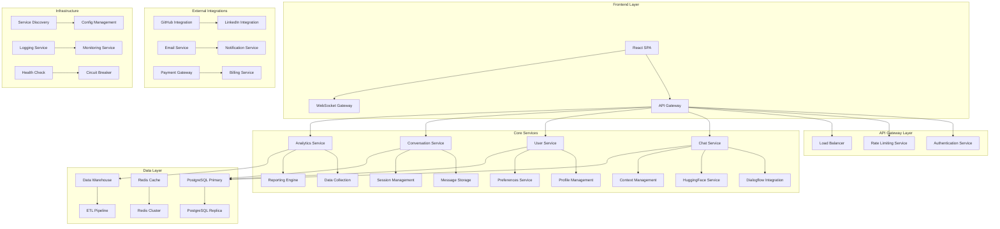

#### **2. Especificación de Microservicios**

##### **1. Chat Service (Core)**
```yaml
# services/chat-service/service.yaml
apiVersion: serving.knative.dev/v1
kind: Service
metadata:
  name: chat-service
  labels:
    app: portfolio-chatbot
    service: chat
    version: v1.0
spec:
  template:
    metadata:
      annotations:
        autoscaling.knative.dev/minScale: "2"
        autoscaling.knative.dev/maxScale: "20"
        autoscaling.knative.dev/target: "100"
    spec:
      containers:
      - image: gcr.io/PROJECT_ID/chat-service:latest
        ports:
        - containerPort: 8080
        env:
        - name: SERVICE_NAME
          value: "chat-service"
        - name: VERSION
          value: "v1.0"
        - name: DIALOGFLOW_PROJECT_ID
          valueFrom:
            secretKeyRef:
              name: dialogflow-secrets
              key: project_id
        - name: VERTEX_AI_LOCATION
          value: "us-central1"
        resources:
          limits:
            cpu: "1000m"
            memory: "1Gi"
          requests:
            cpu: "500m"
            memory: "512Mi"
        readinessProbe:
          httpGet:
            path: /health
            port: 8080
          initialDelaySeconds: 5
          periodSeconds: 10
        livenessProbe:
          httpGet:
            path: /health
            port: 8080
          initialDelaySeconds: 15
          periodSeconds: 20
        startupProbe:
          httpGet:
            path: /health
            port: 8080
          initialDelaySeconds: 10
          periodSeconds: 5
          failureThreshold: 10
```

##### **2. User Service**
```yaml
# services/user-service/service.yaml
apiVersion: serving.knative.dev/v1
kind: Service
metadata:
  name: user-service
  labels:
    app: portfolio-chatbot
    service: user
    version: v1.0
spec:
  template:
    metadata:
      annotations:
        autoscaling.knative.dev/minScale: "1"
        autoscaling.knative.dev/maxScale: "10"
        autoscaling.knative.dev/target: "50"
    spec:
      containers:
      - image: gcr.io/PROJECT_ID/user-service:latest
        ports:
        - containerPort: 8080
        env:
        - name: SERVICE_NAME
          value: "user-service"
        - name: VERSION
          value: "v1.0"
        - name: DATABASE_URL
          valueFrom:
            secretKeyRef:
              name: database-secrets
              key: url
        - name: REDIS_URL
          valueFrom:
            secretKeyRef:
              name: redis-secrets
              key: url
        resources:
          limits:
            cpu: "500m"
            memory: "512Mi"
          requests:
            cpu: "250m"
            memory: "256Mi"
```

##### **3. Conversation Service**
```yaml
# services/conversation-service/service.yaml
apiVersion: serving.knative.dev/v1
kind: Service
metadata:
  name: conversation-service
  labels:
    app: portfolio-chatbot
    service: conversation
    version: v1.0
spec:
  template:
    metadata:
      annotations:
        autoscaling.knative.dev/minScale: "1"
        autoscaling.knative.dev/maxScale: "15"
        autoscaling.knative.dev/target: "75"
    spec:
      containers:
      - image: gcr.io/PROJECT_ID/conversation-service:latest
        ports:
        - containerPort: 8080
        env:
        - name: SERVICE_NAME
          value: "conversation-service"
        - name: VERSION
          value: "v1.0"
        - name: DATABASE_URL
          valueFrom:
            secretKeyRef:
              name: database-secrets
              key: url
        - name: REDIS_URL
          valueFrom:
            secretKeyRef:
              name: redis-secrets
              key: url
        resources:
          limits:
            cpu: "750m"
            memory: "768Mi"
          requests:
            cpu: "375m"
            memory: "384Mi"
```

##### **4. Analytics Service**
```yaml
# services/analytics-service/service.yaml
apiVersion: serving.knative.dev/v1
kind: Service
metadata:
  name: analytics-service
  labels:
    app: portfolio-chatbot
    service: analytics
    version: v1.0
spec:
  template:
    metadata:
      annotations:
        autoscaling.knative.dev/minScale: "1"
        autoscaling.knative.dev/maxScale: "8"
        autoscaling.knative.dev/target: "40"
    spec:
      containers:
      - image: gcr.io/PROJECT_ID/analytics-service:latest
        ports:
        - containerPort: 8080
        env:
        - name: SERVICE_NAME
          value: "analytics-service"
        - name: VERSION
          value: "v1.0"
        - name: DATABASE_URL
          valueFrom:
            secretKeyRef:
              name: database-secrets
              key: url
        - name: DATA_WAREHOUSE_URL
          valueFrom:
            secretKeyRef:
              name: data-warehouse-secrets
              key: url
        resources:
          limits:
            cpu: "1000m"
            memory: "1Gi"
          requests:
            cpu: "500m"
            memory: "512Mi"
```

#### **3. API Gateway y Service Mesh**

##### **Configuración de API Gateway**
```yaml
# gateway/api-gateway.yaml
apiVersion: networking.istio.io/v1beta1
kind: Gateway
metadata:
  name: portfolio-chatbot-gateway
  namespace: default
spec:
  selector:
    istio: ingressgateway
  servers:
  - port:
      number: 80
      name: http
      protocol: HTTP
    hosts:
    - "api.portfoliochatbot.com"
    - "*.portfoliochatbot.com"
  - port:
      number: 443
      name: https
      protocol: HTTPS
    tls:
      mode: SIMPLE
      credentialName: portfolio-chatbot-tls
    hosts:
    - "api.portfoliochatbot.com"
    - "*.portfoliochatbot.com"

---
apiVersion: networking.istio.io/v1beta1
kind: VirtualService
metadata:
  name: portfolio-chatbot-vs
  namespace: default
spec:
  hosts:
  - "api.portfoliochatbot.com"
  - "*.portfoliochatbot.com"
  gateways:
  - portfolio-chatbot-gateway
  http:
  - match:
    - uri:
        prefix: "/v1/chat"
    route:
    - destination:
        host: chat-service
        port:
          number: 8080
      weight: 100
    retries:
      attempts: 3
      perTryTimeout: 2s
    timeout: 30s
    cors:
      allowOrigin:
      - "*"
      allowMethods:
      - GET
      - POST
      - PUT
      - DELETE
      - OPTIONS
      allowHeaders:
      - "Content-Type"
      - "Authorization"
      - "X-API-Key"
  
  - match:
    - uri:
        prefix: "/v1/users"
    route:
    - destination:
        host: user-service
        port:
          number: 8080
      weight: 100
    retries:
      attempts: 2
      perTryTimeout: 1s
    timeout: 10s
  
  - match:
    - uri:
        prefix: "/v1/conversations"
    route:
    - destination:
        host: conversation-service
        port:
          number: 8080
      weight: 100
    retries:
      attempts: 2
      perTryTimeout: 1s
    timeout: 15s
  
  - match:
    - uri:
        prefix: "/v1/analytics"
    route:
    - destination:
        host: analytics-service
        port:
          number: 8080
      weight: 100
    retries:
      attempts: 2
      perTryTimeout: 3s
    timeout: 60s
  
  - match:
    - uri:
        prefix: "/health"
    route:
    - destination:
        host: health-check-service
        port:
          number: 8080
      weight: 100
```

##### **Configuración de Service Mesh (Istio)**
```yaml
# service-mesh/destination-rules.yaml
apiVersion: networking.istio.io/v1beta1
kind: DestinationRule
metadata:
  name: chat-service-dr
  namespace: default
spec:
  host: chat-service
  trafficPolicy:
    loadBalancer:
      simple: ROUND_ROBIN
    connectionPool:
      tcp:
        maxConnections: 100
        connectTimeout: 30ms
      http:
        http1MaxPendingRequests: 1000
        maxRequestsPerConnection: 10
        maxRetries: 3
    outlierDetection:
      consecutive5xxErrors: 5
      interval: 10s
      baseEjectionTime: 30s
      maxEjectionPercent: 10
  subsets:
  - name: v1
    labels:
      version: v1.0
    trafficPolicy:
      loadBalancer:
        simple: ROUND_ROBIN
  - name: v2
    labels:
      version: v2.0
    trafficPolicy:
      loadBalancer:
        simple: ROUND_ROBIN

---
apiVersion: networking.istio.io/v1beta1
kind: DestinationRule
metadata:
  name: user-service-dr
  namespace: default
spec:
  host: user-service
  trafficPolicy:
    loadBalancer:
      simple: LEAST_CONN
    connectionPool:
      tcp:
        maxConnections: 50
        connectTimeout: 20ms
      http:
        http1MaxPendingRequests: 500
        maxRequestsPerConnection: 5
        maxRetries: 2
    outlierDetection:
      consecutive5xxErrors: 3
      interval: 15s
      baseEjectionTime: 45s
      maxEjectionPercent: 5
```

#### **4. Circuit Breaker y Resiliencia**

##### **Implementación de Circuit Breaker**
```python
# services/chat-service/circuit_breaker.py
import asyncio
import time
from enum import Enum
from typing import Any, Callable, Optional
import logging

logger = logging.getLogger(__name__)

class CircuitState(Enum):
    CLOSED = "CLOSED"      # Funcionando normalmente
    OPEN = "OPEN"          # Fallando, no permitir requests
    HALF_OPEN = "HALF_OPEN"  # Probando si se recuperó

class CircuitBreaker:
    """Implementación de Circuit Breaker para microservicios"""
    
    def __init__(
        self,
        failure_threshold: int = 5,
        recovery_timeout: int = 60,
        expected_exception: type = Exception,
        name: str = "default"
    ):
        self.failure_threshold = failure_threshold
        self.recovery_timeout = recovery_timeout
        self.expected_exception = expected_exception
        self.name = name
        
        self.state = CircuitState.CLOSED
        self.failure_count = 0
        self.last_failure_time = 0
        self.success_count = 0
        
        logger.info(f"Circuit Breaker '{self.name}' inicializado")
    
    async def call(self, func: Callable, *args, **kwargs) -> Any:
        """Ejecuta función con protección de circuit breaker"""
        
        if self.state == CircuitState.OPEN:
            if self._should_attempt_reset():
                logger.info(f"Circuit Breaker '{self.name}' cambiando a HALF_OPEN")
                self.state = CircuitState.HALF_OPEN
            else:
                raise Exception(f"Circuit Breaker '{self.name}' está OPEN")
        
        try:
            result = await func(*args, **kwargs)
            self._on_success()
            return result
            
        except self.expected_exception as e:
            self._on_failure()
            raise e
    
    def _on_success(self):
        """Maneja éxito de la operación"""
        self.failure_count = 0
        self.success_count += 1
        
        if self.state == CircuitState.HALF_OPEN:
            if self.success_count >= self.failure_threshold // 2:
                logger.info(f"Circuit Breaker '{self.name}' cambiando a CLOSED")
                self.state = CircuitState.CLOSED
                self.success_count = 0
    
    def _on_failure(self):
        """Maneja fallo de la operación"""
        self.failure_count += 1
        self.last_failure_time = time.time()
        
        if self.failure_count >= self.failure_threshold:
            logger.warning(f"Circuit Breaker '{self.name}' cambiando a OPEN")
            self.state = CircuitState.OPEN
    
    def _should_attempt_reset(self) -> bool:
        """Determina si se debe intentar reset del circuit breaker"""
        return time.time() - self.last_failure_time >= self.recovery_timeout
    
    def get_status(self) -> dict:
        """Retorna estado actual del circuit breaker"""
        return {
            "name": self.name,
            "state": self.state.value,
            "failure_count": self.failure_count,
            "success_count": self.success_count,
            "last_failure_time": self.last_failure_time,
            "failure_threshold": self.failure_threshold,
            "recovery_timeout": self.recovery_timeout
        }

# Uso en servicios
class ChatServiceCircuitBreaker:
    """Circuit Breaker específico para el Chat Service"""
    
    def __init__(self):
        self.dialogflow_cb = CircuitBreaker(
            failure_threshold=3,
            recovery_timeout=30,
            expected_exception=Exception,
            name="dialogflow-service"
        )
        
        self.vertex_ai_cb = CircuitBreaker(
            failure_threshold=5,
            recovery_timeout=60,
            expected_exception=Exception,
            name="vertex-ai-service"
        )
    
    async def call_dialogflow(self, func, *args, **kwargs):
        """Ejecuta llamada a Dialogflow con circuit breaker"""
        return await self.dialogflow_cb.call(func, *args, **kwargs)
    
    async def call_vertex_ai(self, func, *args, **kwargs):
        """Ejecuta llamada a HuggingFace con circuit breaker"""
        return await self.vertex_ai_cb.call(func, *args, **kwargs)
    
    def get_status(self) -> dict:
        """Retorna estado de todos los circuit breakers"""
        return {
            "dialogflow": self.dialogflow_cb.get_status(),
            "vertex_ai": self.vertex_ai_cb.get_status()
        }
```

#### **5. Service Discovery y Configuración**

##### **Configuración de Service Discovery**
```yaml
# service-discovery/service-registry.yaml
apiVersion: v1
kind: ConfigMap
metadata:
  name: service-registry
  namespace: default
data:
  services.yaml: |
    services:
      chat-service:
        host: chat-service.default.svc.cluster.local
        port: 8080
        health_check: /health
        circuit_breaker:
          failure_threshold: 5
          recovery_timeout: 60
        retry_policy:
          max_attempts: 3
          backoff_multiplier: 2
          initial_delay: 100ms
      
      user-service:
        host: user-service.default.svc.cluster.local
        port: 8080
        health_check: /health
        circuit_breaker:
          failure_threshold: 3
          recovery_timeout: 30
        retry_policy:
          max_attempts: 2
          backoff_multiplier: 1.5
          initial_delay: 50ms
      
      conversation-service:
        host: conversation-service.default.svc.cluster.local
        port: 8080
        health_check: /health
        circuit_breaker:
          failure_threshold: 4
          recovery_timeout: 45
        retry_policy:
          max_attempts: 2
          backoff_multiplier: 1.5
          initial_delay: 75ms
      
      analytics-service:
        host: analytics-service.default.svc.cluster.local
        port: 8080
        health_check: /health
        circuit_breaker:
          failure_threshold: 6
          recovery_timeout: 90
        retry_policy:
          max_attempts: 3
          backoff_multiplier: 2
          initial_delay: 200ms

---
apiVersion: apps/v1
kind: Deployment
metadata:
  name: service-registry
  namespace: default
spec:
  replicas: 2
  selector:
    matchLabels:
      app: service-registry
  template:
    metadata:
      labels:
        app: service-registry
    spec:
      containers:
      - name: service-registry
        image: gcr.io/PROJECT_ID/service-registry:latest
        ports:
        - containerPort: 8080
        env:
        - name: REGISTRY_CONFIG_PATH
          value: "/etc/registry/services.yaml"
        volumeMounts:
        - name: registry-config
          mountPath: /etc/registry
        resources:
          limits:
            cpu: "250m"
            memory: "256Mi"
          requests:
            cpu: "125m"
            memory: "128Mi"
      volumes:
      - name: registry-config
        configMap:
          name: service-registry
```

##### **Configuración Centralizada**
```yaml
# config/centralized-config.yaml
apiVersion: v1
kind: ConfigMap
metadata:
  name: app-config
  namespace: default
data:
  app.yaml: |
    app:
      name: "Portfolio Chatbot"
      version: "v1.0"
      environment: "production"
    
    services:
      chat:
        timeout: 30
        max_retries: 3
        circuit_breaker:
          failure_threshold: 5
          recovery_timeout: 60
        rate_limiting:
          requests_per_minute: 100
          burst_size: 20
      
      user:
        timeout: 10
        max_retries: 2
        circuit_breaker:
          failure_threshold: 3
          recovery_timeout: 30
        rate_limiting:
          requests_per_minute: 200
          burst_size: 50
      
      conversation:
        timeout: 15
        max_retries: 2
        circuit_breaker:
          failure_threshold: 4
          recovery_timeout: 45
        rate_limiting:
          requests_per_minute: 150
          burst_size: 30
      
      analytics:
        timeout: 60
        max_retries: 3
        circuit_breaker:
          failure_threshold: 6
          recovery_timeout: 90
        rate_limiting:
          requests_per_minute: 50
          burst_size: 10
    
    database:
      connection_pool:
        min_size: 5
        max_size: 20
        max_queries: 50000
        max_inactive_connection_lifetime: 300
      
      retry_policy:
        max_attempts: 3
        initial_delay: 1000
        max_delay: 10000
        backoff_multiplier: 2
    
    cache:
      redis:
        connection_pool:
          min_size: 2
          max_size: 10
        key_prefix: "portfolio:"
        default_ttl: 3600
        max_ttl: 86400
    
    monitoring:
      metrics:
        enabled: true
        interval: 15
        retention_days: 30
      
      logging:
        level: "INFO"
        format: "json"
        output: "stdout"
      
      tracing:
        enabled: true
        sampler_rate: 0.1
        jaeger_endpoint: "http://jaeger:14268/api/traces"
    
    security:
      rate_limiting:
        enabled: true
        default_limit: 100
        default_window: 60
      
      authentication:
        jwt_secret: "${JWT_SECRET}"
        token_expiry: 3600
        refresh_token_expiry: 86400
      
      cors:
        allowed_origins:
          - "https://portfoliochatbot.com"
          - "https://*.portfoliochatbot.com"
        allowed_methods:
          - "GET"
          - "POST"
          - "PUT"
          - "DELETE"
          - "OPTIONS"
        allowed_headers:
          - "Content-Type"
          - "Authorization"
          - "X-API-Key"
```

#### **6. Implementación de Health Checks**

##### **Health Check Service**
```python
# services/health-check-service/health_check.py
import asyncio
import aiohttp
import psycopg2
import redis
from typing import Dict, List, Any
import logging
from datetime import datetime

logger = logging.getLogger(__name__)

class HealthCheckService:
    """Servicio de health check para microservicios"""
    
    def __init__(self, config: Dict[str, Any]):
        self.config = config
        self.services = config.get('services', {})
        self.health_status = {}
    
    async def check_all_services(self) -> Dict[str, Any]:
        """Verifica la salud de todos los servicios"""
        tasks = []
        
        for service_name, service_config in self.services.items():
            task = self.check_service_health(service_name, service_config)
            tasks.append(task)
        
        results = await asyncio.gather(*tasks, return_exceptions=True)
        
        # Procesar resultados
        for i, (service_name, _) in enumerate(self.services.items()):
            if isinstance(results[i], Exception):
                self.health_status[service_name] = {
                    "status": "unhealthy",
                    "error": str(results[i]),
                    "timestamp": datetime.utcnow().isoformat()
                }
            else:
                self.health_status[service_name] = results[i]
        
        return self.health_status
    
    async def check_service_health(self, service_name: str, service_config: Dict[str, Any]) -> Dict[str, Any]:
        """Verifica la salud de un servicio específico"""
        try:
            host = service_config['host']
            port = service_config['port']
            health_endpoint = service_config.get('health_check', '/health')
            
            url = f"http://{host}:{port}{health_endpoint}"
            
            async with aiohttp.ClientSession(timeout=aiohttp.ClientTimeout(total=5)) as session:
                async with session.get(url) as response:
                    if response.status == 200:
                        data = await response.json()
                        return {
                            "status": "healthy",
                            "response_time": response.headers.get('X-Response-Time', 'N/A'),
                            "version": data.get('version', 'N/A'),
                            "timestamp": datetime.utcnow().isoformat()
                        }
                    else:
                        return {
                            "status": "unhealthy",
                            "http_status": response.status,
                            "error": f"HTTP {response.status}",
                            "timestamp": datetime.utcnow().isoformat()
                        }
                        
        except asyncio.TimeoutError:
            return {
                "status": "unhealthy",
                "error": "Timeout",
                "timestamp": datetime.utcnow().isoformat()
            }
        except Exception as e:
            return {
                "status": "unhealthy",
                "error": str(e),
                "timestamp": datetime.utcnow().isoformat()
            }
    
    async def check_database_health(self) -> Dict[str, Any]:
        """Verifica la salud de la base de datos"""
        try:
            db_config = self.config.get('database', {})
            conn = psycopg2.connect(
                host=db_config.get('host'),
                port=db_config.get('port', 5432),
                database=db_config.get('name'),
                user=db_config.get('user'),
                password=db_config.get('password')
            )
            
            cursor = conn.cursor()
            cursor.execute("SELECT 1")
            result = cursor.fetchone()
            
            cursor.close()
            conn.close()
            
            if result and result[0] == 1:
                return {
                    "status": "healthy",
                    "type": "postgresql",
                    "timestamp": datetime.utcnow().isoformat()
                }
            else:
                return {
                    "status": "unhealthy",
                    "error": "Database query failed",
                    "timestamp": datetime.utcnow().isoformat()
                }
                
        except Exception as e:
            return {
                "status": "unhealthy",
                "error": str(e),
                "timestamp": datetime.utcnow().isoformat()
            }
    
    async def check_cache_health(self) -> Dict[str, Any]:
        """Verifica la salud del cache"""
        try:
            cache_config = self.config.get('cache', {}).get('redis', {})
            r = redis.Redis(
                host=cache_config.get('host'),
                port=cache_config.get('port', 6379),
                db=cache_config.get('db', 0),
                password=cache_config.get('password'),
                socket_timeout=5
            )
            
            # Test de ping
            pong = r.ping()
            
            if pong:
                return {
                    "status": "healthy",
                    "type": "redis",
                    "timestamp": datetime.utcnow().isoformat()
                }
            else:
                return {
                    "status": "unhealthy",
                    "error": "Redis ping failed",
                    "timestamp": datetime.utcnow().isoformat()
                }
                
        except Exception as e:
            return {
                "status": "unhealthy",
                "error": str(e),
                "timestamp": datetime.utcnow().isoformat()
            }
    
    def get_overall_health(self) -> Dict[str, Any]:
        """Retorna el estado general de salud del sistema"""
        healthy_services = sum(1 for status in self.health_status.values() if status.get('status') == 'healthy')
        total_services = len(self.health_status)
        
        overall_status = "healthy" if healthy_services == total_services else "degraded"
        if healthy_services == 0:
            overall_status = "unhealthy"
        
        return {
            "status": overall_status,
            "healthy_services": healthy_services,
            "total_services": total_services,
            "health_percentage": (healthy_services / total_services) * 100 if total_services > 0 else 0,
            "timestamp": datetime.utcnow().isoformat(),
            "services": self.health_status
        }
```

Esta arquitectura de microservicios proporciona un sistema escalable, resiliente y mantenible, con capacidades de circuit breaker, service discovery, configuración centralizada y monitoreo completo de la salud del sistema.