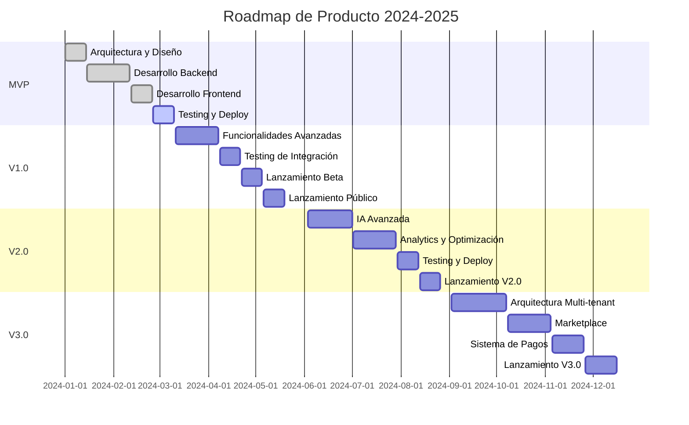

# 🗺️ Roadmap de Producto - Chatbot de Portfolio Profesional

## 📋 **Resumen Ejecutivo**

Este roadmap define la estrategia de desarrollo y lanzamiento del chatbot de portfolio profesional, un sistema inteligente que permite a los usuarios interactuar con portfolios profesionales de manera conversacional y natural.

### **Visión del Producto**
Transformar la experiencia de revisión de portfolios profesionales mediante un chatbot inteligente que proporcione respuestas contextuales, personalizadas y accesibles 24/7.

### **Objetivos Clave**
- **MVP (Q2 2024):** Chatbot funcional con capacidades básicas de conversación
- **V1.0 (Q3 2024):** Lanzamiento público con funcionalidades completas
- **V2.0 (Q4 2024):** Integración avanzada con IA y analytics
- **V3.0 (Q1 2025):** Plataforma multi-portfolio y marketplace

---

## 🎯 **Fases de Desarrollo**

### **Fase 1: MVP (Minimum Viable Product)**
**Duración:** 8 semanas | **Fecha objetivo:** Q2 2024

#### **Objetivos**
- Desarrollar chatbot funcional con capacidades básicas
- Integrar Dialogflow ES para procesamiento de lenguaje natural
- Implementar sistema de respuestas predefinidas
- Crear interfaz web básica

#### **Entregables**
- [x] Arquitectura del sistema definida
- [x] Integración Dialogflow ES + HuggingFace
- [x] API REST básica (FastAPI)
- [x] Base de datos PostgreSQL
- [x] Frontend React básico
- [x] Sistema de autenticación
- [x] Deploy en Google Cloud Run

#### **Hitos Clave**
- **Semana 2:** Integración Dialogflow completada
- **Semana 4:** API backend funcional
- **Semana 6:** Frontend básico implementado
- **Semana 8:** MVP deployado y testeado

#### **Métricas de Éxito**
- Tiempo de respuesta < 3 segundos
- Precisión de respuestas > 80%
- Uptime > 95%

---

### **Fase 2: Lanzamiento Público (V1.0)**
**Duración:** 6 semanas | **Fecha objetivo:** Q3 2024

#### **Objetivos**
- Lanzar producto al público general
- Implementar funcionalidades avanzadas de conversación
- Mejorar la experiencia del usuario
- Implementar analytics y monitoreo

#### **Entregables**
- [ ] Sistema de respuestas contextuales avanzado
- [ ] Integración con múltiples fuentes de conocimiento
- [ ] Dashboard de analytics para usuarios
- [ ] Sistema de feedback y calificaciones
- [ ] Optimización de performance
- [ ] Testing de seguridad completo
- [ ] Documentación de usuario final

#### **Hitos Clave**
- **Semana 2:** Testing de integración completado
- **Semana 4:** Testing de seguridad y performance
- **Semana 6:** Lanzamiento beta público
- **Semana 8:** Lanzamiento oficial V1.0

#### **Métricas de Éxito**
- Usuarios activos > 100 en primer mes
- Satisfacción del usuario > 4.5/5
- Tiempo de respuesta < 2 segundos
- Uptime > 99%

---

### **Fase 3: Mejoras Avanzadas (V2.0)**
**Duración:** 8 semanas | **Fecha objetivo:** Q4 2024

#### **Objetivos**
- Implementar capacidades avanzadas de IA
- Mejorar la personalización de respuestas
- Implementar analytics avanzados
- Optimizar costos de infraestructura

#### **Entregables**
- [ ] Sistema de aprendizaje continuo (ICL)
- [ ] Filtrado inteligente de contexto
- [ ] Analytics predictivos y insights
- [ ] Optimización de costos GCP
- [ ] Sistema de recomendaciones
- [ ] Integración con herramientas externas
- [ ] API para desarrolladores

#### **Hitos Clave**
- **Semana 2:** Implementación ICL
- **Semana 4:** Analytics predictivos
- **Semana 6:** Optimización de costos
- **Semana 8:** Lanzamiento V2.0

#### **Métricas de Éxito**
- Precisión de respuestas > 90%
- Reducción de costos > 20%
- Usuarios activos > 500
- Satisfacción del usuario > 4.7/5

---

### **Fase 4: Plataforma Multi-Portfolio (V3.0)**
**Duración:** 12 semanas | **Fecha objetivo:** Q1 2025

#### **Objetivos**
- Expandir a múltiples portfolios
- Implementar marketplace de portfolios
- Funcionalidades de colaboración
- Monetización del producto

#### **Entregables**
- [ ] Sistema multi-tenant
- [ ] Marketplace de portfolios
- [ ] Sistema de suscripciones
- [ ] Herramientas de colaboración
- [ ] API pública completa
- [ ] SDK para desarrolladores
- [ ] Sistema de pagos

#### **Hitos Clave**
- **Semana 3:** Arquitectura multi-tenant
- **Semana 6:** Marketplace básico
- **Semana 9:** Sistema de pagos
- **Semana 12:** Lanzamiento V3.0

#### **Métricas de Éxito**
- Portfolios activos > 100
- Ingresos mensuales > $10K
- Usuarios activos > 2000
- Satisfacción del usuario > 4.8/5

---

## 🚀 **Estrategia de Lanzamiento**

### **Lanzamiento Beta (Semana 6 - Fase 2)**
- **Audiencia:** 50 usuarios invitados (desarrolladores, diseñadores, recruiters)
- **Duración:** 2 semanas
- **Objetivos:** Validar funcionalidades, identificar bugs, recopilar feedback
- **Métricas:** Engagement, satisfacción, reportes de bugs

### **Lanzamiento Público (Semana 8 - Fase 2)**
- **Audiencia:** Público general
- **Canales:** Redes sociales, comunidades de desarrolladores, blogs técnicos
- **Objetivos:** Adquisición de usuarios, validación de mercado, generación de contenido
- **Métricas:** Registros, usuarios activos, retención

### **Lanzamiento V2.0 (Semana 8 - Fase 3)**
- **Audiencia:** Usuarios existentes + nueva audiencia
- **Canales:** Email marketing, anuncios pagados, partnerships
- **Objetivos:** Retención de usuarios, mejora de métricas, preparación para V3.0
- **Métricas:** Upgrade rate, engagement, satisfacción

---

## 📊 **Métricas y KPIs**

### **Métricas de Producto**
```yaml
# Métricas clave por fase
MVP:
  - Tiempo de respuesta: < 3s
  - Precisión: > 80%
  - Uptime: > 95%

V1.0:
  - Usuarios activos: > 100
  - Satisfacción: > 4.5/5
  - Tiempo de respuesta: < 2s
  - Uptime: > 99%

V2.0:
  - Precisión: > 90%
  - Reducción costos: > 20%
  - Usuarios activos: > 500
  - Satisfacción: > 4.7/5

V3.0:
  - Portfolios activos: > 100
  - Ingresos mensuales: > $10K
  - Usuarios activos: > 2000
  - Satisfacción: > 4.8/5
```

### **Métricas de Negocio**
- **CAC (Customer Acquisition Cost):** < $50
- **LTV (Lifetime Value):** > $200
- **Churn Rate:** < 5% mensual
- **MRR Growth:** > 20% mensual

### **Métricas Técnicas**
- **Performance:** P95 < 2s, P99 < 5s
- **Disponibilidad:** > 99.9%
- **Seguridad:** 0 vulnerabilidades críticas
- **Escalabilidad:** Soporte > 1000 usuarios concurrentes

---

## 🔧 **Plan de Desarrollo Técnico**

### **Arquitectura y Infraestructura**
```yaml
# Stack tecnológico por fase
MVP:
  - Backend: Python/FastAPI
  - Frontend: React básico
  - Base de datos: PostgreSQL
  - IA: Dialogflow ES + HuggingFace
  - Deploy: Google Cloud Run

V1.0:
  - Backend: FastAPI + Redis
  - Frontend: React + TypeScript
  - Base de datos: PostgreSQL + particionado
  - IA: Dialogflow ES + HuggingFace + ICL
  - Deploy: GCP + Load Balancer

V2.0:
  - Backend: FastAPI + Redis + Celery
  - Frontend: React + PWA
  - Base de datos: PostgreSQL + Data Warehouse
  - IA: HuggingFace + ICL + Smart Context Filtering
  - Deploy: GKE + Auto-scaling

V3.0:
  - Backend: Microservicios + Event-driven
  - Frontend: React + Mobile apps
  - Base de datos: Multi-tenant + Sharding
  - IA: HuggingFace + Custom models
  - Deploy: Multi-region + CDN
```

### **Integración y APIs**
- **MVP:** API REST básica
- **V1.0:** API REST completa + Webhooks
- **V2.0:** API GraphQL + SDK
- **V3.0:** API pública + Marketplace APIs

---

## 💰 **Modelo de Negocio y Monetización**

### **Estrategia de Monetización (V3.0+)**
```yaml
# Planes de suscripción
Free:
  - 1 portfolio
  - 100 mensajes/mes
  - Funcionalidades básicas
  - Soporte por email

Pro ($19/mes):
  - 3 portfolios
  - 1000 mensajes/mes
  - Analytics avanzados
  - Soporte prioritario
  - Personalización

Business ($49/mes):
  - 10 portfolios
  - Mensajes ilimitados
  - API completa
  - Soporte 24/7
  - White-label
  - Integraciones

Enterprise (Personalizado):
  - Portfolios ilimitados
  - Funcionalidades personalizadas
  - SLA garantizado
  - Soporte dedicado
  - On-premise disponible
```

### **Fuentes de Ingresos**
- **Suscripciones:** 70% de ingresos
- **API Usage:** 20% de ingresos
- **Consultoría:** 10% de ingresos

---

## 🎯 **Riesgos y Mitigación**

### **Riesgos Técnicos**
```yaml
# Identificación y mitigación de riesgos
Riesgo: "Escalabilidad de la base de datos"
Probabilidad: Media
Impacto: Alto
Mitigación: 
  - Implementar particionado desde V1.0
  - Preparar migración a microservicios
  - Monitoreo continuo de performance

Riesgo: "Costos de HuggingFace"
Probabilidad: Alta
Impacto: Medio
Mitigación:
  - Implementar caching inteligente
  - Optimizar prompts y contextos
  - Monitoreo de uso y costos

Riesgo: "Seguridad de datos"
Probabilidad: Baja
Impacto: Crítico
Mitigación:
  - Implementar OWASP Top 10
  - Auditorías de seguridad regulares
  - Cumplimiento GDPR desde el inicio
```

### **Riesgos de Mercado**
- **Competencia:** Monitorear competidores, diferenciación por IA
- **Adopción:** Beta testing, feedback continuo, iteración rápida
- **Regulaciones:** Cumplimiento GDPR, consultoría legal

---

## 📈 **Plan de Crecimiento y Expansión**

### **Expansión Geográfica**
- **Q2 2024:** Mercado hispanohablante
- **Q4 2024:** Mercado anglófono
- **Q2 2025:** Mercados europeos
- **Q4 2025:** Mercados asiáticos

### **Expansión de Producto**
- **Q3 2024:** Integración con LinkedIn, GitHub
- **Q4 2024:** Plugin para WordPress, Wix
- **Q1 2025:** Mobile apps (iOS/Android)
- **Q2 2025:** Integración con ATS (Applicant Tracking Systems)

### **Partnerships y Integraciones**
- **Q3 2024:** GitHub, GitLab
- **Q4 2024:** LinkedIn, Behance
- **Q1 2025:** WordPress, Wix, Squarespace
- **Q2 2025:** ATS (Greenhouse, Workday)

---

## 📅 **Cronograma Detallado**

### **Timeline 2024-2025**


---

## 🎉 **Conclusión**

Este roadmap proporciona una hoja de ruta clara y realista para el desarrollo del chatbot de portfolio profesional. Con un enfoque en iteración rápida, feedback del usuario y mejora continua, el producto evolucionará desde un MVP funcional hasta una plataforma completa de marketplace.

### **Próximos Pasos Inmediatos**
1. **Completar MVP:** Finalizar testing y deploy
2. **Preparar V1.0:** Implementar funcionalidades avanzadas
3. **Planificar Beta:** Identificar usuarios beta y plan de testing
4. **Estrategia de Marketing:** Definir canales y mensajes de lanzamiento

### **Contacto y Recursos**
- **Product Owner:** [Nombre del PO]
- **Tech Lead:** [Nombre del Tech Lead]
- **Documentación:** [Link a documentación]
- **Repositorio:** [Link al repositorio]

---

*Este roadmap es un documento vivo que se actualizará regularmente basándose en feedback del usuario, cambios del mercado y evolución de la tecnología.*
