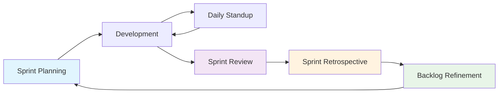

# 🚀 **Planificación de Sprint - Chatbot de Portfolio Profesional**

## 📋 **Resumen Ejecutivo**

Este documento define la metodología de planificación de sprint para el desarrollo del chatbot de portfolio profesional, utilizando metodologías ágiles para asegurar entregas incrementales y de alta calidad.

### **Objetivos de la Planificación de Sprint**
- Establecer estructura clara para desarrollo iterativo
- Definir criterios de aceptación y Definition of Done
- Optimizar velocidad de desarrollo y calidad del código
- Facilitar comunicación entre equipos y stakeholders
- Asegurar entregas predecibles y valor continuo

---

## 🎯 **Metodología Ágil y Estructura de Sprint**

### **Framework Ágil Adoptado**
```yaml
# agile-framework.yaml
agile_framework:
  methodology: "Scrum + Kanban"
  sprint_duration: "2 semanas"
  sprint_ceremonies:
    - "Sprint Planning (2 horas)"
    - "Daily Standup (15 minutos)"
    - "Sprint Review (1 hora)"
    - "Sprint Retrospective (1 hora)"
    - "Backlog Refinement (1 hora)"
  
  team_structure:
    scrum_master: "1"
    product_owner: "1"
    development_team: "4-6 personas"
    qa_engineer: "1"
    devops_engineer: "1"
  
  roles_responsibilities:
    scrum_master:
      - "Facilitar ceremonias de sprint"
      - "Remover impedimentos"
      - "Mantener proceso ágil"
      - "Coaching del equipo"
    
    product_owner:
      - "Priorizar backlog"
      - "Definir criterios de aceptación"
      - "Aceptar/rechazar user stories"
      - "Comunicar con stakeholders"
    
    development_team:
      - "Estimar user stories"
      - "Desarrollar funcionalidades"
      - "Participar en ceremonias"
      - "Mantener calidad del código"
```

### **Ciclo de Sprint**


---

## 📅 **Calendario de Sprints 2024**

### **Roadmap de Sprints**
```yaml
# sprint-roadmap.yaml
sprint_roadmap_2024:
  q1_2024:
    sprint_1:
      dates: "Enero 1-14"
      focus: "MVP Core Features"
      goals:
        - "Arquitectura del sistema"
        - "Integración Dialogflow básica"
        - "API REST básica"
      velocity_target: "25 story points"
    
    sprint_2:
      dates: "Enero 15-28"
      focus: "Backend Foundation"
      goals:
        - "Base de datos PostgreSQL"
        - "Sistema de autenticación"
        - "Servicios core"
      velocity_target: "30 story points"
    
    sprint_3:
      dates: "Enero 29 - Febrero 11"
      focus: "Frontend Foundation"
      goals:
        - "React app básica"
        - "Componentes UI"
        - "Integración con backend"
      velocity_target: "28 story points"
    
    sprint_4:
      dates: "Febrero 12-25"
      focus: "Integration & Testing"
      goals:
        - "Integración completa"
        - "Testing básico"
        - "Deploy en staging"
      velocity_target: "25 story points"
  
  q2_2024:
    sprint_5:
      dates: "Febrero 26 - Marzo 10"
      focus: "MVP Polish"
      goals:
        - "Refinamiento de funcionalidades"
        - "Testing de integración"
        - "Documentación de usuario"
      velocity_target: "20 story points"
    
    sprint_6:
      dates: "Marzo 11-24"
      focus: "Production Ready"
      goals:
        - "Testing de seguridad"
        - "Performance optimization"
        - "Deploy en producción"
      velocity_target: "18 story points"
    
    sprint_7:
      dates: "Marzo 25 - Abril 7"
      focus: "V1.0 Features"
      goals:
        - "Funcionalidades avanzadas"
        - "Analytics básicos"
        - "Mejoras de UX"
      velocity_target: "32 story points"
    
    sprint_8:
      dates: "Abril 8-21"
      focus: "Testing & Polish"
      goals:
        - "Testing completo"
        - "Optimización de performance"
        - "Preparación para lanzamiento"
      velocity_target: "25 story points"
  
  q3_2024:
    sprint_9:
      dates: "Abril 22 - Mayo 5"
      focus: "V1.0 Launch"
      goals:
        - "Lanzamiento beta"
        - "Feedback collection"
        - "Bug fixes críticos"
      velocity_target: "20 story points"
    
    sprint_10:
      dates: "Mayo 6-19"
      focus: "Post-Launch Support"
      goals:
        - "Soporte a usuarios"
        - "Monitoreo de métricas"
        - "Iteraciones basadas en feedback"
      velocity_target: "22 story points"
    
    sprint_11:
      dates: "Mayo 20 - Junio 2"
      focus: "V2.0 Planning"
      goals:
        - "Análisis de feedback"
        - "Planificación de V2.0"
        - "Arquitectura de nuevas funcionalidades"
      velocity_target: "18 story points"
    
    sprint_12:
      dates: "Junio 3-16"
      focus: "V2.0 Development"
      goals:
        - "Desarrollo de IA avanzada"
        - "Sistema de analytics"
        - "Integraciones externas"
      velocity_target: "35 story points"
```

---

## 📝 **Proceso de Sprint Planning**

### **Agenda de Sprint Planning**
```yaml
# sprint-planning-agenda.yaml
sprint_planning_agenda:
  duration: "2 horas"
  participants: "Todo el equipo de desarrollo + PO + SM"
  
  agenda:
    sprint_goals:
      duration: "15 minutos"
      activities:
        - "Revisar objetivos del sprint"
        - "Confirmar prioridades del PO"
        - "Identificar dependencias"
    
    capacity_planning:
      duration: "15 minutos"
      activities:
        - "Confirmar disponibilidad del equipo"
        - "Identificar días de vacaciones"
        - "Considerar otras responsabilidades"
    
    story_selection:
      duration: "60 minutos"
      activities:
        - "Revisar user stories del backlog"
        - "Estimar story points"
        - "Seleccionar stories para el sprint"
        - "Confirmar Definition of Done"
    
    task_breakdown:
      duration: "20 minutos"
      activities:
        - "Descomponer stories en tareas"
        - "Asignar responsabilidades"
        - "Identificar riesgos e impedimentos"
    
    sprint_commitment:
      duration: "10 minutos"
      activities:
        - "Confirmar compromiso del equipo"
        - "Establecer sprint goal"
        - "Confirmar fecha de demo"
```

### **Criterios de Selección de User Stories**
```yaml
# story-selection-criteria.yaml
story_selection_criteria:
  priority_factors:
    business_value:
      weight: "40%"
      criteria:
        - "Impacto en objetivos del negocio"
        - "Valor para el usuario final"
        - "ROI esperado"
    
    technical_risk:
      weight: "25%"
      criteria:
        - "Complejidad técnica"
        - "Dependencias externas"
        - "Riesgo de implementación"
    
    team_capacity:
      weight: "20%"
      criteria:
        - "Disponibilidad del equipo"
        - "Skills requeridos"
        - "Tiempo estimado"
    
    dependencies:
      weight: "15%"
      criteria:
        - "Dependencias de otros equipos"
        - "Dependencias de infraestructura"
        - "Dependencias de terceros"
  
  selection_rules:
    - "Priorizar stories de alto valor y bajo riesgo"
    - "Mantener balance entre features y technical debt"
    - "Considerar dependencias entre stories"
    - "Asegurar que el sprint sea completable"
    - "Mantener 20% de buffer para imprevistos"
```

---

## 🎯 **User Stories y Criterios de Aceptación**

### **Ejemplos de User Stories para Sprint 1**
```yaml
# sprint-1-stories.yaml
sprint_1_stories:
  story_1:
    id: "US-001"
    title: "Como desarrollador, quiero poder configurar mi perfil básico para personalizar mi portfolio"
    description: "Implementar sistema de registro y configuración de perfil de usuario"
    acceptance_criteria:
      - "Usuario puede crear cuenta con email y contraseña"
      - "Usuario puede completar perfil básico (nombre, rol, experiencia)"
      - "Usuario puede subir foto de perfil"
      - "Usuario puede editar información del perfil"
      - "Datos se guardan en base de datos PostgreSQL"
    story_points: "5"
    priority: "High"
    dependencies: []
    estimated_hours: "16"
  
  story_2:
    id: "US-002"
    title: "Como usuario, quiero poder hacer preguntas sobre mi experiencia para obtener respuestas contextuales"
    description: "Implementar integración básica con Dialogflow para procesamiento de lenguaje natural"
    acceptance_criteria:
      - "Sistema puede recibir preguntas de texto del usuario"
      - "Sistema envía preguntas a Dialogflow para procesamiento"
      - "Sistema recibe respuesta de Dialogflow"
      - "Sistema devuelve respuesta al usuario"
      - "Respuestas se almacenan en base de datos"
    story_points: "8"
    priority: "High"
    dependencies: ["US-001"]
    estimated_hours: "24"
  
  story_3:
    id: "US-003"
    title: "Como desarrollador, quiero poder agregar proyectos a mi portfolio para mostrar mi trabajo"
    description: "Implementar sistema de gestión de proyectos del portfolio"
    acceptance_criteria:
      - "Usuario puede crear nuevo proyecto con título y descripción"
      - "Usuario puede subir imágenes del proyecto"
      - "Usuario puede especificar tecnologías utilizadas"
      - "Usuario puede agregar enlaces a repositorios"
      - "Proyectos se muestran en portfolio del usuario"
    story_points: "5"
    priority: "Medium"
    dependencies: ["US-001"]
    estimated_hours: "20"
  
  story_4:
    id: "US-004"
    title: "Como usuario, quiero poder acceder a mi portfolio desde cualquier dispositivo para máxima accesibilidad"
    description: "Implementar interfaz web responsive para el portfolio"
    acceptance_criteria:
      - "Portfolio se adapta a diferentes tamaños de pantalla"
      - "Interfaz funciona correctamente en móvil, tablet y desktop"
      - "Navegación es intuitiva en todos los dispositivos"
      - "Contenido se carga rápidamente en conexiones lentas"
      - "Accesibilidad cumple estándares WCAG 2.1 AA"
    story_points: "7"
    priority: "Medium"
    dependencies: ["US-001", "US-003"]
    estimated_hours: "28"
```

### **Definition of Done**
```yaml
# definition-of-done.yaml
definition_of_done:
  development:
    - "Código implementado según estándares del equipo"
    - "Código revisado por al menos otro desarrollador"
    - "Todas las pruebas unitarias pasan"
    - "Código cumple con estándares de calidad (linting, formatting)"
    - "Documentación técnica actualizada"
  
  testing:
    - "Funcionalidad probada manualmente"
    - "Pruebas de integración pasan"
    - "Pruebas de regresión ejecutadas"
    - "Pruebas de performance básicas ejecutadas"
    - "Bugs críticos y altos resueltos"
  
  deployment:
    - "Código desplegado en ambiente de staging"
    - "Funcionalidad validada en staging"
    - "Documentación de usuario actualizada"
    - "Release notes preparados"
    - "Stakeholders notificados"
  
  business:
    - "Product Owner ha aceptado la funcionalidad"
    - "Criterios de aceptación cumplidos"
    - "Funcionalidad demostrada en sprint review"
    - "Feedback de stakeholders incorporado"
    - "Métricas de éxito definidas y monitoreadas"
```

---

## 📊 **Estimación y Velocidad del Equipo**

### **Sistema de Estimación**
```yaml
# estimation-system.yaml
estimation_system:
  method: "Planning Poker con Fibonacci"
  scale: "[1, 2, 3, 5, 8, 13, 21, 34, 55, 89, ?]"
  
  story_point_guidelines:
    1: "Tarea muy simple, < 2 horas"
    2: "Tarea simple, 2-4 horas"
    3: "Tarea pequeña, 4-8 horas"
    5: "Tarea mediana, 1-2 días"
    8: "Tarea grande, 2-3 días"
    13: "Tarea muy grande, 3-5 días"
    21: "Tarea enorme, 1-2 semanas"
    34: "Epic, debe ser dividido"
  
  estimation_factors:
    complexity:
      - "Número de componentes involucrados"
      - "Interacciones entre sistemas"
      - "Lógica de negocio compleja"
    
    uncertainty:
      - "Nuevas tecnologías"
      - "Dependencias externas"
      - "Requisitos no claros"
    
    effort:
      - "Cantidad de código"
      - "Configuración requerida"
      - "Testing necesario"
  
  estimation_process:
    1: "PO presenta user story"
    2: "Equipo hace preguntas de clarificación"
    3: "Cada miembro estima en privado"
    4: "Estimaciones se revelan simultáneamente"
    5: "Si hay discrepancia, se discute y re-estima"
    6: "Se repite hasta alcanzar consenso"
```

### **Cálculo de Velocidad**
```yaml
# velocity-calculation.yaml
velocity_calculation:
  method: "Promedio de últimos 3 sprints"
  
  sprint_1_velocity: "25 story points"
  sprint_2_velocity: "28 story points"
  sprint_3_velocity: "30 story points"
  
  average_velocity: "27.7 story points"
  recommended_commitment: "25 story points (90% del promedio)"
  
  velocity_factors:
    team_maturity:
      - "Equipo nuevo: 70-80% del promedio"
      - "Equipo maduro: 90-100% del promedio"
      - "Equipo experimentado: 100-110% del promedio"
    
    sprint_complexity:
      - "Sprint simple: +10% del promedio"
      - "Sprint normal: promedio"
      - "Sprint complejo: -10% del promedio"
    
    team_availability:
      - "Vacaciones: -15% por persona ausente"
      - "Capacitación: -10% por persona"
      - "Otros proyectos: -20% por persona"
  
  velocity_tracking:
    - "Registrar story points completados por sprint"
    - "Analizar tendencias de velocidad"
    - "Identificar factores que afectan velocidad"
    - "Ajustar estimaciones futuras"
    - "Celebrar mejoras en velocidad"
```

---

## 📋 **Sprint Backlog y Task Management**

### **Estructura del Sprint Backlog**
```yaml
# sprint-backlog-structure.yaml
sprint_backlog_structure:
  sprint_info:
    sprint_number: "Sprint 1"
    start_date: "Enero 1, 2024"
    end_date: "Enero 14, 2024"
    sprint_goal: "Implementar funcionalidades core del MVP"
    velocity_target: "25 story points"
  
  user_stories:
    - id: "US-001"
      title: "Configuración de perfil básico"
      story_points: "5"
      status: "In Progress"
      assignee: "Developer A"
      tasks:
        - "Diseñar esquema de base de datos"
        - "Implementar API de usuarios"
        - "Crear formulario de registro"
        - "Implementar validaciones"
        - "Testing de funcionalidad"
      estimated_hours: "16"
      actual_hours: "8"
      remaining_hours: "8"
    
    - id: "US-002"
      title: "Integración con Dialogflow"
      story_points: "8"
      status: "To Do"
      assignee: "Developer B"
      tasks:
        - "Configurar proyecto Dialogflow"
        - "Implementar servicio de integración"
        - "Crear intents básicos"
        - "Testing de integración"
        - "Documentación de API"
      estimated_hours: "24"
      actual_hours: "0"
      remaining_hours: "24"
  
  sprint_metrics:
    total_story_points: "13"
    completed_story_points: "0"
    total_estimated_hours: "40"
    total_actual_hours: "8"
    total_remaining_hours: "32"
    completion_percentage: "0%"
```

### **Template de Task Breakdown**
```yaml
# task-breakdown-template.yaml
task_breakdown_template:
  task_structure:
    task_id: "T-001"
    user_story: "US-001"
    title: "Diseñar esquema de base de datos"
    description: "Crear diagrama ER y scripts SQL para tabla de usuarios"
    
    acceptance_criteria:
      - "Diagrama ER completo de tabla USERS"
      - "Scripts SQL para crear tabla"
      - "Índices y constraints definidos"
      - "Documentación del esquema"
    
    technical_details:
      - "PostgreSQL 14"
      - "Herramienta: dbdiagram.io o similar"
      - "Incluir campos: id, email, password_hash, name, role, experience, created_at, updated_at"
    
    estimation:
      story_points: "1"
      hours: "4"
      complexity: "Low"
    
    dependencies:
      - "Ninguna"
    
    assignee: "Developer A"
    status: "In Progress"
    start_date: "Enero 1, 2024"
    due_date: "Enero 3, 2024"
    
    progress:
      completed_percentage: "50%"
      actual_hours: "2"
      remaining_hours: "2"
      blockers: []
      notes: "Esquema básico completado, trabajando en índices"
```

---

## 📈 **Sprint Metrics y Reporting**

### **Métricas Clave del Sprint**
```yaml
# sprint-metrics.yaml
sprint_metrics:
  velocity_metrics:
    - "Story points completados por sprint"
    - "Velocidad promedio (últimos 3 sprints)"
    - "Tendencia de velocidad"
    - "Predicción de velocidad futura"
  
  quality_metrics:
    - "Bugs reportados por sprint"
    - "Bugs críticos por sprint"
    - "Code coverage de pruebas"
    - "Technical debt identificado"
    - "Defect escape rate"
  
  efficiency_metrics:
    - "Story points vs. horas estimadas"
    - "Tiempo promedio por story point"
    - "Tiempo en desarrollo vs. testing"
    - "Tiempo en debugging vs. desarrollo"
    - "Re-work rate"
  
  team_metrics:
    - "Disponibilidad del equipo"
    - "Impedimentos reportados"
    - "Tiempo de resolución de impedimentos"
    - "Satisfacción del equipo"
    - "Retention rate del equipo"
```

### **Sprint Burndown Chart**
```yaml
# burndown-chart.yaml
burndown_chart_data:
  sprint_duration: "10 días laborables"
  total_story_points: "25"
  
  ideal_burndown:
    day_1: "25"
    day_2: "22.5"
    day_3: "20"
    day_4: "17.5"
    day_5: "15"
    day_6: "12.5"
    day_7: "10"
    day_8: "7.5"
    day_9: "5"
    day_10: "2.5"
  
  actual_burndown:
    day_1: "25"
    day_2: "23"
    day_3: "21"
    day_4: "19"
    day_5: "18"
    day_6: "16"
    day_7: "14"
    day_8: "12"
    day_9: "10"
    day_10: "8"
  
  analysis:
    on_track: "No"
    reason: "Velocidad menor a la esperada"
    risk_level: "Medium"
    mitigation: "Revisar impedimentos y ajustar scope si es necesario"
```

---

## 🔄 **Sprint Ceremonies y Proceso**

### **Daily Standup Structure**
```yaml
# daily-standup.yaml
daily_standup_structure:
  duration: "15 minutos máximo"
  time: "9:00 AM cada día laborable"
  participants: "Todo el equipo de desarrollo + SM"
  
  format:
    - "¿Qué completaste ayer?"
    - "¿Qué planeas hacer hoy?"
    - "¿Hay algún impedimento o bloqueo?"
  
  rules:
    - "Mantener respuestas breves y concisas"
    - "No resolver problemas durante standup"
    - "Anotar impedimentos para seguimiento posterior"
    - "Actualizar tablero Kanban"
    - "Respetar el tiempo límite"
  
  impediment_tracking:
    - "Registrar impedimento en sistema"
    - "Asignar responsable de resolución"
    - "Establecer fecha límite"
    - "Seguimiento diario hasta resolución"
    - "Escalar si no se resuelve en 24h"
```

### **Sprint Review Agenda**
```yaml
# sprint-review-agenda.yaml
sprint_review_agenda:
  duration: "1 hora"
  participants: "Equipo de desarrollo + PO + SM + Stakeholders"
  
  agenda:
    sprint_overview:
      duration: "10 minutos"
      presenter: "Scrum Master"
      content:
        - "Objetivos del sprint"
        - "Stories completadas vs. planeadas"
        - "Métricas del sprint"
    
    demo_functionality:
      duration: "30 minutos"
      presenter: "Development Team"
      content:
        - "Demo de cada story completada"
        - "Funcionalidades implementadas"
        - "Interacción con stakeholders"
    
    feedback_collection:
      duration: "15 minutos"
      presenter: "Product Owner"
      content:
        - "Feedback de stakeholders"
        - "Preguntas y respuestas"
        - "Sugerencias de mejora"
    
    next_sprint_preview:
      duration: "5 minutos"
      presenter: "Product Owner"
      content:
        - "Objetivos del próximo sprint"
        - "Stories prioritarias"
        - "Dependencias identificadas"
  
  demo_guidelines:
    - "Preparar demo con datos reales"
    - "Mostrar funcionalidad desde perspectiva del usuario"
    - "Explicar beneficios de negocio"
    - "Estar preparado para preguntas técnicas"
    - "Documentar feedback recibido"
```

### **Sprint Retrospective Process**
```yaml
# sprint-retrospective.yaml
sprint_retrospective_process:
  duration: "1 hora"
  participants: "Equipo de desarrollo + SM"
  format: "Start, Stop, Continue, More of, Less of"
  
  agenda:
    data_gathering:
      duration: "15 minutos"
      activities:
        - "Revisar métricas del sprint"
        - "Identificar eventos clave"
        - "Recopilar feedback del equipo"
    
    discussion:
      duration: "30 minutos"
      activities:
        - "Analizar qué funcionó bien"
        - "Identificar problemas y causas raíz"
        - "Generar ideas de mejora"
        - "Priorizar acciones"
    
    action_planning:
      duration: "15 minutos"
      activities:
        - "Definir acciones específicas"
        - "Asignar responsables"
        - "Establecer fechas límite"
        - "Confirmar compromisos"
  
  retrospective_techniques:
    - "Mad, Sad, Glad"
    - "4Ls (Liked, Learned, Lacked, Longed for)"
    - "Sailboat (Wind, Anchor, Rocks, Island)"
    - "Timeline"
    - "Speed Car"
  
  action_tracking:
    - "Registrar acciones en sistema"
    - "Revisar progreso en siguiente retrospectiva"
    - "Celebrar éxitos y mejoras"
    - "Ajustar acciones si es necesario"
```

---

## 🚨 **Risk Management y Impediments**

### **Identificación y Gestión de Riesgos**
```yaml
# risk-management.yaml
risk_management:
  risk_categories:
    technical_risks:
      - "Dependencias de terceros no disponibles"
      - "Problemas de integración entre sistemas"
      - "Rendimiento no cumple expectativas"
      - "Problemas de seguridad identificados"
    
    business_risks:
      - "Cambios en requisitos del negocio"
      - "Stakeholders no disponibles para feedback"
      - "Presupuesto reducido o restringido"
      - "Cambios en prioridades del mercado"
    
    team_risks:
      - "Miembros del equipo no disponibles"
      - "Skills faltantes en el equipo"
      - "Conflictos o problemas de comunicación"
      - "Burnout o baja moral del equipo"
    
    external_risks:
      - "Problemas de infraestructura"
      - "Cambios en regulaciones o compliance"
      - "Problemas con proveedores"
      - "Eventos externos (pandemia, desastres)"
  
  risk_assessment:
    probability: "Alta, Media, Baja"
    impact: "Alto, Medio, Bajo"
    risk_level: "Probability × Impact"
  
  mitigation_strategies:
    avoid: "Cambiar plan para evitar el riesgo"
    transfer: "Transferir riesgo a terceros"
    mitigate: "Reducir probabilidad o impacto"
    accept: "Aceptar riesgo y tener plan de contingencia"
```

### **Impediment Management Process**
```yaml
# impediment-management.yaml
impediment_management:
  impediment_types:
    technical:
      - "Problemas de infraestructura"
      - "Dependencias técnicas no resueltas"
      - "Problemas de configuración"
      - "Bugs críticos en herramientas"
    
    process:
      - "Procedimientos no claros"
      - "Falta de documentación"
      - "Problemas de comunicación"
      - "Decisiones pendientes"
    
    external:
      - "Proveedores no responden"
      - "Stakeholders no disponibles"
      - "Cambios en requisitos"
      - "Problemas de compliance"
  
  escalation_process:
    level_1: "Equipo intenta resolver en 24h"
    level_2: "Scrum Master interviene en 48h"
    level_3: "Product Owner involucrado en 72h"
    level_4: "Stakeholders notificados en 1 semana"
  
  impediment_tracking:
    - "Registrar en sistema de tracking"
    - "Asignar responsable de resolución"
    - "Establecer fecha límite"
    - "Seguimiento diario"
    - "Escalar si no se resuelve"
    - "Documentar lecciones aprendidas"
```

---

## 📊 **Sprint Reporting y Stakeholder Communication**

### **Sprint Report Template**
```yaml
# sprint-report-template.yaml
sprint_report_template:
  sprint_summary:
    sprint_number: "Sprint 1"
    dates: "Enero 1-14, 2024"
    team: "Portfolio Chatbot Development Team"
    sprint_goal: "Implementar funcionalidades core del MVP"
  
  objectives_achievement:
    planned_stories: "4 user stories"
    completed_stories: "3 user stories"
    completion_rate: "75%"
    story_points_planned: "25"
    story_points_completed: "18"
    velocity: "18 story points"
  
  key_deliverables:
    completed:
      - "Sistema de registro y autenticación"
      - "Configuración de perfil de usuario"
      - "Integración básica con Dialogflow"
    in_progress:
      - "Sistema de gestión de proyectos"
    not_started:
      - "Interfaz web responsive"
  
  quality_metrics:
    bugs_found: "5"
    bugs_critical: "0"
    bugs_high: "1"
    bugs_medium: "3"
    bugs_low: "1"
    code_coverage: "78%"
  
  team_performance:
    team_velocity: "18 story points"
    velocity_trend: "Primer sprint, baseline establecida"
    impediments_resolved: "3"
    impediments_remaining: "1"
    team_satisfaction: "4.2/5"
  
  risks_and_issues:
    current_risks:
      - "Integración con Dialogflow más compleja de lo esperado"
    resolved_issues:
      - "Problema de configuración de base de datos resuelto"
    upcoming_challenges:
      - "Implementación de interfaz responsive en tiempo limitado"
  
  next_sprint_preview:
    focus: "Completar MVP y preparar para testing"
    key_stories:
      - "Finalizar sistema de gestión de proyectos"
      - "Implementar interfaz web responsive"
      - "Testing de integración completo"
    dependencies: "Feedback de stakeholders sobre funcionalidades actuales"
  
  recommendations:
    - "Mantener velocidad actual para próximos sprints"
    - "Incrementar testing automatizado para mejorar calidad"
    - "Involucrar stakeholders más temprano en el proceso"
    - "Considerar reducir scope si hay problemas de tiempo"
```

### **Stakeholder Communication Plan**
```yaml
# stakeholder-communication.yaml
stakeholder_communication:
  communication_channels:
    sprint_review:
      frequency: "Cada 2 semanas"
      audience: "Todos los stakeholders"
      format: "Presentación + demo"
      purpose: "Mostrar progreso y recopilar feedback"
    
    weekly_status_report:
      frequency: "Semanal"
      audience: "Product Owner, Project Manager"
      format: "Email + dashboard"
      purpose: "Actualización de estado y métricas"
    
    daily_standup_summary:
      frequency: "Diario"
      audience: "Product Owner, Project Manager"
      format: "Email resumido"
      purpose: "Actualización rápida de progreso"
    
    impediment_alerts:
      frequency: "Cuando ocurran"
      audience: "Stakeholders relevantes"
      format: "Email + Slack"
      purpose: "Notificar problemas que requieren atención"
  
  stakeholder_roles:
    product_owner:
      communication_level: "High"
      channels: ["Sprint Review", "Weekly Report", "Daily Summary"]
      responsibilities: ["Aceptar/rechazar stories", "Priorizar backlog", "Comunicar con business"]
    
    project_manager:
      communication_level: "Medium"
      channels: ["Weekly Report", "Daily Summary", "Impediment Alerts"]
      responsibilities: ["Monitorear progreso", "Reportar a stakeholders", "Gestionar recursos"]
    
    business_stakeholders:
      communication_level: "Medium"
      channels: ["Sprint Review", "Monthly Report"]
      responsibilities: ["Proporcionar feedback", "Validar funcionalidades", "Aprobar cambios"]
    
    technical_stakeholders:
      communication_level: "Low"
      channels: ["Sprint Review", "Technical Documentation"]
      responsibilities: ["Revisar arquitectura", "Validar decisiones técnicas", "Aprobar deployments"]
```

---

## 🎯 **Continuous Improvement y Best Practices**

### **Mejoras Continuas del Proceso**
```yaml
# continuous-improvement.yaml
continuous_improvement:
  improvement_areas:
    estimation_accuracy:
      - "Comparar estimaciones vs. tiempo real"
      - "Identificar patrones de sub/sobre estimación"
      - "Ajustar guidelines de story points"
      - "Mejorar proceso de estimación"
    
    team_velocity:
      - "Analizar factores que afectan velocidad"
      - "Identificar y resolver impedimentos recurrentes"
      - "Mejorar skills del equipo"
      - "Optimizar procesos de desarrollo"
    
    quality_metrics:
      - "Reducir número de bugs por sprint"
      - "Mejorar code coverage"
      - "Implementar testing automatizado"
      - "Establecer estándares de calidad"
    
    team_collaboration:
      - "Mejorar comunicación entre miembros"
      - "Establecer mejores prácticas de pair programming"
      - "Implementar code review efectivo"
      - "Fomentar conocimiento compartido"
  
  improvement_process:
    1: "Identificar áreas de mejora en retrospectiva"
    2: "Priorizar mejoras por impacto y esfuerzo"
    3: "Implementar mejoras en siguiente sprint"
    4: "Medir impacto de mejoras"
    5: "Ajustar y iterar"
    6: "Documentar lecciones aprendidas"
  
  success_metrics:
    - "Reducción en tiempo de resolución de impedimentos"
    - "Mejora en precisión de estimaciones"
    - "Aumento en velocidad del equipo"
    - "Reducción en defectos"
    - "Mejora en satisfacción del equipo"
    - "Mejora en satisfacción de stakeholders"
```

### **Best Practices del Sprint**
```yaml
# sprint-best-practices.yaml
sprint_best_practices:
  planning:
    - "Mantener sprint goal claro y alcanzable"
    - "No sobre-commit al equipo"
    - "Considerar dependencias entre stories"
    - "Incluir buffer para imprevistos"
    - "Validar estimaciones con el equipo"
  
  execution:
    - "Actualizar tablero Kanban diariamente"
    - "Reportar impedimentos inmediatamente"
    - "Mantener comunicación constante"
    - "Revisar progreso regularmente"
    - "Ajustar plan si es necesario"
  
  quality:
    - "No comprometer calidad por velocidad"
    - "Mantener Definition of Done estricto"
    - "Implementar testing temprano"
    - "Revisar código regularmente"
    - "Documentar decisiones importantes"
  
  communication:
    - "Mantener stakeholders informados"
    - "Comunicar problemas temprano"
    - "Ser transparente sobre progreso"
    - "Solicitar feedback regularmente"
    - "Documentar lecciones aprendidas"
  
  team_health:
    - "Mantener sustainable pace"
    - "Celebrar éxitos del equipo"
    - "Aprender de fracasos"
    - "Fomentar colaboración"
    - "Cuidar bienestar del equipo"
```

---

## 📚 **Conclusiones y Próximos Pasos**

### **Resumen de la Metodología**
La planificación de sprint proporciona un framework estructurado y predecible para el desarrollo del chatbot de portfolio profesional, asegurando entregas incrementales de alta calidad mientras se mantiene la flexibilidad para adaptarse a cambios.

### **Próximos Pasos**
1. **Implementar estructura de sprint** en el equipo de desarrollo
2. **Configurar herramientas** de tracking y reporting
3. **Capacitar al equipo** en metodologías ágiles
4. **Establecer métricas** de seguimiento y mejora
5. **Iniciar primer sprint** siguiendo la metodología definida

### **Beneficios Esperados**
- **Entregas predecibles** cada 2 semanas
- **Mejor calidad** del código y funcionalidades
- **Comunicación mejorada** entre equipo y stakeholders
- **Gestión efectiva de riesgos** e impedimentos
- **Mejora continua** del proceso de desarrollo

Esta metodología de sprint planning proporciona la base para un desarrollo exitoso y sostenible del chatbot de portfolio profesional.
