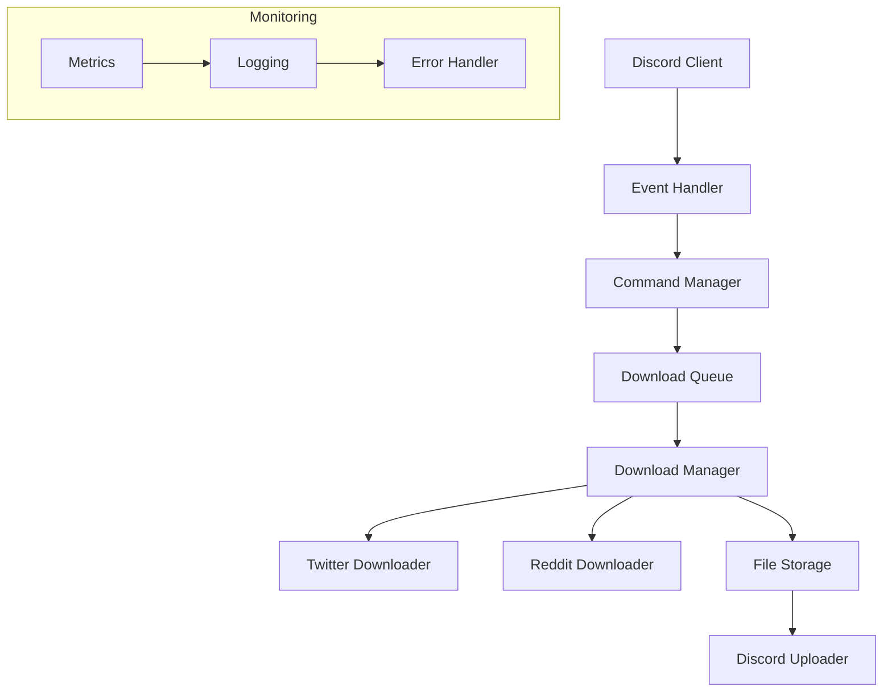
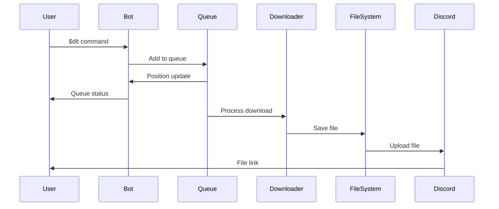

# Architecture for Boss-Bot: A Discord Media Download and RAG Assistant

Status: Approved

## Technical Summary

Boss-Bot is a Discord bot designed to provide reliable media download capabilities from platforms like Twitter and Reddit, with a foundation for future RAG (Retrieval-Augmented Generation) features. The architecture follows a modular, event-driven design using Python 3.12 and discord.py as the core framework. The system implements a robust queue management system for downloads, comprehensive error handling, and a test-driven development approach.

## Technology Table

| Technology | Description | Version |
|------------|-------------|----------|
| Python | Primary development language, chosen for strong async support and modern features | >=3.12 |
| discord.py | Discord bot framework providing event handling and API integration | >=2.5.2 |
| gallery-dl | Media download utility for Twitter, Reddit, and other platforms | >=1.29.3 |
| yt-dlp | YouTube/video download utility for extended platform support | Latest |
| httpx | Modern HTTP client for async API interactions | Latest |
| pydantic | Data validation and settings management | >=2.0 |
| pydantic-settings | Environment configuration management | Latest |
| loguru | Advanced logging with structured output | Latest |
| pytest | Testing framework with async support | Latest |
| pytest-asyncio | Async test support | Latest |
| dpytest | Discord.py testing utilities | Latest |
| better-exceptions | Enhanced exception handling and formatting | Latest |
| ruff | Fast Python linter and formatter written in Rust | Latest |
| uv | Modern Python package manager for dependency management | Latest |

## Architectural Diagrams

### Core System Architecture



### Download Flow



## Environment Configuration

### Settings Management
```python
from pydantic_settings import BaseSettings
from pydantic import SecretStr

class BotSettings(BaseSettings):
    """Bot configuration settings."""
    # Sensitive data using SecretStr
    discord_token: SecretStr

    # Basic configuration
    command_prefix: str = "$"
    max_concurrent_downloads: int = 5
    max_queue_size: int = 50

    class Config:
        env_prefix = "BOSS_BOT_"
```

### Required Environment Variables
```bash
# Required
BOSS_BOT_DISCORD_TOKEN=required      # Discord bot token (sensitive)
BOSS_BOT_COMMAND_PREFIX=$            # Command prefix (optional)

# Optional with defaults
BOSS_BOT_MAX_CONCURRENT_DOWNLOADS=5
BOSS_BOT_MAX_QUEUE_SIZE=50
```

## Data Models

### Core Models

```python
from datetime import datetime
from typing import Optional, List
from uuid import UUID
from pydantic import BaseModel, HttpUrl

class DownloadStatus(str, Enum):
    """Status of a download item."""
    QUEUED = "queued"
    DOWNLOADING = "downloading"
    COMPLETED = "completed"
    FAILED = "failed"
    CANCELLED = "cancelled"

class DownloadPriority(int, Enum):
    """Priority levels for downloads."""
    LOW = 0
    NORMAL = 1
    HIGH = 2

class DownloadItem(BaseModel):
    """Represents a single download request."""
    id: UUID
    url: HttpUrl
    status: DownloadStatus
    priority: DownloadPriority
    user_id: int
    guild_id: int
    channel_id: int
    created_at: datetime
    progress: float = 0.0
    total_size: Optional[int] = None
    error_message: Optional[str] = None

class QueueState(BaseModel):
    """Represents the current state of the download queue."""
    items: List[DownloadItem]
    active_downloads: int
    total_items: int
    queue_size: int

    @property
    def is_full(self) -> bool:
        return self.total_items >= self.queue_size

class ErrorResponse(BaseModel):
    """Standardized error response."""
    error_code: str
    message: str
    details: Optional[str] = None
    timestamp: datetime = Field(default_factory=datetime.utcnow)
```

## Project Structure

```
boss-bot/
├── src/
│   ├── boss_bot/
│   │   ├── bot/           # Discord bot core
│   │   ├── commands/      # Command implementations
│   │   ├── core/          # Core functionality
│   │   ├── downloaders/   # Download implementations
│   │   ├── schemas/       # Data models
│   │   └── utils/         # Utilities
├── tests/                 # Test suite
├── docs/                  # Documentation
└── scripts/              # Utility scripts
```

## Infrastructure

### Development Environment
- Local development using Python virtual environments
- UV for dependency management
- Pre-commit hooks for code quality
- pytest for testing infrastructure

### Runtime Environment
- Local machine (macOS) or Linux server
- Python 3.12+ runtime
- Persistent storage for temporary files
- Discord API integration
- Logging and monitoring setup

### Resource Requirements
- Basic system requirements for local/server deployment:
  - CPU: 1-2 cores
  - Memory: 512MB minimum
  - Storage: 5GB minimum for temporary files
  - Network: Stable internet connection

## Deployment Plan

### Phase 1: MVP Setup
1. Initialize Python project with UV
2. Set up testing infrastructure with GitHub Actions CI/CD
3. Implement basic Discord bot framework
4. Add core download functionality
5. Implement queue management
6. Set up local deployment via `uv run bossbotctl`

### Phase 2: Enhanced Features
1. Add progress tracking
2. Implement file management
3. Add error handling
4. Set up monitoring
5. Add user management
6. Implement bot admin restart command

### Phase 3: Security Enhancements (Nice to Have)
1. Implement API key rotation strategy
2. Add detailed rate limiting per command
3. Enhance file storage security
4. Implement granular user permissions
5. Set up audit logging
6. Add security monitoring integration

### Phase 4: Future RAG Integration
1. Set up vector store
2. Implement document processing
3. Add RAG functionality
4. Enhance command set

### Error Handling & Resilience

The system leverages built-in error handling and resilience features from gallery-dl and yt-dlp, complemented by our own error management:

#### Platform-Specific Rate Limiting
- Utilizes gallery-dl and yt-dlp's built-in rate limit handling
- Automatic backoff and retry mechanisms per platform
- Configurable delay between requests
- Platform-specific quota management

#### Download Retry Strategy
- Leverages gallery-dl and yt-dlp's retry mechanisms
- Automatic retry on transient failures
- Exponential backoff for repeated failures
- Maximum retry attempts configurable per platform

#### Network Resilience
- Timeout handling through gallery-dl and yt-dlp
- Automatic connection recovery
- Partial download resume capability
- Bandwidth throttling support

#### Failure Recovery
- Automatic cleanup of failed downloads
- Session recovery after bot restart
- Queue state preservation
- Incomplete download handling

```python
class DownloadRetryConfig:
    """Configuration for download retry behavior."""
    MAX_RETRIES = 3
    INITIAL_DELAY = 1.0  # seconds
    MAX_DELAY = 30.0  # seconds
    BACKOFF_FACTOR = 2.0

    @classmethod
    def get_retry_delay(cls, attempt: int) -> float:
        """Calculate delay for retry attempt."""
        delay = cls.INITIAL_DELAY * (cls.BACKOFF_FACTOR ** (attempt - 1))
        return min(delay, cls.MAX_DELAY)

class DownloadManager:
    """Manages download operations with resilience."""

    async def download_with_retry(
        self,
        url: str,
        download_id: str
    ) -> Path:
        """Attempt download with retry logic."""
        for attempt in range(1, DownloadRetryConfig.MAX_RETRIES + 1):
            try:
                return await self._perform_download(url, download_id)
            except Exception as e:
                if attempt == DownloadRetryConfig.MAX_RETRIES:
                    raise DownloadError(f"Max retries exceeded: {str(e)}")

                delay = DownloadRetryConfig.get_retry_delay(attempt)
                logger.warning(
                    f"Download attempt {attempt} failed, retrying in {delay}s",
                    error=str(e),
                    download_id=download_id
                )
                await asyncio.sleep(delay)
```

### CI/CD Pipeline
The project uses GitHub Actions for continuous integration and deployment:
- Automated testing on pull requests
- Code quality checks using ruff
- Documentation generation and validation
- Dependency management with UV

### Bot Management
- Bot runs locally via `uv run bossbotctl`
- Admin-only bot restart command (planned feature)
- No containerization or complex infrastructure required
- Simple start/stop/restart procedures through command line

## Testing Strategy

### Coverage Requirements
```python
COVERAGE_TARGETS = {
    "core_download": 0.30,  # 30% coverage
    "command_parsing": 0.30,
    "discord_events": 0.30,
    "file_management": 0.30
}
```

### Test Infrastructure

The testing infrastructure is built on pytest with async support and specialized Discord testing utilities:

```python
# conftest.py
import pytest
import discord.ext.test as dpytest
from discord.ext import commands
from pathlib import Path

def pytest_configure(config):
    """Configure pytest with custom markers."""
    config.addinivalue_line(
        "markers",
        "integration: mark test as integration test"
    )
    config.addinivalue_line(
        "markers",
        "slow: mark test as slow running"
    )

@pytest.fixture
async def bot():
    """Create a bot instance for testing."""
    intents = discord.Intents.default()
    intents.message_content = True
    bot = commands.Bot(command_prefix="$", intents=intents)
    await bot._async_setup_hook()
    dpytest.configure(bot)
    yield bot
    await dpytest.empty_queue()

@pytest.fixture
def mock_gallery_dl(mocker):
    """Mock gallery-dl functionality using pytest-mock."""
    return mocker.patch("gallery_dl.download")

@pytest.fixture
def mock_yt_dlp(mocker):
    """Mock yt-dlp functionality using pytest-mock."""
    return mocker.patch("yt_dlp.YoutubeDL")

@pytest.fixture
def sample_download_data():
    """Provide sample download data for tests."""
    return {
        "twitter_url": "https://twitter.com/user/status/123",
        "reddit_url": "https://reddit.com/r/sub/comments/123",
        "expected_output": "video.mp4"
    }

@pytest.fixture
def download_dir(tmpdir):
    """Create a temporary download directory."""
    downloads = tmpdir.mkdir("downloads")
    return Path(str(downloads))

@pytest.fixture
def mock_discord_message(mocker):
    """Create a mock Discord message."""
    message = mocker.MagicMock()
    message.author.id = 123456789
    message.guild.id = 987654321
    message.channel.id = 456789123
    return message

@pytest.fixture
def mock_download_manager(mocker, download_dir):
    """Create a mock download manager."""
    manager = mocker.MagicMock()
    manager.download_dir = download_dir
    return manager
```

### Integration Test Strategy

Integration tests focus on key user flows and system interactions:

```python
@pytest.mark.asyncio
class TestDownloadFlow:
    """Test complete download flows."""

    @pytest.mark.integration
    async def test_twitter_download_flow(
        self,
        bot,
        mock_gallery_dl,
        sample_download_data,
        download_dir,
        mock_discord_message
    ):
        """Test complete Twitter download flow."""
        # Arrange
        url = sample_download_data["twitter_url"]
        output_file = download_dir / sample_download_data["expected_output"]
        mock_gallery_dl.return_value = str(output_file)

        # Act
        await dpytest.message(f"$dlt {url}")

        # Assert
        assert dpytest.verify().message().contains("Download started")
        mock_gallery_dl.assert_called_once_with(
            url,
            mocker.ANY  # Config dict
        )
        assert dpytest.verify().message().contains("Download complete")

    @pytest.mark.integration
    async def test_queue_management(
        self,
        bot,
        mock_gallery_dl,
        download_dir,
        mock_discord_message
    ):
        """Test queue handling with multiple downloads."""
        # Arrange
        urls = [f"https://twitter.com/user/status/{i}" for i in range(3)]
        mock_gallery_dl.side_effect = [
            str(download_dir / f"video_{i}.mp4") for i in range(3)
        ]

        # Act & Assert
        for i, url in enumerate(urls, 1):
            await dpytest.message(f"$dlt {url}")
            assert dpytest.verify().message().contains(f"Position in queue: {i}")

    @pytest.mark.integration
    async def test_error_handling(
        self,
        bot,
        mock_gallery_dl,
        mock_discord_message
    ):
        """Test error handling in download flow."""
        # Arrange
        mock_gallery_dl.side_effect = Exception("Download failed")

        # Act
        await dpytest.message("$dlt https://twitter.com/user/status/123")

        # Assert
        assert dpytest.verify().message().contains("Error occurred")

    def test_download_retry(
        self,
        mocker,
        mock_download_manager,
        download_dir
    ):
        """Test download retry mechanism."""
        # Arrange
        url = "https://twitter.com/user/status/123"
        mock_download_manager.download.side_effect = [
            Exception("First attempt failed"),
            Exception("Second attempt failed"),
            str(download_dir / "success.mp4")
        ]

        # Act
        result = mock_download_manager.download_with_retry(url)

        # Assert
        assert mock_download_manager.download.call_count == 3
        assert str(result).endswith("success.mp4")
```

### External Service Mocking

Guidelines for mocking external services using pytest-mock:

1. **Gallery-dl Mocking**
```python
def test_gallery_dl_download(mocker, download_dir):
    """Example of gallery-dl mocking."""
    # Arrange
    mock_gallery_dl = mocker.patch("gallery_dl.download")
    mock_gallery_dl.return_value = {
        "filename": str(download_dir / "video.mp4"),
        "filesize": 1024,
        "url": "https://example.com/video.mp4"
    }

    # Act & Assert
    result = mock_gallery_dl("https://twitter.com/user/status/123")
    assert Path(result["filename"]).parent == download_dir
```

2. **YT-DLP Mocking**
```python
def test_yt_dlp_download(mocker, download_dir):
    """Example of yt-dlp mocking."""
    # Arrange
    mock_yt_dlp = mocker.patch("yt_dlp.YoutubeDL")
    mock_instance = mocker.MagicMock()
    mock_instance.extract_info.return_value = {
        "title": "Test Video",
        "duration": 60,
        "url": str(download_dir / "video.mp4")
    }
    mock_yt_dlp.return_value = mock_instance

    # Act & Assert
    with mock_yt_dlp() as ydl:
        result = ydl.extract_info("https://youtube.com/watch?v=123")
        assert Path(result["url"]).parent == download_dir
```

### Test Data Management

1. **Test Data Storage**
```python
@pytest.fixture
def test_data_dir(tmpdir):
    """Set up test data directory structure."""
    base_dir = Path(str(tmpdir))

    # Create directory structure
    samples = base_dir / "samples"
    samples.mkdir()
    for platform in ["twitter", "reddit", "youtube"]:
        (samples / platform).mkdir()

    # Create mock responses directory
    responses = base_dir / "responses"
    responses.mkdir()

    return base_dir

@pytest.fixture
def cleanup_downloads():
    """Clean up downloads after tests."""
    yield
    # Cleanup happens automatically with tmpdir
```

### CI Integration

GitHub Actions workflow for automated testing:

```yaml
name: Test Suite

on:
  push:
    branches: [ main ]
  pull_request:
    branches: [ main ]

jobs:
  test:
    runs-on: ubuntu-latest
    strategy:
      matrix:
        python-version: ["3.12"]

    steps:
    - uses: actions/checkout@v4

    - name: Set up Python
      uses: actions/setup-python@v5
      with:
        python-version: ${{ matrix.python-version }}

    - name: Install uv
      run: |
        curl -LsSf https://astral.sh/uv/install.sh | sh

    - name: Install dependencies
      run: |
        uv pip install -r requirements.txt
        uv pip install -r requirements-dev.txt

    - name: Run tests
      run: |
        pytest tests/ --cov=boss_bot --cov-report=xml

    - name: Upload coverage
      uses: codecov/codecov-action@v4
      with:
        file: ./coverage.xml
        fail_ci_if_error: true
```

## Error Handling and Logging

### Logging Configuration
```python
import sys
from loguru import logger
import better_exceptions

# Enable better exception formatting
better_exceptions.hook()

# Configure Loguru
logger.remove()  # Remove default handler
logger.configure(
    handlers=[
        {
            "sink": sys.stdout,
            "format": "<green>{time:YYYY-MM-DD HH:mm:ss.SSS}</green> | <level>{level: <8}</level> | <cyan>{name}</cyan>:<cyan>{function}</cyan>:<cyan>{line}</cyan> - <level>{message}</level>",
            "level": "INFO",
            "colorize": True,
            "backtrace": True,
            "diagnose": True,
            "enqueue": True,
        }
    ]
)

# Error logging handler
logger.add(
    sys.stderr,
    format="{time} | {level} | {message}",
    filter=lambda record: record["level"].name == "ERROR",
    level="ERROR",
    backtrace=True,
    diagnose=True,
)
```

### Error Handling Strategy
1. All errors are caught and logged with context
2. User-facing errors are displayed in Discord embeds
3. Stack traces are formatted using better-exceptions
4. Sensitive information is never included in error messages

Example error handler:
```python
from discord.ext import commands
from loguru import logger

class ErrorHandler(commands.Cog):
    """Handles all command errors."""

    @commands.Cog.listener()
    async def on_command_error(self, ctx: commands.Context, error: Exception):
        """Global error handler for all commands."""
        # Log the error with context
        logger.error(
            "Command error occurred",
            command=ctx.command.name if ctx.command else "Unknown",
            user_id=ctx.author.id,
            guild_id=ctx.guild.id if ctx.guild else None,
            error=str(error)
        )

        # Create user-facing error message
        embed = discord.Embed(
            title="Error Occurred",
            description=f"```python\n{better_exceptions.format_exception(error)}\n```",
            color=discord.Color.red()
        )

        # Add error context if available
        if isinstance(error, commands.CommandError):
            embed.add_field(
                name="Error Type",
                value=error.__class__.__name__,
                inline=False
            )

        await ctx.send(embed=embed)
```

### Logging Best Practices
1. Use structured logging with context:
   ```python
   logger.info(
       "Download started",
       url=url,
       user_id=user_id,
       guild_id=guild_id
   )
   ```

2. Log all state transitions:
   ```python
   logger.debug(
       "Download state changed",
       download_id=download.id,
       old_state=old_state,
       new_state=new_state
   )
   ```

3. Never log sensitive information:
   ```python
   # Good
   logger.info("Bot connected", application_id=bot.application.id)

   # Bad - never log tokens or sensitive data
   logger.info("Bot connected with token", token=token)  # Don't do this!
   ```

## Change Log

| Version | Date | Author | Changes |
|---------|------|--------|----------|
| 0.1.0 | 2024-04-17 | @bossjones | Initial architecture draft |
| 0.1.1 | 2024-04-17 | @bossjones | Added testing strategy and error handling |

## Development Guidelines

### Code Style Guidelines
```python
# Formatting and Linting
- All code is formatted using ruff
- Maximum line length: 88 characters (ruff default)
- Use type hints for all functions and variables
- Follow Google docstring format
- Use absolute imports (configured in VSCode settings)

# VSCode Configuration
- Format on save enabled
- Ruff as default formatter
- Pylance as language server
- Semantic highlighting enabled
- Inlay hints for:
  * Variable types
  * Function return types
  * Pytest parameters

# Error Checking
- Pylint configuration:
  * Enable: F,E,E1101 (errors and type checking)
  * Disable: C0111,E0401,C,W,E1205 (style and import warnings)
  * Max line length: 120
  * Plugins: pylint_pydantic, pylint_per_file_ignores

# Type Checking
- Use Pylance/Pyright for type checking
- Strict type checking enabled
- Report missing imports as errors
- Report import cycles as errors
```

### Git Workflow
```bash
# Branching Strategy
- Main branch: `main` (protected, represents production-ready code)
- Development branches: Use feature branches based off `main`.
- Branch Naming Conventions:
  - `feature/<short-description>`: For new features
  - `bugfix/<short-description>`: For bug fixes
  - `hotfix/<short-description>`: For critical production fixes (branch off `main` or release tags)
  - `chore/<short-description>`: For maintenance tasks

# Commit Messages (Conventional Commits)
- Use commitizen for structured commit messages: `<type>(<scope>): <description>`
- Types: `feat`, `fix`, `docs`, `style`, `refactor`, `test`, `chore`
- Example: `feat(download): add Twitter video support`
```

### Versioning Scheme
- Semantic Versioning (SemVer) 2.0.0 is used.
- Version numbers are managed automatically using `commitizen` based on conventional commit messages.

### Release Process
- Releases are automated via GitHub Actions (see `.github/workflows/release.yml`).
- `commitizen` bumps the version number and generates the changelog based on commits since the last tag.
- GitHub CLI (`gh`) is used to create GitHub releases.
- New versions are tagged in Git (e.g., `v1.2.3`).

### Feature Flag Strategy
- Feature flags are managed using environment variables.
- The `pydantic-settings` library is used to load and validate these environment variables, allowing features to be toggled on or off without code changes.
- Example: An environment variable like `BOSS_BOT_ENABLE_EXPERIMENTAL_DOWNLOADER=true` could enable a new feature.

## File Management

### Storage Structure
```text
/tmp/boss-bot/
├── downloads/                    # Organized downloads
│   ├── {guild_id}/              # Per-guild storage
│   │   ├── {yyyy-mm-dd}/        # Date-based organization
│   │   │   ├── {download_id}/   # Individual download
│   │   │   │   ├── metadata.json # Download metadata
│   │   │   │   └── content/     # Downloaded files
│   │   │   └── .cleanup         # Cleanup marker
│   │   └── .stats              # Guild statistics
│   └── .maintenance            # Maintenance logs
├── temp/                       # Temporary storage
│   └── {download_id}/         # In-progress downloads
└── .locks/                    # Lock files
```

### File Naming Conventions
```python
class FileNaming:
    """File naming conventions."""
    DOWNLOAD_FILE = "{timestamp}_{original_name}"  # e.g., 20240417_123456_video.mp4
    TEMP_FILE = "{download_id}_{timestamp}_temp"   # e.g., abc123_20240417_123456_temp
    LOG_FILE = "boss-bot_{date}.log"              # e.g., boss-bot_20240417.log
    METADATA_FILE = "metadata.json"               # Standard name for all metadata files
```

### Storage Policies
```python
class StoragePolicy:
    """Storage management policies."""
    # Size Limits
    MAX_FILE_SIZE = 50 * 1024 * 1024  # 50MB (Discord limit)
    MAX_TEMP_STORAGE = 1024 * 1024 * 1024  # 1GB
    MAX_GUILD_DAILY = 500 * 1024 * 1024  # 500MB per guild per day

    # Retention Periods (in seconds)
    TEMP_FILE_RETENTION = 3600  # 1 hour
    SUCCESSFUL_DOWNLOAD = 86400  # 24 hours
    FAILED_DOWNLOAD = 21600  # 6 hours

    # Cleanup Intervals
    TEMP_SCAN_INTERVAL = 300  # 5 minutes
    MAIN_SCAN_INTERVAL = 3600  # 1 hour
```

### File Operations
```python
from pathlib import Path
from typing import Optional
import aiofiles
import json

async def save_download(
    content: bytes,
    guild_id: int,
    download_id: str,
    original_name: str
) -> Path:
    """Save downloaded content with metadata."""
    timestamp = datetime.now().strftime("%Y%m%d_%H%M%S")
    filename = f"{timestamp}_{original_name}"

    # Create directory structure
    download_dir = Path(f"/tmp/boss-bot/downloads/{guild_id}/{timestamp[:8]}/{download_id}")
    download_dir.mkdir(parents=True, exist_ok=True)

    # Save content
    file_path = download_dir / "content" / filename
    async with aiofiles.open(file_path, "wb") as f:
        await f.write(content)

    # Save metadata
    metadata = {
        "original_name": original_name,
        "timestamp": timestamp,
        "size": len(content),
        "download_id": download_id
    }
    async with aiofiles.open(download_dir / "metadata.json", "w") as f:
        await f.write(json.dumps(metadata))

    return file_path
```

### Cleanup Strategy
```python
class CleanupManager:
    """Manages file cleanup operations."""

    async def cleanup_temp_files(self):
        """Clean temporary files older than retention period."""
        temp_dir = Path("/tmp/boss-bot/temp")
        current_time = time.time()

        async for entry in aiofiles.os.scandir(temp_dir):
            if entry.is_file():
                stats = await aiofiles.os.stat(entry.path)
                age = current_time - stats.st_mtime
                if age > StoragePolicy.TEMP_FILE_RETENTION:
                    await aiofiles.os.remove(entry.path)

    async def cleanup_downloads(self):
        """Clean old downloads based on retention policy."""
        downloads_dir = Path("/tmp/boss-bot/downloads")
        # Implementation details...
```

## Command System

### Command Structure
| Command | Description | Permissions | Rate Limit | Cooldown |
|---------|-------------|-------------|------------|----------|
| `/download <url>` | Download media from supported platforms | `send_messages` | 5/minute | 10s |
| `/queue list` | Show current download queue | `send_messages` | 10/minute | 5s |
| `/queue clear` | Clear download queue | `manage_messages` | 2/minute | 30s |
| `/settings view` | View guild settings | `send_messages` | 10/minute | 5s |
| `/settings update` | Update guild settings | `manage_guild` | 5/minute | 15s |
| `/stats` | View download statistics | `send_messages` | 10/minute | 5s |

### Command Implementation
```python
from discord import app_commands
from discord.ext import commands
from typing import Optional

class DownloadCog(commands.Cog):
    """Download command implementation."""

    def __init__(self, bot):
        self.bot = bot
        self._cd = commands.CooldownMapping.from_cooldown(
            5, 60, commands.BucketType.user
        )

    @app_commands.command(name="download")
    @app_commands.describe(url="URL to download from")
    async def download(
        self,
        interaction: discord.Interaction,
        url: str,
        format: Optional[str] = None
    ):
        """Download media from supported platforms."""
        # Check cooldown
        bucket = self._cd.get_bucket(interaction)
        retry_after = bucket.update_rate_limit()
        if retry_after:
            raise commands.CommandOnCooldown(bucket, retry_after)

        # Validate URL
        if not self.is_supported_url(url):
            await interaction.response.send_message(
                "❌ URL not supported",
                ephemeral=True
            )
            return

        # Queue download
        download_id = await self.queue_download(interaction.guild_id, url, format)

        await interaction.response.send_message(
            f"✅ Download queued! ID: `{download_id}`"
        )
```

### Permission System
```python
from enum import Enum
from typing import Set

class BotPermission(Enum):
    """Bot-specific permissions."""
    DOWNLOAD = "download"
    MANAGE_QUEUE = "manage_queue"
    MANAGE_SETTINGS = "manage_settings"
    VIEW_STATS = "view_stats"

class PermissionManager:
    """Manages bot permissions."""

    def __init__(self):
        self.role_permissions: Dict[int, Set[BotPermission]] = {}

    async def has_permission(
        self,
        member: discord.Member,
        permission: BotPermission
    ) -> bool:
        """Check if member has required permission."""
        # Bot owner always has permission
        if await self.bot.is_owner(member):
            return True

        # Check Discord permissions
        if permission == BotPermission.MANAGE_SETTINGS:
            return member.guild_permissions.manage_guild

        if permission == BotPermission.MANAGE_QUEUE:
            return member.guild_permissions.manage_messages

        # Check role-based permissions
        for role in member.roles:
            if permission in self.role_permissions.get(role.id, set()):
                return True

        return False
```

### Rate Limiting
```python
from datetime import datetime, timedelta
from collections import defaultdict

class RateLimiter:
    """Rate limit implementation."""

    def __init__(self):
        self.limits = defaultdict(list)

    async def check_rate_limit(
        self,
        key: str,
        max_requests: int,
        time_window: int
    ) -> tuple[bool, Optional[float]]:
        """
        Check if request is rate limited.

        Args:
            key: Unique identifier (e.g., user_id or guild_id)
            max_requests: Maximum requests allowed
            time_window: Time window in seconds

        Returns:
            Tuple of (is_limited, retry_after)
        """
        now = datetime.utcnow()
        window_start = now - timedelta(seconds=time_window)

        # Clean old entries
        self.limits[key] = [
            ts for ts in self.limits[key]
            if ts > window_start
        ]

        # Check limit
        if len(self.limits[key]) >= max_requests:
            retry_after = (
                self.limits[key][0] - window_start
            ).total_seconds()
            return True, retry_after

        # Add new timestamp
        self.limits[key].append(now)
        return False, None
```

## Queue Management

### Queue Structure
```python
from dataclasses import dataclass
from datetime import datetime
from enum import Enum
from typing import Optional, Dict, Any

class DownloadStatus(Enum):
    """Download status states."""
    QUEUED = "queued"
    PROCESSING = "processing"
    COMPLETED = "completed"
    FAILED = "failed"

@dataclass
class QueueItem:
    """Represents a queued download."""
    download_id: str
    guild_id: int
    channel_id: int
    user_id: int
    url: str
    status: DownloadStatus
    created_at: datetime
    started_at: Optional[datetime] = None
    completed_at: Optional[datetime] = None
    error: Optional[str] = None
    metadata: Dict[str, Any] = None
```

### Queue Manager
```python
from asyncio import Queue, Lock
from collections import defaultdict

class QueueManager:
    """Manages download queues per guild."""

    def __init__(self, max_concurrent_downloads: int = 3):
        self.max_concurrent = max_concurrent_downloads
        self.queues: Dict[int, Queue[QueueItem]] = defaultdict(Queue)
        self.active_downloads: Dict[int, set] = defaultdict(set)
        self.locks: Dict[int, Lock] = defaultdict(Lock)

    async def add_to_queue(
        self,
        guild_id: int,
        channel_id: int,
        user_id: int,
        url: str
    ) -> QueueItem:
        """Add a new download to the queue."""
        item = QueueItem(
            download_id=self.generate_id(),
            guild_id=guild_id,
            channel_id=channel_id,
            user_id=user_id,
            url=url,
            status=DownloadStatus.QUEUED,
            created_at=datetime.utcnow()
        )

        await self.queues[guild_id].put(item)
        return item

    async def process_queue(self, guild_id: int):
        """Process queued downloads for a guild."""
        async with self.locks[guild_id]:
            if len(self.active_downloads[guild_id]) >= self.max_concurrent:
                return

            while not self.queues[guild_id].empty():
                if len(self.active_downloads[guild_id]) >= self.max_concurrent:
                    break

                item = await self.queues[guild_id].get()
                self.active_downloads[guild_id].add(item.download_id)

                try:
                    item.status = DownloadStatus.PROCESSING
                    item.started_at = datetime.utcnow()

                    # Process download
                    await self.process_download(item)

                    item.status = DownloadStatus.COMPLETED

                except Exception as e:
                    item.status = DownloadStatus.FAILED
                    item.error = str(e)

                finally:
                    item.completed_at = datetime.utcnow()
                    self.active_downloads[guild_id].remove(item.download_id)
                    self.queues[guild_id].task_done()
```

### Queue Storage
The queue state is persisted in Redis to maintain queue order and state across bot restarts:

```python
import aioredis
from typing import List

class QueueStorage:
    """Persistent queue storage using Redis."""

    def __init__(self, redis_url: str):
        self.redis = aioredis.from_url(redis_url)

    async def save_queue_item(self, item: QueueItem):
        """Save queue item to Redis."""
        key = f"queue:{item.guild_id}:{item.download_id}"
        await self.redis.hmset(key, item.__dict__)
        await self.redis.zadd(
            f"queue:{item.guild_id}",
            {item.download_id: item.created_at.timestamp()}
        )

    async def get_queue_items(
        self,
        guild_id: int,
        status: Optional[DownloadStatus] = None
    ) -> List[QueueItem]:
        """Get all queue items for a guild."""
        items = []
        download_ids = await self.redis.zrange(f"queue:{guild_id}", 0, -1)

        for download_id in download_ids:
            key = f"queue:{guild_id}:{download_id}"
            data = await self.redis.hgetall(key)

            if not data:
                continue

            item = QueueItem(**data)
            if status is None or item.status == status:
                items.append(item)

        return items
```

## Bot Initialization and Core Services

### Bot Initialization Sequence
```python
import discord
from discord.ext import commands
from typing import Optional

class BossBot(commands.Bot):
    def __init__(self):
        intents = discord.Intents.default()
        intents.message_content = True

        super().__init__(
            command_prefix="$",
            intents=intents,
            description="Boss-Bot: A Discord Media Download Assistant"
        )

        # Initialize services
        self.queue_manager = QueueManager()
        self.download_manager = DownloadManager()

    async def setup_hook(self):
        """Initialize services and load extensions"""
        # Load command extensions
        await self.load_extension("boss_bot.cogs.downloads")
        await self.load_extension("boss_bot.cogs.queue")

    async def on_ready(self):
        """Called when bot is ready and connected"""
        print(f'Logged in as {self.user} (ID: {self.user.id})')
```

### Core Services

1. **Discord Connection Service**
   - Utilizes discord.py v2.5.2's built-in features:
     - Automatic reconnection handling
     - Exponential backoff for reconnection attempts
     - Shard management (if needed)
     - Rate limit handling

2. **Download Manager Service**
   - Leverages existing tools:
     - gallery-dl: Image/media downloads with built-in retry mechanism
     - yt-dlp: Video downloads with built-in retry mechanism
   - Responsibilities:
     - Platform detection and routing
     - Download progress tracking
     - Error handling and reporting

3. **Queue Management Service**
```python
from dataclasses import dataclass
from datetime import datetime
from enum import Enum
from typing import Dict, Optional
import asyncio

class DownloadStatus(Enum):
    QUEUED = "queued"
    DOWNLOADING = "downloading"
    COMPLETED = "completed"
    FAILED = "failed"

@dataclass
class QueueItem:
    id: str
    url: str
    user_id: int
    channel_id: int
    status: DownloadStatus
    created_at: datetime
    error: Optional[str] = None

class QueueManager:
    def __init__(self, max_concurrent: int = 3):
        self.queue: asyncio.Queue[QueueItem] = asyncio.Queue()
        self.active_downloads: Dict[str, QueueItem] = {}
        self.max_concurrent = max_concurrent

    async def add_download(self, item: QueueItem) -> None:
        await self.queue.put(item)

    async def get_next_download(self) -> Optional[QueueItem]:
        if len(self.active_downloads) >= self.max_concurrent:
            return None
        try:
            return await self.queue.get_nowait()
        except asyncio.QueueEmpty:
            return None
```

4. **Command System**
   - Implements discord.py's commands extension
   - Supports both slash commands and prefix commands
   - Includes permission handling and rate limiting
   - Command categories:
     - Download commands
     - Queue management
     - Status and information

### Error Handling Strategy
```python
@bot.event
async def on_error(event: str, *args, **kwargs):
    """Global error handler for all events"""
    logger.error(f"Error in {event}", exc_info=True)

@bot.tree.error
async def on_app_command_error(
    interaction: discord.Interaction,
    error: app_commands.AppCommandError
):
    """Handle errors in application (slash) commands"""
    if isinstance(error, app_commands.CommandOnCooldown):
        await interaction.response.send_message(
            f"This command is on cooldown. Try again in {error.retry_after:.2f}s",
            ephemeral=True
        )
    else:
        logger.error("Command error", exc_info=error)
```

### Supported Platforms and Limitations

1. **Media Sources**
   - Twitter/X (via gallery-dl)
   - Instagram (via gallery-dl)
   - Reddit (via gallery-dl)
   - YouTube (via yt-dlp)
   - TikTok (via yt-dlp)

2. **Download Capabilities**
   - Single media downloads
   - Playlist/album downloads
   - Thread/post downloads
   - Bulk download support

3. **Limitations**
   - Discord file size limit: 25MB (or 100MB with nitro)
   - Maximum concurrent downloads: 3
   - Rate limits per platform
   - Queue size limit: 50 items

## Data Management

### Redis Configuration
- Redis 6.2.10 via docker-compose
- Port: 7600
- Persistent storage via Docker volume: boss_redis_data
- Health checks enabled
- No authentication in development (controlled access)

### Data Retention Policies

#### Downloaded Media
- Location: /tmp/boss-bot/downloads/{guild_id}/{yyyy-mm-dd}/
- Retention Period: 24 hours from download completion
- Cleanup: Automatic removal after retention period
- Storage Strategy: Date-based organization per guild
- Exception: Failed downloads removed after 6 hours

#### Queue Data (Redis)
- Active Queue: Real-time queue state
- Queue History:
  - Completed downloads: 24 hours
  - Failed downloads: 48 hours for debugging
  - Cancelled downloads: 12 hours
- Queue Metrics: 7 days rolling window

#### Logging
- Primary Output: stdout via Loguru
- Log Format: Structured JSON
- Log Levels: INFO and above for stdout, ERROR for stderr
- Retention: Managed by system log rotation
- No persistent log storage needed

### Data Storage Structure
```text
/tmp/boss-bot/
├── downloads/                    # Temporary media storage
│   ├── {guild_id}/              # Per-guild organization
│   │   ├── {yyyy-mm-dd}/        # Date-based structure
│   │   │   ├── {download_id}/   # Individual downloads
│   │   │   │   ├── metadata.json # Download metadata
│   │   │   │   └── content/     # Media files
│   │   │   └── .cleanup         # Cleanup marker
│   └── .maintenance            # Maintenance logs
└── temp/                       # In-progress downloads
    └── {download_id}/         # Temporary processing
```

## Monitoring & Observability

Monitoring and observability are crucial for maintaining the health and performance of the system. These features can be feature-flagged for future implementation.

### Monitoring Metrics Definition
- **Request Rate**: Number of requests per second
- **Error Rate**: Percentage of failed requests
- **Resource Utilization**: CPU, memory, and disk usage
- **Queue Length**: Number of items in the download queue

### Alerting Thresholds
- **High Error Rate**: Alert if error rate exceeds 5%
- **High CPU Usage**: Alert if CPU usage exceeds 80%
- **Long Queue Length**: Alert if queue length exceeds 50 items

### Logging Levels and Retention
- **INFO**: General operational information
- **WARN**: Non-critical issues that require attention
- **ERROR**: Critical issues that need immediate action
- **Retention**: Logs retained for 30 days

### Performance Monitoring
- **Response Time**: Track average and peak response times
- **Throughput**: Measure data processed per second
- **Latency**: Monitor delays in processing requests

### Health Check Endpoints
- **/health**: Basic health check for the application
- **/metrics**: Expose application metrics for monitoring tools

### Dashboard Requirements
- **Visualization**: Graphs for request rates, error rates, and resource utilization
- **Alerts**: Real-time alerts for threshold breaches
- **Historical Data**: Access to historical performance data

## Performance & Scaling (Future Considerations)

Current State: Basic queue management defined. Performance and scaling are considered nice-to-have features for future iterations.

Needed Additions:
- [ ] Define performance benchmarks for key operations (e.g., download speed, queue processing time).
- [ ] Establish scaling thresholds based on metrics like queue length, resource utilization, or request rate.
- [ ] Set clear resource utilization limits (CPU, memory, network) for the bot process.
- [ ] Design and implement a caching strategy for frequently accessed data or downloaded content (potentially using Redis or local cache).
- [ ] Develop guidelines for optimizing queue processing, potentially including priority adjustments, worker scaling, or task distribution.

## Documentation Requirements

Current State: Basic structure provided

Needed Additions:
- [ ] API documentation standards
- [ ] Logging standards
- [ ] Contribution guidelines
- [ ] Development setup guide
- [ ] Deployment guide
- [ ] Troubleshooting guide

## GitHub Workflow for Documentation Deployment

```yaml
name: docs-mkdocs-gh-deploy

on:
  push:
    branches:
      - main
    paths:
      - "docs/**"
      - "mkdocs.yml"
      - ".github/workflows/docs.yml"
      - "Makefile.ci"
  # Allow manual triggering
  workflow_dispatch:
    inputs:
      debug_enabled:
        description: Run the build with tmate debugging enabled (https://github.com/marketplace/actions/debugging-with-tmate)
        required: false
        default: "false"
concurrency:
  cancel-in-progress: true
  group: publish-workflow

permissions:
  contents: write

jobs:
  deploy:
    name: Mkdocs ${{ matrix.os }} / Python ${{ matrix.python-version }}
    strategy:
      fail-fast: false
      matrix:
        os: [ubuntu-latest]
        python-version: ["3.12"]
    runs-on: ${{ matrix.os }}
    env:
      GH_PAGER: cat
      UV_NO_PROMPT: 1
      UV_PROJECT_ENVIRONMENT: true
      SKIP: commitizen-branch # Skip commitizen checks for gh-pages
    steps:
      - uses: actions/checkout@v4
        with:
          fetch-depth: 0
          token: ${{ secrets.GITHUB_TOKEN }}

      - name: Configure Git Credentials
        run: |
          git config user.name github-actions[bot]
          git config user.email 41898282+github-actions[bot]@users.noreply.github.com

      - name: Set shell path
        id: set-shell
        shell: bash
        run: |
          if [[ "$RUNNER_OS" == "macOS" ]]; then
            echo "SHELL_PATH=/opt/homebrew/bin/zsh" >> $GITHUB_ENV
          else
            echo "SHELL_PATH=/bin/bash" >> $GITHUB_ENV
          fi
          echo "Shell path set to: $SHELL_PATH"

      - name: Install UV
        uses: astral-sh/setup-uv@v5
        with:
          enable-cache: true
          version: "0.6.11"

      - name: Setup Python ${{ matrix.python-version }}
        uses: actions/setup-python@v5
        with:
          python-version: ${{ matrix.python-version }}

      - name: Setup debug tmate session
        uses: mxschmitt/action-tmate@v3
        if: ${{ github.event_name == 'workflow_dispatch' && github.event.inputs.debug_enabled == 'true' }}
        with:
          limit-access-to-actor: true

      - name: Install additional macos dependencies zsh etc
        run: |
          sudo apt-get update
          sudo apt-get install zsh -y

      - name: Sync dependencies with UV
        run: uv sync --dev

      - name: Display environment information
        run: |
          make -f Makefile.ci env-info

      - name: Install dependencies
        run: |
          make -f Makefile.ci ci-install

      - name: build mkdocs documentation site
        run: |
          uv run mkdocs build

      - name: Deploy mkdocs
        env:
          GITHUB_TOKEN: ${{ secrets.GITHUB_TOKEN }}
        run: |
          touch .nojekyll
          uv run mkdocs gh-deploy --force --message 'docs(mkdocs): update documentation [skip ci]'
```
