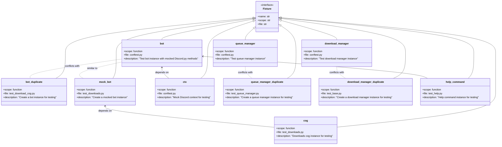

# Pytest Fixtures Current State - Class Diagram

## Overview
Shows the current state of pytest fixtures in the project, highlighting duplications and potential conflicts.

## Source
- tests/conftest.py
- tests/test_bot/test_help.py
- tests/test_bot/test_download_cog.py
- tests/test_downloaders/test_base.py
- tests/test_core/test_queue_manager.py
- tests/test_bot/test_cogs/test_downloads.py

## Diagram

## Notes
1. Red flags identified:
   - `bot` fixture is duplicated in test_download_cog.py
   - `queue_manager` fixture is duplicated in test_queue_manager.py
   - `download_manager` fixture is duplicated in test_base.py
   - `mock_bot` is similar to `bot` but with a different name
2. Potential issues:
   - Inconsistent fixture behavior across tests
   - Risk of fixture state bleeding between tests
   - Maintenance overhead from duplicate code
   - Unclear which fixture version should be used
