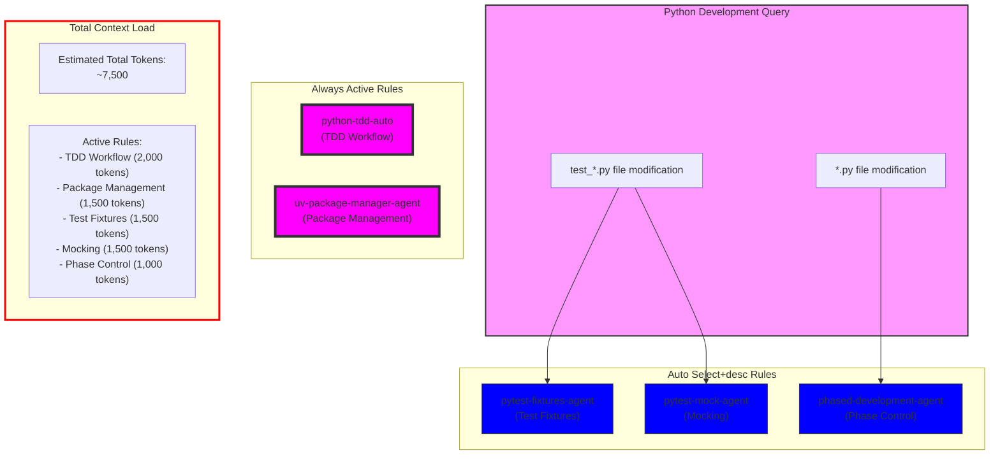

# Python Development Workflow Analysis

## Overview

This analysis focuses on how cursor rules interact during Python development tasks, including testing, package management, and implementation phases.

## Activated Rules for Python Development

| Rule | Type | Impact | Primary Function |
|------|------|--------|------------------|
| python-tdd-auto | Always | High | TDD workflow enforcement |
| pytest-fixtures-agent | Auto Select+desc | Medium | Test fixture management |
| pytest-mock-agent | Auto Select+desc | Medium | Test mocking standards |
| uv-package-manager-agent | Always | Medium | Package management |
| phased-development-agent | Auto Select+desc | Medium | Development phase control |

## Rule Activation Flow

## Rule Interactions

1. **TDD Workflow (Always Active)**
   - Enforces Red-Green-Refactor cycle
   - Integrates with test fixtures and mocking
   - Guides implementation sequence

2. **Package Management (Always Active)**
   - Manages dependencies consistently
   - Enforces UV usage for Python operations
   - Maintains environment consistency

3. **Test Framework Rules (Auto Select+desc)**
   - Activated by test file modifications
   - Provides fixture and mocking standards
   - Ensures test isolation and organization

4. **Phase Control (Auto Select+desc)**
   - Guides feature implementation order
   - Prevents premature optimization
   - Maintains development discipline

## Context Load Analysis

The total context load for Python development is significant:
- Always rules contribute ~3,500 tokens
- Auto Select+desc rules add ~4,000 tokens
- Total context of ~7,500 tokens

## Optimization Recommendations

1. **Rule Consolidation**
   - Consider combining pytest-fixtures-agent and pytest-mock-agent
   - Create a unified testing standards rule

2. **Context Reduction**
   - Convert detailed testing guidelines to manual rules
   - Keep only essential patterns in Always rules

3. **Workflow Improvements**
   - Add specific triggers for different development phases
   - Create focused rules for common Python patterns

4. **Best Practices**
   - Maintain clear separation between test and implementation rules
   - Use explicit rule references for complex testing scenarios
   - Keep TDD workflow guidance concise and actionable
