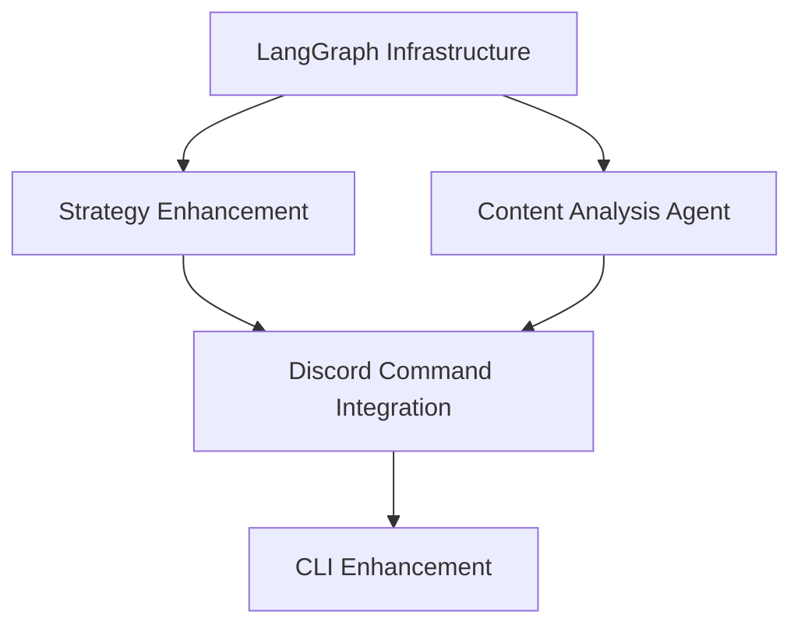
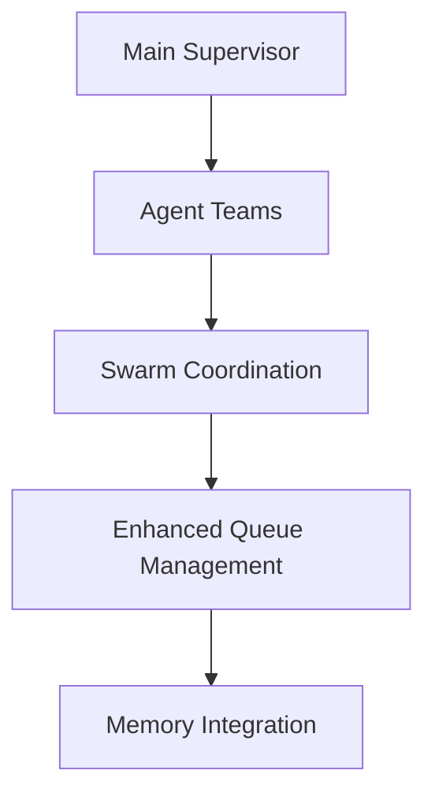

# Boss-Bot LangGraph Integration Points Mapping

## Overview

This document provides a detailed mapping of specific integration points between Boss-Bot's existing components and the proposed LangGraph multi-agent teams. Each integration point includes the current implementation, proposed enhancement, and specific file modifications required.

## Integration Point Matrix

### 1. Social Media Management Team Integration

#### 1.1 Strategy Pattern Enhancement
**Current Implementation:**
- File: `src/boss_bot/core/downloads/strategies/base_strategy.py`
- Pattern: Abstract base class with `supports_url()` and `download()` methods
- Strategies: Twitter, Reddit, Instagram, YouTube (Epic 5 completed)

**LangGraph Integration Point:**
```python
# Enhanced BaseDownloadStrategy with AI decision layer
class AIEnhancedDownloadStrategy(BaseDownloadStrategy):
    """Strategy with AI-powered decision making and optimization"""

    def __init__(self, agent_coordinator: SocialMediaCoordinator):
        super().__init__()
        self.agent_coordinator = agent_coordinator

    async def ai_analyze_content(self, url: str) -> ContentAnalysis:
        """AI-powered content analysis before download"""
        return await self.agent_coordinator.analyze_content(url)

    async def ai_select_quality(self, content_info: dict) -> QualitySettings:
        """AI-driven quality selection based on content and user preferences"""
        return await self.agent_coordinator.optimize_quality(content_info)
```

**Files to Modify:**
- `src/boss_bot/core/downloads/strategies/base_strategy.py` - Add AI enhancement layer
- `src/boss_bot/core/downloads/strategies/twitter_strategy.py` - Integrate content analysis
- `src/boss_bot/core/downloads/strategies/reddit_strategy.py` - Add AI quality selection
- `src/boss_bot/core/downloads/strategies/instagram_strategy.py` - Enhance with user preference learning
- `src/boss_bot/core/downloads/strategies/youtube_strategy.py` - AI-optimized format selection

**Integration Benefits:**
- Smart quality selection based on content analysis
- User preference learning and adaptation
- Platform-specific optimization recommendations
- Content appropriateness filtering

#### 1.2 Feature Flag System Enhancement
**Current Implementation:**
- File: `src/boss_bot/core/downloads/feature_flags.py`
- Environment-based feature flags for API/CLI switching

**LangGraph Integration:**
```python
class AIFeatureFlags(DownloadFeatureFlags):
    """Enhanced feature flags with AI capability control"""

    @property
    def ai_content_analysis_enabled(self) -> bool:
        return self.settings.ai_content_analysis_enabled

    @property
    def ai_strategy_selection_enabled(self) -> bool:
        return self.settings.ai_strategy_selection_enabled

    async def should_use_ai_for_url(self, url: str, user_id: str) -> bool:
        """Dynamic AI usage decision based on URL complexity and user preferences"""
        if not self.ai_strategy_selection_enabled:
            return False

        # Check user preferences, content complexity, system load
        return await self.ai_coordinator.should_engage(url, user_id)
```

**Files to Modify:**
- `src/boss_bot/core/downloads/feature_flags.py` - Add AI feature flags
- `src/boss_bot/core/env.py` - Add AI configuration settings

#### 1.3 Discord Command Integration
**Current Implementation:**
- File: `src/boss_bot/bot/cogs/downloads.py`
- 12 download commands with platform-specific handlers

**LangGraph Integration Points:**
```python
# Enhanced download command with AI capabilities
@commands.command(name="smart-download", aliases=["sd"])
async def smart_download(self, ctx: commands.Context, url: str, *, options: str = ""):
    """AI-enhanced download with content analysis and optimization"""

    # Route to Social Media Management Team
    request = AgentRequest(
        type="smart_download",
        url=url,
        user_context=self._build_user_context(ctx),
        options=self._parse_options(options)
    )

    # Engage main supervisor
    response = await self.bot.ai_supervisor.process_request(request)

    # Handle response with rich Discord integration
    await self._handle_ai_response(ctx, response)
```

**New Commands to Add:**
- `$smart-download <url>` - AI-optimized download
- `$analyze <url>` - Content analysis without download
- `$suggest-quality <url>` - AI quality recommendations
- `$auto-mode toggle` - Enable/disable AI enhancements
- `$learn-preference <setting>` - Teach AI user preferences

**Files to Modify:**
- `src/boss_bot/bot/cogs/downloads.py` - Add AI-enhanced commands
- `src/boss_bot/bot/cogs/ai_commands.py` - Create new AI-specific cog

### 2. Media Processing Team Integration

#### 2.1 Current Processing Infrastructure
**Existing Components:**
- Download validation in strategies
- File format detection and conversion
- Basic metadata extraction

**LangGraph Enhancement Points:**
```python
class MediaProcessingCoordinator(BaseAgent):
    """Coordinates media processing operations with specialized agents"""

    async def analyze_media_requirements(self, file_path: str, user_intent: str) -> ProcessingPlan:
        """AI analysis of media processing requirements"""

    async def optimize_for_platform(self, media: MediaFile, target_platform: str) -> ProcessedMedia:
        """Platform-specific optimization using specialized agents"""

    async def batch_process_media(self, media_batch: List[MediaFile]) -> List[ProcessedMedia]:
        """Intelligent batch processing with resource optimization"""
```

**Integration Files:**
- Create: `src/boss_bot/ai/agents/teams/media_processing_coordinator.py`
- Create: `src/boss_bot/ai/agents/teams/video_processing_agent.py`
- Create: `src/boss_bot/ai/agents/teams/image_processing_agent.py`
- Modify: `src/boss_bot/core/downloads/strategies/*.py` - Add media analysis hooks

### 3. Queue Management Integration

#### 3.1 Current Queue System
**Implementation:**
- File: `src/boss_bot/core/queue/manager.py`
- Async queue with user permissions and status tracking
- Thread-safe operations with comprehensive logging

**AI Enhancement Integration:**
```python
class AIEnhancedQueueManager(QueueManager):
    """Queue manager with AI-driven prioritization and optimization"""

    def __init__(self, settings: BossSettings, ai_coordinator: MainSupervisor):
        super().__init__(settings)
        self.ai_coordinator = ai_coordinator

    async def ai_prioritize_queue(self) -> None:
        """AI-driven queue prioritization based on content analysis and user patterns"""

    async def predict_processing_time(self, item: QueueItem) -> float:
        """AI prediction of processing time for better user expectations"""

    async def optimize_batch_processing(self) -> List[List[QueueItem]]:
        """Group queue items for optimal batch processing"""
```

**Files to Modify:**
- `src/boss_bot/core/queue/manager.py` - Add AI enhancement layer
- `src/boss_bot/bot/cogs/queue.py` - AI-enhanced queue commands

### 4. Configuration and Memory Integration

#### 4.1 Settings Enhancement
**Current Implementation:**
- File: `src/boss_bot/core/env.py`
- Pydantic-based settings with LangChain integration prepared

**AI Configuration Addition:**
```python
class BossSettings(BaseSettings):
    # Existing settings...

    # AI Agent Configuration
    ai_enabled: bool = Field(default=False, description="Enable AI agents")
    ai_main_supervisor_enabled: bool = Field(default=False)
    ai_content_analysis_enabled: bool = Field(default=False)
    ai_strategy_selection_enabled: bool = Field(default=False)
    ai_queue_optimization_enabled: bool = Field(default=False)

    # LangGraph Settings
    langgraph_max_iterations: int = Field(default=50)
    langgraph_timeout_seconds: int = Field(default=300)
    langgraph_debug_mode: bool = Field(default=False)

    # Model Configuration
    ai_main_model: str = Field(default="gpt-4")
    ai_content_analysis_model: str = Field(default="gpt-4-vision-preview")
    ai_strategy_model: str = Field(default="gpt-3.5-turbo")

    # Memory Configuration
    ai_memory_enabled: bool = Field(default=False)
    ai_memory_ttl_hours: int = Field(default=24)
    ai_user_preference_learning: bool = Field(default=True)
```

#### 4.2 Memory System Integration
**Current State:** Prepared directory structure in `src/boss_bot/ai/memory/`

**Integration Implementation:**
```python
class BossMemoryManager:
    """Manages AI memory across sessions and users"""

    async def store_user_preference(self, user_id: str, preference: UserPreference) -> None:
        """Store learned user preferences"""

    async def get_user_context(self, user_id: str) -> UserContext:
        """Retrieve user context for AI decision making"""

    async def store_successful_workflow(self, workflow: WorkflowPattern) -> None:
        """Learn from successful processing workflows"""

    async def suggest_based_on_history(self, user_id: str, url: str) -> List[Suggestion]:
        """AI suggestions based on user history and preferences"""
```

### 5. Monitoring and Logging Integration

#### 5.1 Current Monitoring Infrastructure
**Implementation:**
- File: `src/boss_bot/monitoring/logging/interceptor.py`
- LangChain ecosystem logging support (lines 268-276)
- Thread-safe Loguru integration

**AI Monitoring Enhancement:**
```python
class AIMonitoringExtension:
    """Enhanced monitoring for AI agent operations"""

    async def log_agent_decision(self, agent: str, decision: dict, confidence: float) -> None:
        """Log AI agent decisions with confidence scores"""

    async def track_performance_metrics(self, operation: str, duration: float, success: bool) -> None:
        """Track AI operation performance metrics"""

    async def monitor_resource_usage(self, agent: str, resources: ResourceUsage) -> None:
        """Monitor AI agent resource consumption"""
```

**Files to Modify:**
- `src/boss_bot/monitoring/logging/interceptor.py` - Add AI logging
- Create: `src/boss_bot/monitoring/ai_metrics.py` - AI-specific metrics
- Create: `src/boss_bot/monitoring/agent_health.py` - Agent health monitoring

### 6. CLI Integration Points

#### 6.1 Current CLI Structure
**Implementation:**
- File: `src/boss_bot/cli/main.py` - Comprehensive CLI with Typer
- File: `src/boss_bot/cli/commands/download.py` - Platform-specific commands

**AI Enhancement Integration:**
```python
# Enhanced CLI commands with AI capabilities
@download_app.command("smart")
def smart_download(
    url: str,
    quality: Optional[str] = typer.Option(None, "--quality", help="AI will suggest if not specified"),
    auto_optimize: bool = typer.Option(True, "--auto-optimize", help="Enable AI optimization"),
    learn_preferences: bool = typer.Option(True, "--learn", help="Learn from this download")
):
    """AI-enhanced download with content analysis and optimization"""

@download_app.command("analyze")
def analyze_content(url: str):
    """Analyze content without downloading"""

@download_app.command("suggest")
def suggest_settings(url: str):
    """Get AI suggestions for download settings"""
```

**Files to Modify:**
- `src/boss_bot/cli/commands/download.py` - Add AI-enhanced commands
- Create: `src/boss_bot/cli/commands/ai.py` - AI-specific CLI commands

## Integration Dependencies

### Phase 1 Dependencies (Weeks 1-3)


### Phase 2 Dependencies (Weeks 4-6)


### Critical Integration Paths
1. **Settings Configuration** → **Feature Flags** → **Strategy Enhancement**
2. **Content Analysis** → **Strategy Selection** → **Discord Commands**
3. **Memory System** → **User Preferences** → **Smart Recommendations**
4. **Monitoring** → **Agent Health** → **Performance Optimization**

## Testing Integration Points

### Unit Test Integration
**Files to Create:**
- `tests/ai/test_strategy_enhancement.py` - Strategy AI integration tests
- `tests/ai/test_content_analysis.py` - Content analysis tests
- `tests/ai/test_agent_coordination.py` - Multi-agent workflow tests
- `tests/ai/test_memory_integration.py` - Memory system tests

### Integration Test Scenarios
1. **End-to-End AI Download**: URL → Analysis → Strategy → Processing → Result
2. **Fallback Testing**: AI failure → Traditional strategy fallback
3. **Memory Persistence**: User preferences across sessions
4. **Multi-Agent Coordination**: Complex workflows with handoffs

## Success Criteria for Integration Points

### Technical Metrics
- **Strategy Selection Accuracy**: >95% appropriate strategy selection
- **Content Analysis Speed**: <5 seconds for standard content analysis
- **Memory Persistence**: 100% user preference retention across sessions
- **Fallback Reliability**: <1% failed fallbacks to traditional methods

### User Experience Metrics
- **Command Success Rate**: >98% successful command completion
- **Response Time**: <10 seconds for AI-enhanced commands
- **User Satisfaction**: Improved quality ratings for processed content
- **Learning Effectiveness**: Demonstrated improvement in recommendations over time

## Risk Mitigation for Integration Points

### Technical Risks
1. **AI Service Failures**: Robust fallback to existing strategy pattern
2. **Performance Degradation**: Timeout controls and resource limits
3. **Memory Leaks**: Proper cleanup and garbage collection for AI agents
4. **Integration Conflicts**: Comprehensive testing and staged deployment

### Mitigation Strategies
- **Circuit Breaker Pattern**: Automatic AI disable on repeated failures
- **Resource Monitoring**: Real-time tracking of AI resource usage
- **Gradual Rollout**: Feature flags for progressive user enablement
- **Comprehensive Logging**: Full audit trail for debugging and optimization

This integration mapping provides a clear roadmap for enhancing Boss-Bot's existing excellent architecture with sophisticated LangGraph multi-agent capabilities while maintaining reliability and user experience.
