# Boss-Bot LangGraph Multi-Agent System - State Diagram

This document contains the comprehensive state diagram for the Boss-Bot LangGraph multi-agent system, visualizing all possible workflow states, transitions, and decision points based on the `spec.yml` specification.

## State Diagram Overview

The Boss-Bot workflow implements a complex state machine that handles multiple concurrent processing paths while maintaining state consistency across all agents. The diagram shows the complete lifecycle from Discord command reception to final response delivery.

## Workflow State Diagram

```mermaid
stateDiagram-v2
    [*] --> RequestReceived : Discord Command

    RequestReceived --> ContentAnalysis : AI Opt-in & Analysis Required
    RequestReceived --> StrategySelection : Direct Download Request
    RequestReceived --> UserInteraction : User Command Processing
    RequestReceived --> QueueManagement : Queue Operation

    state ContentAnalysis {
        [*] --> AnalyzingContent
        AnalyzingContent --> HighConfidence : Confidence > 0.8
        AnalyzingContent --> LowConfidence : Confidence < 0.6
        AnalyzingContent --> AnalysisComplete : Analysis Done
        HighConfidence --> AnalysisComplete
        LowConfidence --> SpecializedAnalysis
        SpecializedAnalysis --> AnalysisComplete
        AnalysisComplete --> [*]
    }

    state StrategySelection {
        [*] --> SelectingStrategy
        SelectingStrategy --> StrategySelected : Strategy Found
        SelectingStrategy --> RequiresUserPrefs : No User Preferences
        RequiresUserPrefs --> UserPrefsGathered
        UserPrefsGathered --> StrategySelected
        StrategySelected --> [*]
    }

    state UserInteraction {
        [*] --> ProcessingCommand
        ProcessingCommand --> CommandProcessed
        CommandProcessed --> [*]
    }

    state QueueManagement {
        [*] --> OptimizingQueue
        OptimizingQueue --> QueueOptimized
        QueueOptimized --> [*]
    }

    ContentAnalysis --> StrategySelection : Analysis Complete
    ContentAnalysis --> QualityOptimization : Quality Assessment Needed
    StrategySelection --> SocialMediaCoordination : Strategy Selected
    StrategySelection --> UserInteraction : Requires User Preferences
    QueueManagement --> SocialMediaCoordination : Queue Optimized

    state SocialMediaCoordination {
        [*] --> DeterminingPlatform
        DeterminingPlatform --> TwitterProcessing : Twitter URL
        DeterminingPlatform --> RedditProcessing : Reddit URL
        DeterminingPlatform --> InstagramProcessing : Instagram URL
        DeterminingPlatform --> YouTubeProcessing : YouTube URL

        state TwitterProcessing {
            [*] --> TwitterDownload
            TwitterDownload --> DownloadSuccess
            TwitterDownload --> DownloadFailed
            DownloadSuccess --> [*]
            DownloadFailed --> [*]
        }

        state RedditProcessing {
            [*] --> RedditDownload
            RedditDownload --> DownloadSuccess
            RedditDownload --> DownloadFailed
            DownloadSuccess --> [*]
            DownloadFailed --> [*]
        }

        state InstagramProcessing {
            [*] --> InstagramDownload
            InstagramDownload --> DownloadSuccess
            InstagramDownload --> DownloadFailed
            DownloadSuccess --> [*]
            DownloadFailed --> [*]
        }

        state YouTubeProcessing {
            [*] --> YouTubeDownload
            YouTubeDownload --> DownloadSuccess
            YouTubeDownload --> DownloadFailed
            DownloadSuccess --> [*]
            DownloadFailed --> [*]
        }

        TwitterProcessing --> [*]
        RedditProcessing --> [*]
        InstagramProcessing --> [*]
        YouTubeProcessing --> [*]
    }

    SocialMediaCoordination --> MediaProcessing : Download Success
    SocialMediaCoordination --> ErrorHandling : Download Failed

    state MediaProcessing {
        [*] --> DeterminingContentType
        DeterminingContentType --> VideoProcessing : Video Content
        DeterminingContentType --> ImageProcessing : Image Content

        state VideoProcessing {
            [*] --> VideoTranscoding
            VideoTranscoding --> VideoOptimization
            VideoOptimization --> VideoComplete
            VideoComplete --> [*]
        }

        state ImageProcessing {
            [*] --> ImageResizing
            ImageResizing --> ImageFiltering
            ImageFiltering --> ImageComplete
            ImageComplete --> [*]
        }

        VideoProcessing --> [*]
        ImageProcessing --> [*]
    }

    MediaProcessing --> QualityOptimization : Processing Complete

    state QualityOptimization {
        [*] --> AssessingQuality
        AssessingQuality --> OptimizingQuality : Quality Level = Quality
        AssessingQuality --> QualityComplete : Optimization Not Needed
        OptimizingQuality --> QualityComplete
        QualityComplete --> [*]
    }

    QualityOptimization --> DiscordResponse : Optimization Complete
    QualityOptimization --> ContentAnalysis : Quality Assessment Needed

    state ErrorHandling {
        [*] --> AttemptingFallback
        AttemptingFallback --> FallbackSuccess : Fallback Works
        AttemptingFallback --> FallbackFailed : Fallback Fails
        FallbackSuccess --> [*]
        FallbackFailed --> [*]
    }

    ErrorHandling --> DiscordResponse : Fallback Complete
    UserInteraction --> DiscordResponse : Command Processed

    state DiscordResponse {
        [*] --> FormattingResponse
        FormattingResponse --> SendingResponse
        SendingResponse --> ResponseSent
        ResponseSent --> [*]
    }

    DiscordResponse --> WorkflowComplete : Response Sent

    state WorkflowComplete {
        [*] --> [*]
    }

    WorkflowComplete --> [*]

    note right of ContentAnalysis
        Multi-modal analysis with
        confidence scoring and
        specialized analysis routing
    end note

    note right of SocialMediaCoordination
        Platform-specific download
        strategies with API/CLI
        switching capability
    end note

    note right of MediaProcessing
        Concurrent video and image
        processing with format
        optimization
    end note

    note right of ErrorHandling
        Graceful degradation to
        traditional CLI/API methods
        when AI processing fails
    end note
```

## State Categories & Descriptions

### 🎯 **Entry Point States**
- **RequestReceived**: Initial state when Discord command is received
- Routes to different processing paths based on request type and user configuration

### 🔍 **Analysis States**

#### **ContentAnalysis**
- **AnalyzingContent**: Multi-modal content analysis in progress
- **HighConfidence**: Analysis confidence score > 0.8, proceed directly
- **LowConfidence**: Analysis confidence score < 0.6, requires specialized analysis
- **SpecializedAnalysis**: Additional analysis by platform specialists
- **AnalysisComplete**: Content analysis finished, ready for next stage

#### **StrategySelection**
- **SelectingStrategy**: AI-enhanced strategy selection in progress
- **RequiresUserPrefs**: No user preferences available, need to gather them
- **UserPrefsGathered**: User preferences collected successfully
- **StrategySelected**: Optimal strategy determined, ready for execution

### 💬 **Interaction States**

#### **UserInteraction**
- **ProcessingCommand**: Processing user Discord commands and natural language
- **CommandProcessed**: User command successfully processed

#### **QueueManagement**
- **OptimizingQueue**: Intelligent queue optimization in progress
- **QueueOptimized**: Queue priority and resource allocation optimized

### 🌐 **Platform Processing States**

#### **SocialMediaCoordination**
- **DeterminingPlatform**: Analyzing URL to determine source platform
- **TwitterProcessing**: Twitter/X-specific download handling
- **RedditProcessing**: Reddit-specific download handling
- **InstagramProcessing**: Instagram-specific download handling
- **YouTubeProcessing**: YouTube-specific download handling

Each platform processing includes:
- **Download**: Platform-specific download attempt
- **DownloadSuccess**: Download completed successfully
- **DownloadFailed**: Download failed, triggers error handling

### 🎬 **Media Processing States**

#### **MediaProcessing**
- **DeterminingContentType**: Analyzing content to determine processing type
- **VideoProcessing**: Video-specific processing pipeline
- **ImageProcessing**: Image-specific processing pipeline

#### **VideoProcessing**
- **VideoTranscoding**: Converting video formats and codecs
- **VideoOptimization**: Quality and compression optimization
- **VideoComplete**: Video processing finished

#### **ImageProcessing**
- **ImageResizing**: Adjusting image dimensions for target platform
- **ImageFiltering**: Applying filters and optimizations
- **ImageComplete**: Image processing finished

### ⭐ **Quality & Optimization States**

#### **QualityOptimization**
- **AssessingQuality**: AI-driven quality assessment of processed media
- **OptimizingQuality**: Applying quality improvements and format optimization
- **QualityComplete**: Quality optimization finished

### 🚨 **Error Handling States**

#### **ErrorHandling**
- **AttemptingFallback**: Trying fallback mechanisms (CLI/API switching)
- **FallbackSuccess**: Fallback method succeeded
- **FallbackFailed**: Fallback method also failed

### 💬 **Response States**

#### **DiscordResponse**
- **FormattingResponse**: Creating rich embeds and user-friendly messages
- **SendingResponse**: Delivering response to Discord channel
- **ResponseSent**: Response successfully delivered

#### **WorkflowComplete**
- **Final state**: Workflow execution completed successfully

## State Transition Conditions

### **Conditional Routing Logic**
Based on the `spec.yml` conditions:

- `should_analyze_content`: AI opt-in status and analysis requirements
- `analysis_complete`: Content metadata confidence score > 0.8
- `strategy_selected`: Selected strategy is available in shared data
- `platform_determined`: Platform identified as supported type
- `download_successful/failed`: Download operation outcome
- `needs_video/image_processing`: Content type determination
- `processing_complete`: Media processing status
- `optimization_complete`: Quality optimization status
- `fallback_successful/failed`: Error recovery outcome

### **Dynamic State Management**
- **Parallel Processing**: Multiple media items can be in different states simultaneously
- **State Persistence**: Workflow state maintained across Discord sessions
- **Error Recovery**: Failed states automatically trigger appropriate fallback paths
- **User Context**: State transitions consider user preferences and AI opt-in status

## Integration with Existing Systems

### **Epic 5 Strategy Pattern Integration**
- State transitions respect existing feature flag configurations
- Fallback states integrate with traditional CLI/API methods
- Platform processing states leverage existing download strategies

### **Discord Bot Integration**
- All state transitions maintain Discord context
- User interaction states handle Discord-specific commands
- Response states format outputs for Discord channel delivery

### **AI Model Integration**
- Content analysis states interface with OpenAI/Anthropic APIs
- Strategy selection leverages AI for intelligent decision-making
- Quality optimization uses AI for content-aware improvements

This state diagram provides a complete view of the Boss-Bot workflow execution, enabling developers to understand the system behavior, debug issues, and extend functionality while maintaining state consistency across all processing paths.
