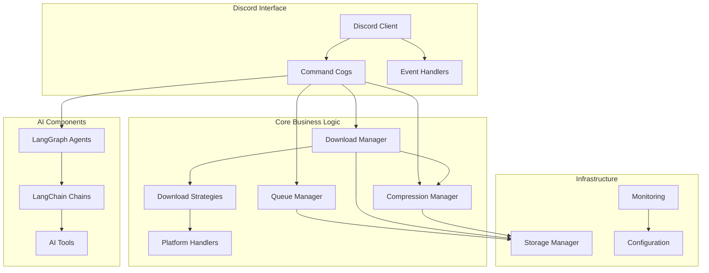

# Architecture Overview

This document provides essential architectural foundations every developer needs to understand when working with Boss-Bot.

## Core Architectural Principles

Boss-Bot follows a **modular, event-driven architecture** built on Discord.py with AI capabilities and modern Python patterns:

- **Discord.py Foundation**: Event-driven bot with command cogs
- **Pydantic Configuration**: Type-safe environment configuration
- **Async-First**: All I/O operations use async/await
- **Dependency Injection**: Settings and services passed via constructor
- **Strategy Pattern**: Pluggable download implementations
- **AI Integration**: LangChain/LangGraph for intelligent features

## High-Level System Architecture



## Discord.py Bot Architecture

### 1. BossBot Client (`src/boss_bot/bot/client.py`)

The main bot class extending `discord.ext.commands.Bot`:

```python
class BossBot(commands.Bot):
    """Main Discord bot client with dependency injection."""

    def __init__(self, settings: BossSettings):
        self.settings = settings
        self.queue_manager = QueueManager(settings)
        self.download_manager = DownloadManager(settings)
        # Bot initialization with intents, command prefix, etc.
```

**Key Responsibilities:**
- Discord connection and authentication
- Event loop management
- Cog loading and unloading
- Global error handling
- Dependency injection container

### 2. Command Cogs (`src/boss_bot/bot/cogs/`)

Commands are organized into logical groups called "cogs":

```python
class DownloadCog(commands.Cog):
    """Download-related Discord commands."""

    def __init__(self, bot: BossBot):
        self.bot = bot
        self.queue_manager = bot.queue_manager
        self.download_manager = bot.download_manager

    @commands.command(name="download")
    async def download_command(self, ctx: commands.Context, url: str):
        """Download media from supported platforms."""
        # Command implementation
```

**Current Cogs:**
- **DownloadCog**: Media download commands (`$download`, `$dl`)
- **QueueCog**: Queue management commands (`$queue`, `$clear`, `$pause`)
- **AdminCog**: Bot information and help commands (`$info`, `$help-detailed`, `$commands`)

### 3. Event Handlers (`src/boss_bot/bot/events/`)

Handle Discord events and bot lifecycle:

```python
@bot.event
async def on_ready():
    """Bot startup initialization."""

@bot.event
async def on_command_error(ctx, error):
    """Global command error handling."""
```

## Download System Architecture

### Current Implementation: Handler Pattern

**Platform Handlers** (`src/boss_bot/core/downloads/handlers/`):

```python
class BaseDownloadHandler(ABC):
    """Abstract base for platform-specific downloads."""

    @abstractmethod
    def download(self, url: str) -> MediaMetadata:
        """Download media and return metadata."""

    @abstractmethod
    def supports_url(self, url: str) -> bool:
        """Check if handler supports URL."""
```

**Implemented Handlers:**
- `TwitterHandler`: Twitter/X content via gallery-dl
- `RedditHandler`: Reddit posts via gallery-dl
- `InstagramHandler`: Instagram posts via gallery-dl
- `YouTubeHandler`: YouTube videos via yt-dlp

### Experimental: Strategy Pattern

**Download Strategies** (`src/boss_bot/core/downloads/strategies/`):

The strategy pattern allows switching between CLI and API implementations:

```python
class TwitterDownloadStrategy(BaseDownloadStrategy):
    """Strategy for Twitter downloads with CLI/API choice."""

    async def download(self, url: str, **kwargs) -> MediaMetadata:
        """Download using feature-flagged approach."""

        if self.feature_flags.use_api_twitter:
            try:
                return await self._download_via_api(url, **kwargs)
            except Exception as e:
                if self.feature_flags.api_fallback_to_cli:
                    return await self._download_via_cli(url, **kwargs)
                raise
        else:
            return await self._download_via_cli(url, **kwargs)
```

**Benefits:**
- Feature-flagged rollout (API vs CLI)
- Automatic fallback mechanisms
- Better testing and error handling
- Performance improvements

## Compression System Architecture

### CompressionManager (`src/boss_bot/core/compression/manager.py`)

The compression system provides automatic media compression with Discord file size limits in mind:

```python
class CompressionManager:
    """Main compression manager that orchestrates all compression operations."""

    def __init__(self, settings: BossSettings):
        self.settings = settings
        self.file_detector = FileTypeDetector()

        # Initialize processors
        self.video_processor = VideoProcessor(settings)
        self.audio_processor = AudioProcessor(settings)
        self.image_processor = ImageProcessor(settings)

    async def compress_file(
        self,
        input_path: Path,
        output_path: Path | None = None,
        target_size_mb: int | None = None,
        compression_settings: CompressionSettings | None = None,
    ) -> CompressionResult:
        """Compress a media file with automatic type detection."""
```

**Key Features:**
- Automatic file type detection
- Target size-based compression (default 50MB for Discord)
- Concurrent batch processing
- Hardware acceleration support
- Detailed compression statistics

### Media Processors (`src/boss_bot/core/compression/processors/`)

**Processor Architecture:**

```python
class BaseProcessor(ABC):
    """Abstract base class for media processors."""

    @abstractmethod
    async def compress(self, input_path: Path, target_size_mb: int, output_path: Path) -> CompressionResult:
        """Compress media file."""

    @abstractmethod
    async def get_media_info(self, input_path: Path) -> MediaInfo:
        """Get media file information."""
```

**Implemented Processors:**
- **VideoProcessor**: FFmpeg-based video compression with bitrate calculation
- **AudioProcessor**: Audio compression with quality preservation
- **ImageProcessor**: PIL/Pillow-based image compression and optimization

### File Type Detection (`src/boss_bot/core/compression/utils/file_detector.py`)

Automatic media type detection:

```python
class FileTypeDetector:
    """Detects and categorizes file types for compression."""

    def get_media_type(self, file_path: Path) -> MediaType:
        """Determine the media type of a file."""
        # Supports VIDEO, AUDIO, IMAGE, UNKNOWN

# Supported file types:
# Video: mp4, avi, mkv, mov, flv, wmv, webm, mpeg, 3gp, m4v, mpg, ogv
# Audio: mp3, wav, m4a, flac, aac, ogg, wma, opus, amr, 3ga
# Image: jpg, jpeg, png, gif, webp, bmp, tiff, tif, svg, heic, heif
```

### Compression Configuration

**Environment Variables:**
- `COMPRESSION_TARGET_SIZE_MB`: Default target size (50MB)
- `COMPRESSION_FFMPEG_PRESET`: FFmpeg preset for video compression (slow)
- `COMPRESSION_MAX_CONCURRENT`: Maximum concurrent operations (3)
- `COMPRESSION_MIN_VIDEO_BITRATE_KBPS`: Minimum video bitrate (125kbps)
- `COMPRESSION_MIN_AUDIO_BITRATE_KBPS`: Minimum audio bitrate (32kbps)
- `COMPRESSION_IMAGE_MIN_QUALITY`: Minimum image quality (10%)

**Usage Integration:**
```python
# In Discord commands or download workflows
compression_manager = CompressionManager(settings)
result = await compression_manager.compress_file(
    input_path=downloaded_file,
    target_size_mb=25  # Discord Nitro limit
)

if result.success:
    await ctx.send(file=discord.File(result.output_path))
```

## Configuration Management

### BossSettings (`src/boss_bot/core/env.py`)

Central configuration using Pydantic settings:

```python
class BossSettings(BaseSettings):
    """Bot configuration from environment variables."""

    # Discord configuration
    discord_token: SecretStr
    command_prefix: str = "$"

    # Download configuration
    download_dir: Path = Path("./downloads")
    max_file_size: int = 100_000_000  # 100MB

    # Compression configuration
    compression_target_size_mb: int = 50
    compression_ffmpeg_preset: str = "slow"
    compression_max_concurrent: int = 3
    compression_min_video_bitrate_kbps: int = 125
    compression_min_audio_bitrate_kbps: int = 32
    compression_image_min_quality: int = 10

    # Feature flags (experimental)
    twitter_use_api_client: bool = False
    reddit_use_api_client: bool = False
    download_api_fallback_to_cli: bool = True

    class Config:
        env_file = ".env"
        case_sensitive = False
```

**Key Features:**
- Environment variable validation
- Type conversion and validation
- Secret handling with `SecretStr`
- Default values and documentation
- Feature flag support

## Queue Management System

### QueueManager (`src/boss_bot/core/queue/manager.py`)

Manages async download queue with rate limiting:

```python
class QueueManager:
    """Manages download queue with rate limiting and quotas."""

    async def add_to_queue(self, url: str, user_id: int) -> QueueItem:
        """Add download to queue with validation."""

    async def process_queue(self):
        """Process queue items with concurrency limits."""

    async def get_queue_status(self) -> QueueStatus:
        """Get current queue status and statistics."""
```

**Features:**
- User-based rate limiting
- Priority queuing
- Quota management
- Progress tracking
- Pause/resume functionality

## AI Integration Points

### Current State
- **Foundation Ready**: LangChain/LangGraph imports and basic structure
- **Future Features**: Content analysis, smart downloads, moderation

### Planned AI Components (`src/boss_bot/ai/`)

```python
# Future AI agent example
class ContentAnalyzerAgent:
    """LangGraph agent for media content analysis."""

    async def analyze_content(self, media_metadata: MediaMetadata) -> ContentAnalysis:
        """Analyze downloaded content for insights."""

    async def suggest_categories(self, content: str) -> List[str]:
        """Suggest content categories using AI."""
```

## Storage and File Management

### Storage Managers (`src/boss_bot/storage/managers/`)

- **FileManager**: File operations and organization
- **QuotaManager**: User/guild storage quotas
- **ValidationManager**: File type and security validation

### Security Features
- File type validation
- Virus scanning integration
- Size limits per user/guild
- Content filtering

## Monitoring and Observability

### Health Checks (`src/boss_bot/monitoring/health/`)
- Discord API connectivity
- Storage system health
- Download service availability
- Queue processor status

### Metrics Collection (`src/boss_bot/monitoring/metrics/`)
- Download success/failure rates
- Queue processing times
- Storage usage statistics
- User activity metrics

### Logging (`src/boss_bot/monitoring/logging/`)
- Structured logging with context
- Error tracking and alerting
- Performance monitoring
- Debug information

## Development Patterns

### Dependency Injection
All major components receive dependencies via constructor:

```python
class DownloadCog(commands.Cog):
    def __init__(self, bot: BossBot):
        self.bot = bot
        self.settings = bot.settings
        self.queue_manager = bot.queue_manager
        self.download_manager = bot.download_manager
```

### Error Handling
Consistent error handling throughout:

```python
@commands.command()
async def download(self, ctx: commands.Context, url: str):
    try:
        result = await self.download_manager.download(url)
        await ctx.send(f"Downloaded: {result.title}")
    except QuotaExceededError:
        await ctx.send("Storage quota exceeded!")
    except UnsupportedURLError:
        await ctx.send("URL not supported.")
    except Exception as e:
        logger.error(f"Download failed: {e}")
        await ctx.send("Download failed. Please try again.")
```

### Async Patterns
All I/O operations use async/await:

```python
# Correct async patterns
async with aiofiles.open(file_path, 'wb') as f:
    await f.write(content)

# Execute sync operations in thread pool
loop = asyncio.get_event_loop()
result = await loop.run_in_executor(None, sync_function, arg)
```

## Project Structure Evolution

### Current Structure
- Mixed responsibilities between modules
- Monolithic CLI interface
- Basic monitoring organization

### Target Structure (see MIGRATION.md)
- Clear separation of concerns
- Modular CLI with subcommands
- Dedicated AI components
- Comprehensive monitoring
- Plugin-based integrations

This architecture provides a solid foundation for scalable Discord bot development with modern Python patterns, comprehensive testing, and future AI capabilities.
