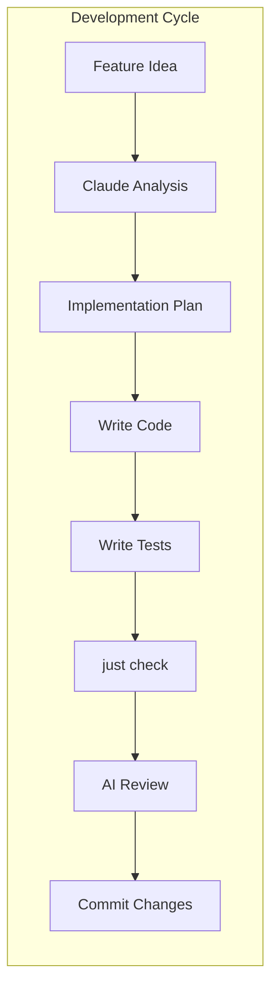

# Development Workflow

This document covers daily development practices for Boss-Bot, including Just commands, Claude Code integration, UV package management, and AI-assisted development workflows.

## Just Command Reference

Boss-Bot uses [Just](https://github.com/casey/just) as a command runner for development tasks. All commands are defined in the `Justfile` and organized by category.

### Essential Daily Commands

```bash
# Full development check suite
just check                    # Run all checks (lint, type, test, format)

# Individual checks
just check-code              # Lint with ruff
just check-type              # Type check with pyright/basedpyright
just check-test              # Run pytest with coverage
just check-coverage          # Generate detailed coverage report

# Code formatting
just format                  # Format with ruff and other formatters
just format-ruff             # Ruff formatting only

# Testing variations
just check-test "tests/test_bot/"                    # Run specific test directory
just check-test "tests/test_bot/test_client.py"     # Run specific test file
just check-test "tests/test_bot/test_client.py::test_function_name"  # Run specific test
```

### Package Management with UV

```bash
# Dependency management
just uv-update               # Update all dependencies
just uv-sync                # Sync dependencies with uv.lock
just uv-add package_name    # Add new dependency
just uv-remove package_name # Remove dependency

# Virtual environment
just uv-shell               # Enter UV shell
just uv-python              # Show Python interpreter path

# Workspace operations
just uv-workspace-sync      # Sync workspace dependencies
```

### Development Environment Setup

```bash
# Initial setup
just install                # Install all dependencies and setup hooks
just install-pre-commit     # Setup pre-commit hooks only

# Clean operations
just clean                  # Clean build artifacts
just clean-cache           # Clean Python cache files
just clean-test            # Clean test artifacts
```

### Documentation and Release

```bash
# Documentation
just doc-build              # Build MkDocs documentation
just doc-serve              # Serve docs locally at localhost:8000
just doc-deploy             # Deploy documentation

# Release management
just changelog-generate     # Generate changelog with towncrier
just release                # Create new release
just check-security         # Run security audits
```

## Claude Code Integration

### CLAUDE.md Configuration

Boss-Bot is configured for AI-assisted development through Claude Code. The `CLAUDE.md` file provides comprehensive instructions to Claude about the project structure and development patterns.

**Key Integration Points:**

1. **Architecture Understanding**: Claude knows the Discord.py patterns, cog structure, and async patterns
2. **Testing Guidance**: Automated fixture naming, pytest-mock usage, and Discord testing patterns
3. **Code Style**: Ruff formatting, type hints, and error handling conventions
4. **Build Commands**: Claude can run `just check`, `just format`, and testing commands

### AI-Assisted Development Workflow



**Best Practices with Claude Code:**

1. **Start with Architecture Questions**: Ask Claude to explain patterns before implementing
2. **Test-First Development**: Ask Claude to generate tests before implementation
3. **Code Review**: Use Claude to review diffs and suggest improvements
4. **Documentation**: Claude can generate docstrings and update documentation

### Example Claude Interactions

```bash
# Ask Claude to explain a pattern
"Explain the fixture naming pattern in tests/conftest.py"

# Request test generation
"Generate tests for the new TwitterStrategy class following the project patterns"

# Code review assistance
"Review this Discord cog implementation for best practices"

# Architecture questions
"How should I implement a new download handler for TikTok?"
```

## Cursor IDE Integration

### Rule System Overview

Boss-Bot has 29+ specialized Cursor rules across different categories:

**Core Rules** (`.cursor/rules/core-rules/`):
- `development-environment-agent.mdc`: Environment setup and configuration
- `phased-implementation-agent.mdc`: Feature development planning
- `security-monitoring-agent.mdc`: Security best practices

**Python Rules** (`.cursor/rules/py-rules/`):
- `pytest-fixtures-agent.mdc`: Fixture naming and organization
- `pytest-mock-agent.mdc`: Mock usage patterns
- `python-tdd-auto.mdc`: Test-driven development automation

**Testing Rules** (`.cursor/rules/testing-rules/`):
- `pytest-error-analysis-agent.mdc`: Test failure analysis
- `secure-environment-testing-agent.mdc`: Safe testing practices

### When to Use Which Rules

```bash
# Development setup
@dev-environment          # Setting up new development environment
@phased-implementation    # Planning large features

# Python development
@pytest-fixtures          # Working with test fixtures
@pytest-mock             # Mocking in tests
@python-tdd               # Test-driven development

# Testing and debugging
@pytest-error-analysis    # Debugging test failures
@test-modification        # Modifying existing tests

# Project management
@epic-story-management    # Managing epics and stories
@workflow-agile           # Agile development workflow
```

### Cursor Modes Configuration

```json
// .cursor/modes.json
{
    "development": {
        "rules": ["@python-tdd", "@pytest-fixtures", "@dev-environment"],
        "description": "Active development with TDD"
    },
    "testing": {
        "rules": ["@pytest-error-analysis", "@pytest-mock", "@test-modification"],
        "description": "Testing and debugging focus"
    },
    "architecture": {
        "rules": ["@phased-implementation", "@security-monitoring"],
        "description": "Architectural planning and review"
    }
}
```

## UV Package Manager Best Practices

### Project Configuration

```toml
# pyproject.toml - UV workspace configuration
[tool.uv]
dev-dependencies = [
    "pytest>=7.0.0",
    "pytest-asyncio>=0.21.0",
    "pytest-mock>=3.10.0",
    "ruff>=0.1.0",
    "basedpyright>=1.0.0"
]

[tool.uv.workspace]
members = ["src/boss_bot"]
```

### Dependency Management Workflow

```bash
# Add development dependency
just uv-add --dev pytest-recording

# Add runtime dependency
just uv-add discord.py

# Update to latest compatible versions
just uv-update

# Pin specific version
just uv-add "pydantic>=2.0.0,<3.0.0"

# Remove dependency
just uv-remove old-package

# Show dependency tree
uv tree

# Audit dependencies for security issues
uv audit
```

### Virtual Environment Management

```bash
# Create and sync environment
uv venv
uv sync

# Activate environment (manual)
source .venv/bin/activate

# Or use UV's automatic activation
uv run python script.py
uv run pytest
uv run just check

# Check environment status
uv python list
uv python install 3.12
```

## Pre-commit Hooks and Code Quality

### Pre-commit Configuration

```yaml
# .pre-commit-config.yaml
repos:
  - repo: https://github.com/astral-sh/ruff-pre-commit
    rev: v0.1.0
    hooks:
      - id: ruff
        args: [--fix, --exit-non-zero-on-fix]
      - id: ruff-format

  - repo: https://github.com/pre-commit/pre-commit-hooks
    rev: v4.4.0
    hooks:
      - id: trailing-whitespace
      - id: end-of-file-fixer
      - id: check-merge-conflict
      - id: check-toml
      - id: check-yaml
```

### Quality Gates

**Automated Checks on Commit:**
1. **Ruff Linting**: Code style and common issues
2. **Ruff Formatting**: Consistent code formatting
3. **Type Checking**: Static type validation with basedpyright
4. **Test Execution**: All tests must pass
5. **Security Scanning**: Dependency vulnerability checks

**Manual Quality Checks:**
```bash
# Full quality check before push
just check

# Security audit
just check-security

# Coverage analysis
just check-coverage

# Documentation build test
just doc-build
```

## Testing Workflow Integration

### Test-Driven Development (TDD)

```bash
# TDD workflow with Just commands
just check-test "tests/test_new_feature.py"    # Red: Write failing test
# Implement feature code
just check-test "tests/test_new_feature.py"    # Green: Make test pass
just check-code                                # Refactor: Clean up code
just check                                     # Full validation
```

### Testing Best Practices

**1. Test Organization by Feature**
```bash
# Test specific functionality
just check-test "tests/test_bot/test_cogs/"
just check-test "tests/test_core/test_downloads/"

# Test single module
just check-test "tests/test_bot/test_client.py"

# Test with specific markers
just check-test -m "not slow"
just check-test -m "asyncio"
```

**2. VCR Testing for External APIs**
```bash
# Record new cassettes (development)
just check-test "tests/test_clients/" --record-mode=all

# Test with existing cassettes (CI)
just check-test "tests/test_clients/" --record-mode=none

# Update specific test recordings
just check-test "tests/test_clients/test_twitter.py" --record-mode=new_episodes
```

**3. Coverage-Driven Development**
```bash
# Generate coverage report
just check-coverage

# View coverage in browser
just check-coverage --html
open htmlcov/index.html

# Focus on uncovered code
just check-coverage --show-missing
```

## AI-Assisted Debugging Workflow

### Error Analysis with Claude

**1. Test Failure Analysis**
```bash
# Run failing test with verbose output
just check-test "tests/test_bot/test_client.py::test_failing" -v

# Copy output to Claude with context:
# "This test is failing. Here's the error output and the test code.
# What's the issue and how should I fix it?"
```

**2. Code Review Process**
```bash
# Generate diff for review
git diff HEAD~1 HEAD > review.diff

# Ask Claude:
# "Review this diff for Discord.py best practices, async patterns,
# and potential issues. Focus on error handling and test coverage."
```

**3. Architecture Decision Support**
```bash
# Before implementing new features:
# "I need to add Instagram download support. Should I use the Handler
# pattern or Strategy pattern? What are the tradeoffs?"

# For refactoring decisions:
# "Looking at this code, what refactoring would improve maintainability
# while following the existing patterns?"
```

## Release and Deployment Workflow

### Version Management

```bash
# Semantic versioning with commitizen
just cz-bump                 # Bump version based on commits
just cz-changelog           # Generate changelog

# Manual version control
just towncrier-build        # Build changelog from fragments
just towncrier-check        # Validate changelog fragments
```

### Release Checklist

```bash
# Pre-release validation
just check                  # All tests pass
just check-security         # No security issues
just doc-build             # Documentation builds
just check-coverage        # Coverage meets threshold

# Release process
git checkout main
git pull origin main
just release               # Creates tag and builds artifacts
git push origin main --tags

# Post-release
just doc-deploy            # Update documentation
```

### Continuous Integration Integration

**GitHub Actions Integration:**
```yaml
# .github/workflows/test.yml integration with Just
- name: Run tests
  run: |
    uv run just check

- name: Check security
  run: |
    uv run just check-security

- name: Build docs
  run: |
    uv run just doc-build
```

## Environment and Configuration Management

### Development Environment Setup

```bash
# Complete setup for new developers
git clone https://github.com/yourusername/boss-bot.git
cd boss-bot

# Install UV if not already installed
curl -LsSf https://astral.sh/uv/install.sh | sh

# Setup development environment
just install                # Install deps + setup pre-commit
cp sample.env .env         # Configure environment
edit .env                  # Add Discord token and settings

# Verify setup
just check                 # All checks should pass
just doc-serve            # Documentation should build and serve
```

### Environment Configuration

```bash
# Development environment variables
export DISCORD_TOKEN="your_bot_token"
export COMMAND_PREFIX="$"
export LOG_LEVEL="DEBUG"
export DOWNLOAD_DIR="./downloads"

# Feature flags for experimental features
export TWITTER_USE_API_CLIENT=false
export DOWNLOAD_API_FALLBACK_TO_CLI=true

# Testing environment
export PYTEST_RECORD_MODE="none"  # Don't record new VCR cassettes
export TEST_DISCORD_TOKEN="test_token"
```

### IDE Configuration

**VSCode Setup (Recommended):**
```json
// .vscode/settings.json
{
    "python.defaultInterpreter": "./.venv/bin/python",
    "python.testing.pytestEnabled": true,
    "python.testing.pytestArgs": ["."],
    "python.linting.enabled": false,  // Use ruff instead
    "ruff.enable": true,
    "ruff.organizeImports": true
}
```

This development workflow emphasizes automation, AI assistance, and quality gates to ensure maintainable, well-tested code while leveraging modern Python tooling and AI-assisted development practices.
