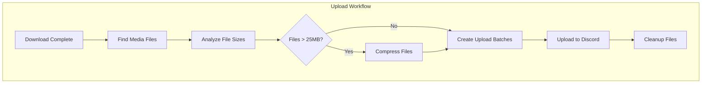

# Discord Integration

This document covers Bot-specific patterns for Discord.py integration, including bot client architecture, cog development, event handling, and Discord-specific testing strategies.

## Discord.py Bot Architecture

### BossBot Client Design

```python
# src/boss_bot/bot/client.py
import discord
from discord.ext import commands
from boss_bot.core.env import BossSettings
from boss_bot.core.queue.manager import QueueManager
from boss_bot.core.downloads.manager import DownloadManager

class BossBot(commands.Bot):
    """Main Discord bot client with dependency injection and lifecycle management."""

    def __init__(self, settings: BossSettings):
        # Store configuration
        self.settings = settings

        # Configure intents
        intents = discord.Intents.default()
        intents.message_content = True  # Required for reading message content
        intents.guilds = True
        intents.members = False  # Don't need member events

        # Initialize bot with configuration
        super().__init__(
            command_prefix=settings.command_prefix,
            intents=intents,
            help_command=None,  # Custom help command
            case_insensitive=True,
            strip_after_prefix=True
        )

        # Initialize subsystems with dependency injection
        self.queue_manager = QueueManager(settings)
        self.download_manager = DownloadManager(settings)

        # Bot state tracking
        self._startup_complete = False
        self._shutdown_requested = False

    async def setup_hook(self):
        """Called when bot is starting up. Load cogs and initialize services."""
        print(f"Logged in as {self.user} (ID: {self.user.id})")

        # Load cogs
        await self.load_extension('boss_bot.bot.cogs.downloads')
        await self.load_extension('boss_bot.bot.cogs.queue')
        await self.load_extension('boss_bot.bot.cogs.admin')

        # Initialize services
        await self.queue_manager.start()
        await self.download_manager.start()

        # Sync slash commands (development only)
        if self.settings.guild_ids:
            for guild_id in self.settings.guild_ids:
                guild = discord.Object(id=guild_id)
                self.tree.copy_global_to(guild=guild)
                await self.tree.sync(guild=guild)
                print(f"Synced commands to guild {guild_id}")

        self._startup_complete = True
        print("Bot startup complete!")

    async def close(self):
        """Graceful shutdown with cleanup."""
        if self._shutdown_requested:
            return

        self._shutdown_requested = True
        print("Bot shutdown requested...")

        # Stop services
        await self.queue_manager.stop()
        await self.download_manager.stop()

        # Unload cogs
        for extension in list(self.extensions.keys()):
            await self.unload_extension(extension)

        # Close Discord connection
        await super().close()
        print("Bot shutdown complete.")

    @property
    def is_ready_and_operational(self) -> bool:
        """Check if bot is fully operational."""
        return (
            self.is_ready()
            and self._startup_complete
            and not self._shutdown_requested
        )
```

### Bot Lifecycle Events

```python
# src/boss_bot/bot/events/lifecycle.py
import logging
from discord.ext import commands

logger = logging.getLogger(__name__)

class LifecycleEvents(commands.Cog):
    """Handle bot lifecycle events."""

    def __init__(self, bot: BossBot):
        self.bot = bot

    @commands.Cog.listener()
    async def on_ready(self):
        """Called when bot connects to Discord."""
        logger.info(f"Bot connected as {self.bot.user}")
        logger.info(f"Connected to {len(self.bot.guilds)} guilds")

        # Update presence
        activity = discord.Activity(
            type=discord.ActivityType.watching,
            name=f"{len(self.bot.guilds)} servers | {self.bot.settings.command_prefix}help"
        )
        await self.bot.change_presence(activity=activity)

    @commands.Cog.listener()
    async def on_guild_join(self, guild: discord.Guild):
        """Called when bot joins a new guild."""
        logger.info(f"Joined guild: {guild.name} (ID: {guild.id})")

        # Send welcome message if possible
        system_channel = guild.system_channel
        if system_channel and system_channel.permissions_for(guild.me).send_messages:
            embed = discord.Embed(
                title="Thanks for adding Boss-Bot!",
                description=f"Use `{self.bot.settings.command_prefix}help` to get started.",
                color=discord.Color.green()
            )
            await system_channel.send(embed=embed)

    @commands.Cog.listener()
    async def on_guild_remove(self, guild: discord.Guild):
        """Called when bot leaves a guild."""
        logger.info(f"Left guild: {guild.name} (ID: {guild.id})")

        # Cleanup guild-specific data
        await self.bot.queue_manager.cleanup_guild_data(guild.id)
```

## Cog Development Patterns

### Base Cog Pattern

```python
# src/boss_bot/bot/cogs/base.py
from discord.ext import commands
from typing import TYPE_CHECKING

if TYPE_CHECKING:
    from boss_bot.bot.client import BossBot

class BaseCog(commands.Cog):
    """Base class for all Bot cogs with common functionality."""

    def __init__(self, bot: "BossBot"):
        self.bot = bot
        self.settings = bot.settings
        self.queue_manager = bot.queue_manager
        self.download_manager = bot.download_manager

    async def cog_load(self):
        """Called when cog is loaded."""
        print(f"Loaded cog: {self.__class__.__name__}")

    async def cog_unload(self):
        """Called when cog is unloaded."""
        print(f"Unloaded cog: {self.__class__.__name__}")

    async def cog_command_error(self, ctx: commands.Context, error: commands.CommandError):
        """Handle errors in this cog's commands."""
        if isinstance(error, commands.CommandNotFound):
            return  # Ignore unknown commands

        if isinstance(error, commands.MissingRequiredArgument):
            await ctx.send(f"Missing required argument: `{error.param.name}`")
            return

        if isinstance(error, commands.BadArgument):
            await ctx.send(f"Invalid argument: {error}")
            return

        # Log unexpected errors
        import logging
        logger = logging.getLogger(__name__)
        logger.error(f"Command error in {ctx.command}: {error}", exc_info=error)

        await ctx.send("An unexpected error occurred. Please try again later.")
```

### Download Cog Implementation

```python
# src/boss_bot/bot/cogs/downloads.py
import shutil
import discord
from pathlib import Path
from discord.ext import commands
from boss_bot.bot.cogs.base import BaseCog
from boss_bot.core.downloads.exceptions import DownloadError, UnsupportedURLError, QuotaExceededError
from boss_bot.core.uploads.manager import UploadManager
from boss_bot.schemas.discord import MediaMetadata
from typing import Optional

class DownloadCog(BaseCog):
    """Commands for downloading media with upload functionality."""

    def __init__(self, bot):
        super().__init__(bot)
        # Initialize upload manager for automatic Discord uploads
        self.upload_manager = UploadManager(bot.settings)

    @commands.command(name="download", aliases=["dl"])
    async def download_command(self, ctx: commands.Context, url: str, upload: bool = True):
        """Download media and optionally upload to Discord.

        Args:
            url: URL to download from (Twitter, Reddit, Instagram, YouTube)
            upload: Whether to upload files to Discord (default: True)

        Examples:
            $download https://twitter.com/user/status/123
            $download https://youtube.com/watch?v=abc upload=False
            $download https://reddit.com/r/pics/comments/abc123/
        """
        # Validate URL format
        if not url.startswith(('http://', 'https://')):
            await ctx.send("❌ Please provide a valid URL starting with http:// or https://")
            return

        # Check if bot is operational
        if not self.bot.is_ready_and_operational:
            await ctx.send("⚠️ Bot is not fully operational. Please try again in a moment.")
            return

        # Try to find a strategy that supports this URL
        strategy = self._get_strategy_for_url(url)

        if not strategy:
            await ctx.send("❌ URL not supported. Supported platforms: Twitter/X, Reddit, Instagram, YouTube")
            return

        # Get platform info for user messages
        platform_info = self._get_platform_info(url)
        name = platform_info.get("name", "Unknown")

        # Show strategy status
        if strategy.feature_flags.use_api_twitter and "twitter" in name.lower():
            await ctx.send(f"🚀 Using experimental API-direct approach for {name}")

        try:
            # Create unique download directory for this request
            request_id = f"{ctx.author.id}_{ctx.message.id}"
            download_subdir = self.download_dir / request_id
            download_subdir.mkdir(exist_ok=True, parents=True)

            # Temporarily change strategy download directory
            original_dir = strategy.download_dir
            strategy.download_dir = download_subdir

            try:
                metadata = await strategy.download(url)

                # Check if download was successful
                if metadata.error:
                    await ctx.send(f"❌ {name} download failed: {metadata.error}")
                    return

                await ctx.send(f"✅ {name} download completed!")

                # Show basic metadata if available
                if metadata.title:
                    await ctx.send(f"📄 **Title:** {metadata.title}")
                if metadata.author:
                    await ctx.send(f"👤 **Author:** {metadata.author}")
                if metadata.download_method:
                    method_emoji = "🚀" if metadata.download_method == "api" else "🖥️"
                    await ctx.send(f"{method_emoji} Downloaded using {metadata.download_method.upper()} method")

                # Process and upload files if requested
                if upload:
                    await ctx.send("📤 Processing files for upload...")

                    upload_result = await self.upload_manager.process_downloaded_files(
                        download_subdir, ctx, name
                    )

                    if upload_result.success:
                        await ctx.send(f"🎉 {upload_result.message}")
                    else:
                        await ctx.send(f"⚠️ Upload issues: {upload_result.message}")
                        if upload_result.error:
                            await ctx.send(f"Error details: {upload_result.error}")
                else:
                    await ctx.send(f"📁 Files saved to: `{download_subdir.relative_to(Path.cwd())}`")

            finally:
                # Restore original download directory
                strategy.download_dir = original_dir

                # Cleanup: Remove download directory after upload (optional)
                if upload and getattr(self.bot.settings, "upload_cleanup_after_success", True):
                    try:
                        shutil.rmtree(download_subdir)
                    except Exception as cleanup_error:
                        print(f"Cleanup warning: {cleanup_error}")

        except Exception as e:
            await ctx.send(f"❌ Download error: {e!s}")

    @commands.command(name="download-only")
    async def download_only_command(self, ctx: commands.Context, url: str):
        """Download content without uploading to Discord.

        Args:
            url: URL to download from

        Examples:
            $download-only https://twitter.com/user/status/123
            $download-only https://youtube.com/watch?v=abc
        """
        await self.download_command(ctx, url, upload=False)

    def _create_success_embed(self, metadata: MediaMetadata, user: discord.User) -> discord.Embed:
        """Create embed for successful download."""
        embed = discord.Embed(
            title="Download Completed",
            color=discord.Color.green(),
            timestamp=metadata.download_timestamp
        )

        embed.add_field(name="Platform", value=metadata.platform.title(), inline=True)
        embed.add_field(name="Method", value=metadata.download_method.upper(), inline=True)

        if metadata.title:
            embed.add_field(name="Title", value=metadata.title[:100], inline=False)

        if metadata.author:
            embed.add_field(name="Author", value=metadata.author, inline=True)

        if metadata.duration:
            embed.add_field(
                name="Duration",
                value=f"{metadata.duration // 60}:{metadata.duration % 60:02d}",
                inline=True
            )

        if metadata.file_size_bytes:
            size_mb = metadata.file_size_bytes / 1024 / 1024
            embed.add_field(name="Size", value=f"{size_mb:.1f} MB", inline=True)

        embed.set_footer(text=f"Downloaded by {user.display_name}", icon_url=user.avatar.url)

        if metadata.thumbnail:
            embed.set_thumbnail(url=metadata.thumbnail)

        return embed

    @commands.command(name="formats")
    async def list_formats_command(self, ctx: commands.Context, url: str):
        """List available formats for a URL (YouTube only).

        Args:
            url: YouTube URL to check formats for
        """
        if 'youtube.com' not in url and 'youtu.be' not in url:
            await ctx.send("❌ Format listing is only supported for YouTube URLs.")
            return

        try:
            # Get format information without downloading
            formats = await self.download_manager.get_available_formats(url)

            embed = discord.Embed(
                title="Available Formats",
                description=f"Formats for: `{url}`",
                color=discord.Color.blue()
            )

            # Group formats by type
            video_formats = [f for f in formats if f.get('vcodec') != 'none']
            audio_formats = [f for f in formats if f.get('acodec') != 'none' and f.get('vcodec') == 'none']

            if video_formats:
                video_list = []
                for fmt in video_formats[:10]:  # Limit to 10 formats
                    resolution = fmt.get('height', 'unknown')
                    ext = fmt.get('ext', 'unknown')
                    video_list.append(f"{resolution}p ({ext})")

                embed.add_field(
                    name="Video Formats",
                    value="\n".join(video_list),
                    inline=True
                )

            if audio_formats:
                audio_list = []
                for fmt in audio_formats[:5]:  # Limit to 5 formats
                    ext = fmt.get('ext', 'unknown')
                    abr = fmt.get('abr', 'unknown')
                    audio_list.append(f"{ext} ({abr}kbps)")

                embed.add_field(
                    name="Audio Formats",
                    value="\n".join(audio_list),
                    inline=True
                )

            await ctx.send(embed=embed)

        except Exception as e:
            await ctx.send(f"❌ Failed to get format information: {e}")

async def setup(bot):
    """Setup function for loading the cog."""
    await bot.add_cog(DownloadCog(bot))
```

## Upload System Integration

### Upload Workflow

The Discord bot now includes an integrated upload system that automatically processes downloaded media and uploads it to Discord with intelligent compression and batching:



### Upload Manager Integration

```python
# Upload system integration in DownloadCog
class DownloadCog(BaseCog):
    def __init__(self, bot):
        super().__init__(bot)
        # Initialize upload manager for automatic Discord uploads
        self.upload_manager = UploadManager(bot.settings)

    async def process_download_with_upload(self, ctx, url, platform_name):
        """Process download and handle upload workflow."""

        # Step 1: Download to temporary directory
        download_subdir = self.create_unique_download_dir(ctx)

        try:
            # Step 2: Execute download
            metadata = await strategy.download(url)

            # Step 3: Process files for upload
            upload_result = await self.upload_manager.process_downloaded_files(
                download_subdir, ctx, platform_name
            )

            # Step 4: Handle results
            if upload_result.success:
                await ctx.send(f"🎉 Upload complete: {upload_result.successful_uploads}/{upload_result.files_processed} files")
            else:
                await ctx.send(f"⚠️ Upload issues: {upload_result.message}")

        finally:
            # Step 5: Cleanup if configured
            if self.bot.settings.upload_cleanup_after_success:
                shutil.rmtree(download_subdir)
```

### Upload Features

**Intelligent File Processing:**
- **Media Detection**: Automatically finds video, audio, and image files
- **Size Analysis**: Categorizes files by Discord upload limits (25MB default)
- **Smart Compression**: Compresses oversized files using the compression system
- **Batch Optimization**: Groups files into optimal Discord message batches

**Discord Integration:**
- **Progress Updates**: Real-time feedback during processing
- **Batch Uploads**: Respects Discord's 10 file per message limit
- **Retry Logic**: Automatic retries with exponential backoff
- **Rate Limiting**: Handles Discord API rate limits gracefully

**User Experience:**
```python
# User-friendly upload messages
@commands.command(name="download")
async def download_command(self, ctx: commands.Context, url: str, upload: bool = True):
    """Enhanced download command with upload feedback."""

    # Download phase
    await ctx.send(f"✅ {platform_name} download completed!")

    if upload:
        # Upload phase with detailed feedback
        await ctx.send("📤 Processing files for upload...")
        await ctx.send(f"📊 Found {total_files} media files ({total_size_mb:.1f}MB total)")

        if oversized_files:
            await ctx.send(f"🗜️ {len(oversized_files)} files need compression")

        # Per-file compression feedback
        await ctx.send(f"🗜️ Compressing {filename} ({original_mb:.1f}MB → target: {target_mb}MB)")
        await ctx.send(f"✅ Compressed successfully! ({original_mb}MB → {compressed_mb}MB, ratio: {ratio:.2f})")

        # Upload batches
        await ctx.send(f"📎 Uploading batch 1/3: file1.mp4, file2.jpg (15.2MB)")
        await ctx.send(f"🎯 {platform_name} media files:", files=discord_files)

        # Final result
        await ctx.send(f"🎉 Upload complete: {successful_uploads}/{total_files} files uploaded")
```

### Upload Configuration

The upload system is highly configurable through environment variables:

```python
# Upload-specific settings in BossSettings
class BossSettings(BaseSettings):
    # Upload behavior
    upload_cleanup_after_success: bool = True    # Remove files after upload
    upload_enable_progress_updates: bool = True  # Show detailed progress

    # Batch configuration
    upload_batch_size_mb: int = 20              # Max batch size (under Discord limit)
    upload_max_files_per_batch: int = 10        # Max files per message

    # Compression integration
    compression_max_upload_size_mb: int = 50    # Target compression size for uploads
```

### Error Handling

The upload system includes comprehensive error handling:

```python
# Upload error scenarios
async def handle_upload_errors(self, upload_result, ctx):
    """Handle various upload error scenarios."""

    if not upload_result.success:
        if "too large" in upload_result.message:
            await ctx.send("💡 Files too large even after compression. Consider external storage.")
        elif "rate limit" in upload_result.message:
            await ctx.send("⏳ Discord rate limit reached. Upload will continue automatically.")
        elif upload_result.failed_uploads > 0:
            success_rate = upload_result.successful_uploads / upload_result.files_processed
            await ctx.send(f"⚠️ Partial upload success: {success_rate:.1%} files uploaded")
        else:
            await ctx.send(f"❌ Upload failed: {upload_result.error}")
```

### Command Examples

**Basic Usage:**
```
$download https://twitter.com/user/status/123        # Download and upload (default)
$download https://youtube.com/watch?v=abc upload=True # Explicit upload
$download-only https://reddit.com/r/pics/comments/def # Download only, no upload
```

**Upload Workflow Messages:**
```
User: $download https://twitter.com/example/status/123

Bot: ✅ Twitter/X download completed!
Bot: 📤 Processing files for upload...
Bot: 📊 Found 3 media files (45.2MB total)
Bot: 🗜️ 1 files need compression
Bot: 🗜️ Compressing video.mp4 (32.1MB → target: 23.8MB)
Bot: ✅ Compressed successfully! (32MB → 24MB, ratio: 0.75)
Bot: 📎 Uploading batch 1/1: video_compressed.mp4, image1.jpg, image2.png (23.1MB)
Bot: 🎯 Twitter/X media files: [attached files]
Bot: ℹ️ Compression Info:
     🗜️ video_compressed.mp4 (compressed from video.mp4)
Bot: 🎉 Upload complete: 3/3 files uploaded
```

### Queue Management Cog

```python
# src/boss_bot/bot/cogs/queue.py
import discord
from discord.ext import commands
from boss_bot.bot.cogs.base import BaseCog

class QueueCog(BaseCog):
    """Commands for managing the download queue."""

    @commands.command(name="queue", aliases=["q"])
    async def show_queue(self, ctx: commands.Context):
        """Show current download queue status."""
        queue_status = await self.queue_manager.get_queue_status()

        embed = discord.Embed(
            title="Download Queue Status",
            color=discord.Color.blue()
        )

        embed.add_field(
            name="Queue Stats",
            value=f"Active: {queue_status.active_downloads}\n"
                  f"Pending: {queue_status.pending_count}\n"
                  f"Completed Today: {queue_status.completed_today}",
            inline=True
        )

        embed.add_field(
            name="System Stats",
            value=f"Uptime: {queue_status.uptime}\n"
                  f"Success Rate: {queue_status.success_rate:.1f}%",
            inline=True
        )

        # Show current queue items
        if queue_status.current_items:
            queue_list = []
            for i, item in enumerate(queue_status.current_items[:5]):  # Show first 5
                user = self.bot.get_user(item.user_id)
                username = user.display_name if user else "Unknown"
                queue_list.append(f"{i+1}. {item.platform} - {username}")

            embed.add_field(
                name="Current Queue",
                value="\n".join(queue_list) or "Queue is empty",
                inline=False
            )

        await ctx.send(embed=embed)

    @commands.command(name="clear_queue")
    @commands.has_permissions(manage_guild=True)
    async def clear_queue(self, ctx: commands.Context):
        """Clear the download queue (Admin only)."""
        cleared_count = await self.queue_manager.clear_queue()

        embed = discord.Embed(
            title="Queue Cleared",
            description=f"Removed {cleared_count} items from the queue.",
            color=discord.Color.orange()
        )

        await ctx.send(embed=embed)

    @commands.command(name="pause_queue")
    @commands.has_permissions(manage_guild=True)
    async def pause_queue(self, ctx: commands.Context):
        """Pause queue processing (Admin only)."""
        await self.queue_manager.pause()

        embed = discord.Embed(
            title="Queue Paused",
            description="Download queue processing has been paused.",
            color=discord.Color.orange()
        )

        await ctx.send(embed=embed)

    @commands.command(name="resume_queue")
    @commands.has_permissions(manage_guild=True)
    async def resume_queue(self, ctx: commands.Context):
        """Resume queue processing (Admin only)."""
        await self.queue_manager.resume()

        embed = discord.Embed(
            title="Queue Resumed",
            description="Download queue processing has been resumed.",
            color=discord.Color.green()
        )

        await ctx.send(embed=embed)

async def setup(bot):
    """Setup function for loading the cog."""
    await bot.add_cog(QueueCog(bot))
```

### Admin and Information Cog

```python
# src/boss_bot/bot/cogs/admin.py
import discord
from discord.ext import commands
from boss_bot.bot.client import BossBot

class AdminCog(commands.Cog):
    """Cog for admin and general bot information commands."""

    def __init__(self, bot: BossBot):
        self.bot = bot

    @commands.command(name="info")
    async def show_info(self, ctx: commands.Context):
        """Display bot information including prefix and available commands."""
        embed = discord.Embed(
            title="🤖 Boss-Bot Information",
            description="A Discord Media Download Assistant",
            color=discord.Color.blue(),
        )

        # Bot basic info
        embed.add_field(
            name="📋 Bot Details",
            value=f"**Version:** {self.bot.version}\n"
            f"**Prefix:** `{self.bot.command_prefix}`\n"
            f"**Servers:** {len(self.bot.guilds)}\n"
            f"**Users:** {len(self.bot.users)}",
            inline=True,
        )

        # Supported platforms
        embed.add_field(
            name="🌐 Supported Platforms",
            value="• Twitter/X 🐦\n• Reddit 🤖\n• Instagram 📷\n• YouTube 📺\n• And more!",
            inline=True,
        )

        # Quick help
        embed.add_field(
            name="❓ Need Help?",
            value=f"Use `{self.bot.command_prefix}help` for all commands\n"
            f"Use `{self.bot.command_prefix}commands` for command list\n"
            f"Use `{self.bot.command_prefix}prefixes` for prefix info",
            inline=False,
        )

        embed.set_footer(text="Boss-Bot | Made with discord.py")
        await ctx.send(embed=embed)

    @commands.command(name="commands")
    async def list_commands(self, ctx: commands.Context):
        """List all available commands organized by category."""
        embed = discord.Embed(
            title="📚 Available Commands",
            description=f"All commands use the prefix: `{self.bot.command_prefix}`",
            color=discord.Color.purple(),
        )

        # Download commands
        download_commands = [
            f"`{self.bot.command_prefix}download <url> [upload=True]` - Download media and upload to Discord",
            f"`{self.bot.command_prefix}download-only <url>` - Download media without uploading to Discord",
            f"`{self.bot.command_prefix}metadata <url>` - Get metadata about a URL without downloading",
            f"`{self.bot.command_prefix}status` - Show current download status",
            f"`{self.bot.command_prefix}strategies` - Show download strategy configuration",
            f"`{self.bot.command_prefix}validate-config [platform]` - Validate platform configuration",
            f"`{self.bot.command_prefix}config-summary [platform]` - Show platform config summary",
        ]

        # YouTube-specific commands
        youtube_commands = [
            f"`{self.bot.command_prefix}yt-download <url> [quality] [audio_only]` - YouTube download with quality options",
            f"`{self.bot.command_prefix}yt-playlist <url> [quality] [max_videos]` - Download YouTube playlist (max 25 videos)",
            f"`{self.bot.command_prefix}yt-stats` - Show YouTube download performance statistics",
        ]

        embed.add_field(
            name="📥 Download Commands",
            value="\n".join(download_commands),
            inline=False,
        )

        embed.add_field(
            name="📺 YouTube Commands",
            value="\n".join(youtube_commands),
            inline=False,
        )

        # Queue commands
        queue_commands = [
            f"`{self.bot.command_prefix}queue [page]` - Show download queue",
            f"`{self.bot.command_prefix}clear` - Clear the download queue",
            f"`{self.bot.command_prefix}remove <id>` - Remove item from queue",
            f"`{self.bot.command_prefix}pause` - Pause download processing",
            f"`{self.bot.command_prefix}resume` - Resume download processing",
        ]

        embed.add_field(
            name="📋 Queue Commands",
            value="\n".join(queue_commands),
            inline=False,
        )

        # Admin/Help commands
        admin_commands = [
            f"`{self.bot.command_prefix}info` - Show bot information",
            f"`{self.bot.command_prefix}prefixes` - Show command prefixes",
            f"`{self.bot.command_prefix}commands` - Show this command list",
            f"`{self.bot.command_prefix}help [command]` - Get detailed help",
        ]

        embed.add_field(
            name="ℹ️ Information Commands",
            value="\n".join(admin_commands),
            inline=False,
        )

        embed.set_footer(text="Use `help <command>` for detailed information about a specific command")
        await ctx.send(embed=embed)

    @commands.command(name="help-detailed")
    async def detailed_help(self, ctx: commands.Context, command_name: str = None):
        """Provide detailed help for a specific command or general usage."""
        if not command_name:
            # General help overview
            embed = discord.Embed(
                title="🆘 Boss-Bot Help",
                description="Welcome to Boss-Bot! Here's how to get started:",
                color=discord.Color.gold(),
            )

            embed.add_field(
                name="🚀 Quick Start",
                value=f"1. Copy any supported URL\n"
                f"2. Use `{self.bot.command_prefix}download <url>`\n"
                f"3. Wait for your download to complete!",
                inline=False,
            )

            embed.add_field(
                name="💡 Pro Tips",
                value=f"• Use `{self.bot.command_prefix}metadata <url>` to preview content before downloading\n"
                f"• Check `{self.bot.command_prefix}queue` to see pending downloads\n"
                f"• Use `{self.bot.command_prefix}strategies` to see platform configurations",
                inline=False,
            )

            await ctx.send(embed=embed)
            return

        # Help for specific command
        command = self.bot.get_command(command_name)
        if not command:
            await ctx.send(
                f"❌ Command `{command_name}` not found. Use `{self.bot.command_prefix}commands` to see all available commands."
            )
            return

        embed = discord.Embed(
            title=f"📖 Help: {command.name}",
            description=command.help or "No description available.",
            color=discord.Color.blue(),
        )

        # Command signature
        embed.add_field(
            name="📝 Usage",
            value=f"`{self.bot.command_prefix}{command.qualified_name} {command.signature}`",
            inline=False,
        )

        # Add examples for common commands
        examples = self._get_command_examples(command.name)
        if examples:
            embed.add_field(
                name="💡 Examples",
                value=examples,
                inline=False,
            )

        await ctx.send(embed=embed)

    def _get_command_examples(self, command_name: str) -> str | None:
        """Get usage examples for specific commands."""
        examples = {
            "download": f"`{self.bot.command_prefix}download https://twitter.com/user/status/123`\n"
            f"`{self.bot.command_prefix}download https://reddit.com/r/pics/comments/abc/`\n"
            f"`{self.bot.command_prefix}download https://youtube.com/watch?v=VIDEO_ID`",
            "yt-download": f"`{self.bot.command_prefix}yt-download https://youtube.com/watch?v=VIDEO_ID`\n"
            f"`{self.bot.command_prefix}yt-download https://youtube.com/watch?v=VIDEO_ID 1080p`\n"
            f"`{self.bot.command_prefix}yt-download https://youtube.com/watch?v=VIDEO_ID 720p True`",
            "yt-playlist": f"`{self.bot.command_prefix}yt-playlist https://youtube.com/playlist?list=PLAYLIST_ID`\n"
            f"`{self.bot.command_prefix}yt-playlist https://youtube.com/playlist?list=PLAYLIST_ID 480p 5`",
            "yt-stats": f"`{self.bot.command_prefix}yt-stats`",
            "metadata": f"`{self.bot.command_prefix}metadata https://twitter.com/user/status/123`\n"
            f"`{self.bot.command_prefix}metadata https://instagram.com/p/POST_ID/`",
            "queue": f"`{self.bot.command_prefix}queue`\n`{self.bot.command_prefix}queue 2`",
            "remove": f"`{self.bot.command_prefix}remove download123`",
            "validate-config": f"`{self.bot.command_prefix}validate-config`\n"
            f"`{self.bot.command_prefix}validate-config instagram`",
        }
        return examples.get(command_name)

async def setup(bot: BossBot):
    """Load the AdminCog."""
    await bot.add_cog(AdminCog(bot))
```

**Key Features of AdminCog:**
- **Bot Information**: `$info` command shows bot version, server count, and supported platforms
- **Command Discovery**: `$commands` provides organized command listing by category
- **Enhanced Help**: `$help-detailed` offers comprehensive help with examples
- **Prefix Information**: `$prefixes` shows current command prefix configuration
- **Error Handling**: Each command includes proper error handling with user-friendly messages

**Command Categories:**
- **Download Commands**: Media downloading and metadata retrieval
- **YouTube Commands**: YouTube-specific downloads with enhanced features
- **Queue Commands**: Queue management and status monitoring
- **Information Commands**: Bot information and help system

## YouTube-Specific Commands

Boss-Bot provides specialized YouTube commands that offer enhanced functionality beyond the basic `$download` command.

### YouTube Download Command

```
$yt-download <url> [quality] [audio_only]
```

**Enhanced YouTube downloads with quality control and format options:**

```python
@commands.command(name="yt-download")
async def youtube_download(self, ctx: commands.Context, url: str, quality: str = "720p", audio_only: bool = False):
    """YouTube-specific download with quality and format options.

    Args:
        url: YouTube URL (video, shorts, playlist)
        quality: Video quality (4K, 1080p, 720p, 480p, 360p, best, worst)
        audio_only: Download audio only (default: False)

    Examples:
        $yt-download https://youtube.com/watch?v=VIDEO_ID
        $yt-download https://youtube.com/watch?v=VIDEO_ID 1080p
        $yt-download https://youtube.com/watch?v=VIDEO_ID 720p True
    """
```

**Key Features:**
- **Quality Selection**: Choose from 4K, 1080p, 720p, 480p, 360p, best, worst
- **Audio-Only Mode**: Extract audio only with `audio_only=True`
- **Organized Storage**: Files stored in `yt-dlp/youtube/{channel_name}/` structure
- **Discord Optimization**: Quality ladder optimized for Discord file size limits
- **Detailed Metadata**: Shows title, channel, duration, views, likes
- **Deduplication**: Automatically detects and skips previously downloaded videos

**Example Usage:**
```
User: $yt-download https://youtube.com/watch?v=dQw4w9WgXcQ 1080p

Bot: 📺 Downloading YouTube content with quality: 1080p
Bot: 🔗 URL: https://youtube.com/watch?v=dQw4w9WgXcQ
Bot: 🚀 Using experimental API-direct approach
Bot: ✅ YouTube download completed!
Bot: 📝 Title: Never Gonna Give You Up
Bot: 👤 Channel: RickAstleyVEVO
Bot: ⏱️ Duration: 3:33
Bot: 👁️ Views: 1,234,567,890
Bot: ❤️ Likes: 12,345,678
Bot: 📁 Organized in: yt-dlp/youtube/RickAstleyVEVO/
Bot: 📤 Processing files for upload...
Bot: 🎉 Successfully uploaded 1 file to Discord!
```

### YouTube Playlist Command

```
$yt-playlist <url> [quality] [max_videos]
```

**Download YouTube playlists with video limits:**

```python
@commands.command(name="yt-playlist")
async def youtube_playlist(self, ctx: commands.Context, url: str, quality: str = "720p", max_videos: int = 10):
    """Download YouTube playlist with video limit.

    Args:
        url: YouTube playlist URL
        quality: Video quality for all videos (default: 720p)
        max_videos: Maximum number of videos to download (default: 10, max: 25)

    Examples:
        $yt-playlist https://youtube.com/playlist?list=PLAYLIST_ID
        $yt-playlist https://youtube.com/playlist?list=PLAYLIST_ID 480p 5
    """
```

**Features:**
- **Batch Processing**: Download multiple videos from a playlist
- **Video Limits**: Safety limit of 25 videos maximum per command
- **Consistent Quality**: Apply same quality setting to all videos
- **Organized Storage**: Each video stored in appropriate channel subdirectory
- **Progress Tracking**: Real-time feedback during playlist processing

**Example Usage:**
```
User: $yt-playlist https://youtube.com/playlist?list=PLrW43fNmb-HHN8UCE4RVBCN61o_yNWZEN 720p 3

Bot: 📺 Starting YouTube playlist download (max 3 videos, quality: 720p)
Bot: 🔗 Playlist: https://youtube.com/playlist?list=PLrW43fNmb-HHN8UCE4RVBCN61o_yNWZEN
Bot: ⚠️ Note: Playlist downloads may take several minutes
Bot: ✅ Playlist download completed!
Bot: 📝 Playlist: My Favorite Videos
Bot: 👤 Channel: Example Channel
Bot: 📤 Processing playlist files for upload...
Bot: 🎉 Successfully uploaded 3 files to Discord!
```

### YouTube Statistics Command

```
$yt-stats
```

**View performance statistics for YouTube downloads:**

```python
@commands.command(name="yt-stats")
async def youtube_stats(self, ctx: commands.Context):
    """Show YouTube download performance statistics.

    Examples:
        $yt-stats
    """
```

**Statistics Provided:**
- **Total Downloads**: Number of videos downloaded
- **Average Duration**: Mean download time across all downloads
- **Method Breakdown**: API vs CLI vs CLI-fallback usage percentages
- **Performance Records**: Fastest and slowest downloads
- **Success Rates**: Download success/failure ratios

**Example Output:**
```
User: $yt-stats

Bot: 📊 YouTube Performance Statistics

📈 Total Downloads: 142
⏱️ Average Duration: 8.3s

🔧 Download Methods:
🚀 API: 98 (69.0%)
🖥️ CLI: 32 (22.5%)
🔄 CLI_FALLBACK: 12 (8.5%)

🏆 Fastest: 2.1s (api)
🐌 Slowest: 45.7s (cli_fallback)
```

### YouTube Features Overview

**Organized Directory Structure:**
```
.downloads/
├── 12345_123456789/          # Individual request folders
├── gallery-dl/               # Gallery-dl downloads
│   ├── reddit/
│   └── twitter/
└── yt-dlp/                   # YouTube organized downloads
    └── youtube/              # Platform subdirectory
        ├── PewDiePie/        # Channel-based organization
        │   ├── video1.mp4
        │   ├── video1.info.json
        │   └── video1.webp
        ├── MrBeast/
        └── LinusTechTips/
```

**Quality Optimization for Discord:**
- **720p**: Best quality within 50MB limit (Discord Nitro)
- **480p**: Fallback for 25MB limit (Discord Basic)
- **360p**: Final fallback for 10MB limit
- **Format Ladder**: `best[height<=720][filesize<50M]/best[height<=480][filesize<25M]/best[height<=360][filesize<10M]`

**Deduplication System:**
- **Automatic Detection**: Prevents re-downloading the same video
- **User Notification**: Informs about duplicate attempts
- **Force Redownload**: Option to bypass with `force_redownload=True`
- **Download History**: Persistent tracking in `.yt_download_history.json`

**Performance Monitoring:**
- **Real-time Tracking**: Measures download duration and method used
- **Historical Data**: Stores metrics in `.yt_performance_metrics.json`
- **Method Comparison**: Tracks API vs CLI performance differences
- **Statistics API**: Accessible via `yt-stats` command

## Error Handling Patterns

### Global Error Handler

```python
# src/boss_bot/bot/events/error_handler.py
import logging
import discord
from discord.ext import commands

logger = logging.getLogger(__name__)

class ErrorHandler(commands.Cog):
    """Global error handling for the bot."""

    def __init__(self, bot):
        self.bot = bot

    @commands.Cog.listener()
    async def on_command_error(self, ctx: commands.Context, error: commands.CommandError):
        """Handle command errors globally."""

        # Ignore these error types
        if isinstance(error, (commands.CommandNotFound, commands.DisabledCommand)):
            return

        # User errors (send helpful message)
        if isinstance(error, commands.UserInputError):
            await self._handle_user_input_error(ctx, error)
            return

        # Permission errors
        if isinstance(error, commands.CheckFailure):
            await self._handle_permission_error(ctx, error)
            return

        # Discord API errors
        if isinstance(error, discord.HTTPException):
            await self._handle_discord_error(ctx, error)
            return

        # Unexpected errors
        await self._handle_unexpected_error(ctx, error)

    async def _handle_user_input_error(self, ctx: commands.Context, error: commands.UserInputError):
        """Handle user input errors with helpful messages."""
        embed = discord.Embed(
            title="Invalid Command Usage",
            color=discord.Color.red()
        )

        if isinstance(error, commands.MissingRequiredArgument):
            embed.description = f"Missing required argument: `{error.param.name}`"
            embed.add_field(
                name="Usage",
                value=f"`{ctx.prefix}{ctx.command.qualified_name} {ctx.command.signature}`",
                inline=False
            )

        elif isinstance(error, commands.BadArgument):
            embed.description = f"Invalid argument: {error}"

        elif isinstance(error, commands.TooManyArguments):
            embed.description = "Too many arguments provided."

        else:
            embed.description = str(error)

        await ctx.send(embed=embed, delete_after=30)

    async def _handle_permission_error(self, ctx: commands.Context, error: commands.CheckFailure):
        """Handle permission-related errors."""
        embed = discord.Embed(
            title="Permission Denied",
            color=discord.Color.red()
        )

        if isinstance(error, commands.MissingPermissions):
            perms = ", ".join(error.missing_permissions)
            embed.description = f"You need the following permissions: {perms}"

        elif isinstance(error, commands.BotMissingPermissions):
            perms = ", ".join(error.missing_permissions)
            embed.description = f"I need the following permissions: {perms}"

        elif isinstance(error, commands.NotOwner):
            embed.description = "This command is only available to the bot owner."

        else:
            embed.description = "You don't have permission to use this command."

        await ctx.send(embed=embed, delete_after=30)

    async def _handle_discord_error(self, ctx: commands.Context, error: discord.HTTPException):
        """Handle Discord API errors."""
        if error.status == 403:
            embed = discord.Embed(
                title="Permission Error",
                description="I don't have permission to perform this action.",
                color=discord.Color.red()
            )
        elif error.status == 404:
            embed = discord.Embed(
                title="Not Found",
                description="The requested resource was not found.",
                color=discord.Color.red()
            )
        else:
            embed = discord.Embed(
                title="Discord API Error",
                description="An error occurred while communicating with Discord.",
                color=discord.Color.red()
            )

        logger.warning(f"Discord API error in {ctx.command}: {error}")
        await ctx.send(embed=embed, delete_after=30)

    async def _handle_unexpected_error(self, ctx: commands.Context, error: Exception):
        """Handle unexpected errors with logging."""
        logger.error(
            f"Unexpected error in command {ctx.command} "
            f"(User: {ctx.author.id}, Guild: {ctx.guild.id if ctx.guild else None}): {error}",
            exc_info=error
        )

        embed = discord.Embed(
            title="Unexpected Error",
            description="An unexpected error occurred. The error has been logged.",
            color=discord.Color.red()
        )

        await ctx.send(embed=embed, delete_after=30)

async def setup(bot):
    """Setup function for loading the error handler."""
    await bot.add_cog(ErrorHandler(bot))
```

## Discord Testing Strategies

### Mocking Discord Objects

```python
# tests/conftest.py - Discord-specific fixtures
import pytest
from unittest.mock import Mock, AsyncMock
from pytest_mock import MockerFixture
import discord
from discord.ext import commands

@pytest.fixture(scope="function")
def fixture_discord_user_test(mocker: MockerFixture) -> Mock:
    """Create a mocked Discord user."""
    user = mocker.Mock(spec=discord.User)
    user.id = 12345
    user.name = "testuser"
    user.display_name = "Test User"
    user.avatar = mocker.Mock()
    user.avatar.url = "https://example.com/avatar.png"
    return user

@pytest.fixture(scope="function")
def fixture_discord_guild_test(mocker: MockerFixture) -> Mock:
    """Create a mocked Discord guild."""
    guild = mocker.Mock(spec=discord.Guild)
    guild.id = 98765
    guild.name = "Test Guild"
    guild.owner_id = 12345
    return guild

@pytest.fixture(scope="function")
def fixture_discord_channel_test(mocker: MockerFixture) -> Mock:
    """Create a mocked Discord channel."""
    channel = mocker.Mock(spec=discord.TextChannel)
    channel.id = 67890
    channel.name = "test-channel"
    channel.send = mocker.AsyncMock()
    return channel

@pytest.fixture(scope="function")
def fixture_discord_context_test(
    mocker: MockerFixture,
    fixture_discord_user_test: Mock,
    fixture_discord_guild_test: Mock,
    fixture_discord_channel_test: Mock
) -> Mock:
    """Create a comprehensive Discord context mock."""
    ctx = mocker.Mock(spec=commands.Context)

    # Essential async methods
    ctx.send = mocker.AsyncMock()
    ctx.reply = mocker.AsyncMock()

    # Context properties
    ctx.author = fixture_discord_user_test
    ctx.guild = fixture_discord_guild_test
    ctx.channel = fixture_discord_channel_test
    ctx.prefix = "$"

    # Command information
    ctx.command = mocker.Mock()
    ctx.command.name = "test_command"
    ctx.command.qualified_name = "test_command"
    ctx.command.signature = "<url>"

    return ctx
```

### Testing Cog Commands

```python
# tests/test_bot/test_cogs/test_downloads.py
import pytest
from unittest.mock import Mock, AsyncMock
from pytest_mock import MockerFixture

from boss_bot.bot.cogs.downloads import DownloadCog
from boss_bot.schemas.discord import MediaMetadata

class TestDownloadCog:
    """Test suite for DownloadCog commands."""

    @pytest.mark.asyncio
    async def test_download_command_success(
        self,
        mocker: MockerFixture,
        fixture_discord_context_test: Mock,
        fixture_mock_bot_test: Mock
    ):
        """Test successful download command execution."""
        # Setup
        cog = DownloadCog(fixture_mock_bot_test)

        # Mock queue manager
        mock_queue_item = mocker.Mock()
        mock_queue_item.position = 0
        mock_queue_item.wait_for_completion = mocker.AsyncMock(
            return_value=MediaMetadata(
                platform="twitter",
                url="https://twitter.com/test",
                title="Test Tweet",
                author="testuser"
            )
        )

        fixture_mock_bot_test.queue_manager.add_to_queue = mocker.AsyncMock(
            return_value=mock_queue_item
        )

        fixture_mock_bot_test.is_ready_and_operational = True

        # Execute command
        await cog.download_command.callback(
            cog,
            fixture_discord_context_test,
            "https://twitter.com/test"
        )

        # Verify queue interaction
        fixture_mock_bot_test.queue_manager.add_to_queue.assert_called_once()

        # Verify Discord responses
        assert fixture_discord_context_test.send.call_count >= 1

        # Check final response contains success message
        final_call = fixture_discord_context_test.send.call_args_list[-1]
        if 'content' in final_call.kwargs:
            assert "✅" in final_call.kwargs['content']

    @pytest.mark.asyncio
    async def test_download_command_invalid_url(
        self,
        mocker: MockerFixture,
        fixture_discord_context_test: Mock,
        fixture_mock_bot_test: Mock
    ):
        """Test download command with invalid URL."""
        cog = DownloadCog(fixture_mock_bot_test)
        fixture_mock_bot_test.is_ready_and_operational = True

        # Execute with invalid URL
        await cog.download_command.callback(
            cog,
            fixture_discord_context_test,
            "not-a-url"
        )

        # Verify error response
        fixture_discord_context_test.send.assert_called_once()
        sent_message = fixture_discord_context_test.send.call_args[1]['content']
        assert "❌" in sent_message
        assert "valid URL" in sent_message

    @pytest.mark.asyncio
    async def test_download_command_bot_not_ready(
        self,
        mocker: MockerFixture,
        fixture_discord_context_test: Mock,
        fixture_mock_bot_test: Mock
    ):
        """Test download command when bot is not operational."""
        cog = DownloadCog(fixture_mock_bot_test)
        fixture_mock_bot_test.is_ready_and_operational = False

        # Execute command
        await cog.download_command.callback(
            cog,
            fixture_discord_context_test,
            "https://twitter.com/test"
        )

        # Verify appropriate response
        fixture_discord_context_test.send.assert_called_once()
        sent_message = fixture_discord_context_test.send.call_args[1]['content']
        assert "⚠️" in sent_message
        assert "not fully operational" in sent_message
```

### Integration Testing with dpytest

```python
# tests/test_bot/test_integration.py
import pytest
import dpytest
from boss_bot.bot.client import BossBot

@pytest.mark.asyncio
async def test_bot_integration(fixture_settings_test):
    """Test bot integration with dpytest."""
    # Create bot instance
    bot = BossBot(fixture_settings_test)

    # Configure dpytest
    dpytest.configure(bot)

    # Load cogs for testing
    await bot.load_extension('boss_bot.bot.cogs.downloads')

    # Test command execution
    await dpytest.message("$help")
    assert dpytest.verify().message().contains().content("Available commands")

    # Test download command with mock
    await dpytest.message("$download https://twitter.com/test")

    # Verify response
    assert dpytest.verify().message().contains().content("Processing download")

    # Cleanup
    await dpytest.empty_queue()
```

## Custom Help Command

```python
# src/boss_bot/bot/bot_help.py
import discord
from discord.ext import commands
from typing import Optional, List, Mapping

class BossHelpCommand(commands.HelpCommand):
    """Custom help command with embeds and better formatting."""

    def __init__(self):
        super().__init__(
            command_attrs={
                'help': 'Show help information for commands',
                'aliases': ['h']
            }
        )

    async def send_bot_help(self, mapping: Mapping[Optional[commands.Cog], List[commands.Command]]):
        """Send help for the entire bot."""
        embed = discord.Embed(
            title="Boss-Bot Help",
            description="Download media from supported platforms",
            color=discord.Color.blue()
        )

        for cog, commands_list in mapping.items():
            if not commands_list:
                continue

            cog_name = getattr(cog, 'qualified_name', 'No Category')
            command_names = [f"`{cmd.name}`" for cmd in commands_list if not cmd.hidden]

            if command_names:
                embed.add_field(
                    name=cog_name,
                    value=" ".join(command_names),
                    inline=False
                )

        embed.add_field(
            name="Supported Platforms",
            value="Twitter/X, Reddit, Instagram, YouTube",
            inline=False
        )

        embed.set_footer(text=f"Use {self.context.prefix}help <command> for more info")

        await self.get_destination().send(embed=embed)

    async def send_command_help(self, command: commands.Command):
        """Send help for a specific command."""
        embed = discord.Embed(
            title=f"Command: {command.qualified_name}",
            description=command.help or "No description available",
            color=discord.Color.blue()
        )

        if command.aliases:
            embed.add_field(
                name="Aliases",
                value=", ".join(f"`{alias}`" for alias in command.aliases),
                inline=False
            )

        embed.add_field(
            name="Usage",
            value=f"`{self.context.prefix}{command.qualified_name} {command.signature}`",
            inline=False
        )

        await self.get_destination().send(embed=embed)

    async def command_not_found(self, string: str) -> str:
        """Handle command not found."""
        return f"Command `{string}` not found."

    async def send_error_message(self, error: str):
        """Send error message."""
        embed = discord.Embed(
            title="Help Error",
            description=error,
            color=discord.Color.red()
        )
        await self.get_destination().send(embed=embed)
```

This Discord integration guide provides comprehensive patterns for building robust Discord bots with proper error handling, testing strategies, and modern Discord.py best practices.
