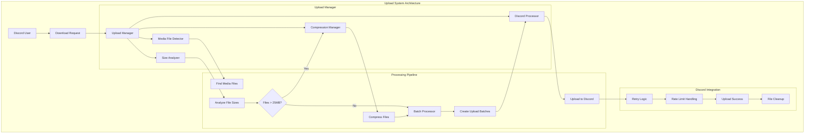

# Upload System

This document covers Boss-Bot's upload system architecture, which provides seamless integration between downloaded media and Discord uploads with intelligent compression, batching, and error handling.

## System Overview

The upload system transforms Boss-Bot from a simple download tool into a comprehensive media sharing solution optimized for Discord's platform constraints. It automatically processes downloaded files, compresses oversized content, creates optimal upload batches, and handles Discord-specific limitations.

**Key Features:**
- **Automatic File Processing**: Detects and categorizes media files (video, audio, image)
- **Intelligent Compression**: Compresses files exceeding Discord's 25MB limit
- **Smart Batching**: Groups files into optimal Discord message batches
- **Progress Feedback**: Real-time updates on processing and upload status
- **Error Resilience**: Graceful handling of upload failures with fallback options
- **Resource Management**: Automatic cleanup of temporary files

## Architecture Overview



## Core Components

### Upload Manager

The `UploadManager` is the main orchestrator that coordinates the entire upload workflow:

```python
# src/boss_bot/core/uploads/manager.py
class UploadManager:
    """Manages the complete upload workflow with compression integration."""

    def __init__(self, settings: BossSettings):
        self.settings = settings
        self.compression_manager = CompressionManager(settings)
        self.discord_processor = DiscordUploadProcessor(settings)
        self.file_detector = MediaFileDetector()
        self.size_analyzer = FileSizeAnalyzer(settings)

    async def process_downloaded_files(
        self, download_dir: Path, ctx: commands.Context, platform_name: str
    ) -> UploadResult:
        """Main entry point: Process all files in download directory.

        Workflow:
        1. Detect media files in directory
        2. Analyze file sizes to determine upload strategy
        3. Compress oversized files using compression manager
        4. Upload files to Discord in optimized batches
        5. Handle failures gracefully with user feedback
        """
```

**Key Responsibilities:**
- Orchestrates the complete upload workflow
- Integrates with compression system for oversized files
- Provides user feedback throughout the process
- Handles errors and edge cases gracefully
- Manages temporary file cleanup

### Media File Detection

The `MediaFileDetector` identifies and categorizes media files in download directories:

```python
# src/boss_bot/core/uploads/utils/file_detector.py
class MediaFileDetector:
    """Detects and categorizes media files."""

    def __init__(self):
        self.video_extensions = {".mp4", ".avi", ".mkv", ".mov", ".webm", ...}
        self.audio_extensions = {".mp3", ".wav", ".m4a", ".flac", ".aac", ...}
        self.image_extensions = {".jpg", ".jpeg", ".png", ".gif", ".webp", ...}

    async def find_media_files(self, directory: Path) -> list[MediaFile]:
        """Find all media files in directory recursively."""
```

**Features:**
- **Recursive Directory Search**: Finds files in subdirectories
- **Media Type Classification**: Video, audio, image, unknown
- **Extension-Based Detection**: Comprehensive file type recognition
- **Error Handling**: Gracefully handles inaccessible files

**Supported File Types:**
- **Video**: MP4, AVI, MKV, MOV, FLV, WMV, WebM, MPEG, 3GP, M4V, OGV, TS
- **Audio**: MP3, WAV, M4A, FLAC, AAC, OGG, WMA, Opus, AIFF, AU
- **Image**: JPG, JPEG, PNG, GIF, WebP, BMP, TIFF, SVG, ICO

### Size Analysis

The `FileSizeAnalyzer` categorizes files based on Discord's upload limits:

```python
# src/boss_bot/core/uploads/utils/size_analyzer.py
class FileSizeAnalyzer:
    """Analyzes file sizes to determine upload strategy."""

    def __init__(self, settings: BossSettings):
        self.discord_limit_mb = 25.0  # Discord's default limit
        self.max_upload_size_mb = getattr(settings, "compression_max_upload_size_mb", 50.0)

    async def analyze_files(self, media_files: list[MediaFile]) -> SizeAnalysis:
        """Analyze media files to categorize by size requirements."""
```

**Analysis Categories:**
- **Acceptable Files**: Files ≤ 25MB that can be uploaded directly
- **Oversized Files**: Files > 25MB that require compression
- **Total Statistics**: File count, total size, distribution

**Configuration:**
- `discord_limit_mb`: Discord's file size limit (25MB default)
- `compression_max_upload_size_mb`: Target compression size

### Batch Processing

The `BatchProcessor` creates optimal upload batches respecting Discord's limits:

```python
# src/boss_bot/core/uploads/utils/batch_processor.py
class BatchProcessor:
    """Processes media files into batches respecting Discord limits."""

    def __init__(self, settings: BossSettings):
        # Discord's hard limits
        self.max_files_per_message = 10
        self.max_message_size_mb = 25.0

        # Configurable limits from settings
        self.preferred_batch_size_mb = getattr(settings, "upload_batch_size_mb", 20.0)
        self.preferred_max_files = min(getattr(settings, "upload_max_files_per_batch", 10), 10)
```

**Batching Strategy:**
- **Size-Based Grouping**: Ensures batches don't exceed Discord limits
- **File Count Limits**: Respects Discord's 10 file per message limit
- **Optimization**: Smaller files first for better packing efficiency
- **Oversized Handling**: Single-file batches for files that can't be grouped

**Discord Limits:**
- Maximum 10 files per message (hard limit)
- Maximum 25MB total per message (hard limit)
- Configurable batch size (default: 20MB for safety margin)

### Discord Upload Processing

The `DiscordUploadProcessor` handles Discord-specific upload logic:

```python
# src/boss_bot/core/uploads/processors/discord_processor.py
class DiscordUploadProcessor:
    """Handles Discord-specific upload logic."""

    def __init__(self, settings: BossSettings):
        self.settings = settings
        self.batch_processor = BatchProcessor(settings)
        self.max_retries = 3
        self.retry_delay = 2.0

    async def upload_files(
        self, media_files: list[MediaFile], ctx: commands.Context, platform_name: str
    ) -> UploadResult:
        """Upload media files to Discord in optimized batches."""
```

**Features:**
- **Batch Upload Management**: Processes multiple batches sequentially
- **Retry Logic**: Automatic retries with exponential backoff
- **Rate Limit Handling**: Respects Discord API rate limits
- **Progress Updates**: Real-time feedback to users
- **Error Recovery**: Graceful handling of upload failures

## Data Models

### MediaFile

Represents a media file ready for upload:

```python
@dataclass
class MediaFile:
    """Represents a media file ready for upload."""
    path: Path
    filename: str
    size_bytes: int
    media_type: MediaType
    is_compressed: bool = False
    original_path: Path | None = None

    @property
    def size_mb(self) -> float:
        """Get file size in MB."""
        return self.size_bytes / (1024 * 1024)
```

### UploadBatch

Groups files for Discord upload:

```python
@dataclass
class UploadBatch:
    """A batch of files to upload together."""
    files: list[MediaFile]
    total_size_bytes: int
    metadata: dict[str, Any] = field(default_factory=dict)

    @property
    def total_size_mb(self) -> float:
        """Get total batch size in MB."""
        return self.total_size_bytes / (1024 * 1024)
```

### UploadResult

Represents the outcome of an upload operation:

```python
@dataclass
class UploadResult:
    """Result of an upload operation."""
    success: bool
    message: str
    files_processed: int
    successful_uploads: int = 0
    failed_uploads: int = 0
    error: str | None = None
    metadata: dict[str, Any] = field(default_factory=dict)
```

## Upload Workflow

### Step-by-Step Process

1. **File Discovery**
   ```python
   # Find all media files in download directory
   media_files = await self.file_detector.find_media_files(download_dir)
   ```

2. **Size Analysis**
   ```python
   # Categorize files by size requirements
   size_analysis = await self.size_analyzer.analyze_files(media_files)
   ```

3. **Compression (if needed)**
   ```python
   # Compress files that exceed Discord limits
   compressed_files = await self._compress_oversized_files(
       size_analysis.oversized_files, ctx, platform_name
   )
   ```

4. **Batch Creation**
   ```python
   # Create optimized upload batches
   upload_files = size_analysis.acceptable_files + compressed_files
   batches = self.batch_processor.optimize_batches(upload_files)
   ```

5. **Discord Upload**
   ```python
   # Upload each batch to Discord
   upload_result = await self.discord_processor.upload_files(
       upload_files, ctx, platform_name
   )
   ```

6. **Cleanup**
   ```python
   # Remove temporary files if configured
   if self.settings.upload_cleanup_after_success and upload_result.success:
       shutil.rmtree(download_dir)
   ```

### User Experience Flow

```
User: $download https://twitter.com/example/status/123

Bot: ✅ Twitter/X download completed!
Bot: 📤 Processing files for upload...
Bot: 📊 Found 3 media files (45.2MB total)
Bot: 🗜️ 1 files need compression
Bot: 🗜️ Compressing video.mp4 (32.1MB → target: 23.8MB)
Bot: ✅ Compressed successfully! (32MB → 24MB, ratio: 0.75)
Bot: 📎 Uploading batch 1/1: video_compressed.mp4, image1.jpg, image2.png (23.1MB)
Bot: 🎯 Twitter/X media files: [attached files]
Bot: ℹ️ Compression Info:
     🗜️ video_compressed.mp4 (compressed from video.mp4)
Bot: 🎉 Upload complete: 3/3 files uploaded
```

## Integration with Download System

### Enhanced Download Commands

The upload system integrates seamlessly with the download system:

```python
@commands.command(name="download")
async def download_command(self, ctx: commands.Context, url: str, upload: bool = True):
    """Download content and optionally upload to Discord."""

    # Create isolated download directory
    request_id = f"{ctx.author.id}_{ctx.message.id}"
    download_dir = self.download_dir / request_id

    try:
        # Execute download
        metadata = await strategy.download(url)

        # Process upload if requested
        if upload:
            upload_result = await self.upload_manager.process_downloaded_files(
                download_dir, ctx, platform_name
            )
    finally:
        # Cleanup if configured
        if upload and self.settings.upload_cleanup_after_success:
            shutil.rmtree(download_dir)
```

### Temporary Directory Management

The system uses isolated temporary directories for each download-upload request:

**Benefits:**
- **Isolation**: Each request has its own directory
- **Concurrency**: Multiple users can download simultaneously
- **Cleanup**: Automatic removal after successful upload
- **Debugging**: Files preserved on failure for analysis

**Directory Structure:**
```
downloads/
├── 123456789_987654321/    # user_id_message_id
│   ├── image1.jpg
│   ├── video1.mp4
│   └── video1_compressed.mp4
└── 234567890_876543210/
    ├── audio1.mp3
    └── image2.png
```

## Error Handling and Resilience

### Error Categories

1. **File System Errors**
   - File not found or inaccessible
   - Permission issues
   - Disk space limitations

2. **Compression Errors**
   - FFmpeg failures
   - Insufficient quality for target size
   - Codec compatibility issues

3. **Discord API Errors**
   - File too large (even after compression)
   - Rate limiting
   - Network connectivity issues
   - Authentication problems

4. **Processing Errors**
   - Invalid file formats
   - Corrupted media files
   - Unexpected file types

### Error Handling Strategies

```python
# Comprehensive error handling
async def handle_upload_errors(self, upload_result: UploadResult, ctx: commands.Context):
    """Handle various upload error scenarios."""

    if not upload_result.success:
        if "too large" in upload_result.message.lower():
            await ctx.send(
                "💡 Files too large even after compression. "
                "Consider using external storage or lower quality settings."
            )
        elif "rate limit" in upload_result.message.lower():
            await ctx.send(
                "⏳ Discord rate limit reached. "
                "Upload will continue automatically when limit resets."
            )
        elif upload_result.failed_uploads > 0:
            success_rate = upload_result.successful_uploads / upload_result.files_processed
            await ctx.send(
                f"⚠️ Partial upload success: {success_rate:.1%} files uploaded successfully"
            )
        else:
            await ctx.send(f"❌ Upload failed: {upload_result.error}")
```

### Retry Logic

The system includes intelligent retry mechanisms:

```python
# Retry with exponential backoff
for attempt in range(self.max_retries):
    try:
        return await self._attempt_batch_upload(batch, ctx, platform_name)
    except discord.HTTPException as e:
        if e.status == 429:  # Rate limited
            retry_after = getattr(e, "retry_after", self.retry_delay)
            if attempt < self.max_retries - 1:
                await ctx.send(f"⏳ Rate limited. Retrying in {retry_after:.1f}s...")
                await asyncio.sleep(retry_after)
                continue
```

## Performance Optimizations

### Concurrent Processing

```python
# Optimize compression with concurrency
async def compress_files_concurrently(self, oversized_files: list[MediaFile]):
    """Compress multiple files concurrently."""

    semaphore = asyncio.Semaphore(self.settings.compression_max_concurrent)

    async def compress_one(media_file: MediaFile):
        async with semaphore:
            return await self.compression_manager.compress_file(media_file.path)

    tasks = [compress_one(file) for file in oversized_files]
    return await asyncio.gather(*tasks, return_exceptions=True)
```

### Memory Management

- **Streaming Processing**: Files processed individually to minimize memory usage
- **Temporary File Cleanup**: Automatic removal of intermediate files
- **Batch Size Limits**: Prevents large memory allocations

### Network Optimization

- **Batch Uploads**: Multiple files per Discord message
- **Retry Logic**: Handles temporary network issues
- **Rate Limit Respect**: Prevents API quota exhaustion

## Configuration and Tuning

### Performance Profiles

**High-Volume Usage:**
```bash
UPLOAD_BATCH_SIZE_MB=20                      # Maximum safe batch size
UPLOAD_MAX_FILES_PER_BATCH=10                # Maximum throughput
UPLOAD_ENABLE_PROGRESS_UPDATES=false        # Reduce message volume
COMPRESSION_MAX_CONCURRENT=4                 # More concurrent operations
```

**Quality-Focused Usage:**
```bash
UPLOAD_BATCH_SIZE_MB=15                      # Smaller, more reliable batches
COMPRESSION_FFMPEG_PRESET=slow               # Higher quality compression
COMPRESSION_MAX_UPLOAD_SIZE_MB=20            # Conservative compression target
```

**Development/Testing:**
```bash
UPLOAD_CLEANUP_AFTER_SUCCESS=false          # Keep files for inspection
UPLOAD_ENABLE_PROGRESS_UPDATES=true         # Detailed feedback
UPLOAD_BATCH_SIZE_MB=10                      # Small batches for testing
```

### Monitoring and Metrics

The upload system provides comprehensive metrics for monitoring:

```python
# Upload metrics
upload_result.metadata = {
    "platform": platform_name,
    "total_files": len(media_files),
    "successful_uploads": successful_uploads,
    "failed_uploads": failed_uploads,
    "compression_attempts": len(oversized_files),
    "successful_compressions": len(compressed_files),
    "total_size_mb": total_size_mb,
    "batches_processed": len(batches),
    "processing_time_seconds": processing_time,
    "upload_time_seconds": upload_time
}
```

## Security Considerations

### File Validation

- **Extension Checking**: Only processes known media file types
- **Size Limits**: Enforces maximum file size limits
- **Path Validation**: Prevents directory traversal attacks

### Temporary File Security

- **Isolated Directories**: Each request uses unique directory
- **Permission Control**: Restricted file permissions
- **Automatic Cleanup**: Removes sensitive content after processing

### Discord Integration Security

- **Token Protection**: Secure handling of Discord bot tokens
- **Rate Limit Compliance**: Prevents API abuse
- **Error Information**: Sanitized error messages to users

## Future Enhancements

### Planned Features

1. **Cloud Storage Integration**
   - Upload to AWS S3, Google Cloud Storage
   - Generate shareable links for large files
   - Archive old uploads automatically

2. **Advanced Compression Options**
   - User-selectable quality presets
   - Format conversion (WebM, HEVC)
   - Custom compression parameters

3. **Upload Scheduling**
   - Queue large uploads for off-peak hours
   - Priority system for different content types
   - Bandwidth throttling options

4. **Enhanced User Controls**
   - Per-user upload preferences
   - Quality vs. speed trade-off settings
   - Upload notification preferences

### Extensibility

The upload system is designed for extensibility:

```python
# Custom upload processors
class CustomUploadProcessor(BaseUploadProcessor):
    """Custom upload processor for alternative platforms."""

    async def upload_files(self, files: list[MediaFile]) -> UploadResult:
        """Implement custom upload logic."""
        pass

# Register custom processor
upload_manager.register_processor("custom", CustomUploadProcessor())
```

This upload system provides a robust, efficient, and user-friendly solution for sharing downloaded media content through Discord while respecting platform constraints and providing optimal user experience.
