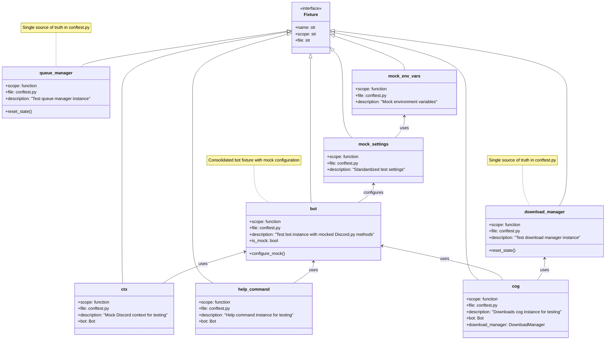

# Pytest Fixtures Recommended State - Class Diagram

## Overview
Shows the recommended state of pytest fixtures after consolidation and proper organization.

## Source
Based on analysis of current fixtures in:
- tests/conftest.py
- tests/test_bot/test_help.py
- tests/test_bot/test_download_cog.py
- tests/test_downloaders/test_base.py
- tests/test_core/test_queue_manager.py
- tests/test_bot/test_cogs/test_downloads.py

## Diagram

## Notes
1. Key improvements:
   - All fixtures consolidated in conftest.py
   - Clear dependency hierarchy
   - Consistent mocking strategy
   - State management with reset methods
   - Proper scope isolation

2. Implementation recommendations:
   - Move all fixture definitions to conftest.py
   - Add reset_state() methods to stateful fixtures
   - Use bot.is_mock flag to control mock behavior
   - Ensure proper cleanup between tests
   - Document fixture dependencies clearly

3. Migration steps:
   - Delete duplicate fixtures from individual test files
   - Update tests to use consolidated fixtures
   - Add proper teardown/cleanup in conftest.py
   - Add type hints and docstrings to all fixtures
