# Boss-Bot LangGraph Multi-Agent Architecture - System Architecture Diagram

This document contains the comprehensive system architecture diagram for the Boss-Bot LangGraph multi-agent system, visualizing the hybrid hierarchical-swarm architecture defined in `spec.yml`.

## Architecture Overview

The Boss-Bot multi-agent system implements a **hybrid hierarchical-swarm architecture** that combines structured supervision with dynamic peer-to-peer agent communication. The system is organized into distinct layers and phases for scalable AI-powered media processing.

## System Architecture Diagram

```mermaid
flowchart TB
    subgraph Discord["🤖 Discord Platform"]
        User["👤 Discord User"]
        BossBot["🤖 Boss-Bot Instance"]
    end

    subgraph MainSupervisor["🧠 Main Supervisor Layer"]
        MainSup["🎯 Main Supervisor<br/>Top-Level Orchestrator"]
    end

    subgraph Phase1["🚀 Phase 1: AI Foundation & Smart Strategy"]
        StratSel["🎯 Strategy Selector<br/>AI-Enhanced Strategy Selection"]
        ContAnal["🔍 Content Analyzer<br/>Multi-Modal Analysis"]
    end

    subgraph Phase2["⚙️ Phase 2: Specialized Agent Teams"]
        SocCoord["📱 Social Media Coordinator"]
        MediaCoord["🎬 Media Processing Coordinator"]
        QueueOpt["📋 Queue Optimizer"]
        UserCoord["💬 User Interaction Coordinator"]
    end

    subgraph Specialists["🔧 Specialist Processing Agents"]
        PlatSpec["🌐 Platform Specialist<br/>Twitter • Reddit • Instagram • YouTube"]
        VideoProc["📹 Video Processor<br/>Transcoding • Optimization"]
        ImageProc["🖼️ Image Processor<br/>Resizing • Filtering"]
        QualOpt["⭐ Quality Optimizer<br/>AI-Driven Quality Selection"]
    end

    subgraph Support["🛠️ Support & Integration"]
        FallHand["🚨 Fallback Handler<br/>Error Recovery"]
        DiscResp["💬 Discord Responder<br/>Rich Embeds • Progress"]
    end

    subgraph Storage["💾 Data & State Management"]
        WorkState[("🔄 Workflow State<br/>Current Agent • History")]
        UserCtx[("👤 User Context<br/>Preferences • AI Opt-in")]
        ContMeta[("📊 Content Metadata<br/>URL • Platform • Quality")]
        ProcOpts[("⚙️ Processing Options<br/>Target Quality • Format")]
    end

    subgraph External["🌐 External Services"]
        TwitterAPI["🐦 Twitter/X API"]
        RedditAPI["🔴 Reddit API"]
        InstagramAPI["📸 Instagram API"]
        YouTubeAPI["▶️ YouTube API"]
        OpenAIAPI["🤖 OpenAI API"]
        AnthropicAPI["🧠 Anthropic API"]
    end

    subgraph Config["⚙️ Configuration & Control"]
        FeatureFlags["🚩 Feature Flags<br/>Gradual AI Rollout"]
        WorkConds["🔀 Workflow Conditions<br/>Routing Logic"]
        SysConfig["🔧 System Configuration<br/>Models • Performance"]
    end

    %% User Interaction Flow
    User -->|"Discord Commands"| BossBot
    BossBot -->|"Request Processing"| MainSup

    %% Main Supervisor Routing
    MainSup -->|"Content Analysis"| ContAnal
    MainSup -->|"Strategy Selection"| StratSel
    MainSup -->|"Download Request"| SocCoord
    MainSup -->|"Media Processing"| MediaCoord
    MainSup -->|"Queue Management"| QueueOpt
    MainSup -->|"User Interaction"| UserCoord

    %% Phase 1 AI Foundation Flow
    ContAnal -->|"Analysis Complete"| StratSel
    ContAnal -->|"Quality Assessment"| QualOpt
    StratSel -->|"Strategy Selected"| SocCoord
    StratSel -->|"Platform Determined"| PlatSpec

    %% Phase 2 Specialized Teams Flow
    SocCoord -->|"Platform Coordination"| PlatSpec
    MediaCoord -->|"Video Processing"| VideoProc
    MediaCoord -->|"Image Processing"| ImageProc
    QueueOpt -->|"Queue Optimized"| SocCoord
    UserCoord -->|"Command Processing"| MainSup

    %% Specialist Processing Chain
    PlatSpec -->|"Download Success"| MediaCoord
    PlatSpec -->|"Download Failed"| FallHand
    VideoProc -->|"Processing Complete"| QualOpt
    ImageProc -->|"Processing Complete"| QualOpt

    %% Support & Response Flow
    QualOpt -->|"Optimization Complete"| DiscResp
    FallHand -->|"Recovery Attempt"| DiscResp
    UserCoord -->|"Response Required"| DiscResp
    DiscResp -->|"Response Sent"| BossBot

    %% External API Connections
    PlatSpec -.->|"API Calls"| TwitterAPI
    PlatSpec -.->|"API Calls"| RedditAPI
    PlatSpec -.->|"API Calls"| InstagramAPI
    PlatSpec -.->|"API Calls"| YouTubeAPI
    ContAnal -.->|"AI Analysis"| OpenAIAPI
    StratSel -.->|"AI Strategy"| AnthropicAPI

    %% State Management Connections
    MainSup <-->|"State Updates"| WorkState
    StratSel <-->|"User Preferences"| UserCtx
    ContAnal <-->|"Content Data"| ContMeta
    QualOpt <-->|"Processing Config"| ProcOpts

    %% Configuration Control
    FeatureFlags -.->|"Feature Control"| MainSup
    WorkConds -.->|"Routing Logic"| StratSel
    SysConfig -.->|"System Settings"| MediaCoord

    %% Swarm-Style Dynamic Handoffs (Dotted lines for dynamic communication)
    ContAnal -.->|"Specialized Analysis"| PlatSpec
    StratSel -.->|"User Preferences"| UserCoord
    MediaCoord -.->|"Quality Assessment"| ContAnal

    %% Styling
    classDef discord fill:#5865F2,stroke:#4752C4,stroke-width:2px,color:#fff
    classDef supervisor fill:#FF6B6B,stroke:#FF5252,stroke-width:2px,color:#fff
    classDef phase1 fill:#4ECDC4,stroke:#26A69A,stroke-width:2px,color:#fff
    classDef phase2 fill:#45B7D1,stroke:#2196F3,stroke-width:2px,color:#fff
    classDef specialists fill:#96CEB4,stroke:#4CAF50,stroke-width:2px,color:#fff
    classDef support fill:#FFEAA7,stroke:#FFC107,stroke-width:2px,color:#333
    classDef storage fill:#DDA0DD,stroke:#9C27B0,stroke-width:2px,color:#fff
    classDef external fill:#FFB74D,stroke:#FF9800,stroke-width:2px,color:#fff
    classDef config fill:#F8BBD9,stroke:#E91E63,stroke-width:2px,color:#fff

    class User,BossBot discord
    class MainSup supervisor
    class StratSel,ContAnal phase1
    class SocCoord,MediaCoord,QueueOpt,UserCoord phase2
    class PlatSpec,VideoProc,ImageProc,QualOpt specialists
    class FallHand,DiscResp support
    class WorkState,UserCtx,ContMeta,ProcOpts storage
    class TwitterAPI,RedditAPI,InstagramAPI,YouTubeAPI,OpenAIAPI,AnthropicAPI external
    class FeatureFlags,WorkConds,SysConfig config
```

## Architecture Components

### 🤖 **Discord Platform Layer**
- **Discord User**: End users interacting through Discord commands
- **Boss-Bot Instance**: Main Discord bot interface and entry point

### 🧠 **Main Supervisor Layer**
- **Main Supervisor**: Top-level orchestrator that routes requests based on type and system state
- Implements intelligent routing logic for optimal agent selection
- Maintains overall workflow coordination and state management

### 🚀 **Phase 1: AI Foundation & Smart Strategy**
- **Strategy Selector**: AI-enhanced strategy selection with URL analysis and user preference integration
- **Content Analyzer**: Multi-modal content analysis for video/image quality assessment and metadata extraction
- Forms the intelligent foundation for all downstream processing decisions

### ⚙️ **Phase 2: Specialized Agent Teams**
- **Social Media Coordinator**: Orchestrates platform-specific download operations
- **Media Processing Coordinator**: Manages video/image/audio processing workflows
- **Queue Optimizer**: Intelligent queue management with prioritization and resource allocation
- **User Interaction Coordinator**: Handles Discord interactions and natural language processing

### 🔧 **Specialist Processing Agents**
- **Platform Specialist**: Multi-platform handler (Twitter, Reddit, Instagram, YouTube) with API/CLI switching
- **Video Processor**: Specialized video transcoding, optimization, and thumbnail generation
- **Image Processor**: Image resizing, filtering, and platform-specific adaptation
- **Quality Optimizer**: AI-driven quality selection based on content analysis and target platform

### 🛠️ **Support & Integration**
- **Fallback Handler**: Error recovery mechanisms with graceful degradation to traditional methods
- **Discord Responder**: Rich embed formatting and user-friendly response generation

### 💾 **Data & State Management**
- **Workflow State**: Current agent tracking, processing history, and audit trails
- **User Context**: User preferences, Discord integration data, and AI opt-in status
- **Content Metadata**: URL analysis, platform detection, quality options, and confidence scores
- **Processing Options**: Target quality, format specifications, and optimization settings

### 🌐 **External Services**
- **Social Media APIs**: Twitter/X, Reddit, Instagram, YouTube for content retrieval
- **AI Model APIs**: OpenAI, Anthropic for content analysis and strategy selection
- Dotted lines indicate external API calls and dependencies

### ⚙️ **Configuration & Control**
- **Feature Flags**: Environment-driven control for gradual AI feature rollout
- **Workflow Conditions**: Dynamic routing logic and decision point definitions
- **System Configuration**: Model selections, performance tuning, and integration settings

## Architecture Patterns

### 🏗️ **Hierarchical Structure**
- **Main Supervisor** routes requests to specialized teams
- **Coordinators** manage domain-specific operations
- **Specialists** handle specific technical tasks
- Clear chain of command with defined responsibilities

### 🔄 **Swarm-Style Communication**
- **Dynamic Handoffs**: Agents can communicate directly when expertise is needed
- **Peer-to-Peer Coordination**: Quality assessment feedback loops between processing agents
- **Conditional Routing**: Runtime decisions based on content analysis and system state

### 🛡️ **Error Handling & Resilience**
- **Fallback Mechanisms**: Graceful degradation to traditional CLI/API methods
- **Error Recovery**: Comprehensive error tracking and recovery workflows
- **Feature Flag Control**: Safe rollout of experimental AI features

### 🔗 **Integration Points**
- **Epic 5 Strategy Pattern**: Direct integration with existing download strategies
- **Discord Command Enhancement**: Smart commands with AI-powered decision making
- **State Persistence**: Maintains context across Discord sessions and agent handoffs

## Data Flow Patterns

### 📥 **Request Processing Flow**
1. **User Input** → Discord Bot → Main Supervisor
2. **Analysis Phase** → Content Analyzer + Strategy Selector
3. **Execution Phase** → Specialized Coordinators → Platform Specialists
4. **Processing Phase** → Media Processors → Quality Optimizer
5. **Response Phase** → Discord Responder → User

### 🔄 **State Management Flow**
- **Bidirectional state updates** between agents and storage systems
- **Shared context** maintained across all workflow stages
- **Audit trails** for debugging and performance optimization

### ⚡ **Dynamic Routing**
- **Condition-based routing** using workflow conditions
- **Real-time adaptation** based on content analysis confidence scores
- **User preference integration** for personalized processing

This architecture enables Boss-Bot to provide intelligent, AI-powered media processing while maintaining compatibility with existing systems and providing robust error handling and fallback mechanisms.
