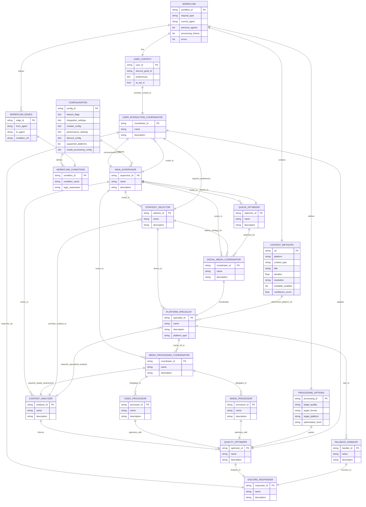

# Boss-Bot LangGraph Multi-Agent Architecture - Entity Relationship Diagram

This document contains the Mermaid Entity Relationship Diagram generated from the `spec.yml` file, visualizing the relationships between all entities in the Boss-Bot LangGraph multi-agent system.

## Entity Relationship Diagram

## Diagram Overview

### **Core Data Entities**
- **WORKFLOW**: Central orchestration entity that tracks the overall workflow state
- **USER_CONTEXT**: Discord user data, preferences, and AI opt-in status
- **CONTENT_METADATA**: Media content information including platform, type, and quality data
- **PROCESSING_OPTIONS**: Configuration for target quality, format, and optimization settings

### **Agent Hierarchy**
- **MAIN_SUPERVISOR**: Top-level orchestrator that routes requests to specialized teams
- **Coordinators**: Specialized coordinators for different domains (Social Media, Media Processing, Queue, User Interaction)
- **Specialists**: Platform-specific and processing-specific agents
- **Support Agents**: Quality optimization, error handling, and Discord response formatting

### **Configuration & Control**
- **WORKFLOW_CONDITIONS**: Defines routing logic and decision points
- **CONFIGURATION**: System-wide settings, feature flags, and integration points
- **WORKFLOW_EDGES**: Defines agent communication paths and handoff protocols

### **Relationship Types**

1. **Hierarchical Relationships** (`||--o{`): Main Supervisor routes to specialized agents
2. **One-to-One Coordination** (`||--||`): Direct agent-to-agent coordination
3. **Processing Chains**: Sequential handoffs through the workflow
4. **Swarm-style Handoffs**: Dynamic agent-to-agent communication based on runtime conditions
5. **Configuration Dependencies**: How settings and conditions control workflow behavior

### **Key Features Represented**

- **Hybrid Architecture**: Shows both hierarchical (supervisor-based) and swarm (peer-to-peer) patterns
- **Error Handling**: Fallback mechanisms and recovery paths
- **Dynamic Routing**: Conditional logic for intelligent agent selection
- **Integration Points**: How the system integrates with existing Boss-Bot components
- **State Management**: Shared state across all agents with proper data flow

This diagram serves as a comprehensive reference for understanding the data flow, agent relationships, and architectural patterns in the Boss-Bot LangGraph multi-agent system.
