# Boss-Bot: LangGraph Multi-Agent Architecture Recommendation

## Executive Summary

Based on your requirements for social media management and content creation, I recommend implementing a **hierarchical multi-agent architecture** combining elements from both traditional supervisor patterns and LangGraph Swarm for your boss-bot project[^1_1][^1_2]. This approach will provide the modularity, specialization, and control flow needed for complex media manipulation workflows while maintaining the flexibility to handle dynamic social media tasks.

## Recommended Architecture: Hybrid Hierarchical-Swarm Design

### Core Architecture Pattern

The optimal architecture for boss-bot should utilize a **hierarchical supervisor pattern** with **swarm-style handoffs** between specialized agent teams[^1_1][^1_3]. This hybrid approach offers several advantages:

**Top-Level Supervisor**: A master orchestrator that routes high-level requests to specialized teams[^1_1]
**Specialized Agent Teams**: Each team handles specific domains (media processing, social media management, file operations, etc.)[^1_1]
**Swarm Handoffs**: Agents within teams can dynamically transfer control to other agents when specialized expertise is needed[^1_3][^1_4]

### Why This Architecture Over Pure Swarm

While LangGraph Swarm offers elegant agent-to-agent handoffs, your use case requires more structured control flow for complex media manipulation pipelines[^1_3][^1_4]. The hierarchical approach provides:

- **Predictable routing** for complex workflows (download → process → upload sequences)
- **Better error handling** and recovery mechanisms
- **Clearer separation of concerns** between different functional domains
- **Easier debugging and monitoring** of multi-step processes[^1_1]


## Specialized Agent Teams

### 1. Social Media Management Team

**Primary Agent**: Social Media Coordinator
**Specialized Agents**:

- Platform-specific downloaders (Twitter/X, TikTok, YouTube, Reddit)
- Content analyzers and metadata extractors
- Upload and posting agents for various platforms

**Key Capabilities**:

- Download content from social media platforms using appropriate APIs or web scraping
- Extract metadata, captions, and engagement data
- Handle platform-specific formatting requirements[^1_5][^1_6]


### 2. Media Processing Team

**Primary Agent**: Media Processing Supervisor
**Specialized Agents**:

- Video processing agent (FFmpeg-based operations)
- Image processing agent (Pillow/OpenCV operations)
- Audio processing agent
- Format conversion and optimization agents

**Key Capabilities**:

- Video editing, cropping, resizing, color correction
- Image manipulation, cropping, filtering, text overlay
- Audio processing and synchronization
- Batch processing and optimization[^1_7][^1_8]


### 3. Database and File Management Team

**Primary Agent**: Data Management Coordinator
**Specialized Agents**:

- Database operations agent (SQLite, PostgreSQL, MongoDB)
- File system operations agent
- Metadata tracking and indexing agent
- Backup and archival agent

**Key Capabilities**:

- Track all file operations and transformations
- Maintain content metadata and processing history
- Implement content versioning and backup strategies
- Database schema management and migrations


### 4. Code Execution and Development Team

**Primary Agent**: Code Execution Manager
**Specialized Agents**:

- Python code execution agent (using LangChain Sandbox)
- JavaScript/Node.js execution agent
- Code generation and optimization agent
- Testing and validation agent

**Key Capabilities**:

- Safe execution of generated code using sandboxed environments[^1_9][^1_10]
- Dynamic script generation for custom processing tasks
- Code testing and validation
- Integration with external APIs and services[^1_9]


## Integration Components

### LangMem for Long-Term Memory

Implement LangMem for maintaining context across sessions and learning from user preferences[^1_11][^1_12]:

- **Semantic Memory**: Store user preferences for content styles, platforms, and processing parameters
- **Episodic Memory**: Remember successful workflows and processing pipelines
- **Procedural Memory**: Learn and optimize processing sequences based on outcomes[^1_12][^1_13]


### MCP (Model Context Protocol) Integration

Utilize MCP for standardized tool access across agents[^1_14]:

- Consistent interface for media processing tools
- Standardized database operations
- Unified file system access
- Cross-platform social media APIs


### Safe Code Execution

Integrate LangChain Sandbox for secure Python code execution[^1_9][^1_10]:

- Isolated execution environment using Pyodide and WebAssembly
- Support for dynamic dependency installation
- Session persistence for stateful operations
- Network access controls for security[^1_9][^1_15]


## Implementation Workflow Example

### Complex Social Media Workflow

For your example use case (download Twitter video, process, upload to Discord):

1. **Social Media Agent** downloads video and takes screenshot of tweet
2. **Media Processing Team** handles:
    - Video analysis and optimization
    - Image cropping and resizing
    - Composition of video with screenshot overlay
    - Format optimization for Discord
3. **Database Agent** tracks all operations and file versions
4. **Social Media Agent** uploads processed content to Discord
5. **Memory System** stores successful workflow for future use

### State Management and Routing

Implement **Command-based routing** for agent handoffs[^1_1]:

```python
# Pseudocode example
def media_processor_agent(state):
    if state["task_type"] == "video_processing":
        return Command(
            goto="video_processing_agent",
            update={"processing_params": state["video_params"]}
        )
    elif state["task_type"] == "image_processing":
        return Command(
            goto="image_processing_agent",
            update={"processing_params": state["image_params"]}
        )
```


## Testing and Evaluation Framework

### AgentEvals Integration

Implement comprehensive testing using AgentEvals for trajectory evaluation[^1_16]:

- **Trajectory matching** for workflow validation
- **LLM-as-judge** evaluation for content quality assessment
- **Graph trajectory evaluation** for complex multi-agent workflows
- **Tool call validation** for media processing operations


### OpenEvals for Content Quality

Use OpenEvals for content and output evaluation[^1_17]:

- **Correctness evaluation** for processed media outputs
- **Hallucination detection** for generated content
- **Structured output validation** for metadata and file operations


## Recommended Technology Stack

### Core Framework

- **LangGraph**: Primary orchestration framework
- **LangChain**: Tool integration and LLM operations
- **LangMem**: Long-term memory management


### Media Processing

- **FFmpeg**: Video processing and conversion
- **Pillow/OpenCV**: Image manipulation
- **MoviePy**: Python-based video editing


### Database and Storage

- **SQLite**: Local development and testing
- **PostgreSQL**: Production database
- **File system monitoring**: Track all media operations


### Testing and Monitoring

- **AgentEvals**: Agent trajectory testing
- **OpenEvals**: Content quality evaluation
- **LangSmith**: Monitoring and debugging


## Implementation Phases

### Phase 1: Foundation

- Set up hierarchical supervisor architecture
- Implement basic social media download capabilities
- Create simple media processing pipeline
- Establish database tracking system


### Phase 2: Advanced Processing

- Add complex video processing workflows
- Implement cross-platform content adaptation
- Integrate LangMem for learning and optimization
- Add safe code execution capabilities


### Phase 3: Intelligence and Automation

- Implement reflection and self-improvement mechanisms
- Add automated content optimization based on platform requirements
- Develop custom processing pipeline generation
- Integrate comprehensive testing and evaluation systems

This architecture provides the modularity, scalability, and robustness needed for your boss-bot project while maintaining the flexibility to handle the dynamic nature of social media content creation and management workflows.

<div style="text-align: center">⁂</div>

[^1_1]: https://langchain-ai.github.io/langgraph/concepts/multi_agent/

[^1_2]: https://langchain-ai.github.io/langgraph/concepts/agentic_concepts/

[^1_3]: https://dev.to/sreeni5018/building-multi-agent-systems-with-langgraph-swarm-a-new-approach-to-agent-collaboration-15kj

[^1_4]: https://www.youtube.com/watch?v=JeyDrn1dSUQ

[^1_5]: https://github.com/gatomod/fftools

[^1_6]: https://vitrina.ai/blog/automated-video-editing-guide-revolutionize-workflow/

[^1_7]: https://app.vexpower.com/sim/automating-content-workflows-with-langgraph/

[^1_8]: https://developer.mamezou-tech.com/en/blogs/2025/02/26/langmem-intro/

[^1_9]: https://python.langchain.com/api_reference/community/index.html

[^1_10]: https://python.langchain.com/docs/integrations/tools/

[^1_11]: https://blog.langchain.dev/langmem-sdk-launch/

[^1_12]: https://langchain-ai.github.io/langmem/concepts/conceptual_guide/

[^1_13]: https://github.com/langchain-ai/langmem

[^1_14]: https://langchain-ai.github.io/langmem/

[^1_15]: https://github.com/langchain-ai/agentevals

[^1_16]: https://www.sparksocialagency.com

[^1_17]: https://thesnowagency.com/services/content-creation/

[^1_18]: https://langchain-ai.github.io/langgraph/concepts/application_structure/

[^1_19]: https://github.com/langchain-ai/langgraph-swarm-py

[^1_20]: https://changelog.langchain.com/announcements/langgraph-swarm-for-building-multi-agent-systems

[^1_21]: https://learnopoly.com/meet-a-langgraph-multi-agent-swarm-a-python-library-to-create-multi-agent-style-style-systems-using-langgraph/

[^1_22]: https://www.youtube.com/watch?v=4oC1ZKa9-Hs

[^1_23]: https://aitalkin.com/t/langgraph-swarm-ai-agent-coordination-simplified/1595

[^1_24]: https://chapinindustries.com/2025/05/18/meet-langgraph-multi-agent-swarm-a-python-library-for-creating-swarm-style-multi-agent-systems-using-langgraph/

[^1_25]: https://www.reddit.com/r/machinelearningnews/comments/1kntjcn/meet_langgraph_multiagent_swarm_a_python_library/

[^1_26]: https://github.com/langchain-ai/data-enrichment-js

[^1_27]: https://langchain-ai.github.io/langgraph/agents/mcp/

[^1_28]: https://deepwiki.com/langchain-ai/langmem/5-memory-tools

[^1_29]: https://github.com/langchain-ai/langgraph-memory

[^1_30]: https://www.geeky-gadgets.com/langchain-sandbox-secure-python-code-execution-2025/

[^1_31]: https://devpost.com/software/langconnect

[^1_32]: https://blockchain.news/news/langgraph-long-term-memory-support-ai

[^1_33]: https://github.com/langchain-ai/langchain-sandbox

[^1_34]: https://changelog.langchain.com/announcements/langchain-sandbox-run-untrusted-python-in-your-ai-agents

[^1_35]: https://www.covalent.xyz/langchain-and-covalent-sandboxing-ai-generated-code/

[^1_36]: https://murraycole.com/posts/ai-code-execution-environment

[^1_37]: https://pypi.org/project/langchain-sandbox/

[^1_38]: https://github.com/awslabs/agent-evaluation

[^1_39]: https://github.com/langchain-ai/openevals

[^1_40]: https://www.siegemedia.com/strategy/best-content-creation-services

[^1_41]: https://www.munro.agency/social-media-agencies/

[^1_42]: https://coolnerdsmarketing.com/social-media-content-creation-agency/

[^1_43]: https://dev.to/aragorn_talks/langgraph-tutorial-a-comprehensive-guide-to-building-advanced-ai-agents-l31

[^1_44]: https://axiom.ai/automate/social-media-tasks

[^1_45]: https://www.reddit.com/r/LangChain/comments/1g1pkki/openais_new_framework_for_agents_why_is_langgraph/

[^1_46]: https://python.langchain.com/docs/introduction/


---

# Boss-Bot LangGraph Multi-Agent Architecture Diagram

Based on the hierarchical multi-agent architecture design for your boss-bot project, here's the comprehensive Mermaid diagram representing the proposed system structure:

```mermaid
flowchart TD
    %% Main Entry Point
    User[👤 User Request] --> MainSupervisor{🎯 Main Supervisor}

    %% Top-level routing
    MainSupervisor --> SocialMediaTeam[📱 Social Media Team]
    MainSupervisor --> MediaProcessingTeam[🎬 Media Processing Team]
    MainSupervisor --> DatabaseTeam[💾 Database & File Team]
    MainSupervisor --> CodeExecutionTeam[💻 Code Execution Team]

    %% Social Media Management Team
    subgraph SocialMedia ["🌐 Social Media Management Team"]
        SMCoordinator[📋 Social Media Coordinator]
        TwitterAgent[🐦 Twitter/X Downloader]
        TikTokAgent[🎵 TikTok Downloader]
        YouTubeAgent[📺 YouTube Downloader]
        RedditAgent[🤖 Reddit Downloader]
        ContentAnalyzer[🔍 Content Analyzer]
        UploadAgent[📤 Upload Agent]

        SMCoordinator --> TwitterAgent
        SMCoordinator --> TikTokAgent
        SMCoordinator --> YouTubeAgent
        SMCoordinator --> RedditAgent
        SMCoordinator --> ContentAnalyzer
        SMCoordinator --> UploadAgent
    end

    %% Media Processing Team
    subgraph MediaProcessing ["🎨 Media Processing Team"]
        MPSupervisor[🎬 Media Processing Supervisor]
        VideoProcessor[🎥 Video Processing Agent]
        ImageProcessor[🖼️ Image Processing Agent]
        AudioProcessor[🔊 Audio Processing Agent]
        FormatConverter[🔄 Format Converter]

        MPSupervisor --> VideoProcessor
        MPSupervisor --> ImageProcessor
        MPSupervisor --> AudioProcessor
        MPSupervisor --> FormatConverter
    end

    %% Database and File Management Team
    subgraph DatabaseManagement ["🗄️ Database & File Management Team"]
        DMCoordinator[📊 Data Management Coordinator]
        DatabaseAgent[🗃️ Database Operations Agent]
        FileSystemAgent[📁 File System Agent]
        MetadataTracker[🏷️ Metadata Tracker]
        BackupAgent[💾 Backup Agent]

        DMCoordinator --> DatabaseAgent
        DMCoordinator --> FileSystemAgent
        DMCoordinator --> MetadataTracker
        DMCoordinator --> BackupAgent
    end

    %% Code Execution Team
    subgraph CodeExecution ["⚡ Code Execution Team"]
        CEManager[🛠️ Code Execution Manager]
        PythonExecutor[🐍 Python Executor]
        JSExecutor[🟨 JavaScript Executor]
        CodeGenerator[📝 Code Generator]
        TestValidator[✅ Test Validator]

        CEManager --> PythonExecutor
        CEManager --> JSExecutor
        CEManager --> CodeGenerator
        CEManager --> TestValidator
    end

    %% Integration Components
    subgraph Integrations ["🔧 Integration Layer"]
        LangMem[(🧠 LangMem Memory)]
        MCPClient[🔌 MCP Client]
        LangChainSandbox[🏖️ LangChain Sandbox]
        AgentEvals[📋 AgentEvals Testing]
        OpenEvals[🎯 OpenEvals Quality]
    end

    %% External Tools
    subgraph ExternalTools ["🛠️ External Tools"]
        FFmpeg[🎞️ FFmpeg]
        Pillow[🖌️ Pillow/OpenCV]
        SQLite[(📄 SQLite)]
        PostgreSQL[(🐘 PostgreSQL)]
        MongoDB[(🍃 MongoDB)]
    end

    %% Team connections to main supervisor
    SocialMediaTeam --> MainSupervisor
    MediaProcessingTeam --> MainSupervisor
    DatabaseTeam --> MainSupervisor
    CodeExecutionTeam --> MainSupervisor

    %% Inter-team communications (Swarm-style handoffs)
    SocialMedia -.->|Content Data| MediaProcessing
    MediaProcessing -.->|Processed Files| DatabaseManagement
    DatabaseManagement -.->|Metadata| SocialMedia
    CodeExecution -.->|Scripts| MediaProcessing

    %% Integration connections
    MainSupervisor --> LangMem
    MainSupervisor --> MCPClient
    CodeExecution --> LangChainSandbox
    MainSupervisor --> AgentEvals
    MainSupervisor --> OpenEvals

    %% External tool connections
    MediaProcessing --> FFmpeg
    MediaProcessing --> Pillow
    DatabaseManagement --> SQLite
    DatabaseManagement --> PostgreSQL
    DatabaseManagement --> MongoDB

    %% Example workflow path (highlighted)
    User -.->|"Download Twitter video,<br/>process & upload to Discord"| MainSupervisor
    MainSupervisor -.->|Route Request| SocialMedia
    SocialMedia -.->|Video + Screenshot| MediaProcessing
    MediaProcessing -.->|Composed Media| DatabaseManagement
    DatabaseManagement -.->|Track Operations| SocialMedia
    SocialMedia -.->|Upload to Discord| User

    %% Styling
    classDef userClass fill:#e1f5fe,stroke:#01579b,stroke-width:2px
    classDef supervisorClass fill:#fff3e0,stroke:#e65100,stroke-width:3px
    classDef teamClass fill:#f3e5f5,stroke:#4a148c,stroke-width:2px
    classDef agentClass fill:#e8f5e8,stroke:#1b5e20,stroke-width:1px
    classDef integrationClass fill:#fff8e1,stroke:#ff8f00,stroke-width:2px
    classDef toolClass fill:#fce4ec,stroke:#880e4f,stroke-width:1px
    classDef memoryClass fill:#e0f2f1,stroke:#00695c,stroke-width:2px

    class User userClass
    class MainSupervisor supervisorClass
    class SMCoordinator,MPSupervisor,DMCoordinator,CEManager supervisorClass
    class SocialMediaTeam,MediaProcessingTeam,DatabaseTeam,CodeExecutionTeam teamClass
    class TwitterAgent,TikTokAgent,YouTubeAgent,RedditAgent,ContentAnalyzer,UploadAgent agentClass
    class VideoProcessor,ImageProcessor,AudioProcessor,FormatConverter agentClass
    class DatabaseAgent,FileSystemAgent,MetadataTracker,BackupAgent agentClass
    class PythonExecutor,JSExecutor,CodeGenerator,TestValidator agentClass
    class MCPClient,LangChainSandbox,AgentEvals,OpenEvals integrationClass
    class FFmpeg,Pillow toolClass
    class LangMem,SQLite,PostgreSQL,MongoDB memoryClass
```




## Architecture Overview

This Mermaid diagram illustrates the **hybrid hierarchical-swarm architecture** recommended for your boss-bot project [^2_1][^2_2]. The design incorporates several key architectural patterns:

### Hierarchical Structure

The **Main Supervisor** serves as the top-level orchestrator that routes high-level requests to specialized agent teams [^2_1][^2_3]. This provides predictable routing for complex workflows like your example use case of downloading Twitter videos, processing them, and uploading to Discord.

### Specialized Agent Teams

Each team is designed around specific functional domains [^2_2][^2_4]:

- **Social Media Management Team**: Handles platform-specific downloading and content analysis
- **Media Processing Team**: Manages video, image, and audio manipulation using tools like FFmpeg and Pillow
- **Database \& File Management Team**: Tracks operations and maintains content metadata
- **Code Execution Team**: Provides safe code execution capabilities using LangChain Sandbox


### Swarm-Style Handoffs

The dotted lines represent **dynamic agent-to-agent handoffs** between teams [^2_2][^2_5]. This allows agents to transfer control when specialized expertise is needed, combining the structure of hierarchical supervision with the flexibility of swarm architectures.

### Integration Layer

The diagram shows integration with key LangGraph ecosystem components [^2_6][^2_7]:

- **LangMem** for long-term memory and learning from user preferences
- **MCP Client** for standardized tool access across agents
- **LangChain Sandbox** for secure Python code execution
- **AgentEvals and OpenEvals** for comprehensive testing and quality assessment

This architecture supports your complex social media content creation workflows while maintaining modularity, scalability, and clear separation of concerns between different functional domains [^2_1][^2_2][^2_4].

<div style="text-align: center">⁂</div>

[^2_1]: https://mermaid.js.org/intro/syntax-reference.html

[^2_2]: https://docs.mermaidchart.com/mermaid-oss/syntax/flowchart.html

[^2_3]: https://emersonbottero.github.io/mermaid-docs/intro/n00b-syntaxReference.html

[^2_4]: https://www.drawio.com/blog/mermaid-diagrams

[^2_5]: https://clickup.com/blog/mermaid-diagram-examples/

[^2_6]: https://github.com/pakagronglb/langgraph-visualisation-tool

[^2_7]: https://python.langchain.com/api_reference/core/runnables/langchain_core.runnables.graph_mermaid.draw_mermaid.html

[^2_8]: https://mermaid.js.org

[^2_9]: https://jojozhuang.github.io/tutorial/creating-data-structure-diagrams-with-mermaid/

[^2_10]: https://unpkg.com/mermaid@0.5.8/dist/www/sequenceDiagram.html

[^2_11]: https://emersonbottero.github.io/mermaid-docs/syntax/flowchart.html

[^2_12]: https://github.com/orgs/mermaid-js/discussions/4291

[^2_13]: https://subscription.packtpub.com/book/web-development/9781801078023/8/ch08lvl1sec39/subgraphs

[^2_14]: https://jojozhuang.github.io/tutorial/mermaid-cheat-sheet/

[^2_15]: https://docs.mermaidchart.com/mermaid-oss/syntax/examples.html

[^2_16]: https://waylonwalker.com/mermaid-subgraphs/
