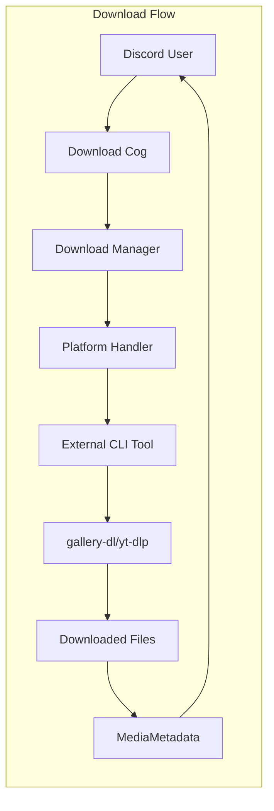
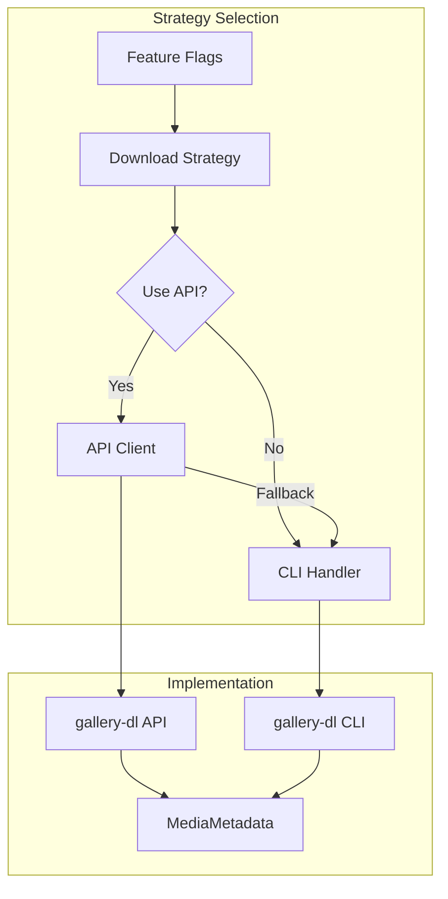
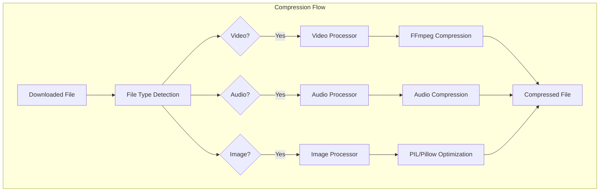
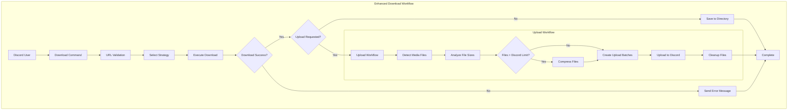

# Download System

This document explains Boss-Bot's download system architecture, covering both the current Handler pattern and the experimental Strategy pattern for platform-specific media downloads.

## System Overview

Boss-Bot supports downloading media from multiple platforms through a pluggable architecture that allows for different implementation approaches:

**Supported Platforms:**
- **Twitter/X**: Posts, threads, media content
- **Reddit**: Posts, comments, images, videos
- **Instagram**: Posts, stories (experimental)
- **YouTube**: Videos, playlists, audio extraction

**Implementation Approaches:**
- **Handler Pattern** (Current): CLI-based subprocess execution
- **Strategy Pattern** (Experimental): API-direct with CLI fallback

## Handler Pattern (Current Implementation)

### Architecture Overview

The Handler pattern provides a stable, CLI-based approach using external tools:



### Base Handler Interface

```python
# src/boss_bot/core/downloads/handlers/base_handler.py
from abc import ABC, abstractmethod
from boss_bot.schemas.discord import MediaMetadata

class BaseDownloadHandler(ABC):
    """Abstract base class for platform-specific download handlers."""

    def __init__(self, download_dir: Path):
        self.download_dir = download_dir

    @abstractmethod
    def download(self, url: str, **kwargs) -> MediaMetadata:
        """Download media from URL and return metadata."""
        pass

    @abstractmethod
    def supports_url(self, url: str) -> bool:
        """Check if this handler supports the given URL."""
        pass

    def _build_command(self, url: str, **kwargs) -> List[str]:
        """Build CLI command for external tool."""
        pass

    def _parse_metadata(self, output: str) -> MediaMetadata:
        """Parse CLI output into MediaMetadata."""
        pass
```

### Platform Handler Implementations

#### TwitterHandler

```python
# src/boss_bot/core/downloads/handlers/twitter_handler.py
class TwitterHandler(BaseDownloadHandler):
    """Handle Twitter/X downloads using gallery-dl."""

    def supports_url(self, url: str) -> bool:
        """Check if URL is from Twitter/X."""
        return any(domain in url.lower() for domain in ['twitter.com', 'x.com'])

    def download(self, url: str, **kwargs) -> MediaMetadata:
        """Download Twitter content via gallery-dl CLI."""
        command = [
            'gallery-dl',
            '--extract',                    # Extract metadata only
            '--write-info-json',           # Save metadata as JSON
            '--cookies-from-browser', 'firefox',  # Use browser cookies
            '--user-agent', 'Mozilla/5.0...',    # Set user agent
            url
        ]

        result = subprocess.run(command, capture_output=True, text=True)
        if result.returncode != 0:
            raise DownloadError(f"gallery-dl failed: {result.stderr}")

        return self._parse_twitter_metadata(result.stdout)
```

#### YouTubeHandler

```python
# src/boss_bot/core/downloads/handlers/youtube_handler.py
class YouTubeHandler(BaseDownloadHandler):
    """Handle YouTube downloads using yt-dlp."""

    def download(self, url: str, quality: str = "720p", **kwargs) -> MediaMetadata:
        """Download YouTube content with quality selection."""
        command = [
            'yt-dlp',
            '--format', f'best[height<={quality[:-1]}]',  # Quality selection
            '--write-info-json',                          # Save metadata
            '--extract-flat',                             # Extract info only
            url
        ]

        result = subprocess.run(command, capture_output=True, text=True)
        metadata = self._parse_youtube_metadata(result.stdout)

        # Add quality information
        metadata.quality = quality
        metadata.format_info = self._extract_format_info(result.stdout)

        return metadata
```

### Enhanced YouTube Strategy Pattern

The YouTube strategy has been significantly enhanced with advanced features for Discord integration:

```python
# src/boss_bot/core/downloads/strategies/youtube_strategy.py
class YouTubeDownloadStrategy(BaseDownloadStrategy):
    """Enhanced YouTube strategy with organized storage and deduplication."""

    def _get_youtube_config(self) -> dict[str, Any]:
        """Get optimized yt-dlp configuration for Discord workflow."""
        return {
            # Organized directory structure
            "outtmpl": {
                "default": f"{self.download_dir}/yt-dlp/youtube/%(uploader|Unknown)s/%(title).100s-%(id)s.%(ext)s",
                "infojson": f"{self.download_dir}/yt-dlp/youtube/%(uploader|Unknown)s/%(title).100s-%(id)s.info.json",
                "thumbnail": f"{self.download_dir}/yt-dlp/youtube/%(uploader|Unknown)s/%(title).100s-%(id)s.%(ext)s",
                "description": f"{self.download_dir}/yt-dlp/youtube/%(uploader|Unknown)s/%(title).100s-%(id)s.description"
            },

            # Quality ladder optimized for Discord limits
            "format": "best[height<=720][filesize<50M]/best[height<=480][filesize<25M]/best[height<=360][filesize<10M]",

            # Enhanced metadata preservation
            "writeinfojson": True,
            "writedescription": True,
            "writethumbnail": True,
            "writesubtitles": False,  # Skip subtitles for Discord uploads

            # Performance optimization
            "noplaylist": True,
            "ignoreerrors": False,
            "retries": 3,
            "fragment_retries": 3,
            "socket_timeout": 120,
            "read_timeout": 300,

            # Discord-friendly video settings
            "merge_output_format": "mp4",
            "postprocessor_args": ["-movflags", "+faststart"]  # Web-optimized MP4
        }

    async def download(self, url: str, **kwargs) -> MediaMetadata:
        """Download with deduplication and performance tracking."""
        # Check for duplicates unless force_redownload is specified
        duplicate_check = self._check_deduplication(url, **kwargs)
        if duplicate_check:
            logger.info(f"Skipping duplicate download: {url}")
            return duplicate_check

        # Performance tracking
        start_time = time.time()

        # Enhanced error handling with YouTube-specific patterns
        try:
            metadata = await self._download_via_api_with_fallbacks(url, **kwargs)

            # Record performance metrics
            download_duration = time.time() - start_time
            if not metadata.error:
                video_id = self._extract_youtube_video_id(url)
                if video_id:
                    self._record_download(video_id, metadata)
                    self._record_performance_metrics(video_id, download_duration, metadata.download_method)

            return metadata
        except Exception as e:
            download_duration = time.time() - start_time
            logger.error(f"YouTube download failed after {download_duration:.2f}s: {e}")
            raise
```

**Key Strategy Enhancements:**

1. **Organized Directory Structure**
   - `yt-dlp/youtube/{channel_name}/` hierarchy
   - Automatic channel name sanitization for filesystem compatibility
   - Consistent with gallery-dl organization patterns

2. **Discord Optimization**
   - Quality ladder: 720p (50MB) → 480p (25MB) → 360p (10MB)
   - MP4 format with web optimization (`+faststart`)
   - Automatic format selection based on Discord limits

3. **Deduplication System**
   - Video ID extraction from URLs (supports all YouTube URL formats)
   - Persistent download history in `.yt_download_history.json`
   - Automatic duplicate detection with user notification
   - Force redownload option with `force_redownload=True`

4. **Performance Monitoring**
   - Real-time download duration tracking
   - Method performance comparison (API vs CLI vs fallback)
   - Historical metrics storage in `.yt_performance_metrics.json`
   - Statistics accessible via Discord commands

5. **Enhanced Error Handling**
   - YouTube-specific error patterns (age-restriction, copyright, private videos)
   - Retry logic with exponential backoff
   - Fatal vs retryable error classification
   - Automatic API-to-CLI fallback when enabled

### Handler Registration and Discovery

```python
# src/boss_bot/core/downloads/manager.py
class DownloadManager:
    """Manages download operations across platforms."""

    def __init__(self, settings: BossSettings):
        self.settings = settings
        self.handlers = self._register_handlers()

    def _register_handlers(self) -> Dict[str, BaseDownloadHandler]:
        """Register all available download handlers."""
        return {
            'twitter': TwitterHandler(self.settings.download_dir),
            'reddit': RedditHandler(self.settings.download_dir),
            'instagram': InstagramHandler(self.settings.download_dir),
            'youtube': YouTubeHandler(self.settings.download_dir),
        }

    def get_handler(self, url: str) -> BaseDownloadHandler:
        """Find appropriate handler for URL."""
        for handler in self.handlers.values():
            if handler.supports_url(url):
                return handler
        raise UnsupportedURLError(f"No handler found for URL: {url}")
```

## Strategy Pattern (Experimental)

### Architecture Overview

The Strategy pattern enables switching between CLI and API implementations:



### Base Strategy Interface

```python
# src/boss_bot/core/downloads/strategies/base_strategy.py
from abc import ABC, abstractmethod

class BaseDownloadStrategy(ABC):
    """Strategy interface for download implementations."""

    @abstractmethod
    async def download(self, url: str, **kwargs) -> MediaMetadata:
        """Download using chosen strategy (CLI or API)."""
        pass

    @abstractmethod
    def supports_url(self, url: str) -> bool:
        """Check if strategy supports URL."""
        pass
```

### Feature Flag System

```python
# src/boss_bot/core/downloads/feature_flags.py
class DownloadFeatureFlags:
    """Feature flags for download implementations."""

    def __init__(self, settings: BossSettings):
        self.settings = settings

    @property
    def use_api_twitter(self) -> bool:
        """Use API-direct approach for Twitter downloads."""
        return self.settings.twitter_use_api_client

    @property
    def use_api_reddit(self) -> bool:
        """Use API-direct approach for Reddit downloads."""
        return self.settings.reddit_use_api_client

    @property
    def api_fallback_to_cli(self) -> bool:
        """Fallback to CLI if API fails."""
        return self.settings.download_api_fallback_to_cli
```

### Strategy Implementation Example

```python
# src/boss_bot/core/downloads/strategies/twitter_strategy.py
class TwitterDownloadStrategy(BaseDownloadStrategy):
    """Strategy for Twitter downloads with CLI/API choice."""

    def __init__(self, feature_flags: DownloadFeatureFlags, download_dir: Path):
        self.feature_flags = feature_flags
        self.download_dir = download_dir

        # Keep existing CLI handler (unchanged)
        self.cli_handler = TwitterHandler(download_dir=download_dir)

        # Lazy-loaded API client
        self._api_client = None

    @property
    def api_client(self):
        """Lazy load API client only when needed."""
        if self._api_client is None:
            from boss_bot.core.downloads.clients import AsyncGalleryDL
            self._api_client = AsyncGalleryDL()
        return self._api_client

    async def download(self, url: str, **kwargs) -> MediaMetadata:
        """Download using feature-flagged approach."""

        if self.feature_flags.use_api_twitter:
            try:
                return await self._download_via_api(url, **kwargs)
            except Exception as e:
                logger.warning(f"API download failed: {e}")
                if self.feature_flags.api_fallback_to_cli:
                    return await self._download_via_cli(url, **kwargs)
                raise
        else:
            return await self._download_via_cli(url, **kwargs)

    async def _download_via_cli(self, url: str, **kwargs) -> MediaMetadata:
        """Use existing CLI handler (unchanged behavior)."""
        loop = asyncio.get_event_loop()
        return await loop.run_in_executor(
            None, self.cli_handler.download, url, **kwargs
        )

    async def _download_via_api(self, url: str, **kwargs) -> MediaMetadata:
        """Use new API client."""
        async with self.api_client as client:
            async for item in client.download(url, **kwargs):
                return self._convert_api_response(item)
```

## API Client Implementation

### AsyncGalleryDL Client

```python
# src/boss_bot/core/downloads/clients/aio_gallery_dl.py
class AsyncGalleryDL:
    """Asynchronous wrapper around gallery-dl API."""

    def __init__(
        self,
        config: Optional[Dict[str, Any]] = None,
        config_file: Optional[Path] = None,
        cookies_file: Optional[Path] = None,
        cookies_from_browser: Optional[str] = None,
    ):
        self.config = config or {}
        self.config_file = config_file or Path("~/.gallery-dl.conf").expanduser()

        # Apply cookie settings
        if cookies_file:
            self.config.setdefault("extractor", {})["cookies"] = str(cookies_file)
        elif cookies_from_browser:
            self.config.setdefault("extractor", {})["cookies-from-browser"] = cookies_from_browser

    async def download(self, url: str, **options) -> AsyncIterator[Dict[str, Any]]:
        """Download content from URL asynchronously."""
        loop = asyncio.get_event_loop()

        # Run gallery-dl in thread pool to avoid blocking
        def _run_gallerydl():
            import gallery_dl
            job = gallery_dl.job.DownloadJob(url, self.config)
            job.run()
            return job.pathfmt.tempdir

        result = await loop.run_in_executor(None, _run_gallerydl)

        # Yield download results
        for file_info in result:
            yield {
                "url": file_info.get("url"),
                "filename": file_info.get("filename"),
                "extractor": file_info.get("extractor"),
                "metadata": file_info
            }

    async def extract_metadata(self, url: str) -> AsyncIterator[Dict[str, Any]]:
        """Extract metadata without downloading files."""
        loop = asyncio.get_event_loop()

        def _extract_metadata():
            import gallery_dl
            extractor = gallery_dl.extractor.find(url)
            if extractor:
                return list(extractor.items())
            return []

        items = await loop.run_in_executor(None, _extract_metadata)
        for item in items:
            yield item
```

### Configuration Management

```python
# src/boss_bot/core/downloads/clients/config/gallery_dl_config.py
from pydantic import BaseModel, Field, SecretStr

class TwitterConfig(BaseModel):
    """Twitter extractor configuration."""
    quoted: bool = True
    replies: bool = True
    retweets: bool = True
    videos: bool = True
    cookies: Optional[str] = None
    filename: str = "{category}_{user[screen_name]}_{id}_{num}.{extension}"
    directory: List[str] = ["twitter", "{user[screen_name]}"]

class GalleryDLConfig(BaseModel):
    """Root gallery-dl configuration with validation."""
    extractor: ExtractorConfig
    downloader: DownloaderConfig = DownloaderConfig()

    class Config:
        # Allow loading from JSON files
        json_encoders = {
            SecretStr: lambda v: v.get_secret_value() if v else None
        }
```

## MediaMetadata Schema

### Core Metadata Structure

```python
# src/boss_bot/schemas/discord/metadata.py
from pydantic import BaseModel
from typing import Optional, List, Dict, Any
from datetime import datetime

class MediaMetadata(BaseModel):
    """Unified metadata for downloaded media."""

    # Core identification
    platform: str                      # twitter, reddit, youtube, instagram
    url: str                           # Original URL
    id: Optional[str] = None           # Platform-specific ID

    # Content information
    title: Optional[str] = None        # Post/video title
    description: Optional[str] = None  # Content description
    author: Optional[str] = None       # Creator/uploader
    duration: Optional[int] = None     # Video duration (seconds)

    # Media files
    files: List[MediaFile] = []        # Downloaded files
    thumbnail: Optional[str] = None    # Thumbnail URL

    # Platform-specific metadata
    platform_data: Dict[str, Any] = {}  # Raw platform data

    # Download metadata
    download_timestamp: datetime = Field(default_factory=datetime.now)
    download_method: str = "cli"       # "cli" or "api"
    file_size_bytes: Optional[int] = None
    quality: Optional[str] = None      # Video quality (720p, 1080p, etc.)

    # Social metadata (when available)
    like_count: Optional[int] = None
    retweet_count: Optional[int] = None
    view_count: Optional[int] = None
    comment_count: Optional[int] = None

class MediaFile(BaseModel):
    """Individual media file information."""
    filename: str
    filepath: Path
    file_type: str                     # image, video, audio
    mimetype: str                      # image/jpeg, video/mp4, etc.
    size_bytes: int
    checksum: Optional[str] = None     # File integrity check
```

### Platform-Specific Extensions

```python
# Twitter-specific metadata extensions
class TwitterMetadata(MediaMetadata):
    """Twitter-specific metadata fields."""
    tweet_id: str
    user_screen_name: str
    is_retweet: bool = False
    is_quote_tweet: bool = False
    thread_position: Optional[int] = None

    class Config:
        # Ensure platform is always "twitter"
        schema_extra = {"platform": "twitter"}

# YouTube-specific metadata extensions
class YouTubeMetadata(MediaMetadata):
    """YouTube-specific metadata fields."""
    video_id: str
    channel_name: str
    channel_id: str
    upload_date: datetime
    categories: List[str] = []
    tags: List[str] = []
    is_livestream: bool = False
    format_info: Dict[str, Any] = {}   # Available formats/qualities
```

## Configuration and Environment Variables

### Feature Flag Environment Variables

```bash
# Enable API-direct for specific platforms
export TWITTER_USE_API_CLIENT=true
export REDDIT_USE_API_CLIENT=false
export INSTAGRAM_USE_API_CLIENT=false
export YOUTUBE_USE_API_CLIENT=false

# Fallback behavior
export DOWNLOAD_API_FALLBACK_TO_CLI=true

# Gallery-dl configuration
export GALLERY_DL_CONFIG_FILE="~/.gallery-dl.conf"
export GALLERY_DL_COOKIES_FROM_BROWSER="firefox"
export GALLERY_DL_USER_AGENT="Mozilla/5.0 (compatible; BossBot/1.0)"
```

### BossSettings Integration

```python
# src/boss_bot/core/env.py
class BossSettings(BaseSettings):
    """Bot configuration with download system settings."""

    # Download system configuration
    download_dir: Path = Field(default=Path("./downloads"))
    max_file_size: int = Field(default=100_000_000)  # 100MB
    max_concurrent_downloads: int = Field(default=3)

    # Feature flags for experimental features
    twitter_use_api_client: bool = Field(default=False)
    reddit_use_api_client: bool = Field(default=False)
    instagram_use_api_client: bool = Field(default=False)
    youtube_use_api_client: bool = Field(default=False)
    download_api_fallback_to_cli: bool = Field(default=True)

    # Gallery-dl configuration
    gallery_dl_config_file: Path = Field(default=Path("~/.gallery-dl.conf"))
    gallery_dl_cookies_file: Optional[Path] = Field(default=None)
    gallery_dl_cookies_from_browser: Optional[str] = Field(default=None)
    gallery_dl_user_agent: str = Field(
        default="Mozilla/5.0 (X11; Linux x86_64; rv:91.0) Gecko/20100101 Firefox/91.0"
    )
```

## Error Handling and Resilience

### Error Hierarchy

```python
# src/boss_bot/core/downloads/exceptions.py
class DownloadError(Exception):
    """Base exception for download operations."""
    pass

class UnsupportedURLError(DownloadError):
    """URL is not supported by any handler."""
    pass

class QuotaExceededError(DownloadError):
    """User or guild storage quota exceeded."""
    pass

class DownloadTimeoutError(DownloadError):
    """Download operation timed out."""
    pass

class ExternalToolError(DownloadError):
    """External tool (gallery-dl/yt-dlp) failed."""
    def __init__(self, tool: str, returncode: int, stderr: str):
        self.tool = tool
        self.returncode = returncode
        self.stderr = stderr
        super().__init__(f"{tool} failed with code {returncode}: {stderr}")
```

### Retry and Fallback Logic

```python
async def download_with_retry(
    strategy: BaseDownloadStrategy,
    url: str,
    max_retries: int = 3,
    **kwargs
) -> MediaMetadata:
    """Download with automatic retry and fallback."""

    last_exception = None

    for attempt in range(max_retries):
        try:
            return await strategy.download(url, **kwargs)
        except (DownloadTimeoutError, ExternalToolError) as e:
            last_exception = e
            if attempt < max_retries - 1:
                wait_time = 2 ** attempt  # Exponential backoff
                logger.warning(f"Download attempt {attempt + 1} failed, retrying in {wait_time}s: {e}")
                await asyncio.sleep(wait_time)
            else:
                logger.error(f"All {max_retries} download attempts failed")

    raise last_exception
```

## Performance Considerations

### Async/Await Patterns

- **CLI Operations**: Execute in thread pool via `loop.run_in_executor()`
- **API Operations**: Native async with proper context management
- **File I/O**: Use `aiofiles` for non-blocking file operations
- **Concurrent Downloads**: Semaphore-based rate limiting

### Resource Management

```python
# Concurrent download limiting
async def download_multiple(urls: List[str], max_concurrent: int = 3):
    """Download multiple URLs with concurrency control."""
    semaphore = asyncio.Semaphore(max_concurrent)

    async def download_one(url: str):
        async with semaphore:
            return await strategy.download(url)

    tasks = [download_one(url) for url in urls]
    return await asyncio.gather(*tasks, return_exceptions=True)
```

## Compression Integration

### Post-Download Compression

Boss-Bot includes automatic compression capabilities to ensure downloaded media meets Discord file size limits:

```python
# Integration with download workflow
async def download_and_compress(
    self,
    url: str,
    target_size_mb: int = 25,  # Discord Nitro limit
    **kwargs
) -> CompressionResult:
    """Download and automatically compress media."""

    # Standard download process
    metadata = await self.download_manager.download(url, **kwargs)

    # Check if compression is needed
    if metadata.file_size_bytes > (target_size_mb * 1024 * 1024):
        # Initialize compression manager
        compression_manager = CompressionManager(self.settings)

        # Compress the downloaded file
        compression_result = await compression_manager.compress_file(
            input_path=metadata.file_path,
            target_size_mb=target_size_mb
        )

        if compression_result.success:
            # Update metadata with compressed file info
            metadata.file_path = compression_result.output_path
            metadata.file_size_bytes = compression_result.compressed_size_bytes
            metadata.compression_ratio = compression_result.compression_ratio

        return compression_result

    return None  # No compression needed
```

### Compression Strategy Selection

The system automatically selects appropriate compression strategies based on file type:



### Discord Integration

```python
# Discord cog integration example
@commands.command(name="download")
async def download_command(self, ctx: commands.Context, url: str):
    """Download with automatic compression for Discord."""

    # Determine target size based on user/server perks
    target_size_mb = 25 if ctx.guild.premium_tier >= 2 else 8  # Nitro vs basic

    # Download and compress
    try:
        metadata = await self.download_manager.download(url)

        # Check if compression is needed
        if metadata.file_size_bytes > (target_size_mb * 1024 * 1024):
            processing_msg = await ctx.send("🔄 Compressing file for Discord...")

            compression_result = await self.compression_manager.compress_file(
                input_path=metadata.file_path,
                target_size_mb=target_size_mb
            )

            if compression_result.success:
                # Send compressed file
                await ctx.send(
                    f"✅ Compressed from {compression_result.original_size_mb:.1f}MB "
                    f"to {compression_result.compressed_size_mb:.1f}MB "
                    f"(ratio: {compression_result.compression_ratio:.2f})",
                    file=discord.File(compression_result.output_path)
                )
            else:
                await ctx.send(f"❌ Compression failed: {compression_result.error_message}")
        else:
            # Send original file
            await ctx.send(file=discord.File(metadata.file_path))

    except Exception as e:
        await ctx.send(f"❌ Download failed: {e}")
```

### Compression Configuration

**Environment Variables:**
```bash
# Compression settings
export COMPRESSION_TARGET_SIZE_MB=50        # Default target size
export COMPRESSION_FFMPEG_PRESET=slow       # Quality vs speed balance
export COMPRESSION_MAX_CONCURRENT=3         # Concurrent operations
export COMPRESSION_MIN_VIDEO_BITRATE_KBPS=125  # Minimum video quality
export COMPRESSION_MIN_AUDIO_BITRATE_KBPS=32   # Minimum audio quality
export COMPRESSION_IMAGE_MIN_QUALITY=10     # Minimum image quality (%)
```

**Validation and Feasibility:**
```python
# Pre-compression validation
async def validate_compression_feasible(
    self,
    file_path: Path,
    target_size_mb: int
) -> Tuple[bool, str]:
    """Check if compression to target size is possible."""

    media_info = await self.compression_manager.get_media_info(file_path)

    # Check current size vs target
    current_size_mb = media_info.file_size_bytes / (1024 * 1024)
    if current_size_mb <= target_size_mb:
        return False, f"File already {current_size_mb:.1f}MB (target: {target_size_mb}MB)"

    # Check minimum quality constraints
    if media_info.duration_seconds:
        required_bitrate = target_size_mb * 8 * 1000 / media_info.duration_seconds
        min_bitrate = 125 + 32  # Video + audio minimum

        if required_bitrate < min_bitrate:
            return False, f"Required bitrate {required_bitrate:.0f}kbps below minimum {min_bitrate}kbps"

    return True, ""
```

**Error Handling:**
```python
# Compression-specific error handling
try:
    result = await compression_manager.compress_file(input_path, target_size_mb)
except CompressionError as e:
    if "bitrate" in str(e).lower():
        await ctx.send("❌ File too long for target size. Try a smaller target or longer video.")
    elif "codec" in str(e).lower():
        await ctx.send("❌ Unsupported video codec. Please try a different file.")
    else:
        await ctx.send(f"❌ Compression failed: {e}")
```

This download system provides both stability through the proven Handler pattern and innovation through the experimental Strategy pattern, enabling gradual adoption of new features while maintaining backward compatibility. The integrated compression system ensures all downloaded media can be shared within Discord's file size constraints while maintaining optimal quality.

## Upload System Integration

### Enhanced Download Workflow

The download system now integrates seamlessly with the upload system to provide a complete download-to-Discord workflow:



### Download-Upload Integration Architecture

```python
# Integration architecture in download cog
class DownloadCog(commands.Cog):
    """Enhanced download cog with upload integration."""

    def __init__(self, bot):
        self.bot = bot
        self.settings = bot.settings

        # Core download components
        self.download_manager = DownloadManager(bot.settings)
        self.strategies = self._initialize_strategies()

        # New upload integration
        self.upload_manager = UploadManager(bot.settings)

    async def download_with_upload(self, ctx, url, upload=True):
        """Unified download and upload workflow."""

        # Phase 1: Download to isolated directory
        request_id = f"{ctx.author.id}_{ctx.message.id}"
        download_dir = self.download_manager.create_isolated_dir(request_id)

        try:
            # Execute download using strategy pattern
            metadata = await self.execute_download(url, download_dir)

            if metadata.error:
                await ctx.send(f"❌ Download failed: {metadata.error}")
                return

            await ctx.send(f"✅ Download completed!")

            # Phase 2: Upload processing (if requested)
            if upload:
                upload_result = await self.upload_manager.process_downloaded_files(
                    download_dir, ctx, metadata.platform
                )

                if upload_result.success:
                    await ctx.send(f"🎉 {upload_result.message}")
                else:
                    await ctx.send(f"⚠️ {upload_result.message}")

        finally:
            # Phase 3: Cleanup
            if upload and self.settings.upload_cleanup_after_success:
                shutil.rmtree(download_dir)
```

### Upload-Aware Download Configuration

The download system now includes upload-specific configuration options:

```python
# Enhanced BossSettings with upload integration
class BossSettings(BaseSettings):
    # Download configuration (existing)
    download_dir: Path = Field(default=Path("./downloads"))
    max_concurrent_downloads: int = Field(default=3)

    # Upload integration configuration (new)
    upload_cleanup_after_success: bool = Field(
        default=True,
        description="Remove downloaded files after successful upload",
        validation_alias="UPLOAD_CLEANUP_AFTER_SUCCESS"
    )
    upload_enable_progress_updates: bool = Field(
        default=True,
        description="Show upload progress messages",
        validation_alias="UPLOAD_ENABLE_PROGRESS_UPDATES"
    )
    upload_batch_size_mb: int = Field(
        default=20,
        description="Maximum batch size for Discord uploads in MB",
        validation_alias="UPLOAD_BATCH_SIZE_MB"
    )
    upload_max_files_per_batch: int = Field(
        default=10,
        description="Maximum files per Discord message",
        validation_alias="UPLOAD_MAX_FILES_PER_BATCH"
    )

    # Compression for upload optimization
    compression_max_upload_size_mb: int = Field(
        default=50,
        description="Target compression size for Discord uploads in MB",
        validation_alias="COMPRESSION_MAX_UPLOAD_SIZE_MB"
    )
```

### Command Interface Changes

The download commands now support upload functionality:

```python
# Updated command signatures
@commands.command(name="download")
async def download_command(self, ctx: commands.Context, url: str, upload: bool = True):
    """Download content and optionally upload to Discord.

    Args:
        url: URL to download
        upload: Whether to upload files to Discord (default: True)

    Examples:
        $download https://twitter.com/user/status/123         # Download and upload
        $download https://youtube.com/watch?v=abc upload=False # Download only
    """

@commands.command(name="download-only")
async def download_only_command(self, ctx: commands.Context, url: str):
    """Download content without uploading to Discord.

    Args:
        url: URL to download

    Examples:
        $download-only https://twitter.com/user/status/123
    """
    await self.download_command(ctx, url, upload=False)
```

### Upload Integration Examples

**Basic Usage:**
```bash
# Download and upload (default behavior)
$download https://twitter.com/user/status/123

# Download only (no upload)
$download-only https://youtube.com/watch?v=VIDEO_ID

# Explicit upload control
$download https://reddit.com/r/pics/comments/abc123/ upload=False

# YouTube-specific commands with enhanced features
$yt-download https://youtube.com/watch?v=VIDEO_ID 1080p          # High quality
$yt-download https://youtube.com/watch?v=VIDEO_ID 720p True     # Audio only
$yt-playlist https://youtube.com/playlist?list=PLAYLIST_ID 720p 5 # Playlist (5 videos)
$yt-stats                                                        # Performance stats
```

**Workflow Messages:**
```
User: $download https://twitter.com/example/status/123

Bot: ✅ Twitter/X download completed!
Bot: 📤 Processing files for upload...
Bot: 📊 Found 2 media files (15.3MB total)
Bot: 📎 Uploading batch 1/1: image1.jpg, video1.mp4 (15.3MB)
Bot: 🎯 Twitter/X media files: [files attached]
Bot: 🎉 Upload complete: 2/2 files uploaded
```

### Temporary Directory Management

The enhanced download system uses temporary directories for upload processing:

```python
# Temporary directory strategy
class DownloadManager:
    """Enhanced download manager with upload integration."""

    def create_isolated_download_dir(self, request_id: str) -> Path:
        """Create isolated directory for download-upload workflow."""
        download_subdir = self.download_dir / request_id
        download_subdir.mkdir(exist_ok=True, parents=True)
        return download_subdir

    async def download_with_isolation(self, url: str, isolated_dir: Path):
        """Download to isolated directory for upload processing."""
        strategy = self.get_strategy_for_url(url)

        # Temporarily change strategy download directory
        original_dir = strategy.download_dir
        strategy.download_dir = isolated_dir

        try:
            return await strategy.download(url)
        finally:
            # Restore original directory
            strategy.download_dir = original_dir
```

### Error Handling and Fallbacks

Enhanced error handling for download-upload workflows:

```python
# Comprehensive error handling
async def handle_download_upload_errors(self, ctx, url, upload=True):
    """Handle errors in download-upload workflow."""

    try:
        # Download phase
        metadata = await self.execute_download(url)

        if metadata.error:
            await ctx.send(f"❌ Download failed: {metadata.error}")
            return

        # Upload phase (if requested)
        if upload:
            upload_result = await self.upload_manager.process_downloaded_files(
                download_dir, ctx, metadata.platform
            )

            if not upload_result.success:
                # Fallback: Save files locally
                await ctx.send(f"⚠️ Upload failed: {upload_result.message}")
                await ctx.send(f"📁 Files saved locally to: `{download_dir}`")

                # Don't cleanup on upload failure
                return

    except DownloadError as e:
        await ctx.send(f"❌ Download error: {e}")
    except Exception as e:
        logger.error(f"Unexpected error in download-upload workflow: {e}")
        await ctx.send("❌ An unexpected error occurred. Files may be saved locally.")
```

### Performance Optimizations

Upload integration includes several performance optimizations:

**Concurrent Processing:**
```python
# Concurrent download and upload preparation
async def optimized_download_upload(self, url, ctx):
    """Optimized workflow with concurrent operations."""

    # Start download
    download_task = asyncio.create_task(strategy.download(url))

    # Prepare upload manager while downloading
    upload_manager = UploadManager(self.settings)

    # Wait for download completion
    metadata = await download_task

    # Process upload immediately
    if not metadata.error:
        upload_result = await upload_manager.process_downloaded_files(
            download_dir, ctx, metadata.platform
        )
```

**Smart Batching:**
```python
# Intelligent batching for large downloads
async def batch_large_downloads(self, media_files, ctx):
    """Handle large downloads with smart batching."""

    # Analyze total size
    total_size_mb = sum(f.size_mb for f in media_files)

    if total_size_mb > 100:  # Large download
        await ctx.send(f"📦 Large download detected ({total_size_mb:.1f}MB). Processing in batches...")

        # Process in smaller batches for better UX
        batch_size = 5
        for i in range(0, len(media_files), batch_size):
            batch = media_files[i:i + batch_size]
            await self.process_upload_batch(batch, ctx, i // batch_size + 1)
```

### Integration Benefits

The upload integration provides several key benefits:

1. **Seamless User Experience**: Single command for download-to-Discord workflow
2. **Automatic Compression**: Oversized files are automatically compressed for Discord
3. **Intelligent Batching**: Files are optimally grouped for Discord's limits
4. **Progress Feedback**: Real-time updates on download and upload progress
5. **Error Resilience**: Graceful handling of upload failures with local fallback
6. **Resource Management**: Automatic cleanup of temporary files
7. **Configuration Flexibility**: Extensive customization options

This integration transforms the download system from a simple file retrieval tool into a comprehensive media sharing solution optimized for Discord's platform constraints.
