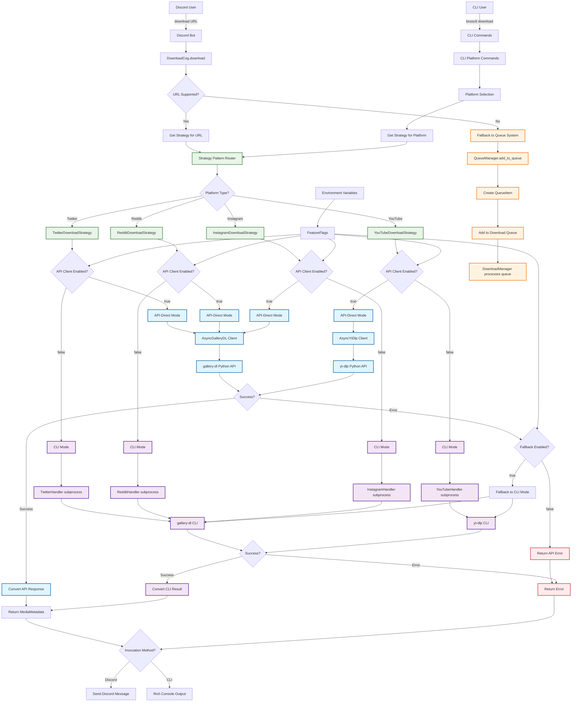

# Download System: gallery-dl and yt-dlp Integration

Boss-Bot supports three distinct ways of invoking gallery-dl and yt-dlp for media downloads. This document explains each approach, when to use them, and how they're implemented.

## Overview

The download system uses a **strategy pattern** that allows switching between different invocation methods based on feature flags. This provides flexibility, backward compatibility, and graceful fallback mechanisms.

### Supported Invocation Methods

1. **Direct API Usage** (Experimental) - Direct Python API integration
2. **CLI/Subprocess Calls** (Stable) - Traditional command-line invocation
3. **Strategy Pattern** (Hybrid) - Feature flag-controlled switching with fallback

## 1. Direct API Usage (Experimental)

**When to use:** When you need fine-grained control, better error handling, and async integration.

**Status:** Experimental - enabled via feature flags per platform.

### Gallery-dl API Integration

**Location:** `src/boss_bot/core/downloads/clients/aio_gallery_dl.py`

```python
import gallery_dl
from gallery_dl import config as gdl_config, extractor, job

class AioGalleryDl:
    async def extract_metadata(self, url: str):
        def _extract_metadata_sync():
            # Load configuration
            gdl_config.clear()
            gdl_config.load(files=config_files)

            # Find and create extractor
            extr = extractor.find(url)

            # Extract metadata
            for msg in extr:
                if msg[0] == "url":
                    yield msg[1]  # URL info

        return await loop.run_in_executor(self._executor, _extract_metadata_sync)
```

**Benefits:**
- Direct access to Python objects and data structures
- Better error handling and exception propagation
- No subprocess overhead
- Async/await integration with proper thread pool execution

### yt-dlp API Integration

**Location:** `src/boss_bot/core/downloads/clients/aio_yt_dlp.py`

```python
import yt_dlp

class AioYtDlp:
    def _setup_yt_dlp(self):
        options = {
            "format": "best[height<=720]",
            "writeinfojson": True,
            "writedescription": True,
            "writethumbnail": True,
            "noplaylist": True,
            "retries": 3,
        }
        self._yt_dlp = yt_dlp.YoutubeDL(options)

    async def extract_info(self, url: str, download: bool = True):
        result = await loop.run_in_executor(None, self._yt_dlp.extract_info, url, download)
        return result
```

**Benefits:**
- Programmatic access to all yt-dlp features
- Real-time progress callbacks
- Direct metadata access without JSON parsing
- Better resource management

## 2. CLI/Subprocess Calls (Stable)

**When to use:** When you need stability, compatibility, or are working with platforms not yet migrated to API mode.

**Status:** Stable and battle-tested - the default for most operations.

### Gallery-dl CLI Pattern

**Location:** `src/boss_bot/core/downloads/handlers/twitter_handler.py`

```python
def _build_gallery_dl_command(self, url: str, **options):
    cmd = [
        "gallery-dl",
        "--no-mtime",           # Don't set file modification time
        "-v",                   # Verbose output
        "--write-info-json",    # Write metadata to JSON file
        "--write-metadata",     # Write metadata to file
        url,
    ]
    return cmd

# Sync execution
result = subprocess.run(cmd, capture_output=True, text=True, timeout=300)

# Async execution
process = await asyncio.create_subprocess_exec(*cmd, stdout=PIPE, stderr=PIPE)
stdout, stderr = await process.communicate()
```

### yt-dlp CLI Pattern

**Location:** `src/boss_bot/core/downloads/handlers/youtube_handler.py`

```python
def _build_yt_dlp_command(self, url: str, **options):
    cmd = ["yt-dlp"]

    # Quality selection
    quality = options.get("quality", "720p")
    if quality == "720p":
        cmd.extend(["--format", "best[height<=720]"])

    # Metadata options
    cmd.extend([
        "--write-info-json",     # Write video metadata to JSON
        "--write-description",   # Write video description
        "--write-thumbnail",     # Download thumbnail
    ])

    cmd.append(url)
    return cmd
```

**Benefits:**
- Proven stability and reliability
- Full access to all CLI features
- Easy debugging with command-line tools
- Isolated process execution

## 3. Strategy Pattern (Hybrid Approach)

**When to use:** When you want to gradually migrate from CLI to API while maintaining fallback capabilities.

**Status:** Production-ready with comprehensive feature flag control.

### Implementation

**Location:** `src/boss_bot/core/downloads/strategies/twitter_strategy.py`

```python
class TwitterDownloadStrategy:
    async def download(self, url: str, **kwargs):
        # Feature flag: choose implementation
        if self.feature_flags.use_api_twitter:
            try:
                return await self._download_via_api(url, **kwargs)
            except Exception as e:
                if self.feature_flags.api_fallback_to_cli:
                    logger.warning(f"API download failed, falling back to CLI: {e}")
                    return await self._download_via_cli(url, **kwargs)
                raise
        else:
            return await self._download_via_cli(url, **kwargs)

    async def _download_via_api(self, url: str, **kwargs):
        async with self.api_client as client:
            results = []
            async for item in client.download(url, **kwargs):
                results.append(item)
            return self._convert_api_response_to_metadata(results[0], url)

    async def _download_via_cli(self, url: str, **kwargs):
        loop = asyncio.get_event_loop()
        download_result = await loop.run_in_executor(None, self.cli_handler.download, url, **kwargs)
        return self._convert_download_result_to_metadata(download_result, url)
```

## Feature Flag Configuration

Control which invocation method is used via environment variables:

```bash
# Enable API-direct mode per platform
export TWITTER_USE_API_CLIENT=true          # Twitter/X API mode
export REDDIT_USE_API_CLIENT=true           # Reddit API mode
export INSTAGRAM_USE_API_CLIENT=true        # Instagram API mode
export YOUTUBE_USE_API_CLIENT=true          # YouTube API mode

# Fallback control
export DOWNLOAD_API_FALLBACK_TO_CLI=true    # Auto-fallback on API errors
```

## Platform Support Status

| Platform | CLI Support | API Support | Strategy Pattern |
|----------|-------------|-------------|------------------|
| Twitter/X | ✅ Stable | ✅ Experimental | ✅ Complete |
| Reddit | ✅ Stable | ✅ Experimental | ✅ Complete |
| Instagram | ✅ Stable | ✅ Experimental | ✅ Complete |
| YouTube | ✅ Stable | ✅ Experimental | ✅ Complete |

## Base Handler Pattern

**Location:** `src/boss_bot/core/downloads/handlers/base_handler.py`

All download handlers inherit from a base class that provides shared subprocess utilities:

```python
class BaseDownloadHandler:
    def _run_command(self, cmd: list[str], cwd: Path | None = None) -> DownloadResult:
        try:
            result = subprocess.run(
                cmd,
                cwd=cwd or self.download_dir,
                capture_output=True,
                text=True,
                timeout=300,  # 5 minute timeout
            )

            return DownloadResult(
                success=result.returncode == 0,
                stdout=result.stdout,
                stderr=result.stderr,
                return_code=result.returncode,
                error=result.stderr if result.returncode != 0 else None,
            )
        except subprocess.TimeoutExpired as e:
            return DownloadResult(success=False, error=f"Command timed out: {' '.join(cmd)}")

    async def _arun_command(self, cmd: list[str], cwd: Path | None = None) -> DownloadResult:
        # Async version of command execution
        # ... implementation details
```

## Configuration Patterns

### Gallery-dl Configuration

```python
from gallery_dl import config as gdl_config

# Load configuration files
gdl_config.clear()
gdl_config.load(files=config_files)

# Merge instance config
if self.config:
    from gallery_dl import util
    util.combine_dict(gdl_config._config, self.config)
```

### yt-dlp Configuration

```python
options = {
    "format": "best[height<=720]",
    "writeinfojson": True,
    "writedescription": True,
    "writethumbnail": True,
    "noplaylist": True,
    "retries": 3,
    "outtmpl": str(output_dir / "%(uploader)s/%(title)s.%(ext)s")
}
self._yt_dlp = yt_dlp.YoutubeDL(options)
```

## Error Handling and Fallback

The strategy pattern includes comprehensive error handling:

1. **API First**: Attempts API-based download when enabled
2. **Automatic Fallback**: Falls back to CLI on API errors (if enabled)
3. **Error Propagation**: Provides detailed error information for debugging
4. **Timeout Handling**: Prevents hanging operations with configurable timeouts

## Usage in Discord Bot

Discord commands automatically use the strategy pattern:

```
# Discord commands (uses strategy pattern automatically)
$download https://twitter.com/user/status/123456789
$info https://reddit.com/r/pics/comments/abc123/title/

# Shows current strategy configuration
$strategies
```

## Usage in CLI

CLI commands also leverage the strategy pattern:

```bash
# Uses configured strategy for each platform
bossctl download twitter https://twitter.com/user/status/123456789
bossctl download reddit https://reddit.com/r/pics/comments/abc123/title/

# Show current strategy configuration
bossctl download strategies
```

## Download System Architecture

The following diagram illustrates how to invoke each downloader and the complete flow from user interaction to final output:



### Architecture Key Features

- **Dual Entry Points**: Both Discord commands and CLI commands lead to the same strategy pattern
- **Platform-Specific Strategies**: Each platform (Twitter, Reddit, Instagram, YouTube) has its own strategy implementation
- **Feature Flag Control**: Environment variables determine whether to use API-direct or CLI modes
- **Automatic Fallback**: API failures can automatically fall back to CLI when `DOWNLOAD_API_FALLBACK_TO_CLI=true`
- **Queue System Fallback**: Unsupported URLs fall back to the legacy queue-based download system
- **Unified Output**: Both Discord and CLI provide structured output using the same MediaMetadata format

## Best Practices

1. **Start with CLI**: Use CLI mode for production until API mode is well-tested
2. **Enable Fallback**: Always enable `DOWNLOAD_API_FALLBACK_TO_CLI=true` during transition
3. **Monitor Logs**: Watch for fallback events in logs to identify API issues
4. **Platform-Specific**: Enable API mode per platform based on testing results
5. **Gradual Migration**: Roll out API mode gradually, starting with less critical platforms

## Troubleshooting

### Common Issues

1. **API Import Errors**: Ensure gallery-dl and yt-dlp are installed with API dependencies
2. **Timeout Issues**: Adjust timeout values in base handler if downloads fail
3. **Configuration Conflicts**: Check that API and CLI configurations don't conflict
4. **Feature Flag Issues**: Verify environment variables are properly set

### Debug Commands

```bash
# Check current strategy status
bossctl download strategies

# Test specific platform with verbose output
bossctl download twitter <url> --verbose

# Force CLI mode temporarily
TWITTER_USE_API_CLIENT=false bossctl download twitter <url>
```

## Future Enhancements

- **Progress Callbacks**: Real-time download progress via API mode
- **Batch Operations**: Optimized bulk downloads using API integration
- **Advanced Configuration**: Per-URL configuration overrides
- **Performance Metrics**: Comparative performance tracking between modes
