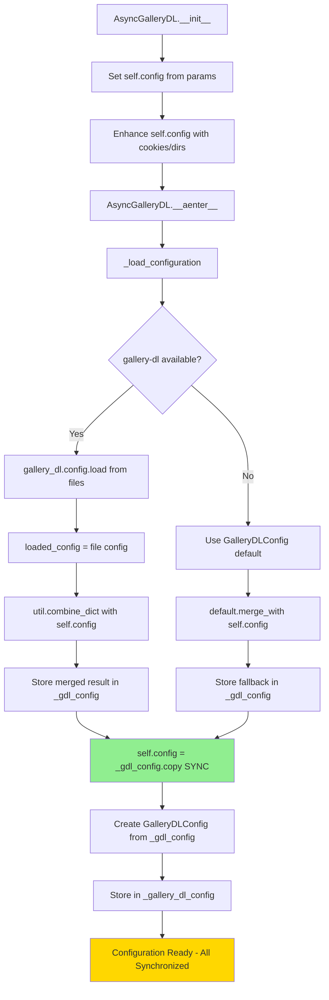

# Download Client Configuration

## AsyncGalleryDL Configuration Attributes

The `AsyncGalleryDL` class in `src/boss_bot/core/downloads/clients/aio_gallery_dl.py` uses three different configuration attributes that serve distinct purposes:

### `self.config` (Instance Configuration)

**Type**: `dict[str, Any]`
**Purpose**: User-provided configuration that starts as overrides, then becomes the final merged configuration

**Key Characteristics**:
- **Source**: Initially passed to `__init__()` constructor or set via initialization parameters
- **Content**: **Lifecycle**: Raw user config → enhanced with cookies/dirs → **updated to final merged config**
- **Initialization**: Set during object creation and enhanced with cookies/download settings
- **Priority**: **Highest priority during merging** - overrides all file-based configuration sources
- **Final State**: **Updated to contain the complete merged configuration** after `_load_configuration()`
- **Mutability**: Modified during initialization, then updated with final merged result

**Lifecycle Process**:
```python
# 1. Set in __init__
self.config = config or {}

# 2. Enhanced with runtime settings
if cookies_file:
    self.config.setdefault("extractor", {})["cookies"] = str(cookies_file)
elif cookies_from_browser:
    self.config.setdefault("extractor", {})["cookies-from-browser"] = cookies_from_browser

if download_dir:
    self.config.setdefault("extractor", {})["base-directory"] = str(download_dir)

# Additional kwargs merged in
if kwargs:
    self.config.update(kwargs)

# 3. After _load_configuration() - UPDATED with final merged result
self.config = self._gdl_config.copy()  # Now contains file config + original overrides
```

### `_gdl_config` (Native Gallery-DL Configuration)

**Type**: `dict[str, Any]`
**Purpose**: Stores the raw configuration dictionary loaded directly from gallery-dl's native configuration system

**Key Characteristics**:
- **Source**: Loaded using `gallery_dl.config.load()` - gallery-dl's built-in configuration loader
- **Content**: **Final merged configuration** - combination of file config + `self.config` overrides
- **Loading Process**:
  1. Uses `gallery_dl.config.clear()` to ensure clean state
  2. Loads from gallery-dl config file locations (e.g., `~/.gallery-dl.conf`)
  3. **Crucially**: Merges with `self.config` using `gallery_dl.util.combine_dict()` for final result
- **Thread Safety**: Copied and used in thread pool operations for isolation
- **Priority**: **Final effective configuration** used for all gallery-dl operations

**Actual Loading and Merging**:
```python
# Load from file
gdl_config.load(files=config_files)
loaded_config = gdl_config._config.copy() if gdl_config._config else {}

# Merge with instance config (self.config has highest priority)
if self.config:
    from gallery_dl import util
    util.combine_dict(loaded_config, self.config)  # self.config overrides file config

return loaded_config  # This becomes _gdl_config
```

**Fallback Behavior**:
```python
# If gallery-dl import fails or config loading fails
default_config = GalleryDLConfig()
if self.config:
    default_config = default_config.merge_with(self.config)
return default_config.to_dict()
```

### `_gallery_dl_config` (Pydantic Validation Wrapper)

**Type**: `GalleryDLConfig | None`
**Purpose**: Provides validation and type safety through Pydantic model wrapper

**Key Characteristics**:
- **Source**: Created from `_gdl_config` using `GalleryDLConfig.from_dict()`
- **Content**: Validated Pydantic model with type checking and defaults
- **Validation**: Ensures configuration structure is valid and provides safe defaults
- **Usage**: Used for validation/compatibility checks and as fallback
- **Creation**: Built after `_gdl_config` is successfully loaded

**Creation Process**:
```python
try:
    self._gallery_dl_config = (
        GalleryDLConfig.from_dict(self._gdl_config) if self._gdl_config else GalleryDLConfig()
    )
except Exception as e:
    logger.warning(f"Could not validate config with GalleryDLConfig: {e}")
    self._gallery_dl_config = GalleryDLConfig()
```

## Configuration Flow and Hierarchy

### Configuration Merging Flow
The configuration system works in layers, with `self.config` serving dual roles:

```
1. gallery-dl config files (base configuration)
   ↓
2. self.config (overrides - highest priority during merge)
   ↓
3. _gdl_config (final merged result: file + self.config)
   ↓
4. self.config ← _gdl_config.copy() (updated to final state)
   ↓
5. _gallery_dl_config (validation wrapper around _gdl_config)
```

**Key Change**: After configuration loading, `self.config` is updated to contain the final merged configuration, making it equivalent to `_gdl_config`.

### Retrieval Priority in `_get_effective_config()`
When the system needs to get the effective configuration, it follows this fallback order:

1. **`_gdl_config`** (Primary Choice)
   - Final merged configuration (file config + original `self.config`)
   - Most compatible with gallery-dl operations
   - Used when gallery-dl is available and config loaded successfully

2. **`_gallery_dl_config.to_dict()`** (Secondary Fallback)
   - Pydantic-validated configuration converted to dictionary
   - Used when `_gdl_config` is not available but validation succeeded

3. **`self.config`** (Final Fallback)
   - **Note**: After successful loading, `self.config` equals `_gdl_config`
   - Used only when both other configs failed to load
   - In practice, this means all three sources now contain the same data after initialization

```python
def _get_effective_config(self) -> dict[str, Any]:
    """Get the effective configuration dictionary."""
    # Return the gallery-dl native config if available
    if self._gdl_config:
        return self._gdl_config
    # Fallback to GalleryDLConfig if available
    elif self._gallery_dl_config:
        return self._gallery_dl_config.to_dict()
    # Final fallback to instance config
    return self.config
```

## When Each Configuration is Used

### `self.config` Usage
- **Initialization**: Set during object creation with user preferences
- **Enhancement**: Modified to add cookies, download directory, and kwargs
- **Override Source**: Highest priority values that override any file-based configuration
- **Merging Input**: Original values used as input to `util.combine_dict()` for final configuration creation
- **Final State**: **Updated to contain the complete merged configuration** after loading
- **Runtime Access**: Now equivalent to `_gdl_config` and can be used directly for configuration queries

### `_gdl_config` Usage
- **Primary**: All gallery-dl operations (metadata extraction, downloads)
- **Thread Operations**: Copied for thread-safe gallery-dl API calls
- **Final Configuration**: Contains merged result of file config + `self.config` overrides
- **Runtime Merging**: Combined with operation-specific options before each API call

### `_gallery_dl_config` Usage
- **Validation**: Ensures configuration structure is valid
- **Fallback**: When native gallery-dl config is unavailable
- **Type Safety**: Provides Pydantic model benefits for development
- **Development**: Better IDE support and type hints during development

## Configuration Loading Flow



## Benefits of Triple Configuration Approach

1. **User Control**: `self.config` provides highest-priority user overrides for any setting
2. **Native Compatibility**: `_gdl_config` ensures maximum compatibility with gallery-dl's native behavior
3. **Type Safety**: `_gallery_dl_config` provides validation and type safety through Pydantic
4. **Layered Merging**: Configuration properly merges from files → user overrides → final result
5. **Fallback Safety**: Multiple fallback layers prevent configuration failures
6. **Thread Safety**: Configuration is properly isolated in thread pool operations
7. **Development Experience**: Pydantic model provides better IDE support and type hints
8. **Runtime Flexibility**: `self.config` can be enhanced with cookies, directories, and options during initialization

## Key Insight: Configuration Synchronization

**After Recent Changes**: The configuration system now maintains synchronization between all three attributes:

- **`self.config` starts with HIGHEST priority** during configuration loading (overrides file config)
- **`_gdl_config` contains the MERGED result** (file config + original `self.config`)
- **`self.config` gets UPDATED** to match `_gdl_config` after successful loading
- **Result**: `self.config` and `_gdl_config` are equivalent after initialization

### Benefits of This Approach:
1. **Consistency**: `self.config` always reflects the current effective configuration
2. **Backward Compatibility**: Code that accesses `self.config` gets the correct merged configuration
3. **Transparency**: No confusion about which configuration source to use
4. **Debugging**: `self.config` can be inspected to see the final effective configuration

This synchronized approach balances user control, gallery-dl compatibility, and modern Python development practices with robust error handling and configuration transparency.
