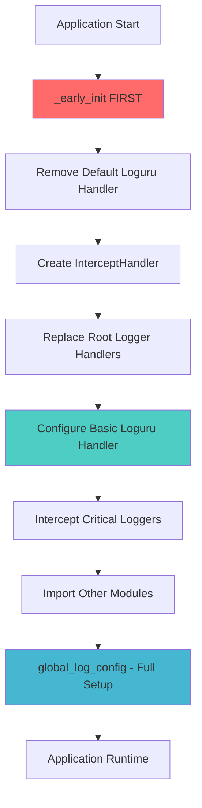

# Loguru Thread-Safe Interceptor Setup Guide

## 🎯 Overview

This guide provides comprehensive instructions for setting up **thread-safe, async-safe, and multiprocessing-safe** logging using Loguru with standard library logging interception. The implementation ensures that **all** logging calls from any library are captured and handled safely in concurrent environments.

---

## 🚨 Critical Concepts

### Why Early Initialization Matters

Most Python libraries call `logging.getLogger()` during their **import process**. If your interceptor isn't configured first:

- ❌ **Missing logs**: Library logs won't be intercepted
- ❌ **Race conditions**: Threading conflicts during import
- ❌ **Configuration conflicts**: Libraries may set up incompatible handlers
- ❌ **Partial coverage**: Some loggers escape interception

### Thread Safety Requirements

Standard Python logging has several thread safety limitations:

- **File corruption** in multiprocessing without proper queuing
- **Deadlocks** when logging from signal handlers or destructors
- **Lost messages** during concurrent writes
- **Inconsistent formatting** across threads

---

## 🏗️ Architecture Overview



---

## 🔧 Implementation Components

### 1. Early Initialization Function

**File**: `my_intercept_logger.py`

```python
def _early_init() -> None:
    """
    Early initialization of logging system - call BEFORE importing other modules.

    This ensures all logging calls are intercepted from the start and prevents
    race conditions with threaded imports or configuration conflicts.
    """
    global _early_init_done

    if _early_init_done:
        return  # Already initialized

    # Remove default loguru handler immediately
    logger.remove()

    # Create thread-safe InterceptHandler early
    intercept_handler = InterceptHandler()

    # Set up basic root logging level
    logging.root.setLevel(logging.DEBUG)

    # Replace root handler immediately
    logging.root.handlers = [intercept_handler]

    # Configure basic loguru handler with safety features
    logger.add(
        sys.stderr,
        level="INFO",
        format="<green>{time:YYYY-MM-DD HH:mm:ss.SSS}</green> | "
               "<level>{level: <8}</level> | "
               "<cyan>{name}</cyan>:<cyan>{function}</cyan>:<cyan>{line}</cyan> - "
               "<level>{message}</level>",
        enqueue=True,   # Critical for thread/multiprocessing safety
        catch=True,     # Prevent logging errors from crashing app
        backtrace=True,
        diagnose=True
    )

    # Immediately intercept common problematic loggers
    critical_loggers = [
        "asyncio", "concurrent.futures", "multiprocessing",
        "threading", "urllib3", "requests", "httpx", "aiohttp",
        "discord", "discord.client", "discord.gateway", "discord.http"
    ]

    for logger_name in critical_loggers:
        log_instance = logging.getLogger(logger_name)
        log_instance.handlers = [intercept_handler]
        log_instance.propagate = False

    _early_init_done = True
```

### 2. Thread-Safe InterceptHandler

```python
class InterceptHandler(logging.Handler):
    """
    Thread-safe and async-safe interceptor for standard logging into Loguru.

    This implementation ensures proper thread safety and multiprocessing compatibility
    by using improved frame inspection and avoiding potential deadlocks.
    """

    def emit(self, record: logging.LogRecord) -> None:
        """Thread-safe emit method that properly handles frame inspection."""
        # Get corresponding Loguru level if it exists
        try:
            level = loguru.logger.level(record.levelname).name
        except ValueError:
            level = record.levelno

        # Improved frame inspection to avoid issues with frozen imports and threading
        frame, depth = inspect.currentframe(), 0
        while frame:
            filename = frame.f_code.co_filename
            # Check for logging module and frozen/bootstrap code
            is_logging = filename == logging.__file__
            is_frozen = "importlib" in filename and "_bootstrap" in filename
            if depth > 0 and not (is_logging or is_frozen):
                break
            frame = frame.f_back
            depth += 1

        # Use opt() with proper depth and exception info for thread-safe logging
        loguru.logger.opt(depth=depth, exception=record.exc_info).log(
            level,
            record.getMessage(),
        )
```

### 3. Full Configuration Function

```python
def global_log_config(log_level: Union[str, int] = logging.DEBUG, json: bool = False) -> _Logger:
    """Configure global logging settings with thread and async safety."""

    # Create thread-safe intercept handler
    intercept_handler = InterceptHandler()

    # Set root logging level
    logging.root.setLevel(log_level)

    # Replace handlers for all existing loggers
    for name in logging.root.manager.loggerDict.keys():
        log_instance = logging.getLogger(name)
        log_instance.handlers = [intercept_handler]
        log_instance.propagate = False

    # Configure loguru with thread/async/multiprocessing safety
    logger.configure(
        handlers=[
            {
                "sink": stdout,
                "serialize": json,
                "format": format_record,
                "diagnose": True,
                "backtrace": True,
                "enqueue": True,      # CRITICAL: Enable enqueue for thread/multiprocessing safety
                "catch": True,        # Catch exceptions to prevent app crashes
            }
        ],
    )

    return logger
```

---

## 🚀 Usage Patterns

### ✅ Correct Implementation Order

```python
# main.py or boss-bot application entry point
from boss_bot.monitoring.logging import early_init

# 🔥 STEP 1: Call early_init() FIRST - before ANY other imports
early_init()

# 🔥 STEP 2: Now safe to import other modules
import discord
import asyncio
import requests
import aiohttp
import gallery_dl
import yt_dlp
# ... all other imports that use logging

# 🔥 STEP 3: Configure full logging features after imports
from boss_bot.monitoring.logging import setup_boss_bot_logging
from boss_bot.core.env import BossSettings

# Initialize boss-bot settings
settings = BossSettings()

# Configure logging with boss-bot integration
logger = setup_boss_bot_logging(settings)

# 🔥 STEP 4: Your boss-bot application code
async def main():
    logger.info("Boss-bot starting...")
    # Your boss-bot code here
```

### ❌ Incorrect Implementation Order

```python
# ❌ WRONG: Importing modules before early init
import discord        # ❌ This sets up its own logging first
import asyncio        # ❌ This may use logging during import
import requests       # ❌ This configures urllib3 logging
import gallery_dl     # ❌ This may configure its own logging
import yt_dlp        # ❌ This configures its own logging

# ❌ TOO LATE: Interceptor misses early logging calls
from boss_bot.monitoring.logging import early_init
early_init()         # ❌ Already missed discord's and other libraries' logging setup
```

---

## 🛡️ Safety Features Explained

### 1. `enqueue=True` - Multiprocessing Safety

**What it does:**
- Routes log messages through a `multiprocessing.SimpleQueue()`
- Prevents file corruption when multiple processes write to the same log file
- Makes logging calls non-blocking
- Uses dedicated worker thread for I/O operations

**When to use:**
- ✅ **Always** for production applications
- ✅ **Always** when using multiprocessing
- ✅ **Always** for file sinks in concurrent environments

```python
logger.add(
    "app.log",
    enqueue=True,    # ← Prevents multiprocessing file corruption
    rotation="10 MB"
)
```

### 2. `catch=True` - Exception Safety

**What it does:**
- Catches exceptions that occur within the logging system itself
- Prevents logging errors from crashing your application
- Displays error messages on stderr instead of propagating

**Example:**
```python
logger.add(
    broken_sink,     # Sink that might fail
    catch=True       # ← App continues running even if logging fails
)
```

### 3. `propagate=False` - Duplicate Prevention

**What it does:**
- Prevents intercepted loggers from sending messages to parent loggers
- Avoids duplicate log entries
- Ensures clean single-path message flow

```python
discord_logger = logging.getLogger("discord")
discord_logger.handlers = [intercept_handler]
discord_logger.propagate = False  # ← Prevents duplicates
```

### 4. Frame Inspection Safety

**Problem with naive approach:**
```python
# ❌ UNSAFE: Can fail with frozen/threaded imports
frame = logging.currentframe()
while frame.f_code.co_filename == logging.__file__:
    frame = frame.f_back
```

**Safe approach:**
```python
# ✅ SAFE: Handles frozen imports and threading
frame, depth = inspect.currentframe(), 0
while frame:
    filename = frame.f_code.co_filename
    is_logging = filename == logging.__file__
    is_frozen = "importlib" in filename and "_bootstrap" in filename
    if depth > 0 and not (is_logging or is_frozen):
        break
    frame = frame.f_back
    depth += 1
```

---

## 🧪 Testing and Validation

### Thread Safety Test

```python
def test_thread_safety():
    """Verify logging works correctly across multiple threads."""
    import threading
    import time

    def worker_thread(thread_id: int):
        for i in range(10):
            logger.info(f"Thread {thread_id}: Message {i}")
            time.sleep(0.01)

    # Start multiple threads
    threads = []
    for i in range(5):
        thread = threading.Thread(target=worker_thread, args=(i,))
        threads.append(thread)
        thread.start()

    # Wait for completion
    for thread in threads:
        thread.join()

    logger.success("Thread safety test passed!")
```

### Multiprocessing Test

```python
def test_multiprocessing():
    """Verify logging works correctly across multiple processes."""
    import multiprocessing

    def worker_process(process_id: int):
        # Each process needs its own logger setup
        logger.add(
            "multiprocess.log",
            enqueue=True,    # ← Critical for multiprocessing
            format="{time} | PID:{process} | {level} | {message}"
        )

        for i in range(10):
            logger.info(f"Process {process_id}: Message {i}")

    processes = []
    for i in range(3):
        p = multiprocessing.Process(target=worker_process, args=(i,))
        processes.append(p)
        p.start()

    for p in processes:
        p.join()
```

### Async/Await Test

```python
async def test_async_logging():
    """Verify logging works correctly in async environments."""
    import asyncio

    async def async_worker(worker_id: int):
        for i in range(10):
            logger.info(f"Async Worker {worker_id}: Message {i}")
            await asyncio.sleep(0.01)

    # Run multiple async workers concurrently
    tasks = [async_worker(i) for i in range(5)]
    await asyncio.gather(*tasks)

    logger.success("Async logging test passed!")

# Usage
asyncio.run(test_async_logging())
```

---

## 🔧 Advanced Configuration

### Production File Logging Setup

```python
def setup_production_logging():
    """Production-ready logging configuration."""

    # Console logging - structured for monitoring
    logger.add(
        sys.stderr,
        level="INFO",
        format="<green>{time:YYYY-MM-DD HH:mm:ss.SSS}</green> | "
               "<level>{level: <8}</level> | "
               "<cyan>{name}</cyan>:<cyan>{function}</cyan>:<cyan>{line}</cyan> | "
               "<level>{message}</level>",
        enqueue=True,
        catch=True,
        diagnose=False,  # ← Disable in production for security
        backtrace=False  # ← Disable in production for security
    )

    # File logging - detailed for debugging
    logger.add(
        "logs/app_{time:YYYY-MM-DD}.log",
        level="DEBUG",
        format="{time:YYYY-MM-DD HH:mm:ss.SSS} | {level: <8} | "
               "{name}:{function}:{line} | {extra} | {message}",
        rotation="00:00",      # ← New file daily
        retention="30 days",   # ← Keep 30 days
        compression="gz",      # ← Compress old files
        enqueue=True,          # ← Multiprocessing safe
        catch=True,
        diagnose=True,         # ← Enable for file logs
        backtrace=True
    )

    # Error-only file for monitoring alerts
    logger.add(
        "logs/errors_{time:YYYY-MM-DD}.log",
        level="ERROR",
        format="{time:YYYY-MM-DD HH:mm:ss.SSS} | {level} | "
               "{name}:{function}:{line} | {message} | {exception}",
        rotation="100 MB",
        retention="90 days",
        enqueue=True,
        catch=True,
        backtrace=True,
        diagnose=True
    )
```

### JSON Structured Logging

```python
def setup_json_logging():
    """JSON structured logging for log aggregation systems."""

    def json_formatter(record):
        """Custom JSON formatter with structured data."""
        return json.dumps({
            "timestamp": record["time"].isoformat(),
            "level": record["level"].name,
            "logger": record["name"],
            "function": record["function"],
            "line": record["line"],
            "message": record["message"],
            "module": record["module"],
            "process": record["process"].id,
            "thread": record["thread"].id,
            "extra": record["extra"]
        })

    logger.add(
        "logs/structured.jsonl",
        format=json_formatter,
        level="INFO",
        enqueue=True,
        catch=True,
        serialize=False  # ← We handle JSON ourselves
    )
```

### Context-Aware Logging

```python
import contextvars

# Context variables for request tracking
request_id_var = contextvars.ContextVar('request_id', default='no-request')
user_id_var = contextvars.ContextVar('user_id', default='anonymous')

def context_formatter(record):
    """Add context variables to log records."""
    record["extra"]["request_id"] = request_id_var.get()
    record["extra"]["user_id"] = user_id_var.get()
    return (
        "<green>{time:YYYY-MM-DD HH:mm:ss.SSS}</green> | "
        "<level>{level: <8}</level> | "
        "REQ:{extra[request_id]} | USER:{extra[user_id]} | "
        "<cyan>{name}</cyan>:<cyan>{function}</cyan>:<cyan>{line}</cyan> | "
        "<level>{message}</level>"
    )

# Usage in boss-bot Discord command handlers
async def handle_discord_command(ctx):
    request_id_var.set(f"cmd-{uuid.uuid4().hex[:8]}")
    user_id_var.set(ctx.author.id)

    logger.info("Processing Discord command")  # Automatically includes context

# Usage in boss-bot download operations
async def handle_download(url: str, user_id: int, guild_id: int):
    request_id_var.set(f"dl-{uuid.uuid4().hex[:8]}")
    user_id_var.set(user_id)

    # Add boss-bot specific context
    bound_logger = logger.bind(
        guild_id=guild_id,
        download_url=url,
        component="download_manager"
    )
    bound_logger.info("Starting download operation")
```

---

## 🚨 Common Pitfalls and Solutions

### Problem 1: Import Order Issues

**Symptom:** Some logs from libraries don't appear in Loguru

**Cause:** Library imported before `_early_init()` was called

**Solution:**
```python
# ✅ Move early_init() to the very top
from boss_bot.monitoring.logging import early_init
early_init()  # Must be first

# Then import everything else
import discord
import gallery_dl
import yt_dlp
import langchain
# ... other boss-bot dependencies
```

### Problem 2: Multiprocessing File Corruption

**Symptom:** Garbled text in log files when using multiprocessing

**Cause:** Multiple processes writing to same file without coordination

**Solution:**
```python
# ✅ Always use enqueue=True for file sinks
logger.add("shared.log", enqueue=True)

# ✅ Or use separate files per process
logger.add(f"process_{os.getpid()}.log")
```

### Problem 3: Logging in Signal Handlers

**Symptom:** Deadlocks when logging from signal handlers

**Cause:** Signal handlers interrupt normal execution flow

**Solution:**
```python
# ✅ Use enqueue=True to make logging non-blocking
logger.add(sys.stderr, enqueue=True, catch=True)

def signal_handler(signum, frame):
    logger.warning(f"Received signal {signum}")  # Safe with enqueue=True
```

### Problem 4: Memory Leaks in Long-Running Applications

**Symptom:** Memory usage grows over time

**Cause:** Not calling `logger.complete()` before shutdown

**Solution:**
```python
import atexit

def cleanup_logging():
    logger.info("Shutting down logging...")
    logger.complete()  # ← Flush all queued messages

atexit.register(cleanup_logging)
```

### Problem 5: Lost Exception Context

**Symptom:** Exception tracebacks don't show variable values

**Cause:** `diagnose=False` or production security settings

**Solution:**
```python
# ✅ Development: Enable full diagnostics
logger.add("debug.log", diagnose=True, backtrace=True)

# ✅ Production: Separate diagnostic file with restricted access
logger.add(
    "debug.log",
    diagnose=True,
    backtrace=True,
    level="ERROR",  # Only for errors
    # Set file permissions to 600 (owner only)
)
```

---

## 📋 Checklist for Implementation

### Pre-Implementation ✅

- [ ] Understand your application's import structure
- [ ] Identify all libraries that use logging
- [ ] Plan early initialization call placement
- [ ] Consider multiprocessing requirements

### Implementation ✅

- [ ] Add `_early_init()` function to logging module
- [ ] Update `InterceptHandler` with thread-safe frame inspection
- [ ] Add `enqueue=True` to all handlers
- [ ] Set `propagate=False` on intercepted loggers
- [ ] Configure `catch=True` for error resilience

### Testing ✅

- [ ] Test thread safety with concurrent logging
- [ ] Test multiprocessing with shared log files
- [ ] Test async/await logging patterns
- [ ] Test exception handling and formatting
- [ ] Test early initialization order

### Production Deployment ✅

- [ ] Disable `diagnose=True` for security (except debug files)
- [ ] Set up log rotation and retention policies
- [ ] Configure monitoring/alerting on error logs
- [ ] Test graceful shutdown with `logger.complete()`
- [ ] Monitor memory usage in long-running processes

---

## 📚 Additional Resources

### Loguru Documentation
- [Official Loguru Documentation](https://loguru.readthedocs.io/)
- [Recipes and Examples](https://loguru.readthedocs.io/en/stable/resources/recipes.html)
- [API Reference](https://loguru.readthedocs.io/en/stable/api.html)

### Thread Safety References
- [Python Logging Thread Safety](https://docs.python.org/3/library/logging.html#thread-safety)
- [Multiprocessing Logging Best Practices](https://docs.python.org/3/howto/logging-cookbook.html#logging-to-a-single-file-from-multiple-processes)

### Performance Considerations
- [Loguru Performance Tips](https://loguru.readthedocs.io/en/stable/resources/migration.html#performances)
- [Async Logging Patterns](https://loguru.readthedocs.io/en/stable/resources/recipes.html#logging-asynchronous-messages)

---

## 🎯 Summary

This logging setup provides:

- ✅ **Complete interception** of all standard library logging calls
- ✅ **Thread safety** for concurrent environments
- ✅ **Multiprocessing safety** with enqueue-based message passing
- ✅ **Async/await compatibility** for modern Python applications
- ✅ **Production-ready** error handling and recovery
- ✅ **Early initialization** to capture all logs from import time
- ✅ **Zero-deadlock** design with non-blocking operations

The key insight is that **timing matters**: call `_early_init()` before importing any modules that use logging, and your application will have bulletproof, thread-safe logging from the very first line of code execution.
