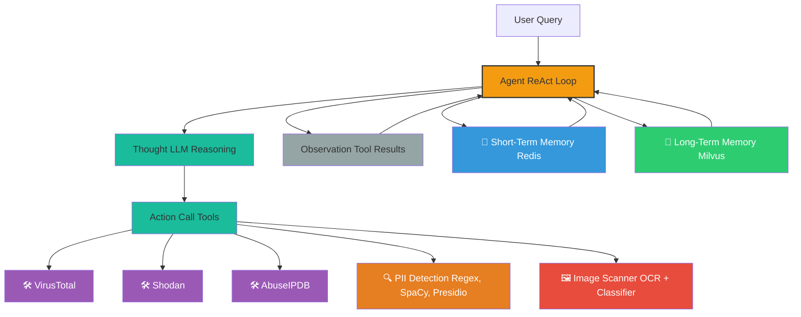
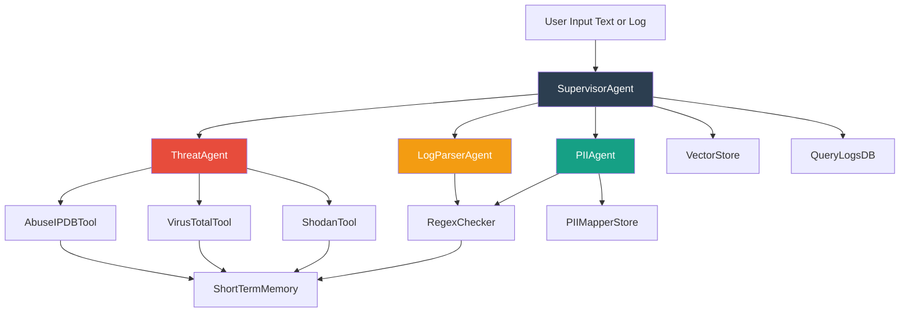

# 🛡️ CyberShield AI System — Project Plan

## 📘 Executive Summary

CyberShield is a modular, AI-powered multi-agent system designed to automate complex cybersecurity tasks such as:

- IP/domain threat assessment
- PII redaction (text/image)
- Image-based risk detection

It uses agentic reasoning via the ReAct framework (Reason + Act) and integrates tools like Shodan, VirusTotal, AbuseIPDB alongside LLMs, NLP, and Vision AI.

**LLMs:** Azure GPT-4o, AWS Bedrock Claude
**Outcome:** Scalable, privacy-preserving AI assistant for cybersecurity automation.

## 🧩 Solution Outline

### Core Problem
Security teams manually assess threats & redact sensitive content—slow and error-prone.

### Key Features
- 🧠 Agentic multi-step reasoning (ReAct)
- 🛡️ NLP-based PII redaction (with reversibility)
- 🖼️ Image moderation (nudity/violence)
- 🌐 Real-time intelligence via APIs

### Tools & Technologies
- **NLP:** SpaCy, Regex, Presidio, AWS Comprehend
- **Vision:** OCR + CLIP / YOLOv8
- **Orchestration:** LangChain, CrewAI
- **APIs:** VirusTotal, AbuseIPDB, Shodan
- **Frameworks:** FastAPI, React, Redis, Milvus

## ⚙️ Working Mechanism

### ReAct Loop
1. **Thought** → Reason with LLM
2. **Action** → Trigger external/internal tools
3. **Observation** → Feed result back for next step

### Core Components
- **Agent:** Reasoning & orchestration
- **Planner:** Chain-of-thought, reflection
- **Tools:** APIs, NLP/PII tools, OCR
- **Memory:** Short-Term (chat) & Long-Term (facts)
- **Vision Module:** OCR + classifier

## 🧠 Memory Models

| Feature | Short-Term Memory (STM) | Long-Term Memory (LTM) |
|---------|-------------------------|------------------------|
| **Scope** | Session-based | Persistent |
| **Use Case** | Multi-turn context | Personalization, reuse |
| **Example** | Last API call | Known malicious IPs |
| **Store** | Redis / context | Milvus / S3 |

## 📊 Data Sources & Processing

- **Types:** IPs, domains, hashes, PDFs, images
- **Sources:** Public APIs + Kaggle/DARPA/CICIDS
- **Preprocessing:**
  - **Text:** SpaCy + Regex + normalizers
  - **Image:** Resize, OCR, noise cleaning

## 🔐 Use Cases

| Scenario | Description |
|----------|-------------|
| **SOC Automation** | Log scanning, alert enrichment |
| **Privacy Compliance** | Automated redaction (text/images) |
| **Threat Intelligence** | API-enriched reputation checks |
| **Image Risk Detection** | Screenshot risk scanning |

## 🧪 Feasibility & Challenges

- **Multi-tool Orchestration** → 🧠 Solved by ReAct planning
- **Reversible PII Redaction** → 🔐 Store encrypted mappings
- **Rate Limits** → ⏱ Caching, scheduling
- **Vision Model Accuracy** → 🧠 Pretrained models + OCR fallback

## 📉 Cost Optimization

| Resource | Est. Cost |
|----------|-----------|
| **LLM API** | $200/month (10K queries) |
| **Cloud Infra** | $100–300/month |
| **APIs** | Free tiers + paid scale |

### Tips:
- Use open-source LLMs (Mistral, LLama3)
- Prompt/API caching
- Batch queries

## 🗓️ Timeline & Roles

| Phase | Deliverable | Time |
|-------|-------------|------|
| **1** | API + PII tooling | 2 weeks |
| **2** | ReAct agents | 2 weeks |
| **3** | Vision AI | 1 week |
| **4** | UI (React/Streamlit) | 1.5 weeks |
| **5** | Testing + Launch | 1 week |

### Team:
- NLP Engineer
- Backend Engineer
- ML Engineer
- Frontend Dev
- DevOps

## 🔗 Dependencies

- **Infra:** AWS/Azure, Redis, S3, GPU
- **DBs:** Redis (STM), Milvus (LTM)
- **Libs:** LangChain, LangGraph, Presidio, CLIP, YOLOv8
- **External APIs:** VirusTotal, AbuseIPDB, Shodan

## 🗺️ System Architecture

### Mermaid Diagram — System Architecture



### Updated Multi-Agent Architecture



### Agent Flow Diagram

```
User Input
   ↓
SupervisorAgent
   ├──> PIIAgent (as tool)
   ├──> LogParserAgent (as tool)
   ├──> ThreatAgent (as tool)
   ├──> VectorStore (retrieval)
   └──> QueryLogsDB (audit log)
```


