# Context Extension System Architecture

## System Overview

This system addresses one of the fundamental limitations of Large Language Models (LLMs) - their finite context windows - by implementing a sophisticated three-pronged approach that combines external knowledge retrieval, semantic memory search, and hierarchical summarization. The system enables LLMs to maintain coherent conversations and access relevant information far beyond their native context limitations.

## Core Architecture Strategies

The system operates on three complementary strategies:

1. **External Search RAG** - Real-time web knowledge integration
2. **Memory Search RAG** - Semantic retrieval from conversation history
3. **In-Context Summarization** - Hierarchical compression of conversation context

## Overall System Architecture

This diagram shows how the three strategies work together to extend LLM context capabilities. Each strategy operates independently but contributes to a unified context assembly that feeds into the LLM.

## System Data Models

### Message Data Model

Messages form the atomic unit of conversation, containing:

- **Role**: Participant type (user, assistant, system, tool, agent, observer)
- **Content**: Array of typed content blocks (text, image, tool calls, etc.)
- **Metadata**: Unique ID, creation timestamp, conversation association
- **Optional**: Tool calls and thinking processes

### Summary Data Model

Summaries represent consolidated information with hierarchical levels:

- **Content**: Compressed textual representation
- **Level**: Position in summarization hierarchy (1, 2, 3, master)
- **Source IDs**: Traceable references to original messages/summaries
- **Metadata**: Creation time, conversation association

### Memory Data Model

Memories encapsulate retrievable conversation fragments:

- **Fragments**: Array of role-content pairs with IDs
- **Source**: Origin type (message or summary)
- **Similarity**: Vector search relevance score
- **Metadata**: Creation time, source references

---

## Strategy 1: External Search RAG 🔍

### External Search Purpose

This strategy augments LLM responses with real-time external knowledge, ensuring access to current information and specialized knowledge not present in training data.

### External Search Implementation Flow

This strategy identifies when external knowledge is needed and retrieves relevant web content to augment the LLM's response capabilities.

#### External Search Keyword-Based Trigger

1. **Query Analysis**: The user prompt undergoes keyword extraction
2. **Pattern Matching**: The system identifies search-indicating terms such as temporal indicators ("latest", "current"), information requests ("what is"), and specific domains (company names, recent events)
3. **Search Execution**: If keywords are detected, an immediate web search is initiated

#### External Search LLM-Based Decision Making

1. **Fallback Mechanism**: This is used if no explicit keywords are found
2. **SLM Evaluation**: A Small Language Model analyzes whether external search would enhance response quality
3. **Binary Decision**: The SLM returns an affirmative/negative response for search necessity
4. **Conditional Search**: A search is executed only on an affirmative SLM response

#### External Search Processing

1. **Multi-Engine Support**: Supports Google, DuckDuckGo, or other configured engines
2. **Result Retrieval**: Retrieves a configurable number of results (default: 3)
3. **Content Cleaning**: Involves HTML markup removal and text extraction
4. **Context Integration**: Clean results are appended to the LLM context

### External Search Configuration Parameters

- `search_engines`: List of available search providers
- `max_results`: Maximum search results to include (default: 3)
- `keyword_threshold`: Sensitivity for keyword detection
- `slm_model`: Small model for search decision making

---

## Strategy 2: Memory Search RAG 🧠

### Memory Search Purpose

This strategy provides semantic access to historical conversation data, enabling the LLM to reference relevant past interactions even when they exceed the current context window.

### Memory Search Implementation Flow

This strategy provides semantic access to conversation history through vector embeddings, enabling retrieval of relevant past interactions.

#### Memory Search Embedding Generation

1. **Message Processing**: Every user query and LLM response is converted to embeddings
2. **Model Selection**: A dedicated embedding model (e.g., sentence-transformers) is used
3. **Vector Storage**: Embeddings are stored in a vector database with metadata such as source type, role information, conversation ID, and a creation timestamp

#### Memory Search Semantic Search

1. **Query Embedding**: The current user query is converted to a vector representation
2. **Similarity Search**: The vector database is queried for semantically similar content
3. **Threshold Filtering**: Results are filtered by a configurable similarity threshold (default: 0.7)
4. **Result Ranking**: Results are ordered by similarity score

#### Memory Search Context Pairing Logic

1. **User Message Retrieval**: If a similar user message is found, the corresponding assistant response is paired with it
2. **Assistant Message Retrieval**: If a similar assistant response is found, the preceding user query is paired
3. **Summary Retrieval**: Summaries are returned independently without pairing
4. **Fragment Assembly**: Results are packaged into Memory objects with a fragments array

#### Memory Search Integration

1. **Configurable Retrieval**: The number of memories retrieved is configurable
2. **Context Injection**: Retrieved memories are inserted into the current context
3. **Relevance Scoring**: Memories are ordered by similarity for optimal placement

### Memory Search Configuration Parameters

- `embedding_model`: Model used for vector representations
- `similarity_threshold`: Minimum score for inclusion (default: 0.7)
- `max_memories`: Maximum memories to retrieve (default: 3)
- `context_pairing`: Whether to pair user/assistant messages (default: true)
- `vectordb_connection`: Connection parameters for vector database

---

## Strategy 3: In-Context Summarization 📚

### Summarization Purpose

Maintains conversation coherence while managing context window limitations through hierarchical compression that preserves essential information across multiple abstraction levels.

### Hierarchical Summarization Process

This strategy manages context window limitations through progressive summarization levels, creating a hierarchical compression system that preserves essential information.

```mermaid
flowchart TD
    %% Step 1: Original Messages
    subgraph OriginalMessages["Original Messages"]
        direction LR
        M1[M1] --- M2[M2] --- M3[M3] --- M4[M4] --- M5[M5] --- M6[M6]
        TriggerPoint["n_sum = 6 reached!"] -.- M6
    end
    
    %% Step 2: Level 1 Summarization
    subgraph Level1Process["Level 1 Summarization Process"]
        L1Summary[Level 1 Summary<br>M4+M5+M6] -.-> SummaryStorage1[(Summary in DB)]
    end
    
    %% Step 3: After L1 Summary
    subgraph AfterL1["After Level 1 Summary"]
        direction LR
        AfterL1M1[M1] --- AfterL1M2[M2] --- AfterL1M3[M3] --- S1L1[(S1-L1)] --- M7[M7] --- M8[M8] --- M9[M9]
    end
    
    %% Step 4: More Summaries Accumulate
    subgraph MoreSummaries["More Level 1 Summaries Accumulate"]
        direction LR
        S1L1a[(S1-L1)] --- S2L1[(S2-L1)] --- S3L1[(S3-L1)]
        L2Trigger["n_sum_sum = 3 reached!"] -.- S3L1
    end
    
    %% Step 5: Level 2 Summarization
    subgraph Level2Process["Level 2 Summarization Process"]
        L2Summary[Level 2 Summary<br>S1+S2+S3] -.-> SummaryStorage2[(Summary in DB)]
    end
    
    %% Step 6: After L2 Summary
    subgraph AfterL2["After Level 2 Summary"]
        direction LR
        AfterL2M1[M1] --- AfterL2M2[M2] --- AfterL2M3[M3] --- S1L2[(S1-L2)]
    end
    
    %% Step 7: Level 3 Summary
    subgraph Level3Process["Level 3 Summary & Master"]
        direction LR
        L3Summary[Level 3 Summary<br>max_sum_lvl reached] --> MasterSummary[(Master Summary<br>Ultimate compression)]
    end
    
    %% Step 8: Storage Process
    subgraph StorageProcess["Storage Process"]
        SummaryStorage[(Summary Storage<br>• Database record<br>• Source IDs tracked<br>• Level metadata)] --> VectorStorage[(Vector Storage<br>• Embedding created<br>• Added to memory<br>• Searchable)]
    end
    
    %% Configuration Box
    ConfigBox["Configuration Parameters:<br/>n_sum: 6 (messages before summarization)<br/>sum_window: 3 (messages in each summary)<br/>n_sum_sum: 3 (summaries before next level)<br/>max_sum_lvl: 3 (maximum hierarchy level)<br/>summary_model: SLM/LLM for summarization<br/>summary_length: configurable"]
    
    %% Flow connections
    OriginalMessages --> Level1Process
    Level1Process --> AfterL1
    AfterL1 --> MoreSummaries
    MoreSummaries --> Level2Process
    Level2Process --> AfterL2
    AfterL2 --> Level3Process
    Level3Process --> StorageProcess
    
    %% Style classes
    classDef message fill:#3498db,stroke:#2980b9,stroke-width:2px,color:white,rx:10px
    classDef process fill:#2ecc71,stroke:#27ae60,stroke-width:2px,color:white,rx:10px
    classDef highlight fill:#9b59b6,stroke:#8e44ad,stroke-width:2px,color:white,rx:10px
    classDef database fill:#e74c3c,stroke:#c0392b,stroke-width:2px,color:white,rx:5px
    classDef config fill:#f39c12,stroke:#d68910,stroke-width:2px,color:white,rx:5px
    classDef trigger fill:#f1c40f,stroke:#f39c12,stroke-width:2px,color:black,rx:5px,font-style:italic
    classDef container fill:transparent,stroke:#34495e,stroke-width:2px,color:#34495e,rx:5px
    
    class M1,M2,M3,M4,M5,M6,M7,M8,M9,AfterL1M1,AfterL1M2,AfterL1M3,AfterL2M1,AfterL2M2,AfterL2M3 message;
    class L1Summary,SummaryStorage1,SummaryStorage2 process;
    class L2Summary,L3Summary,VectorStorage highlight;
    class S1L1,S2L1,S3L1,S1L1a,MasterSummary,SummaryStorage database;
    class S1L2 database;
    class ConfigBox config;
    class TriggerPoint,L2Trigger trigger;
    class OriginalMessages,AfterL1,MoreSummaries,AfterL2,Level1Process,Level2Process,Level3Process,StorageProcess container;
```

#### Level 1 Summarization

1. **Trigger Condition**: When context chain reaches `n_sum` messages (default: 6)
2. **Window Selection**: Last `sum_window` messages selected for summarization (default: 3)
3. **Summary Generation**: SLM/LLM creates concise summary of selected messages
4. **Storage Operations**:
   - Summary stored in database with source message IDs
   - Summary converted to embedding for vector search
   - Summary added to vector database as memory
5. **Context Update**: Summary replaces `sum_window` messages in context chain

#### Level 2+ Summarization

1. **Trigger Condition**: When `n_sum_sum` summaries of same level accumulate (default: 3)
2. **Summary Aggregation**: Multiple summaries combined into higher-level summary
3. **Hierarchy Tracking**: Level incremented, source IDs maintained
4. **Storage Operations**: Same as Level 1 with appropriate level marking
5. **Context Replacement**: Higher-level summary replaces constituent summaries

#### Master Summary Management

1. **Creation Trigger**: When `sum_window` summaries reach `max_sum_lvl` (default: 3)
2. **Master Generation**: Highest-level summaries combined into master summary
3. **Context Integration**: Master summary replaces source summaries in context
4. **Update Mechanism**: Subsequent max-level summaries update existing master summary

### Summarization Algorithm Details

#### Content Preservation Priorities

1. **Key Information**: Critical facts, decisions, conclusions preserved
2. **Context Continuity**: Conversation flow and topic progression maintained
3. **Semantic Density**: Maximum information per token achieved
4. **Reference Integrity**: Important entity and concept references retained

#### Quality Assurance

1. **Model Selection**: Dedicated summarization model for consistency
2. **Prompt Engineering**: Optimized prompts for different summary levels
3. **Length Control**: Configurable summary length targets
4. **Coherence Validation**: Optional coherence checking between levels

### Summarization Configuration Parameters

- `n_sum`: Messages before summarization trigger (default: 6)
- `sum_window`: Messages included in each summary (default: 3)
- `n_sum_sum`: Summaries before next level trigger (default: 3)
- `max_sum_lvl`: Maximum summarization level (default: 3)
- `summary_model`: Model for summary generation
- `summary_length`: Target summary length

## System Integration and Data Flow

This diagram illustrates how all three strategies integrate their outputs into a unified context that maximizes the LLM's response quality while respecting token limits.

### Integration Flow Details

1. **Priority Order**: External search results → Memory search results → Current context
2. **Token Management**: Dynamic context allocation based on available window
3. **Relevance Weighting**: More relevant content positioned closer to current query
4. **Overflow Handling**: Graceful degradation when context limits are approached

### Performance Optimization

1. **Caching**: Frequently accessed embeddings and summaries are cached
2. **Async Processing**: Non-blocking operations are used for search and embedding generation
3. **Batch Operations**: Multiple embeddings are generated simultaneously
4. **Index Optimization**: Vector database indices are optimized for similarity search

### Error Handling and Fallbacks

1. **Search Failures**: The system continues with available information
2. **Embedding Errors**: Graceful degradation to keyword-based matching occurs
3. **Database Unavailability**: Local caching provides limited functionality
4. **Model Failures**: Fallback models are used for critical operations

## System Benefits and Outcomes

### Complete Context Capabilities

- **Infinite Memory**: Access to entire conversation history through semantic search
- **Current Information**: Real-time external knowledge integration
- **Coherent Long Conversations**: Hierarchical summarization maintains context continuity

### System Efficiency Improvements

- **Reduced Redundancy**: Summaries eliminate repetitive information
- **Optimized Retrieval**: Semantic search finds relevant information quickly
- **Scalable Architecture**: System performance scales with conversation length

### User Experience Enhancements

- **Consistent Personality**: Memory search maintains the assistant's communication style
- **Contextual Awareness**: The system remembers and references past conversations
- **Accurate Information**: External search provides up-to-date facts

## Deployment Considerations

### System Hardware Requirements

- **Vector Database**: Sufficient storage for embedding vectors
- **Compute Resources**: GPU acceleration recommended for embedding generation
- **Network Bandwidth**: Required for external search operations
- **Memory**: Adequate RAM for caching and processing

### Data Security Considerations

- **Data Encryption**: All stored conversations and embeddings are encrypted
- **Access Control**: User-specific memory isolation
- **Search Privacy**: Anonymized external search queries when possible
- **Data Retention**: Configurable conversation and memory retention policies

### System Monitoring Approach

- **Performance Metrics**: Search latency, embedding generation time, summary quality
- **Usage Statistics**: Memory retrieval frequency, external search triggers
- **Quality Metrics**: Summary coherence scores, retrieval relevance ratings
- **System Health**: Database performance, model availability, error rates
