# Dynamic Planning Agent (FSM) - Visual Architecture

## 🏗️ System Overview


## 🔄 LangGraph StateGraph Flow


## 🧠 State Node Execution Flow

```mermaid
sequenceDiagram
    participant U as User
    participant S as FastAPI Server
    participant A as FSMAgent
    participant W as LangGraph Workflow
    participant T as Tools
    participant L as Ollama LLM
    
    U->>+S: POST /chat-stream
    S->>+A: process_message()
    A->>+W: ainvoke(state)
    
    Note over W: State: INITIAL
    W->>+T: ContextExtractorTool
    T-->>-W: Extracted context
    W->>+L: Determine next action
    L-->>-W: "classify" decision
    
    Note over W: Transition: INITIAL → CLASSIFYING
    W->>+T: ClassificationTool
    T-->>-W: Disease prediction
    W->>+L: Determine next action  
    L-->>-W: "prescribe" decision
    
    Note over W: Transition: CLASSIFYING → PRESCRIBING
    W->>+T: PrescriptionTool
    T-->>-W: Treatment recommendations
    W->>+L: Determine next action
    L-->>-W: "vendor_query" decision
    
    Note over W: Transition: PRESCRIBING → VENDOR_QUERY
    W-->>-A: Final state with responses
    A-->>-S: Streaming responses
    S-->>U: Stream chunks
    S-->>-U: [DONE]
```



## 🛠️ Tool Integration Architecture


## 📊 State Schema & Data Flow


## 🌐 API Architecture & Endpoints

```mermaid
graph TB
    subgraph "Client Requests"
        A[Android App]
        B[Web Client]
        C[API Client]
    end
    
    subgraph "FastAPI Server (Port 8002)"
        D[CORS Middleware]
        E[Request Validation]
        F[Route Handlers]
        
        subgraph "Core Endpoints"
            G[POST /chat]
            H[POST /chat-stream]
            I[GET /health]
            J[GET /stats]
        end
        
        subgraph "Session Endpoints"
            K[GET /session/{id}]
            L[GET /session/{id}/history]
            M[GET /session/{id}/classification]
            N[GET /session/{id}/prescription]
            O[DELETE /session/{id}]
        end
        
        subgraph "Utility Endpoints"
            P[POST /cleanup]
        end
    end
    
    A --> D
    B --> D  
    C --> D
    D --> E
    E --> F
    
    F --> G
    F --> H
    F --> I
    F --> J
    F --> K
    F --> L
    F --> M
    F --> N
    F --> O
    F --> P
    
    subgraph "Response Types"
        Q[JSON Response]
        R[Streaming Response]
        S[Error Response]
    end
    
    G --> Q
    H --> R
    I --> Q
    J --> Q
    K --> Q
    L --> Q
    M --> Q
    N --> Q
    O --> Q
    P --> Q
    
    style D fill:#e1f5fe
    style F fill:#f3e5f5
    style R fill:#fff3e0
```

## 🔄 Streaming Response Architecture


## 🧩 Conditional Routing Logic

```mermaid
graph TB
    subgraph "Routing Decision Tree"
        A[Current State + User Input]
        A --> B[LLM Analysis]
        B --> C[Intent Classification]
        
        subgraph "Route From INITIAL"
            C --> D{Has Image?}
            D -->|Yes| E[→ CLASSIFYING]
            D -->|No| F[→ FOLLOWUP]
        end
        
        subgraph "Route From CLASSIFYING" 
            C --> G{Success?}
            G -->|Yes| H[→ PRESCRIBING]
            G -->|Retry| I[→ CLASSIFYING]
            G -->|Failed| J[→ ERROR]
        end
        
        subgraph "Route From PRESCRIBING"
            C --> K{Generated?}
            K -->|Yes| L[→ VENDOR_QUERY]
            K -->|Retry| M[→ PRESCRIBING] 
            K -->|Failed| N[→ ERROR]
        end
        
        subgraph "Route From VENDOR_QUERY"
            C --> O{User Response}
            O -->|Yes| P[→ SHOW_VENDORS]
            O -->|No| Q[→ COMPLETED]
            O -->|Unclear| R[→ FOLLOWUP]
        end
        
        subgraph "Route From FOLLOWUP"
            C --> S{Intent Analysis}
            S -->|New Request| T[→ INITIAL]
            S -->|Classify| U[→ CLASSIFYING]
            S -->|Prescribe| V[→ PRESCRIBING]
            S -->|Vendors| W[→ SHOW_VENDORS]
            S -->|Done| X[→ COMPLETED]
        end
    end
    
    style B fill:#e1f5fe
    style C fill:#f3e5f5
    style A fill:#e8f5e8
```



## 🔧 Tool Execution Pipeline


## 📱 Session Management Architecture


## 🚀 Deployment Architecture

```mermaid
graph TB
    subgraph "Development Environment"
        A[Local Development]
        B[Auto-reload Server]
        C[Debug Logging]
        D[Test Suite]
    end
    
    subgraph "Production Environment"
        E[Multi-worker Server]
        F[Load Balancer]
        G[Session Persistence]
        H[Monitoring & Metrics]
    end
    
    subgraph "External Dependencies"
        I[Ollama Server]
        J[CNN Model Files]
        K[ChromaDB Data]
        L[Environment Variables]
    end
    
    subgraph "Scaling Options"
        M[Horizontal Scaling]
        N[Session Store (Redis)]
        O[Model Caching]
        P[Rate Limiting]
    end
    
    A --> E
    B --> F
    C --> H
    D --> G
    
    E --> I
    E --> J
    E --> K
    E --> L
    
    F --> M
    G --> N
    H --> O
    I --> P
    
    style A fill:#e8f5e8
    style E fill:#e1f5fe
    style I fill:#fff3e0
```

## 🔄 Error Handling & Recovery

```mermaid
graph TB
    subgraph "Error Types"
        A[Tool Execution Errors]
        B[LLM Connection Errors]  
        C[State Transition Errors]
        D[Session Management Errors]
        E[Validation Errors]
    end
    
    subgraph "Error Handling Strategies"
        F[Retry with Backoff]
        G[Fallback Responses]
        H[Error State Transition]
        I[Session Recovery]
        J[Graceful Degradation]
    end
    
    A --> F
    B --> G
    C --> H
    D --> I
    E --> J
    
    subgraph "Recovery Mechanisms"
        K[Automatic Retry (3x)]
        L[Alternative Tool Path]
        M[Error State Node]
        N[Session Cleanup]
        O[User Notification]
    end
    
    F --> K
    G --> L
    H --> M
    I --> N
    J --> O
    
    subgraph "Monitoring & Logging"
        P[Error Tracking]
        Q[Performance Metrics]
        R[Health Checks]
        S[Alert System]
    end
    
    K --> P
    L --> Q
    M --> R
    N --> S
    
    style A fill:#ffebee
    style F fill:#f3e5f5
    style K fill:#e8f5e8
```

## 🎯 Performance Optimization


## 🔍 Monitoring & Observability


## 🧪 Testing Strategy


## 📈 Scalability Considerations


---

## 🎯 Key Architectural Benefits

### **1. LangGraph Integration**
- **Professional FSM Framework**: Built on LangGraph's proven state management
- **Dynamic Routing**: LLM-powered conditional transitions
- **Tool Integration**: Native LangChain compatibility
- **Streaming Support**: Real-time response delivery

### **2. Modular Design**
- **Pluggable Tools**: Easy to add/modify tools
- **State Isolation**: Clear separation of concerns
- **Error Boundaries**: Robust error handling
- **Session Management**: Scalable conversation tracking

### **3. Production Ready**
- **Async Architecture**: Non-blocking operations
- **Health Monitoring**: Comprehensive observability
- **Graceful Degradation**: Fallback mechanisms
- **Performance Optimization**: Caching and resource management

### **4. Extensible Foundation**
- **New State Addition**: Simple workflow extension
- **Custom Tools**: Standard LangChain interface
- **External Integrations**: Flexible API design
- **Multi-modal Support**: Text, images, and more

This architecture provides a robust, scalable, and maintainable foundation for the plant disease diagnosis and prescription system! 🌱🤖

