# Design Document

## Overview

This design creates a comprehensive ambient agent visualization system using React Flow as the core visualization engine. The system transforms invisible, event-driven AI agent operations into interactive, real-time visual experiences that enable developers to monitor, debug, and optimize their ambient agent workflows. Drawing inspiration from LangChain's ambient agents concept, modern observability platforms, and network visualization tools, this design emphasizes intuitive interaction patterns, real-time data flow, and seamless integration with existing observability infrastructure.

The system operates on the principle that ambient agents—autonomous, event-driven AI systems that work continuously in the background—require specialized visualization tools that can handle dynamic, complex networks of interconnected agents, tasks, and data flows. Unlike traditional chat-based AI interfaces, this visualization system provides a spatial, network-centric view that reveals the hidden intelligence operating within the system.

## Architecture

### High-Level Architecture Diagram

```mermaid
graph TB
    subgraph "Visualization Layer"
        ReactFlow[React Flow Core]
        CustomNodes[Custom Agent Nodes]
        CustomEdges[Custom Connection Edges]
        Layouts[Layout Algorithms]
        Interactions[Interaction Handlers]
        Animations[Animation Engine]
    end

    subgraph "Data Processing Layer"
        EventProcessor[Event Stream Processor]
        StateManager[Visualization State Manager]
        DataTransformer[Data Transformer]
        FilterEngine[Filter & Search Engine]
        AggregationEngine[Data Aggregation]
    end

    subgraph "Integration Layer"
        ClaudeFlowAPI[Claude Flow API]
        LangfuseConnector[Langfuse Connector]
        SentryConnector[Sentry Connector]
        OTELConnector[OpenTelemetry Connector]
        DatabaseConnector[Database Connector]
    end

    subgraph "Real-time Communication"
        WebSocketManager[WebSocket Manager]
        EventBus[Event Bus]
        SSEConnector[Server-Sent Events]
        PubSubSystem[Pub/Sub System]
    end

    subgraph "UI Components"
        Dashboard[Main Dashboard]
        ControlPanels[Control Panels]
        DetailPanels[Detail Panels]
        ContextMenus[Context Menus]
        Modals[Modal Dialogs]
        Toolbars[Toolbars]
    end

    subgraph "Performance Layer"
        Virtualization[Canvas Virtualization]
        LODSystem[Level of Detail System]
        CacheManager[Cache Manager]
        ThrottleManager[Update Throttling]
    end

    ReactFlow --> CustomNodes
    ReactFlow --> CustomEdges
    ReactFlow --> Layouts
    CustomNodes --> Interactions
    CustomEdges --> Animations

    EventProcessor --> StateManager
    StateManager --> DataTransformer
    DataTransformer --> FilterEngine
    FilterEngine --> AggregationEngine

    ClaudeFlowAPI --> EventProcessor
    LangfuseConnector --> EventProcessor
    SentryConnector --> EventProcessor
    OTELConnector --> EventProcessor
    DatabaseConnector --> EventProcessor

    WebSocketManager --> EventBus
    EventBus --> SSEConnector
    SSEConnector --> PubSubSystem

    Dashboard --> ReactFlow
    ControlPanels --> StateManager
    DetailPanels --> DataTransformer
    ContextMenus --> Interactions

    Virtualization --> ReactFlow
    LODSystem --> CustomNodes
    CacheManager --> StateManager
    ThrottleManager --> EventProcessor
```



### Data Flow Architecture

1. **Event Ingestion**: Real-time events from Claude Flow, observability tools → Event Processor
2. **Data Transformation**: Raw events → Structured visualization data → React Flow nodes/edges
3. **State Management**: Visualization state → React Flow updates → UI rendering
4. **User Interactions**: User actions → State updates → Visual feedback → System actions
5. **Performance Optimization**: Large datasets → Virtualization → Efficient rendering
6. **Real-time Updates**: System changes → WebSocket events → Incremental updates

## Components and Interfaces

### Core Visualization Engine (`/components/ambient-agents/visualization-engine.tsx`)

````typescript
import React, { useCallback, useEffect, useMemo, useState } from 'react'
import ReactFlow, {
  Node,
  Edge,
  Controls,
  MiniMap,
  Background,
  useNodesState,
  useEdgesState,
  addEdge,
  Connection,
  ReactFlowProvider,
  Panel,
  NodeTypes,
  EdgeTypes,
} from '@xyflow/react'
import '@xyflow/react/dist/style.css'

import { AgentNode } from './nodes/agent-node'
import { TaskNode } from './nodes/task-node'
import { EventNode } from './nodes/event-node'
import { MemoryNode } from './nodes/memory-node'
import { AnimatedEdge } from './edges/animated-edge'
import { DataFlowEdge } from './edges/data-flow-edge'
import { DependencyEdge } from './edges/dependency-edge'
import { useAmbientAgentData } from '../hooks/use-ambient-agent-data'
import { useVisualizationState } from '../hooks/use-visualization-state'
import { VisualizationControls } from './controls/visualization-controls'
import { AgentDetailPanel } from './panels/agent-detail-panel'
import { PerformanceMonitor } from './monitors/performance-monitor'

// Custom node types for different agent system components
const nodeTypes: NodeTypes = {
  agent: AgentNode,
  task: TaskNode,
  event: EventNode,
  memory: MemoryNode,
}

// Custom edge types for different connection types
const edgeTypes: EdgeTypes = {
  animated: AnimatedEdge,
  dataFlow: DataFlowEdge,
  dependency: DependencyEdge,
}

export interface VisualizationEngineProps {
  swarmId?: string
  viewMode: 'agent-centric' | 'task-centric' | 'event-centric' | 'memory-centric'
  layoutAlgorithm: 'hierarchical' | 'force-directed' | 'circular' | 'custom'
  showPerformanceMetrics?: boolean
  enableCollaboration?: boolean
  className?: string
}

export const VisualizationEngine: React.FC<VisualizationEngineProps> = ({
  swarmId,
  viewMode = 'agent-centric',
  layoutAlgorithm = 'force-directed',
  showPerformanceMetrics = true,
  enableCollaboration = false,
  className,
}) => {
  // State management for React Flow
  const [nodes, setNodes, onNodesChange] = useNodesState([])
  const [edges, setEdges, onEdgesChange] = useEdgesState([])
  const [selectedNode, setSelectedNode] = useState<Node | null>(null)
  const [isDetailPanelOpen, setIsDetailPanelOpen] = useState(false)

  // Custom hooks for data and state management
  const {
    agentData,
    taskData,
    eventStream,
    memoryData,
    isLoading,
    error
  } = useAmbientAgentData(swarmId)

  const {
    visualizationState,
    updateLayout,
    applyFilters,
    toggleNodeVisibility,
    updateViewMode,
  } = useVisualizationState()

  // Transform raw data into React Flow nodes and edges
  const { transformedNodes, transformedEdges } = useMemo(() => {
    if (!agentData || isLoading) {
      return { transformedNodes: [], transformedEdges: [] }
    }

    const nodes = transformDataToNodes(agentData, taskData, eventStream, memoryData, viewMode)
    const edges = transformDataToEdges(agentData, taskData, eventStream, memoryData, viewMode)

    return {
      transformedNodes: applyLayoutAlgorithm(nodes, layoutAlgorithm),
      transformedEdges: edges,
    }
  }, [agentData, taskData, eventStream, memoryData, viewMode, layoutAlgorithm, isLoading])

  // Update React Flow state when data changes
  useEffect(() => {
    setNodes(transformedNodes)
    setEdges(transformedEdges)
  }, [transformedNodes, transformedEdges, setNodes, setEdges])

  // Handle node connections (for interactive editing)
  const onConnect = useCallback(
    (params: Connection) => setEdges((eds) => addEdge(params, eds)),
    [setEdges]
  )

  // Handle node selection
  const onNodeClick = useCallback((event: React.MouseEvent, node: Node) => {
    setSelectedNode(node)
    setIsDetailPanelOpen(true)
  }, [])

  // Handle layout changes
  const handleLayoutChange = useCallback((newLayout: string) => {
    updateLayout(newLayout as any)
  }, [updateLayout])

  // Handle view mode changes
  const handleViewModeChange = useCallback((newViewMode: string) => {
    updateViewMode(newViewMode as any)
  }, [updateViewMode])

  if (error) {
    return (
      <div className="flex items-center justify-center h-full">
        <div className="text-red-500">Error loading ambient agent data: {error.message}</div>
      </div>
    )
  }

  return (
    <div className={`w-full h-full relative ${className}`}>
      <ReactFlowProvider>
        <ReactFlow
          nodes={nodes}
          edges={edges}
          onNodesChange={onNodesChange}
          onEdgesChange={onEdgesChange}
          onConnect={onConnect}
          onNodeClick={onNodeClick}
          nodeTypes={nodeTypes}
          edgeTypes={edgeTypes}
          fitView
          attributionPosition="bottom-left"
          className="ambient-agent-visualization"
        >
          {/* Background pattern */}
          <Background color="#aaa" gap={16} />

          {/* Navigation controls */}
          <Controls />

          {/* Minimap for navigation */}
          <MiniMap
            nodeColor={(node) => getNodeColor(node)}
            nodeStrokeWidth={3}
            zoomable
            pannable
          />

          {/* Control panels */}
          <Panel position="top-left">
            <VisualizationControls
              viewMode={viewMode}
              layoutAlgorithm={layoutAlgorithm}
              onViewModeChange={handleViewModeChange}
              onLayoutChange={handleLayoutChange}
              onFilterChange={applyFilters}
            />
          </Panel>

          {/* Performance monitor */}
          {showPerformanceMetrics && (
            <Panel position="top-right">
              <PerformanceMonitor />
            </Panel>
          )}
        </ReactFlow>

        {/* Detail panel for selected nodes */}
        {selectedNode && (
          <AgentDetailPanel
            node={selectedNode}
            isOpen={isDetailPanelOpen}
            onClose={() => setIsDetailPanelOpen(false)}
          />
        )}
      </ReactFlowProvider>
    </div>
  )
}

// Helper functions for data transformation
function transformDataToNodes(
  agentData: any,
  taskData: any,
  eventStream: any,
  memoryData: any,
  viewMode: string
): Node[] {
  const nodes: Node[] = []

  // Transform agents to nodes
  if (agentData?.agents) {
    agentData.agents.forEach((agent: any, index: number) => {
      nodes.push({
        id: agent.id,
        type: 'agent',
        position: { x: index * 200, y: 100 },
        data: {
          agent,
          status: agent.status,
          metrics: agent.metrics,
          currentTask: agent.currentTask,
        },
      })
    })
  }

  // Transform tasks to nodes (if in task-centric view)
  if (viewMode === 'task-centric' && taskData?.tasks) {
    taskData.tasks.forEach((task: any, index: number) => {
      nodes.push({
        id: task.id,
        type: 'task',
        position: { x: index * 150, y: 300 },
        data: {
          task,
          status: task.status,
          dependencies: task.dependencies,
          assignedAgent: task.assignedAgent,
        },
      })
    })
  }

  // Transform memory nodes (if in memory-centric view)
  if (viewMode === 'memory-centric' && memoryData?.namespaces) {
    memoryData.namespaces.forEach((namespace: any, index: number) => {
      nodes.push({
        id: namespace.id,
        type: 'memory',
        position: { x: index * 180, y: 200 },
        data: {
          namespace,
          usage: namespace.usage,
          connections: namespace.connections,
        },
      })
    })
  }

  return nodes
}

function transformDataToEdges(
  agentData: any,
  taskData: any,
  eventStream: any,
  memoryData: any,
  viewMode: string
): Edge[] {
  const edges: Edge[] = []

  // Create edges based on agent communications
  if (agentData?.communications) {
    agentData.communications.forEach((comm: any) => {
      edges.push({
        id: `comm-${comm.from}-${comm.to}`,
        source: comm.from,
        target: comm.to,
        type: 'dataFlow',
        data: {
          communication: comm,
          throughput: comm.throughput,
          latency: comm.latency,
        },
        animated: comm.isActive,
      })
    })
  }

  // Create edges for task dependencies
  if (taskData?.dependencies) {
    taskData.dependencies.forEach((dep: any) => {
      edges.push({
        id: `dep-${dep.from}-${dep.to}`,
        source: dep.from,
        target: dep.to,
        type: 'dependency',
        data: {
          dependency: dep,
          status: dep.status,
        },
      })
    })
  }

  return edges
}

function applyLayoutAlgorithm(nodes: Node[], algorithm: string): Node[] {
  switch (algorithm) {
    case 'hierarchical':
      return applyHierarchicalLayout(nodes)
    case 'force-directed':
      return applyForceDirectedLayout(nodes)
    case 'circular':
      return applyCircularLayout(nodes)
    default:
      return nodes
  }
}

function applyHierarchicalLayout(nodes: Node[]): Node[] {
  // Implement hierarchical layout algorithm
  return nodes.map((node, index) => ({
    ...node,
    position: {
      x: (index % 4) * 250,
      y: Math.floor(index / 4) * 150,
    },
  }))
}

function applyForceDirectedLayout(nodes: Node[]): Node[] {
  // Implement force-directed layout algorithm
  // This would typically use a physics simulation
  return nodes.map((node, index) => ({
    ...node,
    position: {
      x: Math.cos((index * 2 * Math.PI) / nodes.length) * 200 + 400,
      y: Math.sin((index * 2 * Math.PI) / nodes.length) * 200 + 300,
    },
  }))
}

function applyCircularLayout(nodes: Node[]): Node[] {
  // Implement circular layout algorithm
  const radius = Math.max(200, nodes.length * 30)
  return nodes.map((node, index) => ({
    ...node,
    position: {
      x: Math.cos((index * 2 * Math.PI) / nodes.length) * radius + 400,
      y: Math.sin((index * 2 * Math.PI) / nodes.length) * radius + 300,
    },
  }))
}

function getNodeColor(node: Node): string {
  switch (node.type) {
    case 'agent':
      return node.data?.status === 'active' ? '#10b981' : '#6b7280'
    case 'task':
      return node.data?.status === 'running' ? '#3b82f6' : '#9ca3af'
    case 'memory':
      return '#8b5cf6'
    default:
      return '#6b7280'
  }
}
```##
# Custom Agent Node Component (`/components/ambient-agents/nodes/agent-node.tsx`)

```typescript
import React, { memo, useCallback } from 'react'
import { Handle, Position, NodeProps } from '@xyflow/react'
import { Badge } from '@/components/ui/badge'
import { Card, CardContent, CardHeader } from '@/components/ui/card'
import { Progress } from '@/components/ui/progress'
import {
  Activity,
  Brain,
  Clock,
  Cpu,
  AlertTriangle,
  CheckCircle,
  Pause,
  Play,
  Square
} from 'lucide-react'

export interface AgentNodeData {
  agent: {
    id: string
    name: string
    type: 'coder' | 'reviewer' | 'tester' | 'researcher' | 'optimizer'
    provider: 'claude' | 'openai' | 'gemini' | 'custom'
    status: 'idle' | 'busy' | 'error' | 'terminated'
    capabilities: string[]
  }
  metrics: {
    totalTasks: number
    completedTasks: number
    failedTasks: number
    averageResponseTime: number
    cpuUsage: number
    memoryUsage: number
  }
  currentTask?: {
    id: string
    name: string
    progress: number
    estimatedCompletion: Date
  }
}

export const AgentNode = memo<NodeProps<AgentNodeData>>(({ data, selected }) => {
  const { agent, metrics, currentTask } = data

  const getStatusIcon = useCallback(() => {
    switch (agent.status) {
      case 'idle':
        return <Pause className="w-4 h-4 text-yellow-500" />
      case 'busy':
        return <Play className="w-4 h-4 text-green-500" />
      case 'error':
        return <AlertTriangle className="w-4 h-4 text-red-500" />
      case 'terminated':
        return <Square className="w-4 h-4 text-gray-500" />
      default:
        return <Activity className="w-4 h-4 text-blue-500" />
    }
  }, [agent.status])

  const getStatusColor = useCallback(() => {
    switch (agent.status) {
      case 'idle':
        return 'border-yellow-500 bg-yellow-50'
      case 'busy':
        return 'border-green-500 bg-green-50'
      case 'error':
        return 'border-red-500 bg-red-50'
      case 'terminated':
        return 'border-gray-500 bg-gray-50'
      default:
        return 'border-blue-500 bg-blue-50'
    }
  }, [agent.status])

  const getProviderColor = useCallback(() => {
    switch (agent.provider) {
      case 'claude':
        return 'bg-orange-100 text-orange-800'
      case 'openai':
        return 'bg-green-100 text-green-800'
      case 'gemini':
        return 'bg-blue-100 text-blue-800'
      default:
        return 'bg-gray-100 text-gray-800'
    }
  }, [agent.provider])

  const successRate = metrics.totalTasks > 0
    ? ((metrics.completedTasks / metrics.totalTasks) * 100).toFixed(1)
    : '0'

  return (
    <Card
      className={`
        w-80 transition-all duration-200 cursor-pointer
        ${getStatusColor()}
        ${selected ? 'ring-2 ring-blue-500 shadow-lg' : 'shadow-md hover:shadow-lg'}
      `}
    >
      {/* Input/Output handles for connections */}
      <Handle
        type="target"
        position={Position.Left}
        className="w-3 h-3 bg-blue-500"
      />
      <Handle
        type="source"
        position={Position.Right}
        className="w-3 h-3 bg-blue-500"
      />

      <CardHeader className="pb-2">
        <div className="flex items-center justify-between">
          <div className="flex items-center space-x-2">
            {getStatusIcon()}
            <h3 className="font-semibold text-sm">{agent.name}</h3>
          </div>
          <Badge variant="secondary" className={getProviderColor()}>
            {agent.provider}
          </Badge>
        </div>
        <div className="flex items-center space-x-2">
          <Badge variant="outline" className="text-xs">
            {agent.type}
          </Badge>
          <Badge variant="outline" className="text-xs">
            {agent.capabilities.length} capabilities
          </Badge>
        </div>
      </CardHeader>

      <CardContent className="space-y-3">
        {/* Current task progress */}
        {currentTask && agent.status === 'busy' && (
          <div className="space-y-2">
            <div className="flex items-center justify-between text-xs">
              <span className="font-medium">Current Task</span>
              <span className="text-gray-500">{currentTask.progress}%</span>
            </div>
            <Progress value={currentTask.progress} className="h-2" />
            <div className="text-xs text-gray-600 truncate">
              {currentTask.name}
            </div>
          </div>
        )}

        {/* Performance metrics */}
        <div className="grid grid-cols-2 gap-2 text-xs">
          <div className="flex items-center space-x-1">
            <CheckCircle className="w-3 h-3 text-green-500" />
            <span>{successRate}% success</span>
          </div>
          <div className="flex items-center space-x-1">
            <Clock className="w-3 h-3 text-blue-500" />
            <span>{metrics.averageResponseTime}ms avg</span>
          </div>
          <div className="flex items-center space-x-1">
            <Cpu className="w-3 h-3 text-purple-500" />
            <span>{metrics.cpuUsage}% CPU</span>
          </div>
          <div className="flex items-center space-x-1">
            <Brain className="w-3 h-3 text-indigo-500" />
            <span>{metrics.memoryUsage}% memory</span>
          </div>
        </div>

        {/* Task statistics */}
        <div className="flex justify-between text-xs text-gray-600">
          <span>{metrics.completedTasks} completed</span>
          <span>{metrics.failedTasks} failed</span>
          <span>{metrics.totalTasks} total</span>
        </div>
      </CardContent>
    </Card>
  )
})

AgentNode.displayName = 'AgentNode'
````

### Custom Animated Edge Component (`/components/ambient-agents/edges/animated-edge.tsx`)

```typescript
import React, { memo } from 'react'
import { EdgeProps, getBezierPath, EdgeLabelRenderer } from '@xyflow/react'
import { Badge } from '@/components/ui/badge'

export interface AnimatedEdgeData {
  communication?: {
    type: 'data' | 'command' | 'event' | 'memory'
    throughput: number
    latency: number
    isActive: boolean
  }
  label?: string
  animated?: boolean
}

export const AnimatedEdge = memo<EdgeProps<AnimatedEdgeData>>(({
  id,
  sourceX,
  sourceY,
  targetX,
  targetY,
  sourcePosition,
  targetPosition,
  data,
  selected,
}) => {
  const [edgePath, labelX, labelY] = getBezierPath({
    sourceX,
    sourceY,
    sourcePosition,
    targetX,
    targetY,
    targetPosition,
  })

  const getEdgeColor = () => {
    if (!data?.communication) return '#6b7280'

    switch (data.communication.type) {
      case 'data':
        return '#3b82f6' // blue
      case 'command':
        return '#ef4444' // red
      case 'event':
        return '#10b981' // green
      case 'memory':
        return '#8b5cf6' // purple
      default:
        return '#6b7280' // gray
    }
  }

  const getEdgeWidth = () => {
    if (!data?.communication) return 2

    // Scale width based on throughput
    const baseWidth = 2
    const throughputScale = Math.min(data.communication.throughput / 100, 3)
    return baseWidth + throughputScale
  }

  const isAnimated = data?.animated || data?.communication?.isActive || false

  return (
    <>
      <path
        id={id}
        className={`react-flow__edge-path ${selected ? 'selected' : ''}`}
        d={edgePath}
        stroke={getEdgeColor()}
        strokeWidth={getEdgeWidth()}
        fill="none"
        style={{
          animation: isAnimated ? 'dash 2s linear infinite' : 'none',
          strokeDasharray: isAnimated ? '5,5' : 'none',
        }}
      />

      {/* Edge label with communication details */}
      {data?.communication && (
        <EdgeLabelRenderer>
          <div
            style={{
              position: 'absolute',
              transform: `translate(-50%, -50%) translate(${labelX}px,${labelY}px)`,
              pointerEvents: 'all',
            }}
            className="nodrag nopan"
          >
            <Badge
              variant="secondary"
              className="text-xs bg-white shadow-md border"
            >
              {data.communication.throughput} ops/s
              {data.communication.latency > 0 && (
                <span className="ml-1 text-gray-500">
                  ({data.communication.latency}ms)
                </span>
              )}
            </Badge>
          </div>
        </EdgeLabelRenderer>
      )}

      {/* Custom label */}
      {data?.label && !data?.communication && (
        <EdgeLabelRenderer>
          <div
            style={{
              position: 'absolute',
              transform: `translate(-50%, -50%) translate(${labelX}px,${labelY}px)`,
              pointerEvents: 'all',
            }}
            className="nodrag nopan"
          >
            <Badge variant="outline" className="text-xs">
              {data.label}
            </Badge>
          </div>
        </EdgeLabelRenderer>
      )}
    </>
  )
})

AnimatedEdge.displayName = 'AnimatedEdge'
```

### Visualization Controls Component (`/components/ambient-agents/controls/visualization-controls.tsx`)

```typescript
import React from 'react'
import { Card, CardContent, CardHeader, CardTitle } from '@/components/ui/card'
import { Button } from '@/components/ui/button'
import { Select, SelectContent, SelectItem, SelectTrigger, SelectValue } from '@/components/ui/select'
import { Badge } from '@/components/ui/badge'
import { Input } from '@/components/ui/input'
import { Label } from '@/components/ui/label'
import { Switch } from '@/components/ui/switch'
import {
  LayoutGrid,
  Network,
  GitBranch,
  Search,
  Filter,
  Settings,
  Eye,
  EyeOff
} from 'lucide-react'

export interface VisualizationControlsProps {
  viewMode: 'agent-centric' | 'task-centric' | 'event-centric' | 'memory-centric'
  layoutAlgorithm: 'hierarchical' | 'force-directed' | 'circular' | 'custom'
  onViewModeChange: (mode: string) => void
  onLayoutChange: (layout: string) => void
  onFilterChange: (filters: any) => void
}

export const VisualizationControls: React.FC<VisualizationControlsProps> = ({
  viewMode,
  layoutAlgorithm,
  onViewModeChange,
  onLayoutChange,
  onFilterChange,
}) => {
  const [searchTerm, setSearchTerm] = React.useState('')
  const [showInactive, setShowInactive] = React.useState(true)
  const [showMetrics, setShowMetrics] = React.useState(true)

  const handleFilterChange = React.useCallback(() => {
    onFilterChange({
      searchTerm,
      showInactive,
      showMetrics,
    })
  }, [searchTerm, showInactive, showMetrics, onFilterChange])

  React.useEffect(() => {
    handleFilterChange()
  }, [handleFilterChange])

  return (
    <Card className="w-80 bg-white/95 backdrop-blur-sm shadow-lg">
      <CardHeader className="pb-3">
        <CardTitle className="flex items-center space-x-2 text-sm">
          <Settings className="w-4 h-4" />
          <span>Visualization Controls</span>
        </CardTitle>
      </CardHeader>

      <CardContent className="space-y-4">
        {/* View Mode Selection */}
        <div className="space-y-2">
          <Label className="text-xs font-medium">View Mode</Label>
          <Select value={viewMode} onValueChange={onViewModeChange}>
            <SelectTrigger className="h-8">
              <SelectValue />
            </SelectTrigger>
            <SelectContent>
              <SelectItem value="agent-centric">
                <div className="flex items-center space-x-2">
                  <Network className="w-3 h-3" />
                  <span>Agent Network</span>
                </div>
              </SelectItem>
              <SelectItem value="task-centric">
                <div className="flex items-center space-x-2">
                  <GitBranch className="w-3 h-3" />
                  <span>Task Flow</span>
                </div>
              </SelectItem>
              <SelectItem value="event-centric">
                <div className="flex items-center space-x-2">
                  <LayoutGrid className="w-3 h-3" />
                  <span>Event Stream</span>
                </div>
              </SelectItem>
              <SelectItem value="memory-centric">
                <div className="flex items-center space-x-2">
                  <LayoutGrid className="w-3 h-3" />
                  <span>Memory Graph</span>
                </div>
              </SelectItem>
            </SelectContent>
          </Select>
        </div>

        {/* Layout Algorithm Selection */}
        <div className="space-y-2">
          <Label className="text-xs font-medium">Layout</Label>
          <Select value={layoutAlgorithm} onValueChange={onLayoutChange}>
            <SelectTrigger className="h-8">
              <SelectValue />
            </SelectTrigger>
            <SelectContent>
              <SelectItem value="hierarchical">Hierarchical</SelectItem>
              <SelectItem value="force-directed">Force Directed</SelectItem>
              <SelectItem value="circular">Circular</SelectItem>
              <SelectItem value="custom">Custom</SelectItem>
            </SelectContent>
          </Select>
        </div>

        {/* Search and Filter */}
        <div className="space-y-2">
          <Label className="text-xs font-medium">Search & Filter</Label>
          <div className="relative">
            <Search className="absolute left-2 top-2 w-3 h-3 text-gray-400" />
            <Input
              placeholder="Search agents, tasks..."
              value={searchTerm}
              onChange={(e) => setSearchTerm(e.target.value)}
              className="pl-7 h-8 text-xs"
            />
          </div>
        </div>

        {/* Display Options */}
        <div className="space-y-3">
          <Label className="text-xs font-medium">Display Options</Label>

          <div className="flex items-center justify-between">
            <div className="flex items-center space-x-2">
              {showInactive ? <Eye className="w-3 h-3" /> : <EyeOff className="w-3 h-3" />}
              <span className="text-xs">Show Inactive</span>
            </div>
            <Switch
              checked={showInactive}
              onCheckedChange={setShowInactive}
              size="sm"
            />
          </div>

          <div className="flex items-center justify-between">
            <div className="flex items-center space-x-2">
              <LayoutGrid className="w-3 h-3" />
              <span className="text-xs">Show Metrics</span>
            </div>
            <Switch
              checked={showMetrics}
              onCheckedChange={setShowMetrics}
              size="sm"
            />
          </div>
        </div>

        {/* Quick Actions */}
        <div className="space-y-2">
          <Label className="text-xs font-medium">Quick Actions</Label>
          <div className="flex flex-wrap gap-1">
            <Button variant="outline" size="sm" className="h-6 text-xs">
              Fit View
            </Button>
            <Button variant="outline" size="sm" className="h-6 text-xs">
              Center
            </Button>
            <Button variant="outline" size="sm" className="h-6 text-xs">
              Reset
            </Button>
          </div>
        </div>
      </CardContent>
    </Card>
  )
}
```

### Data Hook for Ambient Agent Data (`/hooks/use-ambient-agent-data.ts`)

```typescript
import { useEffect, useState, useCallback } from "react";
import { useQuery, useQueryClient } from "@tanstack/react-query";
import { useWebSocket } from "./use-websocket";

export interface AmbientAgentData {
  agents: Agent[];
  tasks: Task[];
  events: Event[];
  memory: MemoryNamespace[];
  communications: Communication[];
  dependencies: Dependency[];
}

export interface Agent {
  id: string;
  name: string;
  type: "coder" | "reviewer" | "tester" | "researcher" | "optimizer";
  provider: "claude" | "openai" | "gemini" | "custom";
  status: "idle" | "busy" | "error" | "terminated";
  capabilities: string[];
  metrics: {
    totalTasks: number;
    completedTasks: number;
    failedTasks: number;
    averageResponseTime: number;
    cpuUsage: number;
    memoryUsage: number;
  };
  currentTask?: {
    id: string;
    name: string;
    progress: number;
    estimatedCompletion: Date;
  };
}

export interface Task {
  id: string;
  name: string;
  status: "pending" | "running" | "completed" | "failed";
  dependencies: string[];
  assignedAgent?: string;
  progress: number;
  startTime?: Date;
  endTime?: Date;
}

export interface Event {
  id: string;
  type:
    | "agent.created"
    | "agent.status.changed"
    | "task.started"
    | "task.completed"
    | "memory.updated";
  timestamp: Date;
  source: string;
  target?: string;
  data: any;
}

export interface Communication {
  from: string;
  to: string;
  type: "data" | "command" | "event" | "memory";
  throughput: number;
  latency: number;
  isActive: boolean;
}

export interface Dependency {
  from: string;
  to: string;
  type: "task" | "data" | "resource";
  status: "active" | "completed" | "failed";
}

export interface MemoryNamespace {
  id: string;
  name: string;
  usage: {
    used: number;
    total: number;
    percentage: number;
  };
  connections: string[];
}

export const useAmbientAgentData = (swarmId?: string) => {
  const queryClient = useQueryClient();
  const [eventStream, setEventStream] = useState<Event[]>([]);

  // Fetch initial data
  const {
    data: agentData,
    isLoading,
    error,
    refetch,
  } = useQuery({
    queryKey: ["ambient-agent-data", swarmId],
    queryFn: async (): Promise<AmbientAgentData> => {
      const response = await fetch(
        `/api/ambient-agents${swarmId ? `?swarmId=${swarmId}` : ""}`,
      );
      if (!response.ok) {
        throw new Error("Failed to fetch ambient agent data");
      }
      return response.json();
    },
    refetchInterval: 5000, // Refetch every 5 seconds
    staleTime: 2000, // Consider data stale after 2 seconds
  });

  // WebSocket connection for real-time updates
  const { lastMessage, connectionStatus } = useWebSocket(
    `/api/ambient-agents/ws${swarmId ? `?swarmId=${swarmId}` : ""}`,
    {
      onOpen: () => console.log("Ambient agent WebSocket connected"),
      onClose: () => console.log("Ambient agent WebSocket disconnected"),
      onError: (error) =>
        console.error("Ambient agent WebSocket error:", error),
    },
  );

  // Handle real-time updates
  useEffect(() => {
    if (lastMessage) {
      try {
        const update = JSON.parse(lastMessage.data);

        switch (update.type) {
          case "agent.status.changed":
            queryClient.setQueryData(
              ["ambient-agent-data", swarmId],
              (old: AmbientAgentData | undefined) => {
                if (!old) return old;

                return {
                  ...old,
                  agents: old.agents.map((agent) =>
                    agent.id === update.agentId
                      ? {
                          ...agent,
                          status: update.status,
                          metrics: update.metrics,
                        }
                      : agent,
                  ),
                };
              },
            );
            break;

          case "task.progress.updated":
            queryClient.setQueryData(
              ["ambient-agent-data", swarmId],
              (old: AmbientAgentData | undefined) => {
                if (!old) return old;

                return {
                  ...old,
                  tasks: old.tasks.map((task) =>
                    task.id === update.taskId
                      ? {
                          ...task,
                          progress: update.progress,
                          status: update.status,
                        }
                      : task,
                  ),
                };
              },
            );
            break;

          case "communication.updated":
            queryClient.setQueryData(
              ["ambient-agent-data", swarmId],
              (old: AmbientAgentData | undefined) => {
                if (!old) return old;

                return {
                  ...old,
                  communications: old.communications.map((comm) =>
                    comm.from === update.from && comm.to === update.to
                      ? {
                          ...comm,
                          throughput: update.throughput,
                          latency: update.latency,
                          isActive: update.isActive,
                        }
                      : comm,
                  ),
                };
              },
            );
            break;

          case "event":
            setEventStream((prev) => [update.event, ...prev.slice(0, 99)]); // Keep last 100 events
            break;
        }
      } catch (error) {
        console.error("Error parsing WebSocket message:", error);
      }
    }
  }, [lastMessage, queryClient, swarmId]);

  const refreshData = useCallback(() => {
    refetch();
  }, [refetch]);

  return {
    agentData: agentData?.agents,
    taskData: agentData?.tasks
      ? { tasks: agentData.tasks, dependencies: agentData.dependencies }
      : undefined,
    eventStream,
    memoryData: agentData?.memory
      ? { namespaces: agentData.memory }
      : undefined,
    communications: agentData?.communications,
    isLoading,
    error,
    connectionStatus,
    refreshData,
  };
};
```

## Integration Points

### React Flow Integration Benefits

1. **Rich Ecosystem**: React Flow provides extensive customization options, plugins, and community support
2. **Performance**: Built-in virtualization and optimization for large graphs
3. **Interactivity**: Native support for drag-and-drop, selection, and custom interactions
4. **Extensibility**: Easy to create custom nodes, edges, and controls
5. **Accessibility**: Built-in keyboard navigation and screen reader support

### Observability Platform Integration

```typescript
// Integration with existing observability tools
export class ObservabilityIntegration {
  private langfuse: LangfuseClient;
  private sentry: SentryClient;
  private openTelemetry: OpenTelemetryClient;

  async trackVisualizationEvent(event: VisualizationEvent) {
    // Track user interactions with Langfuse
    await this.langfuse.trace({
      name: "visualization.interaction",
      input: event,
      metadata: {
        viewMode: event.viewMode,
        nodeType: event.nodeType,
        action: event.action,
      },
    });

    // Track performance metrics with OpenTelemetry
    this.openTelemetry.recordMetric(
      "visualization.render_time",
      event.renderTime,
    );
    this.openTelemetry.recordMetric(
      "visualization.node_count",
      event.nodeCount,
    );
  }

  async trackVisualizationError(error: Error, context: any) {
    // Send errors to Sentry with visualization context
    Sentry.withScope((scope) => {
      scope.setTag("component", "ambient-agent-visualization");
      scope.setContext("visualization", context);
      Sentry.captureException(error);
    });
  }
}
```

This design provides a comprehensive foundation for creating an interactive, real-time ambient agent visualization system using React Flow, with seamless integration into your existing observability infrastructure and Claude Flow system.
