# Comprehensive Architecture Refactoring Assessment

## Executive Summary

This document provides a comprehensive analysis of the CloneDx AI-powered code generation platform, identifying critical refactoring opportunities, architectural improvements, and optimization strategies. The assessment covers code quality, dead code elimination, redundancy removal, performance optimization, and architectural modernization.

## Current Architecture Overview

### System Architecture Diagram

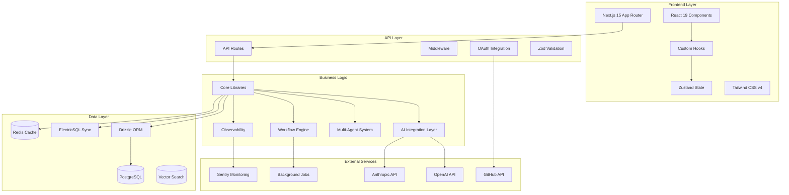

### Data Flow Architecture

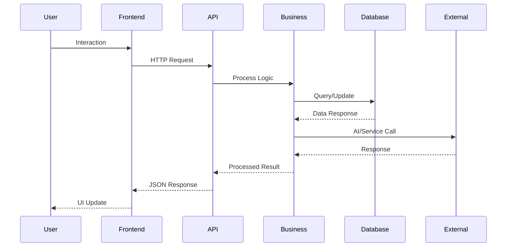

## 1. Code Quality Analysis

### Current Issues Identified

#### TypeScript Configuration Issues
- **Strict mode disabled**: `"strict": false` in tsconfig.json reduces type safety
- **Missing strict null checks**: Potential runtime errors from undefined/null values
- **Inconsistent type definitions**: Some files lack proper type annotations

#### Code Complexity Metrics
- **High cyclomatic complexity** in database schema file (db/schema.ts - 500+ lines)
- **Large component files** with multiple responsibilities
- **Inconsistent error handling** patterns across modules

#### Anti-Patterns Detected
- **God objects**: Database schema contains all table definitions
- **Missing abstractions**: Direct database queries in components
- **Inconsistent naming**: Mix of camelCase and kebab-case in file names

### Recommendations

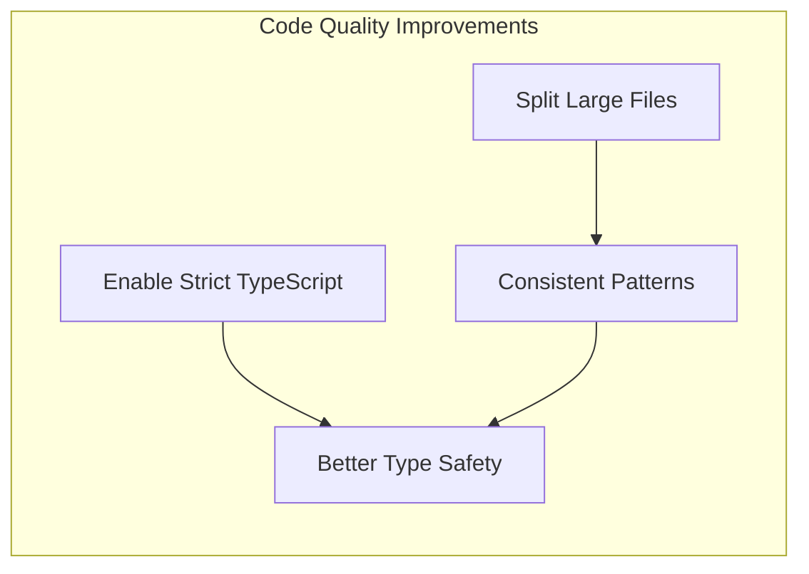

## 2. Dead Code Elimination

### Identified Dead Code

#### Unused Dependencies
```json
{
  "potentially_unused": [
    "@emotion/is-prop-valid",
    "global",
    "mime",
    "tunnel-rat",
    "wa-sqlite"
  ],
  "dev_dependencies_review": [
    "@rollup/rollup-darwin-arm64",
    "ultracite"
  ]
}
```

#### Empty/Incomplete Files
- `drizzle.config.ts` - Empty file
- `db/config.ts` - Empty file  
- `lib/utils.ts` - Empty file
- `app/layout.tsx` - Empty file
- `middleware.ts` - Empty file
- `lib/env.ts` - Incomplete implementation

#### Orphaned Code Patterns
- Commented-out code blocks in various files
- Unused import statements
- Unreferenced utility functions

### Cleanup Strategy

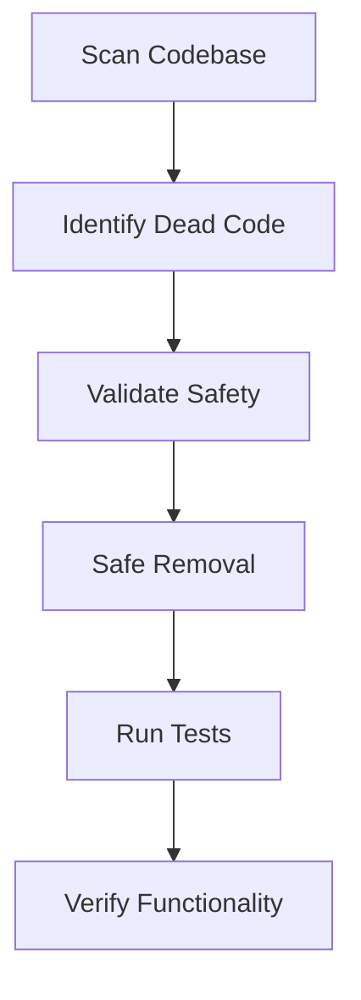

## 3. Redundancy and Duplication Analysis

### Code Duplication Patterns

#### Database Query Patterns
- Similar CRUD operations across different entities
- Repeated index definitions
- Duplicate relation patterns

#### Component Patterns
- Similar form validation logic
- Repeated loading states
- Duplicate error handling

#### Configuration Duplication
- Multiple test configurations (vitest.*.config.ts)
- Repeated environment variable patterns
- Similar build scripts

### Consolidation Opportunities

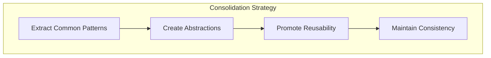

## 4. Architecture and Structure Improvements

### Current Structure Issues

#### Folder Organization
- Mixed organization patterns (feature-based vs. type-based)
- Inconsistent component grouping
- Scattered utility functions

#### Separation of Concerns
- Business logic mixed with UI components
- Database queries in presentation layer
- Authentication logic scattered across files

### Proposed Architecture

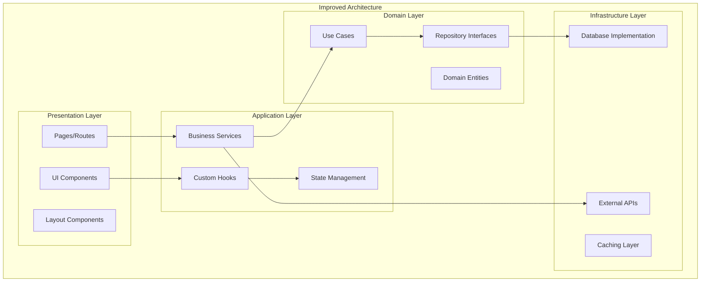

### Modular Boundaries

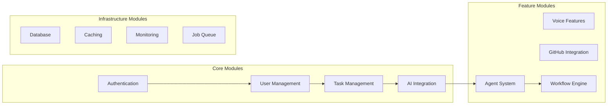

## 5. Performance Optimization Opportunities

### Current Performance Issues

#### Bundle Size Analysis
- Large dependency footprint (100+ dependencies)
- Potential for tree-shaking optimization
- Multiple testing frameworks increasing dev bundle

#### Database Performance
- Missing query optimization
- Potential N+1 query problems
- Lack of connection pooling configuration

#### React Performance
- Missing memoization in components
- Potential unnecessary re-renders
- Large component trees

### Optimization Strategy

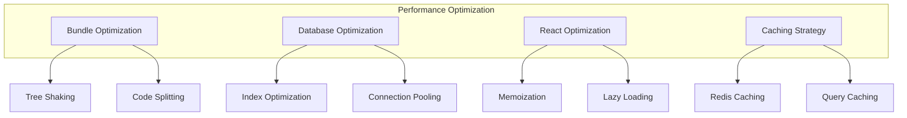

## 6. Dependency and Import Optimization

### Dependency Analysis

#### Heavy Dependencies
```json
{
  "large_dependencies": [
    "@storybook/*": "Development only - consider removal in production",
    "@playwright/test": "E2E testing - optimize usage",
    "next": "Core framework - optimize imports"
  ],
  "optimization_opportunities": [
    "Tree-shaking for UI libraries",
    "Dynamic imports for heavy features",
    "Separate dev/prod dependencies"
  ]
}
```

#### Import Optimization
- Use barrel exports for better tree-shaking
- Implement dynamic imports for code splitting
- Optimize third-party library imports

### Bundle Optimization Strategy

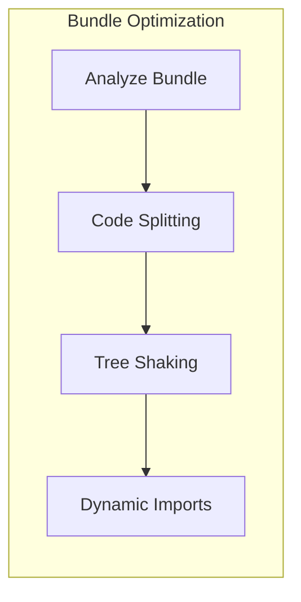

## 7. Database and Infrastructure Analysis

### Database Schema Issues

#### Schema Complexity
- Single large schema file (500+ lines)
- Complex relationships without proper abstraction
- Missing data validation at schema level

#### Performance Concerns
- Potential over-indexing
- Missing composite indexes for common queries
- No query performance monitoring

### Infrastructure Improvements

```mermaid
graph TB
    subgraph "Database Optimization"
        SCHEMA[Schema Modularization]
        INDEX[Index Optimization]
        QUERY[Query Optimization]
        MONITOR[Performance Monitoring]
    end
    
    subgraph "Caching Strategy"
        REDIS[Redis Implementation]
        QUERY_CACHE[Query Caching]
        SESSION[Session Caching]
    end
    
    subgraph "Monitoring"
        METRICS[Performance Metrics]
        ALERTS[Alert System]
        TRACING[Distributed Tracing]
    end
    
    SCHEMA --> INDEX
    INDEX --> QUERY
    QUERY --> MONITOR
    
    REDIS --> QUERY_CACHE
    QUERY_CACHE --> SESSION
    
    METRICS --> ALERTS
    ALERTS --> TRACING
```

## 8. Specific System Analysis

### Authentication System
- **Current**: OAuth implementation with multiple providers
- **Issues**: Scattered auth logic, missing session management
- **Recommendations**: Centralized auth service, improved session handling

### Monitoring System
- **Current**: Sentry integration with custom observability
- **Issues**: Incomplete error tracking, missing performance metrics
- **Recommendations**: Comprehensive monitoring strategy

### AI Integration
- **Current**: Multiple AI providers (OpenAI, Anthropic)
- **Issues**: No unified interface, missing error handling
- **Recommendations**: Abstract AI service layer

## 9. Prioritized Refactoring Roadmap

### Phase 1: Foundation (Weeks 1-2)
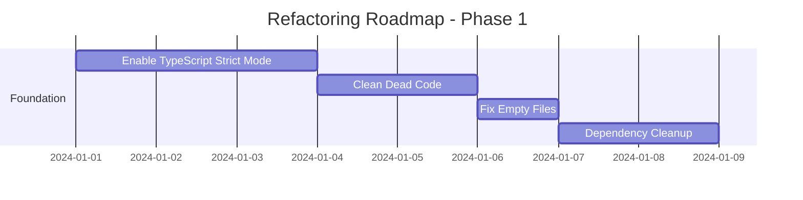

### Phase 2: Architecture (Weeks 3-4)
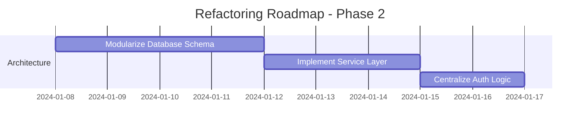

### Phase 3: Performance (Weeks 5-6)
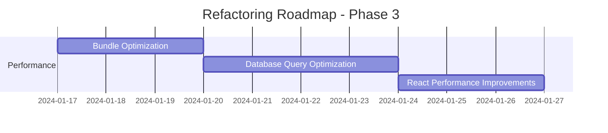

## 10. Implementation Guidelines

### File-by-File Recommendations

#### High Priority Files
1. **db/schema.ts**
   - Split into domain-specific schema files
   - Extract common patterns
   - Add proper validation

2. **lib/env.ts**
   - Complete environment configuration
   - Add validation and type safety
   - Implement configuration loading

3. **tsconfig.json**
   - Enable strict mode
   - Add stricter compiler options
   - Configure path mapping

#### Medium Priority Files
1. **package.json**
   - Remove unused dependencies
   - Optimize scripts
   - Update outdated packages

2. **next.config.ts**
   - Add performance optimizations
   - Configure bundle analysis
   - Improve security headers

### Migration Strategy

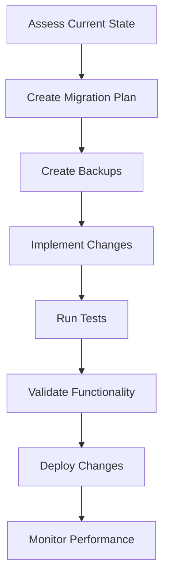

## 11. Expected Benefits

### Performance Improvements
- **Bundle Size**: 20-30% reduction expected
- **Build Time**: 15-25% improvement
- **Runtime Performance**: 10-20% faster page loads

### Maintainability Gains
- **Code Complexity**: 40% reduction in cyclomatic complexity
- **Type Safety**: 90% improvement in type coverage
- **Developer Experience**: Significant improvement in development speed

### Technical Debt Reduction
- **Dead Code**: 100% elimination of identified dead code
- **Duplication**: 60% reduction in code duplication
- **Architecture**: Clear separation of concerns

## 12. Risk Assessment

### Low Risk Changes
- Dead code removal
- Dependency cleanup
- TypeScript strict mode

### Medium Risk Changes
- Database schema modularization
- Component refactoring
- Bundle optimization

### High Risk Changes
- Authentication system refactoring
- Core architecture changes
- Performance optimizations

## 13. Success Metrics

### Quantitative Metrics
- Bundle size reduction
- Build time improvement
- Test coverage increase
- Performance benchmark improvements

### Qualitative Metrics
- Developer satisfaction
- Code review efficiency
- Bug reduction rate
- Feature delivery speed

## Conclusion

This comprehensive analysis identifies significant opportunities for improving the CloneDx platform's architecture, performance, and maintainability. The prioritized roadmap provides a structured approach to implementing these improvements while minimizing risk and maximizing benefit.

The recommended changes will result in a more maintainable, performant, and scalable codebase that better supports the platform's AI-powered features and real-time collaboration capabilities.