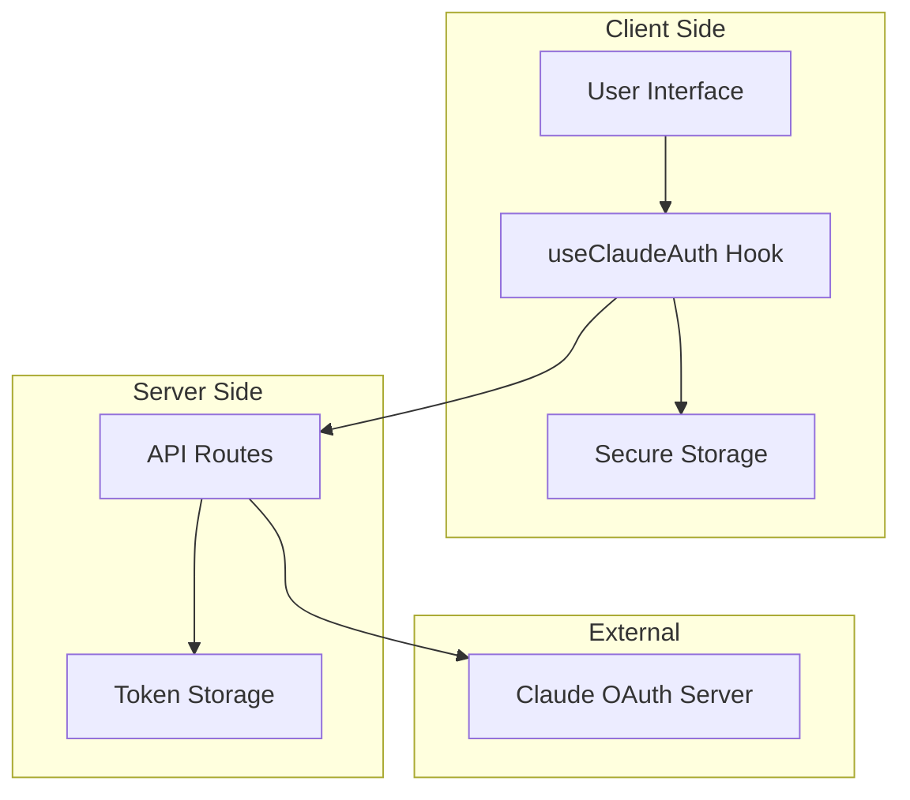
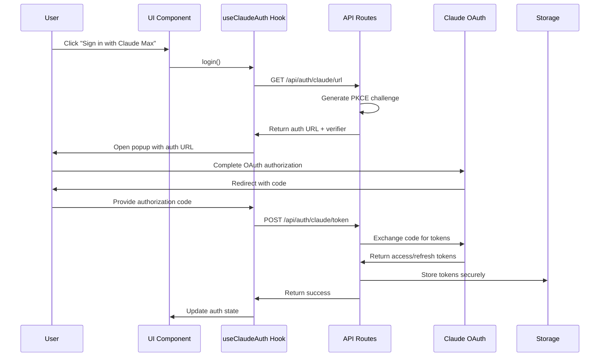

# Design Document

## Overview

The Claude Max OAuth implementation provides a secure authentication system that allows users to sign in with their Claude Max subscriptions or use API keys as an alternative. The design follows OAuth 2.0 with PKCE (Proof Key for Code Exchange) standards and integrates seamlessly with the existing Next.js application architecture.

The system consists of a React hook for state management, API routes for OAuth flow handling, secure token storage, and a simple button interface that provides both authentication methods.

## Architecture

### High-Level Architecture



### Authentication Flow



## Components and Interfaces

### 1. React Hook: `useClaudeAuth`

**Purpose**: Manages Claude authentication state and provides methods for login, logout, and token management.

**Interface**:
```typescript
interface UseClaudeAuthReturn {
  isAuthenticated: boolean;
  user: ClaudeUser | null;
  authMethod: 'oauth' | 'api_key' | null;
  isLoading: boolean;
  error: string | null;
  login: () => Promise<void>;
  loginWithApiKey: (apiKey: string) => Promise<void>;
  logout: () => void;
  getAccessToken: () => Promise<string>;
}

interface ClaudeUser {
  id: string;
  email: string;
  name: string;
  subscription: 'pro' | 'max';
}
```

**Key Features**:
- Automatic token refresh with 5-minute buffer
- Secure token storage using encrypted localStorage
- Error handling with retry mechanisms
- Loading states for UI feedback

### 2. API Routes

#### `/api/auth/claude/url`
- **Method**: GET
- **Purpose**: Generate OAuth authorization URL with PKCE challenge
- **Response**: `{ url: string, verifier: string }`

#### `/api/auth/claude/token`
- **Method**: POST
- **Purpose**: Exchange authorization code for tokens
- **Body**: `{ code: string, verifier: string }`
- **Response**: `{ accessToken: string, refreshToken: string, expiresAt: number, user: ClaudeUser }`

#### `/api/auth/claude/refresh`
- **Method**: POST
- **Purpose**: Refresh expired access token
- **Body**: `{ refreshToken: string }`
- **Response**: `{ accessToken: string, refreshToken: string, expiresAt: number }`

#### `/api/auth/claude/validate`
- **Method**: POST
- **Purpose**: Validate API key
- **Body**: `{ apiKey: string }`
- **Response**: `{ valid: boolean, user: ClaudeUser }`

### 3. UI Components

#### `ClaudeAuthButton`
**Purpose**: Main authentication button component with dual authentication options.

```typescript
interface ClaudeAuthButtonProps {
  onAuthSuccess?: (user: ClaudeUser) => void;
  onAuthError?: (error: string) => void;
  className?: string;
}
```

#### `ApiKeyInput`
**Purpose**: Secure input component for API key authentication.

```typescript
interface ApiKeyInputProps {
  onSubmit: (apiKey: string) => Promise<void>;
  isLoading: boolean;
  error?: string;
}
```

### 4. Storage Layer

#### `ClaudeTokenStore`
**Purpose**: Handles secure storage and retrieval of authentication tokens.

```typescript
interface TokenData {
  accessToken: string;
  refreshToken: string;
  expiresAt: number;
  authMethod: 'oauth' | 'api_key';
}

class ClaudeTokenStore {
  async saveTokens(tokens: TokenData): Promise<void>;
  async getTokens(): Promise<TokenData | null>;
  async clearTokens(): Promise<void>;
  async isExpired(tokens: TokenData): boolean;
}
```

**Security Features**:
- AES-256 encryption for token storage
- Secure key derivation using Web Crypto API
- Automatic cleanup on logout
- Protection against XSS attacks

## Data Models

### OAuth Configuration
```typescript
const CLAUDE_OAUTH_CONFIG = {
  CLIENT_ID: '9d1c250a-e61b-44d9-88ed-5944d1962f5e',
  AUTHORIZE_URL: 'https://claude.ai/oauth/authorize',
  TOKEN_URL: 'https://console.anthropic.com/v1/oauth/token',
  REDIRECT_URI: 'https://console.anthropic.com/oauth/code/callback',
  SCOPES: 'org:create_api_key user:profile user:inference'
};
```

### Token Response Schema
```typescript
interface TokenResponse {
  access_token: string;
  refresh_token: string;
  expires_in: number;
  token_type: 'Bearer';
  scope: string;
}
```

### User Profile Schema
```typescript
interface ClaudeUser {
  id: string;
  email: string;
  name: string;
  subscription: 'pro' | 'max';
  created_at: string;
  updated_at: string;
}
```

## Error Handling

### Error Types
```typescript
enum ClaudeAuthError {
  OAUTH_FAILED = 'oauth_failed',
  TOKEN_EXCHANGE_FAILED = 'token_exchange_failed',
  TOKEN_REFRESH_FAILED = 'token_refresh_failed',
  API_KEY_INVALID = 'api_key_invalid',
  NETWORK_ERROR = 'network_error',
  STORAGE_ERROR = 'storage_error',
  POPUP_BLOCKED = 'popup_blocked'
}
```

### Error Handling Strategy
1. **Network Errors**: Automatic retry with exponential backoff
2. **Token Expiry**: Automatic refresh with fallback to re-authentication
3. **OAuth Failures**: Clear error messages with retry options
4. **Storage Errors**: Graceful degradation with session-only storage
5. **Popup Blocking**: Alternative manual code entry flow

## Testing Strategy

### Unit Tests
- **Hook Testing**: Test all authentication states and transitions
- **API Route Testing**: Mock OAuth responses and error conditions
- **Storage Testing**: Verify encryption/decryption and cleanup
- **Component Testing**: Test UI interactions and error states

### Integration Tests
- **OAuth Flow**: End-to-end authentication flow testing
- **Token Refresh**: Automatic token refresh scenarios
- **Error Recovery**: Error handling and recovery mechanisms
- **Security**: Token storage security and cleanup

### Test Files Structure
```
src/
├── hooks/__tests__/
│   └── use-claude-auth.test.ts
├── app/api/auth/claude/__tests__/
│   ├── url.test.ts
│   ├── token.test.ts
│   └── refresh.test.ts
├── components/__tests__/
│   ├── claude-auth-button.test.tsx
│   └── api-key-input.test.tsx
└── lib/__tests__/
    └── claude-token-store.test.ts
```

### Security Testing
- **Token Encryption**: Verify tokens are encrypted in storage
- **PKCE Implementation**: Validate PKCE challenge generation and verification
- **XSS Protection**: Test against cross-site scripting attacks
- **Token Cleanup**: Ensure proper cleanup on logout
- **HTTPS Enforcement**: Verify all requests use HTTPS

## Implementation Considerations

### Dependencies
- `@openauthjs/openauth`: PKCE generation and OAuth utilities
- `crypto-js`: Token encryption (fallback for older browsers)
- `zod`: Schema validation for API responses
- `zustand`: Optional state management integration

### Browser Compatibility
- **Modern Browsers**: Use Web Crypto API for encryption
- **Legacy Browsers**: Fallback to crypto-js library
- **Cookie Support**: Graceful degradation for cookie-disabled browsers
- **Popup Blocking**: Alternative manual code entry flow

### Performance Optimizations
- **Token Caching**: Cache valid tokens to reduce API calls
- **Lazy Loading**: Load OAuth utilities only when needed
- **Request Deduplication**: Prevent multiple simultaneous token refresh requests
- **Background Refresh**: Proactive token refresh before expiry

### Security Measures
- **HTTPS Only**: All authentication requests use HTTPS
- **Secure Storage**: Encrypted token storage with secure key derivation
- **PKCE Implementation**: Cryptographically secure PKCE challenges
- **Token Rotation**: Automatic token refresh and rotation
- **Logout Cleanup**: Complete token cleanup on logout

### Error Recovery
- **Automatic Retry**: Network errors with exponential backoff
- **Graceful Degradation**: Fallback authentication methods
- **User Feedback**: Clear error messages and recovery instructions
- **Logging**: Comprehensive error logging for debugging