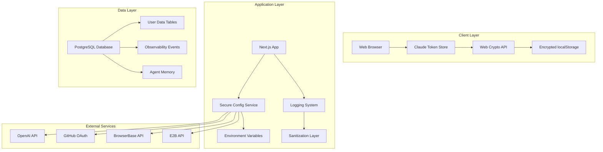

# Security Data Management Assessment Design

## Overview

The solomon_codes application implements a multi-layered security architecture for managing user data, API keys, and sensitive information. This design document analyzes the current implementation and provides recommendations for maintaining and improving security posture.

## Architecture

### Current Security Architecture



### Security Layers

1. **Client-Side Security**: Web Crypto API encryption for token storage
2. **Application Security**: Centralized configuration validation and sanitization
3. **Data Security**: PostgreSQL with proper indexing and audit trails
4. **Transport Security**: HTTPS and secure API communication
5. **Monitoring Security**: Comprehensive logging with sensitive data protection

## Components and Interfaces

### 1. Secure Configuration Service (`SecureConfigService`)

**Purpose**: Centralized management of environment variables and API keys with validation

**Key Features**:
- API key format validation using regex patterns
- Environment-specific configuration requirements
- Automatic masking of sensitive values in logs
- Health check capabilities for configuration validation

**Security Controls**:
- Validates API key formats before use
- Prevents production deployment with localhost URLs
- Requires telemetry configuration in production
- Throws `SecurityConfigError` for invalid configurations

### 2. Claude Token Store (`ClaudeTokenStore`)

**Purpose**: Secure client-side storage of OAuth tokens with encryption

**Key Features**:
- AES-GCM encryption with 256-bit keys
- Automatic key generation and storage
- Token expiration checking with 5-minute buffer
- Graceful handling of corrupted data

**Security Controls**:
- Uses Web Crypto API for cryptographic operations
- Generates random 96-bit IVs for each encryption
- Automatically clears expired or corrupted tokens
- Logs only metadata, never actual token values

### 3. Logging Sanitization System

**Purpose**: Automatic removal of sensitive data from logs and monitoring

**Key Features**:
- Recursive sanitization of nested objects
- Configurable sensitive key patterns
- Context-aware metadata creation
- Performance metrics without sensitive data

**Security Controls**:
- Replaces sensitive values with "[REDACTED]"
- Sanitizes passwords, tokens, secrets, API keys
- Truncates long database queries
- Excludes sensitive headers from request logs

### 4. Database Schema Security

**Purpose**: Secure storage of user data with proper access controls

**Key Features**:
- UUID primary keys for all tables
- Proper indexing for performance and security
- JSONB fields for flexible metadata storage
- Vector embeddings for semantic search

**Security Controls**:
- No storage of raw passwords or credentials
- Cascade deletion for data consistency
- Audit trails through observability events
- Time-based retention policies

## Data Models

### User Data Storage

```typescript
// No direct user credentials stored
interface TaskData {
  id: uuid;
  userId?: string;        // External identifier only
  sessionId: string;      // Secure session tracking
  repository: string;     // Repository access via OAuth
  // No passwords, tokens, or sensitive auth data
}

interface ObservabilityEvent {
  userId?: string;        // External identifier only
  correlationId: string;  // For request tracking
  data: jsonb;           // Sanitized event data
  // Sensitive data automatically sanitized
}
```

### Token Management

```typescript
interface ClaudeTokenData {
  accessToken: string;    // Encrypted at rest
  refreshToken: string;   // Encrypted at rest
  expiresAt: number;     // Expiration tracking
  authMethod: "oauth" | "api_key";
  userId?: string;       // External identifier
}
```

### Configuration Security

```typescript
interface SecureConfig {
  openai: { apiKey: string };      // Validated format
  github: { 
    clientId: string;              // Public identifier
    clientSecret: string;          // Validated and masked
  };
  // All API keys validated before use
}
```

## Error Handling

### Security Error Types

1. **Configuration Errors**: Invalid API keys, missing required environment variables
2. **Authentication Errors**: Token validation failures, OAuth flow errors
3. **Encryption Errors**: Web Crypto API failures, key generation issues
4. **Validation Errors**: Schema validation failures, format validation errors

### Error Response Strategy

- **User-Facing**: Generic error messages without technical details
- **Logging**: Detailed error information with sanitized context
- **Monitoring**: Security events logged with appropriate severity
- **Recovery**: Automatic cleanup of corrupted data where possible

## Testing Strategy

### Security Testing Areas

1. **API Key Validation**: Test format validation for all supported services
2. **Token Encryption**: Verify encryption/decryption cycles work correctly
3. **Data Sanitization**: Ensure sensitive data is properly masked in logs
4. **Configuration Validation**: Test environment-specific requirements
5. **OAuth Security**: Validate PKCE implementation and state validation

### Test Categories

- **Unit Tests**: Individual security component validation
- **Integration Tests**: End-to-end security flow testing
- **Security Tests**: Penetration testing and vulnerability assessment
- **Compliance Tests**: Data protection regulation compliance

## Current Security Strengths

### ✅ Well-Implemented Areas

1. **Client-Side Encryption**: Robust Web Crypto API implementation
2. **API Key Management**: Centralized validation and secure storage
3. **Logging Security**: Comprehensive sanitization system
4. **OAuth Implementation**: Proper PKCE and state validation
5. **Database Design**: Secure schema with proper indexing
6. **Environment Configuration**: Strict production requirements

### ✅ Security Best Practices Followed

1. **Principle of Least Privilege**: Only necessary data stored
2. **Defense in Depth**: Multiple security layers
3. **Secure by Default**: Production-first security configuration
4. **Audit Trails**: Comprehensive observability events
5. **Data Minimization**: No unnecessary sensitive data storage

## Security Recommendations

### 🔒 Areas for Enhancement

1. **Token Rotation**: Implement automatic refresh token rotation
2. **Rate Limiting**: Add API rate limiting for external service calls
3. **Session Management**: Implement secure session invalidation
4. **Data Encryption**: Consider database-level encryption for sensitive fields
5. **Security Headers**: Ensure proper HTTP security headers
6. **Backup Security**: Secure backup and recovery procedures

### 🔍 Monitoring Enhancements

1. **Security Dashboards**: Real-time security event monitoring
2. **Anomaly Detection**: Unusual access pattern detection
3. **Compliance Reporting**: Automated compliance status reports
4. **Incident Response**: Automated security incident workflows

## Compliance Considerations

### Data Protection Regulations

- **GDPR**: User data minimization and right to deletion
- **CCPA**: California consumer privacy rights
- **SOC 2**: Security and availability controls
- **HIPAA**: Healthcare data protection (if applicable)

### Security Standards

- **OWASP Top 10**: Web application security risks
- **NIST Cybersecurity Framework**: Comprehensive security controls
- **ISO 27001**: Information security management
- **PCI DSS**: Payment card data security (if applicable)

## Implementation Notes

### Current Security Posture: **STRONG** 🟢

The solomon_codes application demonstrates excellent security practices with:
- Proper encryption of sensitive client-side data
- Comprehensive API key validation and management
- Robust logging sanitization system
- Secure database design with audit capabilities
- Environment-specific security controls

### Key Security Differentiators

1. **No Credential Storage**: Application doesn't store user passwords or raw credentials
2. **Client-Side Encryption**: Tokens encrypted before localStorage storage
3. **Automatic Sanitization**: All logs automatically sanitized for sensitive data
4. **Configuration Validation**: Strict validation prevents insecure deployments
5. **Comprehensive Monitoring**: Full observability with security event tracking

The current implementation provides a solid foundation for secure user data management and can serve as a model for other applications in the ecosystem.