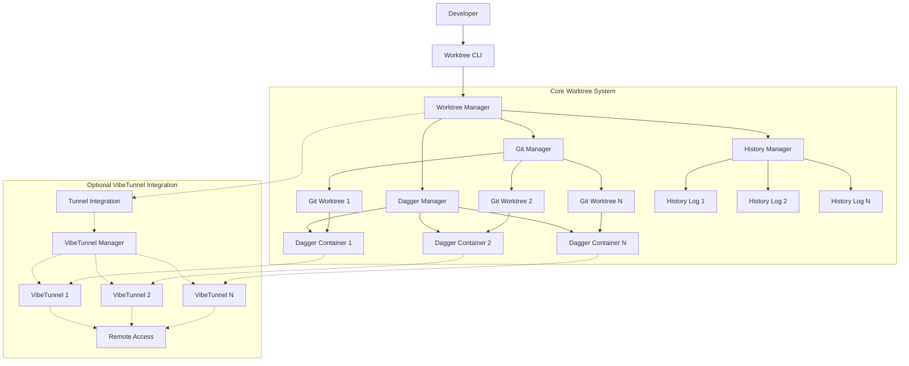
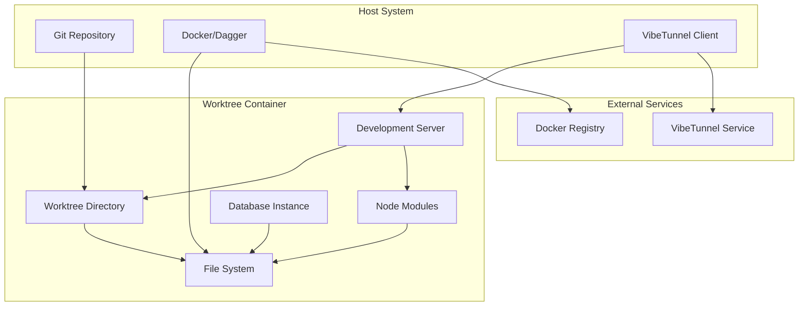

# Design Document

## Overview

The Containerized Worktrees feature creates isolated development environments that combine Git worktrees and Dagger containerization, with optional VibeTunnel integration for remote access. This modular design allows developers to use containerized worktrees independently or enhance them with tunneling capabilities.

Key architectural principles:
- **Modularity**: Core worktree functionality is independent of tunneling
- **Isolation**: Each worktree operates in its own container with dedicated resources
- **Reproducibility**: Dagger ensures consistent environments across machines
- **Optional Accessibility**: VibeTunnel integration provides secure remote access when enabled
- **Traceability**: Complete history tracking of all development activities
- **Efficiency**: Smart resource management and container lifecycle optimization

## Architecture

### Modular Architecture



### Container Architecture



## Components and Interfaces

### 1. Worktree Manager (`lib/worktrees/manager.ts`)

**Purpose**: Central orchestrator for worktree lifecycle management

```typescript
interface WorktreeManager {
  create(options: WorktreeCreateOptions): Promise<Worktree>
  list(): Promise<Worktree[]>
  switch(branchName: string): Promise<void>
  delete(branchName: string): Promise<void>
  getActive(): Promise<Worktree | null>
  backup(branchName: string, options?: BackupOptions): Promise<BackupResult>
  restore(backupId: string, options?: RestoreOptions): Promise<Worktree>
  
  // Integration points for optional features
  registerIntegration(name: string, integration: WorktreeIntegration): void
  getIntegration(name: string): WorktreeIntegration | null
}

interface WorktreeCreateOptions {
  branchName: string
  baseBranch?: string
  template?: WorktreeTemplate
  containerConfig?: ContainerConfig
  integrations?: Record<string, any> // Flexible integration configs
}

interface Worktree {
  id: string
  branchName: string
  path: string
  containerId: string
  status: WorktreeStatus
  createdAt: Date
  lastActive: Date
  resources: ResourceUsage
  integrations: Record<string, IntegrationData> // Flexible integration data
}

interface WorktreeIntegration {
  name: string
  onCreate?(worktree: Worktree, config: any): Promise<IntegrationData>
  onDelete?(worktree: Worktree): Promise<void>
  onStart?(worktree: Worktree): Promise<void>
  onStop?(worktree: Worktree): Promise<void>
}
```

### 2. Dagger Integration (`lib/worktrees/dagger.ts`)

**Purpose**: Manage containerized development environments using Dagger

```typescript
interface DaggerManager {
  createContainer(config: ContainerConfig): Promise<Container>
  startContainer(containerId: string): Promise<void>
  stopContainer(containerId: string): Promise<void>
  pauseContainer(containerId: string): Promise<void>
  resumeContainer(containerId: string): Promise<void>
  executeCommand(containerId: string, command: string[]): Promise<CommandResult>
  syncFiles(containerId: string, localPath: string, containerPath: string): Promise<void>
}

interface ContainerConfig {
  baseImage: string
  workingDir: string
  environment: Record<string, string>
  ports: PortMapping[]
  volumes: VolumeMount[]
  dependencies: DependencySpec[]
}

interface DependencySpec {
  name: string
  version?: string
  type: 'npm' | 'system' | 'custom'
  installCommand?: string[]
}
```

### 3. Git Worktree Integration (`lib/worktrees/git.ts`)

**Purpose**: Manage Git worktrees and branch operations

```typescript
interface GitManager {
  createWorktree(branchName: string, baseBranch?: string): Promise<WorktreeInfo>
  deleteWorktree(branchName: string): Promise<void>
  listWorktrees(): Promise<WorktreeInfo[]>
  switchWorktree(branchName: string): Promise<void>
  getWorktreeStatus(branchName: string): Promise<GitStatus>
  syncWithRemote(branchName: string): Promise<SyncResult>
}

interface WorktreeInfo {
  branchName: string
  path: string
  commit: string
  upstream?: string
  status: 'clean' | 'modified' | 'staged' | 'conflicted'
}

interface GitStatus {
  ahead: number
  behind: number
  modified: string[]
  staged: string[]
  untracked: string[]
}
```

### 4. VibeTunnel Integration (`lib/worktrees/integrations/vibetunnel.ts`)

**Purpose**: Optional integration to provide remote access to worktree containers

```typescript
class VibeTunnelIntegration implements WorktreeIntegration {
  name = 'vibetunnel'
  
  async onCreate(worktree: Worktree, config: TunnelConfig): Promise<TunnelData>
  async onDelete(worktree: Worktree): Promise<void>
  async onStart(worktree: Worktree): Promise<void>
  async onStop(worktree: Worktree): Promise<void>
}

interface TunnelConfig {
  enabled: boolean
  subdomain?: string
  port: number
  auth?: {
    password?: string
    allowedIPs?: string[]
  }
  ssl: boolean
}

interface TunnelData extends IntegrationData {
  url?: string
  subdomain?: string
  status: 'disabled' | 'connecting' | 'active' | 'error'
  createdAt?: Date
  lastAccessed?: Date
}

// Utility functions for tunnel management
interface TunnelManager {
  createTunnel(worktreeId: string, config: TunnelConfig): Promise<TunnelInfo>
  deleteTunnel(worktreeId: string): Promise<void>
  getTunnelStatus(worktreeId: string): Promise<TunnelStatus>
  updateTunnelConfig(worktreeId: string, config: Partial<TunnelConfig>): Promise<void>
}
```

### 5. History Tracking (`lib/worktrees/history.ts`)

**Purpose**: Track and audit all worktree activities

```typescript
interface HistoryManager {
  logCommand(worktreeId: string, command: CommandLog): Promise<void>
  logFileChange(worktreeId: string, change: FileChangeLog): Promise<void>
  logContainerEvent(worktreeId: string, event: ContainerEventLog): Promise<void>
  getHistory(worktreeId: string, options?: HistoryOptions): Promise<HistoryEntry[]>
  exportHistory(worktreeId: string, format: 'json' | 'markdown' | 'git'): Promise<string>
}

interface CommandLog {
  command: string[]
  workingDir: string
  exitCode: number
  stdout: string
  stderr: string
  duration: number
  timestamp: Date
}

interface FileChangeLog {
  path: string
  action: 'created' | 'modified' | 'deleted' | 'renamed'
  oldPath?: string
  diff?: string
  timestamp: Date
}

interface ContainerEventLog {
  event: 'created' | 'started' | 'stopped' | 'paused' | 'resumed' | 'destroyed'
  containerId: string
  metadata: Record<string, any>
  timestamp: Date
}
```

### 6. CLI Interface (`lib/worktrees/cli.ts`)

**Purpose**: Command-line interface for worktree operations

```typescript
interface WorktreeCLI {
  create(branchName: string, options: CreateOptions): Promise<void>
  list(options?: ListOptions): Promise<void>
  switch(branchName: string): Promise<void>
  delete(branchName: string, options?: DeleteOptions): Promise<void>
  status(branchName?: string): Promise<void>
  backup(branchName: string, options?: BackupOptions): Promise<void>
  restore(backupId: string, options?: RestoreOptions): Promise<void>
}

interface CreateOptions {
  template?: string
  baseBranch?: string
  noTunnel?: boolean
  containerImage?: string
}

interface ListOptions {
  showInactive?: boolean
  showResources?: boolean
  format?: 'table' | 'json' | 'simple'
}
```

## Data Models

### Worktree Configuration Model

```typescript
interface WorktreeConfig {
  id: string
  branchName: string
  path: string
  template: WorktreeTemplate
  container: {
    id: string
    image: string
    status: ContainerStatus
    ports: PortMapping[]
    environment: Record<string, string>
  }
  tunnel: {
    url: string
    subdomain: string
    enabled: boolean
    config: TunnelConfig
  }
  git: {
    baseBranch: string
    upstream?: string
    lastSync: Date
  }
  history: {
    logPath: string
    retentionDays: number
    exportFormats: string[]
  }
  resources: {
    cpuLimit?: string
    memoryLimit?: string
    diskUsage: number
    networkUsage: number
  }
  metadata: {
    createdAt: Date
    lastActive: Date
    createdBy: string
    description?: string
    tags: string[]
  }
}
```

### Template System Model

```typescript
interface WorktreeTemplate {
  name: string
  description: string
  baseImage: string
  dependencies: DependencySpec[]
  environment: Record<string, string>
  ports: PortMapping[]
  initCommands: string[]
  devCommands: string[]
  testCommands: string[]
  buildCommands: string[]
  healthCheck?: HealthCheckConfig
}

interface HealthCheckConfig {
  command: string[]
  interval: number
  timeout: number
  retries: number
}
```

### Resource Management Model

```typescript
interface ResourceUsage {
  cpu: {
    current: number
    average: number
    peak: number
  }
  memory: {
    current: number
    limit: number
    peak: number
  }
  disk: {
    used: number
    available: number
    total: number
  }
  network: {
    bytesIn: number
    bytesOut: number
    connections: number
  }
}

interface ResourceLimits {
  maxWorktrees: number
  maxCpuPerWorktree: string
  maxMemoryPerWorktree: string
  maxDiskPerWorktree: string
  idleTimeout: number
  pauseThreshold: ResourceThreshold
}
```

## Error Handling

### Error Categories

1. **Git Operations**
   - Branch conflicts and merge issues
   - Worktree creation failures
   - Remote synchronization errors

2. **Container Management**
   - Dagger container creation failures
   - Resource allocation errors
   - Container runtime issues

3. **Tunnel Connectivity**
   - VibeTunnel connection failures
   - Subdomain conflicts
   - Authentication errors

4. **Resource Management**
   - Insufficient system resources
   - Container limit exceeded
   - Disk space issues

### Error Handling Strategy

```typescript
class WorktreeError extends Error {
  constructor(
    message: string,
    public category: ErrorCategory,
    public worktreeId?: string,
    public recoverable: boolean = true,
    public suggestions: string[] = []
  ) {
    super(message)
  }
}

// Comprehensive error handling with recovery
async function handleWorktreeOperation<T>(
  operation: () => Promise<T>,
  context: OperationContext
): Promise<T> {
  try {
    return await operation()
  } catch (error) {
    if (error instanceof WorktreeError) {
      await logError(error, context)
      
      if (error.recoverable) {
        const recovery = await attemptRecovery(error, context)
        if (recovery.success) {
          return recovery.result
        }
      }
      
      throw new WorktreeError(
        `${error.message}\nSuggestions: ${error.suggestions.join(', ')}`,
        error.category,
        error.worktreeId,
        false
      )
    }
    throw error
  }
}
```

## Testing Strategy

### Unit Tests

1. **Worktree Manager**
   - Test worktree lifecycle operations
   - Mock Git, Dagger, and VibeTunnel interactions
   - Test error handling and recovery

2. **Container Management**
   - Test Dagger container operations
   - Mock container runtime interactions
   - Test resource management and limits

3. **History Tracking**
   - Test logging mechanisms
   - Test history querying and export
   - Test data persistence and retrieval

### Integration Tests

1. **Full Worktree Lifecycle**
   - Create, use, and delete worktrees
   - Test Git integration with real repositories
   - Test container and tunnel coordination

2. **Multi-Worktree Scenarios**
   - Test concurrent worktree operations
   - Test resource sharing and isolation
   - Test tunnel subdomain management

3. **Template System**
   - Test template application and customization
   - Test template inheritance and updates
   - Test custom template creation

### End-to-End Tests

1. **Developer Workflow**
   - Complete feature development in worktree
   - Test remote collaboration scenarios
   - Test backup and restore operations

2. **Performance and Scalability**
   - Test multiple concurrent worktrees
   - Test resource usage under load
   - Test cleanup and garbage collection

## Security Considerations

### Container Security

- Use minimal base images with security updates
- Implement proper container isolation and sandboxing
- Restrict container capabilities and system access
- Regular security scanning of container images

### Network Security

- Secure VibeTunnel connections with authentication
- Implement IP whitelisting for sensitive worktrees
- Use HTTPS-only connections for remote access
- Monitor and log all network access

### Data Protection

- Encrypt sensitive data in containers
- Implement proper secret management
- Secure backup storage and transmission
- Audit trail for all data access

### Access Control

- Role-based access to worktree operations
- Authentication for shared worktrees
- Audit logging for all administrative actions
- Secure sharing mechanisms for collaboration

## Performance Considerations

### Resource Optimization

- Intelligent container pausing and resuming
- Shared base layers for container efficiency
- Efficient file system mounting and caching
- Resource pooling for common dependencies

### Startup Performance

- Pre-built container images for common templates
- Lazy loading of development dependencies
- Parallel initialization of worktree components
- Cached tunnel connections for faster startup

### Scalability

- Horizontal scaling across multiple machines
- Load balancing for shared worktrees
- Efficient resource allocation algorithms
- Automatic cleanup of unused resources

## Implementation Phases

### Phase 1: Core Infrastructure
- Basic worktree manager implementation
- Git worktree integration
- Simple Dagger container management
- CLI interface foundation

### Phase 2: Container Integration
- Advanced Dagger integration
- Template system implementation
- Resource management and monitoring
- History tracking system

### Phase 3: VibeTunnel Integration
- Tunnel management for worktrees
- Multi-worktree tunnel coordination
- Security and authentication features
- Remote collaboration capabilities

### Phase 4: Advanced Features
- Backup and restore system
- Performance optimization
- Advanced template features
- Comprehensive monitoring and analytics

### Phase 5: Production Readiness
- Security hardening
- Scalability improvements
- Documentation and examples
- Community feedback integration