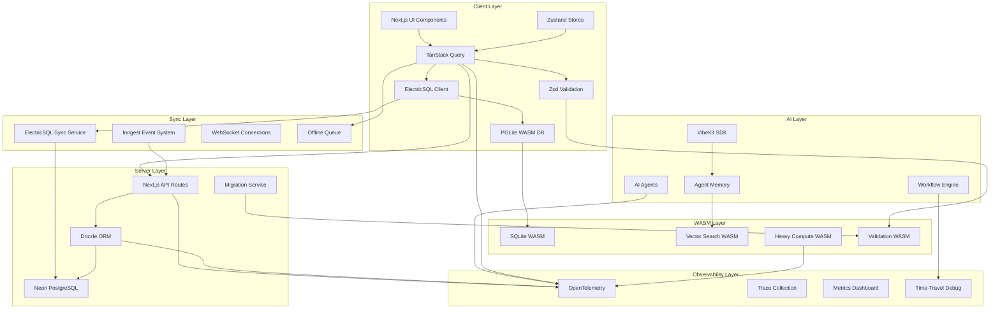

# Design Document

## Overview

This design transforms the current localStorage-based architecture into a comprehensive database-driven system with real-time synchronization, multi-agent observability, and WASM-optimized performance. The solution leverages Drizzle ORM with ElectricSQL for offline-first real-time sync, PostgreSQL with Neon serverless hosting, TanStack Query for intelligent caching, and enhanced OpenTelemetry observability for complete system monitoring.

Drawing inspiration from Code Mesh's high-performance Rust architecture and multi-LLM provider system, this design emphasizes performance optimization through WASM integration, progressive enhancement for web environments, and enterprise-grade observability. The architecture maintains backward compatibility while adding powerful new capabilities including persistent storage, real-time collaboration, agent execution tracking, time-travel debugging, and comprehensive telemetry.

## Architecture

### High-Level Architecture Diagram



### Data Flow Architecture

1. **Write Operations**: UI → TanStack Query Mutation → Zod Validation → ElectricSQL/API → Database
2. **Read Operations**: UI → TanStack Query → Cache (if fresh) OR ElectricSQL/API → Database
3. **Real-time Updates**: Database → ElectricSQL → TanStack Query Cache → UI
4. **Optimistic Updates**: TanStack Query → Immediate UI Update → Background Sync → Rollback on Error
5. **Agent Operations**: VibeKit → Observability Events → Database → TanStack Query Invalidation
6. **Telemetry**: All layers → OpenTelemetry → Monitoring dashboards
7. **WASM Operations**: Heavy Compute → WASM Modules → Fallback to JS → Results
8. **Offline Operations**: UI → Offline Queue → Sync when Online → Database

### Progressive Enhancement Strategy

```typescript
// Feature detection and capability-based loading
if (WebAssembly && crossOriginIsolated) {
  // Full WASM features with SharedArrayBuffer
  await loadFullWASMSuite();
} else if (WebAssembly) {
  // Limited WASM (no threads)
  await loadBasicWASM();
} else {
  // JavaScript fallbacks
  await loadJSFallbacks();
}
```

## Components and Interfaces

### Database Schema (`/db/schema.ts`)

```typescript
import {
  pgTable,
  uuid,
  varchar,
  text,
  timestamp,
  boolean,
  jsonb,
  integer,
  vector,
} from "drizzle-orm/pg-core";

// Core Tables
export const tasks = pgTable("tasks", {
  id: uuid("id").primaryKey().defaultRandom(),
  title: varchar("title", { length: 255 }).notNull(),
  description: text("description"),
  status: varchar("status", { length: 50 }).notNull().default("pending"),
  priority: varchar("priority", { length: 20 }).default("medium"),
  createdAt: timestamp("created_at").defaultNow(),
  updatedAt: timestamp("updated_at").defaultNow(),
  userId: varchar("user_id", { length: 255 }),
  metadata: jsonb("metadata"),
  // Vector embedding for semantic search
  embedding: vector("embedding", { dimensions: 1536 }),
});

export const environments = pgTable("environments", {
  id: uuid("id").primaryKey().defaultRandom(),
  name: varchar("name", { length: 255 }).notNull(),
  config: jsonb("config").notNull(),
  isActive: boolean("is_active").default(false),
  createdAt: timestamp("created_at").defaultNow(),
  updatedAt: timestamp("updated_at").defaultNow(),
  userId: varchar("user_id", { length: 255 }),
  // Configuration validation schema version
  schemaVersion: integer("schema_version").default(1),
});

// Observability Tables
export const agentExecutions = pgTable("agent_executions", {
  id: uuid("id").primaryKey().defaultRandom(),
  taskId: uuid("task_id").references(() => tasks.id),
  agentType: varchar("agent_type", { length: 100 }).notNull(),
  status: varchar("status", { length: 50 }).notNull(),
  startedAt: timestamp("started_at").defaultNow(),
  completedAt: timestamp("completed_at"),
  input: jsonb("input"),
  output: jsonb("output"),
  error: text("error"),
  metadata: jsonb("metadata"),
  traceId: varchar("trace_id", { length: 255 }),
  // Performance metrics
  executionTimeMs: integer("execution_time_ms"),
  tokenUsage: jsonb("token_usage"),
  cost: jsonb("cost"),
});

export const observabilityEvents = pgTable("observability_events", {
  id: uuid("id").primaryKey().defaultRandom(),
  executionId: uuid("execution_id").references(() => agentExecutions.id),
  eventType: varchar("event_type", { length: 100 }).notNull(),
  timestamp: timestamp("timestamp").defaultNow(),
  data: jsonb("data"),
  traceId: varchar("trace_id", { length: 255 }),
  spanId: varchar("span_id", { length: 255 }),
  // Event categorization
  severity: varchar("severity", { length: 20 }).default("info"),
  category: varchar("category", { length: 50 }),
});

// Agent Memory System with Vector Search
export const agentMemory = pgTable("agent_memory", {
  id: uuid("id").primaryKey().defaultRandom(),
  agentType: varchar("agent_type", { length: 100 }).notNull(),
  contextKey: varchar("context_key", { length: 255 }).notNull(),
  content: text("content").notNull(),
  embedding: vector("embedding", { dimensions: 1536 }),
  createdAt: timestamp("created_at").defaultNow(),
  lastAccessedAt: timestamp("last_accessed_at").defaultNow(),
  accessCount: integer("access_count").default(0),
  metadata: jsonb("metadata"),
  // Memory management
  importance: integer("importance").default(1), // 1-10 scale
  expiresAt: timestamp("expires_at"),
});

// Workflow Orchestration
export const workflows = pgTable("workflows", {
  id: uuid("id").primaryKey().defaultRandom(),
  name: varchar("name", { length: 255 }).notNull(),
  definition: jsonb("definition").notNull(),
  version: integer("version").default(1),
  isActive: boolean("is_active").default(true),
  createdAt: timestamp("created_at").defaultNow(),
  createdBy: varchar("created_by", { length: 255 }),
  // Workflow metadata
  tags: jsonb("tags"),
  description: text("description"),
});

export const workflowExecutions = pgTable("workflow_executions", {
  id: uuid("id").primaryKey().defaultRandom(),
  workflowId: uuid("workflow_id").references(() => workflows.id),
  status: varchar("status", { length: 50 }).notNull(),
  currentStep: integer("current_step").default(0),
  totalSteps: integer("total_steps"),
  state: jsonb("state"),
  startedAt: timestamp("started_at").defaultNow(),
  completedAt: timestamp("completed_at"),
  error: text("error"),
  // Execution context
  triggeredBy: varchar("triggered_by", { length: 255 }),
  parentExecutionId: uuid("parent_execution_id"),
});

// Time-travel debugging support
export const executionSnapshots = pgTable("execution_snapshots", {
  id: uuid("id").primaryKey().defaultRandom(),
  executionId: uuid("execution_id").references(() => agentExecutions.id),
  stepNumber: integer("step_number").notNull(),
  timestamp: timestamp("timestamp").defaultNow(),
  state: jsonb("state").notNull(),
  // Snapshot metadata
  description: text("description"),
  checkpoint: boolean("checkpoint").default(false),
});
```

### Enhanced TanStack Query Integration (`/lib/queries.ts`)

```typescript
import {
  useQuery,
  useMutation,
  useQueryClient,
  useInfiniteQuery,
  useSuspenseQuery,
} from "@tanstack/react-query";
import { ElectricClient } from "./electric";
import { ValidationService } from "./validation";
import { ObservabilityService } from "./observability";
import { WASMServices } from "./wasm-services";
import {
  Task,
  Environment,
  AgentExecution,
  CreateTaskSchema,
  UpdateTaskSchema,
} from "../schemas/database";

// Enhanced Query Keys with type safety
export const queryKeys = {
  tasks: ["tasks"] as const,
  task: (id: string) => ["tasks", id] as const,
  tasksByStatus: (status: string) => ["tasks", "status", status] as const,
  environments: ["environments"] as const,
  environment: (id: string) => ["environments", id] as const,
  agentExecutions: ["agent-executions"] as const,
  agentExecution: (id: string) => ["agent-executions", id] as const,
  agentExecutionsByTask: (taskId: string) =>
    ["agent-executions", "task", taskId] as const,
  observabilityEvents: (executionId: string) =>
    ["observability-events", executionId] as const,
  agentMemory: (agentType: string) => ["agent-memory", agentType] as const,
  workflows: ["workflows"] as const,
  workflowExecutions: (workflowId: string) =>
    ["workflow-executions", workflowId] as const,
} as const;

// Enhanced Task Queries with WASM optimization
export const useTasks = (options?: {
  status?: string;
  priority?: string;
  useWASM?: boolean;
}) => {
  return useQuery({
    queryKey: options?.status
      ? queryKeys.tasksByStatus(options.status)
      : queryKeys.tasks,
    queryFn: async () => {
      const electric = ElectricClient.getInstance();
      const observability = ObservabilityService.getInstance();

      return observability.trackOperation("query.tasks", async () => {
        if (options?.useWASM && WASMServices.isAvailable()) {
          // Use WASM for complex filtering/sorting
          const wasmUtils = await WASMServices.getSQLiteUtils();
          return wasmUtils.queryTasks(options);
        }

        return electric.db.tasks.findMany({
          where: options?.status ? { status: options.status } : undefined,
          orderBy: { createdAt: "desc" },
          include: {
            agentExecutions: {
              orderBy: { startedAt: "desc" },
              take: 5, // Latest 5 executions
            },
          },
        });
      });
    },
    staleTime: 30000, // 30 seconds
    refetchOnWindowFocus: true,
    // Enable background refetch for real-time updates
    refetchInterval: 60000, // 1 minute
  });
};

export const useTask = (id: string) => {
  return useQuery({
    queryKey: queryKeys.task(id),
    queryFn: async () => {
      const electric = ElectricClient.getInstance();
      const observability = ObservabilityService.getInstance();

      return observability.trackOperation("query.task", async () => {
        return electric.db.tasks.findUnique({
          where: { id },
          include: {
            agentExecutions: {
              orderBy: { startedAt: "desc" },
              include: {
                observabilityEvents: {
                  orderBy: { timestamp: "asc" },
                },
              },
            },
          },
        });
      });
    },
    enabled: !!id,
    // Longer stale time for individual tasks
    staleTime: 60000, // 1 minute
  });
};

// Enhanced Task Mutations with comprehensive validation
export const useCreateTask = () => {
  const queryClient = useQueryClient();
  const observability = ObservabilityService.getInstance();

  return useMutation({
    mutationFn: async (taskData: unknown) => {
      // Validate with Zod
      const validation = ValidationService.safeValidate(
        CreateTaskSchema,
        taskData,
      );
      if (!validation.success) {
        throw new ValidationError("Invalid task data", validation.errors);
      }

      return observability.trackAgentExecution(
        "system",
        "create-task",
        async () => {
          const electric = ElectricClient.getInstance();

          // Generate embedding for semantic search if WASM is available
          if (WASMServices.isAvailable()) {
            const vectorSearch = await WASMServices.getVectorSearch();
            const embedding = await vectorSearch.generateEmbedding(
              `${validation.data.title} ${validation.data.description || ""}`,
            );
            validation.data.embedding = embedding;
          }

          return electric.db.tasks.create({ data: validation.data });
        },
      );
    },
    onMutate: async (taskData) => {
      // Cancel outgoing refetches
      await queryClient.cancelQueries({ queryKey: queryKeys.tasks });

      // Optimistic update
      const tempId = `temp-${Date.now()}`;
      const optimisticTask = {
        id: tempId,
        ...taskData,
        createdAt: new Date(),
        updatedAt: new Date(),
        status: "pending" as const,
      };

      queryClient.setQueryData(queryKeys.tasks, (old: Task[] = []) => [
        optimisticTask,
        ...old,
      ]);

      return { tempId };
    },
    onSuccess: (newTask, variables, context) => {
      // Replace optimistic update with real data
      queryClient.setQueryData(queryKeys.tasks, (old: Task[] = []) =>
        old.map((task) => (task.id === context?.tempId ? newTask : task)),
      );
      // Invalidate to ensure consistency
      queryClient.invalidateQueries({ queryKey: queryKeys.tasks });
    },
    onError: (error, variables, context) => {
      // Remove optimistic update on error
      if (context?.tempId) {
        queryClient.setQueryData(queryKeys.tasks, (old: Task[] = []) =>
          old.filter((task) => task.id !== context.tempId),
        );
      }
      console.error("Failed to create task:", error);
    },
  });
};

export const useUpdateTask = () => {
  const queryClient = useQueryClient();
  const observability = ObservabilityService.getInstance();

  return useMutation({
    mutationFn: async ({ id, updates }: { id: string; updates: unknown }) => {
      // Validate updates
      const validation = ValidationService.safeValidate(
        UpdateTaskSchema,
        updates,
      );
      if (!validation.success) {
        throw new ValidationError(
          "Invalid task update data",
          validation.errors,
        );
      }

      return observability.trackOperation("update-task", async () => {
        const electric = ElectricClient.getInstance();
        return electric.db.tasks.update({
          where: { id },
          data: { ...validation.data, updatedAt: new Date() },
        });
      });
    },
    onMutate: async ({ id, updates }) => {
      // Cancel outgoing refetches
      await queryClient.cancelQueries({ queryKey: queryKeys.task(id) });

      // Snapshot previous value
      const previousTask = queryClient.getQueryData(queryKeys.task(id));

      // Optimistically update
      queryClient.setQueryData(queryKeys.task(id), (old: Task) => ({
        ...old,
        ...updates,
        updatedAt: new Date(),
      }));
      queryClient.setQueryData(queryKeys.tasks, (old: Task[] = []) =>
        old.map((task) =>
          task.id === id
            ? { ...task, ...updates, updatedAt: new Date() }
            : task,
        ),
      );

      return { previousTask };
    },
    onError: (err, variables, context) => {
      // Rollback on error
      if (context?.previousTask) {
        queryClient.setQueryData(
          queryKeys.task(variables.id),
          context.previousTask,
        );
      }
    },
    onSettled: (data, error, variables) => {
      // Always refetch after error or success
      queryClient.invalidateQueries({ queryKey: queryKeys.task(variables.id) });
      queryClient.invalidateQueries({ queryKey: queryKeys.tasks });
    },
  });
};

// Real-time Subscriptions with TanStack Query
export const useTaskSubscription = (taskId: string) => {
  const queryClient = useQueryClient();

  useEffect(() => {
    const electric = ElectricClient.getInstance();

    const unsubscribe = electric.subscribe("tasks", (tasks: Task[]) => {
      const updatedTask = tasks.find((t) => t.id === taskId);
      if (updatedTask) {
        queryClient.setQueryData(queryKeys.task(taskId), updatedTask);
        queryClient.setQueryData(queryKeys.tasks, (old: Task[] = []) =>
          old.map((task) => (task.id === taskId ? updatedTask : task)),
        );
      }
    });

    return unsubscribe;
  }, [taskId, queryClient]);
};

// Agent Execution Queries with Time-Travel Support
export const useAgentExecutions = (
  taskId?: string,
  options?: {
    includeSnapshots?: boolean;
    timeRange?: { start: Date; end: Date };
  },
) => {
  return useQuery({
    queryKey: taskId
      ? [...queryKeys.agentExecutionsByTask(taskId), options]
      : [...queryKeys.agentExecutions, options],
    queryFn: async () => {
      const electric = ElectricClient.getInstance();
      const observability = ObservabilityService.getInstance();

      return observability.trackOperation(
        "query.agent-executions",
        async () => {
          return electric.db.agentExecutions.findMany({
            where: {
              ...(taskId && { taskId }),
              ...(options?.timeRange && {
                startedAt: {
                  gte: options.timeRange.start,
                  lte: options.timeRange.end,
                },
              }),
            },
            orderBy: { startedAt: "desc" },
            include: {
              observabilityEvents: {
                orderBy: { timestamp: "asc" },
              },
              ...(options?.includeSnapshots && {
                executionSnapshots: {
                  orderBy: { stepNumber: "asc" },
                },
              }),
            },
          });
        },
      );
    },
    refetchInterval: 5000, // Refetch every 5 seconds for real-time updates
    staleTime: 10000, // 10 seconds
  });
};

// Infinite Query for Observability Events with WASM optimization
export const useObservabilityEvents = (executionId: string) => {
  return useInfiniteQuery({
    queryKey: queryKeys.observabilityEvents(executionId),
    queryFn: async ({ pageParam = 0 }) => {
      const electric = ElectricClient.getInstance();
      const limit = 50;

      // Use WASM for large datasets if available
      if (WASMServices.isAvailable()) {
        const wasmUtils = await WASMServices.getSQLiteUtils();
        return wasmUtils.queryObservabilityEvents(
          executionId,
          pageParam,
          limit,
        );
      }

      const events = await electric.db.observabilityEvents.findMany({
        where: { executionId },
        orderBy: { timestamp: "desc" },
        skip: pageParam * limit,
        take: limit,
      });

      return {
        events,
        nextCursor: events.length === limit ? pageParam + 1 : undefined,
      };
    },
    getNextPageParam: (lastPage) => lastPage.nextCursor,
    refetchInterval: 2000, // Real-time updates
  });
};

// Agent Memory Queries with Vector Search
export const useAgentMemorySearch = (agentType: string, query: string) => {
  return useQuery({
    queryKey: [...queryKeys.agentMemory(agentType), "search", query],
    queryFn: async () => {
      if (!query.trim()) return [];

      const observability = ObservabilityService.getInstance();

      return observability.trackOperation("agent-memory.search", async () => {
        if (WASMServices.isAvailable()) {
          // Use WASM vector search for client-side semantic search
          const vectorSearch = await WASMServices.getVectorSearch();
          const queryEmbedding = await vectorSearch.generateEmbedding(query);
          return vectorSearch.searchSimilar(queryEmbedding, 10);
        }

        // Fallback to server-side search
        const electric = ElectricClient.getInstance();
        return electric.db.agentMemory.findMany({
          where: {
            agentType,
            content: { contains: query, mode: "insensitive" },
          },
          orderBy: { lastAccessedAt: "desc" },
          take: 10,
        });
      });
    },
    enabled: !!query.trim(),
    staleTime: 30000, // 30 seconds
  });
};
```

### WASM Services Layer (`/lib/wasm-services.ts`)

```typescript
import { ValidationService } from "./validation";
import { ObservabilityService } from "./observability";

export class WASMServices {
  private static vectorSearch: VectorSearchWASM | null = null;
  private static sqliteUtils: SQLiteWASMUtils | null = null;
  private static computeEngine: ComputeWASM | null = null;
  private static isWASMAvailable: boolean | null = null;

  static async checkAvailability(): Promise<boolean> {
    if (this.isWASMAvailable !== null) {
      return this.isWASMAvailable;
    }

    try {
      const hasWebAssembly = typeof WebAssembly !== "undefined";
      const hasSharedArrayBuffer = typeof SharedArrayBuffer !== "undefined";
      const isCrossOriginIsolated =
        typeof crossOriginIsolated !== "undefined" && crossOriginIsolated;

      // Check memory constraints
      const memoryInfo = this.getMemoryInfo();
      const hasEnoughMemory =
        !memoryInfo.jsHeapSizeLimit ||
        memoryInfo.jsHeapSizeLimit > 100 * 1024 * 1024;

      this.isWASMAvailable = hasWebAssembly && hasEnoughMemory;
      return this.isWASMAvailable;
    } catch (error) {
      console.warn("WASM availability check failed:", error);
      this.isWASMAvailable = false;
      return false;
    }
  }

  static isAvailable(): boolean {
    return this.isWASMAvailable === true;
  }

  static async getVectorSearch(): Promise<VectorSearchWASM> {
    if (!this.vectorSearch) {
      this.vectorSearch = new VectorSearchWASM();
      await this.vectorSearch.initialize();
    }
    return this.vectorSearch;
  }

  static async getSQLiteUtils(): Promise<SQLiteWASMUtils> {
    if (!this.sqliteUtils) {
      this.sqliteUtils = new SQLiteWASMUtils();
      await this.sqliteUtils.initialize();
    }
    return this.sqliteUtils;
  }

  static async getComputeEngine(): Promise<ComputeWASM> {
    if (!this.computeEngine) {
      this.computeEngine = new ComputeWASM();
      await this.computeEngine.initialize();
    }
    return this.computeEngine;
  }

  private static getMemoryInfo(): {
    usedJSHeapSize?: number;
    totalJSHeapSize?: number;
    jsHeapSizeLimit?: number;
  } {
    if (
      "memory" in performance &&
      "usedJSHeapSize" in (performance as any).memory
    ) {
      const memory = (performance as any).memory;
      return {
        usedJSHeapSize: memory.usedJSHeapSize,
        totalJSHeapSize: memory.totalJSHeapSize,
        jsHeapSizeLimit: memory.jsHeapSizeLimit,
      };
    }
    return {};
  }
}

// WASM Vector Search Service with fallbacks
export class VectorSearchWASM {
  private wasmModule: any;
  private isInitialized = false;
  private observability = ObservabilityService.getInstance();

  async initialize() {
    if (this.isInitialized) return;

    return this.observability.trackOperation(
      "wasm.vector-search.init",
      async () => {
        try {
          // Load vector search WASM module (e.g., using hnswlib-wasm or similar)
          this.wasmModule = await import("@/wasm/vector-search.wasm");
          await this.wasmModule.default();
          this.isInitialized = true;
          console.log("Vector search WASM initialized successfully");
        } catch (error) {
          console.warn(
            "Vector search WASM failed to load, falling back to server-side search",
          );
          throw error;
        }
      },
    );
  }

  async generateEmbedding(text: string): Promise<number[]> {
    return this.observability.trackOperation(
      "wasm.generate-embedding",
      async () => {
        if (!this.isInitialized) {
          await this.initialize();
        }

        return this.wasmModule.generateEmbedding(text);
      },
    );
  }

  async searchSimilar(
    embedding: number[],
    topK: number = 10,
  ): Promise<Array<{ id: string; score: number }>> {
    return this.observability.trackOperation("wasm.vector-search", async () => {
      if (!this.isInitialized) {
        await this.initialize();
      }

      return this.wasmModule.search(embedding, topK);
    });
  }

  async addVector(id: string, embedding: number[]) {
    return this.observability.trackOperation("wasm.add-vector", async () => {
      if (!this.isInitialized) {
        await this.initialize();
      }

      return this.wasmModule.addVector(id, embedding);
    });
  }

  async buildIndex(vectors: Array<{ id: string; embedding: number[] }>) {
    return this.observability.trackOperation("wasm.build-index", async () => {
      if (!this.isInitialized) {
        await this.initialize();
      }

      return this.wasmModule.buildIndex(vectors);
    });
  }
}

// WASM SQLite Utilities with performance optimization
export class SQLiteWASMUtils {
  private wasmModule: any;
  private isInitialized = false;
  private observability = ObservabilityService.getInstance();

  async initialize() {
    if (this.isInitialized) return;

    return this.observability.trackOperation("wasm.sqlite.init", async () => {
      try {
        // Use sql.js or similar WASM SQLite
        this.wasmModule = await import("sql.js");
        this.isInitialized = true;
        console.log("SQLite WASM initialized successfully");
      } catch (error) {
        console.warn("SQLite WASM failed to load");
        throw error;
      }
    });
  }

  async executeQuery(sql: string, params: any[] = []): Promise<any[]> {
    return this.observability.trackOperation("wasm.sqlite.query", async () => {
      if (!this.isInitialized) {
        await this.initialize();
      }

      const stmt = this.wasmModule.prepare(sql);
      const result = stmt.all(params);
      stmt.free();
      return result;
    });
  }

  async bulkInsert(table: string, data: any[]): Promise<void> {
    return this.observability.trackOperation(
      "wasm.sqlite.bulk-insert",
      async () => {
        if (!this.isInitialized) {
          await this.initialize();
        }

        // Optimized bulk insert using WASM
        const transaction = this.wasmModule.transaction(() => {
          const columns = Object.keys(data[0]);
          const placeholders = columns.map(() => "?").join(", ");
          const sql = `INSERT INTO ${table} (${columns.join(", ")}) VALUES (${placeholders})`;
          const stmt = this.wasmModule.prepare(sql);

          for (const row of data) {
            const values = columns.map((col) => row[col]);
            stmt.run(values);
          }

          stmt.free();
        });

        transaction();
      },
    );
  }

  async queryTasks(options: any): Promise<any[]> {
    return this.observability.trackOperation("wasm.query-tasks", async () => {
      // Complex task querying with WASM optimization
      let sql = "SELECT * FROM tasks";
      const params: any[] = [];

      if (options.status) {
        sql += " WHERE status = ?";
        params.push(options.status);
      }

      if (options.priority) {
        sql += options.status ? " AND" : " WHERE";
        sql += " priority = ?";
        params.push(options.priority);
      }

      sql += " ORDER BY created_at DESC";

      return this.executeQuery(sql, params);
    });
  }

  async queryObservabilityEvents(
    executionId: string,
    page: number,
    limit: number,
  ): Promise<any> {
    return this.observability.trackOperation(
      "wasm.query-observability-events",
      async () => {
        const sql = `
        SELECT * FROM observability_events 
        WHERE execution_id = ? 
        ORDER BY timestamp DESC 
        LIMIT ? OFFSET ?
      `;
        const events = await this.executeQuery(sql, [
          executionId,
          limit,
          page * limit,
        ]);

        return {
          events,
          nextCursor: events.length === limit ? page + 1 : undefined,
        };
      },
    );
  }
}

// Heavy Computation WASM Service
export class ComputeWASM {
  private wasmModule: any;
  private isInitialized = false;
  private observability = ObservabilityService.getInstance();

  async initialize() {
    if (this.isInitialized) return;

    return this.observability.trackOperation("wasm.compute.init", async () => {
      try {
        this.wasmModule = await import("@/wasm/compute.wasm");
        await this.wasmModule.default();
        this.isInitialized = true;
        console.log("Compute WASM initialized successfully");
      } catch (error) {
        console.warn("Compute WASM failed to load, using JavaScript fallback");
        throw error;
      }
    });
  }

  async processLargeDataset(data: any[]): Promise<any> {
    return this.observability.trackOperation(
      "wasm.process-dataset",
      async () => {
        if (!this.isInitialized) {
          await this.initialize();
        }

        return this.wasmModule.processData(data);
      },
    );
  }

  async generateEmbeddings(texts: string[]): Promise<number[][]> {
    return this.observability.trackOperation(
      "wasm.generate-embeddings",
      async () => {
        if (!this.isInitialized) {
          await this.initialize();
        }

        return this.wasmModule.generateEmbeddings(texts);
      },
    );
  }

  async analyzePerformanceMetrics(metrics: any[]): Promise<any> {
    return this.observability.trackOperation(
      "wasm.analyze-metrics",
      async () => {
        if (!this.isInitialized) {
          await this.initialize();
        }

        return this.wasmModule.analyzeMetrics(metrics);
      },
    );
  }
}
```

## Error Handling

### Comprehensive Error Handling Strategy

```typescript
// Custom Error Classes
export class ValidationError extends Error {
  constructor(message: string, public errors: any[]) {
    super(message)
    this.name = 'ValidationError'
  }
}

export class WASMError extends Error {
  constructor(message: string, public fallbackAvailable: boolean = true) {
    super(message)
    this.name = 'WASMError'
  }
}

export class SyncError extends Error {
  constructor(message: string, public retryable: boolean = true) {
    super(message)
    this.name = 'SyncError'
  }
}

// Error Boundary for React Components
export class DatabaseErrorBoundary extends React.Component {
  constructor(props) {
    super(props)
    this.state = { hasError: false, error: null }
  }

  static getDerivedStateFromError(error) {
    return { hasError: true, error }
  }

  componentDidCatch(error, errorInfo) {
    const observability = ObservabilityService.getInstance()
    observability.captureException(error, {
      component: 'DatabaseErrorBoundary',
      errorInfo,
    })
  }

  render() {
    if (this.state.hasError) {
      return <ErrorFallback error={this.state.error} />
    }

    return this.props.children
  }
}

// Global Error Handler
export const setupGlobalErrorHandling = () => {
  const observability = ObservabilityService.getInstance()

  // Handle unhandled promise rejections
  window.addEventListener('unhandledrejection', (event) => {
    observability.captureException(event.reason, {
      type: 'unhandledrejection',
      promise: event.promise,
    })
  })

  // Handle uncaught errors
  window.addEventListener('error', (event) => {
    observability.captureException(event.error, {
      type: 'uncaught',
      filename: event.filename,
      lineno: event.lineno,
      colno: event.colno,
    })
  })
}
```

## Testing Strategy

### Comprehensive Testing Approach

```typescript
// Unit Tests for TanStack Query Hooks
describe("useTasks", () => {
  it("should fetch tasks with proper caching", async () => {
    const { result } = renderHook(() => useTasks(), {
      wrapper: createQueryWrapper(),
    });

    await waitFor(() => {
      expect(result.current.isSuccess).toBe(true);
    });

    expect(result.current.data).toBeDefined();
  });

  it("should handle WASM optimization when available", async () => {
    jest.spyOn(WASMServices, "isAvailable").mockReturnValue(true);

    const { result } = renderHook(() => useTasks({ useWASM: true }), {
      wrapper: createQueryWrapper(),
    });

    await waitFor(() => {
      expect(result.current.isSuccess).toBe(true);
    });
  });
});

// Integration Tests for ElectricSQL Sync
describe("ElectricSQL Integration", () => {
  it("should sync data across multiple clients", async () => {
    const client1 = new ElectricClient(config);
    const client2 = new ElectricClient(config);

    // Create task on client1
    const task = await client1.db.tasks.create({
      data: { title: "Test Task", status: "pending" },
    });

    // Wait for sync
    await new Promise((resolve) => setTimeout(resolve, 1000));

    // Verify task appears on client2
    const syncedTask = await client2.db.tasks.findUnique({
      where: { id: task.id },
    });

    expect(syncedTask).toEqual(task);
  });
});

// WASM Module Tests
describe("WASM Services", () => {
  it("should initialize vector search WASM", async () => {
    const vectorSearch = new VectorSearchWASM();
    await vectorSearch.initialize();

    const embedding = await vectorSearch.generateEmbedding("test text");
    expect(embedding).toHaveLength(1536);
  });

  it("should fallback gracefully when WASM fails", async () => {
    jest.spyOn(WASMServices, "checkAvailability").mockResolvedValue(false);

    const { result } = renderHook(() => useTasks({ useWASM: true }));

    await waitFor(() => {
      expect(result.current.isSuccess).toBe(true);
    });
    // Should use JavaScript fallback
  });
});

// Validation Tests
describe("Zod Validation", () => {
  it("should validate task creation data", () => {
    const validTask = {
      title: "Valid Task",
      description: "A valid task description",
      status: "pending",
      priority: "medium",
    };

    const result = ValidationService.safeValidate(CreateTaskSchema, validTask);
    expect(result.success).toBe(true);
  });

  it("should reject invalid task data", () => {
    const invalidTask = {
      title: "", // Empty title should fail
      status: "invalid_status", // Invalid status
    };

    const result = ValidationService.safeValidate(
      CreateTaskSchema,
      invalidTask,
    );
    expect(result.success).toBe(false);
    expect(result.errors).toBeDefined();
  });
});

// Performance Tests
describe("Performance", () => {
  it("should handle large datasets efficiently with WASM", async () => {
    const largeDataset = Array.from({ length: 10000 }, (_, i) => ({
      id: `task-${i}`,
      title: `Task ${i}`,
      status: "pending",
    }));

    const startTime = performance.now();

    if (WASMServices.isAvailable()) {
      const wasmUtils = await WASMServices.getSQLiteUtils();
      await wasmUtils.bulkInsert("tasks", largeDataset);
    }

    const endTime = performance.now();
    const duration = endTime - startTime;

    // Should complete within reasonable time
    expect(duration).toBeLessThan(5000); // 5 seconds
  });
});

// E2E Tests
describe("End-to-End Workflows", () => {
  it("should complete full task lifecycle with observability", async () => {
    // Create task
    const createMutation = useCreateTask();
    const task = await createMutation.mutateAsync({
      title: "E2E Test Task",
      description: "Testing full lifecycle",
    });

    // Execute agent on task
    const agentExecution = await executeAgent("test-agent", task.id);

    // Verify observability events
    const events = await queryObservabilityEvents(agentExecution.id);
    expect(events.length).toBeGreaterThan(0);

    // Verify time-travel debugging data
    const snapshots = await queryExecutionSnapshots(agentExecution.id);
    expect(snapshots.length).toBeGreaterThan(0);
  });
});
```

This comprehensive design document provides a robust foundation for transforming the localStorage-based system into a modern, database-driven architecture with real-time sync, WASM optimization, and comprehensive observability. The design emphasizes performance, reliability, and progressive enhancement while maintaining backward compatibility.
