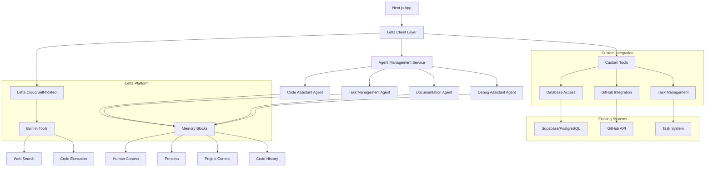

# Design Document

## Overview

This design outlines the integration of Letta (the AI operating system for stateful agents) into the solomon_codes application to provide advanced agent memory management capabilities. The integration will transform the existing stateless AI interactions into stateful agent experiences that can maintain persistent memory, learn from interactions, and provide contextual assistance across sessions.

The design leverages Letta's self-editing memory architecture, multi-agent systems, and tool calling capabilities while integrating seamlessly with the existing Next.js application, database schema, and task management system.

## Architecture

### Current Architecture
- **AI Integration**: Direct OpenAI API calls with stateless interactions
- **Memory**: No persistent memory between conversations
- **Context**: Limited to current conversation thread
- **Tools**: Basic function calling without persistent state

### Target Architecture with Letta
- **Agent Management**: Letta-powered stateful agents with persistent memory
- **Memory Blocks**: Structured memory for persona, human context, and project information
- **Tool Integration**: Enhanced tool calling with memory-aware execution
- **Multi-Agent System**: Specialized agents for different development tasks
- **Persistent State**: Agent memory stored in Letta's PostgreSQL backend

### Integration Architecture



## Components and Interfaces

### 1. Letta Client Integration Layer

#### Letta Configuration Service
```typescript
interface LettaConfig {
  // Letta Cloud configuration
  cloud?: {
    apiKey: string;
    baseUrl: string;
  };
  
  // Self-hosted configuration
  selfHosted?: {
    baseUrl: string;
    token?: string;
  };
  
  // Default agent settings
  defaultModel: string;
  defaultEmbedding: string;
  
  // Environment-specific settings
  environment: 'development' | 'production';
}

export class LettaConfigService {
  private config: LettaConfig;
  
  constructor() {
    this.config = this.loadConfig();
  }
  
  private loadConfig(): LettaConfig {
    return {
      cloud: process.env.LETTA_API_KEY ? {
        apiKey: process.env.LETTA_API_KEY,
        baseUrl: 'https://api.letta.com'
      } : undefined,
      
      selfHosted: process.env.LETTA_BASE_URL ? {
        baseUrl: process.env.LETTA_BASE_URL,
        token: process.env.LETTA_TOKEN
      } : undefined,
      
      defaultModel: 'openai/gpt-4.1',
      defaultEmbedding: 'openai/text-embedding-3-small',
      environment: process.env.NODE_ENV as 'development' | 'production'
    };
  }
  
  getClient(): LettaClient {
    if (this.config.cloud) {
      return new LettaClient({ token: this.config.cloud.apiKey });
    } else if (this.config.selfHosted) {
      return new LettaClient({ 
        baseUrl: this.config.selfHosted.baseUrl,
        token: this.config.selfHosted.token 
      });
    }
    throw new Error('No Letta configuration found');
  }
}
```

#### Agent Management Service
```typescript
interface AgentTemplate {
  name: string;
  persona: string;
  tools: string[];
  memoryBlocks: MemoryBlock[];
  description: string;
}

interface MemoryBlock {
  label: string;
  value: string;
  description?: string;
}

export class AgentManagementService {
  private lettaClient: LettaClient;
  private agentCache: Map<string, string> = new Map(); // userId -> agentId
  
  constructor(private configService: LettaConfigService) {
    this.lettaClient = configService.getClient();
  }
  
  async createUserAgent(userId: string, template: AgentTemplate): Promise<string> {
    const agent = await this.lettaClient.agents.create({
      memoryBlocks: [
        {
          label: 'human',
          value: `User ID: ${userId}. This user is a developer working on the solomon_codes project.`
        },
        {
          label: 'persona',
          value: template.persona
        },
        ...template.memoryBlocks
      ],
      tools: [...template.tools, 'web_search', 'run_code'],
      model: this.configService.config.defaultModel,
      embedding: this.configService.config.defaultEmbedding
    });
    
    this.agentCache.set(userId, agent.id);
    return agent.id;
  }
  
  async getUserAgent(userId: string): Promise<string> {
    if (this.agentCache.has(userId)) {
      return this.agentCache.get(userId)!;
    }
    
    // Try to find existing agent or create new one
    const agents = await this.lettaClient.agents.list();
    const userAgent = agents.find(agent => 
      agent.memoryBlocks?.some(block => 
        block.label === 'human' && block.value.includes(userId)
      )
    );
    
    if (userAgent) {
      this.agentCache.set(userId, userAgent.id);
      return userAgent.id;
    }
    
    // Create new agent with default template
    return this.createUserAgent(userId, this.getDefaultTemplate());
  }
  
  private getDefaultTemplate(): AgentTemplate {
    return {
      name: 'Code Assistant',
      persona: 'I am an expert software developer and AI assistant specializing in modern web development. I help with coding, debugging, architecture decisions, and project management. I maintain context about ongoing projects and provide personalized assistance.',
      tools: ['database_query', 'task_management', 'github_integration'],
      memoryBlocks: [
        {
          label: 'project_context',
          value: 'Working on solomon_codes - a Next.js application with AI-powered features, task management, and GitHub integration.',
          description: 'Stores current project context, architecture decisions, and ongoing work'
        },
        {
          label: 'coding_preferences',
          value: 'Prefers TypeScript, modern React patterns, and clean architecture. Uses Tailwind CSS and follows the Better-T-Stack principles.',
          description: 'Stores user coding preferences and style guidelines'
        }
      ],
      description: 'General-purpose coding assistant with project awareness'
    };
  }
}
```

### 2. Custom Tool Integration

#### Database Access Tool
```typescript
export class DatabaseTool {
  constructor(private db: ReturnType<typeof createDatabaseClient>) {}
  
  async queryTasks(userId: string, filters?: TaskFilters): Promise<Task[]> {
    return await this.db.select()
      .from(tasks)
      .where(eq(tasks.userId, userId))
      .limit(filters?.limit || 10);
  }
  
  async createTask(userId: string, taskData: NewTask): Promise<Task> {
    const [task] = await this.db.insert(tasks)
      .values({ ...taskData, userId })
      .returning();
    return task;
  }
  
  async updateTask(taskId: string, updates: TaskUpdate): Promise<Task> {
    const [task] = await this.db.update(tasks)
      .set({ ...updates, updatedAt: new Date() })
      .where(eq(tasks.id, taskId))
      .returning();
    return task;
  }
}

// Register as Letta tool
export function createDatabaseTools(db: ReturnType<typeof createDatabaseClient>) {
  const dbTool = new DatabaseTool(db);
  
  return {
    query_tasks: async (userId: string, filters?: string) => {
      const parsedFilters = filters ? JSON.parse(filters) : {};
      return JSON.stringify(await dbTool.queryTasks(userId, parsedFilters));
    },
    
    create_task: async (userId: string, taskData: string) => {
      const parsed = JSON.parse(taskData);
      return JSON.stringify(await dbTool.createTask(userId, parsed));
    },
    
    update_task: async (taskId: string, updates: string) => {
      const parsed = JSON.parse(updates);
      return JSON.stringify(await dbTool.updateTask(taskId, parsed));
    }
  };
}
```

#### GitHub Integration Tool
```typescript
export class GitHubTool {
  constructor(private githubToken: string) {}
  
  async createPullRequest(repo: string, branch: string, title: string, body: string) {
    // Implementation for creating PR
    const response = await fetch(`https://api.github.com/repos/${repo}/pulls`, {
      method: 'POST',
      headers: {
        'Authorization': `token ${this.githubToken}`,
        'Content-Type': 'application/json'
      },
      body: JSON.stringify({
        title,
        body,
        head: branch,
        base: 'main'
      })
    });
    
    return await response.json();
  }
  
  async getRepositoryInfo(repo: string) {
    const response = await fetch(`https://api.github.com/repos/${repo}`, {
      headers: {
        'Authorization': `token ${this.githubToken}`
      }
    });
    
    return await response.json();
  }
}

export function createGitHubTools(githubToken: string) {
  const githubTool = new GitHubTool(githubToken);
  
  return {
    create_pull_request: async (repo: string, branch: string, title: string, body: string) => {
      return JSON.stringify(await githubTool.createPullRequest(repo, branch, title, body));
    },
    
    get_repository_info: async (repo: string) => {
      return JSON.stringify(await githubTool.getRepositoryInfo(repo));
    }
  };
}
```

### 3. Agent Specialization Templates

#### Code Assistant Agent
```typescript
const CODE_ASSISTANT_TEMPLATE: AgentTemplate = {
  name: 'Code Assistant',
  persona: `I am an expert software developer specializing in TypeScript, React, and Next.js. 
  I help with code review, debugging, architecture decisions, and implementing new features. 
  I maintain awareness of the project structure and coding standards.`,
  tools: ['database_query', 'github_integration', 'web_search', 'run_code'],
  memoryBlocks: [
    {
      label: 'project_architecture',
      value: 'solomon_codes uses Next.js 15, TypeScript, Tailwind CSS, Drizzle ORM, and Supabase. Follows monorepo structure with Turborepo.',
      description: 'Current project architecture and technology stack'
    },
    {
      label: 'coding_standards',
      value: 'Uses Biome for linting, tab indentation, double quotes, and follows clean architecture principles.',
      description: 'Project coding standards and style guidelines'
    }
  ],
  description: 'Specialized agent for code development and review'
};
```

#### Task Management Agent
```typescript
const TASK_MANAGEMENT_TEMPLATE: AgentTemplate = {
  name: 'Task Manager',
  persona: `I am a project management assistant focused on task organization, progress tracking, and workflow optimization. 
  I help break down complex features into manageable tasks and track project progress.`,
  tools: ['database_query', 'task_management', 'github_integration'],
  memoryBlocks: [
    {
      label: 'project_status',
      value: 'Currently working on multiple features including Supabase migration, Letta integration, and production readiness.',
      description: 'Current project status and active initiatives'
    },
    {
      label: 'task_patterns',
      value: 'Tasks typically follow spec-driven development with requirements, design, and implementation phases.',
      description: 'Common task patterns and workflow preferences'
    }
  ],
  description: 'Specialized agent for task and project management'
};
```

#### Documentation Agent
```typescript
const DOCUMENTATION_TEMPLATE: AgentTemplate = {
  name: 'Documentation Assistant',
  persona: `I am a technical writing specialist who helps create clear, comprehensive documentation. 
  I focus on API documentation, user guides, and maintaining up-to-date project documentation.`,
  tools: ['web_search', 'github_integration', 'database_query'],
  memoryBlocks: [
    {
      label: 'documentation_style',
      value: 'Prefers clear, concise documentation with examples. Uses Markdown format and follows established patterns.',
      description: 'Documentation style preferences and standards'
    },
    {
      label: 'project_docs',
      value: 'Project uses Astro Starlight for documentation site. Maintains README files and inline code documentation.',
      description: 'Current documentation structure and tools'
    }
  ],
  description: 'Specialized agent for documentation creation and maintenance'
};
```

### 4. Chat Interface Integration

#### Letta Chat Service
```typescript
export class LettaChatService {
  constructor(
    private agentService: AgentManagementService,
    private configService: LettaConfigService
  ) {}
  
  async sendMessage(userId: string, message: string): Promise<ChatResponse> {
    const agentId = await this.agentService.getUserAgent(userId);
    const client = this.configService.getClient();
    
    const response = await client.agents.messages.create(agentId, {
      messages: [{ role: 'user', content: message }]
    });
    
    return this.formatResponse(response);
  }
  
  async streamMessage(userId: string, message: string): Promise<AsyncIterable<ChatChunk>> {
    const agentId = await this.agentService.getUserAgent(userId);
    const client = this.configService.getClient();
    
    const stream = await client.agents.messages.createStream(agentId, {
      messages: [{ role: 'user', content: message }],
      streamTokens: true
    });
    
    return this.formatStream(stream);
  }
  
  private formatResponse(response: any): ChatResponse {
    const messages: ChatMessage[] = [];
    const toolCalls: ToolCall[] = [];
    
    for (const msg of response.messages) {
      if (msg.messageType === 'assistant_message') {
        messages.push({
          role: 'assistant',
          content: msg.content,
          timestamp: new Date()
        });
      } else if (msg.messageType === 'tool_call_message') {
        toolCalls.push({
          name: msg.toolCall.name,
          arguments: msg.toolCall.arguments,
          result: null // Will be filled by tool_return_message
        });
      } else if (msg.messageType === 'tool_return_message') {
        // Update the last tool call with result
        if (toolCalls.length > 0) {
          toolCalls[toolCalls.length - 1].result = msg.toolReturn;
        }
      }
    }
    
    return { messages, toolCalls };
  }
  
  private async* formatStream(stream: any): AsyncIterable<ChatChunk> {
    for await (const chunk of stream) {
      if (chunk.messageType === 'assistant_message') {
        yield {
          type: 'content',
          content: chunk.content,
          timestamp: new Date()
        };
      } else if (chunk.messageType === 'tool_call_message') {
        yield {
          type: 'tool_call',
          toolName: chunk.toolCall.name,
          arguments: chunk.toolCall.arguments,
          timestamp: new Date()
        };
      } else if (chunk.messageType === 'tool_return_message') {
        yield {
          type: 'tool_result',
          result: chunk.toolReturn,
          timestamp: new Date()
        };
      }
    }
  }
}
```

#### API Route Integration
```typescript
// app/api/chat/letta/route.ts
import { LettaChatService } from '@/lib/letta/chat-service';
import { AgentManagementService } from '@/lib/letta/agent-management';
import { LettaConfigService } from '@/lib/letta/config';

const configService = new LettaConfigService();
const agentService = new AgentManagementService(configService);
const chatService = new LettaChatService(agentService, configService);

export async function POST(req: Request) {
  try {
    const { message, userId, stream = false } = await req.json();
    
    if (stream) {
      const encoder = new TextEncoder();
      const readable = new ReadableStream({
        async start(controller) {
          try {
            for await (const chunk of await chatService.streamMessage(userId, message)) {
              controller.enqueue(encoder.encode(`data: ${JSON.stringify(chunk)}\n\n`));
            }
            controller.close();
          } catch (error) {
            controller.error(error);
          }
        }
      });
      
      return new Response(readable, {
        headers: {
          'Content-Type': 'text/event-stream',
          'Cache-Control': 'no-cache',
          'Connection': 'keep-alive'
        }
      });
    } else {
      const response = await chatService.sendMessage(userId, message);
      return Response.json(response);
    }
  } catch (error) {
    return Response.json({ error: 'Failed to process message' }, { status: 500 });
  }
}
```

## Data Models

### Agent Configuration Schema
```typescript
interface AgentConfig {
  id: string;
  userId: string;
  agentId: string; // Letta agent ID
  template: string;
  memoryBlocks: MemoryBlock[];
  tools: string[];
  isActive: boolean;
  createdAt: Date;
  updatedAt: Date;
}

interface MemoryBlock {
  label: string;
  value: string;
  description?: string;
  lastUpdated: Date;
}

interface ChatSession {
  id: string;
  userId: string;
  agentId: string;
  messages: ChatMessage[];
  toolCalls: ToolCall[];
  createdAt: Date;
  updatedAt: Date;
}

interface ChatMessage {
  role: 'user' | 'assistant';
  content: string;
  timestamp: Date;
  metadata?: Record<string, any>;
}

interface ToolCall {
  name: string;
  arguments: Record<string, any>;
  result: any;
  timestamp: Date;
  executionTime?: number;
}
```

### Database Schema Extensions
```sql
-- Agent configurations table
CREATE TABLE agent_configs (
  id UUID PRIMARY KEY DEFAULT gen_random_uuid(),
  user_id VARCHAR(255) NOT NULL,
  letta_agent_id VARCHAR(255) NOT NULL UNIQUE,
  template VARCHAR(100) NOT NULL,
  memory_blocks JSONB NOT NULL DEFAULT '[]',
  tools JSONB NOT NULL DEFAULT '[]',
  is_active BOOLEAN DEFAULT true,
  created_at TIMESTAMP DEFAULT NOW(),
  updated_at TIMESTAMP DEFAULT NOW()
);

-- Chat sessions table
CREATE TABLE chat_sessions (
  id UUID PRIMARY KEY DEFAULT gen_random_uuid(),
  user_id VARCHAR(255) NOT NULL,
  agent_id VARCHAR(255) REFERENCES agent_configs(letta_agent_id),
  messages JSONB NOT NULL DEFAULT '[]',
  tool_calls JSONB NOT NULL DEFAULT '[]',
  created_at TIMESTAMP DEFAULT NOW(),
  updated_at TIMESTAMP DEFAULT NOW()
);

-- Indexes for performance
CREATE INDEX idx_agent_configs_user_id ON agent_configs(user_id);
CREATE INDEX idx_agent_configs_letta_agent_id ON agent_configs(letta_agent_id);
CREATE INDEX idx_chat_sessions_user_id ON chat_sessions(user_id);
CREATE INDEX idx_chat_sessions_agent_id ON chat_sessions(agent_id);
```

## Error Handling

### Letta Connection Resilience
```typescript
export class LettaErrorHandler {
  private maxRetries = 3;
  private retryDelay = 1000;
  
  async withRetry<T>(operation: () => Promise<T>): Promise<T> {
    let lastError: Error;
    
    for (let attempt = 1; attempt <= this.maxRetries; attempt++) {
      try {
        return await operation();
      } catch (error) {
        lastError = error as Error;
        
        if (attempt === this.maxRetries) {
          throw lastError;
        }
        
        // Exponential backoff
        await new Promise(resolve => 
          setTimeout(resolve, this.retryDelay * Math.pow(2, attempt - 1))
        );
      }
    }
    
    throw lastError!;
  }
  
  handleAgentError(error: any): ChatResponse {
    if (error.message?.includes('agent not found')) {
      return {
        messages: [{
          role: 'assistant',
          content: 'I apologize, but I need to reinitialize my memory. Please try your request again.',
          timestamp: new Date()
        }],
        toolCalls: []
      };
    }
    
    return {
      messages: [{
        role: 'assistant',
        content: 'I encountered an error processing your request. Please try again or contact support if the issue persists.',
        timestamp: new Date()
      }],
      toolCalls: []
    };
  }
}
```

### Tool Execution Safety
```typescript
export class ToolExecutionGuard {
  private allowedTools = new Set([
    'web_search',
    'run_code',
    'database_query',
    'task_management',
    'github_integration'
  ]);
  
  validateToolCall(toolName: string, arguments: any): boolean {
    if (!this.allowedTools.has(toolName)) {
      throw new Error(`Tool ${toolName} is not allowed`);
    }
    
    // Validate arguments based on tool
    switch (toolName) {
      case 'database_query':
        return this.validateDatabaseQuery(arguments);
      case 'github_integration':
        return this.validateGitHubCall(arguments);
      default:
        return true;
    }
  }
  
  private validateDatabaseQuery(args: any): boolean {
    // Ensure no destructive operations
    const query = args.query?.toLowerCase() || '';
    const destructiveKeywords = ['drop', 'delete', 'truncate', 'alter'];
    
    return !destructiveKeywords.some(keyword => query.includes(keyword));
  }
  
  private validateGitHubCall(args: any): boolean {
    // Ensure repository access is authorized
    const repo = args.repo;
    // Add repository whitelist validation
    return typeof repo === 'string' && repo.length > 0;
  }
}
```

## Testing Strategy

### Agent Testing Framework
```typescript
export class AgentTestFramework {
  private testClient: LettaClient;
  private testAgents: Map<string, string> = new Map();
  
  async createTestAgent(template: AgentTemplate): Promise<string> {
    const agent = await this.testClient.agents.create({
      memoryBlocks: template.memoryBlocks,
      tools: template.tools,
      model: 'openai/gpt-4o-mini', // Use cheaper model for testing
      embedding: 'openai/text-embedding-3-small'
    });
    
    this.testAgents.set(template.name, agent.id);
    return agent.id;
  }
  
  async testAgentResponse(agentId: string, message: string): Promise<TestResult> {
    const startTime = Date.now();
    
    try {
      const response = await this.testClient.agents.messages.create(agentId, {
        messages: [{ role: 'user', content: message }]
      });
      
      const endTime = Date.now();
      
      return {
        success: true,
        responseTime: endTime - startTime,
        messageCount: response.messages.length,
        toolCallCount: response.messages.filter(m => m.messageType === 'tool_call_message').length,
        response
      };
    } catch (error) {
      return {
        success: false,
        error: error as Error,
        responseTime: Date.now() - startTime
      };
    }
  }
  
  async cleanupTestAgents(): Promise<void> {
    for (const [name, agentId] of this.testAgents) {
      try {
        await this.testClient.agents.delete(agentId);
      } catch (error) {
        console.warn(`Failed to cleanup test agent ${name}:`, error);
      }
    }
    this.testAgents.clear();
  }
}

interface TestResult {
  success: boolean;
  responseTime: number;
  messageCount?: number;
  toolCallCount?: number;
  response?: any;
  error?: Error;
}
```

### Integration Tests
```typescript
describe('Letta Integration', () => {
  let testFramework: AgentTestFramework;
  let agentService: AgentManagementService;
  
  beforeAll(async () => {
    testFramework = new AgentTestFramework();
    agentService = new AgentManagementService(new LettaConfigService());
  });
  
  afterAll(async () => {
    await testFramework.cleanupTestAgents();
  });
  
  test('should create and interact with code assistant agent', async () => {
    const agentId = await testFramework.createTestAgent(CODE_ASSISTANT_TEMPLATE);
    
    const result = await testFramework.testAgentResponse(
      agentId,
      'Help me create a new React component for displaying tasks'
    );
    
    expect(result.success).toBe(true);
    expect(result.responseTime).toBeLessThan(10000);
    expect(result.messageCount).toBeGreaterThan(0);
  });
  
  test('should maintain memory across conversations', async () => {
    const userId = 'test-user-123';
    const agentId = await agentService.getUserAgent(userId);
    
    // First interaction
    await testFramework.testAgentResponse(agentId, 'My name is John and I prefer TypeScript');
    
    // Second interaction should remember the name
    const result = await testFramework.testAgentResponse(agentId, 'What is my name?');
    
    expect(result.success).toBe(true);
    // Check if response contains the name
    const assistantMessage = result.response?.messages.find(
      m => m.messageType === 'assistant_message'
    );
    expect(assistantMessage?.content.toLowerCase()).toContain('john');
  });
});
```

## Performance Considerations

### Memory Management
- Implement memory block cleanup for inactive agents
- Use efficient memory block updates to avoid unnecessary API calls
- Cache agent IDs to reduce lookup overhead

### Tool Execution Optimization
- Implement tool result caching for expensive operations
- Use connection pooling for database tools
- Implement timeout handling for long-running tools

### Scalability Planning
- Design for horizontal scaling with multiple Letta instances
- Implement agent load balancing for high-traffic scenarios
- Use async processing for non-critical tool executions

## Security Considerations

### Agent Access Control
- Implement user-based agent isolation
- Validate tool permissions before execution
- Sanitize tool inputs and outputs

### Memory Security
- Encrypt sensitive information in memory blocks
- Implement memory access logging
- Regular memory audits for sensitive data

### API Security
- Secure Letta API keys and tokens
- Implement rate limiting for agent interactions
- Monitor for unusual agent behavior patterns

This design provides a comprehensive foundation for integrating Letta's stateful agent capabilities into the solomon_codes application, enabling persistent memory, enhanced AI interactions, and specialized agent workflows.