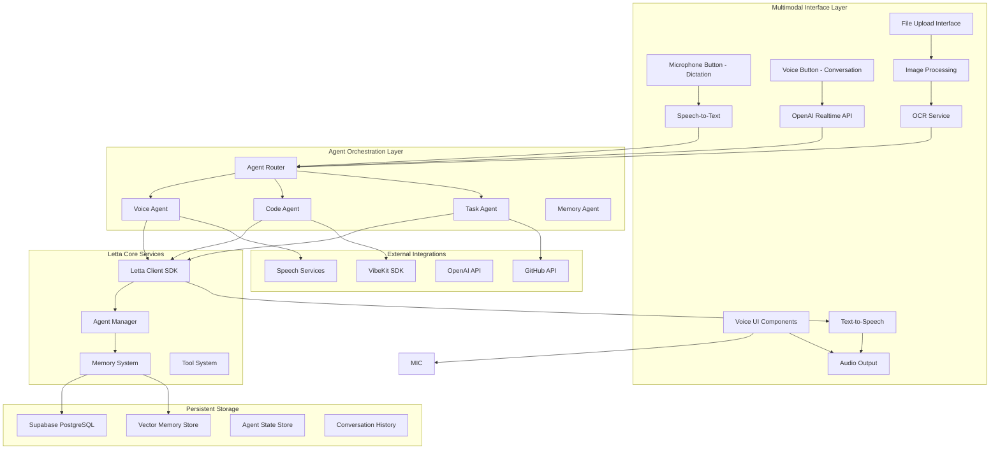

# Letta Voice-First AI Architecture Design

## Overview

This design transforms solomon_codes from a traditional web application into a
voice-first, agent-mediated system where all user interactions flow through
specialized Letta agents. The architecture replaces direct UI-to-API communication
with a conversational AI layer that maintains persistent memory, learns from
interactions, and provides natural voice-based interfaces.

## Architecture

### High-Level Architecture Diagram



## Components and Interfaces

### Voice Interface Layer

#### VoiceDictationButton Component

```typescript
interface VoiceDictationProps {
  onTranscription: (text: string) => void;
  onDictationComplete: (text: string) => void;
  isRecording: boolean;
  transcription?: string;
}

export class VoiceDictationButton {
  private speechRecognition: SpeechRecognition;
  private isRecording: boolean = false;

  async startDictation(): Promise<void>;
  async stopDictation(): Promise<void>;
  async handleSpeechResult(event: SpeechRecognitionEvent): Promise<void>;
  showRecordingFeedback(): void;
}
```

#### VoiceConversationButton Component

```typescript
interface VoiceConversationProps {
  onConversationStart: () => void;
  onConversationEnd: () => void;
  onVoiceMessage: (audioData: ArrayBuffer) => void;
  isInConversation: boolean;
  lettaAgent: LettaAgent;
}

export class VoiceConversationButton {
  private realtimeAPI: OpenAIRealtimeAPI;
  private lettaAgent: LettaAgent;
  private isInConversation: boolean = false;

  async startVoiceConversation(): Promise<void>;
  async endVoiceConversation(): Promise<void>;
  async handleRealtimeAudio(audioData: ArrayBuffer): Promise<void>;
  async streamToLettaAgent(audioData: ArrayBuffer): Promise<void>;
  showConversationFeedback(): void;
}
```

#### OpenAI Realtime API Service

```typescript
interface RealtimeConfig {
  model: string;
  voice: string;
  temperature: number;
  maxTokens: number;
}

export class OpenAIRealtimeService {
  private websocket: WebSocket;
  private lettaAgent: LettaAgent;

  async connect(): Promise<void>;
  async disconnect(): Promise<void>;
  async sendAudio(audioData: ArrayBuffer): Promise<void>;
  async receiveAudio(): Promise<ArrayBuffer>;
  async integrateWithLetta(audioData: ArrayBuffer): Promise<void>;
  handleRealtimeEvents(event: RealtimeEvent): void;
}
```

#### Speech Processing Service

```typescript
interface SpeechConfig {
  language: string;
  voice: string;
  rate: number;
  pitch: number;
  volume: number;
}

export class SpeechProcessingService {
  async speechToText(audioData: ArrayBuffer): Promise<string>;
  async textToSpeech(text: string, config: SpeechConfig): Promise<AudioBuffer>;
  async detectLanguage(audioData: ArrayBuffer): Promise<string>;
  async enhanceAudio(audioData: ArrayBuffer): Promise<ArrayBuffer>;
}
```

### Agent Orchestration Layer

#### Agent Router

```typescript
interface AgentRoute {
  pattern: RegExp;
  agent: AgentType;
  priority: number;
}

export class AgentRouter {
  private routes: AgentRoute[];
  private agents: Map<AgentType, LettaAgent>;

  async routeMessage(
    message: string,
    context: ConversationContext,
  ): Promise<LettaAgent>;
  async handleAgentHandoff(
    fromAgent: LettaAgent,
    toAgent: LettaAgent,
    context: any,
  ): Promise<void>;
  registerAgent(type: AgentType, agent: LettaAgent): void;
}
```

#### Specialized Agents

##### Voice Agent

```typescript
export class VoiceAgent extends LettaAgent {
  constructor() {
    super({
      name: "VoiceAssistant",
      memoryBlocks: [
        {
          label: "persona",
          value:
            "I am a helpful voice assistant that specializes in natural conversation and helping users navigate the solomon_codes platform through speech and visual content analysis.",
        },
        {
          label: "human",
          value:
            "User preferences and conversation context will be stored here.",
        },
        {
          label: "voice_preferences",
          value:
            "User's voice interaction preferences, language, and accessibility needs.",
          description:
            "Stores voice-specific user preferences and accessibility requirements",
        },
        {
          label: "visual_memory",
          value:
            "Stores descriptions and analysis of images and screenshots shared by the user.",
          description:
            "Maintains context about visual content shared in conversations",
        },
      ],
      tools: [
        "speech_to_text",
        "text_to_speech",
        "route_to_agent",
        "update_voice_preferences",
        "analyze_image",
        "extract_text_from_image",
      ],
    });
  }

  async processVoiceInput(audioData: ArrayBuffer): Promise<AgentResponse>;
  async generateVoiceResponse(text: string): Promise<AudioBuffer>;
  async routeToSpecializedAgent(intent: string, context: any): Promise<void>;
  async processImageUpload(imageData: ArrayBuffer): Promise<ImageAnalysis>;
  async combineVoiceAndVisual(voiceInput: string, imageAnalysis: ImageAnalysis): Promise<AgentResponse>;
}
```

##### Code Agent

```typescript
export class CodeAgent extends LettaAgent {
  constructor() {
    super({
      name: "CodeAssistant",
      memoryBlocks: [
        {
          label: "persona",
          value:
            "I am an expert coding assistant that helps users generate, review, and manage code using VibeKit integration while maintaining conversation context. I can analyze screenshots of UIs, code, and design mockups to provide specific implementation guidance.",
        },
        {
          label: "human",
          value: "User's coding preferences, skill level, and project context.",
        },
        {
          label: "coding_context",
          value:
            "Current project details, repository information, and coding session context.",
          description:
            "Maintains context about current coding projects and user preferences",
        },
        {
          label: "visual_code_context",
          value:
            "Screenshots and visual references of UIs, designs, and code that inform implementation decisions.",
          description:
            "Stores visual context for code generation and UI implementation",
        },
      ],
      tools: [
        "vibekit_generate",
        "github_operations",
        "code_review",
        "project_analysis",
        "analyze_ui_screenshot",
        "extract_code_from_image",
        "generate_from_mockup",
      ],
    });
  }

  async generateCode(
    prompt: string,
    context: CodingContext,
  ): Promise<CodeGenerationResult>;
  async reviewCode(code: string): Promise<CodeReview>;
  async integrateWithVibeKit(task: Task): Promise<VibeKitResult>;
  async analyzeUIScreenshot(imageData: ArrayBuffer): Promise<UIAnalysis>;
  async generateFromMockup(mockupAnalysis: ImageAnalysis, requirements: string): Promise<CodeGenerationResult>;
  async extractCodeFromScreenshot(imageData: ArrayBuffer): Promise<string>;
}
```

##### Task Agent

```typescript
export class TaskAgent extends LettaAgent {
  constructor() {
    super({
      name: "TaskManager",
      memoryBlocks: [
        {
          label: "persona",
          value:
            "I am a task management specialist that helps users organize projects, track progress, and coordinate with GitHub repositories.",
        },
        {
          label: "human",
          value:
            "User's project management style, priorities, and workflow preferences.",
        },
        {
          label: "project_context",
          value:
            "Current projects, repositories, tasks, and organizational context.",
          description:
            "Maintains comprehensive project and task management context",
        },
      ],
      tools: [
        "github_integration",
        "task_management",
        "project_organization",
        "progress_tracking",
      ],
    });
  }

  async createTask(description: string): Promise<Task>;
  async manageProject(projectId: string): Promise<ProjectStatus>;
  async syncWithGitHub(repository: string): Promise<SyncResult>;
}
```

### Letta Integration Layer

#### Enhanced Letta Client

```typescript
export class EnhancedLettaClient {
  private client: LettaClient;
  private supabaseClient: SupabaseClient;
  private vectorStore: VectorStore;

  constructor(config: LettaConfig) {
    this.client = new LettaClient(config);
    this.supabaseClient = createClient(
      config.supabase.url,
      config.supabase.key,
    );
    this.vectorStore = new VectorStore(this.supabaseClient);
  }

  async createAgent(config: AgentConfig): Promise<LettaAgent>;
  async sendMessage(agentId: string, message: string): Promise<AgentResponse>;
  async streamMessage(
    agentId: string,
    message: string,
  ): AsyncIterator<AgentResponseChunk>;
  async updateMemory(
    agentId: string,
    memoryUpdate: MemoryUpdate,
  ): Promise<void>;
  async searchMemory(
    agentId: string,
    query: string,
  ): Promise<MemorySearchResult[]>;
}
```

#### Memory Management System

```typescript
interface MemoryBlock {
  id: string;
  label: string;
  value: string;
  description?: string;
  embedding?: number[];
  importance: number;
  lastAccessed: Date;
  createdAt: Date;
}

export class MemoryManager {
  private supabase: SupabaseClient;
  private vectorStore: VectorStore;

  async storeMemory(agentId: string, memory: MemoryBlock): Promise<void>;
  async retrieveMemory(agentId: string, query: string): Promise<MemoryBlock[]>;
  async updateMemoryImportance(
    memoryId: string,
    importance: number,
  ): Promise<void>;
  async archiveOldMemories(
    agentId: string,
    retentionPolicy: RetentionPolicy,
  ): Promise<void>;
  async generateMemoryEmbeddings(text: string): Promise<number[]>;
}
```

### Data Models

#### Agent Configuration

```typescript
interface AgentConfig {
  name: string;
  type: AgentType;
  memoryBlocks: MemoryBlock[];
  tools: string[];
  model: string;
  embedding: string;
  systemPrompt?: string;
  temperature?: number;
}

enum AgentType {
  VOICE = "voice",
  CODE = "code",
  TASK = "task",
  MEMORY = "memory",
  ORCHESTRATOR = "orchestrator",
}
```

#### Conversation Context

```typescript
interface ConversationContext {
  sessionId: string;
  userId: string;
  agentId: string;
  conversationHistory: Message[];
  currentIntent: string;
  metadata: Record<string, any>;
  voicePreferences?: VoicePreferences;
}

interface VoicePreferences {
  language: string;
  voice: string;
  rate: number;
  pitch: number;
  volume: number;
  transcriptionEnabled: boolean;
}
```

#### Agent Response

```typescript
interface AgentResponse {
  messageId: string;
  agentId: string;
  content: string;
  messageType: "assistant_message" | "tool_call_message" | "reasoning_message";
  toolCalls?: ToolCall[];
  memoryUpdates?: MemoryUpdate[];
  audioData?: ArrayBuffer;
  metadata: ResponseMetadata;
}

interface AgentResponseChunk {
  messageId: string;
  chunkId: string;
  content: string;
  isComplete: boolean;
  audioChunk?: ArrayBuffer;
}
```

#### Multimodal Data Models

```typescript
interface ImageMetadata {
  filename: string;
  size: number;
  mimeType: string;
  dimensions: { width: number; height: number };
  uploadedAt: Date;
  hash: string;
}

interface BoundingBox {
  x: number;
  y: number;
  width: number;
  height: number;
}

interface UploadResult {
  fileId: string;
  filename: string;
  url: string;
  analysis?: ImageAnalysis;
  error?: string;
}

interface UIAnalysis {
  components: UIComponent[];
  layout: LayoutInfo;
  designSystem: DesignSystemInfo;
  accessibility: AccessibilityInfo;
}

interface UIComponent {
  type: 'button' | 'input' | 'text' | 'image' | 'link' | 'form' | 'navigation';
  bounds: BoundingBox;
  text?: string;
  styles: CSSProperties;
  interactions: InteractionInfo[];
}

interface LayoutInfo {
  type: 'grid' | 'flexbox' | 'absolute' | 'flow';
  structure: LayoutStructure;
  responsive: boolean;
}

interface DesignSystemInfo {
  colors: string[];
  typography: TypographyInfo[];
  spacing: number[];
  components: string[];
}

interface MultimodalMessage {
  id: string;
  content: string;
  attachments: MessageAttachment[];
  voiceData?: ArrayBuffer;
  timestamp: Date;
}

interface MessageAttachment {
  type: 'image' | 'file' | 'audio';
  data: ArrayBuffer;
  metadata: ImageMetadata;
  analysis?: ImageAnalysis;
}
```

## Error Handling

### Voice Processing Errors

```typescript
export class VoiceProcessingError extends Error {
  constructor(
    message: string,
    public code: VoiceErrorCode,
    public recoverable: boolean = true,
  ) {
    super(message);
  }
}

enum VoiceErrorCode {
  MICROPHONE_ACCESS_DENIED = "MICROPHONE_ACCESS_DENIED",
  SPEECH_RECOGNITION_FAILED = "SPEECH_RECOGNITION_FAILED",
  TEXT_TO_SPEECH_FAILED = "TEXT_TO_SPEECH_FAILED",
  AUDIO_PROCESSING_ERROR = "AUDIO_PROCESSING_ERROR",
  NETWORK_ERROR = "NETWORK_ERROR",
}
```

### Agent Communication Errors

```typescript
export class AgentCommunicationError extends Error {
  constructor(
    message: string,
    public agentId: string,
    public errorType: AgentErrorType,
    public retryable: boolean = true,
  ) {
    super(message);
  }
}

enum AgentErrorType {
  AGENT_UNAVAILABLE = "AGENT_UNAVAILABLE",
  MEMORY_ACCESS_ERROR = "MEMORY_ACCESS_ERROR",
  TOOL_EXECUTION_ERROR = "TOOL_EXECUTION_ERROR",
  CONTEXT_OVERFLOW = "CONTEXT_OVERFLOW",
  RATE_LIMIT_EXCEEDED = "RATE_LIMIT_EXCEEDED",
}
```

## Testing Strategy

### Voice Interface Testing

```typescript
describe("VoiceInterface", () => {
  it("should process voice input and route to appropriate agent", async () => {
    const voiceInterface = new VoiceInterface();
    const mockAudioData = new ArrayBuffer(1024);

    const result = await voiceInterface.processVoiceInput(mockAudioData);

    expect(result).toContain("Hello, how can I help you today?");
  });

  it("should handle speech recognition errors gracefully", async () => {
    const voiceInterface = new VoiceInterface();
    const corruptedAudioData = new ArrayBuffer(0);

    await expect(
      voiceInterface.processVoiceInput(corruptedAudioData),
    ).rejects.toThrow(VoiceProcessingError);
  });
});
```

## Implementation Roadmap

### Phase 1: Core Voice Infrastructure

1. **Letta SDK Integration**: Install and configure Letta client with authentication
2. **Voice Components**: Implement microphone button, speech recognition, and text-to-speech services
3. **Basic Voice Agent**: Create initial Letta voice agent with memory blocks
4. **Voice Flow**: Connect microphone button to speech processing and agent communication

### Phase 2: Agent Specialization

1. **Specialized Agents**: Implement Code Agent and Task Agent with Letta integration
2. **Agent Orchestration**: Build routing system for different request types
3. **Memory Management**: Enhance memory persistence and context sharing
4. **Integration**: Connect agents with existing VibeKit and GitHub functionality

### Phase 3: Advanced Features

1. **Agent Dashboard**: Build UI for managing agent memory and conversations
2. **Real-time Features**: Implement streaming responses and live transcription
3. **Multi-language Support**: Add language detection and multi-language voice processing
4. **Performance Optimization**: Optimize voice processing and agent response times

### Phase 4: Production Readiness

1. **Security**: Implement voice data encryption and privacy controls
2. **Monitoring**: Add comprehensive logging and performance monitoring
3. **Testing**: Create full test suite for voice interactions and agent behavior
4. **Documentation**: Complete user guides and developer documentation

## Configuration Requirements

### Environment Variables

```bash
# Letta Configuration
LETTA_API_KEY=your_letta_api_key_here
LETTA_BASE_URL=https://api.letta.com  # or self-hosted URL

# Voice Processing
SPEECH_API_KEY=optional_speech_service_key
VOICE_LANGUAGE=en-US
VOICE_RATE=1.0
VOICE_PITCH=1.0

# Agent Configuration
DEFAULT_VOICE_AGENT_MODEL=openai/gpt-4.1
DEFAULT_EMBEDDING_MODEL=openai/text-embedding-3-small
AGENT_MEMORY_RETENTION_DAYS=90
```

### Dependencies

```json
{
  "dependencies": {
    "@letta-ai/letta-client": "^1.0.0",
    "@letta-ai/vercel-ai-sdk-provider": "^1.0.0",
    "ai": "^3.0.0"
  },
  "devDependencies": {
    "@types/web-speech-api": "^0.0.1"
  }
}
```

This comprehensive design provides the foundation for implementing voice-first functionality with Letta agents, ensuring seamless integration with existing systems while providing advanced conversational AI capabilities.

### Agent Integration Testing

```typescript
describe("AgentOrchestration", () => {
  it("should route coding requests to Code Agent", async () => {
    const router = new AgentRouter();
    const message = "Generate a React component for user authentication";

    const selectedAgent = await router.routeMessage(message, mockContext);

    expect(selectedAgent.type).toBe(AgentType.CODE);
  });

  it("should maintain context during agent handoffs", async () => {
    const voiceAgent = new VoiceAgent();
    const codeAgent = new CodeAgent();

    const handoffResult = await router.handleAgentHandoff(
      voiceAgent,
      codeAgent,
      { userRequest: "help me code", projectContext: "React app" },
    );

    expect(handoffResult.contextPreserved).toBe(true);
  });
});
```
