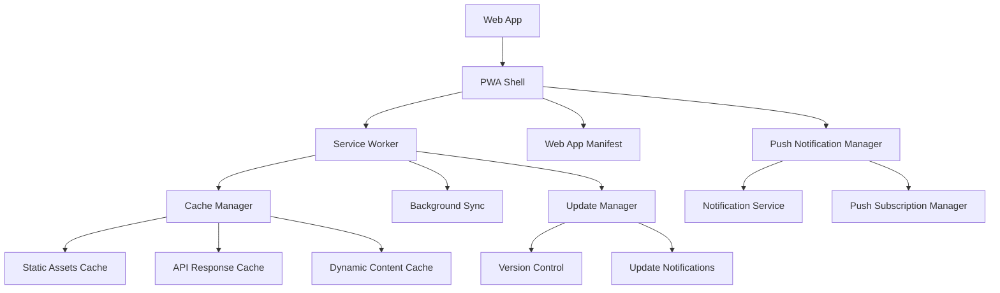

# Design Document

## Overview

This design outlines the implementation of Progressive Web App (PWA) capabilities for the solomon_codes web application. The solution will build upon the existing basic manifest file and implement a comprehensive PWA architecture including service worker registration, caching strategies, offline functionality, push notifications, and native app-like features.

The design leverages Next.js 15's built-in PWA capabilities while implementing custom service worker logic for advanced caching and offline functionality. The implementation will be production-ready with proper error handling, performance optimization, and cross-platform compatibility.

## Architecture

### High-Level Architecture



### Service Worker Architecture

The service worker will implement a multi-layered caching strategy:

1. **App Shell Cache**: Critical static assets (HTML, CSS, JS)
2. **API Cache**: Dynamic API responses with TTL-based invalidation
3. **Asset Cache**: Images, fonts, and other static resources
4. **Background Sync**: Queue failed requests for retry when online

### PWA Components Integration

- **Manifest Enhancement**: Extend existing manifest with comprehensive metadata
- **Service Worker Registration**: Client-side registration with update handling
- **Cache Strategies**: Implement cache-first, network-first, and stale-while-revalidate patterns
- **Push Notifications**: Server-side push service integration
- **Install Prompts**: Custom install experience with user engagement tracking

## Components and Interfaces

### 1. PWA Configuration Module

**Location**: `src/lib/pwa/config.ts`

```typescript
interface PWAConfig {
  cacheVersion: string;
  cacheName: string;
  staticAssets: string[];
  apiEndpoints: CacheableEndpoint[];
  notificationConfig: NotificationConfig;
  updateStrategy: UpdateStrategy;
}

interface CacheableEndpoint {
  pattern: RegExp;
  strategy: CacheStrategy;
  ttl?: number;
}

type CacheStrategy = 'cache-first' | 'network-first' | 'stale-while-revalidate';
```

### 2. Service Worker Manager

**Location**: `src/lib/pwa/service-worker-manager.ts`

```typescript
class ServiceWorkerManager {
  register(): Promise<ServiceWorkerRegistration>;
  unregister(): Promise<boolean>;
  checkForUpdates(): Promise<boolean>;
  skipWaiting(): Promise<void>;
  postMessage(message: any): void;
}
```

### 3. Cache Manager

**Location**: `src/lib/pwa/cache-manager.ts`

```typescript
class CacheManager {
  precacheAssets(assets: string[]): Promise<void>;
  cacheResponse(request: Request, response: Response): Promise<void>;
  getCachedResponse(request: Request): Promise<Response | null>;
  clearExpiredCache(): Promise<void>;
  getCacheSize(): Promise<number>;
}
```

### 4. Push Notification Manager

**Location**: `src/lib/pwa/push-manager.ts`

```typescript
interface PushManager {
  requestPermission(): Promise<NotificationPermission>;
  subscribe(): Promise<PushSubscription>;
  unsubscribe(): Promise<boolean>;
  sendNotification(payload: NotificationPayload): Promise<void>;
}

interface NotificationPayload {
  title: string;
  body: string;
  icon?: string;
  badge?: string;
  actions?: NotificationAction[];
  data?: any;
}
```

### 5. Install Prompt Manager

**Location**: `src/lib/pwa/install-manager.ts`

```typescript
class InstallManager {
  canInstall(): boolean;
  showInstallPrompt(): Promise<boolean>;
  trackInstallEvent(): void;
  isInstalled(): boolean;
}
```

### 6. PWA Provider Component

**Location**: `src/components/providers/pwa-provider.tsx`

```typescript
interface PWAContextValue {
  isOnline: boolean;
  isInstalled: boolean;
  canInstall: boolean;
  hasUpdate: boolean;
  installApp: () => Promise<void>;
  updateApp: () => Promise<void>;
  enableNotifications: () => Promise<boolean>;
}
```

## Data Models

### 1. Cache Entry Model

```typescript
interface CacheEntry {
  url: string;
  response: Response;
  timestamp: number;
  ttl: number;
  strategy: CacheStrategy;
}
```

### 2. Push Subscription Model

```typescript
interface PushSubscriptionData {
  endpoint: string;
  keys: {
    p256dh: string;
    auth: string;
  };
  userId?: string;
  deviceInfo: DeviceInfo;
  createdAt: Date;
}
```

### 3. Update Notification Model

```typescript
interface UpdateNotification {
  version: string;
  features: string[];
  isRequired: boolean;
  releaseNotes: string;
}
```

## Error Handling

### Service Worker Error Handling

1. **Registration Failures**: Graceful degradation with fallback to regular web app
2. **Cache Failures**: Automatic fallback to network requests
3. **Update Failures**: Retry mechanism with exponential backoff
4. **Push Notification Failures**: Silent failure with user notification

### Client-Side Error Handling

```typescript
interface PWAErrorHandler {
  handleServiceWorkerError(error: Error): void;
  handleCacheError(error: Error): void;
  handlePushError(error: Error): void;
  handleInstallError(error: Error): void;
}
```

### Error Recovery Strategies

- **Cache Corruption**: Automatic cache clearing and regeneration
- **Service Worker Update Conflicts**: Force refresh with user consent
- **Network Failures**: Queue operations for background sync
- **Permission Denials**: Graceful feature degradation

## Testing Strategy

### Unit Testing

1. **Service Worker Logic**: Test caching strategies and message handling
2. **Cache Manager**: Test cache operations and TTL handling
3. **Push Manager**: Test subscription and notification logic
4. **Install Manager**: Test install prompt and tracking

### Integration Testing

1. **PWA Provider**: Test context state management
2. **Service Worker Registration**: Test registration flow
3. **Cache Strategies**: Test different caching patterns
4. **Update Flow**: Test app update mechanisms

### End-to-End Testing

1. **Install Flow**: Test complete app installation process
2. **Offline Functionality**: Test app behavior without network
3. **Push Notifications**: Test notification delivery and interaction
4. **Update Process**: Test seamless app updates

### Performance Testing

1. **Cache Performance**: Measure cache hit rates and response times
2. **Bundle Size Impact**: Ensure PWA features don't significantly increase bundle size
3. **Memory Usage**: Monitor service worker memory consumption
4. **Battery Impact**: Test background sync and push notification efficiency

### Browser Compatibility Testing

- **Chrome/Edge**: Full PWA feature support
- **Firefox**: Core PWA features with fallbacks
- **Safari**: Limited PWA support with graceful degradation
- **Mobile Browsers**: Touch-optimized install prompts and notifications

## Implementation Phases

### Phase 1: Core PWA Infrastructure
- Enhanced manifest configuration
- Service worker registration and basic caching
- Offline page implementation
- Install prompt integration

### Phase 2: Advanced Caching
- Multi-strategy cache implementation
- Background sync for failed requests
- Cache management and cleanup
- Performance optimization

### Phase 3: Push Notifications
- Push subscription management
- Server-side push service integration
- Notification handling and actions
- User preference management

### Phase 4: Native Integration
- Share target implementation
- File handling capabilities
- OS theme integration
- Advanced PWA features

## Security Considerations

### Service Worker Security
- Secure HTTPS-only operation
- Content Security Policy compliance
- Cross-origin request handling
- Cache poisoning prevention

### Push Notification Security
- VAPID key implementation
- Subscription validation
- Payload encryption
- User consent management

### Data Privacy
- Cache data encryption for sensitive content
- User tracking consent
- Notification permission transparency
- Data retention policies

## Performance Optimization

### Caching Optimization
- Intelligent cache size management
- Selective asset caching based on usage patterns
- Cache compression for large responses
- Background cache updates

### Service Worker Optimization
- Minimal service worker bundle size
- Efficient message passing
- Lazy loading of non-critical features
- Memory leak prevention

### Network Optimization
- Smart background sync scheduling
- Bandwidth-aware caching strategies
- Progressive enhancement for slow networks
- Offline-first architecture where appropriate