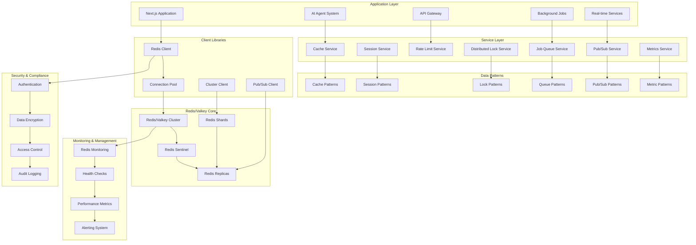

# Design Document

## Overview

This design implements a comprehensive Redis/Valkey integration that serves as a high-performance, in-memory data infrastructure for the ambient agent architecture. The system provides caching, session management, real-time communication, distributed coordination, and analytics capabilities that complement the existing PostgreSQL + ElectricSQL database architecture.

The design emphasizes performance, scalability, and reliability while maintaining compatibility with both Redis and Valkey deployments. The architecture supports horizontal scaling, high availability, and seamless integration with existing observability and monitoring infrastructure.

## Architecture

### High-Level Architecture Diagram



### Data Flow Architecture

1. **Cache Operations**: Application → Cache Service → Redis Client → Redis Cluster → Data Storage
2. **Session Management**: User Request → Session Service → Redis Session Store → Session Validation
3. **Real-time Communication**: Event Generation → Pub/Sub Service → Redis Pub/Sub → Client Notifications
4. **Distributed Coordination**: Lock Request → Lock Service → Redis Distributed Lock → Operation Coordination
5. **Rate Limiting**: API Request → Rate Limit Service → Redis Counters → Rate Decision
6. **Job Processing**: Job Submission → Job Queue Service → Redis Queue → Background Processing

## Components and Interfaces

### Core Redis/Valkey Client (`/lib/redis/redis-client.ts`)

```typescript
import Redis, { Cluster, RedisOptions, ClusterOptions } from "ioredis";
import { ObservabilityService } from "../observability";
import { RedisConfig, RedisConnectionType } from "./types";

export class RedisClientManager {
  private static instance: RedisClientManager;
  private clients = new Map<string, Redis | Cluster>();
  private config: RedisConfig;
  private observability = ObservabilityService.getInstance();

  private constructor(config: RedisConfig) {
    this.config = config;
  }

  static getInstance(config?: RedisConfig): RedisClientManager {
    if (!RedisClientManager.instance) {
      if (!config) {
        throw new Error(
          "RedisClientManager requires configuration on first initialization",
        );
      }
      RedisClientManager.instance = new RedisClientManager(config);
    }
    return RedisClientManager.instance;
  }

  async initialize(): Promise<void> {
    return this.observability.trackOperation("redis.initialize", async () => {
      // Initialize primary client
      const primaryClient = await this.createClient(
        "primary",
        this.config.primary,
      );
      this.clients.set("primary", primaryClient);

      // Initialize replica clients if configured
      if (this.config.replicas) {
        for (const [name, replicaConfig] of Object.entries(
          this.config.replicas,
        )) {
          const replicaClient = await this.createClient(name, replicaConfig);
          this.clients.set(name, replicaClient);
        }
      }

      // Initialize pub/sub client
      if (this.config.pubsub) {
        const pubsubClient = await this.createClient(
          "pubsub",
          this.config.pubsub,
        );
        this.clients.set("pubsub", pubsubClient);
      }

      console.log("Redis/Valkey clients initialized successfully");
    });
  }

  private async createClient(
    name: string,
    config: RedisConnectionConfig,
  ): Promise<Redis | Cluster> {
    const clientConfig: RedisOptions = {
      host: config.host,
      port: config.port,
      password: config.password,
      db: config.database || 0,
      retryDelayOnFailover: 100,
      maxRetriesPerRequest: 3,
      lazyConnect: true,
      keepAlive: 30000,
      connectTimeout: 10000,
      commandTimeout: 5000,
      ...config.options,
    };

    let client: Redis | Cluster;

    if (config.type === "cluster") {
      const clusterConfig: ClusterOptions = {
        ...clientConfig,
        redisOptions: clientConfig,
        enableOfflineQueue: false,
        maxRedirections: 16,
        retryDelayOnFailover: 100,
      };
      client = new Cluster(config.nodes || [], clusterConfig);
    } else {
      client = new Redis(clientConfig);
    }

    // Set up event handlers
    this.setupEventHandlers(client, name);

    // Connect to Redis/Valkey
    await client.connect();

    return client;
  }

  private setupEventHandlers(client: Redis | Cluster, name: string): void {
    client.on("connect", () => {
      console.log(`Redis client '${name}' connected`);
      this.observability.recordMetric("redis.connection.established", 1, {
        client: name,
      });
    });

    client.on("ready", () => {
      console.log(`Redis client '${name}' ready`);
      this.observability.recordMetric("redis.connection.ready", 1, {
        client: name,
      });
    });

    client.on("error", (error) => {
      console.error(`Redis client '${name}' error:`, error);
      this.observability.trackError("redis.connection.error", error, {
        client: name,
      });
    });

    client.on("close", () => {
      console.log(`Redis client '${name}' connection closed`);
      this.observability.recordMetric("redis.connection.closed", 1, {
        client: name,
      });
    });

    client.on("reconnecting", () => {
      console.log(`Redis client '${name}' reconnecting`);
      this.observability.recordMetric("redis.connection.reconnecting", 1, {
        client: name,
      });
    });
  }

  getClient(name: string = "primary"): Redis | Cluster {
    const client = this.clients.get(name);
    if (!client) {
      throw new Error(`Redis client '${name}' not found`);
    }
    return client;
  }

  async executeCommand<T>(
    command: string,
    args: any[],
    clientName: string = "primary",
  ): Promise<T> {
    return this.observability.trackOperation("redis.command", async () => {
      const client = this.getClient(clientName);
      const startTime = Date.now();

      try {
        const result = await client.call(command, ...args);
        const duration = Date.now() - startTime;

        this.observability.recordMetric("redis.command.duration", duration, {
          command,
          client: clientName,
          status: "success",
        });

        return result as T;
      } catch (error) {
        const duration = Date.now() - startTime;

        this.observability.recordMetric("redis.command.duration", duration, {
          command,
          client: clientName,
          status: "error",
        });

        this.observability.trackError("redis.command.error", error as Error, {
          command,
          client: clientName,
        });

        throw error;
      }
    });
  }

  async healthCheck(): Promise<RedisHealthStatus> {
    const healthStatus: RedisHealthStatus = {
      overall: "healthy",
      clients: {},
      timestamp: new Date(),
    };

    for (const [name, client] of this.clients.entries()) {
      try {
        const startTime = Date.now();
        await client.ping();
        const responseTime = Date.now() - startTime;

        healthStatus.clients[name] = {
          status: "healthy",
          responseTime,
          connected: client.status === "ready",
        };
      } catch (error) {
        healthStatus.clients[name] = {
          status: "unhealthy",
          error: (error as Error).message,
          connected: false,
        };
        healthStatus.overall = "degraded";
      }
    }

    return healthStatus;
  }

  async shutdown(): Promise<void> {
    console.log("Shutting down Redis clients...");

    const shutdownPromises = Array.from(this.clients.entries()).map(
      async ([name, client]) => {
        try {
          await client.quit();
          console.log(`Redis client '${name}' shut down successfully`);
        } catch (error) {
          console.error(`Error shutting down Redis client '${name}':`, error);
        }
      },
    );

    await Promise.all(shutdownPromises);
    this.clients.clear();
  }
}

export interface RedisHealthStatus {
  overall: "healthy" | "degraded" | "unhealthy";
  clients: Record<string, ClientHealthStatus>;
  timestamp: Date;
}

export interface ClientHealthStatus {
  status: "healthy" | "unhealthy";
  responseTime?: number;
  connected: boolean;
  error?: string;
}
```

### Cache Service (`/lib/redis/cache-service.ts`)

```typescript
import { RedisClientManager } from "./redis-client";
import { ObservabilityService } from "../observability";
import { CacheOptions, CacheKey, CacheValue } from "./types";

export class CacheService {
  private static instance: CacheService;
  private redisManager: RedisClientManager;
  private observability = ObservabilityService.getInstance();
  private defaultTTL = 3600; // 1 hour

  private constructor() {
    this.redisManager = RedisClientManager.getInstance();
  }

  static getInstance(): CacheService {
    if (!CacheService.instance) {
      CacheService.instance = new CacheService();
    }
    return CacheService.instance;
  }

  async get<T>(key: CacheKey, options?: CacheOptions): Promise<T | null> {
    return this.observability.trackOperation("cache.get", async () => {
      const client = this.redisManager.getClient(options?.clientName);
      const fullKey = this.buildKey(key);

      try {
        const value = await client.get(fullKey);

        if (value === null) {
          this.observability.recordMetric("cache.miss", 1, { key: fullKey });
          return null;
        }

        this.observability.recordMetric("cache.hit", 1, { key: fullKey });
        return JSON.parse(value) as T;
      } catch (error) {
        this.observability.trackError("cache.get.error", error as Error, {
          key: fullKey,
        });
        return null;
      }
    });
  }

  async set<T>(
    key: CacheKey,
    value: CacheValue<T>,
    options?: CacheOptions,
  ): Promise<boolean> {
    return this.observability.trackOperation("cache.set", async () => {
      const client = this.redisManager.getClient(options?.clientName);
      const fullKey = this.buildKey(key);
      const ttl = options?.ttl || this.defaultTTL;

      try {
        const serializedValue = JSON.stringify(value);
        const result = await client.setex(fullKey, ttl, serializedValue);

        this.observability.recordMetric("cache.set", 1, {
          key: fullKey,
          ttl: ttl.toString(),
          status: "success",
        });

        return result === "OK";
      } catch (error) {
        this.observability.trackError("cache.set.error", error as Error, {
          key: fullKey,
        });
        return false;
      }
    });
  }

  async delete(key: CacheKey, options?: CacheOptions): Promise<boolean> {
    return this.observability.trackOperation("cache.delete", async () => {
      const client = this.redisManager.getClient(options?.clientName);
      const fullKey = this.buildKey(key);

      try {
        const result = await client.del(fullKey);

        this.observability.recordMetric("cache.delete", 1, {
          key: fullKey,
          status: "success",
        });

        return result > 0;
      } catch (error) {
        this.observability.trackError("cache.delete.error", error as Error, {
          key: fullKey,
        });
        return false;
      }
    });
  }

  async mget<T>(
    keys: CacheKey[],
    options?: CacheOptions,
  ): Promise<(T | null)[]> {
    return this.observability.trackOperation("cache.mget", async () => {
      const client = this.redisManager.getClient(options?.clientName);
      const fullKeys = keys.map((key) => this.buildKey(key));

      try {
        const values = await client.mget(...fullKeys);

        return values.map((value, index) => {
          if (value === null) {
            this.observability.recordMetric("cache.miss", 1, {
              key: fullKeys[index],
            });
            return null;
          }

          this.observability.recordMetric("cache.hit", 1, {
            key: fullKeys[index],
          });
          return JSON.parse(value) as T;
        });
      } catch (error) {
        this.observability.trackError("cache.mget.error", error as Error, {
          keys: fullKeys,
        });
        return keys.map(() => null);
      }
    });
  }

  async mset<T>(
    entries: Array<{ key: CacheKey; value: CacheValue<T>; ttl?: number }>,
    options?: CacheOptions,
  ): Promise<boolean> {
    return this.observability.trackOperation("cache.mset", async () => {
      const client = this.redisManager.getClient(options?.clientName);

      try {
        const pipeline = client.pipeline();

        entries.forEach(({ key, value, ttl }) => {
          const fullKey = this.buildKey(key);
          const serializedValue = JSON.stringify(value);
          const finalTTL = ttl || this.defaultTTL;

          pipeline.setex(fullKey, finalTTL, serializedValue);
        });

        const results = await pipeline.exec();
        const success =
          results?.every(
            ([error, result]) => error === null && result === "OK",
          ) || false;

        this.observability.recordMetric("cache.mset", 1, {
          count: entries.length.toString(),
          status: success ? "success" : "error",
        });

        return success;
      } catch (error) {
        this.observability.trackError("cache.mset.error", error as Error, {
          count: entries.length,
        });
        return false;
      }
    });
  }

  async invalidatePattern(
    pattern: string,
    options?: CacheOptions,
  ): Promise<number> {
    return this.observability.trackOperation(
      "cache.invalidate_pattern",
      async () => {
        const client = this.redisManager.getClient(options?.clientName);
        const fullPattern = this.buildKey(pattern);

        try {
          const keys = await client.keys(fullPattern);

          if (keys.length === 0) {
            return 0;
          }

          const result = await client.del(...keys);

          this.observability.recordMetric("cache.invalidate_pattern", 1, {
            pattern: fullPattern,
            count: result.toString(),
            status: "success",
          });

          return result;
        } catch (error) {
          this.observability.trackError(
            "cache.invalidate_pattern.error",
            error as Error,
            {
              pattern: fullPattern,
            },
          );
          return 0;
        }
      },
    );
  }

  async exists(key: CacheKey, options?: CacheOptions): Promise<boolean> {
    const client = this.redisManager.getClient(options?.clientName);
    const fullKey = this.buildKey(key);

    try {
      const result = await client.exists(fullKey);
      return result > 0;
    } catch (error) {
      this.observability.trackError("cache.exists.error", error as Error, {
        key: fullKey,
      });
      return false;
    }
  }

  async ttl(key: CacheKey, options?: CacheOptions): Promise<number> {
    const client = this.redisManager.getClient(options?.clientName);
    const fullKey = this.buildKey(key);

    try {
      return await client.ttl(fullKey);
    } catch (error) {
      this.observability.trackError("cache.ttl.error", error as Error, {
        key: fullKey,
      });
      return -1;
    }
  }

  async expire(
    key: CacheKey,
    ttl: number,
    options?: CacheOptions,
  ): Promise<boolean> {
    const client = this.redisManager.getClient(options?.clientName);
    const fullKey = this.buildKey(key);

    try {
      const result = await client.expire(fullKey, ttl);
      return result === 1;
    } catch (error) {
      this.observability.trackError("cache.expire.error", error as Error, {
        key: fullKey,
      });
      return false;
    }
  }

  // Specialized caching methods for different use cases
  async cacheApiResponse<T>(
    endpoint: string,
    params: Record<string, any>,
    response: T,
    ttl: number = 300,
  ): Promise<boolean> {
    const key = `api:${endpoint}:${this.hashParams(params)}`;
    return this.set(key, response, { ttl });
  }

  async getCachedApiResponse<T>(
    endpoint: string,
    params: Record<string, any>,
  ): Promise<T | null> {
    const key = `api:${endpoint}:${this.hashParams(params)}`;
    return this.get<T>(key);
  }

  async cacheAgentContext<T>(
    agentId: string,
    context: T,
    ttl: number = 1800,
  ): Promise<boolean> {
    const key = `agent:context:${agentId}`;
    return this.set(key, context, { ttl });
  }

  async getAgentContext<T>(agentId: string): Promise<T | null> {
    const key = `agent:context:${agentId}`;
    return this.get<T>(key);
  }

  async cacheLLMResponse<T>(
    provider: string,
    prompt: string,
    response: T,
    ttl: number = 3600,
  ): Promise<boolean> {
    const key = `llm:${provider}:${this.hashString(prompt)}`;
    return this.set(key, response, { ttl });
  }

  async getCachedLLMResponse<T>(
    provider: string,
    prompt: string,
  ): Promise<T | null> {
    const key = `llm:${provider}:${this.hashString(prompt)}`;
    return this.get<T>(key);
  }

  private buildKey(key: CacheKey): string {
    if (typeof key === "string") {
      return `cache:${key}`;
    }
    return `cache:${key.namespace}:${key.key}`;
  }

  private hashParams(params: Record<string, any>): string {
    const sortedParams = Object.keys(params)
      .sort()
      .reduce(
        (result, key) => {
          result[key] = params[key];
          return result;
        },
        {} as Record<string, any>,
      );

    return this.hashString(JSON.stringify(sortedParams));
  }

  private hashString(str: string): string {
    // Simple hash function for cache keys
    let hash = 0;
    for (let i = 0; i < str.length; i++) {
      const char = str.charCodeAt(i);
      hash = (hash << 5) - hash + char;
      hash = hash & hash; // Convert to 32-bit integer
    }
    return Math.abs(hash).toString(36);
  }
}
```

### Session Service (`/lib/redis/session-service.ts`)

```typescript
import { RedisClientManager } from "./redis-client";
import { ObservabilityService } from "../observability";
import { SessionData, SessionOptions } from "./types";
import { randomUUID } from "crypto";

export class SessionService {
  private static instance: SessionService;
  private redisManager: RedisClientManager;
  private observability = ObservabilityService.getInstance();
  private defaultTTL = 86400; // 24 hours
  private sessionPrefix = "session:";

  private constructor() {
    this.redisManager = RedisClientManager.getInstance();
  }

  static getInstance(): SessionService {
    if (!SessionService.instance) {
      SessionService.instance = new SessionService();
    }
    return SessionService.instance;
  }

  async createSession<T extends SessionData>(
    data: T,
    options?: SessionOptions,
  ): Promise<string> {
    return this.observability.trackOperation("session.create", async () => {
      const sessionId = randomUUID();
      const client = this.redisManager.getClient(options?.clientName);
      const key = this.buildSessionKey(sessionId);
      const ttl = options?.ttl || this.defaultTTL;

      const sessionData = {
        ...data,
        id: sessionId,
        createdAt: new Date(),
        lastAccessedAt: new Date(),
        expiresAt: new Date(Date.now() + ttl * 1000),
      };

      try {
        await client.setex(key, ttl, JSON.stringify(sessionData));

        this.observability.recordMetric("session.created", 1, {
          ttl: ttl.toString(),
          status: "success",
        });

        return sessionId;
      } catch (error) {
        this.observability.trackError("session.create.error", error as Error, {
          sessionId,
        });
        throw error;
      }
    });
  }

  async getSession<T extends SessionData>(
    sessionId: string,
    options?: SessionOptions,
  ): Promise<T | null> {
    return this.observability.trackOperation("session.get", async () => {
      const client = this.redisManager.getClient(options?.clientName);
      const key = this.buildSessionKey(sessionId);

      try {
        const data = await client.get(key);

        if (!data) {
          this.observability.recordMetric("session.miss", 1, { sessionId });
          return null;
        }

        const sessionData = JSON.parse(data) as T;

        // Update last accessed time
        sessionData.lastAccessedAt = new Date();
        await client.setex(
          key,
          await client.ttl(key),
          JSON.stringify(sessionData),
        );

        this.observability.recordMetric("session.hit", 1, { sessionId });
        return sessionData;
      } catch (error) {
        this.observability.trackError("session.get.error", error as Error, {
          sessionId,
        });
        return null;
      }
    });
  }

  async updateSession<T extends SessionData>(
    sessionId: string,
    updates: Partial<T>,
    options?: SessionOptions,
  ): Promise<boolean> {
    return this.observability.trackOperation("session.update", async () => {
      const client = this.redisManager.getClient(options?.clientName);
      const key = this.buildSessionKey(sessionId);

      try {
        const existingData = await client.get(key);

        if (!existingData) {
          this.observability.recordMetric("session.update.not_found", 1, {
            sessionId,
          });
          return false;
        }

        const sessionData = JSON.parse(existingData) as T;
        const updatedData = {
          ...sessionData,
          ...updates,
          lastAccessedAt: new Date(),
        };

        const ttl = await client.ttl(key);
        await client.setex(
          key,
          ttl > 0 ? ttl : this.defaultTTL,
          JSON.stringify(updatedData),
        );

        this.observability.recordMetric("session.updated", 1, {
          sessionId,
          status: "success",
        });

        return true;
      } catch (error) {
        this.observability.trackError("session.update.error", error as Error, {
          sessionId,
        });
        return false;
      }
    });
  }

  async deleteSession(
    sessionId: string,
    options?: SessionOptions,
  ): Promise<boolean> {
    return this.observability.trackOperation("session.delete", async () => {
      const client = this.redisManager.getClient(options?.clientName);
      const key = this.buildSessionKey(sessionId);

      try {
        const result = await client.del(key);

        this.observability.recordMetric("session.deleted", 1, {
          sessionId,
          status: result > 0 ? "success" : "not_found",
        });

        return result > 0;
      } catch (error) {
        this.observability.trackError("session.delete.error", error as Error, {
          sessionId,
        });
        return false;
      }
    });
  }

  async extendSession(
    sessionId: string,
    additionalTTL: number,
    options?: SessionOptions,
  ): Promise<boolean> {
    const client = this.redisManager.getClient(options?.clientName);
    const key = this.buildSessionKey(sessionId);

    try {
      const currentTTL = await client.ttl(key);

      if (currentTTL <= 0) {
        return false;
      }

      const newTTL = currentTTL + additionalTTL;
      const result = await client.expire(key, newTTL);

      this.observability.recordMetric("session.extended", 1, {
        sessionId,
        additionalTTL: additionalTTL.toString(),
        status: result === 1 ? "success" : "failed",
      });

      return result === 1;
    } catch (error) {
      this.observability.trackError("session.extend.error", error as Error, {
        sessionId,
      });
      return false;
    }
  }

  async getActiveSessions(
    pattern?: string,
    options?: SessionOptions,
  ): Promise<string[]> {
    const client = this.redisManager.getClient(options?.clientName);
    const searchPattern = pattern
      ? `${this.sessionPrefix}${pattern}*`
      : `${this.sessionPrefix}*`;

    try {
      const keys = await client.keys(searchPattern);
      return keys.map((key) => key.replace(this.sessionPrefix, ""));
    } catch (error) {
      this.observability.trackError(
        "session.get_active.error",
        error as Error,
        {
          pattern,
        },
      );
      return [];
    }
  }

  async cleanupExpiredSessions(options?: SessionOptions): Promise<number> {
    return this.observability.trackOperation("session.cleanup", async () => {
      const client = this.redisManager.getClient(options?.clientName);
      const pattern = `${this.sessionPrefix}*`;

      try {
        const keys = await client.keys(pattern);
        let cleanedCount = 0;

        for (const key of keys) {
          const ttl = await client.ttl(key);
          if (ttl <= 0) {
            await client.del(key);
            cleanedCount++;
          }
        }

        this.observability.recordMetric("session.cleanup", 1, {
          cleaned: cleanedCount.toString(),
          total: keys.length.toString(),
        });

        return cleanedCount;
      } catch (error) {
        this.observability.trackError("session.cleanup.error", error as Error);
        return 0;
      }
    });
  }

  private buildSessionKey(sessionId: string): string {
    return `${this.sessionPrefix}${sessionId}`;
  }
}
```

## Integration Points

### OpenTelemetry Integration

The Redis/Valkey system integrates seamlessly with OpenTelemetry for comprehensive observability:

```typescript
// Automatic instrumentation for Redis operations
import { getNodeSDK } from "@opentelemetry/auto-instrumentations-node";
import { IORedisInstrumentation } from "@opentelemetry/instrumentation-ioredis";

const sdk = getNodeSDK({
  instrumentations: [
    new IORedisInstrumentation({
      dbStatementSerializer: (cmdName, cmdArgs) => {
        return `${cmdName} ${cmdArgs.slice(0, 2).join(" ")}`;
      },
    }),
  ],
});
```

### Performance Optimization

The system includes several performance optimization strategies:

- **Connection Pooling**: Efficient connection management and reuse
- **Pipeline Operations**: Batch multiple commands for better throughput
- **Intelligent Caching**: Smart TTL management and cache invalidation
- **Memory Optimization**: Efficient data structures and memory usage monitoring
- **Cluster Support**: Horizontal scaling with Redis Cluster

This design provides a comprehensive, high-performance Redis/Valkey integration that significantly enhances your ambient agent architecture with caching, session management, real-time communication, and distributed coordination capabilities.
