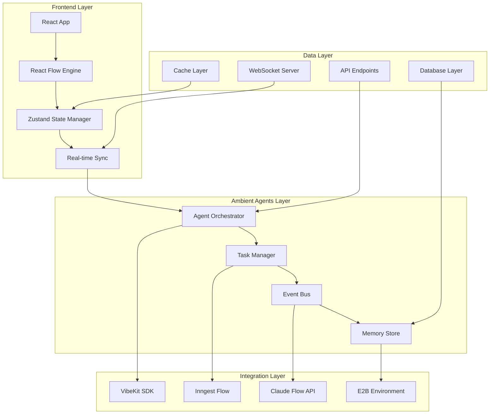

# Enhanced Architecture Specification for CodeClone with Ambient Agents

## Executive Summary

This specification outlines the enhanced architecture for CodeClone, integrating ambient agents visualization with React Flow, performance optimizations, and seamless integration with existing systems including VibeKit SDK, Inngest, and Claude Flow.

## 🎯 Key Enhancements

### 1. Ambient Agents Integration

- **Proactive AI Systems**: Implement LangChain's ambient agents pattern for background task processing
- **Real-time Visualization**: Use React Flow for interactive agent network visualization
- **Push-based Paradigm**: Agents respond to ambient signals rather than explicit requests

### 2. React Flow Visualization Engine

- **Interactive Node-based UI**: Visualize agent networks, task flows, and data streams
- **Custom Node Types**: Agent nodes, task nodes, memory nodes, event nodes
- **Dynamic Layouts**: Hierarchical, force-directed, circular, and custom layouts
- **Real-time Updates**: WebSocket-based live updates with minimal latency

### 3. Performance Optimizations

- **Virtualization**: Handle large agent networks efficiently
- **Level of Detail**: Adaptive detail rendering based on zoom level
- **Efficient Data Structures**: Optimized state management and caching
- **Parallel Processing**: Concurrent operations for better performance

## 🏗️ Architecture Overview



## 📊 Component Architecture

### 1. Ambient Agent System Components

#### Agent Orchestrator (`/src/lib/ambient-agents/orchestrator.ts`)

```typescript
interface AgentOrchestrator {
  // Agent lifecycle management
  createAgent(config: AgentConfig): Promise<Agent>;
  terminateAgent(agentId: string): Promise<void>;

  // Task assignment and coordination
  assignTask(taskId: string, agentId: string): Promise<void>;
  coordinateAgents(workflow: WorkflowDefinition): Promise<void>;

  // Ambient signal processing
  processAmbientSignals(signals: AmbientSignal[]): Promise<void>;

  // Human-in-the-loop patterns
  notifyUser(notification: Notification): Promise<void>;
  requestUserInput(question: Question): Promise<UserResponse>;
  requestReview(reviewRequest: ReviewRequest): Promise<ReviewResponse>;
}
```

#### Task Manager (`/src/lib/ambient-agents/task-manager.ts`)

```typescript
interface TaskManager {
  // Task lifecycle
  createTask(definition: TaskDefinition): Promise<Task>;
  executeTask(taskId: string): Promise<TaskResult>;

  // Dependency management
  resolveDependencies(taskId: string): Promise<Task[]>;

  // Progress tracking
  trackProgress(taskId: string, progress: ProgressUpdate): Promise<void>;

  // Real-time updates
  streamUpdates(taskId: string): AsyncIterator<TaskUpdate>;
}
```

### 2. React Flow Visualization Components

#### Visualization Engine (`/src/components/ambient-agents/visualization-engine.tsx`)

- **Custom Node Types**: Agent, Task, Memory, Event nodes
- **Custom Edge Types**: Data flow, dependency, communication edges
- **Layout Algorithms**: Force-directed, hierarchical, circular
- **Interactive Controls**: Zoom, pan, selection, filtering

#### Node Components

- **AgentNode**: Displays agent status, metrics, current tasks
- **TaskNode**: Shows task progress, dependencies, assignments
- **MemoryNode**: Visualizes memory usage, connections
- **EventNode**: Represents system events and triggers

#### Edge Components

- **AnimatedEdge**: Shows data flow with animation
- **DependencyEdge**: Visualizes task dependencies
- **CommunicationEdge**: Displays agent communications

### 3. Integration Components

#### VibeKit SDK Integration (`/src/lib/integrations/vibekit-integration.ts`)

```typescript
interface VibeKitIntegration {
  // AI model integration
  executeAITask(task: AITask): Promise<AIResult>;

  // E2B environment management
  createSandbox(config: SandboxConfig): Promise<Sandbox>;
  executeSandboxCode(code: string, sandboxId: string): Promise<ExecutionResult>;

  // GitHub integration
  cloneRepository(repoUrl: string): Promise<Repository>;
  commitChanges(changes: FileChange[]): Promise<CommitResult>;
}
```

#### Inngest Integration (`/src/lib/integrations/inngest-integration.ts`)

```typescript
interface InngestIntegration {
  // Background task processing
  createFunction(definition: FunctionDefinition): Promise<Function>;
  triggerFunction(functionId: string, payload: any): Promise<FunctionResult>;

  // Real-time updates
  subscribeToUpdates(functionId: string): AsyncIterator<FunctionUpdate>;

  // Error handling and retry logic
  handleFailure(error: Error, context: ExecutionContext): Promise<void>;
}
```

## 🔄 Data Flow Architecture

### 1. Ambient Signal Processing Flow

```
External Event → Ambient Signal Detection → Agent Activation → Task Creation → Execution → Result → Visualization Update
```

### 2. Real-time Visualization Flow

```
System State Change → WebSocket Event → State Update → React Flow Re-render → UI Update
```

### 3. Human-in-the-Loop Flow

```
Agent Decision Point → Human Input Request → User Interface → User Response → Agent Continuation
```

## 🚀 Performance Optimizations

### 1. Visualization Performance

- **Canvas Virtualization**: Only render visible nodes and edges
- **Level of Detail**: Reduce detail at high zoom levels
- **Batch Updates**: Group state changes for efficient rendering
- **Memoization**: Cache expensive computations

### 2. Data Management

- **Efficient State Management**: Optimized Zustand stores
- **Smart Caching**: Cache frequently accessed data
- **Selective Updates**: Only update changed components
- **Lazy Loading**: Load components on demand

### 3. Network Optimization

- **WebSocket Compression**: Compress real-time data
- **Debounced Updates**: Reduce update frequency
- **Delta Updates**: Send only changes, not full state
- **Connection Pooling**: Reuse connections efficiently

## 📡 API Specifications

### 1. Ambient Agents API (`/api/ambient-agents/`)

#### Endpoints

```typescript
// Agent Management
POST / api / ambient - agents / create;
GET / api / ambient - agents / list;
PUT / api / ambient - agents / { id } / update;
DELETE / api / ambient - agents / { id } / terminate;

// Task Management
POST / api / ambient - agents / tasks / create;
GET / api / ambient - agents / tasks / list;
PUT / api / ambient - agents / tasks / { id } / update;
DELETE / api / ambient - agents / tasks / { id } / cancel;

// Real-time Updates
WebSocket / api / ambient - agents / ws;
```

#### WebSocket Events

```typescript
interface WebSocketEvents {
  "agent.created": AgentCreatedEvent;
  "agent.status.changed": AgentStatusChangedEvent;
  "task.started": TaskStartedEvent;
  "task.progress": TaskProgressEvent;
  "task.completed": TaskCompletedEvent;
  "memory.updated": MemoryUpdatedEvent;
  "communication.established": CommunicationEstablishedEvent;
}
```

### 2. Visualization API (`/api/visualization/`)

#### Endpoints

```typescript
// Visualization Data
GET / api / visualization / data;
POST / api / visualization / layout;
PUT / api / visualization / filters;

// Performance Metrics
GET / api / visualization / metrics;
GET / api / visualization / performance;
```

## 🔧 Configuration

### 1. Environment Variables

```bash
# Ambient Agents Configuration
AMBIENT_AGENTS_ENABLED=true
AMBIENT_AGENTS_MAX_CONCURRENT=10
AMBIENT_AGENTS_TIMEOUT=300000

# React Flow Configuration
REACT_FLOW_ATTRIBUTION=false
REACT_FLOW_PERFORMANCE_MODE=true

# WebSocket Configuration
WS_PING_INTERVAL=30000
WS_PONG_TIMEOUT=5000
WS_MAX_CONNECTIONS=1000
```

### 2. Feature Flags

```typescript
interface FeatureFlags {
  enableAmbientAgents: boolean;
  enableReactFlowVisualization: boolean;
  enablePerformanceMonitoring: boolean;
  enableAdvancedLayouts: boolean;
  enableCollaborativeEditing: boolean;
}
```

## 🧪 Testing Strategy

### 1. Unit Tests

- **Agent Components**: Test individual agent behaviors
- **Task Management**: Test task lifecycle and dependencies
- **Visualization Components**: Test React Flow components
- **Integration Layer**: Test API integrations

### 2. Integration Tests

- **End-to-End Workflows**: Test complete agent workflows
- **Real-time Updates**: Test WebSocket communication
- **Performance Tests**: Test with large datasets
- **Cross-browser Testing**: Test visualization across browsers

### 3. Performance Tests

- **Load Testing**: Test with multiple concurrent agents
- **Memory Usage**: Monitor memory consumption
- **Rendering Performance**: Test visualization performance
- **Network Efficiency**: Test WebSocket efficiency

## 🚀 Deployment Considerations

### 1. Infrastructure Requirements

- **WebSocket Support**: Ensure WebSocket support in deployment
- **Memory Requirements**: Plan for visualization memory usage
- **CPU Requirements**: Plan for agent processing overhead
- **Network Bandwidth**: Plan for real-time updates

### 2. Monitoring and Observability

- **Performance Metrics**: Track visualization performance
- **Agent Metrics**: Monitor agent health and performance
- **Error Tracking**: Comprehensive error monitoring
- **User Experience**: Track user interaction patterns

## 📈 Future Enhancements

### 1. Advanced Features

- **Collaborative Editing**: Multi-user visualization editing
- **Machine Learning**: Predictive agent behavior analysis
- **Advanced Analytics**: Deep insights into agent performance
- **Custom Plugins**: Extensible plugin architecture

### 2. Integration Expansions

- **Additional AI Models**: Support for more AI providers
- **Cloud Platforms**: Integration with cloud services
- **Database Systems**: Support for various databases
- **Monitoring Tools**: Integration with observability platforms

This enhanced architecture provides a solid foundation for building a modern, scalable ambient agents system with powerful visualization capabilities while maintaining high performance and usability.
