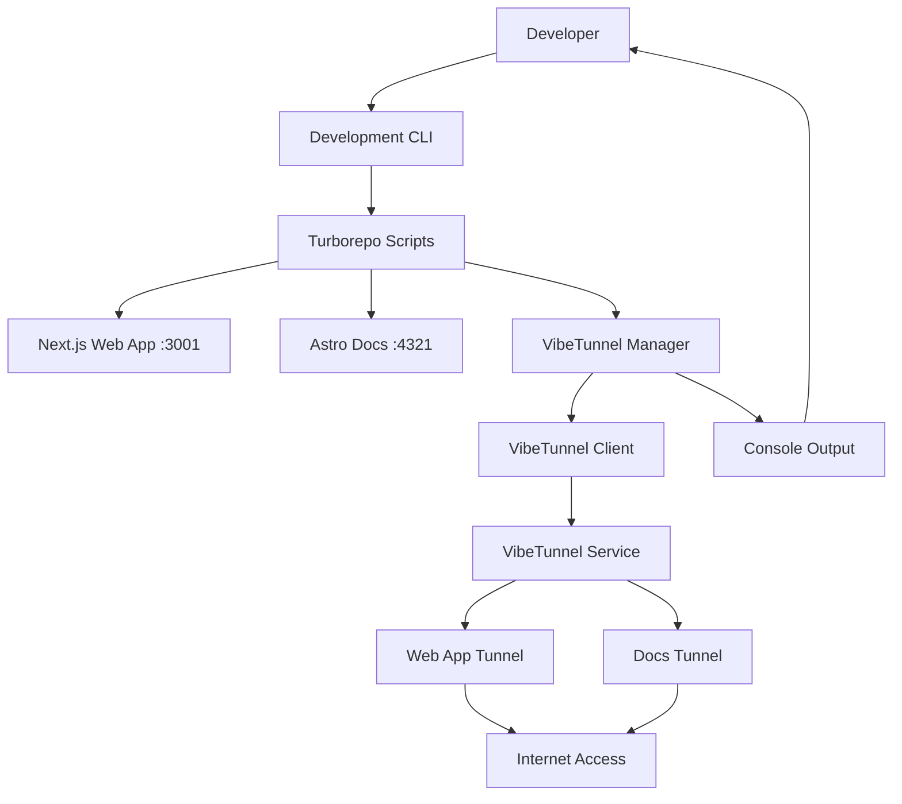

# Design Document

## Overview

The VibeTunnel integration will extend solomon_codes' development workflow by providing secure tunneling capabilities that allow local development servers to be accessed remotely. This integration leverages VibeTunnel's modern tunneling infrastructure to create a seamless developer experience while maintaining security and performance.

The design focuses on:
- Non-intrusive integration with existing development commands
- Flexible configuration through environment variables
- Clear status reporting and error handling
- Support for multiple services (web app, docs)
- Optional activation to preserve existing workflows

## Architecture

### High-Level Architecture



### Integration Points

1. **Package Scripts**: Extend existing `bun dev` commands with optional VibeTunnel startup
2. **Environment Configuration**: Use `.env` files for VibeTunnel settings
3. **Process Management**: Coordinate VibeTunnel lifecycle with development servers
4. **Console Integration**: Enhance development output with tunnel information

## Components and Interfaces

### 1. VibeTunnel Manager (`lib/vibetunnel/manager.ts`)

**Purpose**: Central orchestrator for VibeTunnel operations

**Key Methods**:
```typescript
interface VibeTunnelManager {
  start(services: ServiceConfig[]): Promise<TunnelResult[]>
  stop(): Promise<void>
  getStatus(): TunnelStatus[]
  onStatusChange(callback: (status: TunnelStatus[]) => void): void
}

interface ServiceConfig {
  name: string
  port: number
  subdomain?: string
  auth?: AuthConfig
}

interface TunnelResult {
  service: string
  url: string
  status: 'active' | 'failed' | 'connecting'
  error?: string
}
```

**Responsibilities**:
- Initialize VibeTunnel client connections
- Manage multiple tunnel instances
- Handle connection lifecycle events
- Provide status updates to console output

### 2. Configuration Handler (`lib/vibetunnel/config.ts`)

**Purpose**: Parse and validate VibeTunnel configuration

**Key Methods**:
```typescript
interface VibeTunnelConfig {
  enabled: boolean
  authToken?: string
  subdomain?: string
  security: SecurityConfig
  services: ServiceMapping[]
}

interface SecurityConfig {
  passwordProtection?: string
  ipWhitelist?: string[]
  httpsOnly: boolean
}

function loadConfig(): VibeTunnelConfig
function validateConfig(config: VibeTunnelConfig): ValidationResult
```

**Environment Variables**:
- `VIBETUNNEL_ENABLED`: Enable/disable integration
- `VIBETUNNEL_AUTH_TOKEN`: Authentication token
- `VIBETUNNEL_SUBDOMAIN`: Custom subdomain prefix
- `VIBETUNNEL_PASSWORD`: Password protection
- `VIBETUNNEL_HTTPS_ONLY`: Force HTTPS connections

### 3. Console Integration (`lib/vibetunnel/console.ts`)

**Purpose**: Enhance development console output with tunnel information

**Key Methods**:
```typescript
interface ConsoleIntegration {
  displayTunnelStatus(tunnels: TunnelResult[]): void
  displayStartupMessage(config: VibeTunnelConfig): void
  displayError(error: VibeTunnelError): void
  displayQRCode(url: string): void
}
```

**Features**:
- Colorized console output with clear tunnel URLs
- QR code generation for mobile access
- Real-time status updates
- Copy-to-clipboard functionality hints

### 4. Development Script Extensions

**Purpose**: Integrate VibeTunnel with existing development commands

**Modified Scripts**:
```json
{
  "scripts": {
    "dev": "turbo dev --parallel",
    "dev:web": "turbo dev --filter=web",
    "dev:docs": "turbo dev --filter=docs"
  }
}
```

**Implementation**: Each script will check for VibeTunnel configuration and conditionally start tunneling alongside the development servers.

## Data Models

### Tunnel Configuration Model

```typescript
interface TunnelConfig {
  id: string
  service: string
  localPort: number
  remoteUrl?: string
  subdomain?: string
  auth: {
    token?: string
    password?: string
  }
  security: {
    httpsOnly: boolean
    ipWhitelist: string[]
  }
  status: 'inactive' | 'connecting' | 'active' | 'error'
  createdAt: Date
  lastConnected?: Date
}
```

### Service Mapping Model

```typescript
interface ServiceMapping {
  name: 'web' | 'docs'
  port: number
  path?: string
  subdomain?: string
  enabled: boolean
}
```

### Status Reporting Model

```typescript
interface TunnelStatus {
  service: string
  url: string
  status: 'connecting' | 'active' | 'error' | 'disconnected'
  uptime?: number
  lastError?: string
  metrics: {
    requests: number
    bytesTransferred: number
  }
}
```

## Error Handling

### Error Categories

1. **Configuration Errors**
   - Invalid authentication tokens
   - Malformed environment variables
   - Missing required dependencies

2. **Connection Errors**
   - Network connectivity issues
   - VibeTunnel service unavailability
   - Port conflicts

3. **Runtime Errors**
   - Tunnel disconnections
   - Service restart failures
   - Authentication expiration

### Error Handling Strategy

```typescript
class VibeTunnelError extends Error {
  constructor(
    message: string,
    public code: string,
    public recoverable: boolean,
    public suggestions: string[]
  ) {
    super(message)
  }
}

// Error handling patterns
try {
  await vibeTunnelManager.start(services)
} catch (error) {
  if (error instanceof VibeTunnelError && error.recoverable) {
    console.warn(`VibeTunnel warning: ${error.message}`)
    console.log('Suggestions:', error.suggestions.join(', '))
    // Continue with local development
  } else {
    console.error(`VibeTunnel failed: ${error.message}`)
    // Graceful degradation
  }
}
```

### Graceful Degradation

- If VibeTunnel fails to start, development servers continue normally
- Clear error messages with actionable suggestions
- Automatic retry mechanisms for transient failures
- Fallback to local-only development with appropriate warnings

## Testing Strategy

### Unit Tests

1. **Configuration Parsing**
   - Test environment variable parsing
   - Validate configuration validation logic
   - Test default value assignment

2. **Manager Operations**
   - Test tunnel lifecycle management
   - Mock VibeTunnel client interactions
   - Test error handling scenarios

3. **Console Integration**
   - Test output formatting
   - Verify status update mechanisms
   - Test error message display

### Integration Tests

1. **Development Workflow**
   - Test `bun dev` with VibeTunnel enabled/disabled
   - Verify tunnel startup with development servers
   - Test graceful shutdown procedures

2. **Multi-Service Scenarios**
   - Test simultaneous web app and docs tunneling
   - Verify port conflict resolution
   - Test service restart handling

### End-to-End Tests

1. **Full Development Cycle**
   - Start development with tunneling
   - Verify remote accessibility
   - Test hot reloading through tunnels
   - Verify clean shutdown

2. **Configuration Scenarios**
   - Test various environment variable combinations
   - Verify authentication flows
   - Test security feature activation

### Manual Testing Checklist

- [ ] VibeTunnel starts with `bun dev`
- [ ] Tunnel URLs are accessible remotely
- [ ] Hot reloading works through tunnels
- [ ] Multiple services tunnel correctly
- [ ] Error scenarios display helpful messages
- [ ] Configuration changes take effect
- [ ] Security features function properly
- [ ] Clean shutdown terminates tunnels

## Security Considerations

### Authentication and Authorization

- Secure storage of authentication tokens in environment variables
- Optional password protection for tunnel access
- IP whitelisting capabilities for restricted access
- HTTPS-only mode for encrypted connections

### Data Protection

- Ensure sensitive environment variables are not exposed through tunnels
- Implement request logging controls
- Provide warnings about exposing development data
- Clear documentation about security implications

### Best Practices

- Default to secure configurations
- Provide security status indicators in console output
- Include security recommendations in documentation
- Implement automatic security feature detection

## Performance Considerations

### Startup Performance

- Lazy initialization of VibeTunnel client
- Parallel tunnel establishment for multiple services
- Non-blocking integration with development server startup
- Efficient configuration parsing and validation

### Runtime Performance

- Minimal overhead on development server performance
- Efficient status monitoring without polling
- Optimized console output to avoid spam
- Resource cleanup on shutdown

### Scalability

- Support for multiple concurrent tunnels
- Efficient handling of high-traffic scenarios during development
- Proper resource management for long-running development sessions
- Graceful handling of connection limits

## Implementation Phases

### Phase 1: Core Integration
- Basic VibeTunnel manager implementation
- Environment variable configuration
- Integration with `bun dev` commands
- Basic console output

### Phase 2: Enhanced Features
- Multi-service support
- Advanced configuration options
- Improved error handling and recovery
- Status monitoring and reporting

### Phase 3: Developer Experience
- Enhanced console output with QR codes
- Security feature implementation
- Comprehensive documentation
- Testing suite completion

### Phase 4: Production Readiness
- Performance optimization
- Security hardening
- Edge case handling
- Community feedback integration