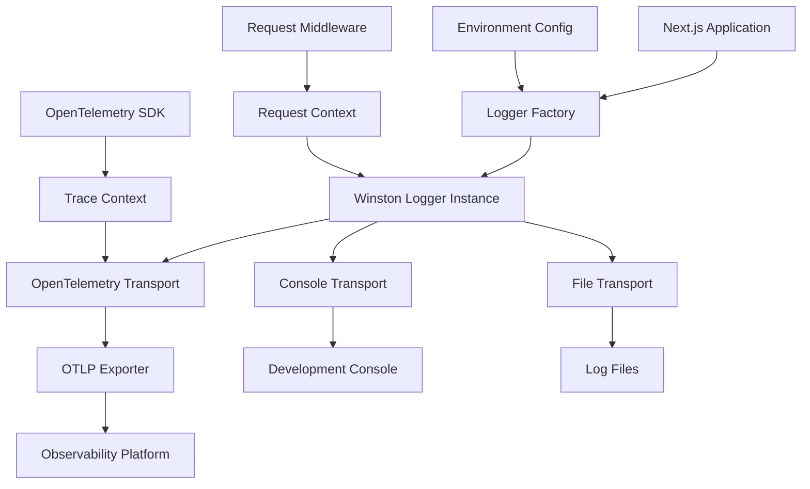

# Design Document

## Overview

This design implements a comprehensive logging solution for the solomon_codes web application using Winston as the primary logging library, enhanced with OpenTelemetry for distributed tracing and observability. The solution integrates seamlessly with the existing Next.js architecture and builds upon the existing telemetry configuration found in the project.

The logging system will provide structured logging, automatic trace correlation, performance monitoring, and configurable output formats suitable for both development and production environments.

## Architecture

### High-Level Architecture



### Component Integration

The logging system integrates with existing project components:

- **Existing Telemetry**: Builds upon the telemetry configuration in `vibekit.ts` and `inngest.ts`
- **Next.js App Router**: Integrates with API routes, server actions, and middleware
- **Environment Configuration**: Uses existing environment variable patterns
- **TypeScript**: Provides full type safety for logging operations

## Components and Interfaces

### Core Logger Interface

```typescript
interface Logger {
  debug(message: string, meta?: LogMetadata): void;
  info(message: string, meta?: LogMetadata): void;
  warn(message: string, meta?: LogMetadata): void;
  error(message: string | Error, meta?: LogMetadata): void;
  child(defaultMeta: LogMetadata): Logger;
}

interface LogMetadata {
  [key: string]: any;
  traceId?: string;
  spanId?: string;
  userId?: string;
  requestId?: string;
  duration?: number;
  statusCode?: number;
}
```

### Configuration Interface

```typescript
interface LoggingConfig {
  level: string;
  format: 'json' | 'pretty';
  transports: TransportConfig[];
  openTelemetry: {
    enabled: boolean;
    serviceName: string;
    serviceVersion: string;
    endpoint?: string;
    headers?: Record<string, string>;
  };
}

interface TransportConfig {
  type: 'console' | 'file' | 'http';
  options: Record<string, any>;
}
```

### Logger Factory

```typescript
class LoggerFactory {
  private static instance: Winston.Logger;
  
  static createLogger(config: LoggingConfig): Winston.Logger;
  static getLogger(): Winston.Logger;
  static createChildLogger(meta: LogMetadata): Winston.Logger;
}
```

### OpenTelemetry Integration

```typescript
class OpenTelemetryTransport extends Winston.Transport {
  constructor(options: OpenTelemetryTransportOptions);
  log(info: Winston.LogEntry, callback: () => void): void;
}

interface OpenTelemetryTransportOptions {
  serviceName: string;
  serviceVersion: string;
  endpoint?: string;
  headers?: Record<string, string>;
}
```

## Data Models

### Log Entry Structure

```typescript
interface LogEntry {
  timestamp: string;
  level: string;
  message: string;
  service: string;
  version: string;
  environment: string;
  traceId?: string;
  spanId?: string;
  userId?: string;
  requestId?: string;
  metadata?: Record<string, any>;
  error?: {
    name: string;
    message: string;
    stack: string;
  };
}
```

### Request Context

```typescript
interface RequestContext {
  requestId: string;
  method: string;
  url: string;
  userAgent?: string;
  userId?: string;
  sessionId?: string;
  startTime: number;
}
```

### Performance Metrics

```typescript
interface PerformanceMetrics {
  operation: string;
  duration: number;
  success: boolean;
  metadata?: Record<string, any>;
}
```

## Error Handling

### Error Logging Strategy

1. **Automatic Error Capture**: Unhandled errors and promise rejections are automatically logged
2. **Structured Error Information**: Errors include stack traces, context, and correlation IDs
3. **Error Classification**: Errors are categorized by type (validation, network, system, etc.)
4. **Fallback Logging**: If primary logging fails, fallback to console logging

### Error Recovery

```typescript
class ErrorHandler {
  static handleUnhandledError(error: Error, context?: RequestContext): void;
  static handlePromiseRejection(reason: any, promise: Promise<any>): void;
  static logError(error: Error, context: LogMetadata): void;
}
```

## Testing Strategy

### Unit Testing

- **Logger Configuration**: Test logger initialization with various configurations
- **Transport Functionality**: Test each transport type independently
- **OpenTelemetry Integration**: Mock OpenTelemetry SDK and verify trace correlation
- **Error Handling**: Test error logging and fallback mechanisms

### Integration Testing

- **API Route Logging**: Test logging in Next.js API routes
- **Server Action Logging**: Test logging in server actions
- **Middleware Integration**: Test request context propagation
- **Performance Monitoring**: Test timing and metrics collection

### Test Structure

```typescript
describe('Winston OpenTelemetry Logger', () => {
  describe('Logger Factory', () => {
    it('should create logger with correct configuration');
    it('should create child loggers with inherited metadata');
    it('should handle invalid configurations gracefully');
  });

  describe('OpenTelemetry Integration', () => {
    it('should include trace context in log entries');
    it('should export traces to configured endpoint');
    it('should handle OpenTelemetry initialization failures');
  });

  describe('Performance Monitoring', () => {
    it('should log request durations');
    it('should identify slow operations');
    it('should collect database query metrics');
  });
});
```

### Mock Strategy

- **OpenTelemetry SDK**: Mock trace and span creation
- **Winston Transports**: Mock transport outputs for verification
- **Environment Variables**: Mock configuration values
- **Next.js Context**: Mock request and response objects

## Implementation Details

### File Structure

```
src/lib/logging/
├── index.ts                 # Main logger export
├── factory.ts              # Logger factory implementation
├── config.ts               # Configuration management
├── transports/
│   ├── console.ts          # Console transport configuration
│   ├── file.ts             # File transport configuration
│   └── opentelemetry.ts    # OpenTelemetry transport
├── middleware/
│   ├── request-logger.ts   # Request logging middleware
│   └── error-handler.ts    # Error handling middleware
├── utils/
│   ├── formatters.ts       # Log formatting utilities
│   └── context.ts          # Context management utilities
└── types.ts                # TypeScript type definitions
```

### Environment Configuration

```typescript
// Environment variables for logging configuration
const config = {
  LOG_LEVEL: process.env.LOG_LEVEL || (process.env.NODE_ENV === 'production' ? 'info' : 'debug'),
  LOG_FORMAT: process.env.LOG_FORMAT || (process.env.NODE_ENV === 'production' ? 'json' : 'pretty'),
  OTEL_ENABLED: process.env.OTEL_ENABLED === 'true' || process.env.NODE_ENV === 'production',
  OTEL_SERVICE_NAME: process.env.OTEL_SERVICE_NAME || 'solomon-codes-web',
  OTEL_SERVICE_VERSION: process.env.OTEL_SERVICE_VERSION || '1.0.0',
  OTEL_EXPORTER_OTLP_ENDPOINT: process.env.OTEL_EXPORTER_OTLP_ENDPOINT || 'http://localhost:4318/v1/traces',
};
```

### Integration Points

1. **Next.js Middleware**: Request logging and context propagation
2. **API Routes**: Automatic request/response logging
3. **Server Actions**: Action execution logging with user context
4. **Error Boundaries**: Client-side error reporting
5. **Background Jobs**: Inngest job execution logging

### Performance Considerations

- **Lazy Initialization**: Logger instances created on-demand
- **Async Logging**: Non-blocking log operations
- **Sampling**: Configurable sampling rates for high-volume environments
- **Buffer Management**: Efficient memory usage for log buffering
- **Transport Optimization**: Batched log transmission for external services