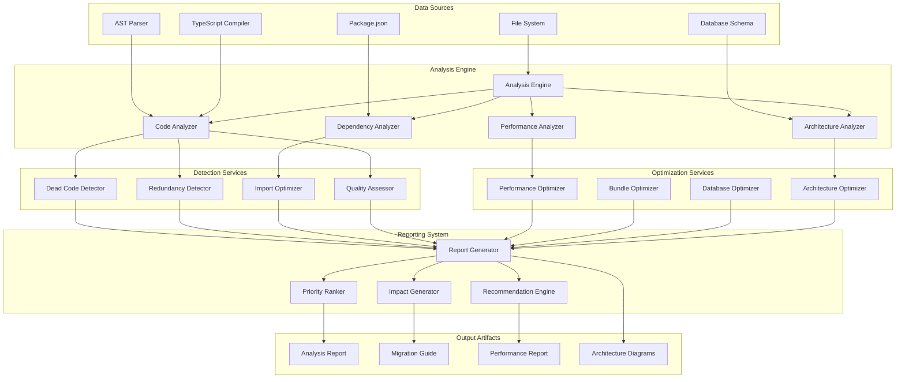
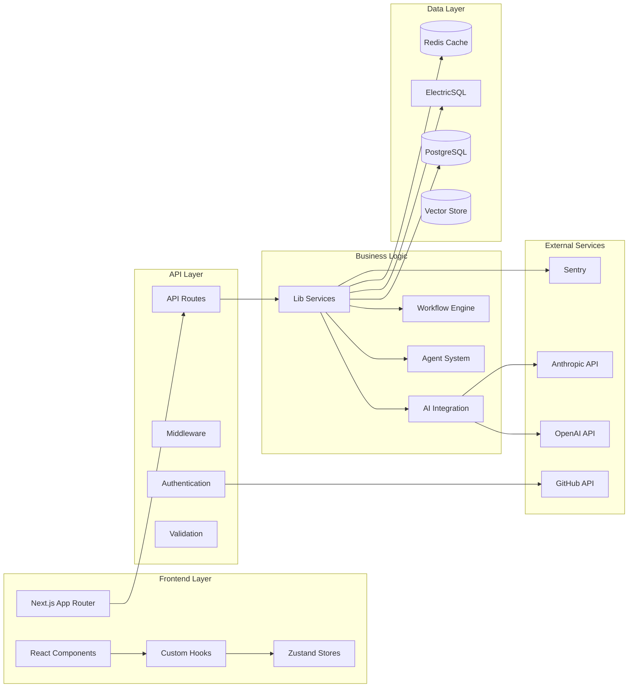
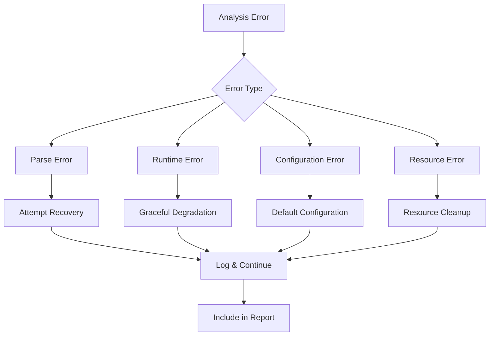
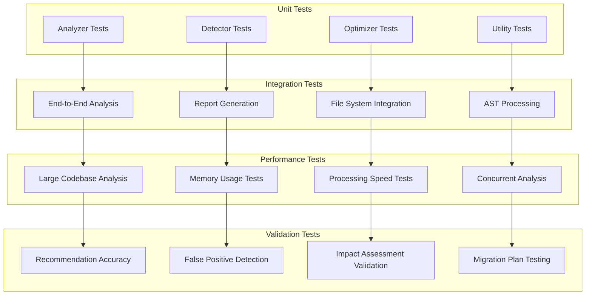
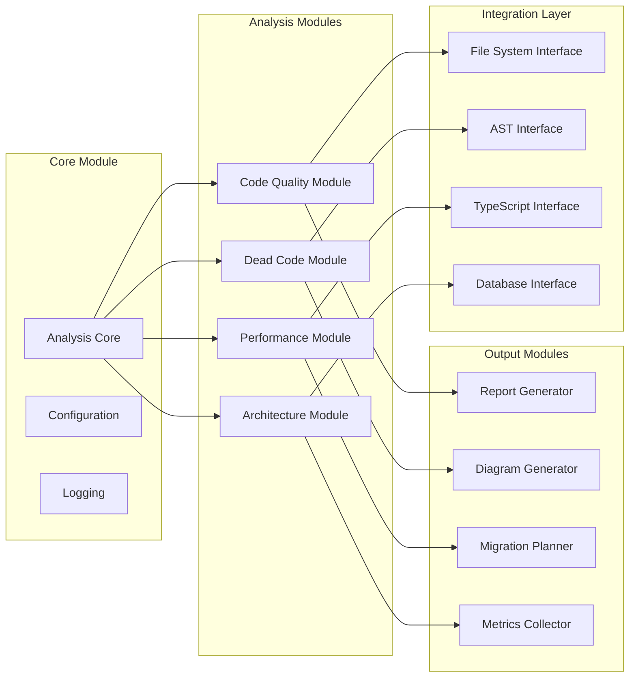
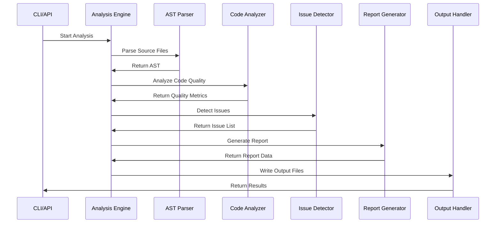
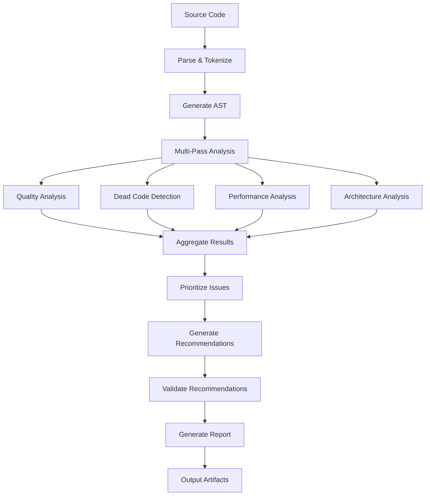
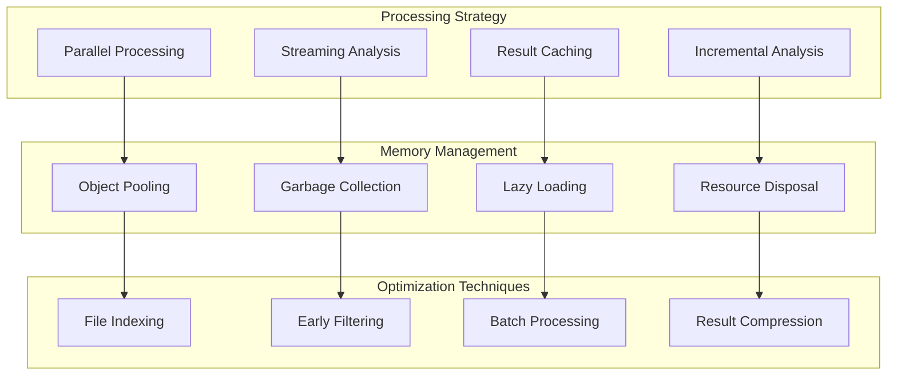

# Architecture Refactoring Assessment Design

## Overview

This design document outlines a comprehensive architecture analysis and refactoring system for the CloneDx platform. The system will perform automated code analysis, identify optimization opportunities, and provide actionable refactoring recommendations while maintaining system integrity and extensibility.

## Architecture

### System Architecture Diagram



### Current Architecture Analysis



## Components and Interfaces

### 1. Analysis Engine Core

```typescript
interface AnalysisEngine {
  analyzeCodebase(config: AnalysisConfig): Promise<AnalysisResult>;
  generateReport(results: AnalysisResult[]): Promise<RefactoringReport>;
  validateRecommendations(recommendations: Recommendation[]): Promise<ValidationResult>;
}

interface AnalysisConfig {
  targetPaths: string[];
  excludePatterns: string[];
  analysisTypes: AnalysisType[];
  strictMode: boolean;
  performanceThresholds: PerformanceThresholds;
}
```

### 2. Code Quality Analyzer

```typescript
interface CodeQualityAnalyzer {
  analyzeComplexity(file: SourceFile): ComplexityMetrics;
  detectAntiPatterns(ast: AST): AntiPattern[];
  validateTypeScript(project: Project): TypeScriptIssue[];
  assessMaintainability(codebase: Codebase): MaintainabilityScore;
}

interface ComplexityMetrics {
  cyclomaticComplexity: number;
  cognitiveComplexity: number;
  linesOfCode: number;
  maintainabilityIndex: number;
}
```

### 3. Dead Code Detector

```typescript
interface DeadCodeDetector {
  findUnusedImports(files: SourceFile[]): UnusedImport[];
  detectUnreachableCode(ast: AST): UnreachableCode[];
  findOrphanedFiles(project: Project): OrphanedFile[];
  identifyDeadVariables(scope: Scope): DeadVariable[];
}

interface UnusedImport {
  file: string;
  importName: string;
  line: number;
  autoRemovable: boolean;
}
```

### 4. Performance Optimizer

```typescript
interface PerformanceOptimizer {
  analyzeBundleSize(webpack: WebpackStats): BundleAnalysis;
  detectRenderIssues(components: ReactComponent[]): RenderIssue[];
  optimizeQueries(queries: DatabaseQuery[]): QueryOptimization[];
  identifyMemoryLeaks(heap: HeapSnapshot): MemoryLeak[];
}

interface BundleAnalysis {
  totalSize: number;
  chunkSizes: ChunkSize[];
  unusedDependencies: string[];
  optimizationOpportunities: BundleOptimization[];
}
```

### 5. Architecture Analyzer

```typescript
interface ArchitectureAnalyzer {
  analyzeModularity(codebase: Codebase): ModularityReport;
  validateLayering(architecture: Architecture): LayeringViolation[];
  assessCoupling(modules: Module[]): CouplingMetrics;
  identifyPatternOpportunities(code: SourceCode): PatternRecommendation[];
}

interface ModularityReport {
  cohesionScore: number;
  couplingScore: number;
  abstractionLevel: number;
  dependencyGraph: DependencyGraph;
}
```

## Data Models

### Analysis Result Schema

```typescript
interface AnalysisResult {
  id: string;
  timestamp: Date;
  analysisType: AnalysisType;
  severity: 'low' | 'medium' | 'high' | 'critical';
  category: AnalysisCategory;
  file: string;
  line?: number;
  column?: number;
  message: string;
  recommendation: Recommendation;
  impact: ImpactAssessment;
  effort: EffortEstimate;
  metadata: Record<string, unknown>;
}

interface Recommendation {
  type: RecommendationType;
  description: string;
  codeExample?: CodeExample;
  automatable: boolean;
  dependencies: string[];
  risks: Risk[];
}

interface ImpactAssessment {
  performance: ImpactLevel;
  maintainability: ImpactLevel;
  security: ImpactLevel;
  bundleSize: number;
  estimatedBenefit: string;
}
```

### Refactoring Report Schema

```typescript
interface RefactoringReport {
  id: string;
  generatedAt: Date;
  summary: ReportSummary;
  categories: CategoryReport[];
  prioritizedRecommendations: PrioritizedRecommendation[];
  migrationPlan: MigrationPlan;
  architectureDiagrams: ArchitectureDiagram[];
  metrics: RefactoringMetrics;
}

interface ReportSummary {
  totalIssues: number;
  criticalIssues: number;
  estimatedEffort: EffortEstimate;
  potentialBenefits: Benefit[];
  riskAssessment: RiskAssessment;
}
```

## Error Handling

### Error Classification System



### Error Handling Strategy

```typescript
interface ErrorHandler {
  handleParseError(error: ParseError, context: AnalysisContext): RecoveryAction;
  handleRuntimeError(error: RuntimeError, context: AnalysisContext): RecoveryAction;
  handleResourceError(error: ResourceError, context: AnalysisContext): RecoveryAction;
  generateErrorReport(errors: AnalysisError[]): ErrorReport;
}

interface RecoveryAction {
  type: 'continue' | 'skip' | 'retry' | 'abort';
  message: string;
  fallbackStrategy?: string;
  impactOnResults: string;
}
```

## Testing Strategy

### Testing Architecture



### Test Data Strategy

```typescript
interface TestDataManager {
  generateSampleCodebase(config: CodebaseConfig): SampleCodebase;
  createAnalysisFixtures(scenarios: TestScenario[]): AnalysisFixture[];
  validateRecommendations(recommendations: Recommendation[]): ValidationResult[];
  measureAccuracy(results: AnalysisResult[], expected: ExpectedResult[]): AccuracyMetrics;
}

interface CodebaseConfig {
  size: 'small' | 'medium' | 'large';
  complexity: 'low' | 'medium' | 'high';
  patterns: CodePattern[];
  issues: KnownIssue[];
}
```

## Implementation Architecture

### Modular Design Pattern



### Plugin Architecture

```typescript
interface AnalysisPlugin {
  name: string;
  version: string;
  analyze(context: AnalysisContext): Promise<PluginResult>;
  configure(config: PluginConfig): void;
  validate(input: unknown): ValidationResult;
}

interface PluginManager {
  registerPlugin(plugin: AnalysisPlugin): void;
  executePlugins(context: AnalysisContext): Promise<PluginResult[]>;
  getPluginByName(name: string): AnalysisPlugin | undefined;
  listAvailablePlugins(): PluginInfo[];
}
```

## Data Flow Architecture

### Analysis Pipeline



### Data Processing Flow



## Integration Points

### External Tool Integration

```typescript
interface ExternalToolIntegration {
  // TypeScript Compiler API
  typescript: {
    createProgram(files: string[]): ts.Program;
    getSemanticDiagnostics(program: ts.Program): ts.Diagnostic[];
    getTypeChecker(program: ts.Program): ts.TypeChecker;
  };
  
  // ESLint Integration
  eslint: {
    lintFiles(patterns: string[]): ESLint.LintResult[];
    getConfigForFile(file: string): ESLint.ConfigData;
  };
  
  // Webpack Bundle Analyzer
  bundleAnalyzer: {
    analyzeBundle(stats: webpack.Stats): BundleReport;
    generateReport(analysis: BundleReport): string;
  };
  
  // Database Schema Analysis
  drizzle: {
    introspectSchema(connection: Connection): SchemaInfo;
    analyzeQueries(queries: Query[]): QueryAnalysis[];
  };
}
```

### CI/CD Integration

```yaml
# GitHub Actions Integration
name: Architecture Analysis
on:
  pull_request:
    branches: [main]
  schedule:
    - cron: '0 2 * * 1' # Weekly analysis

jobs:
  analyze:
    runs-on: ubuntu-latest
    steps:
      - uses: actions/checkout@v4
      - name: Run Architecture Analysis
        run: |
          npm run analyze:architecture
          npm run generate:report
      - name: Upload Analysis Report
        uses: actions/upload-artifact@v4
        with:
          name: architecture-analysis
          path: reports/
```

## Security Considerations

### Secure Analysis Practices

```typescript
interface SecurityAnalyzer {
  scanForSecrets(files: SourceFile[]): SecurityIssue[];
  validateDependencies(packages: Package[]): VulnerabilityReport;
  checkPermissions(operations: FileOperation[]): PermissionCheck[];
  sanitizeOutput(report: RefactoringReport): SafeReport;
}

interface SecurityConfig {
  allowedPaths: string[];
  restrictedPatterns: RegExp[];
  secretPatterns: SecretPattern[];
  outputSanitization: SanitizationRule[];
}
```

## Performance Considerations

### Scalability Design



### Performance Monitoring

```typescript
interface PerformanceMonitor {
  startTimer(operation: string): Timer;
  recordMemoryUsage(checkpoint: string): MemorySnapshot;
  trackFileProcessing(file: string, duration: number): void;
  generatePerformanceReport(): PerformanceReport;
}

interface PerformanceThresholds {
  maxAnalysisTime: number; // milliseconds
  maxMemoryUsage: number; // bytes
  maxFileSize: number; // bytes
  concurrencyLimit: number;
}
```

This design provides a comprehensive foundation for implementing the architecture refactoring assessment system while maintaining modularity, extensibility, and performance.