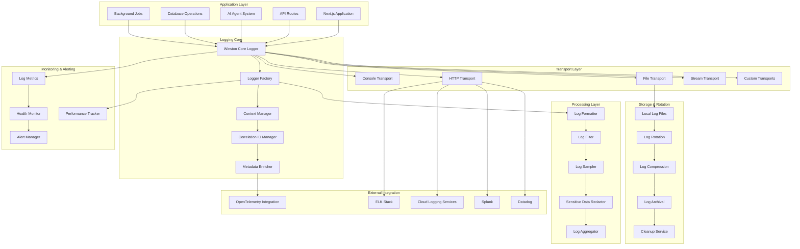

# Design Document

## Overview

This design implements a comprehensive structured logging system using Winston as the core logging framework, enhanced with OpenTelemetry correlation, performance optimization, and seamless integration with the ambient agent architecture. The system provides enterprise-grade logging capabilities including structured JSON output, intelligent log routing, performance-aware sampling, and integration with external log aggregation platforms.

The design emphasizes developer experience, operational visibility, and system performance while maintaining security and compliance requirements. The logging system serves as a critical observability component that complements the existing telemetry infrastructure and provides detailed insights into AI agent operations, database performance, and system health.

## Architecture

### High-Level Architecture Diagram



### Data Flow Architecture

1. **Log Generation**: Application components → Logger Factory → Context enrichment
2. **Processing Pipeline**: Raw logs → Formatting → Filtering → Sampling → Redaction
3. **Transport Routing**: Processed logs → Multiple transports → External destinations
4. **Local Storage**: File transport → Rotation → Compression → Archival
5. **Monitoring**: Log metrics → Health monitoring → Alerting
6. **Correlation**: OpenTelemetry integration → Trace/span correlation → Distributed tracing

## Components and Interfaces

### Core Logger Factory (`/lib/logging/logger-factory.ts`)

```typescript
import winston from "winston";
import { AsyncLocalStorage } from "async_hooks";
import { trace, context, SpanContext } from "@opentelemetry/api";
import { LoggingConfig, LogContext, LogLevel } from "./types";
import { CorrelationIdManager } from "./correlation-id-manager";
import { MetadataEnricher } from "./metadata-enricher";
import { SensitiveDataRedactor } from "./sensitive-data-redactor";
import { PerformanceTracker } from "./performance-tracker";

export class LoggerFactory {
  private static instance: LoggerFactory;
  private winston: winston.Logger;
  private config: LoggingConfig;
  private contextStorage = new AsyncLocalStorage<LogContext>();
  private correlationManager = new CorrelationIdManager();
  private metadataEnricher = new MetadataEnricher();
  private redactor = new SensitiveDataRedactor();
  private performanceTracker = new PerformanceTracker();

  private constructor(config: LoggingConfig) {
    this.config = config;
    this.winston = this.createWinstonLogger();
  }

  static getInstance(config?: LoggingConfig): LoggerFactory {
    if (!LoggerFactory.instance) {
      if (!config) {
        throw new Error(
          "LoggerFactory requires configuration on first initialization",
        );
      }
      LoggerFactory.instance = new LoggerFactory(config);
    }
    return LoggerFactory.instance;
  }

  private createWinstonLogger(): winston.Logger {
    const transports = this.createTransports();
    const format = this.createLogFormat();

    return winston.createLogger({
      level: this.config.level,
      format,
      transports,
      exitOnError: false,
      silent: this.config.silent || false,
    });
  }

  private createTransports(): winston.transport[] {
    const transports: winston.transport[] = [];

    // Console transport for development
    if (this.config.console.enabled) {
      transports.push(
        new winston.transports.Console({
          format: winston.format.combine(
            winston.format.colorize(),
            winston.format.simple(),
          ),
          level: this.config.console.level || this.config.level,
        }),
      );
    }

    // File transport with rotation
    if (this.config.file.enabled) {
      transports.push(
        new winston.transports.File({
          filename: this.config.file.filename,
          maxsize: this.config.file.maxSize,
          maxFiles: this.config.file.maxFiles,
          tailable: true,
          level: this.config.file.level || this.config.level,
        }),
      );

      // Separate error log file
      transports.push(
        new winston.transports.File({
          filename: this.config.file.errorFilename,
          level: "error",
          maxsize: this.config.file.maxSize,
          maxFiles: this.config.file.maxFiles,
        }),
      );
    }

    // HTTP transport for external services
    if (this.config.http.enabled) {
      transports.push(
        new winston.transports.Http({
          host: this.config.http.host,
          port: this.config.http.port,
          path: this.config.http.path,
          ssl: this.config.http.ssl,
          level: this.config.http.level || this.config.level,
        }),
      );
    }

    return transports;
  }

  private createLogFormat(): winston.Logform.Format {
    return winston.format.combine(
      winston.format.timestamp(),
      winston.format.errors({ stack: true }),
      winston.format.json(),
      winston.format.printf((info) => {
        const logEntry = this.enrichLogEntry(info);
        return JSON.stringify(logEntry);
      }),
    );
  }

  private enrichLogEntry(info: any): any {
    const context = this.contextStorage.getStore();
    const correlationId = this.correlationManager.getCurrentId();
    const traceContext = this.getTraceContext();
    const metadata = this.metadataEnricher.enrich(info, context);

    const enrichedEntry = {
      timestamp: info.timestamp,
      level: info.level,
      message: info.message,
      correlationId,
      ...traceContext,
      service: this.config.serviceName,
      version: this.config.serviceVersion,
      environment: this.config.environment,
      ...metadata,
      ...info,
    };

    // Redact sensitive information
    return this.redactor.redact(enrichedEntry);
  }

  private getTraceContext(): any {
    const span = trace.getActiveSpan();
    if (span) {
      const spanContext = span.spanContext();
      return {
        traceId: spanContext.traceId,
        spanId: spanContext.spanId,
        traceFlags: spanContext.traceFlags,
      };
    }
    return {};
  }

  createLogger(component: string): ComponentLogger {
    return new ComponentLogger(
      component,
      this.winston,
      this.contextStorage,
      this.correlationManager,
      this.performanceTracker,
    );
  }

  withContext<T>(context: LogContext, fn: () => T): T {
    return this.contextStorage.run(context, fn);
  }

  async withContextAsync<T>(
    context: LogContext,
    fn: () => Promise<T>,
  ): Promise<T> {
    return this.contextStorage.run(context, fn);
  }

  updateLogLevel(level: LogLevel): void {
    this.winston.level = level;
    this.config.level = level;
  }

  getMetrics(): LoggingMetrics {
    return this.performanceTracker.getMetrics();
  }
}

export class ComponentLogger {
  constructor(
    private component: string,
    private winston: winston.Logger,
    private contextStorage: AsyncLocalStorage<LogContext>,
    private correlationManager: CorrelationIdManager,
    private performanceTracker: PerformanceTracker,
  ) {}

  error(message: string, error?: Error, metadata?: any): void {
    this.log("error", message, { error, ...metadata });
  }

  warn(message: string, metadata?: any): void {
    this.log("warn", message, metadata);
  }

  info(message: string, metadata?: any): void {
    this.log("info", message, metadata);
  }

  debug(message: string, metadata?: any): void {
    this.log("debug", message, metadata);
  }

  trace(message: string, metadata?: any): void {
    this.log("trace", message, metadata);
  }

  // Specialized logging methods for different contexts
  apiRequest(req: any, res: any, duration: number): void {
    this.info("API Request", {
      method: req.method,
      url: req.url,
      statusCode: res.statusCode,
      duration,
      userAgent: req.headers["user-agent"],
      ip: req.ip,
      userId: req.user?.id,
    });
  }

  apiError(req: any, error: Error): void {
    this.error("API Error", error, {
      method: req.method,
      url: req.url,
      userAgent: req.headers["user-agent"],
      ip: req.ip,
      userId: req.user?.id,
    });
  }

  agentOperation(agentId: string, operation: string, metadata: any): void {
    this.info("Agent Operation", {
      agentId,
      operation,
      component: "agent-system",
      ...metadata,
    });
  }

  agentError(agentId: string, error: Error, context: any): void {
    this.error("Agent Error", error, {
      agentId,
      component: "agent-system",
      context,
    });
  }

  databaseQuery(query: string, duration: number, metadata?: any): void {
    this.debug("Database Query", {
      query: this.sanitizeQuery(query),
      duration,
      component: "database",
      ...metadata,
    });
  }

  databaseError(query: string, error: Error): void {
    this.error("Database Error", error, {
      query: this.sanitizeQuery(query),
      component: "database",
    });
  }

  performance(operation: string, duration: number, metadata?: any): void {
    this.info("Performance Metric", {
      operation,
      duration,
      component: "performance",
      ...metadata,
    });

    // Track performance metrics
    this.performanceTracker.recordOperation(operation, duration);
  }

  private log(level: LogLevel, message: string, metadata?: any): void {
    const startTime = Date.now();

    try {
      const context = this.contextStorage.getStore();
      const logData = {
        message,
        component: this.component,
        ...metadata,
        ...(context && { context }),
      };

      this.winston.log(level, logData);
    } catch (error) {
      // Fallback logging to prevent application crashes
      console.error("Logging error:", error);
      console.log(`[${level.toUpperCase()}] ${this.component}: ${message}`);
    } finally {
      const duration = Date.now() - startTime;
      this.performanceTracker.recordLoggingOperation(duration);
    }
  }

  private sanitizeQuery(query: string): string {
    // Remove or mask sensitive data from SQL queries
    return query
      .replace(/password\s*=\s*'[^']*'/gi, "password='***'")
      .replace(/token\s*=\s*'[^']*'/gi, "token='***'")
      .substring(0, 1000); // Limit query length in logs
  }
}
```

### Correlation ID Manager (`/lib/logging/correlation-id-manager.ts`)

```typescript
import { AsyncLocalStorage } from "async_hooks";
import { randomUUID } from "crypto";
import { NextRequest } from "next/server";

export class CorrelationIdManager {
  private static instance: CorrelationIdManager;
  private storage = new AsyncLocalStorage<string>();

  static getInstance(): CorrelationIdManager {
    if (!CorrelationIdManager.instance) {
      CorrelationIdManager.instance = new CorrelationIdManager();
    }
    return CorrelationIdManager.instance;
  }

  generateId(): string {
    return randomUUID();
  }

  getCurrentId(): string | undefined {
    return this.storage.getStore();
  }

  withId<T>(id: string, fn: () => T): T {
    return this.storage.run(id, fn);
  }

  async withIdAsync<T>(id: string, fn: () => Promise<T>): Promise<T> {
    return this.storage.run(id, fn);
  }

  extractFromRequest(req: NextRequest): string {
    // Try to get correlation ID from headers
    const headerCorrelationId =
      req.headers.get("x-correlation-id") ||
      req.headers.get("x-request-id") ||
      req.headers.get("x-trace-id");

    if (headerCorrelationId) {
      return headerCorrelationId;
    }

    // Generate new correlation ID
    return this.generateId();
  }

  injectIntoResponse(res: Response, correlationId: string): void {
    res.headers.set("x-correlation-id", correlationId);
  }
}
```

### Sensitive Data Redactor (`/lib/logging/sensitive-data-redactor.ts`)

```typescript
export class SensitiveDataRedactor {
  private sensitiveFields = [
    "password",
    "token",
    "secret",
    "key",
    "authorization",
    "cookie",
    "session",
    "ssn",
    "creditcard",
    "email",
    "phone",
  ];

  private sensitivePatterns = [
    /\b\d{4}[-\s]?\d{4}[-\s]?\d{4}[-\s]?\d{4}\b/g, // Credit card numbers
    /\b[A-Za-z0-9._%+-]+@[A-Za-z0-9.-]+\.[A-Z|a-z]{2,}\b/g, // Email addresses
    /\b\d{3}-\d{2}-\d{4}\b/g, // SSN
    /\b\d{3}-\d{3}-\d{4}\b/g, // Phone numbers
    /Bearer\s+[A-Za-z0-9\-._~+/]+=*/g, // Bearer tokens
    /api[_-]?key[_-]?[=:]\s*[A-Za-z0-9]+/gi, // API keys
  ];

  redact(obj: any): any {
    if (typeof obj !== "object" || obj === null) {
      return this.redactString(obj);
    }

    if (Array.isArray(obj)) {
      return obj.map((item) => this.redact(item));
    }

    const redacted: any = {};
    for (const [key, value] of Object.entries(obj)) {
      if (this.isSensitiveField(key)) {
        redacted[key] = "[REDACTED]";
      } else {
        redacted[key] = this.redact(value);
      }
    }

    return redacted;
  }

  private isSensitiveField(fieldName: string): boolean {
    const lowerFieldName = fieldName.toLowerCase();
    return this.sensitiveFields.some((sensitive) =>
      lowerFieldName.includes(sensitive),
    );
  }

  private redactString(str: any): any {
    if (typeof str !== "string") {
      return str;
    }

    let redactedStr = str;
    this.sensitivePatterns.forEach((pattern) => {
      redactedStr = redactedStr.replace(pattern, "[REDACTED]");
    });

    return redactedStr;
  }
}
```

### Performance Tracker (`/lib/logging/performance-tracker.ts`)

```typescript
export class PerformanceTracker {
  private metrics: LoggingMetrics = {
    totalLogs: 0,
    logsByLevel: {
      error: 0,
      warn: 0,
      info: 0,
      debug: 0,
      trace: 0,
    },
    averageLoggingTime: 0,
    operationMetrics: new Map(),
    errors: 0,
    startTime: Date.now(),
  };

  recordLoggingOperation(duration: number): void {
    this.metrics.totalLogs++;

    // Update average logging time
    const currentAvg = this.metrics.averageLoggingTime;
    const totalOps = this.metrics.totalLogs;
    this.metrics.averageLoggingTime =
      (currentAvg * (totalOps - 1) + duration) / totalOps;
  }

  recordOperation(operation: string, duration: number): void {
    const existing = this.metrics.operationMetrics.get(operation) || {
      count: 0,
      totalDuration: 0,
      averageDuration: 0,
      minDuration: Infinity,
      maxDuration: 0,
    };

    existing.count++;
    existing.totalDuration += duration;
    existing.averageDuration = existing.totalDuration / existing.count;
    existing.minDuration = Math.min(existing.minDuration, duration);
    existing.maxDuration = Math.max(existing.maxDuration, duration);

    this.metrics.operationMetrics.set(operation, existing);
  }

  recordError(): void {
    this.metrics.errors++;
  }

  getMetrics(): LoggingMetrics {
    return {
      ...this.metrics,
      uptime: Date.now() - this.metrics.startTime,
      operationMetrics: new Map(this.metrics.operationMetrics),
    };
  }

  reset(): void {
    this.metrics = {
      totalLogs: 0,
      logsByLevel: {
        error: 0,
        warn: 0,
        info: 0,
        debug: 0,
        trace: 0,
      },
      averageLoggingTime: 0,
      operationMetrics: new Map(),
      errors: 0,
      startTime: Date.now(),
    };
  }
}

export interface LoggingMetrics {
  totalLogs: number;
  logsByLevel: Record<LogLevel, number>;
  averageLoggingTime: number;
  operationMetrics: Map<string, OperationMetrics>;
  errors: number;
  startTime: number;
  uptime?: number;
}

export interface OperationMetrics {
  count: number;
  totalDuration: number;
  averageDuration: number;
  minDuration: number;
  maxDuration: number;
}
```

### Middleware Integration (`/lib/logging/middleware.ts`)

```typescript
import { NextRequest, NextResponse } from "next/server";
import { LoggerFactory } from "./logger-factory";
import { CorrelationIdManager } from "./correlation-id-manager";

export function createLoggingMiddleware() {
  const loggerFactory = LoggerFactory.getInstance();
  const correlationManager = CorrelationIdManager.getInstance();
  const logger = loggerFactory.createLogger("middleware");

  return async function loggingMiddleware(
    request: NextRequest,
    next: () => Promise<NextResponse>,
  ): Promise<NextResponse> {
    const startTime = Date.now();
    const correlationId = correlationManager.extractFromRequest(request);

    return correlationManager.withIdAsync(correlationId, async () => {
      const context = {
        correlationId,
        method: request.method,
        url: request.url,
        userAgent: request.headers.get("user-agent"),
        ip: request.ip,
      };

      return loggerFactory.withContextAsync(context, async () => {
        try {
          const response = await next();
          const duration = Date.now() - startTime;

          logger.apiRequest(request, response, duration);
          correlationManager.injectIntoResponse(response, correlationId);

          return response;
        } catch (error) {
          const duration = Date.now() - startTime;
          logger.apiError(request, error as Error);

          // Re-throw the error to maintain normal error handling
          throw error;
        }
      });
    });
  };
}
```

### Configuration Types (`/lib/logging/types.ts`)

```typescript
export type LogLevel = "error" | "warn" | "info" | "debug" | "trace";

export interface LoggingConfig {
  level: LogLevel;
  serviceName: string;
  serviceVersion: string;
  environment: string;
  silent?: boolean;

  console: {
    enabled: boolean;
    level?: LogLevel;
  };

  file: {
    enabled: boolean;
    filename: string;
    errorFilename: string;
    maxSize: number;
    maxFiles: number;
    level?: LogLevel;
  };

  http: {
    enabled: boolean;
    host?: string;
    port?: number;
    path?: string;
    ssl?: boolean;
    level?: LogLevel;
  };

  sampling: {
    enabled: boolean;
    rate: number;
    highVolumeThreshold: number;
  };

  redaction: {
    enabled: boolean;
    customFields?: string[];
    customPatterns?: RegExp[];
  };

  performance: {
    trackOperations: boolean;
    slowOperationThreshold: number;
  };
}

export interface LogContext {
  correlationId?: string;
  userId?: string;
  sessionId?: string;
  component?: string;
  operation?: string;
  metadata?: Record<string, any>;
}
```

## Integration Points

### OpenTelemetry Integration

The logging system seamlessly integrates with OpenTelemetry to provide correlated observability:

```typescript
// Automatic trace correlation in log entries
const logEntry = {
  message: "Operation completed",
  traceId: "1234567890abcdef",
  spanId: "abcdef1234567890",
  correlationId: "req-uuid-1234",
  // ... other log data
};
```

### External Platform Integration

The system supports multiple external logging platforms:

- **ELK Stack**: Structured JSON logs with Elasticsearch indexing
- **Splunk**: Custom format with proper field mapping
- **Datadog**: Native integration with tags and metrics
- **Cloud Services**: AWS CloudWatch, Google Cloud Logging, Azure Monitor

This design provides a comprehensive, performant, and scalable logging solution that integrates seamlessly with your existing observability infrastructure while providing rich context for debugging and monitoring your ambient agent system.
