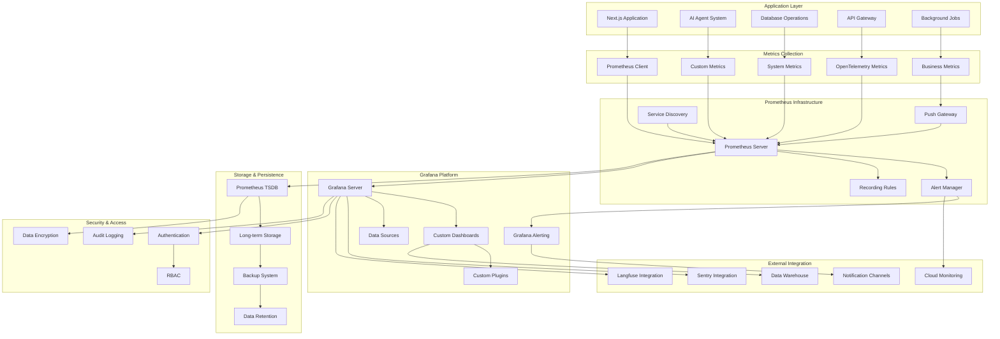

# Design Document

## Overview

This design implements a comprehensive metrics and visualization system using Prometheus for metrics collection and Grafana for dashboard visualization, specifically tailored for monitoring ambient AI agents, system performance, and business metrics. The system integrates seamlessly with the existing OpenTelemetry infrastructure and provides real-time insights into agent behavior, task orchestration, resource utilization, and system health.

The architecture emphasizes scalability, performance, and developer experience while providing actionable insights through custom dashboards, intelligent alerting, and comprehensive analytics. The system supports multi-tenant deployments, high availability, and integration with external observability platforms.

## Architecture

### High-Level Architecture Diagram



### Data Flow Architecture

1. **Metrics Generation**: Application components → Prometheus client libraries → Metrics collection
2. **Data Ingestion**: Prometheus server → Service discovery → Target scraping → TSDB storage
3. **Data Processing**: Raw metrics → Recording rules → Aggregated metrics → Alert evaluation
4. **Visualization**: Grafana → Prometheus queries → Dashboard rendering → User interface
5. **Alerting**: Alert rules → Alert Manager → Notification routing → External channels
6. **Long-term Storage**: TSDB → Retention policies → Long-term storage → Backup systems

## Components and Interfaces

### Prometheus Metrics Collection (`/lib/metrics/prometheus-client.ts`)

```typescript
import {
  register,
  Counter,
  Histogram,
  Gauge,
  Summary,
  collectDefaultMetrics,
} from "prom-client";
import { ObservabilityService } from "../observability";

export class PrometheusMetricsCollector {
  private static instance: PrometheusMetricsCollector;
  private registry = register;
  private observability = ObservabilityService.getInstance();

  // AI Agent Metrics
  private agentOperationsTotal = new Counter({
    name: "agent_operations_total",
    help: "Total number of agent operations",
    labelNames: ["agent_id", "agent_type", "operation", "provider", "status"],
    registers: [this.registry],
  });

  private agentExecutionDuration = new Histogram({
    name: "agent_execution_duration_seconds",
    help: "Duration of agent task execution",
    labelNames: ["agent_id", "agent_type", "task_type", "provider"],
    buckets: [0.1, 0.5, 1, 2, 5, 10, 30, 60, 120],
    registers: [this.registry],
  });

  private agentTokenUsage = new Counter({
    name: "agent_token_usage_total",
    help: "Total tokens used by agents",
    labelNames: ["agent_id", "agent_type", "provider", "token_type"],
    registers: [this.registry],
  });

  private agentCostTotal = new Counter({
    name: "agent_cost_total",
    help: "Total cost of agent operations in USD",
    labelNames: ["agent_id", "agent_type", "provider"],
    registers: [this.registry],
  });

  private agentActiveGauge = new Gauge({
    name: "agent_active_count",
    help: "Number of currently active agents",
    labelNames: ["agent_type", "provider"],
    registers: [this.registry],
  });

  // Task Orchestration Metrics
  private taskExecutionsTotal = new Counter({
    name: "task_executions_total",
    help: "Total number of task executions",
    labelNames: ["task_type", "status", "priority"],
    registers: [this.registry],
  });

  private taskQueueDepth = new Gauge({
    name: "task_queue_depth",
    help: "Number of tasks in queue",
    labelNames: ["queue_type", "priority"],
    registers: [this.registry],
  });

  private taskDependencyResolution = new Histogram({
    name: "task_dependency_resolution_duration_seconds",
    help: "Time to resolve task dependencies",
    buckets: [0.01, 0.05, 0.1, 0.5, 1, 2, 5],
    registers: [this.registry],
  });

  // Memory and Context Metrics
  private memoryUsageBytes = new Gauge({
    name: "agent_memory_usage_bytes",
    help: "Memory usage by agent memory system",
    labelNames: ["namespace", "agent_type"],
    registers: [this.registry],
  });

  private contextRetrievalDuration = new Histogram({
    name: "context_retrieval_duration_seconds",
    help: "Time to retrieve context from memory",
    labelNames: ["namespace", "retrieval_type"],
    buckets: [0.001, 0.005, 0.01, 0.05, 0.1, 0.5, 1],
    registers: [this.registry],
  });

  // API and System Metrics
  private httpRequestsTotal = new Counter({
    name: "http_requests_total",
    help: "Total HTTP requests",
    labelNames: ["method", "route", "status_code"],
    registers: [this.registry],
  });

  private httpRequestDuration = new Histogram({
    name: "http_request_duration_seconds",
    help: "HTTP request duration",
    labelNames: ["method", "route"],
    buckets: [0.01, 0.05, 0.1, 0.5, 1, 2, 5, 10],
    registers: [this.registry],
  });

  private databaseConnectionsActive = new Gauge({
    name: "database_connections_active",
    help: "Number of active database connections",
    labelNames: ["database", "pool"],
    registers: [this.registry],
  });

  private databaseQueryDuration = new Histogram({
    name: "database_query_duration_seconds",
    help: "Database query execution time",
    labelNames: ["operation", "table"],
    buckets: [0.001, 0.005, 0.01, 0.05, 0.1, 0.5, 1, 2],
    registers: [this.registry],
  });

  // Business Metrics
  private userSessionsActive = new Gauge({
    name: "user_sessions_active",
    help: "Number of active user sessions",
    registers: [this.registry],
  });

  private featureUsageTotal = new Counter({
    name: "feature_usage_total",
    help: "Total feature usage count",
    labelNames: ["feature", "user_type"],
    registers: [this.registry],
  });

  private constructor() {
    // Collect default Node.js metrics
    collectDefaultMetrics({ register: this.registry });
  }

  static getInstance(): PrometheusMetricsCollector {
    if (!PrometheusMetricsCollector.instance) {
      PrometheusMetricsCollector.instance = new PrometheusMetricsCollector();
    }
    return PrometheusMetricsCollector.instance;
  }

  // Agent Metrics Methods
  recordAgentOperation(
    agentId: string,
    agentType: string,
    operation: string,
    provider: string,
    status: "success" | "error" | "timeout",
  ): void {
    this.agentOperationsTotal.inc({
      agent_id: agentId,
      agent_type: agentType,
      operation,
      provider,
      status,
    });
  }

  recordAgentExecution(
    agentId: string,
    agentType: string,
    taskType: string,
    provider: string,
    duration: number,
  ): void {
    this.agentExecutionDuration.observe(
      {
        agent_id: agentId,
        agent_type: agentType,
        task_type: taskType,
        provider,
      },
      duration,
    );
  }

  recordTokenUsage(
    agentId: string,
    agentType: string,
    provider: string,
    tokenType: "input" | "output" | "total",
    count: number,
  ): void {
    this.agentTokenUsage.inc(
      {
        agent_id: agentId,
        agent_type: agentType,
        provider,
        token_type: tokenType,
      },
      count,
    );
  }

  recordAgentCost(
    agentId: string,
    agentType: string,
    provider: string,
    cost: number,
  ): void {
    this.agentCostTotal.inc(
      {
        agent_id: agentId,
        agent_type: agentType,
        provider,
      },
      cost,
    );
  }

  setActiveAgents(agentType: string, provider: string, count: number): void {
    this.agentActiveGauge.set({ agent_type: agentType, provider }, count);
  }

  // Task Orchestration Methods
  recordTaskExecution(
    taskType: string,
    status: "completed" | "failed" | "cancelled",
    priority: string,
  ): void {
    this.taskExecutionsTotal.inc({
      task_type: taskType,
      status,
      priority,
    });
  }

  setTaskQueueDepth(queueType: string, priority: string, depth: number): void {
    this.taskQueueDepth.set({ queue_type: queueType, priority }, depth);
  }

  recordDependencyResolution(duration: number): void {
    this.taskDependencyResolution.observe(duration);
  }

  // Memory and Context Methods
  setMemoryUsage(namespace: string, agentType: string, bytes: number): void {
    this.memoryUsageBytes.set({ namespace, agent_type: agentType }, bytes);
  }

  recordContextRetrieval(
    namespace: string,
    retrievalType: string,
    duration: number,
  ): void {
    this.contextRetrievalDuration.observe(
      { namespace, retrieval_type: retrievalType },
      duration,
    );
  }

  // API and System Methods
  recordHttpRequest(
    method: string,
    route: string,
    statusCode: number,
    duration: number,
  ): void {
    this.httpRequestsTotal.inc({
      method,
      route,
      status_code: statusCode.toString(),
    });

    this.httpRequestDuration.observe({ method, route }, duration);
  }

  setDatabaseConnections(database: string, pool: string, count: number): void {
    this.databaseConnectionsActive.set({ database, pool }, count);
  }

  recordDatabaseQuery(
    operation: string,
    table: string,
    duration: number,
  ): void {
    this.databaseQueryDuration.observe({ operation, table }, duration);
  }

  // Business Metrics Methods
  setActiveUserSessions(count: number): void {
    this.userSessionsActive.set(count);
  }

  recordFeatureUsage(feature: string, userType: string): void {
    this.featureUsageTotal.inc({ feature, user_type: userType });
  }

  // Utility Methods
  async getMetrics(): Promise<string> {
    return this.registry.metrics();
  }

  clearMetrics(): void {
    this.registry.clear();
  }

  createCustomCounter(name: string, help: string, labelNames?: string[]) {
    return new Counter({
      name,
      help,
      labelNames,
      registers: [this.registry],
    });
  }

  createCustomHistogram(
    name: string,
    help: string,
    labelNames?: string[],
    buckets?: number[],
  ) {
    return new Histogram({
      name,
      help,
      labelNames,
      buckets,
      registers: [this.registry],
    });
  }

  createCustomGauge(name: string, help: string, labelNames?: string[]) {
    return new Gauge({
      name,
      help,
      labelNames,
      registers: [this.registry],
    });
  }
}
```

### Grafana Dashboard Configuration (`/lib/metrics/grafana-dashboards.ts`)

```typescript
export interface GrafanaDashboard {
  id?: number;
  uid?: string;
  title: string;
  tags: string[];
  timezone: string;
  panels: GrafanaPanel[];
  templating: {
    list: GrafanaTemplate[];
  };
  time: {
    from: string;
    to: string;
  };
  refresh: string;
}

export interface GrafanaPanel {
  id: number;
  title: string;
  type: string;
  targets: GrafanaTarget[];
  gridPos: {
    h: number;
    w: number;
    x: number;
    y: number;
  };
  options?: any;
  fieldConfig?: any;
}

export interface GrafanaTarget {
  expr: string;
  legendFormat: string;
  refId: string;
}

export class GrafanaDashboardBuilder {
  static createAgentOverviewDashboard(): GrafanaDashboard {
    return {
      title: "AI Agent Overview",
      tags: ["ai-agents", "overview"],
      timezone: "browser",
      panels: [
        {
          id: 1,
          title: "Active Agents",
          type: "stat",
          targets: [
            {
              expr: "sum(agent_active_count)",
              legendFormat: "Total Active Agents",
              refId: "A",
            },
          ],
          gridPos: { h: 8, w: 6, x: 0, y: 0 },
        },
        {
          id: 2,
          title: "Agent Operations Rate",
          type: "graph",
          targets: [
            {
              expr: "rate(agent_operations_total[5m])",
              legendFormat: "{{agent_type}} - {{operation}}",
              refId: "A",
            },
          ],
          gridPos: { h: 8, w: 18, x: 6, y: 0 },
        },
        {
          id: 3,
          title: "Agent Execution Duration",
          type: "heatmap",
          targets: [
            {
              expr: "rate(agent_execution_duration_seconds_bucket[5m])",
              legendFormat: "{{le}}",
              refId: "A",
            },
          ],
          gridPos: { h: 8, w: 12, x: 0, y: 8 },
        },
        {
          id: 4,
          title: "Token Usage by Provider",
          type: "piechart",
          targets: [
            {
              expr: "sum by (provider) (rate(agent_token_usage_total[1h]))",
              legendFormat: "{{provider}}",
              refId: "A",
            },
          ],
          gridPos: { h: 8, w: 12, x: 12, y: 8 },
        },
        {
          id: 5,
          title: "Cost Analysis",
          type: "bargauge",
          targets: [
            {
              expr: "sum by (provider) (rate(agent_cost_total[1h]) * 3600)",
              legendFormat: "{{provider}} ($/hour)",
              refId: "A",
            },
          ],
          gridPos: { h: 8, w: 24, x: 0, y: 16 },
        },
      ],
      templating: {
        list: [
          {
            name: "agent_type",
            type: "query",
            query: "label_values(agent_operations_total, agent_type)",
            refresh: 1,
          },
          {
            name: "provider",
            type: "query",
            query: "label_values(agent_operations_total, provider)",
            refresh: 1,
          },
        ],
      },
      time: {
        from: "now-1h",
        to: "now",
      },
      refresh: "30s",
    };
  }

  static createSystemHealthDashboard(): GrafanaDashboard {
    return {
      title: "System Health & Performance",
      tags: ["system", "health", "performance"],
      timezone: "browser",
      panels: [
        {
          id: 1,
          title: "HTTP Request Rate",
          type: "graph",
          targets: [
            {
              expr: "rate(http_requests_total[5m])",
              legendFormat: "{{method}} {{route}}",
              refId: "A",
            },
          ],
          gridPos: { h: 8, w: 12, x: 0, y: 0 },
        },
        {
          id: 2,
          title: "HTTP Response Times",
          type: "graph",
          targets: [
            {
              expr: "histogram_quantile(0.95, rate(http_request_duration_seconds_bucket[5m]))",
              legendFormat: "95th percentile",
              refId: "A",
            },
            {
              expr: "histogram_quantile(0.50, rate(http_request_duration_seconds_bucket[5m]))",
              legendFormat: "50th percentile",
              refId: "B",
            },
          ],
          gridPos: { h: 8, w: 12, x: 12, y: 0 },
        },
        {
          id: 3,
          title: "Database Connections",
          type: "graph",
          targets: [
            {
              expr: "database_connections_active",
              legendFormat: "{{database}} - {{pool}}",
              refId: "A",
            },
          ],
          gridPos: { h: 8, w: 12, x: 0, y: 8 },
        },
        {
          id: 4,
          title: "Database Query Performance",
          type: "graph",
          targets: [
            {
              expr: "histogram_quantile(0.95, rate(database_query_duration_seconds_bucket[5m]))",
              legendFormat: "{{operation}} - 95th percentile",
              refId: "A",
            },
          ],
          gridPos: { h: 8, w: 12, x: 12, y: 8 },
        },
      ],
      templating: {
        list: [],
      },
      time: {
        from: "now-1h",
        to: "now",
      },
      refresh: "30s",
    };
  }

  static createBusinessMetricsDashboard(): GrafanaDashboard {
    return {
      title: "Business Metrics & KPIs",
      tags: ["business", "kpi", "metrics"],
      timezone: "browser",
      panels: [
        {
          id: 1,
          title: "Active User Sessions",
          type: "stat",
          targets: [
            {
              expr: "user_sessions_active",
              legendFormat: "Active Sessions",
              refId: "A",
            },
          ],
          gridPos: { h: 8, w: 6, x: 0, y: 0 },
        },
        {
          id: 2,
          title: "Feature Usage Trends",
          type: "graph",
          targets: [
            {
              expr: "rate(feature_usage_total[1h])",
              legendFormat: "{{feature}}",
              refId: "A",
            },
          ],
          gridPos: { h: 8, w: 18, x: 6, y: 0 },
        },
        {
          id: 3,
          title: "Cost per Operation",
          type: "table",
          targets: [
            {
              expr: "sum by (provider) (rate(agent_cost_total[1h])) / sum by (provider) (rate(agent_operations_total[1h]))",
              legendFormat: "{{provider}}",
              refId: "A",
            },
          ],
          gridPos: { h: 8, w: 12, x: 0, y: 8 },
        },
        {
          id: 4,
          title: "System Efficiency",
          type: "gauge",
          targets: [
            {
              expr: 'sum(rate(agent_operations_total{status="success"}[5m])) / sum(rate(agent_operations_total[5m]))',
              legendFormat: "Success Rate",
              refId: "A",
            },
          ],
          gridPos: { h: 8, w: 12, x: 12, y: 8 },
        },
      ],
      templating: {
        list: [],
      },
      time: {
        from: "now-24h",
        to: "now",
      },
      refresh: "5m",
    };
  }
}

export interface GrafanaTemplate {
  name: string;
  type: "query" | "custom" | "constant";
  query?: string;
  options?: any[];
  refresh: number;
}
```

### Alert Configuration (`/lib/metrics/alert-rules.ts`)

```typescript
export interface PrometheusAlertRule {
  alert: string;
  expr: string;
  for: string;
  labels: Record<string, string>;
  annotations: Record<string, string>;
}

export class AlertRuleBuilder {
  static createAgentAlerts(): PrometheusAlertRule[] {
    return [
      {
        alert: "HighAgentErrorRate",
        expr: 'rate(agent_operations_total{status="error"}[5m]) / rate(agent_operations_total[5m]) > 0.1',
        for: "2m",
        labels: {
          severity: "warning",
          component: "ai-agents",
        },
        annotations: {
          summary: "High error rate detected for AI agents",
          description:
            "Agent error rate is {{ $value | humanizePercentage }} for {{ $labels.agent_type }}",
          runbook_url: "https://docs.example.com/runbooks/agent-errors",
        },
      },
      {
        alert: "AgentExecutionTimeout",
        expr: "histogram_quantile(0.95, rate(agent_execution_duration_seconds_bucket[5m])) > 60",
        for: "5m",
        labels: {
          severity: "critical",
          component: "ai-agents",
        },
        annotations: {
          summary: "Agent execution times are too high",
          description:
            "95th percentile execution time is {{ $value }}s for {{ $labels.agent_type }}",
          runbook_url: "https://docs.example.com/runbooks/agent-performance",
        },
      },
      {
        alert: "HighTokenUsage",
        expr: "rate(agent_token_usage_total[1h]) > 100000",
        for: "10m",
        labels: {
          severity: "warning",
          component: "ai-agents",
        },
        annotations: {
          summary: "High token usage detected",
          description:
            "Token usage rate is {{ $value }} tokens/hour for {{ $labels.provider }}",
          runbook_url: "https://docs.example.com/runbooks/token-usage",
        },
      },
    ];
  }

  static createSystemAlerts(): PrometheusAlertRule[] {
    return [
      {
        alert: "HighHTTPErrorRate",
        expr: 'rate(http_requests_total{status_code=~"5.."}[5m]) / rate(http_requests_total[5m]) > 0.05',
        for: "2m",
        labels: {
          severity: "critical",
          component: "api",
        },
        annotations: {
          summary: "High HTTP error rate detected",
          description:
            "HTTP 5xx error rate is {{ $value | humanizePercentage }} for {{ $labels.route }}",
          runbook_url: "https://docs.example.com/runbooks/http-errors",
        },
      },
      {
        alert: "DatabaseConnectionsHigh",
        expr: "database_connections_active > 80",
        for: "5m",
        labels: {
          severity: "warning",
          component: "database",
        },
        annotations: {
          summary: "High number of database connections",
          description:
            "Database has {{ $value }} active connections for {{ $labels.database }}",
          runbook_url: "https://docs.example.com/runbooks/database-connections",
        },
      },
      {
        alert: "SlowDatabaseQueries",
        expr: "histogram_quantile(0.95, rate(database_query_duration_seconds_bucket[5m])) > 1",
        for: "5m",
        labels: {
          severity: "warning",
          component: "database",
        },
        annotations: {
          summary: "Slow database queries detected",
          description:
            "95th percentile query time is {{ $value }}s for {{ $labels.operation }}",
          runbook_url: "https://docs.example.com/runbooks/slow-queries",
        },
      },
    ];
  }

  static createBusinessAlerts(): PrometheusAlertRule[] {
    return [
      {
        alert: "LowUserEngagement",
        expr: "user_sessions_active < 10",
        for: "15m",
        labels: {
          severity: "info",
          component: "business",
        },
        annotations: {
          summary: "Low user engagement detected",
          description: "Only {{ $value }} active user sessions",
          runbook_url: "https://docs.example.com/runbooks/user-engagement",
        },
      },
      {
        alert: "HighOperationalCost",
        expr: "sum(rate(agent_cost_total[1h])) * 24 > 100",
        for: "30m",
        labels: {
          severity: "warning",
          component: "business",
        },
        annotations: {
          summary: "High operational costs detected",
          description: "Daily operational cost projection is ${{ $value }}",
          runbook_url: "https://docs.example.com/runbooks/cost-optimization",
        },
      },
    ];
  }
}
```

## Integration Points

### OpenTelemetry Integration

The Prometheus metrics system integrates seamlessly with OpenTelemetry:

```typescript
// Automatic metric export from OpenTelemetry to Prometheus
import { PrometheusExporter } from "@opentelemetry/exporter-prometheus";

const prometheusExporter = new PrometheusExporter({
  port: 9090,
  endpoint: "/metrics",
});
```

### External Platform Integration

The system supports integration with multiple external platforms:

- **Grafana Cloud**: Native integration with managed Grafana instances
- **DataDog**: Custom metrics export and dashboard synchronization
- **New Relic**: Metrics forwarding and alert correlation
- **AWS CloudWatch**: Custom metrics and dashboard export
- **Sentry**: Performance metrics correlation with error tracking

This design provides a comprehensive, scalable, and performant metrics and visualization system that integrates seamlessly with your existing observability infrastructure while providing deep insights into your ambient agent operations and system performance.
