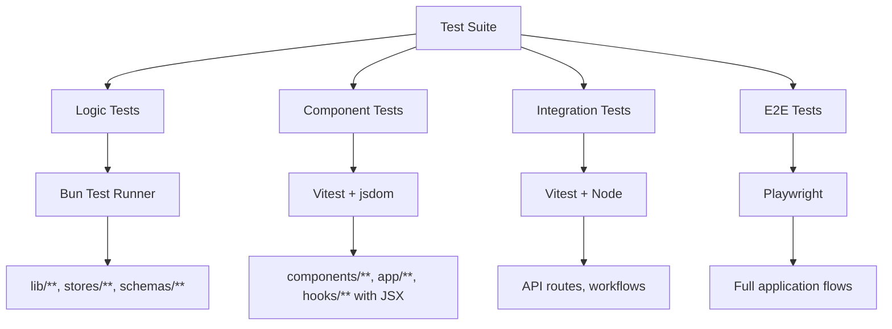
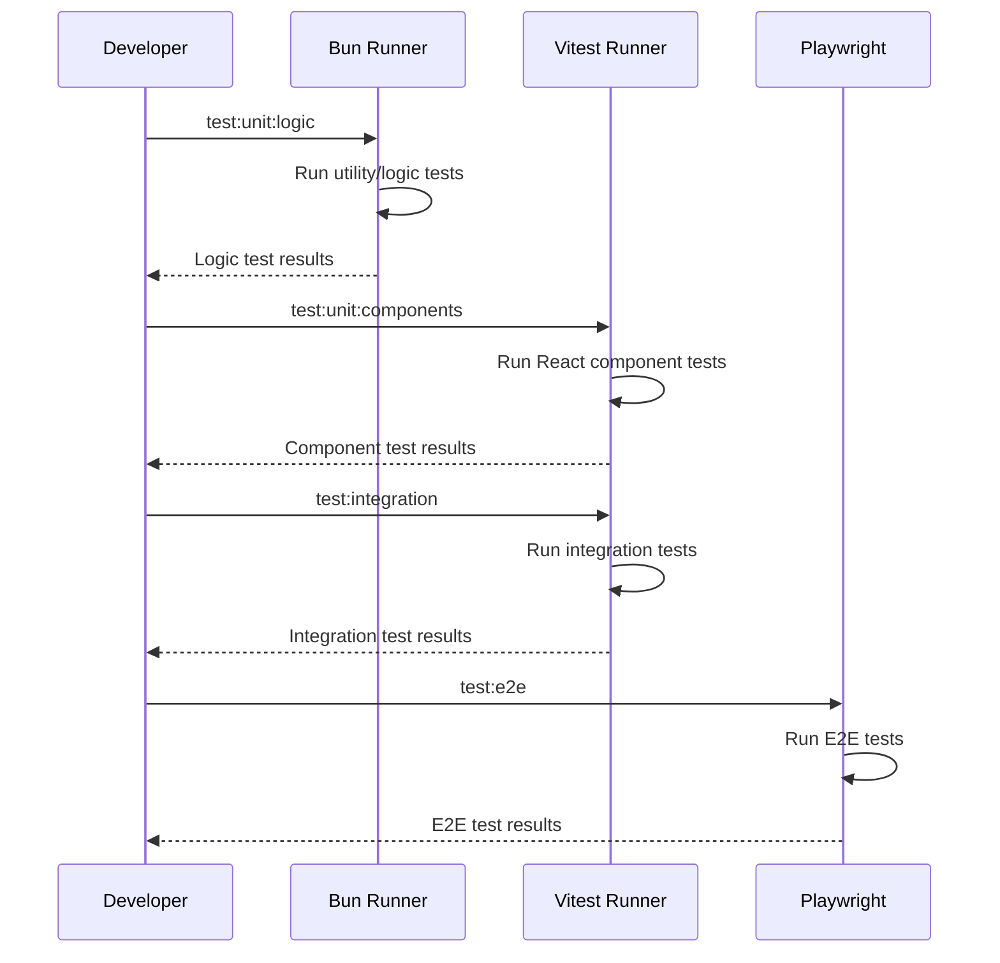

# Design Document

## Overview

The Hybrid Testing Framework implements a strategic separation of testing concerns by leveraging the strengths of different test runners. Bun handles utility and logic tests for optimal performance, while Vitest manages React component tests with proper DOM environment support. This design resolves existing testing conflicts and provides a scalable foundation for comprehensive test coverage.

## Architecture

### Test Runner Separation Strategy



### Configuration Architecture

The framework uses four distinct configuration files:

1. **bunfig.toml** - Bun test configuration for utility/logic tests
2. **vitest.unit.config.ts** - Vitest configuration for React component tests
3. **vitest.integration.config.ts** - Vitest configuration for integration tests
4. **playwright.config.ts** - Playwright configuration for E2E tests

## Components and Interfaces

### Test File Classification System

#### Logic Tests (Bun)

- **Pattern**: `lib/**/*.test.{js,ts}`, `src/lib/**/*.test.{js,ts}`, `stores/**/*.test.{js,ts}`, `src/schemas/**/*.test.{js,ts}`, `src/hooks/useZodForm/**/*.test.{js,ts}`
- **Environment**: happy-dom (lightweight DOM for utilities)
- **Mocking**: Bun's native `mock.module()` and `mock()` API
- **Coverage**: Separate coverage reporting for logic layer
- **Focus**: Pure functions, utilities, schemas, and business logic

#### Component Tests (Vitest)

- **Pattern**: `components/**/*.test.{jsx,tsx}`, `app/**/*.test.{jsx,tsx}`, `hooks/**/*.test.{jsx,tsx}` (excluding useZodForm)
- **Environment**: jsdom (full DOM simulation)
- **Mocking**: Vitest's `vi.mock()` and `vi.spyOn()` API
- **Coverage**: React Testing Library integration with component-specific metrics

#### Integration Tests (Vitest)

- **Pattern**: `tests/integration/**/*.test.{js,ts,jsx,tsx}`, `**/*.integration.test.{js,ts,jsx,tsx}`, `lib/inngest*.test.ts`, `app/actions/inngest.test.ts`, `app/api/**/*.test.{js,ts}`
- **Environment**: Node.js with jsdom for server components
- **Testing**: API routes, database operations, Inngest functions, server actions, and synchronous server components
- **Mocking**: API route mocking, database mocking, external service mocking
- **Coverage**: API and workflow integration coverage
- **Focus**: Server-side logic, API endpoints, database interactions, and server component rendering

#### E2E Tests (Playwright)

- **Pattern**: `tests/e2e/**/*.spec.{js,ts}`
- **Environment**: Real browsers (Chromium, Firefox, WebKit)
- **Testing**: Full user workflows, async server components, client-server interactions
- **Features**: API mocking, network interception, multi-browser testing
- **Coverage**: Full application flow validation and user journey testing
- **Focus**: Complete user workflows, async data fetching, form submissions, navigation flows

### Mock API Conversion Strategy

#### From Vitest to Bun Mocking

**Current Vitest Pattern:**

```typescript
vi.mock("@google/genai", () => ({
  GoogleGenAI: vi.fn(() => ({
    startChat: vi.fn(),
  })),
}));

const mockFetch = vi.mocked(fetch);
mockFetch.mockResolvedValue(response);
```

**Target Bun Pattern:**

```typescript
mock.module("@google/genai", () => ({
  GoogleGenAI: mock(() => ({
    startChat: mock(),
  })),
}));

const mockFetch = mock(fetch);
mockFetch.mockResolvedValue(response);
```

### Console Mocking Resolution

The telemetry and stream-utils tests currently use inconsistent console mocking patterns. The design standardizes on:

```typescript
// Bun pattern for logic tests
let consoleWarnSpy: ReturnType<typeof mock>;

beforeEach(() => {
  consoleWarnSpy = mock.spyOn(console, "warn").mockImplementation(() => {});
});

afterEach(() => {
  mock.restore();
});
```

### Inngest Testing Integration

The framework integrates Inngest testing capabilities using [@inngest/test](https://www.inngest.com/docs/reference/testing) for comprehensive workflow testing:

```typescript
// Integration test pattern for Inngest functions
import { InngestTestEngine, EventPayload } from "@inngest/test";
import { inngest } from "@/lib/inngest";
import { myFunction } from "@/app/actions/inngest";

describe("Inngest Function Tests", () => {
  let testEngine: InngestTestEngine;

  beforeEach(() => {
    testEngine = new InngestTestEngine({
      client: inngest,
      function: myFunction,
    });
  });

  it("should process workflow correctly", async () => {
    const event: EventPayload = {
      name: "test/event",
      data: { userId: "123", action: "process" },
    };

    const { result, execution } = await testEngine.execute(event);

    expect(result).toBeDefined();
    expect(execution.status).toBe("completed");
  });

  it("should handle retries and failures", async () => {
    // Test retry logic and error handling
    const failingEvent: EventPayload = {
      name: "test/failing-event",
      data: { shouldFail: true },
    };

    const { execution } = await testEngine.execute(failingEvent);

    expect(execution.status).toBe("failed");
    expect(execution.attempts).toBeGreaterThan(1);
  });
});
```

#### Inngest Testing Features

- **Function Execution**: Test individual Inngest functions in isolation
- **Event Simulation**: Send test events and verify function responses
- **Step Testing**: Test individual steps within multi-step functions
- **Retry Logic**: Verify retry behavior and failure handling
- **State Management**: Test function state persistence and recovery
- **Parallel Execution**: Test concurrent function execution scenarios

### Testing Setup and Dependencies

#### Essential Testing Dependencies

```json
{
  "devDependencies": {
    "@testing-library/dom": "^10.4.0",
    "@testing-library/jest-dom": "^6.6.3",
    "@testing-library/react": "^16.0.1",
    "@testing-library/user-event": "^14.5.2",
    "@vitejs/plugin-react": "^4.3.4",
    "@inngest/test": "^0.1.7",
    "jsdom": "^25.0.1",
    "vitest": "^3.2.4",
    "@playwright/test": "1.53.0",
    "happy-dom": "^18.0.1"
  },
  "dependencies": {
    "ai": "^4.3.19",
    "@ai-sdk/openai": "^1.3.23",
    "openai": "^4.67.3"
  }
}
```

#### Test Setup Files

- **vitest-setup.js**: Global test setup for Vitest with jest-dom matchers
- **bun-test-setup.ts**: Global test setup for Bun tests
- **tests/setup/integration.ts**: Integration test setup with database and API mocking

#### Centralized Test Organization

```
all-tests/
├── unit-tests/           # Bun logic tests
├── integration-tests/    # Vitest integration tests
└── e2e-tests/           # Playwright E2E tests
```

### API Testing Patterns

#### Server Component Testing (Integration)

```typescript
// Test synchronous server components with Vitest
import { render, screen } from '@testing-library/react'
import { test, expect } from 'vitest'

test('server component renders correctly', () => {
  render(<MyServerComponent />)
  expect(screen.getByText(/expected content/i)).toBeDefined()
})
```

#### API Route Testing (Integration)

```typescript
// Test API routes with Vitest
import { GET } from "@/app/api/users/route";
import { test, expect } from "vitest";

test("GET /api/users returns user data", async () => {
  const request = new Request("http://localhost:3000/api/users");
  const response = await GET(request);
  const data = await response.json();

  expect(response.status).toBe(200);
  expect(data).toHaveProperty("users");
});
```

#### E2E API Mocking (Playwright)

```typescript
// Mock API responses in E2E tests
test("user dashboard loads with mocked data", async ({ page }) => {
  await page.route("**/api/users", async (route) => {
    const json = { users: [{ id: 1, name: "Test User" }] };
    await route.fulfill({ json });
  });

  await page.goto("/dashboard");
  await expect(page.getByText("Test User")).toBeVisible();
});
```

### AI SDK Testing Patterns

#### Mock Language Models (Integration Tests)

```typescript
// lib/ai/models.test.ts - Mock AI models for testing
import { simulateReadableStream } from "ai";
import { MockLanguageModelV1 } from "ai/test";

export const testChatModel = new MockLanguageModelV1({
  doStream: async ({ prompt }) => ({
    stream: simulateReadableStream({
      chunkDelayInMs: 50,
      initialDelayInMs: 100,
      chunks: getResponseChunksByPrompt(prompt),
    }),
    rawCall: { rawPrompt: null, rawSettings: {} },
  }),
});

// Define deterministic responses based on prompts
function getResponseChunksByPrompt(prompt: any) {
  const recentMessage = prompt[prompt.length - 1]?.content;

  if (recentMessage?.includes("explain")) {
    return [
      { type: "text-delta", textDelta: "Here is an explanation..." },
      { type: "finish", finishReason: "stop" },
    ];
  }

  return [
    { type: "text-delta", textDelta: "Default response" },
    { type: "finish", finishReason: "stop" },
  ];
}
```

#### AI Chat E2E Testing

```typescript
// tests/e2e/ai-chat.spec.ts - E2E tests for AI interactions
import { test, expect } from "@playwright/test";

class ChatPage {
  constructor(private page: Page) {}

  async createNewChat() {
    await this.page.goto("/chat");
    await this.page.getByRole("button", { name: "New Chat" }).click();
  }

  async sendUserMessage(message: string) {
    await this.page.getByRole("textbox", { name: "Message" }).fill(message);
    await this.page.getByRole("button", { name: "Send" }).click();
  }

  async isGenerationComplete() {
    await this.page.waitForSelector('[data-testid="ai-response-complete"]');
  }

  async getRecentAssistantMessage() {
    const message = await this.page.locator('[data-role="assistant"]').last();
    return {
      content: await message.textContent(),
    };
  }
}

test.describe("AI Chat Functionality", () => {
  let chatPage: ChatPage;

  test.beforeEach(async ({ page }) => {
    chatPage = new ChatPage(page);
    await chatPage.createNewChat();
  });

  test("send user message and receive AI response", async () => {
    await chatPage.sendUserMessage("Explain quantum computing");
    await chatPage.isGenerationComplete();

    const assistantMessage = await chatPage.getRecentAssistantMessage();
    expect(assistantMessage.content).toContain("quantum");
  });
});
```

#### AI API Route Testing (Integration)

```typescript
// tests/integration/ai-api.test.ts - Test AI-powered API routes
import { test, expect } from "vitest";
import { testChatModel } from "@/lib/ai/models.test";

test("AI chat API returns streamed response", async () => {
  const request = new Request("http://localhost:3000/api/chat", {
    method: "POST",
    headers: { "Content-Type": "application/json" },
    body: JSON.stringify({
      messages: [{ role: "user", content: "Hello AI" }],
    }),
  });

  // Mock the AI model in the API route
  const response = await POST(request);

  expect(response.status).toBe(200);
  expect(response.headers.get("content-type")).toContain("text/stream");
});
```

## Data Models

### Test Configuration Schema

```typescript
interface TestConfiguration {
  bun: {
    include: string[];
    exclude: string[];
    environment: "happy-dom";
    coverage: boolean;
    timeout: number;
  };
  vitest: {
    unit: {
      environment: "jsdom";
      include: string[];
      exclude: string[];
      setupFiles: string[];
    };
    integration: {
      environment: "node";
      include: string[];
      exclude: string[];
    };
  };
  playwright: {
    testDir: string;
    projects: BrowserProject[];
  };
}
```

### Package.json Script Schema

```typescript
interface TestScripts {
  // Individual test types
  "test:unit:logic": "bun test";
  "test:unit:components": "vitest run --config=vitest.unit.config.ts";
  "test:integration": "vitest run --config=vitest.integration.config.ts";
  "test:e2e": "playwright test";

  // Combined test execution
  "test:unit": "bun run test:unit:logic && bun run test:unit:components";
  "test:all": "bun run test:unit:logic && bun run test:unit:components && bun run test:integration && bun run test:e2e";

  // Watch modes
  "test:unit:logic:watch": "bun test --watch";
  "test:unit:components:watch": "vitest --watch --config=vitest.unit.config.ts";

  // Coverage reporting
  "test:unit:logic:coverage": "bun test --coverage";
  "test:unit:components:coverage": "vitest run --coverage --config=vitest.unit.config.ts";
}
```

## Error Handling

### Import/Export Resolution

#### Missing Exports Fix

- **lib/github-api.ts**: Export `revokeToken` function and other missing exports
- **lib/auth/index.ts**: Ensure all Auth class methods and types are properly exported

#### Path Alias Resolution

- Verify all configured aliases work across test environments:
  - `@/` → project root
  - `@/components` → components directory
  - `@/lib` → lib directory
  - `@/hooks` → hooks directory

### Mock Conversion Error Handling

#### Bun Mock API Compatibility

- Convert all `vi.mock()` calls to `mock.module()`
- Replace `vi.spyOn()` with `mock.spyOn()`
- Update `vi.mocked()` usage to Bun's mock API
- Handle mock restoration with `mock.restore()`

#### Console Mock Standardization

- Implement consistent console mocking across all logic tests
- Ensure proper cleanup in afterEach hooks
- Handle edge cases in telemetry and stream-utils tests

## Testing Strategy

### Test Execution Flow



### Coverage Strategy

#### Unified Coverage Reporting

- **Logic Coverage**: Bun generates coverage for utility functions, stores, and schemas
- **Component Coverage**: Vitest generates coverage for React components and hooks
- **Integration Coverage**: Vitest generates coverage for API routes and workflows
- **E2E Coverage**: Playwright provides functional coverage metrics

#### Coverage Thresholds

- Logic tests: 80% minimum coverage
- Component tests: 75% minimum coverage
- Integration tests: 70% minimum coverage
- Combined coverage reporting via merge scripts

### Performance Optimization

#### Test Execution Speed

- **Bun**: Optimized for fast utility test execution
- **Vitest**: Parallel execution for component tests
- **Isolation**: Prevent test runner conflicts through clear separation
- **Caching**: Leverage each runner's caching mechanisms

#### Resource Management

- **Memory**: Separate processes prevent memory conflicts
- **File Watching**: Independent watch modes for different test types
- **Cleanup**: Proper mock restoration and environment cleanup

## Implementation Phases

### Phase 1: Configuration Setup

1. Update bunfig.toml with logic test patterns
2. Create vitest.unit.config.ts for component tests
3. Update package.json scripts for hybrid execution
4. Verify vitest.integration.config.ts configuration

### Phase 2: Mock API Migration

1. Identify all Vitest mocking usage in logic tests
2. Convert vi.mock/vi.spyOn to Bun's mock API
3. Fix console mocking inconsistencies
4. Update test setup files

### Phase 3: Import/Export Resolution

1. Add missing exports to lib/github-api.ts
2. Fix lib/auth/index.ts export issues
3. Verify path alias resolution across environments
4. Test import resolution in all test types

### Phase 4: Validation and Optimization

1. Run full test suite to verify separation
2. Optimize coverage reporting
3. Document testing patterns and guidelines
4. Create troubleshooting guides

## Success Metrics

### Functional Requirements

- All utility/logic tests pass with Bun
- All React component tests pass with Vitest + jsdom
- Integration tests work with separate Vitest config
- E2E tests remain functional with Playwright
- No hanging test processes or conflicts

### Performance Requirements

- Logic test execution time < 30 seconds
- Component test execution time < 60 seconds
- Integration test execution time < 120 seconds
- Full test suite completion < 5 minutes

### Quality Requirements

- Coverage reporting works for each test tier
- Clear error messages and debugging capabilities
- Maintainable test patterns and documentation
- Scalable architecture for future test additions
