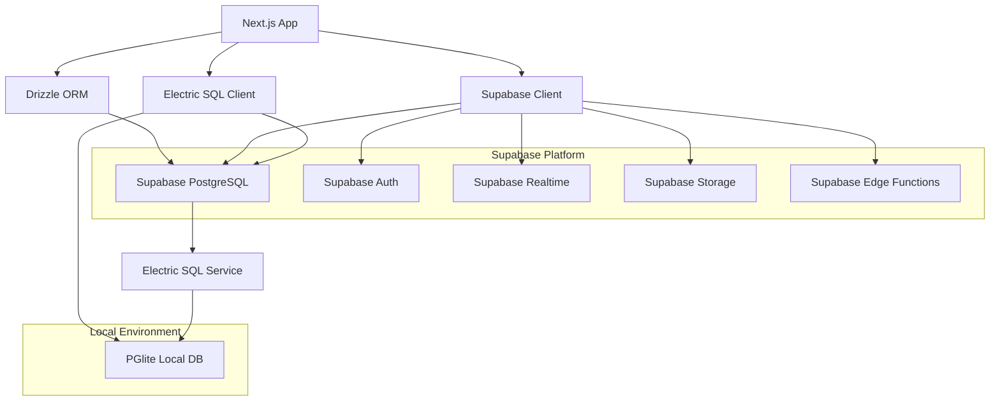

# Design Document

## Overview

This design outlines the migration from NeonDB to Supabase as the primary PostgreSQL database provider while maintaining Electric SQL integration for real-time synchronization. The migration will leverage Supabase's comprehensive backend-as-a-service features including authentication, real-time subscriptions, edge functions, and storage, while preserving the existing Drizzle ORM schema and Electric SQL architecture.

The migration strategy focuses on minimal code changes, zero data loss, and enhanced capabilities through Supabase's additional services.

## Architecture

### Current Architecture
- **Database Provider**: NeonDB Serverless PostgreSQL
- **ORM**: Drizzle ORM with neon-http adapter
- **Real-time Sync**: Electric SQL with PGlite for local-first architecture
- **Connection Management**: Neon serverless client with connection pooling
- **Schema Management**: Drizzle Kit for migrations

### Target Architecture
- **Database Provider**: Supabase PostgreSQL
- **ORM**: Drizzle ORM with postgres-js adapter
- **Real-time Sync**: Electric SQL integrated with Supabase PostgreSQL
- **Connection Management**: Supabase client with built-in connection pooling
- **Schema Management**: Drizzle Kit + Supabase CLI for migrations
- **Additional Services**: Supabase Auth, Realtime, Edge Functions, Storage

### Integration Points



## Components and Interfaces

### 1. Database Connection Layer

#### Supabase Connection Configuration
```typescript
interface SupabaseConfig {
  url: string;
  anonKey: string;
  serviceRoleKey?: string;
  schema?: string;
  realtime?: {
    enabled: boolean;
    heartbeatIntervalMs?: number;
  };
  auth?: {
    autoRefreshToken?: boolean;
    persistSession?: boolean;
  };
}
```

#### Updated Database Connection
```typescript
// Replace neon client with postgres-js + Supabase
import { createClient } from '@supabase/supabase-js';
import postgres from 'postgres';
import { drizzle } from 'drizzle-orm/postgres-js';

export function createSupabaseDatabaseClient(config: SupabaseConfig) {
  // Direct PostgreSQL connection for Drizzle
  const sql = postgres(config.url);
  const db = drizzle(sql, { schema });
  
  // Supabase client for additional services
  const supabase = createClient(config.url, config.anonKey);
  
  return { db, supabase };
}
```

### 2. Electric SQL Integration

#### Electric SQL Configuration for Supabase
```typescript
interface ElectricSupabaseConfig {
  supabaseUrl: string;
  supabaseAnonKey: string;
  electricUrl: string;
  electricToken?: string;
  syncTables: string[];
  conflictResolution: 'last-write-wins' | 'custom';
}
```

#### Enhanced Electric Client
```typescript
export class ElectricSupabaseClient {
  private supabase: SupabaseClient;
  private electric: ElectricClient;
  private pglite: PGlite;
  
  async initialize(config: ElectricSupabaseConfig) {
    // Initialize Supabase client
    this.supabase = createClient(config.supabaseUrl, config.supabaseAnonKey);
    
    // Initialize Electric SQL with Supabase connection
    this.electric = await Electric.init({
      url: config.electricUrl,
      token: config.electricToken,
      database: {
        connectionString: config.supabaseUrl,
        ssl: true
      }
    });
    
    // Initialize local PGlite instance
    this.pglite = new PGlite();
    
    // Set up bidirectional sync
    await this.setupSync(config.syncTables);
  }
}
```

### 3. Migration Service

#### Data Migration Component
```typescript
interface MigrationService {
  validateSourceData(): Promise<ValidationResult>;
  createSupabaseSchema(): Promise<void>;
  migrateData(batchSize?: number): Promise<MigrationResult>;
  validateMigration(): Promise<ValidationResult>;
  rollback(): Promise<void>;
}
```

#### Migration Progress Tracking
```typescript
interface MigrationProgress {
  phase: 'validation' | 'schema' | 'data' | 'verification' | 'complete';
  tablesCompleted: string[];
  totalRecords: number;
  migratedRecords: number;
  errors: MigrationError[];
  startTime: Date;
  estimatedCompletion?: Date;
}
```

### 4. Enhanced Features Integration

#### Authentication Integration
```typescript
interface AuthService {
  signIn(email: string, password: string): Promise<AuthResult>;
  signUp(email: string, password: string): Promise<AuthResult>;
  signOut(): Promise<void>;
  getCurrentUser(): Promise<User | null>;
  onAuthStateChange(callback: (user: User | null) => void): void;
}
```

#### Real-time Subscriptions
```typescript
interface RealtimeService {
  subscribeToTable<T>(
    table: string,
    callback: (payload: RealtimePayload<T>) => void
  ): RealtimeSubscription;
  
  subscribeToChanges<T>(
    table: string,
    filter?: string,
    callback: (payload: RealtimePayload<T>) => void
  ): RealtimeSubscription;
}
```

## Data Models

### Preserved Schema Structure
All existing Drizzle schema definitions will be preserved:
- `tasks` table with vector embeddings
- `environments` table with GitHub integration
- `agentExecutions` table with observability data
- `observabilityEvents` table for monitoring
- `agentMemory` table with vector search
- `workflows` and `workflowExecutions` tables
- `executionSnapshots` table for debugging

### Enhanced Schema Features
```sql
-- Enable Row Level Security (RLS)
ALTER TABLE tasks ENABLE ROW LEVEL SECURITY;
ALTER TABLE environments ENABLE ROW LEVEL SECURITY;
ALTER TABLE agent_executions ENABLE ROW LEVEL SECURITY;

-- Create RLS policies
CREATE POLICY "Users can only access their own tasks" ON tasks
  FOR ALL USING (auth.uid()::text = user_id);

CREATE POLICY "Users can only access their own environments" ON environments
  FOR ALL USING (auth.uid()::text = user_id);

-- Enable real-time subscriptions
ALTER PUBLICATION supabase_realtime ADD TABLE tasks;
ALTER PUBLICATION supabase_realtime ADD TABLE environments;
ALTER PUBLICATION supabase_realtime ADD TABLE agent_executions;
```

### Vector Search Enhancement
```sql
-- Enable pgvector extension
CREATE EXTENSION IF NOT EXISTS vector;

-- Create vector similarity search functions
CREATE OR REPLACE FUNCTION match_tasks(
  query_embedding vector(1536),
  match_threshold float,
  match_count int
)
RETURNS TABLE (
  id uuid,
  title varchar,
  description text,
  similarity float
)
LANGUAGE sql STABLE
AS $$
  SELECT
    id,
    title,
    description,
    1 - (embedding <=> query_embedding) AS similarity
  FROM tasks
  WHERE 1 - (embedding <=> query_embedding) > match_threshold
  ORDER BY embedding <=> query_embedding
  LIMIT match_count;
$$;
```

## Error Handling

### Migration Error Recovery
```typescript
interface ErrorRecoveryStrategy {
  retryableErrors: string[];
  maxRetries: number;
  backoffStrategy: 'linear' | 'exponential';
  rollbackOnFailure: boolean;
  
  handleError(error: MigrationError): Promise<ErrorAction>;
}

type ErrorAction = 'retry' | 'skip' | 'rollback' | 'manual';
```

### Connection Resilience
```typescript
interface ConnectionResilience {
  healthCheck(): Promise<boolean>;
  reconnect(): Promise<void>;
  fallbackToCache(): Promise<void>;
  queueOperations(operations: DatabaseOperation[]): void;
  syncQueuedOperations(): Promise<void>;
}
```

### Electric SQL Error Handling
```typescript
interface ElectricErrorHandler {
  handleSyncConflict<T>(conflict: SyncConflict<T>): Promise<T>;
  handleConnectionLoss(): Promise<void>;
  handleSchemaVersionMismatch(): Promise<void>;
  retryFailedOperations(): Promise<void>;
}
```

## Testing Strategy

### Migration Testing
1. **Unit Tests**: Individual migration functions and data transformations
2. **Integration Tests**: End-to-end migration process with test datasets
3. **Performance Tests**: Migration speed and resource usage with large datasets
4. **Rollback Tests**: Verify rollback functionality works correctly

### Electric SQL Testing
1. **Sync Tests**: Verify bidirectional synchronization between Supabase and PGlite
2. **Conflict Resolution Tests**: Test conflict resolution strategies
3. **Offline Tests**: Verify offline functionality and queue management
4. **Performance Tests**: Sync performance with large datasets

### Supabase Features Testing
1. **Auth Tests**: Authentication flow integration
2. **Realtime Tests**: Real-time subscription functionality
3. **RLS Tests**: Row Level Security policy enforcement
4. **Edge Function Tests**: Custom business logic execution

### Test Data Management
```typescript
interface TestDataManager {
  createTestEnvironment(): Promise<TestEnvironment>;
  seedTestData(tables: string[]): Promise<void>;
  cleanupTestData(): Promise<void>;
  compareDatasets(source: Dataset, target: Dataset): ComparisonResult;
}
```

### Automated Testing Pipeline
```yaml
# GitHub Actions workflow for migration testing
name: Supabase Migration Tests
on: [push, pull_request]

jobs:
  migration-test:
    runs-on: ubuntu-latest
    services:
      postgres:
        image: postgres:15
        env:
          POSTGRES_PASSWORD: postgres
        options: >-
          --health-cmd pg_isready
          --health-interval 10s
          --health-timeout 5s
          --health-retries 5
    
    steps:
      - uses: actions/checkout@v3
      - name: Setup Supabase CLI
        run: npm install -g @supabase/cli
      - name: Start Supabase
        run: supabase start
      - name: Run migration tests
        run: npm run test:migration
      - name: Test Electric SQL integration
        run: npm run test:electric
      - name: Cleanup
        run: supabase stop
```

## Performance Considerations

### Connection Optimization
- Use Supabase connection pooling (PgBouncer)
- Implement connection retry logic with exponential backoff
- Monitor connection pool usage and adjust limits

### Query Optimization
- Leverage Supabase's built-in query optimization
- Use prepared statements for frequently executed queries
- Implement query result caching where appropriate

### Electric SQL Performance
- Optimize sync batch sizes based on network conditions
- Implement incremental sync for large tables
- Use compression for sync payloads

### Vector Search Optimization
```sql
-- Create HNSW index for vector similarity search
CREATE INDEX ON tasks USING hnsw (embedding vector_cosine_ops);

-- Optimize vector search queries
CREATE INDEX ON agent_memory USING hnsw (embedding vector_cosine_ops);
```

## Security Considerations

### Row Level Security (RLS)
- Implement comprehensive RLS policies for all user-accessible tables
- Use Supabase Auth for user identification in policies
- Test RLS policies thoroughly to prevent data leaks

### API Security
- Use Supabase service role key only for server-side operations
- Implement proper API rate limiting
- Validate all user inputs and sanitize queries

### Electric SQL Security
- Secure Electric SQL service endpoints
- Implement proper authentication for Electric SQL connections
- Encrypt sync payloads in transit

### Environment Security
```typescript
interface SecurityConfig {
  supabaseUrl: string;
  supabaseAnonKey: string;
  supabaseServiceRoleKey?: string; // Server-side only
  electricUrl: string;
  electricToken?: string;
  enableRLS: boolean;
  encryptSyncPayloads: boolean;
}
```

## Deployment Strategy

### Environment Configuration
```typescript
// Development environment
const devConfig: SupabaseConfig = {
  url: process.env.SUPABASE_DEV_URL!,
  anonKey: process.env.SUPABASE_DEV_ANON_KEY!,
  schema: 'public'
};

// Production environment
const prodConfig: SupabaseConfig = {
  url: process.env.SUPABASE_PROD_URL!,
  anonKey: process.env.SUPABASE_PROD_ANON_KEY!,
  serviceRoleKey: process.env.SUPABASE_PROD_SERVICE_ROLE_KEY!,
  schema: 'public'
};
```

### Migration Deployment
1. **Pre-migration**: Set up Supabase projects and configure Electric SQL
2. **Schema Migration**: Deploy database schema to Supabase
3. **Data Migration**: Transfer data from NeonDB to Supabase
4. **Application Deployment**: Deploy updated application code
5. **Post-migration**: Verify functionality and monitor performance

### Rollback Strategy
```typescript
interface RollbackPlan {
  preserveNeonConnection: boolean;
  rollbackTimeoutMs: number;
  dataBackupLocation: string;
  rollbackSteps: RollbackStep[];
}

interface RollbackStep {
  name: string;
  action: () => Promise<void>;
  verifySuccess: () => Promise<boolean>;
}
```

## Monitoring and Observability

### Migration Monitoring
- Track migration progress and performance metrics
- Monitor error rates and types during migration
- Set up alerts for migration failures or performance issues

### Post-Migration Monitoring
- Monitor Supabase database performance and connection health
- Track Electric SQL sync performance and error rates
- Monitor application performance after migration

### Metrics Collection
```typescript
interface MigrationMetrics {
  migrationDuration: number;
  recordsMigrated: number;
  errorCount: number;
  performanceMetrics: {
    avgQueryTime: number;
    connectionPoolUsage: number;
    syncLatency: number;
  };
}
```

This design provides a comprehensive approach to migrating from NeonDB to Supabase while maintaining Electric SQL integration and enhancing the application with Supabase's additional features.