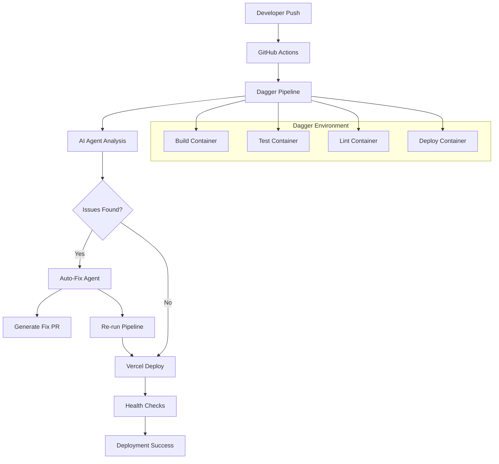

# Design Document

## Overview

The Vercel Deployment Optimization system will enhance our CI/CD pipeline by integrating Vercel CLI automation with Dagger's AI-powered self-healing capabilities. This design combines traditional deployment optimization with cutting-edge AI agents that can automatically fix CI failures, creating a robust and intelligent deployment pipeline.

## Architecture

### High-Level Architecture



### Component Integration

The system integrates three main components:
1. **Vercel CLI Automation**: Handles deployment orchestration
2. **Dagger Pipeline**: Provides containerized, reproducible builds
3. **AI Agent System**: Automatically fixes common CI/CD issues

## Components and Interfaces

### 1. Dagger Module Structure

```typescript
// dagger/src/index.ts
export class VercelDeployment {
  // Core deployment functions
  async build(source: Directory): Promise<Container>
  async test(source: Directory): Promise<string>
  async lint(source: Directory): Promise<string>
  async deploy(source: Directory, env: string): Promise<string>
  
  // AI Agent functions
  async debugTests(source: Directory, failures: string): Promise<string>
  async autoFix(source: Directory, issues: string): Promise<Directory>
}
```

### 2. Vercel CLI Integration

```typescript
// lib/deployment/vercel-cli.ts
export class VercelCLI {
  async authenticate(): Promise<void>
  async deploy(options: DeployOptions): Promise<DeployResult>
  async getDeploymentStatus(deploymentId: string): Promise<DeploymentStatus>
  async createPreview(branch: string): Promise<PreviewDeployment>
  async promoteToProduction(deploymentId: string): Promise<void>
}
```

### 3. AI Agent Workspace

```typescript
// dagger/workspace/index.ts
export class Workspace {
  async readFile(path: string): Promise<string>
  async writeFile(path: string, content: string): Promise<void>
  async listFiles(path: string): Promise<string[]>
  async runTests(): Promise<string>
  async runLint(): Promise<string>
  async runBuild(): Promise<string>
}
```

### 4. Environment Configuration Manager

```typescript
// lib/deployment/env-manager.ts
export class EnvironmentManager {
  async validateEnvironment(env: string): Promise<ValidationResult>
  async syncEnvironmentVariables(env: string): Promise<void>
  async getRequiredSecrets(env: string): Promise<string[]>
}
```

## Data Models

### Deployment Configuration

```typescript
interface DeploymentConfig {
  projectId: string
  orgId: string
  environment: 'development' | 'preview' | 'production'
  buildCommand: string
  outputDirectory: string
  environmentVariables: Record<string, string>
  regions: string[]
  functions: FunctionConfig[]
}

interface FunctionConfig {
  pattern: string
  maxDuration: number
  memory: number
  runtime?: string
}
```

### AI Agent Context

```typescript
interface AgentContext {
  source: Directory
  failures: string[]
  environment: string
  availableTools: string[]
  maxIterations: number
}

interface FixResult {
  success: boolean
  diff: string
  description: string
  testsPass: boolean
}
```

### Health Check Configuration

```typescript
interface HealthCheck {
  name: string
  url: string
  method: 'GET' | 'POST'
  expectedStatus: number
  timeout: number
  retries: number
  headers?: Record<string, string>
}
```

## Error Handling

### 1. Deployment Failures

```typescript
class DeploymentError extends Error {
  constructor(
    message: string,
    public code: string,
    public deploymentId?: string,
    public logs?: string[]
  ) {
    super(message)
  }
}

// Error recovery strategies
const errorHandlers = {
  BUILD_TIMEOUT: async (error: DeploymentError) => {
    // Optimize build configuration
    await optimizeBuildSettings()
    return retry()
  },
  
  ENV_MISSING: async (error: DeploymentError) => {
    // Auto-sync environment variables
    await syncMissingEnvironmentVariables()
    return retry()
  },
  
  LINT_FAILURE: async (error: DeploymentError) => {
    // Trigger AI agent to fix linting issues
    const fix = await aiAgent.fixLintIssues(error.logs)
    await createFixPullRequest(fix)
    return 'fix_created'
  }
}
```

### 2. AI Agent Error Handling

```typescript
class AgentWorkspace {
  async executeWithRetry<T>(
    operation: () => Promise<T>,
    maxRetries: number = 3
  ): Promise<T> {
    for (let i = 0; i < maxRetries; i++) {
      try {
        return await operation()
      } catch (error) {
        if (i === maxRetries - 1) throw error
        await this.analyzeFailure(error)
      }
    }
  }
}
```

## Testing Strategy

### 1. Unit Testing

```typescript
// tests/unit/vercel-cli.test.ts
describe('VercelCLI', () => {
  it('should authenticate successfully', async () => {
    const cli = new VercelCLI()
    await expect(cli.authenticate()).resolves.not.toThrow()
  })
  
  it('should handle deployment failures gracefully', async () => {
    const cli = new VercelCLI()
    const result = await cli.deploy({ /* invalid config */ })
    expect(result.success).toBe(false)
    expect(result.error).toBeDefined()
  })
})
```

### 2. Integration Testing

```typescript
// tests/integration/dagger-pipeline.test.ts
describe('Dagger Pipeline', () => {
  it('should build and deploy successfully', async () => {
    const pipeline = new VercelDeployment()
    const source = await dag.host().directory('.')
    
    const buildResult = await pipeline.build(source)
    expect(buildResult).toBeDefined()
    
    const deployResult = await pipeline.deploy(source, 'preview')
    expect(deployResult).toContain('https://')
  })
})
```

### 3. AI Agent Testing

```typescript
// tests/integration/ai-agent.test.ts
describe('AI Agent', () => {
  it('should fix linting errors automatically', async () => {
    const workspace = new Workspace()
    const agent = new DebugAgent()
    
    // Introduce linting error
    await workspace.writeFile('test.ts', 'const x = 1;; // double semicolon')
    
    const lintResult = await workspace.runLint()
    expect(lintResult).toContain('error')
    
    const fix = await agent.debugTests(workspace, lintResult)
    expect(fix).toContain('const x = 1; // fixed')
  })
})
```

### 4. End-to-End Testing

```typescript
// tests/e2e/deployment-flow.test.ts
describe('Full Deployment Flow', () => {
  it('should deploy from PR to production', async () => {
    // Create PR with changes
    const pr = await createTestPR()
    
    // Verify preview deployment
    const preview = await waitForPreviewDeployment(pr.number)
    expect(preview.status).toBe('ready')
    
    // Merge PR
    await mergePR(pr.number)
    
    // Verify production deployment
    const production = await waitForProductionDeployment()
    expect(production.status).toBe('ready')
    
    // Run health checks
    const healthChecks = await runHealthChecks(production.url)
    expect(healthChecks.allPassed).toBe(true)
  })
})
```

## Implementation Phases

### Phase 1: Core Dagger Integration
- Set up Dagger module structure
- Implement basic build/test/deploy functions
- Create containerized environments for each step

### Phase 2: Vercel CLI Automation
- Integrate Vercel CLI with Dagger containers
- Implement environment-specific deployments
- Add preview deployment automation

### Phase 3: AI Agent Implementation
- Create Workspace module with file operations
- Implement DebugTests function for auto-fixing
- Add GitHub integration for fix suggestions

### Phase 4: Advanced Features
- Implement self-healing pipeline capabilities
- Add comprehensive health checks
- Create deployment analytics and monitoring

### Phase 5: MCP Integration
- Expose Dagger modules as MCP servers
- Enable AI assistants to interact with deployment pipeline
- Create natural language deployment commands