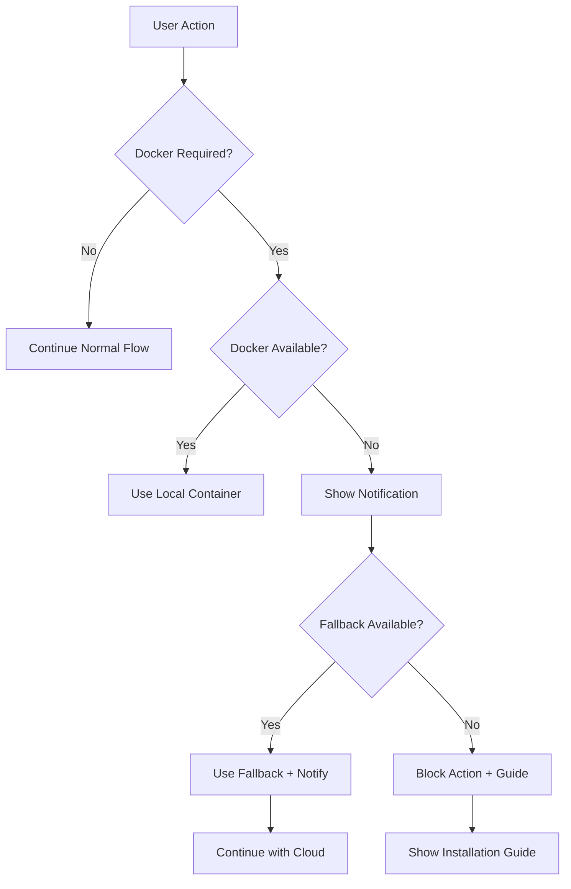

# Docker/Container Integration Requirements - Solomon Codes

## Executive Summary

This document provides a comprehensive analysis of Docker and container integration requirements for the solomon_codes application, focusing on when containerization is needed for local mode execution, Dagger integration benefits, and user experience improvements for container dependency notifications.

## Table of Contents

1. [Container Requirements Matrix](#container-requirements-matrix)
2. [Current Architecture Analysis](#current-architecture-analysis)
3. [Dagger Integration Benefits](#dagger-integration-benefits)
4. [Local Mode Alert System](#local-mode-alert-system)
5. [Implementation Roadmap](#implementation-roadmap)

## Container Requirements Matrix

### When Docker is REQUIRED

| Feature | Component | Docker Requirement | Fallback Available | Notes |
|---------|-----------|-------------------|-------------------|-------|
| **Local VibeKit Development** | `@vibe-kit/dagger` | ✅ **REQUIRED** | ✅ E2B Cloud | Enables local containerized execution |
| **Local Observability** | Jaeger/OTEL | ✅ **REQUIRED** | ✅ Cloud APM | `docker-compose.observability.yml` |
| **Local Database Testing** | PostgreSQL + pgvector | ⚠️ **RECOMMENDED** | ✅ Supabase Cloud | Enhanced testing isolation |
| **CLI Tool Development** | Various dev containers | ⚠️ **RECOMMENDED** | ✅ Host installation | Consistent environments |

### When Docker is OPTIONAL

| Feature | Component | Docker Requirement | Default Provider | Notes |
|---------|-----------|-------------------|-----------------|-------|
| **Browser Automation** | Browserbase/Stagehand | ❌ **NOT REQUIRED** | Cloud (Browserbase) | Cloud-first architecture |
| **Code Execution** | E2B Sandbox | ❌ **NOT REQUIRED** | Cloud (E2B) | Sandboxed cloud execution |
| **Production Deployment** | Railway/Vercel/Cloudflare | ❌ **NOT REQUIRED** | Platform containers | Managed platforms |
| **Basic Development** | Next.js dev server | ❌ **NOT REQUIRED** | Node.js runtime | Standard web development |

## Current Architecture Analysis

### Hybrid Sandbox Architecture

The application implements a sophisticated hybrid approach:

```typescript
// Location: apps/web/src/app/actions/vibekit.ts
async function createSandboxProvider(config, githubToken, useLocal = false) {
  const isDevelopment = config.app.environment === "development";
  const hasDockerAccess = process.env.DOCKER_HOST || process.platform !== "win32";

  // Use Dagger for local development when requested and possible
  if (useLocal && isDevelopment && hasDockerAccess) {
    try {
      const { createLocalProvider } = await import("@vibe-kit/dagger");
      return createLocalProvider({ githubToken, preferRegistryImages: true });
    } catch (error) {
      // Fall through to E2B
    }
  }

  // Use E2B for cloud execution
  return createE2BProvider({ apiKey: config.e2b.apiKey, templateId: "vibekit-codex" });
}
```

### Docker Detection Logic

#### Current Implementation

1. **CLI Setup Dialog** (`apps/web/src/components/cli-setup-dialog.tsx`):
   - Checks Docker version with `docker --version`
   - Mock implementation for UI demonstration
   - Includes Docker in prerequisites check

2. **Sandbox Store** (`apps/web/src/stores/sandbox.ts`):
   - Platform-based Docker detection
   - Environment variable checking (`DOCKER_HOST`)
   - Automatic fallback logic

3. **VibeKit Actions**:
   - Dynamic import of Dagger provider
   - Graceful fallback to E2B on failure
   - Comprehensive error handling

#### Limitations of Current Approach

- **Client-side detection**: Limited accuracy for Docker daemon status
- **Platform assumptions**: `process.platform !== "win32"` may not be reliable
- **Static checks**: No runtime Docker daemon connectivity verification
- **Missing user feedback**: No proactive notification about Docker requirements

## Dagger Integration Benefits

### 1. CI/CD Orchestration Capabilities

**Current Pain Points:**
- Multiple deployment targets (Railway, Vercel, Cloudflare)
- Environment-specific configuration management
- Inconsistent build processes across platforms

**Dagger Solutions:**
- **Unified Pipeline Definition**: Single Dagger pipeline for all deployment targets
- **Local Development Parity**: Identical environment between local and CI
- **Portable Build Logic**: Language-agnostic pipeline definitions

### 2. Enhanced Local Development Experience

**Benefits:**
```typescript
// Proposed Dagger Integration
const daggerPipeline = {
  // Consistent build environment
  buildEnvironment: "node:20-alpine",
  
  // Integrated testing
  testStages: ["unit", "integration", "e2e"],
  
  // Multi-target deployment
  deployTargets: ["railway", "vercel", "cloudflare"],
  
  // Local development acceleration
  hotReload: true,
  caching: "aggressive"
};
```

### 3. Container-use Integration

**Architecture Improvements:**
- **Service Discovery**: Automatic container networking
- **Secret Management**: Secure environment variable injection
- **Resource Optimization**: Intelligent container resource allocation
- **Dependency Management**: Automatic service orchestration

### 4. Testing Enhancement

**Current State:**
- E2E tests with Playwright
- Unit tests with Vitest
- Database tests with Supabase branching

**Dagger Enhancements:**
- **Isolated Test Environments**: Each test suite in separate containers
- **Parallel Execution**: Multi-container test parallelization
- **Database Seeding**: Automated test data management
- **Cross-browser Testing**: Containerized browser environments

## Local Mode Alert System

### Current Toast Infrastructure

**Existing Components:**
- **Sonner Integration**: `apps/web/src/components/ui/sonner.tsx`
- **Theme Support**: Automatic dark/light mode adaptation
- **PWA Notifications**: Update notification system precedent

### Docker Requirement Notification Design

#### 1. Smart Detection System

```typescript
// Proposed: apps/web/src/lib/docker/detection.ts
interface DockerStatus {
  available: boolean;
  version?: string;
  daemon: boolean;
  error?: string;
}

class DockerDetector {
  async checkAvailability(): Promise<DockerStatus> {
    // 1. Check Docker CLI presence
    // 2. Verify daemon connectivity
    // 3. Test container execution capability
    // 4. Return comprehensive status
  }
}
```

#### 2. Context-Aware Notifications

**Notification Triggers:**
- User selects "Local" sandbox mode without Docker
- VibeKit local execution fails
- Observability stack startup requested
- Development environment setup

**Message Examples:**
```typescript
const dockerNotifications = {
  sandboxFallback: {
    title: "Local Sandbox Unavailable",
    message: "Docker not detected. Using cloud sandbox instead.",
    action: "Install Docker",
    priority: "info"
  },
  
  observabilitySetup: {
    title: "Docker Required for Local Monitoring",
    message: "Install Docker to run Jaeger and OTEL locally.",
    action: "Setup Guide",
    priority: "warning"
  },
  
  daggerDevelopment: {
    title: "Enhanced Development Available",
    message: "Install Docker to enable local containerized development.",
    action: "Learn More",
    priority: "suggestion"
  }
};
```

#### 3. User Experience Flow



#### 4. Notification Component Design

```tsx
// Proposed: apps/web/src/components/docker/requirement-toast.tsx
interface DockerRequirementToastProps {
  feature: string;
  required: boolean;
  fallbackAvailable: boolean;
  onInstallGuide: () => void;
  onUseFallback?: () => void;
}

export function DockerRequirementToast({
  feature,
  required,
  fallbackAvailable,
  onInstallGuide,
  onUseFallback
}: DockerRequirementToastProps) {
  const toastType = required ? "warning" : "info";
  
  return (
    <div className="docker-requirement-toast">
      <div className="toast-content">
        <ContainerIcon className="toast-icon" />
        <div className="toast-text">
          <h4>Docker {required ? "Required" : "Recommended"} for {feature}</h4>
          <p>
            {required 
              ? "This feature requires Docker to be installed and running."
              : "Install Docker for enhanced local development experience."
            }
          </p>
        </div>
      </div>
      <div className="toast-actions">
        <Button onClick={onInstallGuide} variant="outline">
          Install Guide
        </Button>
        {fallbackAvailable && onUseFallback && (
          <Button onClick={onUseFallback} variant="default">
            Use Cloud Instead
          </Button>
        )}
      </div>
    </div>
  );
}
```

### Installation Guide Integration

#### Multi-Platform Docker Installation

```typescript
// Proposed: apps/web/src/lib/docker/installation-guide.ts
const dockerInstallation = {
  detection: {
    platform: process.platform,
    architecture: process.arch,
    wsl: process.platform === "win32" && !!process.env.WSL_DISTRO_NAME
  },
  
  guides: {
    "darwin": {
      title: "Install Docker Desktop for macOS",
      url: "https://docs.docker.com/desktop/install/mac-install/",
      commands: ["brew install --cask docker"]
    },
    
    "win32": {
      title: "Install Docker Desktop for Windows",
      url: "https://docs.docker.com/desktop/install/windows-install/",
      commands: ["winget install Docker.DockerDesktop"]
    },
    
    "linux": {
      title: "Install Docker Engine for Linux",
      url: "https://docs.docker.com/engine/install/",
      commands: [
        "curl -fsSL https://get.docker.com -o get-docker.sh",
        "sudo sh get-docker.sh"
      ]
    }
  }
};
```

## Implementation Roadmap

### Phase 1: Enhanced Docker Detection (Week 1-2)

**Priority: High**

1. **Improve Docker Detection Logic**
   - [ ] Create comprehensive Docker status checker
   - [ ] Implement daemon connectivity verification
   - [ ] Add container execution capability testing
   - [ ] Handle WSL and virtual environment edge cases

2. **Update Sandbox Store**
   - [ ] Replace simple platform check with robust detection
   - [ ] Add Docker daemon status monitoring
   - [ ] Implement periodic availability checking
   - [ ] Store Docker version and capabilities

**Expected Outcome:** Reliable Docker availability detection across all platforms.

### Phase 2: User Notification System (Week 2-3)

**Priority: High**

1. **Docker Requirement Toast Components**
   - [ ] Create reusable Docker notification component
   - [ ] Integrate with existing Sonner toast system
   - [ ] Design context-aware notification messages
   - [ ] Implement user action handlers

2. **Installation Guide Integration**
   - [ ] Create platform-specific installation guides
   - [ ] Add in-app Docker setup wizard
   - [ ] Implement post-installation verification
   - [ ] Design troubleshooting assistance

**Expected Outcome:** Clear, actionable notifications when Docker is needed.

### Phase 3: Dagger CI/CD Integration (Week 3-5)

**Priority: Medium**

1. **Dagger Pipeline Development**
   - [ ] Create unified build pipeline definition
   - [ ] Implement multi-target deployment support
   - [ ] Add local development acceleration
   - [ ] Integrate with existing testing infrastructure

2. **Local Development Enhancement**
   - [ ] Containerized development environment
   - [ ] Hot-reload container configuration
   - [ ] Integrated debugging support
   - [ ] Performance optimization for local containers

**Expected Outcome:** Unified, efficient CI/CD pipeline with excellent local development experience.

### Phase 4: Advanced Container Features (Week 5-6)

**Priority: Low**

1. **Observability Stack Integration**
   - [ ] Automated local monitoring setup
   - [ ] Container health monitoring
   - [ ] Performance metrics collection
   - [ ] Log aggregation and analysis

2. **Testing Infrastructure Enhancement**
   - [ ] Containerized test environments
   - [ ] Parallel test execution
   - [ ] Database seeding automation
   - [ ] Cross-browser testing containers

**Expected Outcome:** Professional-grade development and testing infrastructure.

## Technical Specifications

### Docker Detection API

```typescript
interface DockerCapabilities {
  cli: boolean;          // Docker CLI available
  daemon: boolean;       // Docker daemon running
  compose: boolean;      // Docker Compose available
  buildx: boolean;       // Docker Buildx available
  version: string;       // Docker version
  platform: string;     // Host platform
  architecture: string; // Host architecture
}

interface DockerDetectionResult {
  available: boolean;
  capabilities: DockerCapabilities;
  recommendations: string[];
  errors: string[];
}
```

### Notification System Integration

```typescript
interface ContainerNotification {
  id: string;
  feature: string;
  type: "required" | "recommended" | "optional";
  fallback: {
    available: boolean;
    provider: string;
    performance: "better" | "similar" | "worse";
  };
  actions: {
    install: () => void;
    guide: () => void;
    useFallback?: () => void;
    dismiss: () => void;
  };
}
```

## Success Metrics

### User Experience Metrics

1. **Docker Adoption Rate**: Percentage of users who install Docker after notification
2. **Fallback Usage**: Frequency of cloud fallback when Docker unavailable
3. **Setup Completion Time**: Time from notification to successful Docker setup
4. **Support Request Reduction**: Decrease in Docker-related support inquiries

### Development Metrics

1. **Build Time Improvement**: Local Dagger builds vs traditional CI
2. **Test Execution Speed**: Containerized vs non-containerized test runs
3. **Development Environment Consistency**: Cross-platform development experience
4. **Container Resource Efficiency**: Memory and CPU usage optimization

### Reliability Metrics

1. **Detection Accuracy**: Docker availability detection precision
2. **Fallback Success Rate**: Cloud provider fallback reliability
3. **Container Startup Time**: Local development environment initialization
4. **Error Recovery**: Graceful handling of Docker-related failures

## Conclusion

The solomon_codes application demonstrates excellent architectural foresight with its hybrid container approach. The current implementation provides robust fallback mechanisms while offering enhanced local development capabilities when Docker is available.

**Key Recommendations:**

1. **Enhance Docker Detection**: Move beyond platform assumptions to actual capability testing
2. **Improve User Experience**: Provide clear, actionable notifications about Docker requirements
3. **Leverage Dagger**: Utilize Dagger's CI/CD capabilities for unified pipeline management
4. **Maintain Flexibility**: Preserve cloud-first architecture while enhancing local capabilities

The proposed implementation roadmap ensures minimal disruption to existing workflows while significantly improving the development experience for users who choose to leverage containerization.