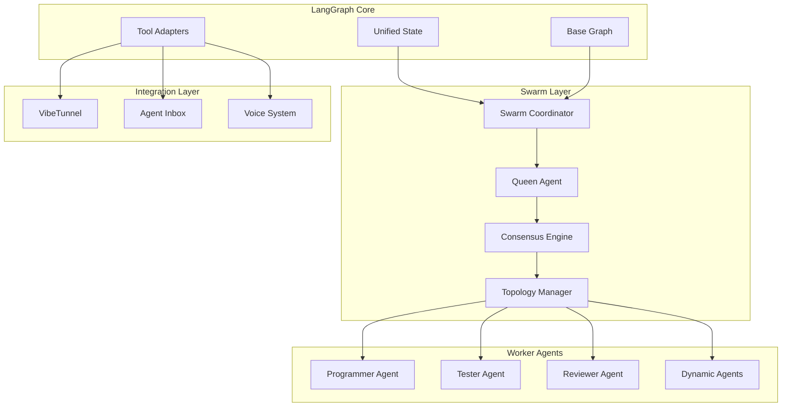

# Solomon Codes → LangGraph Migration Plan

## Executive Summary

This document outlines the comprehensive migration plan to unify Solomon Codes and Claude Flow features into a single LangGraph-based architecture. The migration introduces a swarm-based development approach with Test-Driven Development (TDD) London School methodology, ensuring high code quality and maintainability.

## Table of Contents

1. [Architecture Overview](#architecture-overview)
2. [Migration Phases](#migration-phases)
3. [Technical Implementation](#technical-implementation)
4. [Testing Strategy](#testing-strategy)
5. [Integration Points](#integration-points)
6. [Migration Timeline](#migration-timeline)
7. [Risk Management](#risk-management)

## Architecture Overview

### Current State

Solomon Codes currently consists of:
- **Multiple Agent Types**: Manager, Planner, Programmer, Reviewer
- **Sequential Workflow**: Linear task progression
- **Traditional Architecture**: Service-based approach

### Target State

The unified LangGraph architecture will feature:
- **Swarm-Based Coordination**: Queen AI with worker agents
- **Dynamic Topology**: Adaptive swarm configurations
- **Event-Driven Architecture**: Reactive agent collaboration
- **Unified State Management**: Single source of truth

### Key Components



## Migration Phases

### Phase 1: Core LangGraph Foundation ✅ (In Progress)

**Status**: 90% Complete

**Completed**:
- ✅ Package structure (`@solomon/core`)
- ✅ Unified state schema
- ✅ TDD infrastructure setup
- ✅ Test doubles for all components
- ✅ SwarmCoordinator implementation
- ✅ Queen Agent interface
- ✅ Consensus Engine
- ✅ Topology Manager

**Remaining**:
- 🔄 Fix final test (agent limit test)
- ⏳ LangGraph integration test doubles
- ⏳ Base graph configuration

### Phase 2: Agent Migration to LangGraph

**Components to Migrate**:
1. **Manager Agent** → Queen Agent Coordinator
2. **Planner Agent** → Strategic Worker
3. **Programmer Agent** → Implementation Worker
4. **Reviewer Agent** → Quality Worker

**Implementation Steps**:
```typescript
// Example: Programmer Agent Migration
export class ProgrammerWorker extends BaseWorker {
  constructor(config: WorkerConfig) {
    super({
      ...config,
      capabilities: ['coding', 'debugging', 'refactoring'],
      role: 'programmer'
    });
  }

  async execute(task: Task): Promise<TaskResult> {
    // Implement with LangGraph state transitions
    const state = await this.graph.invoke({
      messages: [task.description],
      context: task.context
    });
    
    return this.processResult(state);
  }
}
```

### Phase 3: VibeTunnel & Agent Inbox Integration

**VibeTunnel Integration**:
- Browser-based terminal access
- Real-time command execution
- Secure WebSocket connections
- Agent authentication

**Agent Inbox Features**:
- Message queuing system
- Priority-based routing
- Dead letter handling
- Message persistence

### Phase 4: Testing & Optimization

**Testing Coverage**:
- Unit tests: 80%+ coverage
- Integration tests: Critical paths
- E2E tests: User workflows
- Performance tests: Swarm scalability

## Technical Implementation

### Swarm Coordinator

The SwarmCoordinator is the central orchestration component:

```typescript
export class SwarmCoordinator {
  private queenAgent: QueenAgentCapabilities;
  private consensusEngine: ConsensusEngineCapabilities;
  private topologyManager: TopologyManagerCapabilities;
  private activeWorkers: Map<string, WorkerInstance>;

  async spawnAgentsForTask(task: Task): Promise<WorkerInstance[]> {
    // Queen analyzes task requirements
    const analysis = await this.queenAgent.analyzeTask(task);
    
    // Check resource limits
    if (!this.hasAvailableSlots(analysis.agentCount)) {
      return this.handleResourceConstraints(analysis);
    }
    
    // Spawn appropriate workers
    return this.spawnWorkers(analysis);
  }

  async buildConsensus(decision: Decision): Promise<ConsensusResult> {
    // Collect votes from agents
    const votes = await this.consensusEngine.collectVotes(decision);
    
    // Calculate consensus with Byzantine fault tolerance
    const result = this.consensusEngine.calculateConsensus(votes);
    
    // Record decision
    this.queenAgent.recordDecision({ decision, result });
    
    return result;
  }
}
```

### Topology Patterns

The system supports multiple swarm topologies:

1. **Hierarchical** (Default)
   - Queen → Team Leads → Workers
   - Best for: Structured tasks

2. **Mesh**
   - Full peer-to-peer connectivity
   - Best for: Complex collaborative tasks

3. **Ring**
   - Sequential processing chain
   - Best for: Pipeline workflows

4. **Star**
   - Central hub coordination
   - Best for: Parallel independent tasks

### State Management

Unified state schema combining all features:

```typescript
export const UnifiedStateSchema = z.object({
  // Core agent states
  manager: ManagerStateSchema,
  planner: PlannerStateSchema,
  programmer: ProgrammerStateSchema,
  reviewer: ReviewerStateSchema,
  
  // Swarm coordination
  hiveMind: HiveMindStateSchema,
  
  // Voice integration
  voice: VoiceStateSchema,
  
  // Session management
  sessionId: z.string(),
  startTime: z.string(),
  lastActivity: z.string(),
  version: z.string().default("1.0.0"),
});
```

## Testing Strategy

### TDD London School Approach

All components are developed using the London School (mockist) approach:

1. **Test Doubles for Everything**
   - Mock all dependencies
   - Focus on behavior, not implementation
   - Isolated unit tests

2. **Test Structure**
   ```typescript
   describe('Component', () => {
     let component: Component;
     let testDoubles: TestDoubles;
     
     beforeEach(() => {
       testDoubles = createTestDoubles();
       component = new Component(testDoubles);
     });
     
     afterEach(async () => {
       await component.cleanup();
     });
     
     it('should behave correctly', () => {
       // Given
       testDoubles.dependency.givenBehavior();
       
       // When
       const result = component.action();
       
       // Then
       expect(result).toBe(expected);
       testDoubles.dependency.assertCalled();
     });
   });
   ```

3. **Test Coverage Requirements**
   - Branches: 80%+
   - Functions: 80%+
   - Lines: 80%+
   - Statements: 80%+

## Integration Points

### VibeKit Sandbox Integration

```typescript
interface VibeKitIntegration {
  // Daytona workspace management
  createWorkspace(config: WorkspaceConfig): Promise<Workspace>;
  
  // Cloudflare Workers deployment
  deployWorker(code: string): Promise<DeploymentResult>;
  
  // Browser-based development
  openInBrowser(workspace: Workspace): Promise<void>;
}
```

### Claude Flow Features

All Claude Flow features are preserved and enhanced:

1. **Swarm Management**
   - `swarm_init`: Initialize swarm topology
   - `agent_spawn`: Create specialized agents
   - `task_orchestrate`: Coordinate workflows

2. **Neural Integration**
   - Pattern recognition
   - Cognitive analysis
   - Adaptive learning

3. **Memory Persistence**
   - Cross-session state
   - Namespace management
   - Backup/restore capabilities

### Voice System Integration

```typescript
interface VoiceIntegration {
  // Real-time voice processing
  processVoiceCommand(audio: AudioBuffer): Promise<Command>;
  
  // Text-to-speech synthesis
  synthesizeSpeech(text: string): Promise<AudioBuffer>;
  
  // Voice agent coordination
  routeToVoiceAgent(command: Command): Promise<Response>;
}
```

## Migration Timeline

### Week 1-2: Foundation (Current)
- ✅ Core package setup
- ✅ State schema definition
- ✅ Test infrastructure
- 🔄 Complete SwarmCoordinator tests
- ⏳ LangGraph base configuration

### Week 3-4: Agent Migration
- ⏳ Migrate Manager → Queen
- ⏳ Migrate Planner → Strategic Worker
- ⏳ Migrate Programmer → Implementation Worker
- ⏳ Migrate Reviewer → Quality Worker

### Week 5-6: Integration
- ⏳ VibeTunnel integration
- ⏳ Agent Inbox implementation
- ⏳ Voice system connection
- ⏳ End-to-end testing

### Week 7-8: Optimization
- ⏳ Performance tuning
- ⏳ Load testing
- ⏳ Documentation
- ⏳ Deployment preparation

## Risk Management

### Technical Risks

1. **State Synchronization**
   - Risk: Race conditions in distributed state
   - Mitigation: Implement optimistic locking and CRDT patterns

2. **Agent Communication Overhead**
   - Risk: Network latency in swarm coordination
   - Mitigation: Local caching and batch messaging

3. **Byzantine Failures**
   - Risk: Malicious or faulty agents
   - Mitigation: Consensus engine with fault tolerance

### Migration Risks

1. **Feature Parity**
   - Risk: Missing functionality during migration
   - Mitigation: Comprehensive feature mapping and testing

2. **Performance Degradation**
   - Risk: New architecture slower than current
   - Mitigation: Performance benchmarks at each phase

3. **Integration Complexity**
   - Risk: Difficult third-party integrations
   - Mitigation: Adapter pattern for external systems

## Success Criteria

The migration will be considered successful when:

1. **All tests pass** (100% of test suite)
2. **Feature parity** achieved with current system
3. **Performance metrics** meet or exceed current baseline
4. **Documentation** is complete and comprehensive
5. **Integration tests** pass for all external systems

## Next Steps

1. Complete SwarmCoordinator test fixes
2. Implement LangGraph base configuration
3. Begin agent migration starting with Queen Agent
4. Set up continuous integration pipeline
5. Create migration checklist for each component

---

This migration plan is a living document and will be updated as the implementation progresses. For technical questions or clarifications, please refer to the implementation code in `packages/@solomon/core/`.