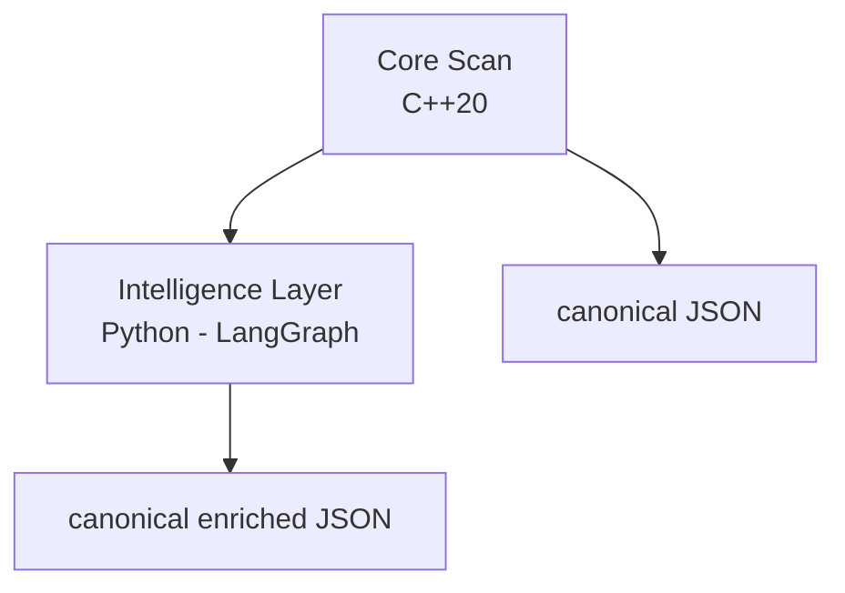
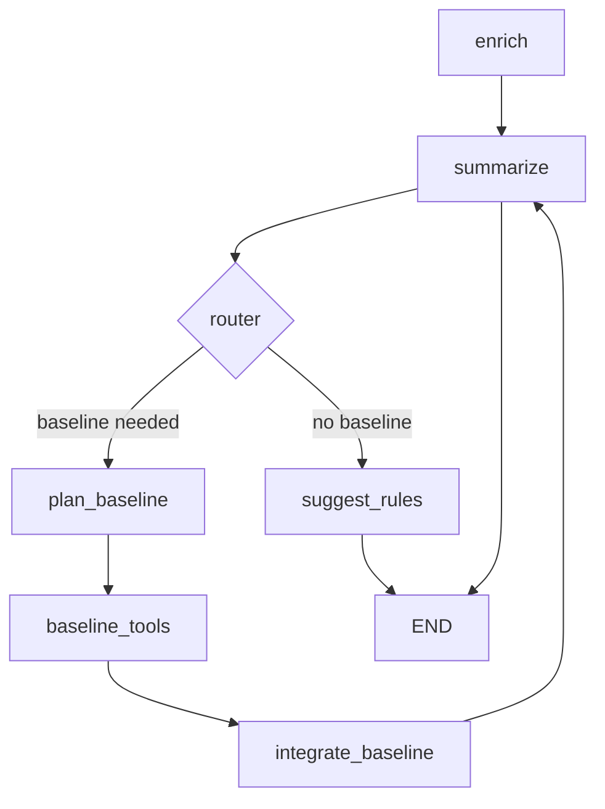

<!-- REWRITTEN ARCHITECTURE (2025) -->
# Architecture
- Report (`Report`): Thread-safe append-only container of `ScanResult` objects (mutex protected) to allow future parallelization.
- Finding model: Plain struct with `id`, `title`, `severity` (string), `description`, and sorted `metadata` map for stable output ordering.
- Config (`Config`): Parsed once in `main.cpp`, stored globally (singleton pattern via `config()` accessor). Provides feature flags & thresholds.
- JSONWriter: Builds canonical string, minifies, then optionally pretty‑prints. Adds `tool_version` and `json_schema_version` for forward compatibility. Emits optional `compliance_summary` and (when gap analysis enabled) `compliance_gaps` with remediation hint scaffolding.

## Scanner Flow
1. `ScannerRegistry::register_all_default()` pushes concrete scanner instances into an internal vector.
2. `run_all` (see implementation) calls `Report::start_scanner`, invokes `scan`, then `Report::end_scanner` capturing duration.
3. `JSONWriter` aggregates global summary (counts, timings, severities) then serializes each `ScanResult` after severity filtering (via `min_severity`).

## Current Scanners
- processes: Enumerates `/proc/*/status` & `cmdline`, optional hashing (`--process-hash`) using OpenSSL (SHA256 first 1MB) if available.
- network: Parses `/proc/net/tcp{,6}`, `/proc/net/udp{,6}` with state / listen / protocol filters; severity heuristic for exposed listeners.
- kernel_params: Snapshots selected hardening sysctls (implementation not shown here for brevity).
- modules: Either enumerates each module or summarizes (`--modules-summary`). Summary collects counts, detects out‑of‑tree signatures, unsigned modules (scans or decompresses `.ko`, `.ko.{xz,gz}`), and compressed stats.
- world_writable: Walks whitelisted directories, reports world‑writable files (exclusions via substrings).
- suid: Aggregates SUID/SGID binaries by inode, collects alternate hardlink paths & escalates severity for unusual locations.
- ioc: Heuristic Indicators of Compromise (deleted executables, execution from temp, suspicious LD_* env usage, ld.so.preload anomalies, SUID in home, temp executables, eBPF exec trace). Aggregates per executable for noise reduction, with allowlist downgrade via `--ioc-allow` / `--ioc-allow-file`.
- mac: Captures SELinux/AppArmor status, complain counts, unconfined critical processes (heuristic).
- compliance (conditional): Aggregates control pass/fail across selected standards (PCI DSS 4.0, HIPAA Security Rule, NIST CSF 2.0) and surfaces per-standard counts + score.

## Determinism & Ordering
- Scanners run sequentially in a fixed registration order to keep JSON ordering stable (facilitates diffing & caching).
- Metadata maps are copied to a vector then key-sorted before emission.

## Error Handling Philosophy
- Prefer silent skip on permission failure (e.g. unreadable `/proc` entries) but still record other findings.
- Symlink or file read issues inside a scanner do not abort the scanner; they simply omit data (future improvement: structured warning channel).

## Security Considerations
- Module scanner uses external decompress utilities (`xz -dc`, `gzip -dc`). Risk: shell invocation with module path. Paths derived from `modules.dep` under `/lib/modules/<release>` (trusted root-owned) mitigating injection risk (no user-controlled input). Future hardening: use liblzma / zlib streaming APIs directly.
- No outbound network connections are made; network scanner only reads procfs.
- Hashing limited to first 1MB for performance to avoid large memory footprint on huge binaries.

## Performance & Concurrency
- Currently single-threaded; `Report` already mutex-protected enabling future parallel scanner execution.
- Potential parallelization targets: processes + network + modules independently.
- IO patterns favor streaming and early caps (`--max-processes`, `--max-sockets`).

## Extensibility Guidelines
1. Create `<Name>Scanner.{h,cpp}` in `src/scanners/` implementing interface.
2. Add source file to `CMakeLists.txt` library list.
3. Register in `ScannerRegistry::register_all_default()` at an appropriate position (ordering impacts JSON diff stability).
4. Use concise, deterministic `Finding.id` (stable key for future suppression/correlation).
5. Keep heavy per-item metadata optional behind a config flag to control output volume.
6. For compliance extensions: isolate standard-specific control logic in dedicated registration helpers; ensure scores remain pure functions of counts (no hidden state) to preserve determinism.

## Future Refactors (Planned)
- Replace severity strings with `enum class Severity` plus central mapping for rank & JSON string emission.
- Introduce a lightweight `Result` / `expected` wrapper for file parsing to differentiate IO error vs absence.
- Structured warning channel (array) to surface non-fatal scanner errors distinct from security findings.
- Externalized remediation hint knowledge base (YAML) merged at JSONWriter layer (current hints are heuristic inline strings).
- Remove shell decompression dependency by embedding minimal xz/gzip readers.

## JSON Schema Versioning
- `json_schema_version`: Starts at "1" (post‑0.1.0). Increment on breaking structural changes (renaming keys, moving arrays, severity encoding shift). Backward-compatible additive fields do not increment.

## Data Flow Diagram (Logical)
```
CLI -> Config -> ScannerRegistry -> [Scanner Loop]
                                   |-> processes   -> Findings
                                   |-> network     -> Findings
                                   |-> modules     -> Findings
                                   |-> ... others  -> Findings
           Report(start/end aggregate timings) -----> JSONWriter -> stdout/file
```

## Known Limitations
- No structured distinction between collection errors and security findings yet.
- Severity taxonomy coarse; lacks numeric risk scoring (planned for Core; Intelligence layer adds risk_subscores & probability modeling).
- Compliance remediation hints currently heuristic; deeper mapping pending external knowledge base.

<!-- Intelligence layer section removed: repository is MIT-only on origin/main. -->
- Pretty printer is bespoke; may not preserve ordering if future nested objects added (evaluate rapidjson or nlohmann/json purely for formatting when pretty enabled).

---
## 1. Core Scanner (Open‑Core)
### Responsibilities
* Enumerate host hygiene & security surface (processes, network sockets, kernel params, modules, world‑writable paths, SUID/SGID, MAC status, optional compliance & rules) under tight performance and determinism constraints.
* Emit stable JSON (Schema v2) whose canonical form is reproducible bit‑for‑bit (ordering, formatting, optional timestamp zeroing env `SYS_SCAN_CANON_TIME_ZERO=1`).
* Provide minimal policy / filtering primitives (min severity, rules-enable) without performing multi-signal reasoning.

### Key Types & Components
| Component | Purpose |
|-----------|---------|
| `Scanner` (interface) | Pure function style `scan(Report&)` producing findings for its domain |
| `ScannerRegistry` | Ordered registration enforcing deterministic emission ordering |
| `Report` | Thread-safe (mutex) append container enabling deterministic parallel execution |
| `Finding` | Lightweight struct with id/title/severity/description + sorted metadata map |
| `JSONWriter` | Canonical builder (stable key ordering, whitespace minimization) + optional pretty printer |
| `Config` | Parsed once (singleton accessor) controlling scanner toggles & thresholds |

### Flow
```
CLI -> Config -> ScannerRegistry (ordered vector)
    -> for each Scanner: start_scanner -> scan -> end_scanner (timings)
    -> Report summary aggregation -> JSONWriter -> stdout/file
```

### Determinism Strategies
* Fixed scanner ordering.
* Sorted metadata keys before serialization.
* Optional canonical mode zeroes volatile fields (timestamps) where feasible.
* Severity filtering applied only after all scanners finish (keeps relative aggregates stable).

### Error & Security Posture
* Non-fatal read / permission errors omitted (future: structured warnings array expansion).
* Module scanner may invoke decompress utilities (`xz`, `gzip`) on root-owned paths; risk minimized by trusted path derivation. Roadmap: native decompression.
* No outbound network activity; pure procfs / filesystem enumeration.

### Extending the Core
1. Implement `<Name>Scanner.{h,cpp}` in `src/scanners/`.
2. Add to CMake library sources.
3. Register in `ScannerRegistry::register_all_default()` (position matters for diff stability).
4. Maintain stable `Finding.id` (avoid transient values such as PIDs unless essential).
5. Keep optional heavy metadata behind flags.

---
## 2. Intelligence Layer 
The Intelligence Layer consumes a raw Core report and produces an enriched artifact with correlations, rarity metrics, calibrated risk, actions, summaries, ATT&CK coverage and performance analytics. It is entirely additive and leaves the original report unchanged.

### Data Model Additions
| Model | Key Fields |
|-------|------------|
| `risk_subscores` | impact, exposure, anomaly, confidence (per finding) |
| `probability_actionable` | Logistic calibration output (0..1) |
| `correlations[]` | Rule & heuristic multi-finding relationships with predicate_hits explain map |
| `reductions` | Summaries: modules, SUID, network, top_findings/top_risks |
| `multi_host_correlation[]` | Cross-host propagation (simultaneous module emergence) |
| `followups[]` | Deterministic tool execution results (hash, package manager query) |
| `actions[]` | Prioritized remediation prompts grounded in correlations/reductions |
| `summaries` | Executive + triage narratives, metrics, ATT&CK coverage, causal hypotheses |
| `enrichment_results` | Auxiliary data: token accounting, perf snapshot, warnings |
| `integrity` | SHA256 & optional signature verification status |

### Legacy Pipeline Stages (Preserved for Reference)

The original sequential pipeline implementation has been moved to `agent/legacy/pipeline.py` and is preserved for reference. The following stages represent the legacy linear processing approach:

1. Load & Validate: size guard, UTF‑8 strict decode, JSON parse, schema (optional).  
2. Augment: host_id & scan_id derivation, tagging, risk subscore seed, host role classification (role rationale added).  
3. Knowledge Enrichment: ports, modules, SUID expectations, org attribution (YAML packs).  
4. Correlate: rule engine merges configured + default rules; exposure bonus for distinct exposure tags.  
5. Baseline Rarity: SQLite (finding first_seen, occurrence counts); anomaly scoring (new/recent/common tagging), calibration observation logging.  
6. Process Novelty: deterministic embedding & cosine distance clustering; anomaly boost for novel clusters.  
7. Temporal Sequence Correlation: e.g. new SUID followed by IP forwarding enabling => synthetic correlation.  
8. Metric Drift: z-score & early delta heuristics produce synthetic drift findings.  
9. Cross-Host Propagation: simultaneous first appearances of a module across ≥ threshold hosts => multi-host correlation & synthetic finding.  
10. Reductions: aggregate module rarity stats, SUID unexpected, network listeners, top findings with redaction.  
11. Follow-Ups & Trust: execute deterministic tool chain (hash, package manager query); downgrade severity if trusted binary hash recognized.  
12. Actions: prioritized list based on correlations/reductions (e.g., routing intent verification).  
13. Summaries: LLM summarization gated by aggregate medium+ risk + newness; redacted inputs; output narratives sanitized.  
14. ATT&CK & Causal Hypotheses: tag mapping to techniques; heuristic chain inferences (speculative).  
15. Performance & Regression: timings & counters, baseline comparison, regression listing.  
16. Canonicalize: stable ordering & JSON cleansing for reproducible hashing.  

### Policy & Governance

- Policy layer escalates severity (and impact subscore) for executables outside approved directories (config/env allowlist + default system dirs).
- Redaction filters user paths (`/home/<user>` etc.) before any LLM or summarization call.
- Risk weights & logistic calibration user-editable via CLI; stored persistently.

### Baseline Database
SQLite schema versions (current v5) track: finding rarity, module observations, metric time series, calibration observations, process clusters. EWMA metrics support smoother drift detection and future predictive heuristics.

### Process Embedding
32-dim vector: token hashed counts plus digit_ratio & token_count features; L2-normalized. Cosine distance threshold (configurable) gates novelty tagging and anomaly boost; cluster centroids derived incrementally via summed vectors.

### Rule Engine
YAML/JSON rule packs + default rule set: condition objects with field / metadata filtering; ANY or ALL logic; exposure bonus by counting unique exposure tags (listening, suid, network_port). Predicate hit labeling improves explainability.

### ATT&CK Mapping & Hypotheses
Tag→technique map in `attack_mapping.yaml`; coverage summary enumerates unique techniques & contributing tags. Hypothesis generator inspects correlation tags (`sequence_anomaly`, `module_propagation`, `metric_drift` + routing) to emit speculative, low confidence causal chains.

### Performance Telemetry
Metrics collector wraps key stages, storing count/total/avg. Regression detection compares current snapshot to saved baseline with an environment threshold (percentage). Snapshot embedded in enriched output and referenced under `meta.analytics.performance`.

### Integrity & Signing
If verification key (`AGENT_VERIFY_KEY_B64`) present, raw report signature verification performed; integrity block records digest, match flags, and errors without aborting enrichment (best-effort). Separate CLI commands for key generation, sign, and verify.

---
## 3. LangGraph DAG & Cyclical Reasoning (Canonical Implementation)

`graph_pipeline.py` and `graph.py` implement the **canonical LangGraph workflow** that serves as the default execution path for the intelligence layer. This replaces the legacy linear pipeline and provides a bounded baseline enrichment cycle:

- Entry chain: enrich -> summarize -> (router) baseline cycle or rule suggestion.
- Baseline cycle: plan_baseline -> baseline_tools -> integrate_baseline -> summarize (re-enters summarize with added context) guarded by `AGENT_MAX_SUMMARY_ITERS` (default 3) and `baseline_cycle_done` flag.
- Conditional Routing: `choose_post_summarize` decides whether additional baseline queries are needed (missing `baseline_status`) before proceeding to rule suggestion.
- Rule Suggestion: mined via `suggest_rules` after summary iterations conclude or routing short-circuits.
- Determinism Guards: iteration_count tracked; max iterations enforced; baseline cycle executed at most once; state transitions purely function-of-input under fixed environment.
- Tool Integration: Baseline queries executed through ToolNode (structured `query_baseline` tool_calls) returning structured ToolMessages integrated deterministically.

Loop pattern (current implementation):

```bash
enrich -> summarize -> plan_baseline -> baseline_tools -> integrate_baseline -> summarize -> (router) -> suggest_rules -> END
```

If no baseline context needed: `enrich -> summarize -> suggest_rules -> END`.
Environment variable `AGENT_MAX_SUMMARY_ITERS` caps summarize passes; exceeding limit appends a deterministic warning and halts further iterations.

### 3.1 Enhanced Scaffold Workflow (2025 Integration)

An enhanced, asynchronously capable workflow is now available (default when `AGENT_GRAPH_MODE=enhanced`) that wires in additional analytical and operational nodes exported from `graph_nodes_scaffold.py`.

Enhanced sequence (simplified):

```bash
enrich(enhanced) -> correlate -> risk_analyzer -> compliance_checker -> summarize(enhanced)
  -> (router choose_post_summarize: plan_baseline | suggest_rules | metrics_collector)
  -> (optional baseline cycle) -> suggest_rules(enhanced)
  -> error_handler -> human_feedback_node -> cache_manager -> metrics_collector -> END
```

Key additions:
- `enhanced_enrich_findings` / `enhanced_summarize_host_state` / `enhanced_suggest_rules`: async variants with caching, metrics, streaming flag, and optional rule refinement.
- `risk_analyzer` & `compliance_checker`: pre‑summary analytics producing `risk_assessment` and `compliance_check` blocks used downstream and surfaced in final metrics.
- Operational tail: `error_handler`, `human_feedback_node`, `cache_manager`, `metrics_collector` ensure graceful degradation, feedback integration, cache consolidation and a deterministic `final_metrics` snapshot even on early termination paths (router END is redirected through `metrics_collector`).
- Deterministic caching: enrichment cache keyed by SHA256 of canonical JSON of `raw_findings`; summary iterations tracked; cache hit metrics recorded.
- Dynamic recovery: `build_workflow()` performs a late import recovery to tolerate early import ordering issues during test discovery, ensuring enhanced nodes remain available even if the module was first imported before scaffold initialization.

Environment toggles:
- `AGENT_GRAPH_MODE=enhanced|baseline` selects enhanced vs legacy core nodes.
- `AGENT_MAX_SUMMARY_ITERS` caps summarize iterations (applies to both modes).
- `AGENT_KB_REQUIRE_SIGNATURES=1` with `AGENT_KB_PUBKEY` enforces knowledge file signature presence (adds `SignatureMissing` warnings gathered by the knowledge layer).

Metrics & Finalization:
- Each enhanced node records `*_duration` plus call counters.
- `metrics_collector` aggregates counts (suggestions, enriched, correlated), cache size, compliance standard count, risk level, provider mode, degraded flag, and total duration (if `start_time` present) into `final_metrics`.
- Early END decisions (e.g. no high‑severity findings) are routed through `metrics_collector` to guarantee consistent terminal accounting.

Fallback / Disabled Components:
- `advanced_router` and `tool_coordinator` are present in scaffold exports but intentionally not yet wired into the enhanced DAG pending a pure router refactor (current implementation returns string values which require dedicated conditional edge wiring distinct from state mutating nodes).
- The system automatically falls back to baseline sync nodes if enhanced async counterparts are unavailable.

Error & Resilience:
- All nodes defensively coerce placeholder `None` containers (introduced by graph initialization) into concrete lists/dicts before mutation to avoid `TypeError` on enhanced asynchronous paths.
- `error_handler` centralizes detection of timeout / degraded mode signals and increments structured metrics (`timeout_error_count`, etc.).

---
## 4. Canonicalization & Reproducibility Guarantees

Enriched output re-serialized into a canonical dict ordering (keys sorted; arrays left in stable constructed order) before final Pydantic model rehydration. This ensures:

- Stable hashes across environments given identical inputs, configs, weights, calibration, rule pack, baseline DB state, and versions.
- Low-noise diffs for CI gating & artifact promotion.

---
## 5. Security & Privacy Considerations
| Concern | Mitigation |
|---------|------------|
| PII leakage in summarization | Redaction of filesystem paths & user tokens; risk gate skip on low materiality |
| Untrusted rule files | Rule loading isolates directories; invalid files skipped; deterministic id hashing for missing ids |
| Novelty false positives | Distance threshold configurable; anomaly boost capped; rationale logged |
| Performance regressions | Baseline snapshot + regression detection; stage timings embedded for transparency |
| Integrity tampering | Optional signature verify; sha256 always included; warnings captured, not silent |

No external network calls by default. Optional corpus enrichment (`AGENT_LOAD_HF_CORPUS=1`) loads local cached datasets if dependencies installed; failure silent but logged as agent warning.

---
## 6. Extensibility Matrix
| Area | Add / Change | Determinism Guard Rails |
|------|--------------|-------------------------|
| New correlation heuristic | Add function before reductions | Keep ordering stable, bounded size arrays |
| New rule pack | Place YAML/JSON & update config rule_dirs | Rule merge order fixed (user then default) |
| New baseline dimension | Add table + migration increment | Schema version bump; migration idempotent |
| New embedding | Update `process_feature_vector` -> embedding hash changes manifest; consumers re-hash |
| New ATT&CK mappings | Extend YAML | Additive; no reorder of existing keys |
| Cyc reasoning loop | Insert bounded LangGraph subgraph | Deterministic convergence criteria |

---
## 7. Roadmap (Architectural)

- Native module decompression (remove shelling to `xz`,`gzip`).
- Structured warning channel in core (separate from findings).
- Bounded LangGraph iterative refinement (rule & action optimization).
- Formal provenance & SBOM correlation linking enriched findings to package metadata.

---
## 8. Diagrams

### Core → Intelligence Layer Data Flow



### Intelligence Layer Execution Paths

**Canonical LangGraph Path (Default):**


**Legacy Linear Pipeline (Preserved for Reference):**
```bash
load -> validate -> augment -> correlate -> baseline -> novelty -> sequence -> drift -> multi_host -> reduce -> followups -> actions -> summarize -> output
```

---
## 9. Known Limitations

- Core severity taxonomy still string-based (enum refactor pending).
- Rule engine matching primitive (no regex/DSL in proprietary layer—future safe expansion planned).
- Process embedding intentionally lightweight; not semantic; may miss nuanced novelty.
- ATT&CK mapping subset; coverage counts not weighted by evidentiary strength.
- Cyclical reasoning hooks present conceptually, not yet activated (ensures current determinism baseline).

---
## 10. Contact

Design proposals: open issue tagged `design`. For security disclosures follow `SECURITY.md`.

---

End of Architecture Document
